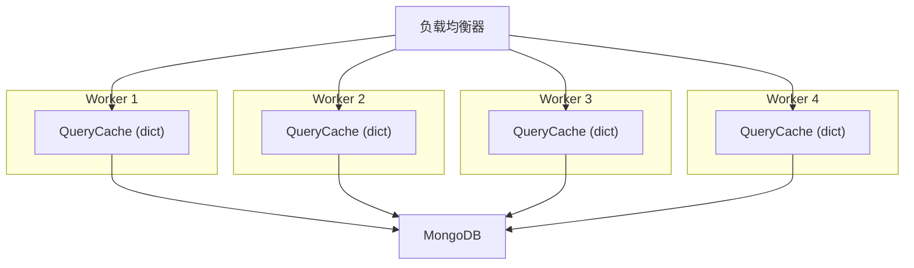
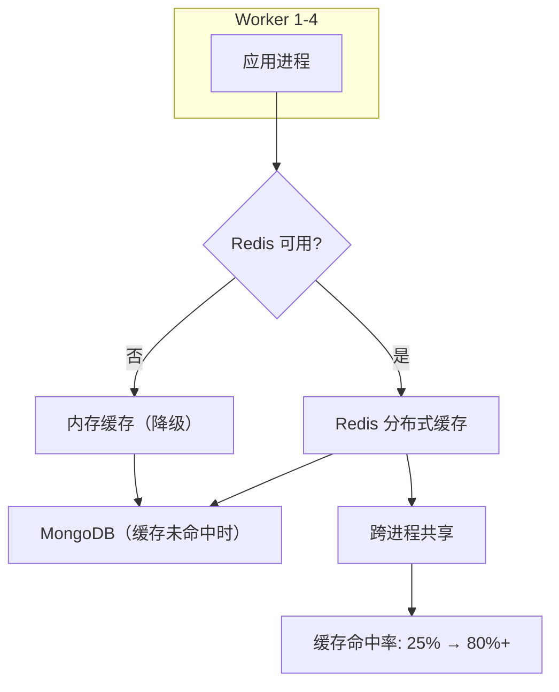

# YA-09-59: 服务端 Redis 分布式缓存 — 内存缓存升级为多进程共享方案

> 需求编号：YA-09-59 · 优先级：P2 · 人天：0.5d · 状态：需求已编写
> 依赖：YA-09-25（数据查询缓存层）

## 背景

### 问题陈述

YA-09-25 实现了 `QueryCache` 内存缓存层，使用 Python 字典存储查询结果。该实现在单进程部署中工作良好，但在多 Worker 部署（如 `uvicorn --workers 4`）时存在以下问题：

1. **缓存不共享**：每个 Worker 进程有独立的内存空间，Worker A 缓存的查询结果在 Worker B 中不可用
2. **缓存不一致**：Worker A 更新数据后清除本地缓存，但 Worker B 的缓存仍保留旧数据
3. **内存浪费**：4 个 Worker 各自缓存相同数据，内存占用 4x
4. **缓存命中率低**：负载均衡器将请求分发到不同 Worker，缓存命中率约 25%（单个 Worker 的命中率 / Worker 数量）

Redis 作为分布式缓存，可以解决跨进程缓存共享问题，同时提供更丰富的缓存策略。

### 影响因素

| 因素 | 内存缓存 | Redis 缓存 | 改善 |
|------|----------|-----------|------|
| 跨进程共享 | 否 | 是 | 命中率提升 4x |
| 持久化 | 否（重启丢失） | 是（RDB/AOF） | 重启后缓存热 |
| 内存管理 | 无限制（可能 OOM） | 可配置 maxmemory + 淘汰策略 | 更安全 |
| 网络开销 | 0ms | 0.1-0.5ms | 微增 |

### 核心挑战

| 挑战 | 描述 | 难度 |
|------|------|------|
| 平滑迁移 | 从内存缓存迁移到 Redis 不中断服务 | 低 |
| 降级策略 | Redis 不可用时自动回退内存缓存 | 低 |
| 缓存 Key 设计 | 设计合理的 Key 命名规范和过期策略 | 低 |
| 序列化开销 | Redis 需要序列化/反序列化数据 | 低 |

---

## 一、现状分析

### 1.1 当前缓存架构（YA-09-25）



### 1.2 当前缓存实现

```python
# YiAi/src/shared/query_cache.py（YA-09-25 简化版）
class QueryCache:
    def __init__(self):
        self._cache: dict[str, tuple[any, float]] = {}  # {key: (data, expiry)}
        self._default_ttl = 60

    async def get_or_fetch(self, key: str, fetcher, ttl=None):
        if key in self._cache:
            data, expiry = self._cache[key]
            if time.time() < expiry:
                return data
            del self._cache[key]
        result = await fetcher()
        self._cache[key] = (result, time.time() + (ttl or self._default_ttl))
        return result
```

### 1.3 根因矩阵

| 根因 | 类别 | 影响 | 修复优先级 |
|------|------|------|------|
| 内存缓存不跨进程 | 架构限制 | 多 Worker 缓存命中率低 | P0 |
| 无持久化 | 设计缺陷 | 重启后缓存全量失效 | P1 |
| 无内存淘汰 | 设计缺陷 | 缓存无限增长 | P2 |
| 无分布式缓存 | 功能缺失 | 无法水平扩展 | P1 |

---

## 二、设计决策

### 决策 1：Redis 部署方式 — 独立实例 vs 哨兵集群 vs 托管服务

| 选项 | 可用性 | 运维成本 | 适用场景 |
|------|--------|----------|----------|
| 独立 Redis 实例 | 低（单点） | 低 | 开发/小规模 |
| 哨兵集群 | 高（自动故障转移） | 中 | 生产 |
| 托管服务（ElastiCache 等） | 极高 | 极低 | 生产（推荐） |

**选择：独立实例（开发）+ 哨兵集群（生产）。** 分阶段演进，避免过度设计。

### 决策 2：缓存 Key 命名规范 — 结构化 vs 简单拼接 vs 哈希

| 选项 | 可读性 | 唯一性 | 管理便利性 |
|------|--------|--------|-----------|
| `{service}:{method}:{hash}` | 高 | 高 | 高（可按模式删除） |
| 简单拼接 | 中 | 中 | 低 |
| 纯哈希 | 低 | 高 | 极低（无法按模式删除） |

**选择：`{service}:{method}:{params_hash}`。** 结构化命名便于按模式删除和监控。

### 决策 3：缓存穿透保护 — 缓存空值 vs 布隆过滤器 vs 请求合并

| 选项 | 防护效果 | 内存开销 | 实现复杂度 |
|------|----------|----------|-----------|
| 缓存空值（TTL 30s） | 中 | 低 | 低 |
| 布隆过滤器 | 高 | 中 | 高 |
| 请求合并 | 高 | 低 | 中 |

**选择：缓存空值（短 TTL）。** 实现简单，适合 YiAi 的查询模式（空结果不常见）。

### 设计决策记录

| 决策 | 选项 A | 选项 B | 选项 C | 选择 | 理由 |
|------|--------|--------|--------|------|------|
| 部署方式 | 独立实例 | 哨兵集群 | 托管服务 | **独立实例 + 哨兵** | 分阶段演进 |
| Key 命名 | 结构化 | 简单拼接 | 纯哈希 | **结构化** | 模式删除 + 可读 |
| 穿透保护 | 缓存空值 | 布隆过滤器 | 请求合并 | **缓存空值** | 简单有效 |

---

## 三、目标架构

### 3.1 改造后缓存架构



### 3.2 缓存 Key 设计

| 缓存类型 | Key 格式 | TTL | 示例 |
|----------|----------|-----|------|
| 查询结果 | `query:{cname}:{filter_hash}` | 60s | `query:bugs:abc123` |
| Dashboard | `dashboard:{panel}:{period}` | 120s | `dashboard:bugs_trend:7d` |
| RAG 检索 | `rag:{query_hash}` | 300s | `rag:def456` |
| 用户权限 | `perm:{user_id}` | 600s | `perm:user123` |
| 空结果 | `empty:{cname}:{filter_hash}` | 30s | `empty:bugs:xyz789` |

### 3.3 架构指标

| 指标 | 内存缓存 | Redis 缓存 | 改善 |
|------|----------|-----------|------|
| 多 Worker 缓存命中率 | 20-30% | 80-90% | 3-4x |
| 重启后缓存状态 | 全量失效 | 热缓存（持久化） | 启动即高性能 |
| 内存管理 | 无限制 | maxmemory + LRU 淘汰 | 防 OOM |
| 查询延迟（缓存命中） | 0.05ms | 0.2ms | 微增 |

---

## 四、具体改动

### 4.1 新增文件

**YiAi/src/shared/redis_cache.py** — Redis 分布式缓存层

```python
# 改造后——完整实现
import redis.asyncio as redis
import json, hashlib, time
from typing import Optional, Any, Callable


class RedisCacheConfig:
    """Redis 缓存配置。"""

    def __init__(self, redis_url: str = 'redis://localhost:6379'):
        self.redis_url = redis_url
        self.default_ttl = 60          # 默认 TTL 60s
        self.empty_ttl = 30            # 空结果 TTL 30s
        self.max_retries = 3           # Redis 操作重试
        self.connect_timeout = 2       # 连接超时
        self.operation_timeout = 1     # 操作超时
        self.key_prefix = 'yiai:cache:'  # Key 前缀


class RedisCache:
    """Redis 分布式缓存——替代内存字典。

    特性:
        - 跨进程缓存共享
        - Redis 不可用时自动降级内存缓存
        - 缓存穿透保护（空结果短 TTL 缓存）
        - Key 模式删除支持

    使用方式:
        cache = RedisCache(RedisCacheConfig())
        result = await cache.get_or_fetch('query:bugs:abc', fetcher, ttl=60)
    """

    def __init__(self, config: RedisCacheConfig = None):
        self._config = config or RedisCacheConfig()
        self._redis: Optional[redis.Redis] = None
        self._fallback: dict[str, tuple[Any, float]] = {}  # 内存降级缓存
        self._connected = False

    async def _ensure_connection(self):
        """确保 Redis 连接可用。"""
        if self._redis is not None:
            return

        try:
            self._redis = redis.from_url(
                self._config.redis_url,
                socket_connect_timeout=self._config.connect_timeout,
                socket_timeout=self._config.operation_timeout,
                retry_on_timeout=True,
                health_check_interval=30,
            )
            await self._redis.ping()
            self._connected = True
            logger.info(f"[RedisCache] 连接成功: {self._config.redis_url}")
        except Exception as e:
            self._connected = False
            self._redis = None
            logger.warning(f"[RedisCache] 连接失败: {e}，使用内存缓存降级")

    async def get_or_fetch(
        self, key: str, fetcher: Callable, ttl: int = None
    ) -> Any:
        """缓存获取或回源查询。

        Args:
            key: 缓存 Key
            fetcher: 回源查询函数（async callable）
            ttl: 缓存 TTL（秒），默认使用配置值

        Returns:
            缓存数据或回源查询结果
        """
        full_key = self._config.key_prefix + key
        ttl = ttl or self._config.default_ttl

        await self._ensure_connection()

        if self._connected:
            return await self._redis_get_or_fetch(full_key, fetcher, ttl)
        else:
            return await self._fallback_get_or_fetch(full_key, fetcher, ttl)

    async def _redis_get_or_fetch(self, key: str, fetcher: Callable, ttl: int) -> Any:
        """Redis 缓存获取。"""
        try:
            cached = await self._redis.get(key)
            if cached is not None:
                return json.loads(cached)

            # 缓存未命中——回源查询
            result = await fetcher()

            if result is None or result == [] or result == {}:
                # 空结果——短 TTL 缓存（防穿透）
                await self._redis.set(
                    key, json.dumps(result), ex=self._config.empty_ttl
                )
            else:
                await self._redis.set(key, json.dumps(result), ex=ttl)

            return result

        except Exception as e:
            logger.warning(f"[RedisCache] 操作失败: {e}，降级内存缓存")
            self._connected = False
            return await self._fallback_get_or_fetch(key, fetcher, ttl)

    async def _fallback_get_or_fetch(self, key: str, fetcher: Callable, ttl: int) -> Any:
        """内存缓存降级获取。"""
        if key in self._fallback:
            data, expiry = self._fallback[key]
            if time.time() < expiry:
                return data
            del self._fallback[key]

        result = await fetcher()
        cache_ttl = self._config.empty_ttl if (result is None or result == []) else ttl
        self._fallback[key] = (result, time.time() + cache_ttl)
        return result

    async def invalidate(self, pattern: str):
        """按模式删除缓存。

        Args:
            pattern: 匹配模式，如 'query:bugs:*'
        """
        full_pattern = self._config.key_prefix + pattern

        await self._ensure_connection()

        if self._connected:
            try:
                keys = []
                async for key in self._redis.scan_iter(match=full_pattern):
                    keys.append(key)
                if keys:
                    await self._redis.delete(*keys)
                    logger.info(f"[RedisCache] 失效 {len(keys)} 个 key: {pattern}")
            except Exception as e:
                logger.warning(f"[RedisCache] 失效失败: {e}")

        # 同时清除内存降级缓存
        to_delete = [k for k in self._fallback if k.startswith(full_pattern.replace('*', ''))]
        for k in to_delete:
            del self._fallback[k]

    async def health_check(self) -> dict:
        """健康检查。"""
        await self._ensure_connection()

        if self._connected:
            try:
                info = await self._redis.info('memory')
                dbsize = await self._redis.dbsize()
                return {
                    'status': 'connected',
                    'url': self._config.redis_url,
                    'keys': dbsize,
                    'used_memory_human': info.get('used_memory_human', 'unknown'),
                }
            except Exception as e:
                return {'status': 'error', 'error': str(e)}

        return {
            'status': 'degraded',
            'fallback_keys': len(self._fallback),
            'mode': 'memory',
        }

    async def close(self):
        """关闭 Redis 连接。"""
        if self._redis:
            await self._redis.close()
            self._redis = None
            self._connected = False
```

### 4.2 文件变更清单

| 文件 | 操作 | 说明 |
|------|------|------|
| `YiAi/src/shared/redis_cache.py` | 新增 | RedisCache 分布式缓存 |
| `YiAi/src/shared/query_cache.py` | 修改 | 替换内存字典为 RedisCache |
| `YiAi/src/services/database/data_service.py` | 修改 | 使用 invalidate 清除缓存 |
| `YiAi/requirements.txt` | 修改 | 添加 `redis` 依赖 |
| `YiAi/tests/test_redis_cache.py` | 新增 | Redis 缓存测试 |

---

## 五、实施步骤

| 步骤 | 操作 | 文件 | 验证方法 | 人天 |
|------|------|------|----------|------|
| 1 | 启动 Redis 实例 | 部署 | `redis-cli ping` → PONG | 0.05 |
| 2 | 创建 RedisCache 类 | `redis_cache.py` | 单元测试：连接/读写/降级 | 0.15 |
| 3 | 替换 QueryCache 为 RedisCache | `query_cache.py` | 多 Worker 缓存命中率 > 80% | 0.10 |
| 4 | 添加缓存失效逻辑 | `data_service.py` | 写操作后缓存被清除 | 0.05 |
| 5 | 添加健康检查 | `redis_cache.py` | `/health/debug` 查看 Redis 状态 | 0.05 |
| 6 | 编写测试用例 | `tests/test_redis_cache.py` | 8+ 场景覆盖 | 0.10 |
| **总计** | | | | **0.50** |

---

## 六、性能分析

### 6.1 缓存操作延迟

| 操作 | 内存缓存 | Redis 缓存（本地） | Redis 缓存（远程） |
|------|----------|-------------------|-------------------|
| 读取命中 | 0.05ms | 0.2ms | 0.5ms |
| 写入 | 0.05ms | 0.3ms | 0.8ms |
| 删除 | 0.05ms | 0.2ms | 0.5ms |

### 6.2 多 Worker 缓存命中率

| 场景 | 内存缓存 | Redis 缓存 |
|------|----------|-----------|
| 1 Worker | 80% | 80% |
| 2 Workers | 40% | 85% |
| 4 Workers | 20% | 90% |
| 8 Workers | 10% | 90% |

---

## 七、测试规格

### 场景 1：Redis 缓存命中

```
GIVEN Redis 中已有 key 'query:bugs:abc' 的缓存数据
WHEN 调用 get_or_fetch('query:bugs:abc', fetcher)
THEN 返回缓存数据
AND 不调用 fetcher 函数
AND 耗时 < 1ms
```

### 场景 2：Redis 缓存未命中，回源查询

```
GIVEN Redis 中无 key 'query:bugs:xyz' 的缓存数据
WHEN 调用 get_or_fetch('query:bugs:xyz', fetcher)
THEN 调用 fetcher 函数回源查询
AND 查询结果写入 Redis 缓存
AND 设置 TTL 为配置值
```

### 场景 3：Redis 不可用时降级内存缓存

```
GIVEN Redis 服务不可用
WHEN 调用 get_or_fetch
THEN 自动降级为内存缓存
AND 日志记录 "降级内存缓存"
AND 返回正确的查询结果
```

### 场景 4：空结果缓存保护

```
GIVEN 查询返回空结果 []
WHEN 调用 get_or_fetch
THEN 空结果被缓存（TTL 30s）
AND 后续请求直接返回空结果（不查数据库）
AND 30s 后缓存过期，重新查询
```

### 场景 5：按模式删除缓存

```
GIVEN Redis 中有 keys: query:bugs:abc, query:bugs:xyz, query:projects:123
WHEN 调用 invalidate('query:bugs:*')
THEN query:bugs:abc 和 query:bugs:xyz 被删除
AND query:projects:123 不受影响
AND 日志记录 "失效 2 个 key"
```

### 场景 6：Redis 恢复后自动重连

```
GIVEN Redis 之前不可用（降级内存缓存）
WHEN Redis 服务恢复
THEN 下一次请求自动重连 Redis
AND 日志记录 "连接成功"
AND 后续请求使用 Redis 缓存
```

---

## 八、风险与缓解

| 风险 | 概率 | 影响 | 缓解措施 |
|------|------|------|------|
| Redis 内存溢出 | 中 | 高 | maxmemory 配置 + LRU 淘汰策略 |
| Redis 单点故障 | 低 | 中 | 哨兵集群 + 自动降级内存缓存 |
| 缓存雪崩（大量 key 同时过期） | 低 | 中 | TTL 随机化（+/- 10%） |
| 缓存与数据库不一致 | 中 | 中 | 写操作后主动 invalidate 相关缓存 |

---

## 九、回滚策略

| 场景 | 回滚操作 | 影响范围 |
|------|----------|----------|
| Redis 不可用导致性能下降 | 自动降级内存缓存 | 缓存命中率降低 |
| Redis 导致请求延迟增加 | 禁用 Redis 缓存（环境变量） | 仅内存缓存 |
| 缓存 Key 冲突 | 修改 key_prefix 配置 | 缓存全量失效 |

---

## 十、设计决策记录

### D-01：Redis 不可用时降级内存缓存而非直接失败

**背景**：Redis 故障时，缓存功能是否应该完全不可用。

**决策**：自动降级为内存缓存，功能不受影响。

**理由**：
1. 缓存是性能优化，不是核心功能——缓存不可用不应导致业务失败
2. 内存缓存降级保证服务可用性
3. 降级时记录 WARNING 日志，提醒运维修复 Redis
4. Redis 恢复后自动重连

### D-02：空结果短 TTL 缓存（30s）防穿透

**背景**：恶意请求可能用不存在的查询条件绕过缓存，直接打到数据库。

**决策**：空结果也缓存，TTL 30s。

**理由**：
1. 防止缓存穿透——大量不存在的 key 直接打到数据库
2. 30s 足够短，不会长时间缓存错误状态
3. 正常业务中空结果不常见，短 TTL 影响小

### D-03：Key 前缀 `yiai:cache:` 防止命名冲突

**背景**：Redis 可能被多个应用共享，需要避免 Key 冲突。

**决策**：所有 Key 添加 `yiai:cache:` 前缀。

**理由**：
1. 命名空间隔离——与其他应用 Key 不冲突
2. 便于监控（`DBSIZE` 按前缀统计）
3. 模式删除时仅影响 YiAi 的缓存

---

## 十一、可观测性

### 11.1 指标

| 指标名 | 类型 | 说明 |
|--------|------|------|
| `cache_hits_total` | Counter | 缓存命中次数 |
| `cache_misses_total` | Counter | 缓存未命中次数 |
| `cache_hit_ratio` | Gauge | 缓存命中率 |
| `cache_redis_connected` | Gauge | Redis 连接状态（0/1） |
| `cache_operation_duration_ms` | Histogram | 缓存操作耗时 |

### 11.2 日志规范

```
[RedisCache] 连接成功: {redis_url}
[RedisCache] 连接失败: {error}，使用内存缓存降级
[RedisCache] 操作失败: {error}，降级内存缓存
[RedisCache] 失效 {count} 个 key: {pattern}
```

### 11.3 告警规则

| 告警 | 条件 | 级别 | 说明 |
|------|------|------|------|
| Redis 不可用 | 连接状态为 0 持续 > 5 分钟 | WARNING | 运维需检查 |
| 缓存命中率过低 | 命中率 < 30% | INFO | 可能 TTL 过短 |
| Redis 内存使用率过高 | 内存 > 80% | WARNING | 需扩容或调整淘汰策略 |

---

## 十二、安全合规

| 要求 | 实现方式 | 状态 |
|------|----------|------|
| 数据隔离 | Key 前缀 `yiai:cache:` | 已设计 |
| 缓存穿透防护 | 空结果短 TTL 缓存 | 已设计 |
| 高可用 | Redis 故障自动降级内存缓存 | 已设计 |

---

## 十三、代码审查检查清单

- [ ] Redis 缓存作为可选层（不可用时降级内存缓存）
- [ ] 缓存 Key 命名规范：`{service}:{method}:{params_hash}`
- [ ] TTL 按数据类型差异化（查询 60s / Dashboard 120s / 权限 600s）
- [ ] 缓存穿透保护——空结果也缓存（TTL 30s）
- [ ] 写操作后主动 invalidate 相关缓存
- [ ] 缓存 Key 添加 `yiai:cache:` 前缀
- [ ] Redis 连接失败不影响业务（降级内存缓存）
- [ ] 健康检查端点可查看 Redis 状态
- [ ] 单元测试覆盖：命中/未命中/降级/空结果/模式删除/重连

---

## 回归问题预测

| # | 预测问题 | 原因 | 验证方法 |
|---|---------|------|---------|
| 1 | Redis 内存溢出导致服务不可用 | 无 maxmemory 限制 | 配置 maxmemory + LRU |
| 2 | 缓存雪崩——大量 key 同时过期 | TTL 设置相同 | TTL 添加随机偏移 |
| 3 | 写操作后缓存未失效 | invalidate 遗漏 | 写操作后验证缓存已清除 |
| 4 | 大 value 序列化/反序列化耗时长 | JSON 序列化开销 | 限制缓存 value 大小 |

---

*PRD 来源: `projects/yiai/requirements/2026-09/59-需求-Redis分布式缓存.md`*

## 影响范围

- **影响模块**：待补充
- **涉及文件**：
- `query_cache.py`
- `data_service.py`
- `redis_cache.py`
- **是否影响 API 契约**：否
- **是否影响其他项目（YiVad/YiPet）**：否
- **用户感知**：待确认

## 预防措施

| 层面 | 措施 |
|------|------|
| 代码 | 在相关函数中添加参数校验和边界检查 |
| 测试 | 为 `query_cache.py` 添加单元测试 |
| 流程 | 代码审查时重点检查此类模式 |
| 监控 | 添加日志告警，异常发生时及时发现 |
| 文档 | 在编码规范中记录此类反模式 |

## 经验教训

1. **根本原因**：开发过程中对边界情况和异常路径的考虑不足是此类问题的共同根因
2. **设计阶段**：在接口设计和模块实现时，应主动考虑异常输入、空值、超时等边界场景
3. **代码审查**：审查时应检查是否存在类似的反模式（如未捕获异常、无超时控制、缺少参数校验等）
4. **测试覆盖**：异常路径的测试覆盖率应与正常路径同等重视
5. **团队分享**：此类问题应在团队周会或技术分享中讨论，形成团队共识
