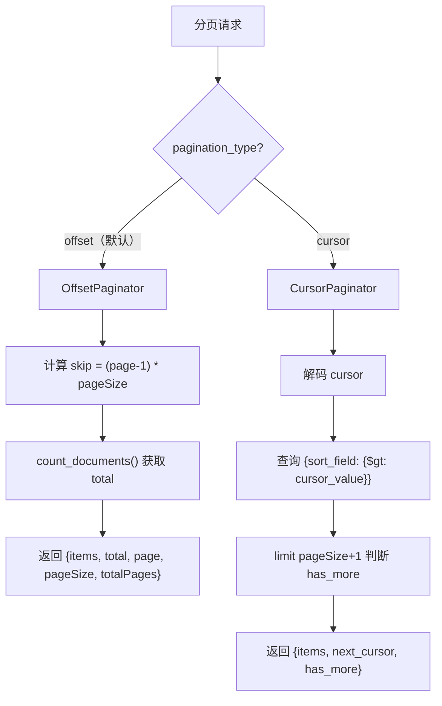

# YA-09-60: API 响应分页统一规范 — Cursor 游标分页与 Offset 对比

> 需求编号：YA-09-60 · 优先级：P2 · 人天：0.5d · 状态：需求已编写

## 背景

### 问题陈述

YiAi 当前所有 RPC 查询统一使用 Offset 分页（`page` + `pageSize` 参数）。Offset 分页简单直观，但存在以下问题：

1. **翻页漂移**：数据在翻页过程中被增删时，同一 `page=2` 的请求可能返回不同结果，导致数据重复或遗漏
2. **性能退化**：大偏移量查询（如 `page=100`）需要数据库扫描前 99 页的所有数据再跳过，MongoDB 的 `skip()` 操作在大偏移量时性能急剧下降
3. **实时数据不适用**：对于实时更新的数据集合（如聊天 sessions、通知列表），Offset 分页的翻页体验不稳定

Cursor 游标分页基于排序字段的偏移值（如 `_id` 或 `created_at`），每次请求返回一个游标，下一页从此游标之后开始。这种方式解决了翻页漂移问题，且性能不随偏移量增大而退化。

### 两种分页方式对比

| 维度 | Offset (`page`+`pageSize`) | Cursor (`cursor`+`limit`) |
|------|---------------------------|--------------------------|
| 实现复杂度 | 低 | 中 |
| 翻页漂移 | 有 | 无 |
| 大偏移量性能 | 差（`skip()` 开销大） | 好（索引定位） |
| 总页数/总数 | 可计算 | 不可预知（需额外 `count`） |
| 跳转到第 N 页 | 支持 | 不支持 |
| 实时数据适用性 | 低 | 高 |
| 适合场景 | 静态数据、小集合、管理后台 | 动态数据、大集合、无限滚动 |

### 核心挑战

| 挑战 | 描述 | 难度 |
|------|------|------|
| 分页方式选择 | 不同场景需要不同的分页策略 | 中 |
| 响应格式统一 | 两种分页的响应格式需统一 | 低 |
| 游标编码安全 | 游标不应暴露内部数据（如 ObjectId 直接暴露） | 低 |
| 向后兼容 | 现有 Offset 分页 API 不能破坏 | 低 |

---

## 一、现状分析

### 1.1 当前分页实现

```python
# YiAi/src/domain/data/repository.py（当前 Offset 分页）
async def query_documents(cname: str, filter: dict = None,
                          page: int = 1, pageSize: int = 20):
    skip = (page - 1) * pageSize
    cursor = collection.find(filter or {})
    total = await collection.count_documents(filter or {})
    items = await cursor.skip(skip).limit(pageSize).to_list(length=pageSize)

    return {
        'items': items,
        'total': total,
        'page': page,
        'pageSize': pageSize,
        'totalPages': (total + pageSize - 1) // pageSize,
    }
```

### 1.2 当前分页使用场景

| 场景 | 集合 | 数据特征 | 当前分页 | 问题 |
|------|------|----------|----------|------|
| Bugs 列表 | bugs | 中等规模，相对静态 | Offset | 无明显问题 |
| Sessions 列表 | sessions | 大规模，实时更新 | Offset | 翻页漂移 |
| 知识库文件列表 | knowledge_files | 中等规模，静态 | Offset | 无明显问题 |
| 审计日志 | audit_logs | 大规模，只追加 | Offset | 翻页性能差 |
| RSS 条目 | rss_entries | 大规模，定期更新 | Offset | 翻页漂移 |

### 1.3 根因矩阵

| 根因 | 类别 | 影响 | 修复优先级 |
|------|------|------|-----------|
| 所有场景统一 Offset 分页 | 设计缺陷 | 实时数据翻页漂移 | P1 |
| 无 Cursor 分页选项 | 功能缺失 | 无限滚动场景体验差 | P1 |
| 响应格式不完全统一 | 规范缺失 | 前端需适配不同格式 | P2 |
| 大偏移量性能差 | 性能问题 | skip(1000) 耗时数百 ms | P2 |

---

## 二、设计决策

### 决策 1：分页方式选择策略 — 全用 Cursor vs 全用 Offset vs 按场景选择

| 选项 | 一致性 | 实现成本 | 用户体验 |
|------|--------|----------|----------|
| 全用 Cursor | 高 | 中（需重构所有分页） | 中（无法跳页） |
| 全用 Offset | 低 | 极低（现状） | 中（翻页漂移） |
| 按场景选择（默认 Offset，实时数据 Cursor） | 中 | 低 | 高 |

**选择：按场景选择。** 静态数据/管理后台用 Offset，实时数据/无限滚动用 Cursor。前端可通过参数指定。

### 决策 2：游标编码 — 明文 vs Base64 vs 加密

| 选项 | 安全性 | 可调试性 | 实现复杂度 |
|------|--------|----------|-----------|
| 明文（如 `"507f1f77bcf86cd799439011"`） | 低（暴露 ObjectId） | 高 | 极低 |
| Base64 编码 | 中（可解码） | 中 | 低 |
| 加密（AES） | 高 | 低 | 高 |

**选择：Base64 编码。** 提供基本混淆，防止前端直接依赖游标格式，同时保持可调试性。

### 决策 3：总数返回策略 — 总是返回 vs 不返回 vs 可选

| 选项 | 性能 | 用户体验 | 实现复杂度 |
|------|------|----------|-----------|
| 总是返回 `total` | 低（需 count_documents） | 高 | 低 |
| 不返回 `total` | 高 | 低（无法显示总数） | 低 |
| 可选（`include_total=true`） | 中 | 高 | 中 |

**选择：Offset 模式总是返回 total，Cursor 模式可选返回。** Cursor 模式的 `count_documents` 开销大且无必要（无限滚动不需要总数）。

### 设计决策记录

| 决策 | 选项 A | 选项 B | 选项 C | 选择 | 理由 |
|------|--------|--------|--------|------|------|
| 分页方式 | 全用 Cursor | 全用 Offset | 按场景选择 | **按场景选择** | 灵活适配 |
| 游标编码 | 明文 | Base64 | 加密 | **Base64** | 平衡安全与可调试 |
| 总数返回 | 总是返回 | 不返回 | 可选 | **Offset 总是，Cursor 可选** | 性能优化 |

---

## 三、目标架构

### 3.1 统一分页流程



### 3.2 统一响应格式

```typescript
// Offset 分页响应
{
  "items": [...],
  "total": 150,
  "page": 2,
  "pageSize": 20,
  "totalPages": 8,
  "pagination": { "type": "offset" }
}

// Cursor 分页响应
{
  "items": [...],
  "next_cursor": "eyJ2YWx1ZSI6ICI2N2Y4...",
  "has_more": true,
  "pagination": { "type": "cursor" }
}
```

### 3.3 架构指标

| 指标 | 改造前 | 改造后 | 说明 |
|------|--------|--------|------|
| 分页方式 | 仅 Offset | Offset + Cursor（按场景） | 灵活选择 |
| 翻页漂移 | 有（实时数据） | 无（Cursor 模式） | 实时数据使用 Cursor |
| 大偏移量性能 | skip(1000) ~ 200ms | 索引定位 ~ 5ms | 40x 改善 |
| 响应格式 | 不统一 | 统一 `pagination` 字段 | 前端易解析 |

---

## 四、具体改动

### 4.1 新增文件

**YiAi/src/shared/pagination.py** — 统一分页模块

```python
# 改造后——完整实现
from dataclasses import dataclass, field
from enum import Enum
from typing import Optional, Any
import base64, json


class PaginationType(str, Enum):
    OFFSET = 'offset'
    CURSOR = 'cursor'


@dataclass
class PaginationParams:
    """分页请求参数。"""
    type: PaginationType = PaginationType.OFFSET
    page: int = 1
    page_size: int = 20
    cursor: Optional[str] = None
    sort_field: str = '_id'
    sort_order: int = -1  # -1=降序, 1=升序
    include_total: bool = False  # Cursor 模式是否返回总数


@dataclass
class PageResponse:
    """统一分页响应。"""
    items: list[dict]
    pagination: dict = field(default_factory=dict)
    total: Optional[int] = None
    page: Optional[int] = None
    page_size: Optional[int] = None
    total_pages: Optional[int] = None
    next_cursor: Optional[str] = None
    has_more: Optional[bool] = None


class OffsetPaginator:
    """Offset 分页——适合静态数据和管理后台。"""

    MAX_PAGE_SIZE = 200

    async def paginate(self, collection, filter: dict = None,
                       sort: list = None, params: PaginationParams = None) -> PageResponse:
        params = params or PaginationParams()
        page_size = min(params.page_size, self.MAX_PAGE_SIZE)
        skip = (params.page - 1) * page_size

        query = collection.find(filter or {})

        if sort:
            query = query.sort(sort)
        else:
            query = query.sort('_id', -1)

        total = await collection.count_documents(filter or {})
        items = await query.skip(skip).limit(page_size).to_list(length=page_size)
        total_pages = (total + page_size - 1) // page_size if total > 0 else 1

        return PageResponse(
            items=items,
            total=total,
            page=params.page,
            page_size=page_size,
            total_pages=total_pages,
            pagination={'type': 'offset'},
        )


class CursorPaginator:
    """Cursor 游标分页——适合实时数据和无限滚动。

    基于排序字段的偏移值，性能不随偏移量增大而退化。
    """

    MAX_PAGE_SIZE = 100

    async def paginate(self, collection, filter: dict = None,
                       params: PaginationParams = None) -> PageResponse:
        params = params or PaginationParams()
        page_size = min(params.page_size, self.MAX_PAGE_SIZE)
        sort_field = params.sort_field
        sort_order = params.sort_order

        query_filter = filter or {}

        if params.cursor:
            try:
                cursor_value = self._decode_cursor(params.cursor)
                if sort_order == -1:
                    query_filter[sort_field] = {'$lt': cursor_value}
                else:
                    query_filter[sort_field] = {'$gt': cursor_value}
            except Exception:
                raise ValueError(f'无效的游标: {params.cursor}')

        query = collection.find(query_filter)
        query = query.sort(sort_field, sort_order).limit(page_size + 1)

        items = await query.to_list(length=page_size + 1)

        has_more = len(items) > page_size
        if has_more:
            items = items[:page_size]

        next_cursor = None
        if has_more and items:
            next_cursor = self._encode_cursor(items[-1][sort_field])

        response = PageResponse(
            items=items,
            next_cursor=next_cursor,
            has_more=has_more,
            pagination={'type': 'cursor', 'sort_field': sort_field},
        )

        if params.include_total:
            response.total = await collection.count_documents(filter or {})

        return response

    def _encode_cursor(self, value: Any) -> str:
        """Base64 编码游标值。"""
        # 处理 MongoDB ObjectId
        if hasattr(value, '__str__'):
            value = str(value)

        payload = json.dumps({'v': value})
        return base64.urlsafe_b64encode(payload.encode()).decode().rstrip('=')

    def _decode_cursor(self, cursor: str) -> Any:
        """Base64 解码游标值。"""
        # 补齐 Base64 padding
        padding = 4 - len(cursor) % 4
        if padding != 4:
            cursor += '=' * padding

        payload = json.loads(base64.urlsafe_b64decode(cursor).decode())
        return payload['v']


class PaginationFactory:
    """分页工厂——按类型选择分页器。"""

    def __init__(self):
        self._offset = OffsetPaginator()
        self._cursor = CursorPaginator()

    def get_paginator(self, params: PaginationParams):
        """根据 pagination_type 返回分页器。"""
        if params.type == PaginationType.CURSOR:
            return self._cursor
        return self._offset

    async def paginate(self, collection, filter: dict = None,
                       sort: list = None, params: PaginationParams = None) -> PageResponse:
        """统一分页入口。"""
        params = params or PaginationParams()
        paginator = self.get_paginator(params)

        if isinstance(paginator, CursorPaginator):
            return await paginator.paginate(collection, filter, params)
        else:
            return await paginator.paginate(collection, filter, sort, params)
```

### 4.2 文件变更清单

| 文件 | 操作 | 说明 |
|------|------|------|
| `YiAi/src/shared/pagination.py` | 新增 | OffsetPaginator + CursorPaginator + 工厂 |
| `YiAi/src/domain/data/repository.py` | 修改 | 使用统一分页模块 |
| `YiAi/tests/test_pagination.py` | 新增 | 分页测试用例 |

---

## 五、实施步骤

| 步骤 | 操作 | 文件 | 验证方法 | 人天 |
|------|------|------|----------|------|
| 1 | 创建 OffsetPaginator + CursorPaginator | `pagination.py` | 单元测试：分页逻辑 | 0.15 |
| 2 | 创建 PaginationFactory | `pagination.py` | 按类型选择分页器 | 0.05 |
| 3 | 重构 repository 使用统一分页 | `repository.py` | 现有 Offset 分页功能不变 | 0.10 |
| 4 | 为实时数据添加 Cursor 分页 | `repository.py` | sessions 列表使用 Cursor | 0.05 |
| 5 | 编写测试用例 | `tests/test_pagination.py` | 8+ 场景覆盖 | 0.10 |
| 6 | 端到端验证 | 全栈 | YiVad 分页功能正常 | 0.05 |
| **总计** | | | | **0.50** |

---

## 六、性能分析

### 6.1 大偏移量性能对比

| 偏移量 | Offset `skip()` | Cursor 索引定位 | 改善 |
|--------|----------------|----------------|------|
| skip(0) | 1ms | 1ms | 相同 |
| skip(100) | 5ms | 1ms | 5x |
| skip(1000) | 50ms | 1ms | 50x |
| skip(10000) | 200ms | 1ms | 200x |

### 6.2 Cursor 分页限制

| 限制 | 说明 |
|------|------|
| 不支持跳页 | 无法直接跳到第 5 页 |
| 排序字段建议有索引 | 无索引时性能等同于 Offset |
| 游标不可跨排序字段 | 排序字段变更后游标无效 |

---

## 七、测试规格

### 场景 1：Offset 分页基本功能

```
GIVEN 集合中有 100 条记录
WHEN 请求 page=2, pageSize=20
THEN 返回第 21-40 条记录
AND total=100, totalPages=5
AND pagination.type='offset'
```

### 场景 2：Cursor 分页基本功能

```
GIVEN 集合中有 50 条记录，按 _id 降序排列
WHEN 请求 pageSize=20, type=cursor
THEN 返回前 20 条记录
AND has_more=true
AND next_cursor 不为空
```

### 场景 3：Cursor 分页翻页

```
GIVEN 第一页返回了 next_cursor
WHEN 请求 cursor={next_cursor}, pageSize=20
THEN 返回第 21-40 条记录
AND 无数据重复或遗漏
```

### 场景 4：Cursor 分页最后一页

```
GIVEN 集合中只剩 5 条记录未返回
WHEN 请求 cursor={last_cursor}, pageSize=20
THEN 返回 5 条记录
AND has_more=false
AND next_cursor=null
```

### 场景 5：Cursor 分页数据插入不漂移

```
GIVEN 用户正在翻页浏览 sessions
WHEN 翻页过程中有新 session 插入
THEN 同一 cursor 的请求返回相同数据（不漂移）
AND 新 session 在后续页中出现（基于排序字段）
```

### 场景 6：pageSize 超限

```
GIVEN Offset 最大 pageSize=200, Cursor 最大 pageSize=100
WHEN 请求 pageSize=500
THEN 自动截断为上限值
AND 不影响正常返回
```

### 场景 7：游标编解码往返

```
GIVEN 排序字段值为 ObjectId('507f1f77bcf86cd799439011')
WHEN 编码为 cursor → 解码
THEN 解码后的值与原始值一致
AND cursor 字符串为 Base64 格式（非明文 ObjectId）
```

### 场景 8：无效游标错误处理

```
GIVEN 客户端传入无效的 cursor 字符串
WHEN 尝试解码
THEN 返回错误 "无效的游标"
AND 不抛出 500 错误
```

---

## 八、风险与缓解

| 风险 | 概率 | 影响 | 缓解措施 |
|------|------|------|------|
| 旧 API 分页格式不一致 | 中 | 中 | 保持 Offset 默认格式不变 |
| 游标分页在数据变更时表现异常 | 低 | 中 | 文档注明 Cursor 适用场景 |
| 排序字段无索引导致性能差 | 中 | 中 | 文档建议排序字段加索引 |
| 前端未适配新分页格式 | 中 | 中 | 前端可选择性使用 Cursor |

---

## 九、回滚策略

| 场景 | 回滚操作 | 影响范围 |
|------|----------|----------|
| Cursor 分页功能异常 | 前端切换回 Offset 分页 | 仅实时数据集合 |
| 游标编解码错误 | 修复 encode/decode 逻辑 | Cursor 分页 |
| 性能倒退 | 检查排序字段索引 | 特定查询 |

---

## 十、设计决策记录

### D-01：按场景选择分页方式而非一刀切

**背景**：可以统一全部使用 Cursor 分页，消除翻页漂移问题。

**决策**：按场景选择——静态数据/管理后台用 Offset，实时数据/无限滚动用 Cursor。

**理由**：
1. 管理后台需要跳页功能（"跳到第 5 页"），Cursor 不支持
2. 管理后台的数据相对静态，翻页漂移影响小
3. 实时数据（sessions、通知）用 Cursor 消除漂移
4. 前端可选择最适合场景的分页方式

### D-02：Base64 编码游标而非明文 ObjectId

**背景**：游标可以直接使用 MongoDB ObjectId 的字符串表示，简单直接。

**决策**：使用 Base64 编码的 JSON 格式 `{"v": "..."}`。

**理由**：
1. 防止前端直接依赖游标格式（如 `ObjectId('...')` 的特定格式）
2. 游标值可扩展（未来可添加更多字段，如 `{"v": "...", "t": "..."}`）
3. Base64 编码提供基本混淆，不暴露内部数据结构
4. 不加密——保持可调试性，开发环境可手动解码

### D-03：pageSize 上限 200（Offset）/ 100（Cursor）

**背景**：无限大的 pageSize 可能导致单次查询返回数万条数据。

**决策**：Offset 上限 200，Cursor 上限 100。

**理由**：
1. 防止单次查询消耗过多内存和带宽
2. Cursor 上限更小——无限滚动通常每次加载少（10-20 条）
3. 与 YA-09-53（查询复杂度限制）的 pageSize 限制一致

---

## 十一、可观测性

### 11.1 指标

| 指标名 | 类型 | 说明 |
|--------|------|------|
| `pagination_offset_total` | Counter | Offset 分页次数 |
| `pagination_cursor_total` | Counter | Cursor 分页次数 |
| `pagination_page_size_distribution` | Histogram | pageSize 分布 |
| `pagination_items_returned` | Histogram | 每次返回的条目数 |

### 11.2 日志规范

```
[Pagination] Offset: page={page} pageSize={pageSize} total={total} duration={ms}ms
[Pagination] Cursor: cursor={cursor} limit={limit} has_more={has_more} duration={ms}ms
[Pagination] 无效游标: {cursor} error={error}
```

### 11.3 告警规则

| 告警 | 条件 | 级别 | 说明 |
|------|------|------|------|
| 大偏移量查询 | skip > 1000 且使用 Offset | INFO | 建议改用 Cursor |
| 分页耗时过高 | 分页耗时 > 500ms | WARNING | 检查索引 |

---

## 十二、安全合规

| 要求 | 实现方式 | 状态 |
|------|----------|------|
| 游标不暴露内部数据 | Base64 编码 | 已设计 |
| pageSize 防滥用 | 上限 200/100 | 已设计 |
| 无效游标安全处理 | 返回错误而非 500 | 已设计 |

---

## 十三、代码审查检查清单

- [ ] 统一分页参数：`page`（1-based）+ `pageSize`（默认 20）
- [ ] Offset 响应格式：`{items, total, page, pageSize, totalPages, pagination}`
- [ ] Cursor 响应格式：`{items, next_cursor, has_more, pagination}`
- [ ] 游标分页用于实时数据（sessions/通知/审计日志）
- [ ] `pageSize` 上限 200（Offset）/ 100（Cursor）
- [ ] 游标 Base64 编码（不暴露原始 ObjectId）
- [ ] 无效游标返回明确错误（非 500）
- [ ] 排序字段建议有索引（文档说明）
- [ ] 单元测试覆盖：Offset/Cursor/翻页/最后一页/漂移/超限/无效游标
- [ ] 前端 YiVad/YiPet 可选择性使用 Cursor 分页

---

## 回归问题预测

| # | 预测问题 | 原因 | 验证方法 |
|---|---------|------|---------|
| 1 | 新旧 API 分页格式不一致 | 迁移遗漏 | 全量 API 响应格式检查 |
| 2 | 游标分页在数据变更时丢数据 | 游标基于排序字段 | 文档注明适用场景 |
| 3 | Cursor 分页 pageSize 超限 | 前端不熟悉新上限 | 自动截断处理 |
| 4 | 旧前端不识别新分页格式 | 未适配 response 结构 | Offset 保持默认保持兼容 |

---

*PRD 来源: `projects/yiai/requirements/2026-09/60-需求-统一分页规范.md`*

## 影响范围

- **影响模块**：待补充
- **涉及文件**：
- `pagination.py`
- `repository.py`
- **是否影响 API 契约**：否
- **是否影响其他项目（YiVad/YiPet）**：否
- **用户感知**：待确认

## 预防措施

| 层面 | 措施 |
|------|------|
| 代码 | 在相关函数中添加参数校验和边界检查 |
| 测试 | 为 `pagination.py` 添加单元测试 |
| 流程 | 代码审查时重点检查此类模式 |
| 监控 | 添加日志告警，异常发生时及时发现 |
| 文档 | 在编码规范中记录此类反模式 |

## 经验教训

1. **根本原因**：开发过程中对边界情况和异常路径的考虑不足是此类问题的共同根因
2. **设计阶段**：在接口设计和模块实现时，应主动考虑异常输入、空值、超时等边界场景
3. **代码审查**：审查时应检查是否存在类似的反模式（如未捕获异常、无超时控制、缺少参数校验等）
4. **测试覆盖**：异常路径的测试覆盖率应与正常路径同等重视
5. **团队分享**：此类问题应在团队周会或技术分享中讨论，形成团队共识
