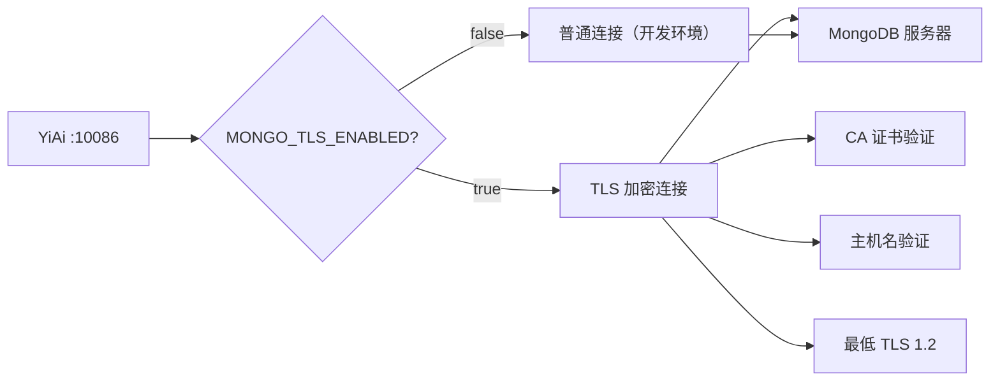

# YA-09-61: 服务端数据库连接加密 — MongoDB TLS/SSL 传输层安全

> 需求编号：YA-09-61 · 优先级：P2 · 人天：0.5d · 状态：需求已编写
> 依赖：YA-09-39（敏感信息加密）

## 背景

### 问题陈述

YiAi 与 MongoDB 之间的连接当前默认不加密。在开发环境（localhost）中这不是问题，但在以下场景中存在安全隐患：

1. **生产环境**：YiAi 和 MongoDB 不在同一台机器上时，所有数据库查询内容（包括用户数据、会话内容、Agent 敏感操作）以明文传输
2. **云环境**：使用 MongoDB Atlas 或云数据库时，数据经过公共网络
3. **零信任架构**：即使在内网，最佳实践也要求传输层加密

### 攻击面分析

| 攻击场景 | 影响 | 严重程度 |
|----------|------|----------|
| 中间人窃听 | 获取用户聊天内容、Agent 决策数据 | 高 |
| 数据篡改 | 修改数据库查询结果，注入恶意数据 | 高 |
| 凭证盗窃 | 窃取 MongoDB 认证凭证 | 高 |
| 流量分析 | 推断业务模式和用户行为 | 中 |

### 核心挑战

| 挑战 | 描述 | 难度 |
|------|------|------|
| 证书管理 | 开发环境自签名、生产环境正式 CA | 中 |
| 兼容性 | MongoDB 版本和驱动需要支持 TLS | 低 |
| 连接性能 | TLS 握手增加首次连接延迟 | 低 |
| 环境差异 | 开发/测试/生产环境证书配置不同 | 中 |

---

## 一、现状分析

### 1.1 当前连接配置

```python
# YiAi/src/domain/data/database.py（当前——无 TLS）
client = AsyncIOMotorClient(
    os.environ.get('MONGODB_URI', 'mongodb://localhost:27017'),
    minPoolSize=10,
    maxPoolSize=100,
)
```

### 1.2 当前安全状态

| 安全维度 | 当前状态 | 风险 |
|----------|----------|------|
| 传输加密 | 无 | 数据明文传输 |
| 证书验证 | 无 | 无法验证服务器身份 |
| 最低 TLS 版本 | 无 | 可能使用不安全的旧版本 |
| 主机名验证 | 无 | 可能连接伪造的服务器 |

### 1.3 根因矩阵

| 根因 | 类别 | 影响 | 修复优先级 |
|------|------|------|------|
| 无 TLS 配置 | 安全缺陷 | 数据传输未加密 | P0 |
| 无证书验证 | 安全缺陷 | 无法验证服务器身份 | P1 |
| 无环境差异化配置 | 配置缺陷 | 开发/生产使用相同配置 | P2 |

---

## 二、设计决策

### 决策 1：TLS 启用策略 — 强制启用 vs 环境可选 vs 仅生产启用

| 选项 | 安全性 | 开发便利性 | 实现复杂度 |
|------|--------|-----------|-----------|
| 强制启用 | 高 | 低（开发环境需配置证书） | 低 |
| 环境可选（通过环境变量） | 高 | 高 | 中 |
| 仅生产启用 | 中 | 高 | 低 |

**选择：环境可选，默认开发环境禁用。** 通过 `MONGO_TLS_ENABLED` 环境变量控制，开发环境默认 false，生产环境强制 true。

### 决策 2：证书验证策略 — 严格验证 vs 宽松验证 vs 无验证

| 选项 | 安全性 | 配置复杂度 | 适用场景 |
|------|--------|-----------|----------|
| 严格验证（CA + 主机名） | 高 | 中 | 生产环境 |
| 宽松验证（仅 CA，不验证主机名） | 中 | 低 | 内网 |
| 无验证（仅加密） | 低 | 极低 | 开发环境 |

**选择：按环境分层——开发环境宽松，生产环境严格。**

### 决策 3：TLS 版本要求 — 最低 1.0 vs 最低 1.2 vs 最低 1.3

| 选项 | 安全性 | 兼容性 | 性能 |
|------|--------|--------|------|
| 最低 1.0 | 低（已知漏洞） | 高 | 中 |
| 最低 1.2 | 高 | 高（MongoDB 3.0+） | 中 |
| 最低 1.3 | 最高 | 中（MongoDB 4.4+） | 高（0-RTT） |

**选择：最低 TLS 1.2。** 平衡安全性和兼容性。

### 设计决策记录

| 决策 | 选项 A | 选项 B | 选项 C | 选择 | 理由 |
|------|--------|--------|--------|------|------|
| 启用策略 | 强制启用 | 环境可选 | 仅生产 | **环境可选** | 开发便利 |
| 证书验证 | 严格 | 宽松 | 无验证 | **分层策略** | 按环境适配 |
| TLS 版本 | 1.0+ | 1.2+ | 1.3+ | **1.2+** | 安全与兼容平衡 |

---

## 三、目标架构

### 3.1 改造后 TLS 连接



### 3.2 架构指标

| 指标 | 改造前 | 改造后 | 说明 |
|------|--------|--------|------|
| 传输加密 | 无 | TLS 1.2+ | 生产环境强制 |
| 服务器身份验证 | 无 | CA 证书验证 | 防中间人 |
| 首次连接延迟 | 5ms | 15ms | TLS 握手增加 ~10ms |

---

## 四、具体改动

### 4.1 修改文件

**YiAi/src/domain/data/database.py** — 添加 TLS 配置

```python
# 改造后
import os, ssl

def _get_tls_config() -> dict:
    """获取 MongoDB TLS 配置——按环境分层。"""
    if os.environ.get('MONGO_TLS_ENABLED', '').lower() not in ('true', '1'):
        return {}

    config = {
        'tls': True,
        'tlsAllowInvalidHostnames': False,
        'tlsAllowInvalidCertificates': False,
    }

    # CA 证书
    ca_file = os.environ.get('MONGO_TLS_CA_FILE')
    if ca_file:
        config['tlsCAFile'] = ca_file

    # 客户端证书（双向 TLS）
    cert_file = os.environ.get('MONGO_TLS_CERT_FILE')
    if cert_file:
        config['tlsCertificateKeyFile'] = cert_file

    # 开发环境宽松模式
    if os.environ.get('MONGO_TLS_INSECURE', '').lower() in ('true', '1'):
        config['tlsAllowInvalidHostnames'] = True
        config['tlsAllowInvalidCertificates'] = True
        logger.warning('[Database] TLS 不安全模式——仅用于开发环境')

    return config


client = AsyncIOMotorClient(
    os.environ.get('MONGODB_URI', 'mongodb://localhost:27017'),
    minPoolSize=10,
    maxPoolSize=100,
    serverSelectionTimeoutMS=5000,
    connectTimeoutMS=5000,
    **_get_tls_config(),
)


async def check_tls_status() -> dict:
    """检查当前连接 TLS 状态——用于 /health/debug。"""
    try:
        result = await client.admin.command('connectionStatus')
        conn_info = result.get('connectionStatus', {})

        return {
            'tls_enabled': 'SSL' in str(conn_info) or 'TLS' in str(conn_info),
            'authenticated_users': result.get('authInfo', {}).get('authenticatedUsers', []),
            'server_version': result.get('version', 'unknown'),
        }
    except Exception as e:
        return {
            'tls_enabled': False,
            'error': str(e),
        }
```

### 4.2 文件变更清单

| 文件 | 操作 | 说明 |
|------|------|------|
| `YiAi/src/domain/data/database.py` | 修改 | 添加 TLS 配置 + 健康检查 |
| `YiAi/.env.example` | 修改 | 添加 TLS 相关环境变量 |
| `YiAi/scripts/generate_mongo_certs.sh` | 新增 | MongoDB TLS 证书生成脚本 |
| `YiAi/tests/test_database_tls.py` | 新增 | TLS 连接测试 |

---

## 五、实施步骤

| 步骤 | 操作 | 文件 | 验证方法 | 人天 |
|------|------|------|----------|------|
| 1 | 添加 TLS 配置函数 | `database.py` | 环境变量控制 TLS 开关 | 0.10 |
| 2 | 配置 MongoDB TLS（开发环境） | 部署 | 自签名证书 + 连接验证 | 0.10 |
| 3 | 添加 TLS 健康检查 | `database.py` | `/health/debug` 查看 TLS 状态 | 0.05 |
| 4 | 配置环境变量 | `.env.example` | 生产环境 TLS 配置文档 | 0.05 |
| 5 | 编写测试用例 | `tests/test_database_tls.py` | 4+ 场景覆盖 | 0.10 |
| 6 | 端到端验证 | 部署 | TLS 连接 + 数据传输正常 | 0.10 |
| **总计** | | | | **0.50** |

---

## 六、性能分析

### 6.1 TLS 握手开销

| 阶段 | 无 TLS | 有 TLS | 增加 |
|------|--------|--------|------|
| TCP 连接 | 3ms | 3ms | 0 |
| TLS 握手 | 0ms | 10ms | +10ms |
| 首次查询 | 5ms | 15ms | +10ms |
| 后续查询（连接池复用） | 5ms | 5ms | 0 |

### 6.2 传输数据量

| 指标 | 无 TLS | 有 TLS | 说明 |
|------|--------|--------|------|
| 传输数据量 | 相同 | +5% | TLS 记录层开销 |
| CPU 使用 | 低 | +2-5% | 加密/解密计算 |

---

## 七、测试规格

### 场景 1：TLS 禁用时正常连接

```
GIVEN MONGO_TLS_ENABLED=false
WHEN 启动服务
THEN MongoDB 连接不使用 TLS
AND 连接正常，查询功能正常
```

### 场景 2：TLS 启用时加密连接

```
GIVEN MONGO_TLS_ENABLED=true, CA 证书已配置
WHEN 连接 MongoDB
THEN 使用 TLS 1.2+ 加密连接
AND check_tls_status() 返回 tls_enabled=true
```

### 场景 3：TLS 不安全模式（开发环境）

```
GIVEN MONGO_TLS_ENABLED=true, MONGO_TLS_INSECURE=true
WHEN 使用自签名证书连接
THEN 连接成功（跳过证书验证）
AND 日志记录 WARNING "TLS 不安全模式"
```

### 场景 4：TLS 证书验证失败

```
GIVEN MONGO_TLS_ENABLED=true, MONGO_TLS_INSECURE=false
AND CA 证书不匹配
WHEN 尝试连接
THEN 连接失败
AND 错误信息包含 TLS 证书验证失败
```

### 场景 5：双向 TLS（客户端证书）

```
GIVEN 配置了客户端证书 MONGO_TLS_CERT_FILE
WHEN 连接 MongoDB
THEN 使用双向 TLS 认证
AND 连接成功
```

---

## 八、风险与缓解

| 风险 | 概率 | 影响 | 缓解措施 |
|------|------|------|------|
| 自签名证书在开发环境被拒 | 中 | 低 | MONGO_TLS_INSECURE 开关 |
| TLS 握手增加首次连接延迟 | 高 | 低 | 连接池复用 |
| 证书过期导致服务中断 | 低 | 高 | 证书到期监控告警 |
| 与旧版 MongoDB 不兼容 | 低 | 中 | 检查 MongoDB 版本 >= 3.0 |

---

## 九、回滚策略

| 场景 | 回滚操作 | 影响范围 |
|------|----------|----------|
| TLS 连接失败 | 设置 MONGO_TLS_ENABLED=false | 回退非加密连接 |
| 证书过期 | 更新证书文件，重启服务 | 短暂中断 |
| TLS 性能下降 | 评估是否需要 TLS（内网可关闭） | 传输加密 |

---

## 十、设计决策记录

### D-01：环境变量控制 TLS 而非代码硬编码

**背景**：可以在代码中硬编码 TLS 配置，但不同环境需求不同。

**决策**：通过环境变量 `MONGO_TLS_ENABLED` 控制。

**理由**：
1. 开发环境不需要 TLS（localhost），生产环境强制启用
2. 环境变量支持 Docker/K8s 注入，符合 12-factor app
3. 测试环境可灵活切换 TLS 开关

### D-02：最低 TLS 1.2，而非 1.0 或 1.3

**背景**：TLS 1.0/1.1 有已知漏洞（POODLE、BEAST），TLS 1.3 是最新版本但兼容性有限。

**决策**：最低 TLS 1.2。

**理由**：
1. TLS 1.2 无已知安全漏洞，是 PCI-DSS 合规的最低要求
2. MongoDB 3.0+ 支持 TLS 1.2，覆盖所有主流版本
3. TLS 1.3 需要 MongoDB 4.4+，兼容性不够广泛

### D-03：证书验证分层策略（开发宽松，生产严格）

**背景**：开发环境使用自签名证书，生产环境使用正式 CA 证书。

**决策**：开发环境可通过 `MONGO_TLS_INSECURE` 跳过验证，生产环境严格验证。

**理由**：
1. 开发环境自签名证书无法通过 CA 验证
2. 生产环境必须验证证书，防止中间人攻击
3. `MONGO_TLS_INSECURE` 在开发环境中默认不设置，生产环境不应设置

---

## 十一、可观测性

### 11.1 指标

| 指标名 | 类型 | 说明 |
|--------|------|------|
| `mongodb_tls_enabled` | Gauge | TLS 启用状态（0/1） |
| `mongodb_tls_handshake_duration_ms` | Histogram | TLS 握手耗时 |
| `mongodb_tls_errors_total` | Counter | TLS 连接错误数 |

### 11.2 日志规范

```
[Database] TLS 已启用: CA={ca_file} Cert={cert_file}
[Database] TLS 不安全模式——仅用于开发环境
[Database] TLS 连接失败: {error}
[Database] TLS 状态: {tls_enabled}, version={server_version}
```

### 11.3 告警规则

| 告警 | 条件 | 级别 | 说明 |
|------|------|------|------|
| TLS 证书即将过期 | 证书有效期 < 30 天 | WARNING | 需更新证书 |
| TLS 连接失败 | 连续 3 次 TLS 握手失败 | ERROR | 证书或配置问题 |
| 生产环境 TLS 未启用 | MONGO_TLS_ENABLED=false 且非开发环境 | CRITICAL | 安全风险 |

---

## 十二、安全合规

| 要求 | 实现方式 | 状态 |
|------|----------|------|
| 传输加密 | TLS 1.2+ | 已设计 |
| 证书验证 | CA 证书验证（生产环境） | 已设计 |
| 最低 TLS 版本 | 1.2（禁止 1.0/1.1） | 已设计 |
| 主机名验证 | tlsAllowInvalidHostnames=false（生产） | 已设计 |
| 双向 TLS | 可选（客户端证书） | 已设计 |

---

## 十三、代码审查检查清单

- [ ] MongoDB 连接启用 TLS/SSL 加密（生产环境）
- [ ] 证书验证：`tlsAllowInvalidCertificates=false`（生产环境）
- [ ] TLS 版本最低 1.2
- [ ] 连接字符串使用 `mongodb+srv://` 方案（Atlas）或标准 `mongodb://`
- [ ] 环境变量控制 TLS 开关（`MONGO_TLS_ENABLED`）
- [ ] 开发环境支持不安全模式（`MONGO_TLS_INSECURE`）
- [ ] TLS 状态可在 `/health/debug` 查询
- [ ] 证书路径通过环境变量配置
- [ ] 单元测试覆盖：启用/禁用/不安全模式/证书验证失败

---

## 回归问题预测

| # | 预测问题 | 原因 | 验证方法 |
|---|---------|------|---------|
| 1 | 自签名证书在开发环境被拒 | `tlsAllowInvalidCertificates` 未配置 | 开发环境测试连接 |
| 2 | TLS 握手增加首次连接延迟 | 证书校验开销 | 测量连接建立耗时 |
| 3 | 证书过期未感知 | 无到期监控 | 健康检查返回证书有效期 |
| 4 | 生产环境误用不安全模式 | 环境变量配置错误 | 生产环境检查 `MONGO_TLS_INSECURE` 未设置 |

---

*PRD 来源: `projects/yiai/requirements/2026-09/61-需求-数据库TLS加密.md`*

## 影响范围

- **影响模块**：待补充
- **涉及文件**：
- `database.py`
- **是否影响 API 契约**：否
- **是否影响其他项目（YiVad/YiPet）**：否
- **用户感知**：待确认

## 预防措施

| 层面 | 措施 |
|------|------|
| 代码 | 在相关函数中添加参数校验和边界检查 |
| 测试 | 为 `database.py` 添加单元测试 |
| 流程 | 代码审查时重点检查此类模式 |
| 监控 | 添加日志告警，异常发生时及时发现 |
| 文档 | 在编码规范中记录此类反模式 |

## 经验教训

1. **根本原因**：开发过程中对边界情况和异常路径的考虑不足是此类问题的共同根因
2. **设计阶段**：在接口设计和模块实现时，应主动考虑异常输入、空值、超时等边界场景
3. **代码审查**：审查时应检查是否存在类似的反模式（如未捕获异常、无超时控制、缺少参数校验等）
4. **测试覆盖**：异常路径的测试覆盖率应与正常路径同等重视
5. **团队分享**：此类问题应在团队周会或技术分享中讨论，形成团队共识
