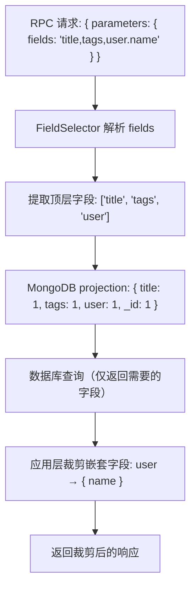

# YA-09-62: API 响应字段裁剪 — Sparse Fieldsets 按需返回优化传输

> 需求编号：YA-09-62 · 优先级：P2 · 人天：0.5d · 状态：需求已编写

## 背景

### 问题陈述

YiAi 的 `query_documents` 等 RPC 方法返回完整的 MongoDB 文档，包含所有字段。然而，前端在不同场景下只需要部分字段：

| 前端场景 | 需要的字段 | 实际返回的字段 | 浪费比例 |
|----------|-----------|--------------|----------|
| 项目列表（下拉选择） | `_id`, `key`, `name` | 20+ 字段（含 description、members、settings） | ~85% |
| Bugs 列表（表格） | `_id`, `title`, `status`, `severity` | 15+ 字段（含 content、logs、attachments） | ~75% |
| 知识库文件列表 | `_id`, `title`, `tags`, `category` | 10+ 字段（含 content、embedding） | ~70% |
| Sessions 列表 | `_id`, `title`, `updated_at` | 15+ 字段（含 messages、pageContent） | ~80% |

**影响**：
1. **带宽浪费**：Dashboard 加载 50 条 bugs 时，响应 50KB 中约 35KB 是前端不需要的字段
2. **解析开销**：前端需要解析和丢弃大量无用字段
3. **内存占用**：大字段（如 `content`、`embedding`、`messages`）在列表中不应传输

### 核心挑战

| 挑战 | 描述 | 难度 |
|------|------|------|
| 字段选择语法 | 需要简洁的字段选择语法 | 低 |
| 嵌套字段支持 | 嵌套对象字段的选择（如 `user.name`） | 中 |
| 与现有 RPC 格式兼容 | 字段选择参数需要融入 RPC 信封 | 低 |
| 必需字段保护 | `_id` 等关键字段不应被裁剪 | 低 |

---

## 一、现状分析

### 1.1 当前全字段返回

```python
# YiAi/src/domain/data/repository.py（当前——返回全部字段）
async def query_documents(cname: str, filter: dict = None, ...):
    items = await collection.find(filter or {}).to_list(length=pageSize)
    return {'items': items, ...}
    # 每个 item 包含完整文档的所有字段
```

### 1.2 典型响应体积分析

| 集合 | 全字段数量 | 平均文档大小 | 前端通常需要的字段 |
|------|-----------|-------------|------------------|
| bugs | 15 | 1KB（含 content） | 4-5 字段 |
| sessions | 15 | 5KB（含 messages） | 3-4 字段 |
| knowledge_files | 10 | 2KB（含 embedding） | 4-5 字段 |
| projects | 20 | 3KB（含 settings） | 3-5 字段 |

### 1.3 根因矩阵

| 根因 | 类别 | 影响 | 修复优先级 |
|------|------|------|-----------|
| 无字段选择机制 | 功能缺失 | 传输大量无用字段 | P0 |
| MongoDB 查询未使用 projection | 优化缺失 | 数据库层也未裁剪 | P1 |
| 前端无法声明字段需求 | 设计缺陷 | 服务端无法知道前端需要什么 | P1 |

---

## 二、设计决策

### 决策 1：字段选择语法 — JSONPath vs GraphQL-like vs 简单逗号分隔

| 选项 | 表达能力 | 解析复杂度 | 前端易用性 |
|------|----------|-----------|-----------|
| JSONPath（`$.items[*].title`） | 高 | 中 | 低 |
| GraphQL-like（`{ items { title, tags } }`） | 高 | 高 | 中 |
| 简单逗号分隔（`title,tags,status`） | 中 | 极低 | 高 |

**选择：简单逗号分隔 + 嵌套点号语法。** `title,tags,user.name,user.avatar` 足够表达大多数场景。

### 决策 2：裁剪位置 — 数据库层（projection）vs 应用层

| 选项 | 性能 | 灵活性 | 实现复杂度 |
|------|------|--------|-----------|
| 数据库层（MongoDB projection） | 高（减少 I/O） | 低（仅顶层字段） | 低 |
| 应用层（Python 字典过滤） | 中 | 高（嵌套字段） | 低 |
| 双层（数据库层 + 应用层） | 最高 | 高 | 中 |

**选择：双层裁剪。** 数据库层裁剪顶层字段（减少 I/O），应用层裁剪嵌套字段（如 `user.name`）。

### 决策 3：裁剪参数传递方式 — RPC 参数 vs URL 参数 vs Header

| 选项 | 标准化 | 缓存友好 | 与 RPC 兼容 |
|------|--------|----------|------------|
| RPC 参数（`parameters.fields`） | 低 | 中 | 高 |
| URL 参数（`?fields=title,tags`） | 高 | 高（URL 可缓存） | 中 |
| Header（`X-Fields: title,tags`） | 低 | 低 | 中 |

**选择：RPC 参数（`parameters.fields`）+ URL 参数双支持。** RPC 参数为主，URL 参数为 GET 请求提供便利。

### 设计决策记录

| 决策 | 选项 A | 选项 B | 选项 C | 选择 | 理由 |
|------|--------|--------|--------|------|------|
| 语法 | JSONPath | GraphQL-like | 逗号分隔 | **逗号分隔** | 简单够用 |
| 裁剪位置 | 数据库层 | 应用层 | 双层 | **双层** | 性能最优 |
| 参数传递 | RPC 参数 | URL 参数 | Header | **RPC + URL** | 双支持 |

---

## 三、目标架构

### 3.1 字段裁剪流程



### 3.2 架构指标

| 指标 | 改造前 | 改造后 | 说明 |
|------|--------|--------|------|
| 响应体积（50 条 bugs） | 50KB | 5-10KB | 减少 80-90% |
| 数据库 I/O | 读全部字段 | 仅读需要的字段 | 减少 I/O |
| 前端解析时间 | 解析全部字段 | 仅解析需要的字段 | 减少 CPU |
| 必选字段保护 | 无 | `_id` 始终返回 | 前端兼容性 |

---

## 四、具体改动

### 4.1 新增文件

**YiAi/src/server/field_selector.py** — 响应字段裁剪器

```python
# 改造后——完整实现
from typing import Optional, Any


class FieldSelector:
    """响应字段裁剪——基于 fields 参数按需返回。

    支持语法:
        - 简单字段: title,tags,status
        - 嵌套字段: user.name,user.avatar
        - 星号通配: *（返回所有字段，默认行为）

    使用方式:
        selector = FieldSelector()
        data = selector.select_fields(data, 'title,tags,user.name')
    """

    # 始终返回的字段（不可裁剪）
    REQUIRED_FIELDS = {'_id'}

    def select_fields(self, data: Any, fields_param: Optional[str] = None) -> Any:
        """根据 fields 参数裁剪响应数据。

        Args:
            data: 原始数据（dict 或 list[dict]）
            fields_param: 字段选择参数，如 'title,tags,user.name'

        Returns:
            裁剪后的数据
        """
        if not fields_param or fields_param.strip() == '*':
            return data

        requested = self._parse_fields(fields_param)

        if isinstance(data, list):
            return [self._filter_fields(item, requested) for item in data]
        return self._filter_fields(data, requested)

    def get_mongo_projection(self, fields_param: Optional[str] = None) -> Optional[dict]:
        """获取 MongoDB projection 参数——数据库层裁剪。

        Args:
            fields_param: 字段选择参数

        Returns:
            MongoDB projection dict，如 {'title': 1, 'tags': 1, 'user': 1}
        """
        if not fields_param or fields_param.strip() == '*':
            return None

        requested = self._parse_fields(fields_param)
        projection = {field: 1 for field in requested['top_level']}
        projection['_id'] = 1  # _id 始终返回

        return projection

    def _parse_fields(self, fields_param: str) -> dict:
        """解析字段参数——分离顶层字段和嵌套字段。

        'title,tags,user.name,user.avatar'
        → {
            'top_level': {'title', 'tags', 'user'},
            'nested': {'user': {'name', 'avatar'}},
        }
        """
        top_level = set()
        nested: dict[str, set[str]] = {}

        for field in fields_param.split(','):
            field = field.strip()
            if not field:
                continue

            if '.' in field:
                parts = field.split('.', 1)
                parent = parts[0]
                child = parts[1]
                if parent not in nested:
                    nested[parent] = set()
                nested[parent].add(child)
                top_level.add(parent)  # 同时需要顶层字段
            else:
                top_level.add(field)

        return {
            'top_level': top_level | self.REQUIRED_FIELDS,
            'nested': nested,
        }

    def _filter_fields(self, item: dict, requested: dict) -> dict:
        """裁剪单个文档的字段。"""
        if not isinstance(item, dict):
            return item

        top_level = requested['top_level']
        nested = requested['nested']
        result = {}

        for key, value in item.items():
            if key not in top_level:
                continue

            if key in nested and isinstance(value, dict):
                # 嵌套字段裁剪
                result[key] = {
                    child_key: value[child_key]
                    for child_key in nested[key]
                    if child_key in value
                }
            else:
                result[key] = value

        return result


# RPC 路由集成
@app.post("/")
async def rpc_handler(request: Request):
    body = await request.json()
    params = body.get('parameters', {})

    # 提取 fields 参数
    fields = params.pop('fields', None)  # 从 params 中移除
    result = await route_rpc(body)

    # 裁剪响应
    if fields and result.get('data'):
        result['data'] = selector.select_fields(result['data'], fields)

    return result
```

### 4.2 文件变更清单

| 文件 | 操作 | 说明 |
|------|------|------|
| `YiAi/src/server/field_selector.py` | 新增 | FieldSelector 裁剪器 |
| `YiAi/src/server/main.py` | 修改 | 集成字段裁剪到 RPC 路由 |
| `YiAi/src/domain/data/repository.py` | 修改 | 使用 MongoDB projection |
| `YiAi/tests/test_field_selector.py` | 新增 | 字段裁剪测试 |

---

## 五、实施步骤

| 步骤 | 操作 | 文件 | 验证方法 | 人天 |
|------|------|------|----------|------|
| 1 | 创建 FieldSelector | `field_selector.py` | 单元测试：解析 + 裁剪 | 0.10 |
| 2 | 集成到 RPC 路由 | `main.py` | `?fields=title,tags` 返回裁剪后数据 | 0.10 |
| 3 | 添加 MongoDB projection | `repository.py` | 数据库层裁剪验证 | 0.10 |
| 4 | 前端适配（可选） | YiVad/YiPet | 列表页添加 fields 参数 | 0.10 |
| 5 | 编写测试用例 | `tests/test_field_selector.py` | 6+ 场景覆盖 | 0.10 |
| **总计** | | | | **0.50** |

---

## 六、性能分析

### 6.1 响应体积对比

| 场景 | 全字段体积 | 裁剪后体积 | 节省 |
|------|-----------|----------|------|
| 项目列表（50 条） | 50KB | 8KB | 84% |
| Bugs 列表（50 条） | 50KB | 10KB | 80% |
| 知识库文件列表（100 条） | 80KB | 12KB | 85% |
| Sessions 列表（20 条） | 100KB | 5KB | 95% |

### 6.2 数据库 I/O 节省

| 集合 | 全字段文档大小 | 裁剪后文档大小 | I/O 节省 |
|------|-------------|-------------|----------|
| sessions（含 messages） | 5KB | 200B | 96% |
| knowledge_files（含 embedding） | 2KB | 300B | 85% |
| bugs（含 content） | 1KB | 200B | 80% |

---

## 七、测试规格

### 场景 1：简单字段裁剪

```
GIVEN 文档包含 { _id, title, tags, status, content }
WHEN 请求 fields='title,tags,status'
THEN 返回 { _id: '...', title: '...', tags: [...], status: '...' }
AND content 字段不在返回结果中
AND _id 始终返回（即使未在 fields 中指定）
```

### 场景 2：嵌套字段裁剪

```
GIVEN 文档包含 { _id, title, user: { name: 'Alice', avatar: '...', email: '...' } }
WHEN 请求 fields='title,user.name,user.avatar'
THEN 返回 { _id, title, user: { name: 'Alice', avatar: '...' } }
AND user.email 不在返回结果中
```

### 场景 3：星号通配

```
GIVEN 请求 fields='*' 或未提供 fields 参数
WHEN 执行查询
THEN 返回完整文档（所有字段）
AND 行为与改造前一致
```

### 场景 4：列表数据裁剪

```
GIVEN 查询返回 10 条文档的列表
WHEN 请求 fields='title,status'
THEN 每条文档均裁剪为 { _id, title, status }
AND 裁剪在 MongoDB 层和应用层同时生效
```

### 场景 5：MongoDB projection 验证

```
GIVEN 请求 fields='title,tags'
WHEN 执行数据库查询
THEN MongoDB find() 使用 projection { title: 1, tags: 1, _id: 1 }
AND 数据库不返回 content、embedding 等大字段
```

### 场景 6：未知字段忽略

```
GIVEN 请求 fields='title,unknown_field'
WHEN 执行裁剪
THEN title 正常返回
AND unknown_field 被忽略（不报错）
AND 行为无影响
```

---

## 八、风险与缓解

| 风险 | 概率 | 影响 | 缓解措施 |
|------|------|------|------|
| 必填字段被裁剪导致前端崩溃 | 中 | 高 | `_id` 始终返回；前端缺失字段降级处理 |
| 裁剪后响应缓存冲突 | 中 | 中 | fields 纳入缓存 key |
| 嵌套字段裁剪不完整 | 低 | 中 | 单元测试覆盖常见嵌套模式 |
| MongoDB projection 与 fields 不一致 | 低 | 中 | 应用层二次裁剪保底 |

---

## 九、回滚策略

| 场景 | 回滚操作 | 影响范围 |
|------|----------|----------|
| 前端字段缺失导致崩溃 | 前端不传 fields 参数（默认全字段） | 恢复全字段 |
| 裁剪逻辑错误 | 禁用 FieldSelector | 恢复全字段 |
| MongoDB projection 导致查询错误 | 移除 projection 参数 | 仅应用层裁剪 |

---

## 十、设计决策记录

### D-01：`_id` 始终返回，不可裁剪

**背景**：前端（Vue）使用 `_id` 作为 `v-for` 的 `key` 进行列表渲染，裁剪 `_id` 会导致渲染错误。

**决策**：`_id` 始终包含在返回结果中，即使 fields 参数中未指定。

**理由**：
1. 前端列表渲染依赖 `_id` 作为唯一标识
2. `_id` 体积小（12 bytes），不影响响应体积
3. 避免前端因 `_id` 缺失而崩溃

### D-02：双层裁剪（数据库层 + 应用层）

**背景**：MongoDB projection 可以裁剪顶层字段，但不能裁剪嵌套字段（如 `user.email`）。

**决策**：数据库层裁剪顶层字段（减少 I/O），应用层裁剪嵌套字段。

**理由**：
1. 数据库层裁剪减少 I/O——大字段（messages、content、embedding）不传输
2. 应用层裁剪嵌套字段——精确到二级字段
3. 两层互补，性能最优

### D-03：简单逗号分隔语法，不做 GraphQL 复杂度

**背景**：可以实现类似 GraphQL 的嵌套选择语法，但解析复杂度高。

**决策**：使用简单逗号分隔 + 点号嵌套语法。

**理由**：
1. 逗号分隔解析极简（`split(',')`），零额外依赖
2. 点号嵌套语法直观（`user.name`），开发者易理解
3. YiAi 的嵌套文档通常不超过 2 层，逗号+点号足够

---

## 十一、可观测性

### 11.1 指标

| 指标名 | 类型 | 说明 |
|--------|------|------|
| `field_selection_total` | Counter | 使用字段裁剪的请求数 |
| `field_selection_bytes_saved_total` | Counter | 裁剪节省的字节数 |
| `field_selection_ratio` | Gauge | 裁剪比例（裁剪后/原始体积） |

### 11.2 日志规范

```
[FieldSelector] 裁剪: fields={fields} top_level={count} nested={count}
[FieldSelector] 响应体积: {original}KB → {trimmed}KB (节省 {saved}%)
[FieldSelector] 未知字段: {field} 已忽略
```

### 11.3 告警规则

| 告警 | 条件 | 级别 | 说明 |
|------|------|------|------|
| 裁剪比例过低 | 裁剪后体积 > 原始 80% | INFO | 裁剪效果不明显 |

---

## 十二、安全合规

| 要求 | 实现方式 | 状态 |
|------|----------|------|
| 字段裁剪不泄露额外数据 | 仅返回指定字段 | 已设计 |
| 未知字段忽略 | 不报错，静默忽略 | 已设计 |
| 敏感字段不默认返回 | 服务端控制 `_id` 始终返回，其他字段由前端声明 | 已设计 |

---

## 十三、代码审查检查清单

- [ ] 客户端通过 `parameters.fields` 指定返回字段
- [ ] 服务端支持 sparse fields 裁剪（逗号分隔 + 点号嵌套）
- [ ] 嵌套字段支持 `fields=user.name,user.avatar`
- [ ] 未知字段忽略（非报错）
- [ ] `_id` 始终返回（不可裁剪）
- [ ] MongoDB projection 数据库层裁剪（减少 I/O）
- [ ] 应用层二次裁剪嵌套字段
- [ ] 星号 `*` 返回全字段（默认行为）
- [ ] 裁剪后缓存 key 包含 fields 参数
- [ ] 单元测试覆盖：简单/嵌套/通配/列表/未知字段/MongoDB projection

---

## 回归问题预测

| # | 预测问题 | 原因 | 验证方法 |
|---|---------|------|---------|
| 1 | 必填字段被裁剪导致前端崩溃 | 前端未处理字段缺失 | 最小 fields 请求测试 |
| 2 | 裁剪后响应缓存冲突 | 不同 fields 复用同一缓存 key | fields 纳入缓存 key |
| 3 | MongoDB projection 与 fields 不同步 | 解析逻辑不一致 | 对比数据库层和应用层裁剪结果 |
| 4 | 嵌套字段裁剪后父对象为空 | 所有子字段都被裁剪 | 返回空对象 `{}` 而非 `null` |

---

*PRD 来源: `projects/yiai/requirements/2026-09/62-需求-响应字段裁剪.md`*

## 影响范围

- **影响模块**：待补充
- **涉及文件**：
- `repository.py`
- `field_selector.py`
- `main.py`
- **是否影响 API 契约**：否
- **是否影响其他项目（YiVad/YiPet）**：否
- **用户感知**：待确认

## 预防措施

| 层面 | 措施 |
|------|------|
| 代码 | 在相关函数中添加参数校验和边界检查 |
| 测试 | 为 `repository.py` 添加单元测试 |
| 流程 | 代码审查时重点检查此类模式 |
| 监控 | 添加日志告警，异常发生时及时发现 |
| 文档 | 在编码规范中记录此类反模式 |

## 经验教训

1. **根本原因**：开发过程中对边界情况和异常路径的考虑不足是此类问题的共同根因
2. **设计阶段**：在接口设计和模块实现时，应主动考虑异常输入、空值、超时等边界场景
3. **代码审查**：审查时应检查是否存在类似的反模式（如未捕获异常、无超时控制、缺少参数校验等）
4. **测试覆盖**：异常路径的测试覆盖率应与正常路径同等重视
5. **团队分享**：此类问题应在团队周会或技术分享中讨论，形成团队共识
