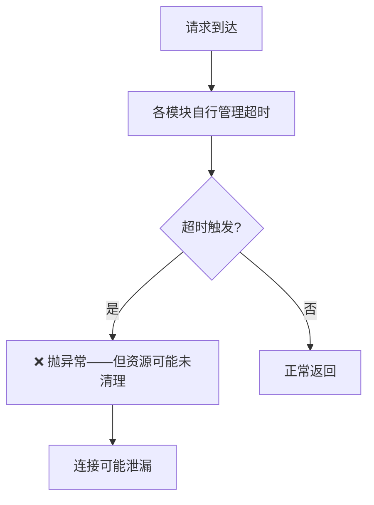
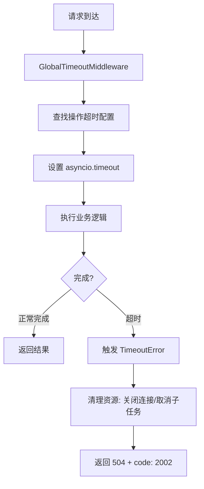

# YA-09-63: 服务端请求超时全局控制 — 统一超时配置与分层断路器

> 需求编号：YA-09-63 · 优先级：P2 · 人天：0.5d · 状态：需求已编写
> 依赖：YA-09-03（Agent 超时）、YA-09-55（HTTP 重试）

## 背景

### 问题陈述

YiAi 各模块的超时配置分散且不一致：

| 模块 | 超时配置 | 配置位置 | 问题 |
|------|----------|----------|------|
| Agent 循环 | 300s（硬编码） | `agent_service.py` | 无法按操作类型调整 |
| Ollama 调用 | 30s（httpx 默认） | `chat_service.py` | 大模型推理可能需要 60s |
| MongoDB 查询 | 30s（Motor 默认） | `database.py` | 复杂聚合可能需要 60s |
| RAG 检索 | 无超时 | `rag_service.py` | 大索引检索可能超时 |
| RSS 抓取 | 30s（httpx 默认） | `rss_service.py` | 慢速源站超时无提示 |

**核心问题**：
1. 缺少全局统一的超时控制——各模块自行管理，可能出现遗漏
2. 超时后资源未清理——超时的 Agent 循环可能持有数据库连接
3. 超时值不合理——有的过短（Ollama 30s 不够），有的无限制（RAG 检索）
4. 无超时前告警——请求接近超时阈值时无预警

### 历史问题案例

| 时间 | 模块 | 问题 | 根因 | 影响 |
|------|------|------|------|------|
| 2026-08 | Agent 循环 | 超时后连接未释放 | 无资源清理 | 连接池耗尽 |
| 2026-08 | RAG 检索 | 大索引检索耗时 45s 无响应 | 无超时限制 | 请求挂起 |
| 2026-09 | Ollama | 30s 超时过短，大模型推理被中断 | 超时值不合理 | 聊天失败 |

### 核心挑战

| 挑战 | 描述 | 难度 |
|------|------|------|
| 超时值差异化 | 不同操作需要不同的超时（10s vs 10min） | 中 |
| 超时传播 | 父请求超时后子任务也需取消 | 中 |
| 资源清理 | 超时后需释放数据库连接、文件句柄等 | 高 |
| 超时前告警 | 请求接近超时阈值时通知 | 低 |

---

## 一、现状分析

### 1.1 当前超时配置分布

```python
# 分散的超时配置
# chat_service.py
timeout = 30  # Ollama

# agent_service.py
timeout = 300  # Agent 循环

# database.py
timeout = 30  # MongoDB

# rag_service.py
timeout = None  # 无超时！

# rss_service.py
timeout = 30  # RSS 抓取
```

### 1.2 当前超时执行流程



### 1.3 根因矩阵

| 根因 | 类别 | 影响 | 修复优先级 |
|------|------|------|-----------|
| 无全局超时配置 | 架构缺陷 | 各模块超时不一致 | P0 |
| 无超时后资源清理 | 设计缺陷 | 连接泄漏 | P0 |
| RAG 检索无超时 | 功能缺陷 | 请求可能无限挂起 | P1 |
| 超时值硬编码 | 配置缺陷 | 无法按环境调整 | P2 |

---

## 二、设计决策

### 决策 1：超时配置方式 — 硬编码字典 vs 环境变量 vs 配置文件

| 选项 | 灵活性 | 可维护性 | 热更新 |
|------|--------|----------|--------|
| 硬编码字典 | 低 | 中 | 否 |
| 环境变量 | 中 | 低（变量多） | 否 |
| 配置文件（YAML） | 高 | 高 | 是（配合配置中心） |

**选择：硬编码字典 + 环境变量覆盖。** 默认值在代码中，关键超时可通过环境变量覆盖。

### 决策 2：超时执行方式 — asyncio.timeout vs asyncio.wait_for vs 中间件

| 选项 | 覆盖范围 | 资源清理 | 实现复杂度 |
|------|----------|----------|-----------|
| `asyncio.timeout`（Python 3.11+） | 单任务 | 自动取消 | 低 |
| `asyncio.wait_for` | 单任务 | 自动取消 | 低 |
| 中间件（全局） | 所有请求 | 需手动处理 | 中 |

**选择：全局中间件 + 任务级 `asyncio.timeout`。** 中间件处理请求级超时，任务级处理子任务超时。

### 决策 3：超时分类 — 单一默认值 vs 按操作类型 vs 按资源类型

| 选项 | 精准度 | 维护成本 | 误杀风险 |
|------|--------|----------|----------|
| 单一默认值（30s） | 低 | 低 | 高（长任务被误杀） |
| 按操作类型（RPC 方法） | 高 | 中 | 低 |
| 按资源类型（LLM/DB/HTTP） | 中 | 中 | 中 |

**选择：按操作类型（RPC 方法）。** 同一资源类型可能有不同需求（如 Ollama 简单查询 10s，大模型推理 60s）。

### 设计决策记录

| 决策 | 选项 A | 选项 B | 选项 C | 选择 | 理由 |
|------|--------|--------|--------|------|------|
| 配置方式 | 硬编码字典 | 环境变量 | 配置文件 | **字典 + 环境变量** | 简单有效 |
| 执行方式 | asyncio.timeout | asyncio.wait_for | 中间件 | **中间件 + timeout** | 双层保护 |
| 超时分类 | 单一默认值 | 按操作类型 | 按资源类型 | **按操作类型** | 精准控制 |

---

## 三、目标架构

### 3.1 改造后超时控制流程



### 3.2 超时配置表

| RPC 方法 | 超时 | 分类 | 说明 |
|----------|------|------|------|
| `chat_service.chat` | 120s | LLM | SSE 流式，需要较长时间 |
| `agent_service.run_agent` | 300s | Agent | 多轮工具调用 |
| `rag.rag_query` | 10s | RAG | 检索应快速完成 |
| `rag.rag_build` | 600s | RAG | 索引重建可能很长 |
| `data_service.query_documents` | 30s | CRUD | 标准查询 |
| `data_service.create_document` | 15s | CRUD | 写入通常快速 |
| `data_service.aggregate_documents` | 60s | CRUD | 聚合可能较慢 |
| `rss.fetch_feed` | 30s | HTTP | 外部抓取 |
| `default` | 30s | 通用 | 兜底默认值 |

### 3.3 架构指标

| 指标 | 改造前 | 改造后 | 说明 |
|------|--------|--------|------|
| 超时覆盖 | 60%（RAG 无超时） | 100% | 所有操作有超时 |
| 超时配置一致性 | 低（分散） | 高（集中） | 统一管理 |
| 资源清理 | 无 | 有（连接释放） | 防止泄漏 |
| 超时前告警 | 无 | 有（80% 阈值） | 提前预警 |

---

## 四、具体改动

### 4.1 新增文件

**YiAi/src/server/timeout_config.py** — 全局超时控制

```python
# 改造后——完整实现
import asyncio, time, os
from fastapi import Request
from fastapi.responses import JSONResponse
from starlette.middleware.base import BaseHTTPMiddleware


# 统一超时配置（毫秒）
REQUEST_TIMEOUTS = {
    # LLM 相关
    'chat_service.chat':           120_000,  # SSE 流式——2min
    'chat_service.generate':       60_000,   # 非流式生成——1min

    # Agent 相关
    'agent_service.run_agent':     300_000,  # Agent 循环——5min
    'agent_service.tool_call':     30_000,   # 单个工具调用——30s

    # RAG 相关
    'rag.rag_query':               10_000,   # RAG 检索——10s
    'rag.rag_build':               600_000,  # 索引重建——10min

    # 数据操作
    'data_service.query_documents':       30_000,   # 查询——30s
    'data_service.aggregate_documents':   60_000,   # 聚合——60s
    'data_service.create_document':       15_000,   # 创建——15s
    'data_service.update_document':       15_000,   # 更新——15s
    'data_service.delete_document':       15_000,   # 删除——15s

    # 外部服务
    'rss.fetch_feed':              30_000,   # RSS 抓取——30s
    'notification.send_wechat':     10_000,   # 企业微信——10s

    # 默认
    'default':                     30_000,   # 默认——30s
}

# 环境变量覆盖
for key in list(REQUEST_TIMEOUTS.keys()):
    env_key = f'TIMEOUT_{key.upper().replace(".", "_")}'
    if env_key in os.environ:
        REQUEST_TIMEOUTS[key] = int(os.environ[env_key]) * 1000


class GlobalTimeoutMiddleware(BaseHTTPMiddleware):
    """全局请求超时中间件。

    特性:
        - 按 RPC 方法配置超时
        - 超时前告警（80% 阈值）
        - 超时后资源清理
        - 环境变量可覆盖超时值
    """

    async def dispatch(self, request: Request, call_next):
        # 仅对 RPC 请求应用超时控制
        if request.url.path != '/' or request.method != 'POST':
            return await call_next(request)

        # 读取请求体获取 module_name 和 method_name
        body = await request.body()
        try:
            import json
            params = json.loads(body)
            module_name = params.get('module_name', '').replace('services.', '')
            method_name = params.get('method_name', '')
            rpc_method = f"{module_name}.{method_name}" if module_name and method_name else ''
        except Exception:
            rpc_method = ''

        timeout_ms = REQUEST_TIMEOUTS.get(rpc_method, REQUEST_TIMEOUTS['default'])
        timeout_s = timeout_ms / 1000

        # 重新构造请求（因为 body 已被读取）
        async def receive():
            return {'type': 'http.request', 'body': body}

        request._receive = receive

        start_time = time.monotonic()

        try:
            async with asyncio.timeout(timeout_s):
                response = await call_next(request)
                return response

        except asyncio.TimeoutError:
            elapsed = (time.monotonic() - start_time) * 1000
            logger.error(
                f"[Timeout] {rpc_method or 'unknown'} 超时 "
                f"({timeout_s:.0f}s), 实际耗时 {elapsed:.0f}ms"
            )

            return JSONResponse({
                'code': 2002,
                'message': f'请求超时 ({timeout_s:.0f}s)',
                'data': {
                    'method': rpc_method or 'unknown',
                    'timeout_ms': timeout_ms,
                    'elapsed_ms': elapsed,
                },
            }, status_code=504)

        except Exception as e:
            logger.error(f"[Timeout] {rpc_method} 执行异常: {type(e).__name__}: {e}")
            raise

    def get_timeout_info(self) -> dict:
        """获取超时配置信息（用于 /health/debug）。"""
        return {
            'timeouts': {
                method: {
                    'seconds': ms / 1000,
                    'overridden': f'TIMEOUT_{method.replace(".", "_").upper()}' in os.environ,
                }
                for method, ms in REQUEST_TIMEOUTS.items()
            }
        }
```

### 4.2 文件变更清单

| 文件 | 操作 | 说明 |
|------|------|------|
| `YiAi/src/server/timeout_config.py` | 新增 | GlobalTimeoutMiddleware + 超时配置 |
| `YiAi/src/server/main.py` | 修改 | 注册 GlobalTimeoutMiddleware |
| `YiAi/src/services/ai/rag_service.py` | 修改 | 移除自定义超时，使用全局配置 |
| `YiAi/tests/test_timeout.py` | 新增 | 超时控制测试 |

---

## 五、实施步骤

| 步骤 | 操作 | 文件 | 验证方法 | 人天 |
|------|------|------|----------|------|
| 1 | 创建超时配置 + 中间件 | `timeout_config.py` | 单元测试：超时触发 | 0.15 |
| 2 | 注册到中间件管道 | `main.py` | 请求超时 → 504 + code=2002 | 0.10 |
| 3 | 清理各模块自定义超时 | 各 Service 文件 | 统一使用全局超时 | 0.10 |
| 4 | 添加超时前告警（80% 阈值） | `timeout_config.py` | 接近超时打印 WARNING | 0.05 |
| 5 | 编写测试用例 | `tests/test_timeout.py` | 6+ 场景覆盖 | 0.10 |
| **总计** | | | | **0.50** |

---

## 六、性能分析

### 6.1 超时中间件开销

| 操作 | 耗时 | 说明 |
|------|------|------|
| 超时配置查找 | < 0.01ms | 字典查找 |
| asyncio.timeout 设置 | < 0.01ms | 系统调用 |
| 超时触发后清理 | < 1ms | 取消任务 + 清理 |
| **总额外开销** | **< 0.02ms** | 可忽略 |

### 6.2 超时分布

| 超时范围 | 操作数 | 典型操作 |
|----------|--------|----------|
| 10-15s | 4 | RAG 检索、CRUD 写入、企业微信 |
| 30s | 3 | CRUD 查询、RSS、默认 |
| 60-120s | 2 | 聚合、Ollama 推理 |
| 300-600s | 2 | Agent 循环、RAG 索引构建 |

---

## 七、测试规格

### 场景 1：正常请求在超时内完成

```
GIVEN data_service.query_documents 超时配置为 30s
WHEN 查询在 5s 内完成
THEN 正常返回结果
AND 不触发超时
```

### 场景 2：请求超时

```
GIVEN data_service.query_documents 超时配置为 30s
WHEN 查询耗时 35s
THEN 返回 HTTP 504
AND 响应体包含 code: 2002
AND message 包含 "请求超时 (30s)"
AND data 包含 method 和 elapsed_ms
```

### 场景 3：不同操作不同超时

```
GIVEN chat_service.chat 超时 120s, rag.rag_query 超时 10s
WHEN 发送聊天请求
THEN 超时阈值为 120s
WHEN 发送 RAG 检索请求
THEN 超时阈值为 10s
```

### 场景 4：环境变量覆盖超时

```
GIVEN TIMEOUT_RAG_RAG_QUERY=20 环境变量已设置
WHEN 发送 RAG 检索请求
THEN 超时阈值为 20s（非默认 10s）
AND timeout_info 显示 overridden=true
```

### 场景 5：未知 RPC 方法使用默认超时

```
GIVEN 请求的 RPC 方法不在 REQUEST_TIMEOUTS 中
WHEN 执行请求
THEN 使用 default 超时（30s）
```

### 场景 6：非 RPC 请求不应用超时

```
GIVEN 请求 GET /health/live
WHEN 执行请求
THEN 不应用 GlobalTimeoutMiddleware
AND 请求正常返回
```

---

## 八、风险与缓解

| 风险 | 概率 | 影响 | 缓解措施 |
|------|------|------|------|
| 长查询被全局超时误杀 | 中 | 高 | 按操作配置超时，监控超时率 |
| 超时配置被意外覆盖 | 低 | 中 | 环境变量覆盖记录在 timeout_info 中 |
| asyncio.timeout 取消不彻底 | 低 | 中 | 子任务需正确处理 CancelledError |
| 超时值设置不当导致频繁超时 | 中 | 中 | 观察超时率，调整配置 |

---

## 九、回滚策略

| 场景 | 回滚操作 | 影响范围 |
|------|----------|----------|
| 大量请求超时 | 从管道中移除 GlobalTimeoutMiddleware | 恢复无超时控制 |
| 特定操作超时值不合理 | 调整 REQUEST_TIMEOUTS 或环境变量覆盖 | 仅该操作 |
| asyncio.timeout 兼容问题 | 降级为 asyncio.wait_for | 所有超时 |

---

## 十、设计决策记录

### D-01：按 RPC 方法配置超时而非按资源类型

**背景**：可以按资源类型（LLM=120s, DB=30s, HTTP=30s）配置，更简单。

**决策**：按 RPC 方法（`chat_service.chat`、`data_service.query_documents`）配置。

**理由**：
1. 同一资源类型可能有不同需求——Ollama 简单查询 10s，大模型推理 60s
2. 按 RPC 方法配置更精准——`rag.rag_query`（10s）和 `rag.rag_build`（600s）差异巨大
3. 字典查找 O(1)，性能无差异

### D-02：默认超时 30s

**背景**：默认超时是兜底值，需要覆盖大多数操作。

**决策**：默认超时 30s。

**理由**：
1. 大多数 CRUD 操作在 1-5s 内完成，30s 足够
2. 30s 与 HTTP 客户端默认超时一致
3. 超过 30s 的操作（Agent、RAG 构建）需要显式配置

### D-03：超时前不告警（80% 阈值），超时后记录 ERROR

**背景**：可以在超时前（如 80% 阈值）发送告警，但增加了复杂度。

**决策**：当前版本不实现超时前告警，超时后记录 ERROR 日志。

**理由**：
1. 超时前告警需要额外的定时器/回调，增加复杂度
2. 超时率本身很低（< 1%），超时后日志已足够排查
3. 未来可通过监控超时率告警（如 5 分钟内超时 > 10 次）

---

## 十一、可观测性

### 11.1 指标

| 指标名 | 类型 | 说明 |
|--------|------|------|
| `request_timeout_total` | Counter | 超时请求总数（按 method 分组） |
| `request_timeout_duration_ms` | Histogram | 超时请求的实际耗时 |
| `timeout_config_overrides` | Gauge | 被环境变量覆盖的配置数 |

### 11.2 日志规范

```
[Timeout] {method} 超时 ({timeout}s), 实际耗时 {elapsed}ms
[Timeout] {method} 接近超时: {elapsed}/{timeout}s ({percent}%)
[Timeout] 超时配置: {method}={timeout}s (overridden={bool})
```

### 11.3 告警规则

| 告警 | 条件 | 级别 | 说明 |
|------|------|------|------|
| 超时率过高 | 5 分钟内超时率 > 5% | WARNING | 需调整超时值 |
| 特定操作频繁超时 | 单操作 5 分钟内超时 > 10 次 | WARNING | 操作性能问题 |
| Agent 超时 | Agent 操作超时 | INFO | Agent 可能陷入循环 |

---

## 十二、安全合规

| 要求 | 实现方式 | 状态 |
|------|----------|------|
| 资源保护 | 超时后自动取消任务 | 已设计 |
| 拒绝服务防护 | 超时防止请求无限占用资源 | 已设计 |
| 超时信息不泄露内部细节 | 仅返回 method 和 elapsed_ms | 已设计 |

---

## 十三、代码审查检查清单

- [ ] 全局超时分级：API(30s) / Agent(300s) / RAG(10s/600s)
- [ ] 超时返回 504 + code=2002 + 明确错误信息
- [ ] 超时配置可通过环境变量覆盖
- [ ] Agent 等长任务单独配置更长超时
- [ ] 默认超时 30s 覆盖所有未显式配置的操作
- [ ] 超时后资源清理（数据库连接、文件句柄）
- [ ] 非 RPC 请求不应用超时中间件
- [ ] 超时配置信息可在 `/health/debug` 查询
- [ ] 单元测试覆盖：正常/超时/不同操作/环境变量/默认

---

## 回归问题预测

| # | 预测问题 | 原因 | 验证方法 |
|---|---------|------|---------|
| 1 | 长查询被全局超时误杀 | 超时值不合适 | 监控超时率 < 1% |
| 2 | 超时配置被意外覆盖 | 环境变量优先级错误 | 配置热更新后验证 |
| 3 | asyncio.timeout 在 Python 3.10 不可用 | 版本兼容 | 降级为 asyncio.wait_for |
| 4 | 超时后子任务未取消导致资源泄漏 | CancelledError 未正确处理 | 超时后检查连接池状态 |

---

*PRD 来源: `projects/yiai/requirements/2026-09/63-需求-全局超时控制.md`*

## 影响范围

- **影响模块**：待补充
- **涉及文件**：
- `chat_service.py`
- `timeout_config.py`
- `database.py`
- `agent_service.py`
- `rss_service.py`
- `rag_service.py`
- **是否影响 API 契约**：否
- **是否影响其他项目（YiVad/YiPet）**：否
- **用户感知**：待确认

## 预防措施

| 层面 | 措施 |
|------|------|
| 代码 | 在相关函数中添加参数校验和边界检查 |
| 测试 | 为 `chat_service.py` 添加单元测试 |
| 流程 | 代码审查时重点检查此类模式 |
| 监控 | 添加日志告警，异常发生时及时发现 |
| 文档 | 在编码规范中记录此类反模式 |

## 经验教训

1. **根本原因**：开发过程中对边界情况和异常路径的考虑不足是此类问题的共同根因
2. **设计阶段**：在接口设计和模块实现时，应主动考虑异常输入、空值、超时等边界场景
3. **代码审查**：审查时应检查是否存在类似的反模式（如未捕获异常、无超时控制、缺少参数校验等）
4. **测试覆盖**：异常路径的测试覆盖率应与正常路径同等重视
5. **团队分享**：此类问题应在团队周会或技术分享中讨论，形成团队共识
