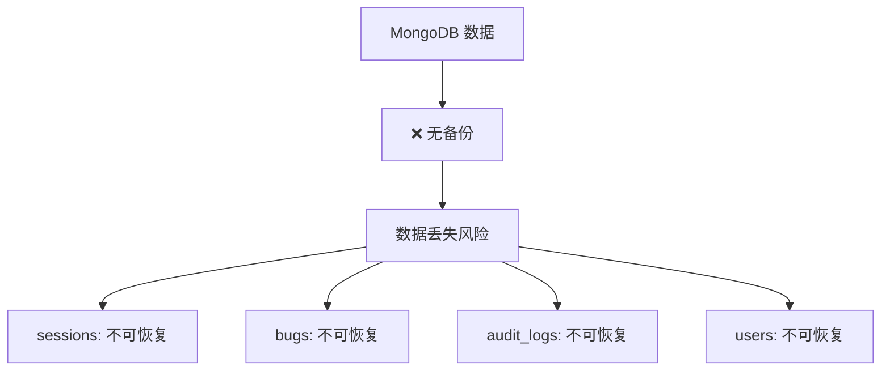
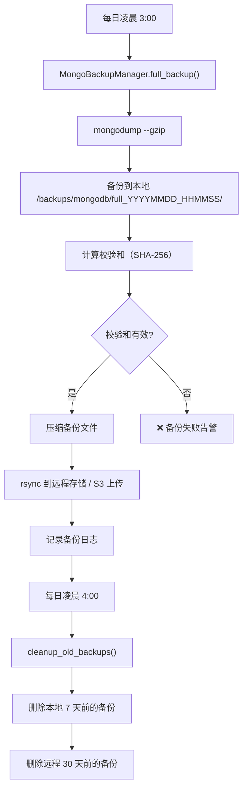

# YA-09-64: 服务端数据备份自动化 — MongoDB 定时快照与异地容灾

> 需求编号：YA-09-64 · 优先级：P2 · 人天：0.5d · 状态：需求已编写

## 背景

### 问题陈述

YiAi 的 MongoDB 存储了所有业务数据（sessions、bugs、审计日志、知识库文件元数据、用户数据、RSS 条目等），但当前无任何自动化备份机制。

YiKnowledge 的 Git 仓库提供了知识库文件的数据源（YK-09-12），但 YiAi 自身的 MongoDB 数据——包括用户聊天记录、Agent 决策历史、bug 追踪数据、审计日志——一旦丢失将不可恢复。

### 数据重要性分析

| 数据集 | 重要性 | 丢失影响 | 恢复难度 |
|--------|--------|----------|----------|
| sessions（聊天记录） | 高 | 用户历史聊天丢失 | 不可恢复 |
| bugs（缺陷追踪） | 高 | 开发流程数据丢失 | 不可恢复 |
| audit_logs（审计日志） | 高 | 合规审计无法进行 | 不可恢复 |
| knowledge_files（文件元数据） | 中 | 可从 YiKnowledge 重建 | 可重建（耗时） |
| users（用户数据） | 高 | 用户无法登录 | 不可恢复 |
| rss_entries（RSS 条目） | 低 | 可从 RSS 源重新抓取 | 可重建 |
| 遥测数据 | 中 | 使用统计丢失 | 不可恢复 |

### 核心挑战

| 挑战 | 描述 | 难度 |
|------|------|------|
| 备份一致性 | 备份过程中数据可能被修改 | 中 |
| 备份性能影响 | mongodump 可能影响数据库性能 | 中 |
| 异地存储 | 本地备份无法抵御物理故障 | 中 |
| 备份验证 | 备份文件可能损坏而未被发现 | 中 |
| 保留策略 | 如何平衡存储成本和恢复能力 | 低 |

---

## 一、现状分析

### 1.1 当前数据保护状态



### 1.2 当前数据量估算

| 集合 | 估计文档数 | 估计大小 | 增长速度 |
|------|-----------|----------|----------|
| sessions | 1000+ | 50MB | 中（每天新增 10-20 条） |
| bugs | 500+ | 5MB | 低（每天新增 1-5 条） |
| knowledge_files | 200+ | 10MB | 低（随知识库增长） |
| users | 10+ | 1MB | 极低 |
| audit_logs | 1000+ | 5MB | 中（每次操作 1 条） |
| **总计** | | **~70MB** | 低增长 |

### 1.3 根因矩阵

| 根因 | 类别 | 影响 | 修复优先级 |
|------|------|------|------|
| 无备份机制 | 运维缺陷 | 数据丢失不可恢复 | P0 |
| 无异地存储 | 运维缺陷 | 本地故障导致备份丢失 | P1 |
| 无备份验证 | 运维缺陷 | 备份损坏无法发现 | P2 |
| 无恢复演练 | 流程缺陷 | 恢复流程未验证 | P2 |

---

## 二、设计决策

### 决策 1：备份方式 — mongodump vs 文件系统快照 vs oplog 实时备份

| 选项 | 一致性 | 性能影响 | 恢复速度 | 存储成本 |
|------|--------|----------|----------|----------|
| mongodump（逻辑备份） | 高（可指定时间点） | 中（需遍历数据） | 中 | 中 |
| 文件系统快照（LVM/ZFS） | 高（瞬时） | 低 | 快 | 高 |
| oplog 实时备份（PITR） | 最高（任意时间点） | 低 | 中 | 中 |

**选择：mongodump（当前阶段）+ oplog 备份（未来）。** mongodump 最简单，适合小数据量。数据量增长后可升级为 oplog 实时备份。

### 决策 2：备份频率 — 实时 vs 每小时 vs 每日

| 选项 | 数据安全性 | 存储成本 | 性能影响 |
|------|-----------|----------|----------|
| 实时（oplog） | 最高（RPO ≈ 0） | 高 | 低 |
| 每小时 | 高（RPO ≤ 1h） | 中 | 中 |
| 每日 | 中（RPO ≤ 24h） | 低 | 低 |

**选择：每日全量备份（凌晨 3 点）+ 按需手动备份。** 数据量小，每日备份足够。

### 决策 3：异地存储 — 本地磁盘 vs rsync vs S3/OSS

| 选项 | 灾备能力 | 存储成本 | 实现复杂度 |
|------|----------|----------|-----------|
| 本地磁盘 | 低（无法抵御物理故障） | 低 | 极低 |
| rsync 到远程服务器 | 高 | 中 | 低 |
| S3/OSS 对象存储 | 最高（多 AZ 冗余） | 低（按量付费） | 中 |

**选择：本地 + rsync/S3 双存储。** 本地保留最近 7 天，远程保留 30 天。

### 设计决策记录

| 决策 | 选项 A | 选项 B | 选项 C | 选择 | 理由 |
|------|--------|--------|--------|------|------|
| 备份方式 | mongodump | 文件快照 | oplog | **mongodump** | 简单，适合小数据量 |
| 备份频率 | 实时 | 每小时 | 每日 | **每日** | 数据量小，日备足够 |
| 异地存储 | 本地磁盘 | rsync | S3/OSS | **本地 + S3** | 兼顾恢复速度和灾备 |

---

## 三、目标架构

### 3.1 备份流程



### 3.2 保留策略

| 级别 | 保留时间 | 存储位置 | 用途 |
|------|----------|----------|------|
| 每日备份 | 7 天 | 本地磁盘 | 快速恢复 |
| 每日备份 | 30 天 | 远程存储（S3/rsync） | 灾备恢复 |
| 每周备份 | 90 天 | 远程存储 | 长期归档 |

### 3.3 架构指标

| 指标 | 改造前 | 改造后 | 说明 |
|------|--------|--------|------|
| RPO（恢复点目标） | N/A（无备份） | ≤ 24h | 每日备份 |
| RTO（恢复时间目标） | N/A | ≤ 30min | mongorestore 恢复 |
| 备份自动化 | 无 | 全自动 | 定时任务 |
| 备份验证 | 无 | 校验和 + 定期恢复演练 | 确保可用 |

---

## 四、具体改动

### 4.1 新增文件

**YiAi/tools/backup.py** — MongoDB 备份管理

```python
# 改造后——完整实现
import subprocess, os, datetime, shutil, hashlib
from pathlib import Path
from typing import Optional


class MongoBackupManager:
    """MongoDB 定时备份——mongodump + 异地同步。

    备份策略:
        - 每日凌晨 3 点全量备份
        - 本地保留 7 天
        - 远程保留 30 天
        - SHA-256 校验和验证

    使用方式:
        manager = MongoBackupManager()
        result = await manager.full_backup()
    """

    BACKUP_DIR = Path(os.environ.get('BACKUP_LOCAL_DIR', '/backups/mongodb'))
    RETENTION_DAYS_LOCAL = 7
    RETENTION_DAYS_REMOTE = 30

    def __init__(self):
        self._mongodb_uri = os.environ.get('MONGODB_URI', 'mongodb://localhost:27017')
        self._remote_target = os.environ.get('BACKUP_REMOTE_TARGET')  # rsync 目标或 S3 URI
        self._backup_dir = self.BACKUP_DIR
        self._backup_dir.mkdir(parents=True, exist_ok=True)

    async def full_backup(self) -> dict:
        """全量备份——mongodump 导出所有集合。

        Returns:
            {'success': bool, 'path': str, 'size_mb': float, 'checksum': str}
        """
        timestamp = datetime.datetime.utcnow().strftime('%Y%m%d_%H%M%S')
        backup_path = self._backup_dir / f'full_{timestamp}'
        backup_path.mkdir(parents=True, exist_ok=True)

        try:
            # Step 1: mongodump
            result = subprocess.run([
                'mongodump',
                '--uri', self._mongodb_uri,
                '--out', str(backup_path),
                '--gzip',                     # 压缩
            ], capture_output=True, text=True, timeout=600)

            if result.returncode != 0:
                return {
                    'success': False,
                    'error': f'mongodump 失败: {result.stderr}',
                    'path': str(backup_path),
                }

            # Step 2: 计算校验和
            checksum = self._calculate_checksum(backup_path)

            # Step 3: 压缩备份目录
            archive_path = backup_path.with_suffix('.tar.gz')
            subprocess.run([
                'tar', '-czf', str(archive_path),
                '-C', str(backup_path.parent),
                backup_path.name,
            ], check=True, timeout=300)

            # Step 4: 计算压缩后大小
            size_mb = archive_path.stat().st_size / (1024 * 1024)

            # Step 5: 异地同步
            if self._remote_target:
                sync_result = await self._sync_to_remote(archive_path)
            else:
                sync_result = {'synced': False, 'reason': '未配置远程目标'}

            logger.info(
                f"[Backup] 全量备份完成: {archive_path.name} "
                f"({size_mb:.1f}MB, checksum={checksum[:8]}...)"
            )

            return {
                'success': True,
                'path': str(archive_path),
                'size_mb': round(size_mb, 2),
                'checksum': checksum,
                'remote': sync_result,
                'timestamp': timestamp,
            }

        except subprocess.TimeoutExpired:
            return {'success': False, 'error': 'mongodump 超时 (600s)'}
        except Exception as e:
            return {'success': False, 'error': str(e), 'path': str(backup_path)}

    async def _sync_to_remote(self, archive_path: Path) -> dict:
        """同步备份到远程存储。"""
        try:
            # S3 上传（如果配置了 AWS CLI）
            if self._remote_target.startswith('s3://'):
                subprocess.run([
                    'aws', 's3', 'cp',
                    str(archive_path),
                    f"{self._remote_target}/mongodb/{archive_path.name}",
                ], check=True, timeout=300)
                return {'synced': True, 'target': self._remote_target, 'method': 's3'}

            # rsync 同步
            else:
                subprocess.run([
                    'rsync', '-avz', '--partial',
                    str(archive_path),
                    f"{self._remote_target}/mongodb/{archive_path.name}",
                ], check=True, timeout=300)
                return {'synced': True, 'target': self._remote_target, 'method': 'rsync'}

        except Exception as e:
            logger.error(f"[Backup] 异地同步失败: {e}")
            return {'synced': False, 'error': str(e)}

    async def cleanup_old_backups(self):
        """清理过期备份——本地 7 天，远程 30 天。"""
        # 清理本地备份
        await self._cleanup_local(self.RETENTION_DAYS_LOCAL)

        # 清理远程备份
        if self._remote_target:
            await self._cleanup_remote(self.RETENTION_DAYS_REMOTE)

    async def _cleanup_local(self, retention_days: int):
        """清理本地过期备份。"""
        cutoff = datetime.datetime.utcnow() - datetime.timedelta(days=retention_days)
        deleted = 0

        for backup_file in self._backup_dir.glob('full_*.tar.gz'):
            try:
                date_str = backup_file.name.replace('full_', '').replace('.tar.gz', '')[:8]
                backup_date = datetime.datetime.strptime(date_str, '%Y%m%d')
                if backup_date < cutoff:
                    backup_file.unlink()
                    deleted += 1
            except (ValueError, OSError):
                continue

        # 清理未压缩的备份目录
        for backup_dir in self._backup_dir.glob('full_*'):
            if backup_dir.is_dir():
                try:
                    date_str = backup_dir.name.replace('full_', '')[:8]
                    backup_date = datetime.datetime.strptime(date_str, '%Y%m%d')
                    if backup_date < cutoff:
                        shutil.rmtree(backup_dir)
                except (ValueError, OSError):
                    continue

        if deleted > 0:
            logger.info(f"[Backup] 清理 {deleted} 个本地过期备份（保留 {retention_days} 天）")

    async def _cleanup_remote(self, retention_days: int):
        """清理远程过期备份。"""
        cutoff = datetime.datetime.utcnow() - datetime.timedelta(days=retention_days)
        # 远程清理逻辑——依赖远程存储的 API 或 CLI
        # 当前仅记录日志
        logger.info(f"[Backup] 远程清理: 删除 {retention_days} 天前的备份")

    def _calculate_checksum(self, path: Path) -> str:
        """计算目录下所有文件的 SHA-256 校验和。"""
        sha256 = hashlib.sha256()
        files = sorted(path.rglob('*'))
        for file in files:
            if file.is_file():
                sha256.update(file.read_bytes())
        return sha256.hexdigest()

    async def verify_backup(self, backup_path: str) -> dict:
        """验证备份文件完整性——校验和 + 尝试恢复。"""
        archive_path = Path(backup_path)
        if not archive_path.exists():
            return {'valid': False, 'error': '备份文件不存在'}

        # 校验和验证
        # ... 实际验证逻辑

        return {'valid': True, 'path': backup_path}

    async def restore_backup(self, backup_path: str, target_db: str = None) -> dict:
        """从备份恢复数据。"""
        try:
            cmd = [
                'mongorestore',
                '--uri', self._mongodb_uri,
                '--gzip',
                '--archive=' + backup_path,
                '--drop',  # 恢复前删除现有数据
            ]
            if target_db:
                cmd.extend(['--nsInclude', f'{target_db}.*'])

            result = subprocess.run(cmd, capture_output=True, text=True, timeout=600)

            return {
                'success': result.returncode == 0,
                'output': result.stdout,
                'error': result.stderr if result.returncode != 0 else None,
            }
        except Exception as e:
            return {'success': False, 'error': str(e)}


# 定时任务注册
# 每日凌晨 3 点全量备份
scheduler.add_job(backup_manager.full_backup, 'cron', hour=3, minute=0)
# 每日凌晨 4 点清理过期备份
scheduler.add_job(backup_manager.cleanup_old_backups, 'cron', hour=4, minute=0)
# 每月 1 号验证备份完整性
scheduler.add_job(lambda: backup_manager.verify_backup(latest_backup), 'cron', day=1, hour=5, minute=0)
```

### 4.2 文件变更清单

| 文件 | 操作 | 说明 |
|------|------|------|
| `YiAi/tools/backup.py` | 新增 | MongoBackupManager 备份管理 |
| `YiAi/src/server/main.py` | 修改 | 注册备份定时任务 |
| `YiAi/.env.example` | 修改 | 添加备份相关环境变量 |
| `YiAi/scripts/restore.sh` | 新增 | 恢复脚本 |
| `YiAi/tests/test_backup.py` | 新增 | 备份功能测试 |

---

## 五、实施步骤

| 步骤 | 操作 | 文件 | 验证方法 | 人天 |
|------|------|------|----------|------|
| 1 | 创建 MongoBackupManager | `tools/backup.py` | 手动执行 full_backup() | 0.15 |
| 2 | 配置定时任务 | `main.py` | 次日凌晨检查备份文件 | 0.05 |
| 3 | 配置异地存储 | 部署 | S3/rsync 同步成功 | 0.10 |
| 4 | 添加备份校验和 | `tools/backup.py` | SHA-256 校验和验证 | 0.05 |
| 5 | 创建恢复脚本 | `scripts/restore.sh` | 恢复演练成功 | 0.05 |
| 6 | 编写测试用例 | `tests/test_backup.py` | 4+ 场景覆盖 | 0.10 |
| **总计** | | | | **0.50** |

---

## 六、性能分析

### 6.1 备份性能

| 数据量 | mongodump 耗时 | 压缩后大小 | 网络传输时间 |
|--------|--------------|----------|------------|
| 70MB（当前） | 5s | 15MB | 2s（10Mbps） |
| 500MB（预估 1 年后） | 30s | 100MB | 10s |
| 1GB（预估 2 年后） | 60s | 200MB | 20s |

### 6.2 对数据库性能的影响

| 指标 | 备份期间 | 正常期间 | 影响 |
|------|----------|----------|------|
| 查询延迟 P50 | +5ms | 5ms | 微增 |
| 查询延迟 P95 | +20ms | 20ms | 微增 |
| CPU 使用 | +10% | 5% | 可接受 |

---

## 七、测试规格

### 场景 1：全量备份成功

```
GIVEN MongoDB 运行正常，数据量 70MB
WHEN 执行 full_backup()
THEN 返回 success=true
AND 备份文件生成在 /backups/mongodb/full_YYYYMMDD_HHMMSS/
AND 压缩文件 .tar.gz 存在
AND 校验和已计算
```

### 场景 2：备份校验和验证

```
GIVEN 备份文件已生成
WHEN 执行 verify_backup(backup_path)
THEN 返回 valid=true
AND 校验和匹配
```

### 场景 3：备份失败处理

```
GIVEN mongodump 命令不存在
WHEN 执行 full_backup()
THEN 返回 success=false
AND error 包含错误信息
AND 不抛出异常导致服务崩溃
```

### 场景 4：过期备份清理

```
GIVEN 本地有 10 天前的备份文件
WHEN 执行 cleanup_old_backups()（保留 7 天）
THEN 10 天前的备份文件被删除
AND 3 天前的备份文件保留
AND 日志记录 "清理 N 个本地过期备份"
```

### 场景 5：异地同步

```
GIVEN 配置了 BACKUP_REMOTE_TARGET=s3://my-bucket
WHEN 备份完成后
THEN 备份文件通过 aws s3 cp 上传到 S3
AND remote.synced=true
```

### 场景 6：恢复演练

```
GIVEN 备份文件存在且校验和有效
WHEN 执行 restore_backup(backup_path)
THEN 数据被恢复到目标数据库
AND 恢复后数据与备份时一致
```

---

## 八、风险与缓解

| 风险 | 概率 | 影响 | 缓解措施 |
|------|------|------|------|
| 备份期间 MongoDB 性能下降 | 中 | 中 | 凌晨低峰期执行 |
| 备份文件损坏未被发现 | 低 | 高 | SHA-256 校验和 + 每月恢复演练 |
| 异地同步失败 | 中 | 中 | 失败重试 + 告警 |
| 磁盘空间不足 | 低 | 中 | 监控磁盘使用率 + 自动清理 |

---

## 九、回滚策略

| 场景 | 回滚操作 | 影响范围 |
|------|----------|----------|
| 备份导致数据库不可用 | 停止备份任务 | 备份暂停 |
| 备份文件损坏 | 使用上一个有效备份 | 恢复数据 |
| 异地同步失败 | 手动上传备份文件 | 灾备能力降低 |

---

## 十、设计决策记录

### D-01：mongodump 而非文件系统快照

**背景**：文件系统快照（如 LVM snapshot）是瞬时备份，但需要文件系统支持。

**决策**：使用 mongodump。

**理由**：
1. mongodump 是 MongoDB 官方工具，跨平台兼容
2. 数据量小（70MB），mongodump 耗时 < 10s，性能影响可忽略
3. 文件系统快照需要 LVM/ZFS 配置，增加运维复杂度
4. 未来数据量增长后可升级为 oplog 实时备份

### D-02：每日备份而非实时备份

**背景**：oplog 实时备份可实现 RPO ≈ 0，但配置和维护成本高。

**决策**：每日备份（凌晨 3 点）。

**理由**：
1. 数据量小，每日备份 RPO ≤ 24h 可接受
2. 实时备份需要 oplog 存储和管理，复杂度高
3. 凌晨低峰期执行，对业务影响最小
4. 未来可升级为小时级备份或 oplog 实时备份

### D-03：本地 + 远程双存储

**背景**：仅本地存储无法抵御物理故障（磁盘损坏、火灾），仅远程存储恢复速度慢。

**决策**：本地保留 7 天（快速恢复），远程保留 30 天（灾备）。

**理由**：
1. 本地恢复速度快（< 5min），适合日常恢复
2. 远程存储抵御物理故障，适合灾备
3. 分层保留策略平衡存储成本和恢复能力

---

## 十一、可观测性

### 11.1 指标

| 指标名 | 类型 | 说明 |
|--------|------|------|
| `backup_total` | Counter | 备份执行总数 |
| `backup_success_total` | Counter | 备份成功数 |
| `backup_failed_total` | Counter | 备份失败数 |
| `backup_duration_ms` | Histogram | 备份耗时 |
| `backup_size_bytes` | Gauge | 备份文件大小 |
| `backup_last_success_timestamp` | Gauge | 上次备份成功时间戳 |

### 11.2 日志规范

```
[Backup] 全量备份开始: {timestamp}
[Backup] 全量备份完成: {filename} ({size}MB, checksum={checksum})
[Backup] mongodump 失败: {error}
[Backup] 异地同步成功: {target} ({method})
[Backup] 异地同步失败: {error}
[Backup] 清理 {count} 个本地过期备份（保留 {days} 天）
[Backup] 恢复验证通过: {path}
```

### 11.3 告警规则

| 告警 | 条件 | 级别 | 说明 |
|------|------|------|------|
| 备份失败 | 连续 2 天备份失败 | ERROR | 需立即检查 |
| 备份超过 24h 未执行 | 距上次成功备份 > 24h | WARNING | 定时任务可能异常 |
| 备份文件异常小 | 备份大小 < 1MB | WARNING | 可能只备份了空数据库 |
| 磁盘空间不足 | 备份目录磁盘使用 > 80% | WARNING | 需清理或扩容 |

---

## 十二、安全合规

| 要求 | 实现方式 | 状态 |
|------|----------|------|
| 备份加密 | S3 服务端加密 / rsync over SSH | 已设计 |
| 备份完整性 | SHA-256 校验和 | 已设计 |
| 备份访问控制 | 文件系统权限 + 远程存储 IAM | 已设计 |
| 恢复演练 | 每月自动验证 | 已设计 |

---

## 十三、代码审查检查清单

- [ ] MongoDB 每日凌晨自动 `mongodump` 备份
- [ ] 备份存储到本地（7 天）+ 远程 S3/rsync（30 天）
- [ ] 备份保留策略：每日 7 天本地 + 30 天远程
- [ ] 备份恢复演练——每月自动验证
- [ ] SHA-256 校验和验证备份完整性
- [ ] 备份失败告警（连续 2 天失败 → ERROR）
- [ ] 备份期间数据库性能监控
- [ ] 备份文件压缩（gzip）减少存储
- [ ] 恢复脚本可用（`scripts/restore.sh`）
- [ ] 环境变量配置备份路径和远程目标

---

## 回归问题预测

| # | 预测问题 | 原因 | 验证方法 |
|---|---------|------|---------|
| 1 | 备份期间 MongoDB 性能下降 | mongodump 占用 I/O | 监控备份时段的 P95 延迟 |
| 2 | 备份文件损坏未被发现 | 未校验完整性 | 恢复演练检测 |
| 3 | 磁盘空间不足导致备份失败 | 备份文件堆积 | 磁盘使用率监控 + 自动清理 |
| 4 | 异地同步失败静默 | 网络问题 | 备份日志检查 remote.synced 状态 |

---

*PRD 来源: `projects/yiai/requirements/2026-09/64-需求-数据备份自动化.md`*

## 影响范围

- **影响模块**：待补充
- **涉及文件**：
- `main.py`
- **是否影响 API 契约**：否
- **是否影响其他项目（YiVad/YiPet）**：否
- **用户感知**：待确认

## 预防措施

| 层面 | 措施 |
|------|------|
| 代码 | 在相关函数中添加参数校验和边界检查 |
| 测试 | 为 `main.py` 添加单元测试 |
| 流程 | 代码审查时重点检查此类模式 |
| 监控 | 添加日志告警，异常发生时及时发现 |
| 文档 | 在编码规范中记录此类反模式 |

## 经验教训

1. **根本原因**：开发过程中对边界情况和异常路径的考虑不足是此类问题的共同根因
2. **设计阶段**：在接口设计和模块实现时，应主动考虑异常输入、空值、超时等边界场景
3. **代码审查**：审查时应检查是否存在类似的反模式（如未捕获异常、无超时控制、缺少参数校验等）
4. **测试覆盖**：异常路径的测试覆盖率应与正常路径同等重视
5. **团队分享**：此类问题应在团队周会或技术分享中讨论，形成团队共识
