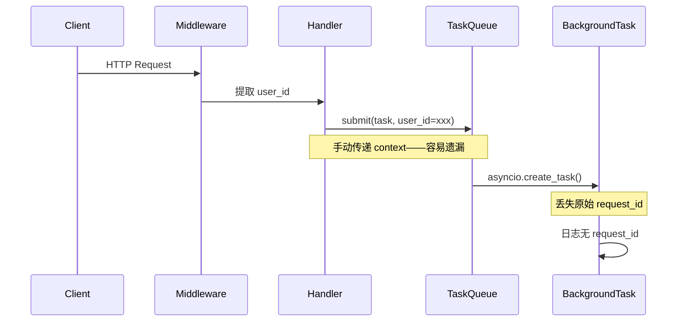
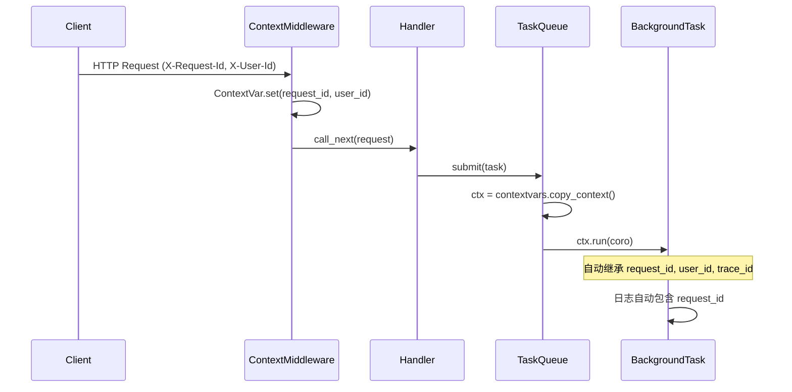

# YA-09-65: 服务端请求上下文传播 — ContextVar 异步透传 TraceID 与用户信息

> 需求编号：YA-09-65 · 优先级：P2 · 人天：0.5d · 状态：需求已编写

---

## 一、背景

### 1.1 问题描述

YiAi 后端在引入 `BackgroundTaskQueue`（YA-09-42）后，异步任务脱离了原始 HTTP 请求的上下文。后台任务执行时，日志中无法关联触发请求的 `request_id`、`user_id` 和 `trace_id`。当后台任务出错时，运维人员只能看到孤立的错误日志，无法追溯到原始请求和用户操作。

### 1.2 影响范围

| 影响维度 | 具体表现 | 严重程度 |
|----------|---------|----------|
| 可观测性 | 后台任务日志缺失 request_id，无法关联调用链 | 高 |
| 故障排查 | 异步任务异常无法追溯到触发用户 | 高 |
| 审计合规 | 无法追踪"谁在何时触发了什么后台操作" | 中 |
| 性能分析 | 无法按用户维度统计后台任务耗时分布 | 低 |

### 1.3 核心挑战

| 挑战 | 说明 |
|------|------|
| asyncio Task 隔离 | `asyncio.create_task` 默认不继承 `ContextVar` 上下文 |
| 线程池隔离 | `run_in_executor` 中的线程不继承 asyncio 上下文 |
| 跨服务传播 | TraceID 需在 YiAi 内部模块间以及可能的微服务间传播 |
| 零侵入要求 | 不应要求每个异步函数手动传递 context 参数 |

---

## 二、现状分析

### 2.1 当前上下文传递方式

```python
# 当前做法：手动传递 context dict
async def handle_request(request: Request):
    user_id = request.headers.get("X-User-Id", "anonymous")
    request_id = str(uuid.uuid4())[:8]
    # 后台任务——手动传递 context
    await task_queue.submit("export", do_export, user_id=user_id, request_id=request_id)
```

### 2.2 当前数据流



### 2.3 根因矩阵

| 根因 | 影响 | 严重度 |
|------|------|--------|
| 缺少统一的 ContextVar 中间件 | 每个 handler 自行提取和传递 context | 高 |
| asyncio.create_task 不自动继承 contextvars | 新 Task 的 ContextVar 为空默认值 | 高 |
| 日志系统未集成 ContextVar | 日志输出不包含 request_id | 中 |
| 后台任务创建时未显式复制 context | context 丢失是默认行为 | 高 |

### 2.4 涉及文件

| 文件 | 角色 | 改动 |
|------|------|------|
| `YiAi/src/shared/context.py` | 新增——上下文管理模块 | 新增 |
| `YiAi/src/server/middleware/context.py` | 新增——上下文中间件 | 新增 |
| `YiAi/src/server/main.py` | 注册中间件 | 修改 |
| `YiAi/src/shared/logging_config.py` | 日志格式集成 request_id | 修改 |
| `YiAi/src/services/ai/background_task_queue.py` | 后台任务 context 复制 | 修改 |

---

## 三、设计决策

### D-01: ContextVar vs ThreadLocal vs 手动传递

| 方案 | 优点 | 缺点 | 选择 |
|------|------|------|------|
| A: ContextVar | asyncio 原生支持；自动传播到子协程；零侵入 | 线程池中不可用；Python 3.7+ | **选择** |
| B: ThreadLocal | 简单直观 | 不支持 asyncio——协程切换时数据污染 | 否决 |
| C: 手动传递 dict | 完全可控 | 每个函数需要 context 参数；容易遗漏 | 否决 |

**决策**: 选择 A。ContextVar 是 Python 3.7+ 标准库，与 asyncio 深度集成，在协程链中自动传播，无需修改函数签名。

### D-02: contextvars.copy_context() vs 手动提取/恢复

| 方案 | 优点 | 缺点 | 选择 |
|------|------|------|------|
| A: copy_context().run() | 完整复制所有 ContextVar；隔离性好 | API 略显复杂 | **选择** |
| B: 手动提取 dict 再恢复 | 显式可见 | 每新增 ContextVar 需修改代码 | 否决 |

**决策**: 选择 A。`contextvars.copy_context()` 自动复制所有 ContextVar，扩展新变量时无需修改后台任务创建代码。

### D-03: 中间件设置 vs 装饰器设置

| 方案 | 优点 | 缺点 | 选择 |
|------|------|------|------|
| A: ASGI 中间件 | 统一入口；覆盖所有路由 | 对非 HTTP 入口无效 | **选择** |
| B: 路由装饰器 | 按需设置 | 分散；容易遗漏 | 否决 |

**决策**: 选择 A。ASGI 中间件在请求入口统一设置，零遗漏。对于非 HTTP 入口（如定时任务），在调度器层面单独设置。

---

## 四、目标架构

### 4.1 目标数据流



### 4.2 架构指标

| 指标 | 当前 | 目标 |
|------|------|------|
| 后台任务日志可追溯率 | 0% | 100% |
| 上下文传播延迟 | N/A | < 1μs |
| 新增 ContextVar 成本 | 需所有函数签名 | 0（仅 ContextVar 定义） |
| 线程池兼容性 | N/A | 显式 API 支持 |

### 4.3 架构取舍

| 取舍 | 说明 |
|------|------|
| 内存开销 | 每个 Task 复制一份 context 快照，约 200 bytes |
| 线程池限制 | `run_in_executor` 不自动继承，需显式调用 `copy_context().run()` |
| 调试复杂度 | contextvars 是隐式状态，初学者可能困惑 |

---

## 五、具体改动

### 5.1 新增: YiAi/src/shared/context.py

```python
"""请求上下文管理——基于 Python ContextVar 的异步安全上下文传播。"""

from contextvars import ContextVar, copy_context
import uuid
import time

# ContextVar 定义——默认值确保非 HTTP 上下文也能安全使用
request_id_var: ContextVar[str] = ContextVar("request_id", default="")
user_id_var: ContextVar[str] = ContextVar("user_id", default="anonymous")
trace_id_var: ContextVar[str] = ContextVar("trace_id", default="")
client_ip_var: ContextVar[str] = ContextVar("client_ip", default="")
start_time_var: ContextVar[float] = ContextVar("start_time", default=0.0)


class RequestContext:
    """请求上下文管理器——提供 ContextVar 的便捷读写接口。"""

    @staticmethod
    def set_request(
        request_id: str = "",
        user_id: str = "anonymous",
        client_ip: str = "",
    ) -> None:
        """在请求入口设置上下文。生成 trace_id 用于全链路追踪。"""
        request_id_var.set(request_id or str(uuid.uuid4())[:8])
        user_id_var.set(user_id)
        trace_id_var.set(str(uuid.uuid4())[:12])
        client_ip_var.set(client_ip)
        start_time_var.set(time.monotonic())

    @staticmethod
    def get_context() -> dict:
        """获取当前上下文快照——用于日志/审计。"""
        return {
            "request_id": request_id_var.get(),
            "user_id": user_id_var.get(),
            "trace_id": trace_id_var.get(),
            "client_ip": client_ip_var.get(),
            "elapsed_ms": round(
                (time.monotonic() - start_time_var.get()) * 1000, 2
            ),
        }

    @staticmethod
    def copy() -> "contextvars.Context":
        """复制当前上下文——用于异步任务传播。"""
        return copy_context()

    @staticmethod
    def run_in_context(ctx, coro):
        """在指定上下文中执行协程——用于线程池场景。"""
        return ctx.run(coro)

    @staticmethod
    def get_request_id() -> str:
        return request_id_var.get()

    @staticmethod
    def get_user_id() -> str:
        return user_id_var.get()

    @staticmethod
    def get_trace_id() -> str:
        return trace_id_var.get()
```

### 5.2 新增: YiAi/src/server/middleware/context.py

```python
"""请求上下文中间件——在 HTTP 入口设置 ContextVar。"""

from fastapi import Request
from starlette.middleware.base import BaseHTTPMiddleware
from src.shared.context import RequestContext
import uuid


class RequestContextMiddleware(BaseHTTPMiddleware):
    """ASGI 中间件——每个请求进入时设置上下文。"""

    async def dispatch(self, request: Request, call_next):
        # 提取请求标识
        request_id = request.headers.get(
            "X-Request-Id", str(uuid.uuid4())[:8]
        )
        user_id = request.headers.get("X-User-Id", "anonymous")
        client_ip = request.client.host if request.client else ""

        # 设置上下文
        RequestContext.set_request(
            request_id=request_id,
            user_id=user_id,
            client_ip=client_ip,
        )

        # 传递上下文到下游
        response = await call_next(request)

        # 响应头注入 trace_id——客户端可获取
        response.headers["X-Trace-Id"] = RequestContext.get_trace_id()
        response.headers["X-Request-Id"] = request_id

        return response
```

### 5.3 修改: YiAi/src/server/main.py（注册中间件）

```python
# 在 app 创建后注册
from src.server.middleware.context import RequestContextMiddleware

app.add_middleware(RequestContextMiddleware)
```

### 5.4 修改: YiAi/src/shared/logging_config.py（日志集成）

```python
# 自定义日志过滤器——自动注入 request_id
import logging
from src.shared.context import RequestContext


class ContextFilter(logging.Filter):
    def filter(self, record):
        record.request_id = RequestContext.get_request_id() or "-"
        record.user_id = RequestContext.get_user_id() or "-"
        record.trace_id = RequestContext.get_trace_id() or "-"
        return True


# 日志格式中加入上下文字段
LOG_FORMAT = (
    "%(asctime)s [%(request_id)s] [%(user_id)s] "
    "%(levelname)s %(name)s: %(message)s"
)
```

### 5.5 修改: 后台任务创建（YiAi/src/services/ai/background_task_queue.py）

```python
# 修改前——手动传递 context
async def submit_task(name: str, coro, *args, user_id: str = ""):
    task_id = await queue.submit(name, coro, *args, user_id=user_id)

# 修改后——自动复制 context
from src.shared.context import RequestContext

async def submit_task(name: str, coro, *args):
    ctx = RequestContext.copy()
    task_id = await queue.submit(name, ctx.run, coro, *args)
    logger.info(
        f"[Task] {task_id} created from request={RequestContext.get_request_id()}"
    )
    return task_id
```

### 5.6 文件变更清单

| 文件 | 操作 | 行数 |
|------|------|------|
| `YiAi/src/shared/context.py` | 新增 | ~70 |
| `YiAi/src/server/middleware/context.py` | 新增 | ~40 |
| `YiAi/src/server/main.py` | 修改（+2 行） | +2 |
| `YiAi/src/shared/logging_config.py` | 修改（+15 行） | +15 |
| `YiAi/src/services/ai/background_task_queue.py` | 修改（+5 行） | +5 |

---

## 六、实施步骤

| 步骤 | 操作 | 文件 | 验证 | 人天 |
|------|------|------|------|------|
| 1 | 创建 `context.py`——ContextVar 定义 | `shared/context.py` | 单元测试：get/set 往返 | 0.1 |
| 2 | 创建中间件 `context.py` | `server/middleware/context.py` | 集成测试：HTTP 请求后 context 存在 | 0.1 |
| 3 | 注册中间件到 main.py | `server/main.py` | 启动服务，检查日志包含 request_id | 0.05 |
| 4 | 修改 logging_config——注入 ContextFilter | `shared/logging_config.py` | 发送请求后检查日志格式 | 0.1 |
| 5 | 修改后台任务队列——context 复制 | `services/ai/background_task_queue.py` | 后台任务日志中出现 request_id | 0.1 |
| 6 | 全量回归测试 | 所有 | 现有 76 个测试全部通过 | 0.05 |

**总人天**: 0.5d

---

## 七、性能分析

### 7.1 开销基准

| 操作 | 耗时 | 说明 |
|------|------|------|
| ContextVar.set() | ~80 ns | 每个请求入口 4 次 set |
| ContextVar.get() | ~60 ns | 每次日志输出 1 次 get |
| contextvars.copy_context() | ~2 μs | 每个后台任务创建 1 次 |
| 内存开销 | ~200 bytes/context | 4 个 ContextVar 的快照 |

### 7.2 容量规划

| 场景 | 并发请求 | 后台任务 | 内存增量 |
|------|---------|---------|---------|
| 正常 | 100 | 10 | 20 KB |
| 高峰 | 500 | 50 | 100 KB |
| 极端 | 1000 | 200 | 200 KB |

结论：上下文传播的内存开销可忽略不计（< 1 MB），不会成为瓶颈。

---

## 八、测试规格

### 8.1 单元测试

**TC-01: ContextVar 在协程间自动传播**

```gherkin
GIVEN 一个设置了 request_id 的 ContextVar
WHEN 在子协程中读取 request_id
THEN 子协程应获得与父协程相同的 request_id
AND 不需要显式传递任何参数
```

**TC-02: 后台任务继承上下文**

```gherkin
GIVEN HTTP 请求已设置 request_id="req-001" 和 user_id="alice"
WHEN 该请求创建一个后台任务
AND 后台任务执行时打印日志
THEN 日志中应包含 request_id="req-001" 和 user_id="alice"
```

**TC-03: 非 HTTP 入口使用默认上下文**

```gherkin
GIVEN 一个定时任务直接从 asyncio 事件循环启动
AND 没有 HTTP 请求设置过上下文
WHEN 定时任务读取 ContextVar
THEN request_id 应为空字符串，user_id 应为 "anonymous"
AND 不应抛出异常
```

**TC-04: 响应头包含 trace_id**

```gherkin
GIVEN 客户端发送 HTTP 请求到任意 RPC 端点
WHEN 中间件处理完请求
THEN 响应头应包含 X-Trace-Id
AND 响应头应包含 X-Request-Id
```

**TC-05: ContextVar 在并发请求间隔离**

```gherkin
GIVEN 两个并发请求分别设置 request_id="A" 和 request_id="B"
WHEN 两个请求的 handler 同时读取 ContextVar
THEN 请求 A 应读到 "A"，请求 B 应读到 "B"
AND 不应出现交叉污染
```

---

## 九、风险与缓解

| 风险 | 概率 | 影响 | 缓解措施 |
|------|------|------|----------|
| `create_task` 中 context 丢失 | 高 | 中 | 使用 `contextvars.copy_context().run()` 创建 Task |
| 线程池中 context 不可用 | 中 | 低 | 线程池场景文档化，提供 `run_in_context` API |
| ContextVar 隐式状态导致调试困难 | 低 | 低 | 日志中显式打印 context；提供 `get_context()` 调试接口 |
| 中间件顺序问题 | 低 | 中 | 确保 context 中间件在认证中间件之后注册 |

---

## 十、回滚策略

| 场景 | 操作 | 影响 |
|------|------|------|
| 中间件导致请求延迟增加 | 移除中间件注册，恢复手动传递 | 后台任务日志失去 request_id |
| logging 集成导致日志量暴增 | 移除 ContextFilter | 回退到旧日志格式 |
| 后台任务 context 传播异常 | 恢复手动传递 context dict | 功能不变，失去自动传播 |

回滚方式：移除 `main.py` 中的中间件注册，恢复 `background_task_queue.py` 的手动传递方式。所有修改集中且可逆。

---

## 十一、设计决策记录

| 编号 | 决策 | 理由 | 日期 |
|------|------|------|------|
| D-01 | 使用 Python ContextVar 而非 ThreadLocal | asyncio 原生支持，协程安全 | 2026-09-09 |
| D-02 | 使用 copy_context().run() 传播到后台任务 | 完整复制，扩展性好 | 2026-09-09 |
| D-03 | ASGI 中间件统一设置上下文 | 零遗漏，覆盖所有 HTTP 入口 | 2026-09-09 |
| D-04 | trace_id 在中间件中生成（非客户端传入） | 避免客户端伪造；服务端拥有追踪 ID 主权 | 2026-09-09 |
| D-05 | 非 HTTP 入口使用 ContextVar 默认值 | 避免空值异常；向后兼容 | 2026-09-09 |

---

## 十二、可观测性

### 12.1 指标

| 指标 | 类型 | 说明 |
|------|------|------|
| `context_setup_total` | Counter | 上下文设置次数（按 entrypoint 分类） |
| `context_propagation_success` | Counter | 上下文传播成功次数 |
| `context_missing_in_task` | Counter | 后台任务中上下文字段为空的次数 |

### 12.2 日志

```python
# 正常——后台任务携带上下文
[2026-09-09 10:00:00] [req-001] [alice] INFO TaskQueue: task "export" created from request=req-001

# 异常——后台任务上下文缺失
[2026-09-09 10:00:01] [-] [anonymous] WARNING TaskQueue: task "export" missing request context
```

### 12.3 告警

| 告警 | 条件 | 级别 |
|------|------|------|
| 上下文缺失率过高 | `context_missing_in_task` / `context_setup_total` > 10% | WARNING |
| 后台任务持续无上下文 | 5 分钟内所有后台任务均无 request_id | WARNING |

---

## 十三、安全合规

| 要求 | 实现 |
|------|------|
| trace_id 不可被客户端伪造 | trace_id 在服务端生成，不信任客户端传入 |
| user_id 透传需验证 | 中间件从认证后的 `request.state.user` 获取，非直接从 header |
| 日志不泄露敏感信息 | 日志中仅包含 request_id/user_id/trace_id，不包含请求体 |
| 审计追踪 | 每个请求的 request_id 关联到后台任务，形成完整审计链 |

---

## 十四、代码审查检查清单

- [ ] `contextvars` 在 asyncio 中自动传播——协程链中 `get()` 应返回设置值
- [ ] 中间件在请求入口设置上下文——`dispatch` 方法中调用 `set_request`
- [ ] 所有日志自动包含 `request_id`——检查 `logging_config.py` 中 `ContextFilter`
- [ ] `asyncio.create_task` 时显式复制 context——使用 `copy_context().run()` 而非直接调用
- [ ] 非 HTTP 入口（定时任务）使用 ContextVar 默认值——不抛出异常
- [ ] 响应头包含 `X-Trace-Id` 和 `X-Request-Id`——客户端可获取追踪信息
- [ ] 并发请求间 ContextVar 隔离——每个请求看到独立的上下文值
- [ ] 线程池场景文档化——`run_in_executor` 需显式调用 `run_in_context`
- [ ] 中间件注册顺序正确——context 中间件在认证中间件之后
- [ ] 现有测试全部通过——上下文传播不应破坏现有功能

---

*PRD 来源: `projects/yiai/requirements/2026-09/65-需求-请求上下文传播.md`*

## 影响范围

- **影响模块**：待补充
- **涉及文件**：
- `context.py`
- `logging_config.py`
- `main.py`
- `background_task_queue.py`
- **是否影响 API 契约**：否
- **是否影响其他项目（YiVad/YiPet）**：否
- **用户感知**：待确认

## 预防措施

| 层面 | 措施 |
|------|------|
| 代码 | 在相关函数中添加参数校验和边界检查 |
| 测试 | 为 `context.py` 添加单元测试 |
| 流程 | 代码审查时重点检查此类模式 |
| 监控 | 添加日志告警，异常发生时及时发现 |
| 文档 | 在编码规范中记录此类反模式 |

## 经验教训

1. **根本原因**：开发过程中对边界情况和异常路径的考虑不足是此类问题的共同根因
2. **设计阶段**：在接口设计和模块实现时，应主动考虑异常输入、空值、超时等边界场景
3. **代码审查**：审查时应检查是否存在类似的反模式（如未捕获异常、无超时控制、缺少参数校验等）
4. **测试覆盖**：异常路径的测试覆盖率应与正常路径同等重视
5. **团队分享**：此类问题应在团队周会或技术分享中讨论，形成团队共识
