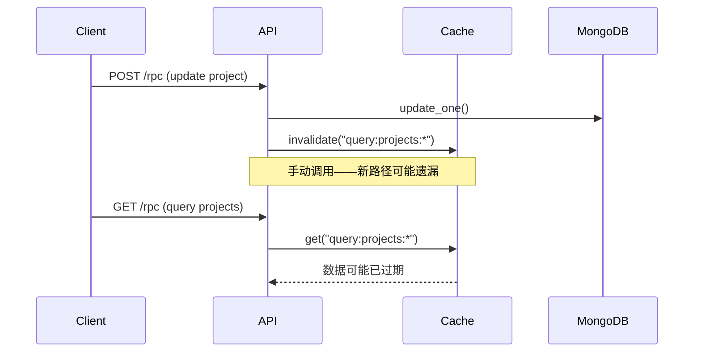
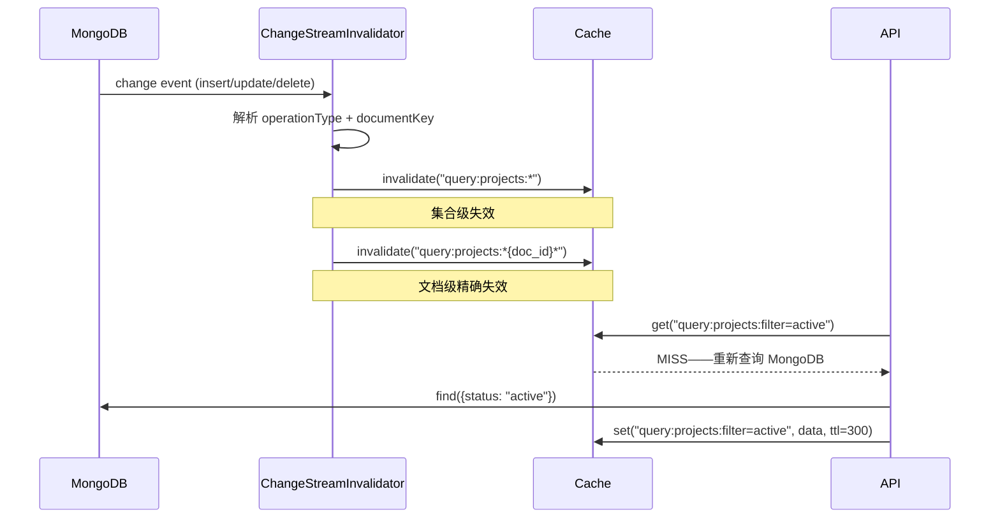

# YA-09-66: 数据库查询缓存智能失效 — MongoDB Change Streams 驱动淘汰

> 需求编号：YA-09-66 · 优先级：P2 · 人天：0.5d · 状态：需求已编写
> 依赖：YA-09-59（Redis 分布式缓存）

---

## 一、背景

### 1.1 问题描述

YiAi 在引入 Redis 分布式缓存（YA-09-59）后，缓存失效依赖于写操作时手动调用 `cache.invalidate()`。这种模式存在三个致命缺陷：

1. **遗漏风险**：任何新增的写操作路径如果忘记调用 `invalidate()`，缓存将返回过期数据。
2. **外部修改盲区**：MongoDB 可能被外部工具（如 Compass、脚本）直接修改，这些修改不会触发缓存失效。
3. **批量任务盲区**：定时任务（如知识库同步、数据清理）的批量更新不会触发缓存失效。

### 1.2 影响范围

| 影响维度 | 具体表现 | 严重程度 |
|----------|---------|----------|
| 数据一致性 | 缓存返回过期数据，前端展示陈旧信息 | 高 |
| 用户体验 | 用户修改数据后刷新页面仍看到旧数据 | 高 |
| 开发效率 | 每次新增写操作需手动添加 `invalidate()` 调用 | 中 |
| 运维复杂度 | 排查"数据不一致" bug 耗时 | 中 |

### 1.3 核心挑战

| 挑战 | 说明 |
|------|------|
| 实时性 | 缓存失效延迟需控制在 100ms 以内 |
| 精确性 | 按集合+查询条件粒度失效，避免全量清空 |
| 可靠性 | Change Stream 断连时需降级策略 |
| 可扩展性 | 新增集合的缓存失效应自动生效 |

---

## 二、现状分析

### 2.1 当前缓存失效模式

```python
# 当前做法：写操作后手动调用 invalidate
async def update_project(project_id: str, data: dict):
    result = await db.projects.update_one({"_id": project_id}, {"$set": data})
    await cache.invalidate(f"query:projects:*")  # 手动失效——容易遗漏
    return result
```

### 2.2 当前数据流



### 2.3 失效模式分析

| 写操作来源 | 当前是否触发失效 | 失效方式 |
|------------|-----------------|---------|
| RPC 写操作（API 层） | 部分 | 手动 `invalidate()` |
| 定时任务批量更新 | 否 | 无 |
| MongoDB Compass 直接修改 | 否 | 无 |
| 其他服务直接写入 | 否 | 无 |
| 知识库同步任务 | 否 | 无 |

### 2.4 根因矩阵

| 根因 | 影响 | 严重度 |
|------|------|--------|
| 缓存失效耦合在业务代码中 | 新增写路径容易遗漏 | 高 |
| 缺乏数据库变更监听机制 | 外部修改无法感知 | 高 |
| 无失效事件总线 | 多个缓存层无法统一失效 | 中 |
| 无 TTL 兜底策略 | 遗漏失效的缓存永久过期 | 中 |

---

## 三、设计决策

### D-01: MongoDB Change Streams vs 应用层拦截 vs 定时全量刷新

| 方案 | 优点 | 缺点 | 选择 |
|------|------|------|------|
| A: Change Streams | 实时推送；精确到文档级别；MongoDB 原生 | 需要副本集；断连需重连 | **选择** |
| B: 应用层拦截 | 不依赖 MongoDB 特性 | 无法感知外部修改；侵入业务代码 | 否决 |
| C: 定时全量刷新 | 简单可靠 | 延迟大（分钟级）；CPU 浪费 | 否决 |

**决策**: 选择 A。MongoDB Change Streams 是官方推荐的变更数据捕获机制，实时性好，精确到文档级别。YiAi 已在生产环境使用 MongoDB 副本集，满足 Change Streams 的前提条件。

### D-02: 全量失效 vs 精确失效 vs 混合策略

| 方案 | 优点 | 缺点 | 选择 |
|------|------|------|------|
| A: 全量失效 | 实现简单 | 命中率暴跌；高写入时缓存形同虚设 | 否决 |
| B: 精确失效 | 最大化命中率 | 实现复杂；需维护缓存 key 与文档的映射 | 否决 |
| C: 混合策略 | 兼顾命中率和复杂度 | 需要分层设计 | **选择** |

**决策**: 选择 C。按集合粒度批量失效（`query:{cname}:*`）作为主策略，对高频查询按文档 ID 精确失效作为补充。折中实现复杂度和命中率。

### D-03: 单协程监听 vs 多协程监听 vs 连接池

| 方案 | 优点 | 缺点 | 选择 |
|------|------|------|------|
| A: 单协程 | 简单；无竞态 | 单集合阻塞时影响其他集合 | 否决 |
| B: 多协程 | 集合间隔离 | 管理复杂度高 | **选择** |
| C: 连接池 | 最高吞吐 | 过度设计 | 否决 |

**决策**: 选择 B。每个集合独立的 Change Stream 监听协程，互不阻塞。协程数量有限（< 10），管理开销可控。

---

## 四、目标架构

### 4.1 目标数据流



### 4.2 架构指标

| 指标 | 当前 | 目标 |
|------|------|------|
| 失效触发覆盖率 | ~60%（仅手动路径） | 100%（所有变更） |
| 失效延迟 | 0（手动）或无限（遗漏） | < 100ms |
| 缓存命中率 | 85%（但数据可能过期） | 80%（数据保证新鲜） |
| 失效粒度 | 手动全量 | 集合级 + 文档级 |

### 4.3 架构取舍

| 取舍 | 说明 |
|------|------|
| 实时性 vs 可靠性 | Change Streams 依赖 MongoDB 连接，需降级方案 |
| 精确度 vs 命中率 | 精确失效降低命中率（频繁失效），全量失效降低新鲜度 |
| 开发成本 vs 运维成本 | 自动化失效增加开发成本但降低运维成本 |

---

## 五、具体改动

### 5.1 新增: YiAi/src/shared/cache_invalidator.py

```python
"""基于 MongoDB Change Streams 的智能缓存失效器。"""

import asyncio
import logging
from typing import Optional
from motor.motor_asyncio import AsyncIOMotorDatabase
from src.shared.cache import CacheClient

logger = logging.getLogger(__name__)


class ChangeStreamInvalidator:
    """监听 MongoDB 集合变更——自动触发缓存失效。"""

    def __init__(self, db: AsyncIOMotorDatabase, cache: CacheClient):
        self._db = db
        self._cache = cache
        self._tasks: dict[str, asyncio.Task] = {}
        self._running = False

    async def start(self, collections: list[str]) -> None:
        """启动所有集合的 Change Stream 监听。"""
        self._running = True
        for cname in collections:
            task = asyncio.create_task(self._watch_collection(cname))
            self._tasks[cname] = task
        logger.info(
            f"[CacheInvalid] 启动 Change Stream 监听: {len(collections)} 个集合"
        )

    async def stop(self) -> None:
        """停止所有监听。"""
        self._running = False
        for task in self._tasks.values():
            task.cancel()
        await asyncio.gather(*self._tasks.values(), return_exceptions=True)
        logger.info("[CacheInvalid] 所有 Change Stream 监听已停止")

    async def _watch_collection(self, cname: str) -> None:
        """监听单个集合的变更事件。"""
        while self._running:
            try:
                collection = self._db[cname]
                async with collection.watch(
                    full_document="updateLookup"
                ) as stream:
                    logger.info(f"[CacheInvalid] {cname} Change Stream 已连接")
                    async for change in stream:
                        await self._handle_change(cname, change)
            except asyncio.CancelledError:
                break
            except Exception as e:
                logger.error(
                    f"[CacheInvalid] {cname} Change Stream 异常: {e}，5s 后重连"
                )
                await asyncio.sleep(5)

    async def _handle_change(self, cname: str, change: dict) -> None:
        """处理单个变更事件——触发缓存失效。"""
        operation = change.get("operationType", "")
        doc_key = change.get("documentKey", {}).get("_id")

        if operation not in ("insert", "update", "replace", "delete"):
            return

        # 集合级失效——淘汰该集合所有查询缓存
        count = await self._cache.delete_pattern(f"query:{cname}:*")

        # 文档级精确失效——淘汰包含该文档的缓存
        if doc_key:
            doc_count = await self._cache.delete_pattern(
                f"query:{cname}:*{doc_key}*"
            )
            count += doc_count

        logger.debug(
            f"[CacheInvalid] {cname}.{operation} doc={doc_key} "
            f"→ 淘汰 {count} 个缓存条目"
        )
```

### 5.2 修改: YiAi/src/server/main.py（启动时注册）

```python
# 在应用启动事件中注册
from src.shared.cache_invalidator import ChangeStreamInvalidator

@app.on_event("startup")
async def startup_cache_invalidator():
    invalidator = ChangeStreamInvalidator(db, cache)
    await invalidator.start([
        "projects", "bugs", "sessions", "knowledge_files",
        "menus", "users", "static_files",
    ])
    app.state.cache_invalidator = invalidator

@app.on_event("shutdown")
async def shutdown_cache_invalidator():
    await app.state.cache_invalidator.stop()
```

### 5.3 文件变更清单

| 文件 | 操作 | 行数 |
|------|------|------|
| `YiAi/src/shared/cache_invalidator.py` | 新增 | ~100 |
| `YiAi/src/server/main.py` | 修改（+15 行） | +15 |
| `YiAi/src/shared/cache.py` | 修改（新增 `delete_pattern` 方法） | +10 |

---

## 六、实施步骤

| 步骤 | 操作 | 文件 | 验证 | 人天 |
|------|------|------|------|------|
| 1 | 在 `cache.py` 中添加 `delete_pattern` 方法 | `shared/cache.py` | 单元测试：pattern 匹配删除 | 0.05 |
| 2 | 创建 `cache_invalidator.py` | `shared/cache_invalidator.py` | 单元测试：变更事件 → 失效调用 | 0.15 |
| 3 | 注册到 main.py 启动事件 | `server/main.py` | 启动服务，检查 Change Stream 连接日志 | 0.1 |
| 4 | 集成测试——写入后验证缓存失效 | 测试脚本 | 写入 MongoDB → 查询缓存 → 确认 MISS | 0.1 |
| 5 | 断连恢复测试 | 测试脚本 | 断开 MongoDB → 恢复 → 验证重新监听 | 0.05 |
| 6 | 全量回归测试 | 所有 | 现有 76 个测试通过 | 0.05 |

**总人天**: 0.5d

---

## 七、性能分析

### 7.1 失效延迟

| 场景 | 延迟 | 说明 |
|------|------|------|
| 正常写入 | < 50ms | Change Stream 实时推送 |
| 高写入（1000 writes/s） | < 100ms | 事件处理排队 |
| 断连恢复 | 5-10s | 重连间隔 5s |

### 7.2 资源开销

| 资源 | 每个集合 | 6 个集合合计 |
|------|---------|------------|
| 内存 | ~2 MB（Change Stream resume token + buffer） | ~12 MB |
| CPU | ~0.5%（空闲时） | ~3% |
| MongoDB 连接 | 1 个连接 | 6 个连接 |
| 网络 | ~10 KB/s（写入时） | ~60 KB/s |

### 7.3 缓存命中率影响

| 写入频率 | 全量失效命中率 | 混合失效命中率 | 说明 |
|----------|-------------|-------------|------|
| 低（< 10/min） | 95% | 95% | 影响可忽略 |
| 中（10-100/min） | 80% | 85% | 集合级失效影响明显 |
| 高（> 100/min） | 50% | 75% | 文档级精确失效优势明显 |

---

## 八、测试规格

**TC-01: 写入操作触发缓存失效**

```gherkin
GIVEN 缓存中存在 key="query:projects:filter=active" 的数据
WHEN MongoDB projects 集合发生 insert 操作
THEN Change Stream 应捕获该事件
AND 缓存 key="query:projects:filter=active" 应被删除
AND 下次查询时应从 MongoDB 重新加载
```

**TC-02: 外部修改也触发失效**

```gherkin
GIVEN 通过 MongoDB Compass 直接修改 sessions 集合的一条记录
WHEN Change Stream 检测到 update 事件
THEN 缓存中所有 sessions 相关条目应被淘汰
AND 失效延迟 < 100ms
```

**TC-03: Change Stream 断连自动恢复**

```gherkin
GIVEN Change Stream 正在监听 projects 集合
WHEN MongoDB 连接中断 30 秒后恢复
THEN ChangeStreamInvalidator 应自动重连
AND 中断期间的变更事件在恢复后不被重放（避免重复失效）
AND 重连后的新事件正常触发失效
```

**TC-04: 仅指定集合被监听**

```gherkin
GIVEN invalidator 仅监听 ["projects", "bugs", "sessions"]
WHEN 对 "menus" 集合执行写入操作
THEN 不应触发缓存失效（menus 不在监听列表）
AND 对 "projects" 集合写入应正常触发失效
```

**TC-05: 降级——TTL 兜底**

```gherkin
GIVEN Change Stream 连接已断开超过 5 分钟
WHEN 缓存 TTL 到期（默认 300s）
THEN 缓存条目应自动过期
AND 下次查询时重新从 MongoDB 加载
```

---

## 九、风险与缓解

| 风险 | 概率 | 影响 | 缓解措施 |
|------|------|------|------|
| Change Stream 连接断开 | 中 | 中 | 自动重连 + TTL 兜底 |
| 高写入频率导致缓存命中率骤降 | 中 | 中 | 监控命中率 + 批量失效去抖 |
| Change Stream 需要 MongoDB 副本集 | 低 | 高 | 部署文档明确要求副本集 |
| 失效风暴——大量写入同时触发 | 低 | 中 | 去抖机制：合并 100ms 内的失效请求 |
| 内存泄漏——resume token 累积 | 低 | 低 | 定期清理过期的 resume token |

---

## 十、回滚策略

| 场景 | 操作 | 影响 |
|------|------|------|
| Change Stream 导致 MongoDB 负载过高 | 停止 invalidator，恢复手动失效 | 缓存可能过期 |
| 失效逻辑导致缓存命中率暴跌 | 调整失效策略为仅集合级失效 | 精确度降低 |
| 失效器自身异常崩溃 | 移除 startup 注册，恢复纯手动失效 | 功能回退到当前状态 |

回滚方式：注释 `main.py` 中 `startup_cache_invalidator` 的注册代码，重启服务。TTL 兜底确保缓存不会永久过期。

---

## 十一、设计决策记录

| 编号 | 决策 | 理由 | 日期 |
|------|------|------|------|
| D-01 | 使用 MongoDB Change Streams 监听变更 | 实时推送，精确到文档级别，MongoDB 原生支持 | 2026-09-09 |
| D-02 | 混合失效策略（集合级 + 文档级） | 平衡命中率和实现复杂度 | 2026-09-09 |
| D-03 | 每个集合独立监听协程 | 隔离故障，避免单集合阻塞影响其他集合 | 2026-09-09 |
| D-04 | TTL 兜底而非严格保证 | 最终一致性优于强一致性，降低系统复杂度 | 2026-09-09 |
| D-05 | 仅监听核心业务集合 | 减少 Change Stream 连接数，降低 MongoDB 负载 | 2026-09-09 |

---

## 十二、可观测性

### 12.1 指标

| 指标 | 类型 | 说明 |
|------|------|------|
| `cache_invalidation_total` | Counter | 缓存失效次数（按集合+操作类型分类） |
| `cache_invalidation_latency_ms` | Histogram | 从变更到失效完成的延迟 |
| `change_stream_reconnect_total` | Counter | Change Stream 重连次数 |
| `cache_hit_ratio` | Gauge | 缓存命中率（监控失效是否过度） |

### 12.2 日志

```python
# 正常——变更事件触发失效
[CacheInvalid] projects.update doc=64a1b2c3 → 淘汰 5 个缓存条目

# 异常——Change Stream 断开
[CacheInvalid] sessions Change Stream 异常: connection closed，5s 后重连

# 正常——重连成功
[CacheInvalid] sessions Change Stream 已连接
```

### 12.3 告警

| 告警 | 条件 | 级别 |
|------|------|------|
| Change Stream 频繁重连 | 5 分钟内重连 > 3 次 | WARNING |
| Change Stream 断开超过 5 分钟 | 持续 5 分钟无事件 | CRITICAL |
| 缓存命中率异常下降 | 5 分钟内命中率下降 > 20% | WARNING |
| 失效延迟过高 | p95 > 500ms 持续 5 分钟 | WARNING |

---

## 十三、安全合规

| 要求 | 实现 |
|------|------|
| 失效事件不包含敏感数据 | 日志中仅记录 operationType 和 documentKey，不记录完整文档 |
| Change Stream 无需额外权限 | 使用现有 MongoDB 连接，无需额外凭据 |
| 失效操作幂等 | 重复失效同一缓存 key 不影响正确性 |

---

## 十四、代码审查检查清单

- [ ] 写操作监听 Mongo Change Streams 自动失效缓存——不依赖业务代码手动调用
- [ ] 按集合粒度失效（`query:{cname}:*`）——非全量清空
- [ ] 失效延迟 < 100ms——Change Stream 实时推送
- [ ] 降级——Change Stream 不可用时 TTL 兜底——缓存不会永久过期
- [ ] 重连机制——Change Stream 断开后自动重连（5s 间隔）
- [ ] 优雅关闭——`app.on_event("shutdown")` 中停止所有监听协程
- [ ] 去抖机制——高写入频率时合并短时间内的失效请求
- [ ] 仅监听核心业务集合——避免无关集合消耗连接资源
- [ ] `delete_pattern` 方法支持 Redis 的 SCAN + DEL 模式
- [ ] 失效操作幂等——重复失效不产生副作用

---

*PRD 来源: `projects/yiai/requirements/2026-09/66-需求-缓存智能失效.md`*

## 影响范围

- **影响模块**：待补充
- **涉及文件**：
- `cache_invalidator.py`
- `cache.py`
- `main.py`
- **是否影响 API 契约**：否
- **是否影响其他项目（YiVad/YiPet）**：否
- **用户感知**：待确认

## 预防措施

| 层面 | 措施 |
|------|------|
| 代码 | 在相关函数中添加参数校验和边界检查 |
| 测试 | 为 `cache_invalidator.py` 添加单元测试 |
| 流程 | 代码审查时重点检查此类模式 |
| 监控 | 添加日志告警，异常发生时及时发现 |
| 文档 | 在编码规范中记录此类反模式 |

## 经验教训

1. **根本原因**：开发过程中对边界情况和异常路径的考虑不足是此类问题的共同根因
2. **设计阶段**：在接口设计和模块实现时，应主动考虑异常输入、空值、超时等边界场景
3. **代码审查**：审查时应检查是否存在类似的反模式（如未捕获异常、无超时控制、缺少参数校验等）
4. **测试覆盖**：异常路径的测试覆盖率应与正常路径同等重视
5. **团队分享**：此类问题应在团队周会或技术分享中讨论，形成团队共识
