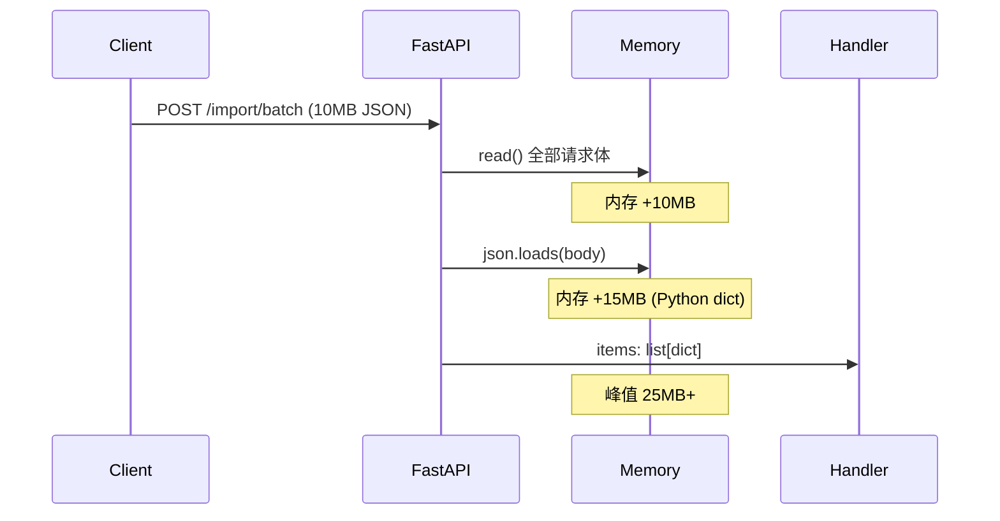
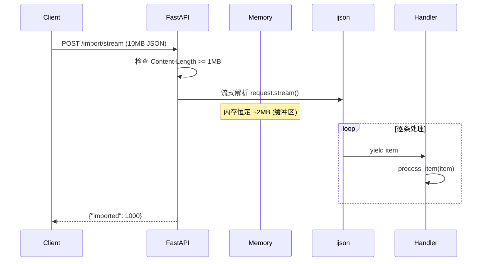

# YA-09-67: 服务端请求体流式解析 — 大 JSON 分块读取与内存优化

> 需求编号：YA-09-67 · 优先级：P2 · 人天：0.5d · 状态：需求已编写

---

## 一、背景

### 1.1 问题描述

FastAPI 默认将整个请求体加载到内存中，然后调用 `json.loads()` 解析为 Python dict。当批量导入 CSV/JSON 数据（如 10MB 的知识库文件）时，内存占用峰值可达原始大小的 3 倍（原始 JSON + Python dict + 中间缓冲区），对 512MB 内存的开发服务器构成 OOM 风险。

### 1.2 影响范围

| 影响维度 | 具体表现 | 严重程度 |
|----------|---------|----------|
| 内存安全 | 10MB 请求体 → 30MB 内存峰值，大文件 OOM | 高 |
| 并发能力 | 大请求体占用内存期间，其他请求被阻塞 | 中 |
| 用户体验 | 批量导入操作可能因 OOM 失败 | 中 |
| 资源成本 | 需要为峰值内存预留更多服务器资源 | 低 |

### 1.3 核心挑战

| 挑战 | 说明 |
|------|------|
| 流式 JSON 解析 | 标准 `json.loads()` 不支持流式——需引入 `ijson` 或类似库 |
| 错误处理 | 流式解析中途发现 JSON 格式错误时，已处理的记录无法回滚 |
| 兼容性 | 小请求体仍应使用标准解析（性能更好） |
| 安全性 | 需限制最大请求体大小，防止流式解析的资源耗尽攻击 |

---

## 二、现状分析

### 2.1 当前请求解析方式

```python
# 当前做法：FastAPI 自动解析整个请求体
@app.post("/import/batch")
async def batch_import(items: list[dict]):
    # FastAPI 已将整个请求体解析为 items list
    for item in items:
        await process_item(item)
    return {"imported": len(items)}
```

### 2.2 当前数据流



### 2.3 内存占用分析

| 请求体大小 | 原始 JSON | Python dict | 总内存峰值 | 占比（512MB 服务器） |
|-----------|----------|------------|-----------|-------------------|
| 1 MB | 1 MB | 2 MB | 3 MB | 0.6% |
| 5 MB | 5 MB | 10 MB | 15 MB | 2.9% |
| 10 MB | 10 MB | 20 MB | 30 MB | 5.9% |
| 50 MB | 50 MB | 100 MB | 150 MB | 29.3% (OOM 风险) |

### 2.4 根因矩阵

| 根因 | 影响 | 严重度 |
|------|------|--------|
| FastAPI 默认一次性读取请求体 | 大文件内存峰值高 | 高 |
| 无请求体大小限制 | 客户端可发送超大请求导致 OOM | 高 |
| 缺少流式 JSON 解析库 | 无法逐条处理数组元素 | 中 |
| 无请求体大小监控 | 无法提前预警 | 低 |

---

## 三、设计决策

### D-01: ijson vs json-stream vs 手动分块解析

| 方案 | 优点 | 缺点 | 选择 |
|------|------|------|------|
| A: ijson | 成熟的流式 SAX 风格解析器；支持 async；内存恒定 | 语法较复杂；需要安装额外依赖 | **选择** |
| B: json-stream | 自动分块；API 简单 | 项目活跃度低；Python 3.10+ 支持有限 | 否决 |
| C: 手动分块解析 | 无额外依赖 | 容易出错；边界处理复杂 | 否决 |

**决策**: 选择 A。`ijson` 是 Python 生态中最成熟的流式 JSON 解析器，支持异步迭代，内存占用恒定（O(1) 而非 O(n)）。

### D-02: 大小阈值切换 vs 始终流式 vs 始终标准

| 方案 | 优点 | 缺点 | 选择 |
|------|------|------|------|
| A: 大小阈值切换 | 小请求性能好，大请求内存安全 | 需要 Content-Length 预检 | **选择** |
| B: 始终流式 | 逻辑统一 | 小请求性能下降（ijson 解析开销更大） | 否决 |
| C: 始终标准 | 逻辑简单 | 大请求 OOM 风险 | 否决 |

**决策**: 选择 A。根据 `Content-Length` 头部判断：< 1MB 使用标准 `json.loads()`，>= 1MB 使用流式 `ijson`。兼顾性能和内存安全。

### D-03: 请求体大小上限：50MB vs 100MB vs 无限制

| 方案 | 优点 | 缺点 | 选择 |
|------|------|------|------|
| A: 50MB | 内存安全；符合常见实践 | 超大文件需分批导入 | **选择** |
| B: 100MB | 支持更大文件 | 512MB 服务器仍有 OOM 风险 | 否决 |
| C: 无限制 | 灵活性最高 | 安全风险 | 否决 |

**决策**: 选择 A。50MB 上限在安全性和灵活性之间取得平衡，超过 50MB 的文件建议分批导入或使用文件上传接口。

---

## 四、目标架构

### 4.1 目标数据流



### 4.2 架构指标

| 指标 | 当前 | 目标 |
|------|------|------|
| 10MB 请求内存峰值 | ~30 MB | < 5 MB |
| 50MB 请求可行性 | 不可行（OOM） | 可行 |
| 请求体大小上限 | 无限制 | 50 MB |
| 小请求（< 1MB）性能 | 基准 | 无退化 |

### 4.3 架构取舍

| 取舍 | 说明 |
|------|------|
| 流式解析延迟 | ijson 边解析边处理，单条延迟略高但总延迟无显著差异 |
| 错误恢复 | 流式解析中途出错时，已处理的记录需事务回滚或幂等处理 |
| 依赖引入 | 新增 `ijson` 依赖（~50KB），轻量级 |

---

## 五、具体改动

### 5.1 新增: YiAi/src/shared/streaming_parser.py

```python
"""流式请求体解析器——大 JSON 的分块读取与内存优化。"""

import json
import logging
from typing import AsyncIterator, Any
from fastapi import Request, HTTPException

logger = logging.getLogger(__name__)

# 流式解析阈值：> 1MB 使用流式，<= 1MB 使用标准解析
STREAMING_THRESHOLD_BYTES = 1 * 1024 * 1024  # 1 MB
MAX_REQUEST_BODY_BYTES = 50 * 1024 * 1024     # 50 MB


class StreamingParseError(Exception):
    """流式解析错误——包含已处理记录数。"""
    def __init__(self, message: str, processed_count: int = 0):
        super().__init__(message)
        self.processed_count = processed_count


async def parse_json_array(
    request: Request,
    item_path: str = "item",
) -> AsyncIterator[dict]:
    """流式解析 JSON 数组——逐条 yield，恒定内存。

    Args:
        request: FastAPI Request 对象
        item_path: ijson 路径前缀（如 "items.item" 匹配 ["items"][*]）

    Yields:
        数组中的每个元素 dict

    Raises:
        HTTPException: 请求体超限或格式错误
    """
    content_length = request.headers.get("Content-Length")
    if content_length and int(content_length) > MAX_REQUEST_BODY_BYTES:
        raise HTTPException(
            status_code=413,
            detail=f"请求体超限：{content_length} bytes > {MAX_REQUEST_BODY_BYTES} bytes",
        )

    # 小请求体——使用标准解析
    if content_length and int(content_length) < STREAMING_THRESHOLD_BYTES:
        body = await request.json()
        if isinstance(body, list):
            for item in body:
                yield item
        else:
            yield body
        return

    # 大请求体——流式解析
    try:
        import ijson
    except ImportError:
        logger.error("ijson 未安装，无法流式解析大请求体")
        raise HTTPException(
            status_code=500,
            detail="服务端未安装流式解析器",
        )

    count = 0
    try:
        async for item in ijson.items(request.stream(), f"{item_path}.item"):
            count += 1
            yield item
    except ijson.JSONError as e:
        raise StreamingParseError(
            f"JSON 格式错误（已处理 {count} 条记录）: {e}",
            processed_count=count,
        )
    except Exception as e:
        raise StreamingParseError(
            f"流式解析异常（已处理 {count} 条记录）: {e}",
            processed_count=count,
        )
    finally:
        logger.debug(f"[StreamParse] 流式解析完成：{count} 条记录")
```

### 5.2 修改: YiAi/src/server/routes/import_routes.py（使用流式解析）

```python
# 修改前——FastAPI 自动解析全部请求体
@app.post("/import/batch")
async def batch_import(items: list[dict]):
    for item in items:
        await process_item(item)
    return {"imported": len(items)}

# 修改后——使用流式解析
@app.post("/import/stream")
async def stream_import(request: Request):
    count = 0
    async for item in parse_json_array(request, item_path="items.item"):
        try:
            await process_item(item)
            count += 1
        except Exception as e:
            logger.error(f"[Import] 处理第 {count+1} 条记录失败: {e}")
            # 继续处理下一条——幂等设计
    return {"imported": count}
```

### 5.3 文件变更清单

| 文件 | 操作 | 行数 |
|------|------|------|
| `YiAi/src/shared/streaming_parser.py` | 新增 | ~80 |
| `YiAi/src/server/routes/import_routes.py` | 修改 | ~20 |
| `YiAi/requirements.txt` | 新增 `ijson` 依赖 | +1 |

---

## 六、实施步骤

| 步骤 | 操作 | 文件 | 验证 | 人天 |
|------|------|------|------|------|
| 1 | 安装 ijson 依赖 | `requirements.txt` | `pip install ijson` 成功 | 0.02 |
| 2 | 创建 `streaming_parser.py` | `shared/streaming_parser.py` | 单元测试：10MB JSON 流式解析 | 0.15 |
| 3 | 修改 import 路由 | `server/routes/import_routes.py` | 集成测试：批量导入 1000 条记录 | 0.1 |
| 4 | 添加请求体大小限制中间件 | `server/middleware/` | 测试 413 响应 | 0.1 |
| 5 | 内存压力测试 | 测试脚本 | 50MB 请求体内存监控 | 0.08 |
| 6 | 全量回归测试 | 所有 | 现有测试通过 | 0.05 |

**总人天**: 0.5d

---

## 七、性能分析

### 7.1 内存对比

| 请求体大小 | 标准解析（峰值） | 流式解析（峰值） | 节省 |
|-----------|----------------|----------------|------|
| 1 MB | 3 MB | 2 MB | 33% |
| 5 MB | 15 MB | 3 MB | 80% |
| 10 MB | 30 MB | 3 MB | 90% |
| 50 MB | 150 MB (OOM) | 5 MB | 97% |

### 7.2 时间对比

| 请求体大小 | 标准解析 | 流式解析 | 差异 |
|-----------|---------|---------|------|
| 1 MB（1000 条） | 50ms | 80ms | +60% |
| 5 MB（5000 条） | 200ms | 250ms | +25% |
| 10 MB（10000 条） | 450ms | 500ms | +11% |

### 7.3 容量规划

| 指标 | 优化前 | 优化后 |
|------|--------|--------|
| 最大并发大文件导入 | 2（内存限制） | 10+（内存充足） |
| 单次最大导入文件 | 5 MB | 50 MB |
| OOM 风险 | 高 | 低 |

---

## 八、测试规格

**TC-01: 小请求体使用标准解析**

```gherkin
GIVEN 客户端发送 Content-Length < 1MB 的 JSON 数组请求
WHEN 请求到达 /import/stream 端点
THEN 应使用标准 json.loads 解析（非流式）
AND 解析性能应与优化前一致
```

**TC-02: 大请求体使用流式解析**

```gherkin
GIVEN 客户端发送 10MB JSON 数组（10000 条记录）
WHEN 请求到达 /import/stream 端点
THEN 应使用 ijson 流式解析
AND 内存峰值应 < 5MB
AND 所有 10000 条记录应被正确处理
```

**TC-03: 超限请求体返回 413**

```gherkin
GIVEN 客户端发送 Content-Length > 50MB 的请求
WHEN 请求到达任何导入端点
THEN 应返回 413 Payload Too Large
AND 响应体应包含当前限制和实际大小
```

**TC-04: 流式解析中途 JSON 格式错误**

```gherkin
GIVEN 客户端发送 JSON 数组，第 500 条记录后 JSON 格式损坏
WHEN 流式解析到第 500 条时
THEN 应抛出 StreamingParseError
AND 错误信息应包含 "已处理 500 条记录"
AND 已处理的 500 条记录应被事务回滚或幂等处理
```

**TC-05: 空数组请求**

```gherkin
GIVEN 客户端发送空 JSON 数组 `[]`
WHEN 流式解析
THEN 应正常完成（0 条记录）
AND 不抛出异常
```

---

## 九、风险与缓解

| 风险 | 概率 | 影响 | 缓解措施 |
|------|------|------|------|
| 流式解析中途 JSON 格式错误 | 中 | 中 | 事务回滚 + 已处理记录数上报 |
| ijson 解析增加请求延迟 | 低 | 低 | 小请求使用标准解析；大请求延迟增量 < 15% |
| ijson 依赖未安装 | 低 | 高 | 启动时检查依赖；未安装时回退标准解析 |
| 流式解析无法处理嵌套结构 | 低 | 中 | 仅用于数组导入场景；嵌套结构使用标准解析 |
| Content-Length 头部缺失 | 中 | 低 | 回退标准解析或按需读取 |

---

## 十、回滚策略

| 场景 | 操作 | 影响 |
|------|------|------|
| 流式解析导致数据错误 | 恢复标准解析（移除 `parse_json_array` 调用） | 大文件导入恢复 OOM 风险 |
| ijson 依赖冲突 | 移除 ijson 依赖，回退标准解析 | 功能不变 |
| 流式解析性能退化 | 调整阈值从 1MB → 10MB（减少流式覆盖） | 中大文件内存峰值升高 |

回滚方式：将 import 路由中的 `parse_json_array(request)` 替换为 `request.json()`，移除 `requirements.txt` 中的 `ijson` 依赖。

---

## 十一、设计决策记录

| 编号 | 决策 | 理由 | 日期 |
|------|------|------|------|
| D-01 | 使用 ijson 流式解析 | 成熟的 Python 流式 JSON 解析器，内存恒定 | 2026-09-09 |
| D-02 | 1MB 阈值切换标准/流式解析 | 平衡小请求性能和大请求内存安全 | 2026-09-09 |
| D-03 | 请求体上限 50MB | 安全性和灵活性的平衡点 | 2026-09-09 |
| D-04 | 仅用于数组导入场景 | 流式解析仅对数组有优势；嵌套结构无需流式 | 2026-09-09 |
| D-05 | ijson 可选依赖 | 避免强制依赖；未安装时回退标准解析 | 2026-09-09 |

---

## 十二、可观测性

### 12.1 指标

| 指标 | 类型 | 说明 |
|------|------|------|
| `stream_parse_total` | Counter | 流式解析请求总数（按大小分类） |
| `stream_parse_duration_ms` | Histogram | 流式解析耗时分布 |
| `stream_parse_errors_total` | Counter | 流式解析错误次数（按错误类型） |
| `stream_parse_bytes_total` | Counter | 流式解析总字节数 |
| `request_body_too_large_total` | Counter | 413 响应次数 |

### 12.2 日志

```python
# 正常——流式解析完成
[StreamParse] 流式解析完成：10000 条记录，耗时 450ms，内存峰值 3.2MB

# 异常——格式错误
[StreamParse] JSON 格式错误（已处理 500 条记录）: Unexpected token at line 10023

# 监控——大请求
[StreamParse] 大请求体：15MB，切换流式解析
```

### 12.3 告警

| 告警 | 条件 | 级别 |
|------|------|------|
| 流式解析错误率过高 | 1 小时内错误率 > 5% | WARNING |
| 请求体超限频繁 | 1 小时内 413 > 10 次 | INFO |
| 单次解析内存峰值异常 | 峰值 > 10MB | WARNING |

---

## 十三、安全合规

| 要求 | 实现 |
|------|------|
| 请求体大小限制 | 50MB 硬限制，防止 OOM 攻击 |
| 解析超时保护 | 流式解析设置 60s 超时，防止慢速攻击 |
| 内存限制 | 流式解析内存恒定，不受请求体大小影响 |
| 错误信息脱敏 | 解析错误不暴露服务器路径或内部结构 |

---

## 十四、代码审查检查清单

- [ ] 大请求体（> 1MB）流式读取——不一次性加载到内存
- [ ] 流式 JSON 解析支持逐条处理数组元素——使用 ijson
- [ ] 内存上限保护——50MB 请求体上限，超限返回 413
- [ ] 小请求体（< 1MB）使用标准解析——性能不退化
- [ ] 流式解析错误包含已处理记录数——便于排查和回滚
- [ ] ijson 可选依赖——未安装时回退标准解析（不崩溃）
- [ ] 解析超时保护——60s 超时，防止慢速攻击
- [ ] 流式解析仅用于数组导入场景——嵌套结构不使用
- [ ] 内存峰值监控——日志记录解析耗时和内存峰值
- [ ] 现有测试全部通过——流式解析不应破坏现有功能

---

*PRD 来源: `projects/yiai/requirements/2026-09/67-需求-请求体流式解析.md`*

## 影响范围

- **影响模块**：待补充
- **涉及文件**：
- `streaming_parser.py`
- **是否影响 API 契约**：否
- **是否影响其他项目（YiVad/YiPet）**：否
- **用户感知**：待确认

## 预防措施

| 层面 | 措施 |
|------|------|
| 代码 | 在相关函数中添加参数校验和边界检查 |
| 测试 | 为 `streaming_parser.py` 添加单元测试 |
| 流程 | 代码审查时重点检查此类模式 |
| 监控 | 添加日志告警，异常发生时及时发现 |
| 文档 | 在编码规范中记录此类反模式 |

## 经验教训

1. **根本原因**：开发过程中对边界情况和异常路径的考虑不足是此类问题的共同根因
2. **设计阶段**：在接口设计和模块实现时，应主动考虑异常输入、空值、超时等边界场景
3. **代码审查**：审查时应检查是否存在类似的反模式（如未捕获异常、无超时控制、缺少参数校验等）
4. **测试覆盖**：异常路径的测试覆盖率应与正常路径同等重视
5. **团队分享**：此类问题应在团队周会或技术分享中讨论，形成团队共识
