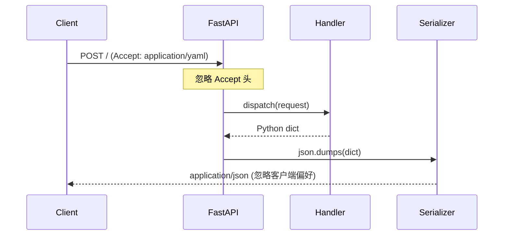

# YA-09-68: API 响应格式协商 — JSON/YAML 多格式 Content Negotiation

> 需求编号：YA-09-68 · 优先级：P2 · 人天：0.5d · 状态：需求已编写

---

## 一、背景

### 1.1 问题描述

YiAi 的 RPC 接口固定返回 JSON 格式。但在以下场景中，JSON 并非最佳选择：

1. **配置文件导出**：YiKnowledge 的 frontmatter 本身就是 YAML 格式，导出为 YAML 更自然。
2. **人类可读性**：YAML 比 JSON 更易读（无引号、无括号、支持注释）。
3. **数据交换**：某些外部系统或脚本期望 CSV 或 XML 格式。
4. **带宽优化**：MessagePack 二进制格式可减少 30-50% 的传输体积。

当前缺乏统一的响应格式协商机制，客户端只能接受 JSON。

### 1.2 影响范围

| 影响维度 | 具体表现 | 严重程度 |
|----------|---------|----------|
| 互操作性 | 外部系统无法直接消费 YiAi 数据 | 中 |
| 用户体验 | 开发者调试时只能看 JSON 裸数据 | 低 |
| 带宽效率 | 大响应体无法用二进制格式压缩 | 低 |
| 扩展性 | 新增格式需要修改每个端点 | 中 |

### 1.3 核心挑战

| 挑战 | 说明 |
|------|------|
| 格式注册 | 需要可扩展的格式注册机制，新增格式不修改中间件 |
| 优先级解析 | `Accept` 头部可能包含多个格式和优先级权重 |
| 默认格式 | 无 `Accept` 头部时默认 JSON，保持向后兼容 |
| 格式不支持 | 请求格式不支持时返回 406 + 可用格式列表 |

---

## 二、现状分析

### 2.1 当前响应格式

```python
# 当前所有端点固定返回 JSON
@app.post("/")
async def rpc_handler(request: RpcRequest):
    result = await dispatch(request)
    return {"code": 0, "message": "ok", "data": result}
    # 始终返回 JSON——无格式协商
```

### 2.2 当前数据流



### 2.3 根因矩阵

| 根因 | 影响 | 严重度 |
|------|------|--------|
| 响应格式硬编码为 JSON | 无法响应客户端的格式偏好 | 高 |
| 无 Accept 头部解析逻辑 | 客户端格式声明被忽略 | 高 |
| 无格式注册机制 | 新增格式需要修改所有端点 | 中 |
| 无 406 响应处理 | 客户端不知道可用格式 | 中 |

---

## 三、设计决策

### D-01: 中间件 vs 端点装饰器 vs 响应类

| 方案 | 优点 | 缺点 | 选择 |
|------|------|------|------|
| A: ASGI 中间件 | 统一处理；覆盖所有端点；零侵入 | 需要解析响应体再序列化 | **选择** |
| B: 端点装饰器 | 按端点灵活配置 | 分散；容易遗漏；需要修改每个端点 | 否决 |
| C: 自定义 Response 类 | 利用 FastAPI 的 response_class | 灵活性不足；不支持 RPC 信封 | 否决 |

**决策**: 选择 A。中间件统一处理所有响应，对现有端点零侵入，新增端点自动获得格式协商能力。

### D-02: 支持的格式：JSON + YAML vs JSON + YAML + MessagePack vs JSON + YAML + CSV

| 方案 | 优点 | 缺点 | 选择 |
|------|------|------|------|
| A: JSON + YAML | 覆盖核心需求；依赖少 | 不支持二进制压缩 | 否决 |
| B: JSON + YAML + MessagePack | 增加二进制格式支持 | MessagePack 需额外依赖 | **选择** |
| C: JSON + YAML + CSV | 数据导出友好 | CSV 仅适用于表格数据 | 否决 |

**决策**: 选择 B。JSON 为默认格式，YAML 满足人类可读需求，MessagePack 满足带宽优化需求。CSV 作为特殊格式按需注册。

### D-03: Accept 头部解析：标准库 vs 自定义解析 vs 第三方库

| 方案 | 优点 | 缺点 | 选择 |
|------|------|------|------|
| A: 标准库 | 无额外依赖 | 需手动解析优先级和权重 | **选择** |
| B: 自定义解析 | 完全可控 | 重复造轮子；边界情况多 | 否决 |
| C: 第三方库（如 webob） | 功能完善 | 引入大型依赖 | 否决 |

**决策**: 选择 A。Accept 头部解析逻辑简单（RFC 7231），手动实现约 30 行代码，无需额外依赖。

---

## 四、目标架构

### 4.1 目标数据流

```mermaid
sequenceDiagram
    participant Client
    participant ContentNegotiationMiddleware
    participant Handler
    participant FormatRegistry

    Client->>ContentNegotiationMiddleware: POST / (Accept: application/yaml;q=0.9, application/json;q=0.8)
    ContentNegotiationMiddleware->>ContentNegotiationMiddleware: 解析 Accept 头——优先级排序
    ContentNegotiationMiddleware->>Handler: call_next(request)
    Handler-->>ContentNegotiationMiddleware: Python dict
    ContentNegotiationMiddleware->>FormatRegistry: get_formatter("application/yaml")
    FormatRegistry-->>ContentNegotiationMiddleware: yaml.dump
    ContentNegotiationMiddleware-->>Client: Content-Type: application/yaml
```

### 4.2 架构指标

| 指标 | 当前 | 目标 |
|------|------|------|
| 支持格式 | 1 (JSON) | 3+ (JSON, YAML, MessagePack) |
| 新增格式成本 | 修改所有端点 | 注册一个格式化函数 |
| 默认格式 | JSON | JSON（向后兼容） |
| 不支持格式响应 | 无 | 406 + 可用格式列表 |

### 4.3 架构取舍

| 取舍 | 说明 |
|------|------|
| 性能开销 | 中间件需解析 JSON 响应体再序列化为目标格式，增加约 1-5ms 延迟 |
| 流式响应 | 中间件不适合流式响应（SSE），流式端点需单独处理 |
| 错误响应 | 格式协商失败时错误响应也应是请求的格式 |

---

## 五、具体改动

### 5.1 新增: YiAi/src/server/middleware/content_negotiation.py

```python
"""响应格式协商中间件——基于 Accept 头的多格式序列化。"""

import json
import logging
from typing import Callable, Optional
from fastapi import Request, Response
from starlette.middleware.base import BaseHTTPMiddleware
from starlette.responses import JSONResponse

logger = logging.getLogger(__name__)


class FormatRegistry:
    """可扩展的响应格式注册表。"""

    def __init__(self):
        self._formatters: dict[str, tuple[str, Callable]] = {}

    def register(
        self, mime_type: str, name: str, formatter: Callable[[dict], bytes]
    ) -> None:
        """注册一个格式序列化器。"""
        self._formatters[mime_type] = (name, formatter)
        logger.debug(f"[ContentNegotiation] 注册格式: {mime_type} ({name})")

    def get(self, mime_type: str) -> Optional[tuple[str, Callable]]:
        """获取格式序列化器。"""
        return self._formatters.get(mime_type)

    def list_formats(self) -> list[str]:
        """列出所有可用格式。"""
        return list(self._formatters.keys())


# 全局注册表
format_registry = FormatRegistry()

# 注册默认格式
format_registry.register(
    "application/json",
    "json",
    lambda d: json.dumps(d, ensure_ascii=False, default=str).encode("utf-8"),
)

try:
    import yaml

    format_registry.register(
        "application/yaml",
        "yaml",
        lambda d: yaml.dump(
            d, allow_unicode=True, sort_keys=False, default_flow_style=False
        ).encode("utf-8"),
    )
except ImportError:
    logger.warning("[ContentNegotiation] PyYAML 未安装，YAML 格式不可用")


try:
    import msgpack

    format_registry.register(
        "application/msgpack",
        "msgpack",
        lambda d: msgpack.packb(d, default=str),
    )
except ImportError:
    logger.warning("[ContentNegotiation] msgpack 未安装，MessagePack 格式不可用")


def parse_accept_header(accept: str) -> list[tuple[str, float]]:
    """解析 Accept 头部——按优先级排序。

    RFC 7231: Accept = #( media-range [ accept-params ] )
    media-range = ( "*/*" / ( type "/*" ) / ( type "/" subtype ) )
    """
    result = []
    for segment in accept.split(","):
        segment = segment.strip()
        if not segment:
            continue
        # 解析 q 参数（优先级权重）
        parts = segment.split(";")
        mime_type = parts[0].strip()
        quality = 1.0
        for param in parts[1:]:
            param = param.strip()
            if param.startswith("q="):
                try:
                    quality = float(param[2:])
                except ValueError:
                    quality = 0.0
        result.append((mime_type, quality))
    result.sort(key=lambda x: x[1], reverse=True)
    return result


class ContentNegotiationMiddleware(BaseHTTPMiddleware):
    """响应格式协商中间件——根据 Accept 头序列化响应。"""

    def __init__(self, app, registry: FormatRegistry = None):
        super().__init__(app)
        self._registry = registry or format_registry

    async def dispatch(self, request: Request, call_next) -> Response:
        response = await call_next(request)

        # 仅在 RPC 路由上启用格式协商
        if not request.url.path.startswith("/rpc") and request.url.path != "/":
            return response

        # 流式响应不处理
        content_type = response.headers.get("Content-Type", "")
        if "text/event-stream" in content_type:
            return response

        accept = request.headers.get("Accept", "application/json")
        preferred = parse_accept_header(accept)

        # 尝试匹配客户端偏好
        chosen_mime = "application/json"
        chosen_formatter = None
        for mime_type, quality in preferred:
            if quality == 0.0:
                continue
            formatter = self._registry.get(mime_type)
            if formatter:
                chosen_mime = mime_type
                chosen_formatter = formatter
                break

        if chosen_formatter is None:
            # 没有匹配的格式——返回 406
            available = ", ".join(self._registry.list_formats())
            return JSONResponse(
                {
                    "code": 4006,
                    "message": f"不支持的响应格式。可用格式: {available}",
                    "data": None,
                },
                status_code=406,
                headers={"Accept": available},
            )

        try:
            # 读取响应体
            body = b""
            async for chunk in response.body_iterator:
                body += chunk

            data = json.loads(body)
            fmt_name, fmt_fn = chosen_formatter
            formatted = fmt_fn(data)

            return Response(
                content=formatted,
                status_code=response.status_code,
                headers={
                    **{k: v for k, v in response.headers.items()
                       if k.lower() != "content-length"},
                    "Content-Type": chosen_mime,
                    "Vary": "Accept",
                },
            )
        except Exception as e:
            logger.error(f"[ContentNegotiation] 格式转换失败: {e}")
            return response  # 返回原始响应
```

### 5.2 修改: YiAi/src/server/main.py（注册中间件）

```python
from src.server.middleware.content_negotiation import (
    ContentNegotiationMiddleware,
    format_registry,
)

app.add_middleware(ContentNegotiationMiddleware, registry=format_registry)
```

### 5.3 文件变更清单

| 文件 | 操作 | 行数 |
|------|------|------|
| `YiAi/src/server/middleware/content_negotiation.py` | 新增 | ~150 |
| `YiAi/src/server/main.py` | 修改（+3 行） | +3 |
| `YiAi/requirements.txt` | 新增 `PyYAML`, `msgpack` 可选依赖 | +2 |

---

## 六、实施步骤

| 步骤 | 操作 | 文件 | 验证 | 人天 |
|------|------|------|------|------|
| 1 | 创建 `content_negotiation.py`——FormatRegistry + Accept 解析 | `server/middleware/content_negotiation.py` | 单元测试：Accept 解析优先级 | 0.15 |
| 2 | 注册 JSON/YAML/MessagePack 格式器 | 同上 | 单元测试：各格式序列化 | 0.1 |
| 3 | 注册中间件到 main.py | `server/main.py` | 启动服务，curl 测试各格式 | 0.1 |
| 4 | 集成测试——406 响应 | 测试脚本 | 请求不支持格式 → 406 | 0.05 |
| 5 | 流式响应豁免测试 | 测试脚本 | SSE 端点不受格式协商影响 | 0.05 |
| 6 | 全量回归测试 | 所有 | 现有测试通过 | 0.05 |

**总人天**: 0.5d

---

## 七、性能分析

### 7.1 格式序列化开销

| 格式 | 序列化 10KB 数据耗时 | vs JSON |
|------|---------------------|---------|
| JSON | 0.5ms | 基准 |
| YAML | 2.0ms | 4x |
| MessagePack | 0.3ms | 0.6x |

### 7.2 响应体大小对比

| 格式 | 10KB JSON 数据 | 压缩比 |
|------|---------------|--------|
| JSON | 10.0 KB | 1.0x |
| YAML | 8.5 KB | 0.85x |
| MessagePack | 6.5 KB | 0.65x |

### 7.3 中间件开销

| 操作 | 耗时 |
|------|------|
| Accept 头部解析 | ~10 μs |
| 响应体读取 + 重新序列化 | 1-5 ms |
| 总增加延迟 | 1-5 ms |

---

## 八、测试规格

**TC-01: 默认返回 JSON**

```gherkin
GIVEN 客户端发送请求但不携带 Accept 头部
WHEN 请求到达 RPC 端点
THEN 响应 Content-Type 应为 application/json
AND 响应体应为有效的 JSON 格式
```

**TC-02: Accept: application/yaml 返回 YAML**

```gherkin
GIVEN 客户端发送请求并携带 Accept: application/yaml
WHEN 请求到达 RPC 端点
THEN 响应 Content-Type 应为 application/yaml
AND 响应体应为有效的 YAML 格式
AND 响应数据应与 JSON 格式等价
```

**TC-03: 多格式优先级解析**

```gherkin
GIVEN 客户端发送 Accept: application/msgpack;q=0.8, application/yaml;q=0.9, application/json;q=0.7
WHEN 请求到达 RPC 端点
THEN 应选择 application/yaml（q=0.9 最高）
AND 响应 Content-Type 应为 application/yaml
```

**TC-04: 不支持格式返回 406**

```gherkin
GIVEN 客户端发送 Accept: application/xml
WHEN XML 格式未被注册
THEN 应返回 406 Not Acceptable
AND 响应体应包含可用格式列表
AND 响应头 Accept 应列出可用格式
```

**TC-05: 流式响应不触发格式协商**

```gherkin
GIVEN 客户端发送 Accept: application/yaml 到 SSE 聊天端点
WHEN 响应 Content-Type 为 text/event-stream
THEN 不应触发格式协商
AND 响应保持原始 SSE 流式格式
```

---

## 九、风险与缓解

| 风险 | 概率 | 影响 | 缓解措施 |
|------|------|------|------|
| Accept 通配符 `*/*` 匹配到非预期格式 | 中 | 低 | 通配符仅匹配 JSON（默认格式） |
| 新格式序列化错误被静默忽略 | 低 | 中 | 格式注册时验证序列化器；异常时返回原始响应 |
| 中间件增加响应延迟 | 低 | 低 | 仅 RPC 路由启用；流式响应豁免 |
| YAML 序列化大响应时 OOM | 低 | 中 | 响应体大小限制（10MB） |
| 格式注册器未初始化 | 低 | 高 | 启动时检查默认格式已注册 |

---

## 十、回滚策略

| 场景 | 操作 | 影响 |
|------|------|------|
| 格式协商导致性能退化 | 移除中间件注册 | 恢复仅 JSON 输出 |
| 特定格式序列化错误 | 从注册表移除该格式 | 该格式不可用，其他格式正常 |
| 中间件导致响应体损坏 | 移除中间件注册 | 功能恢复，格式协商丢失 |

回滚方式：注释 `main.py` 中 `ContentNegotiationMiddleware` 的注册，重启服务。所有端点恢复 JSON 输出。

---

## 十一、设计决策记录

| 编号 | 决策 | 理由 | 日期 |
|------|------|------|------|
| D-01 | ASGI 中间件统一格式协商 | 零侵入，覆盖所有 RPC 端点 | 2026-09-09 |
| D-02 | 支持 JSON + YAML + MessagePack | 覆盖核心需求（可读性+带宽优化） | 2026-09-09 |
| D-03 | 手动实现 Accept 头部解析 | 逻辑简单（~30 行），避免额外依赖 | 2026-09-09 |
| D-04 | JSON 为默认格式 | 向后兼容，现有客户端不受影响 | 2026-09-09 |
| D-05 | 格式依赖可选（PyYAML, msgpack） | 不强制安装，按需注册 | 2026-09-09 |

---

## 十二、可观测性

### 12.1 指标

| 指标 | 类型 | 说明 |
|------|------|------|
| `content_negotiation_format_total` | Counter | 各格式使用次数（按 mime_type） |
| `content_negotiation_406_total` | Counter | 406 响应次数 |
| `content_negotiation_duration_ms` | Histogram | 格式转换耗时 |

### 12.2 日志

```python
# 正常——格式协商
[ContentNegotiation] 请求格式: application/yaml (Client: YiVad)

# 异常——格式不支持
[ContentNegotiation] 不支持的格式: application/xml，可用: application/json, application/yaml

# 错误——转换失败
[ContentNegotiation] 格式转换失败: YAML serialization error
```

### 12.3 告警

| 告警 | 条件 | 级别 |
|------|------|------|
| 格式转换失败率过高 | 1 小时内失败率 > 1% | WARNING |
| 406 响应频繁 | 1 小时内 406 > 50 次 | INFO |
| 新格式注册失败 | 启动时可选格式注册失败 | WARNING |

---

## 十三、安全合规

| 要求 | 实现 |
|------|------|
| YAML 安全序列化 | 使用 `yaml.dump` 而非 `yaml.load`（不解析外部输入） |
| 响应体大小限制 | 中间件检查响应体大小，超过 10MB 时仅返回 JSON |
| 格式注入防护 | 不接受客户端自定义格式化器；仅使用预注册格式 |
| 缓存键区分 | 缓存键包含 `Accept` 头部的差异（Vary: Accept） |

---

## 十四、代码审查检查清单

- [ ] 客户端通过 `Accept` 头声明期望格式——中间件解析并响应
- [ ] 支持 JSON（默认）+ YAML + MessagePack 三种格式
- [ ] 不支持格式返回 406 + 可用格式列表——客户端可自愈
- [ ] 格式协商在中间件层统一处理——不侵入业务代码
- [ ] Accept 头部优先级解析正确——q 值高者优先
- [ ] 流式响应（SSE）豁免格式协商——不破坏流式传输
- [ ] 格式依赖可选——PyYAML/msgpack 未安装时仅 JSON 可用
- [ ] 格式转换失败时返回原始 JSON 响应——不丢失数据
- [ ] 响应头包含 `Vary: Accept`——缓存/CDN 正确区分
- [ ] 现有测试全部通过——格式协商不改变默认行为

---

*PRD 来源: `projects/yiai/requirements/2026-09/68-需求-响应格式协商.md`*

## 影响范围

- **影响模块**：待补充
- **涉及文件**：
- `content_negotiation.py`
- `main.py`
- **是否影响 API 契约**：否
- **是否影响其他项目（YiVad/YiPet）**：否
- **用户感知**：待确认

## 预防措施

| 层面 | 措施 |
|------|------|
| 代码 | 在相关函数中添加参数校验和边界检查 |
| 测试 | 为 `content_negotiation.py` 添加单元测试 |
| 流程 | 代码审查时重点检查此类模式 |
| 监控 | 添加日志告警，异常发生时及时发现 |
| 文档 | 在编码规范中记录此类反模式 |

## 经验教训

1. **根本原因**：开发过程中对边界情况和异常路径的考虑不足是此类问题的共同根因
2. **设计阶段**：在接口设计和模块实现时，应主动考虑异常输入、空值、超时等边界场景
3. **代码审查**：审查时应检查是否存在类似的反模式（如未捕获异常、无超时控制、缺少参数校验等）
4. **测试覆盖**：异常路径的测试覆盖率应与正常路径同等重视
5. **团队分享**：此类问题应在团队周会或技术分享中讨论，形成团队共识
