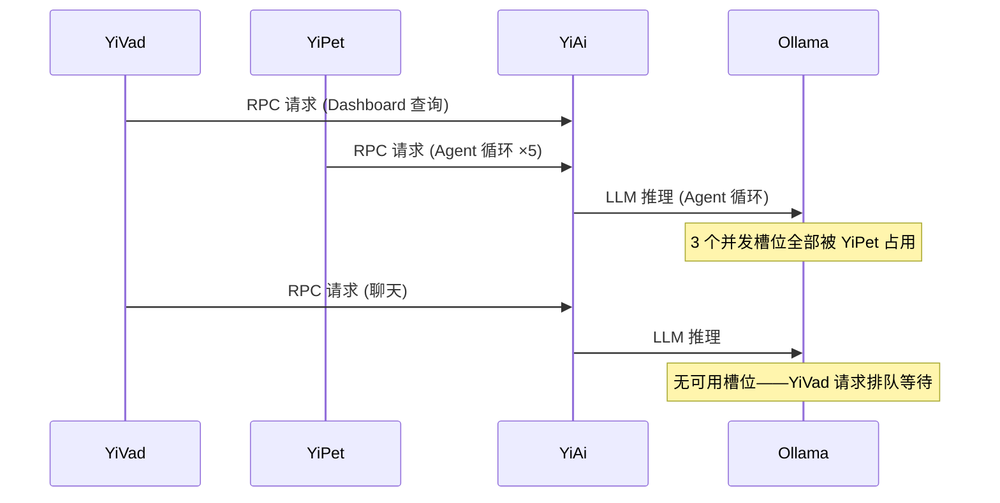
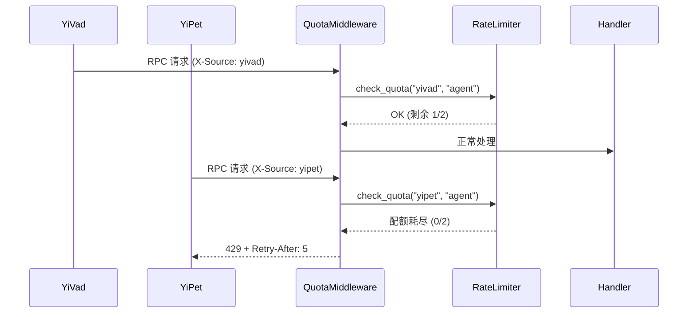

# YA-09-69: 服务端资源配额与租户隔离 — 多项目公平分配机制

> 需求编号：YA-09-69 · 优先级：P2 · 人天：0.5d · 状态：需求已编写

---

## 一、背景

### 1.1 问题描述

YiAi 作为单体后端同时服务于 YiVad（管理后台）和 YiPet（Chrome 扩展）。两者共享同一个 Ollama LLM 推理资源（GPU）、MongoDB 连接池和 CPU 时间。当前缺乏项目级别的资源隔离机制，导致以下问题：

1. **资源挤占**：YiPet 的密集 Agent 循环调用（每次 3-5 轮 LLM 推理）可能耗尽 Ollama 并发槽位，导致 YiVad 的 Dashboard 查询或简单聊天无法获得响应。
2. **无法计费**：缺乏按项目维度的资源使用统计，无法评估各项目的资源成本。
3. **无降级机制**：资源紧张时无法区分关键业务（YiVad 管理后台）和次要业务（YiPet 娱乐功能）。

### 1.2 影响范围

| 影响维度 | 具体表现 | 严重程度 |
|----------|---------|----------|
| 服务可用性 | YiPet Agent 可能挤占全部 Ollama 槽位，YiVad 聊天不可用 | 高 |
| 用户体验 | YiVad 管理后台在 Agent 密集时响应缓慢 | 高 |
| 成本管理 | 无法区分各项目资源消耗 | 中 |
| 容量规划 | 无法按项目维度预测资源需求 | 中 |

### 1.3 核心挑战

| 挑战 | 说明 |
|------|------|
| 请求来源识别 | 需要可靠地识别请求来自 YiVad 还是 YiPet |
| 配额粒度 | 配额应在 API 类型级别（Agent/Chat/RAG/CRUD）还是项目级别 |
| 超限处理 | 配额耗尽后应排队等待还是直接拒绝 |
| 动态调整 | 配额应支持配置热更新还是需要重启服务 |

---

## 二、现状分析

### 2.1 当前资源使用模式

```python
# 当前所有请求共享同一资源池——无隔离
@app.post("/")
async def rpc_handler(request: RpcRequest):
    # YiVad 和 YiPet 的请求在同一个 asyncio 事件循环中竞争
    result = await dispatch(request)
    return {"code": 0, "message": "ok", "data": result}
```

### 2.2 当前数据流



### 2.3 资源竞争分析

| 资源类型 | YiVad 典型用量 | YiPet 典型用量 | 冲突风险 |
|----------|--------------|--------------|---------|
| Ollama 推理槽位 | 1-2 | 2-6 (Agent 循环) | 高 |
| MongoDB 连接 | 5-10 | 2-5 | 低 |
| CPU 时间 | 低 (CRUD) | 中 (Agent 逻辑) | 中 |
| 内存 | 低 | 中 (Agent 状态) | 低 |

### 2.4 根因矩阵

| 根因 | 影响 | 严重度 |
|------|------|--------|
| 无请求来源标识 | 无法区分 YiVad 和 YiPet 请求 | 高 |
| 无资源配额机制 | 单一客户端可耗尽全部资源 | 高 |
| 无优先级划分 | 关键业务与次要业务同权竞争 | 中 |
| 无超限反馈 | 客户端不知道配额耗尽 | 中 |

---

## 三、设计决策

### D-01: 请求来源识别：X-Source Header vs Token vs URL 前缀

| 方案 | 优点 | 缺点 | 选择 |
|------|------|------|------|
| A: X-Source Header | 显式声明；简单可靠 | 需客户端配合 | **选择** |
| B: JWT Token 解析 | 无需额外 Header | Token 需包含 source 字段 | 否决 |
| C: URL 前缀 | 无需客户端配合 | 破坏 RPC 统一路由 `/` | 否决 |

**决策**: 选择 A。YiVad 和 YiPet 已经在请求中携带 `X-Source` 头部（yivad/yipet），只需在服务端解析即可。

### D-02: 配额策略：固定配额 vs 动态配额 vs 优先级驱逐

| 方案 | 优点 | 缺点 | 选择 |
|------|------|------|------|
| A: 固定配额 | 简单可预测；易于理解 | 无法适应负载变化 | **选择** |
| B: 动态配额 | 自适应负载 | 复杂；难以调试 | 否决 |
| C: 优先级驱逐 | 最大化资源利用 | 实现复杂；可能导致抖动 | 否决 |

**决策**: 选择 A。固定配额简单可靠，通过配置文件可热更新。对于 2 个项目的规模，固定配额已足够。

### D-03: 超限响应：排队等待 vs 429 拒绝 vs 降级

| 方案 | 优点 | 缺点 | 选择 |
|------|------|------|------|
| A: 排队等待 | 请求最终会完成 | 等待时间不可控 | 否决 |
| B: 429 拒绝 + Retry-After | 客户端可重试；资源保护 | 请求失败 | **选择** |
| C: 降级（返回缓存） | 对用户透明 | 仅适用于查询类请求 | 否决 |

**决策**: 选择 B。429 Too Many Requests 是 HTTP 标准的限流响应，客户端可据此实现退避重试。响应中包含 `Retry-After` 头部告知何时重试。

---

## 四、目标架构

### 4.1 目标数据流



### 4.2 配额配置

```python
QUOTA_CONFIG = {
    "yivad": {
        "agent":  {"rps": 1, "burst": 2, "priority": 10},
        "chat":   {"rps": 2, "burst": 3, "priority": 8},
        "rag":    {"rps": 5, "burst": 10, "priority": 5},
        "crud":   {"rps": 50, "burst": 100, "priority": 3},
    },
    "yipet": {
        "agent":  {"rps": 2, "burst": 3, "priority": 9},
        "chat":   {"rps": 3, "burst": 5, "priority": 7},
        "rag":    {"rps": 5, "burst": 10, "priority": 5},
        "crud":   {"rps": 20, "burst": 50, "priority": 3},
    },
}
```

### 4.3 架构指标

| 指标 | 当前 | 目标 |
|------|------|------|
| 项目间资源隔离 | 无 | 按 API 类型分级配额 |
| 配额超限 429 比例 | N/A | < 1% |
| 单项目资源最大占比 | 100% | 60% |
| 配额热更新 | 不支持 | 支持（配置文件变更 5s 生效） |

### 4.4 架构取舍

| 取舍 | 说明 |
|------|------|
| 固定配额 vs 资源利用率 | 固定配额可能浪费空闲资源（YiVad 闲置时 YiPet 仍受限） |
| 开发成本 vs 运维成本 | 配额机制增加开发成本但降低运维/排障成本 |
| 内存存储 vs 持久化 | 默认内存存储配额计数器，重启后重置 |

---

## 五、具体改动

### 5.1 新增: YiAi/src/server/middleware/quota.py

```python
"""资源配额隔离中间件——按项目来源和 API 类型分级配额。"""

import time
import logging
from typing import Optional
from fastapi import Request
from starlette.middleware.base import BaseHTTPMiddleware
from starlette.responses import JSONResponse

logger = logging.getLogger(__name__)

# 默认配额配置
DEFAULT_QUOTA = {
    "yivad": {
        "agent":  {"rps": 1, "burst": 2},
        "chat":   {"rps": 2, "burst": 3},
        "rag":    {"rps": 5, "burst": 10},
        "crud":   {"rps": 50, "burst": 100},
    },
    "yipet": {
        "agent":  {"rps": 2, "burst": 3},
        "chat":   {"rps": 3, "burst": 5},
        "rag":    {"rps": 5, "burst": 10},
        "crud":   {"rps": 20, "burst": 50},
    },
    "unknown": {
        "default": {"rps": 5, "burst": 10},
    },
}


class TokenBucket:
    """令牌桶——支持突发。"""

    def __init__(self, rate: float, burst: int):
        self._rate = rate
        self._burst = burst
        self._tokens = float(burst)
        self._last_refill = time.monotonic()

    def consume(self, tokens: int = 1) -> bool:
        """尝试消费令牌。返回 True 表示成功。"""
        now = time.monotonic()
        elapsed = now - self._last_refill
        self._tokens = min(self._burst, self._tokens + elapsed * self._rate)
        self._last_refill = now

        if self._tokens >= tokens:
            self._tokens -= tokens
            return True
        return False

    @property
    def available(self) -> float:
        """当前可用令牌数。"""
        return self._tokens

    @property
    def retry_after(self) -> float:
        """预计下次可用时间（秒）。"""
        if self._tokens >= 1:
            return 0
        return max(1, (1 - self._tokens) / self._rate)


class QuotaManager:
    """配额管理器——按项目来源和 API 类型管理令牌桶。"""

    def __init__(self, config: dict = None):
        self._config = config or DEFAULT_QUOTA
        self._buckets: dict[str, dict[str, TokenBucket]] = {}
        self._init_buckets()

    def _init_buckets(self) -> None:
        """初始化所有令牌桶。"""
        for source, quotas in self._config.items():
            self._buckets[source] = {}
            for api_type, cfg in quotas.items():
                self._buckets[source][api_type] = TokenBucket(
                    rate=cfg["rps"], burst=cfg["burst"]
                )

    def check_quota(self, source: str, api_type: str) -> tuple[bool, float]:
        """检查配额。返回 (是否放行, 重试等待秒数)。"""
        source_quotas = self._buckets.get(source)
        if not source_quotas:
            source_quotas = self._buckets.get("unknown", {})
            api_type = "default"

        bucket = source_quotas.get(api_type)
        if not bucket:
            bucket = source_quotas.get("default")
            if not bucket:
                return True, 0  # 无配置——放行

        if bucket.consume():
            return True, 0
        return False, bucket.retry_after

    def update_config(self, new_config: dict) -> None:
        """热更新配额配置。"""
        self._config = new_config
        self._init_buckets()
        logger.info("[Quota] 配额配置已热更新")


# 全局配额管理器
quota_manager = QuotaManager()


def classify_api_type(request: Request) -> str:
    """根据 RPC 请求的 module_name 分类 API 类型。"""
    try:
        # 尝试从请求体中提取 module_name
        import json
        body = request.state._body if hasattr(request.state, "_body") else None
        if body:
            data = json.loads(body) if isinstance(body, bytes) else body
            module = data.get("module_name", "")
            if "agent" in module:
                return "agent"
            if "chat" in module:
                return "chat"
            if "rag" in module:
                return "rag"
    except Exception:
        pass
    return "crud"  # 默认 CRUD


class QuotaMiddleware(BaseHTTPMiddleware):
    """配额隔离中间件。"""

    def __init__(self, app, manager: QuotaManager = None):
        super().__init__(app)
        self._manager = manager or quota_manager

    async def dispatch(self, request: Request, call_next):
        # 仅 RPC 路由启用配额检查
        if request.url.path not in ("/", "/rpc"):
            return await call_next(request)

        source = request.headers.get("X-Source", "unknown")
        api_type = classify_api_type(request)

        allowed, retry_after = self._manager.check_quota(source, api_type)

        if not allowed:
            logger.warning(
                f"[Quota] {source}.{api_type} 配额已耗尽"
            )
            return JSONResponse(
                {
                    "code": 4005,
                    "message": f"{source} {api_type} 配额已耗尽",
                    "data": None,
                },
                status_code=429,
                headers={
                    "Retry-After": str(int(retry_after)),
                    "X-RateLimit-Source": source,
                    "X-RateLimit-Type": api_type,
                },
            )

        response = await call_next(request)

        # 响应头告知配额使用情况
        bucket = (
            self._manager._buckets.get(source, {}).get(api_type)
        )
        if bucket:
            response.headers["X-RateLimit-Remaining"] = str(int(bucket.available))

        return response
```

### 5.2 修改: YiAi/src/server/main.py（注册中间件）

```python
from src.server.middleware.quota import QuotaMiddleware

app.add_middleware(QuotaMiddleware)
```

### 5.3 文件变更清单

| 文件 | 操作 | 行数 |
|------|------|------|
| `YiAi/src/server/middleware/quota.py` | 新增 | ~150 |
| `YiAi/src/server/main.py` | 修改（+2 行） | +2 |
| `YiAi/config/quota.yaml` | 新增（配额配置文件） | ~20 |

---

## 六、实施步骤

| 步骤 | 操作 | 文件 | 验证 | 人天 |
|------|------|------|------|------|
| 1 | 创建 `quota.py`——TokenBucket + QuotaManager | `server/middleware/quota.py` | 单元测试：令牌桶消费/补充 | 0.15 |
| 2 | 实现 API 类型分类逻辑 | 同上 | 单元测试：各 module_name 分类正确 | 0.1 |
| 3 | 创建配额配置文件 | `config/quota.yaml` | 配置加载测试 | 0.05 |
| 4 | 注册中间件到 main.py | `server/main.py` | 启动服务，发送请求验证 429 | 0.1 |
| 5 | 集成测试——配额隔离 | 测试脚本 | YiPet 超限不影响 YiVad | 0.05 |
| 6 | 全量回归测试 | 所有 | 现有测试通过 | 0.05 |

**总人天**: 0.5d

---

## 七、性能分析

### 7.1 配额检查开销

| 操作 | 耗时 |
|------|------|
| 令牌桶 consume() | ~1 μs |
| X-Source 头部解析 | ~0.5 μs |
| API 类型分类 | ~5 μs（含请求体解析） |
| 总开销 | < 10 μs |

### 7.2 容量规划

| 项目 | Agent | Chat | RAG | CRUD |
|------|-------|------|-----|------|
| YiVad | 1 rps (60/min) | 2 rps (120/min) | 5 rps (300/min) | 50 rps (3000/min) |
| YiPet | 2 rps (120/min) | 3 rps (180/min) | 5 rps (300/min) | 20 rps (1200/min) |
| 合计 | 3 rps | 5 rps | 10 rps | 70 rps |

---

## 八、测试规格

**TC-01: 配额内请求正常放行**

```gherkin
GIVEN YiVad 的 Agent 配额为 1 rps
WHEN YiVad 发送 1 个 Agent 请求
THEN 请求应正常处理
AND 响应头 X-RateLimit-Remaining 应为 0
```

**TC-02: 配额耗尽返回 429**

```gherkin
GIVEN YiPet 的 Agent 配额为 2 rps
WHEN YiPet 在第 1 秒内发送 3 个 Agent 请求
THEN 前 2 个请求应正常处理
AND 第 3 个请求应返回 429 Too Many Requests
AND 响应头应包含 Retry-After（秒数）
AND 响应体 code 应为 4005
```

**TC-03: 配额隔离——单客户端超限不影响其他客户端**

```gherkin
GIVEN YiPet 的 Agent 配额已耗尽（持续发送请求）
WHEN YiVad 发送 Agent 请求
THEN YiVad 的请求应正常处理
AND YiVad 的配额计数器应独立运算
```

**TC-04: 未知来源使用默认配额**

```gherkin
GIVEN 请求未携带 X-Source 头部
WHEN 请求到达 RPC 端点
THEN 应使用 "unknown" 默认配额（5 rps / 10 burst）
AND 请求正常处理（不因无来源而拒绝）
```

**TC-05: 配额热更新**

```gherkin
GIVEN 配额管理器正在运行，当前 YiVad Agent 配额为 1 rps
WHEN 调用 quota_manager.update_config({"yivad": {"agent": {"rps": 5, "burst": 10}}})
THEN 新的配额应立刻生效
AND 不影响其他客户端的配额
```

---

## 九、风险与缓解

| 风险 | 概率 | 影响 | 缓解措施 |
|------|------|------|------|
| 配额过严导致正常用户被限流 | 中 | 高 | 监控 429 比例 < 1%；初始配额宽松后续收紧 |
| 配额计数器在重启后丢失 | 高 | 低 | 重启后计数器重置——影响可控（1 秒内恢复） |
| X-Source 头部可被伪造 | 低 | 中 | 结合认证信息验证；伪造来源仅影响自身配额 |
| 配额配置文件错误导致全局限流 | 低 | 高 | 配置变更前验证格式；配置错误时使用默认值 |

---

## 十、回滚策略

| 场景 | 操作 | 影响 |
|------|------|------|
| 配额过严导致大量 429 | 提升配额或移除中间件 | 短时间恢复无限制模式 |
| 配额分类错误导致误限流 | 调整 classify_api_type 逻辑 | 特定 API 类型暂时无限制 |
| 中间件导致性能退化 | 移除中间件注册 | 恢复无配额模式 |

回滚方式：注释 `main.py` 中 `QuotaMiddleware` 的注册，重启服务。所有请求恢复无限制。

---

## 十一、设计决策记录

| 编号 | 决策 | 理由 | 日期 |
|------|------|------|------|
| D-01 | 使用 X-Source 头部识别请求来源 | YiVad/YiPet 已发送该头部，无需客户端改造 | 2026-09-09 |
| D-02 | 固定配额 + 令牌桶实现 | 简单可靠；支持突发；可配置热更新 | 2026-09-09 |
| D-03 | 超限返回 429 + Retry-After | HTTP 标准限流响应；客户端可自愈 | 2026-09-09 |
| D-04 | 按 API 类型分级配额 | 细粒度控制；核心业务（Agent）和边缘业务（CRUD）分开 | 2026-09-09 |
| D-05 | 内存存储配额计数器 | 简单高效；重启后重置影响可控 | 2026-09-09 |

---

## 十二、可观测性

### 12.1 指标

| 指标 | 类型 | 说明 |
|------|------|------|
| `quota_consumed_total` | Counter | 配额消耗次数（按 source + api_type） |
| `quota_exceeded_total` | Counter | 429 响应次数（按 source + api_type） |
| `quota_remaining` | Gauge | 当前可用配额（按 source + api_type） |
| `quota_exceed_ratio` | Gauge | 超限比例（quota_exceeded / quota_consumed） |

### 12.2 日志

```python
# 正常——配额消耗
[Quota] yivad.agent 配额消耗: 剩余 0/2

# 告警——配额耗尽
[Quota] yipet.agent 配额已耗尽

# 审计——配额热更新
[Quota] 配额配置已热更新: yivad.agent rps=1→2
```

### 12.3 告警

| 告警 | 条件 | 级别 |
|------|------|------|
| 配额超限率过高 | 5 分钟内 429 比例 > 5% | WARNING |
| 单客户端配额耗尽 | 1 分钟内 429 > 10 次 | INFO |
| 配额配置变更 | 任何变更 | INFO |

---

## 十三、安全合规

| 要求 | 实现 |
|------|------|
| 防止来源伪造 | 结合认证中间件验证 X-Source 与 Token 中的来源一致 |
| 配额旁路防护 | 未知来源使用最低默认配额（5 rps），防止绕过 |
| 配额配置审计 | 配置变更记录日志 + 可追溯 |
| 429 响应不泄露内部信息 | 仅返回配额耗尽提示，不暴露具体配额值 |

---

## 十四、代码审查检查清单

- [ ] 按客户端（yivad/yipet）和 API 类型分级配额——Agent/Chat/RAG/CRUD 独立配额
- [ ] 配额隔离——单客户端超限不影响其他客户端——令牌桶独立
- [ ] 配额可通过配置热更新——支持运行时 `update_config`
- [ ] 超限返回 429 + `Retry-After` + 配额使用量——客户端可自愈
- [ ] 未知来源使用默认配额——不拒绝无 X-Source 的请求
- [ ] 响应头包含 `X-RateLimit-Remaining`——客户端可感知配额余量
- [ ] 令牌桶支持突发（burst）——允许短时流量峰值
- [ ] 配额检查开销 < 10 μs——不成为性能瓶颈
- [ ] 配额计数器在重启后正确初始化——从配置重新加载
- [ ] 现有测试全部通过——配额中间件不破坏现有功能

---

*PRD 来源: `projects/yiai/requirements/2026-09/69-需求-资源配额隔离.md`*

## 影响范围

- **影响模块**：待补充
- **涉及文件**：
- `quota.py`
- `main.py`
- **是否影响 API 契约**：否
- **是否影响其他项目（YiVad/YiPet）**：否
- **用户感知**：待确认

## 预防措施

| 层面 | 措施 |
|------|------|
| 代码 | 在相关函数中添加参数校验和边界检查 |
| 测试 | 为 `quota.py` 添加单元测试 |
| 流程 | 代码审查时重点检查此类模式 |
| 监控 | 添加日志告警，异常发生时及时发现 |
| 文档 | 在编码规范中记录此类反模式 |

## 经验教训

1. **根本原因**：开发过程中对边界情况和异常路径的考虑不足是此类问题的共同根因
2. **设计阶段**：在接口设计和模块实现时，应主动考虑异常输入、空值、超时等边界场景
3. **代码审查**：审查时应检查是否存在类似的反模式（如未捕获异常、无超时控制、缺少参数校验等）
4. **测试覆盖**：异常路径的测试覆盖率应与正常路径同等重视
5. **团队分享**：此类问题应在团队周会或技术分享中讨论，形成团队共识
