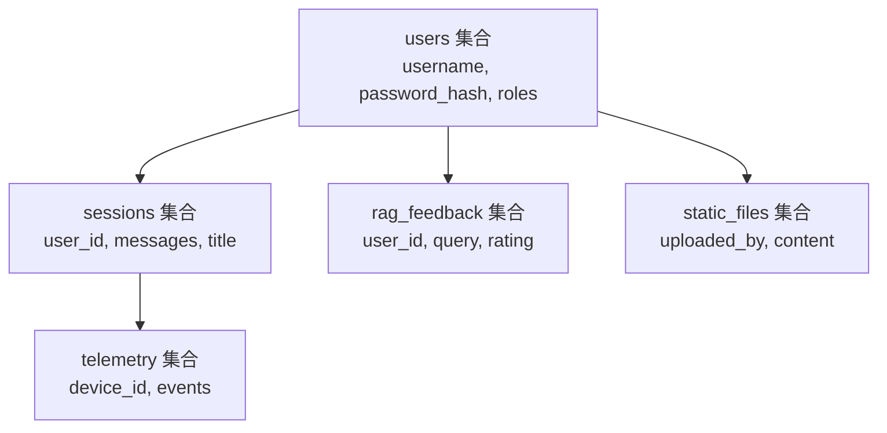
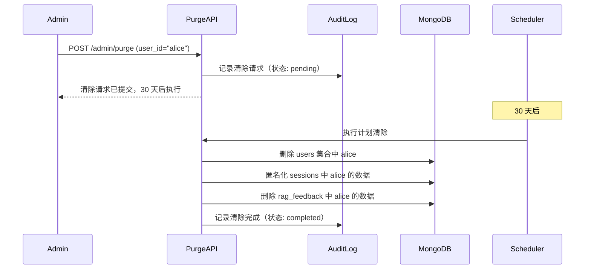

# YA-09-70: 服务端数据清除策略 — GDPR 合规的用户数据删除与匿名化

> 需求编号：YA-09-70 · 优先级：P2 · 人天：0.5d · 状态：需求已编写

---

## 一、背景

### 1.1 问题描述

YiAi 作为后端服务，存储了用户账户数据、聊天会话记录、RAG 反馈、遥测事件等个人信息。虽然 YiAi 目前定位为内部工具，但参考 GDPR（通用数据保护条例）和 PIPL（个人信息保护法）的最佳实践，需要提供规范的用户数据清除能力：

1. **被遗忘权**：用户有权要求删除其所有个人数据。
2. **数据最小化**：不应无限期保留用户数据。
3. **审计可追溯**：清除操作需要记录审计日志。

### 1.2 影响范围

| 影响维度 | 具体表现 | 严重程度 |
|----------|---------|----------|
| 法律合规 | 不符合 GDPR/PIPL 可能面临处罚 | 高 |
| 数据安全 | 用户数据无清除机制，离职员工数据残留 | 高 |
| 系统完整性 | 删除用户数据可能破坏关联数据的引用完整性 | 中 |
| 用户信任 | 缺乏数据控制权影响用户信任 | 中 |

### 1.3 核心挑战

| 挑战 | 说明 |
|------|------|
| 数据分散 | 用户数据分布在多个 MongoDB 集合中 |
| 引用完整性 | 删除用户数据可能破坏关联 Bug/Session 的引用 |
| 不可逆操作 | 清除操作需要冷静期防止误操作 |
| 审计要求 | 每次清除操作需记录谁、何时、清除了什么 |

---

## 二、现状分析

### 2.1 当前数据存储

```python
# 当前无用户数据清除机制。用户数据散落在各集合中。
# sessions 集合中的 messages 字段包含用户聊天内容
# users 集合存储用户名和密码哈希
# 无任何清除 API 或定期清理任务
```

### 2.2 用户数据分布



### 2.3 数据分类

| 类别 | 集合 | 用户字段 | 数据类型 | 敏感度 |
|------|------|---------|---------|--------|
| 账户 | users | _id | 用户名、密码哈希 | 高 |
| 会话 | sessions | user_id | 聊天内容、会话标题 | 高 |
| 反馈 | rag_feedback | user_id | 查询内容、评分 | 中 |
| 遥测 | telemetry | device_id | 设备信息、使用行为 | 中 |
| 文件 | static_files | uploaded_by | 上传文件内容 | 中 |

### 2.4 根因矩阵

| 根因 | 影响 | 严重度 |
|------|------|--------|
| 无数据清除 API | 无法响应用户数据删除请求 | 高 |
| 无数据分类策略 | 不清楚哪些数据需要清除 | 高 |
| 无清除审计日志 | 已执行的清除操作不可追溯 | 中 |
| 无冷静期机制 | 误操作无法撤销 | 中 |
| 无引用完整性处理 | 清除后关联数据断裂 | 中 |

---

## 三、设计决策

### D-01: 清除策略：物理删除 vs 匿名化 vs 混合策略

| 方案 | 优点 | 缺点 | 选择 |
|------|------|------|------|
| A: 物理删除 | 完全清除；符合 GDPR | 破坏引用完整性 | 否决 |
| B: 匿名化 | 保留引用完整性 | 数据仍占用存储 | 否决 |
| C: 混合策略 | 灵活；按数据类型选择 | 实现复杂 | **选择** |

**决策**: 选择 C。账户和个人信息物理删除，业务关联数据（会话、反馈）匿名化保留引用完整性。

### D-02: 清除时机：即时清除 vs 冷静期 vs 定时清除

| 方案 | 优点 | 缺点 | 选择 |
|------|------|------|------|
| A: 即时清除 | 响应快 | 误操作不可撤销 | 否决 |
| B: 冷静期（30 天） | 可撤销；防误操作 | 数据在冷静期内仍存在 | **选择** |
| C: 定时清除 | 批量处理效率高 | 延迟大 | 否决 |

**决策**: 选择 B。30 天冷静期符合 GDPR 的"合理时间"要求，同时给用户和管理员撤销的机会。

### D-03: 清除审计：数据库日志 vs 审计集合 vs 文件日志

| 方案 | 优点 | 缺点 | 选择 |
|------|------|------|------|
| A: 数据库日志 | 简单 | 不易查询；随日志轮转丢失 | 否决 |
| B: 审计集合 | 持久化；可查询 | 需要额外存储 | **选择** |
| C: 文件日志 | 独立于数据库 | 不易关联查询 | 否决 |

**决策**: 选择 B。MongoDB `audit_logs` 集合持久化审计记录，支持按时间、用户、操作类型查询。

---

## 四、目标架构

### 4.1 目标数据流



### 4.2 清除策略矩阵

| 数据类别 | 操作 | 匿名化值 | 保留期 |
|----------|------|---------|--------|
| 账户（users） | 物理删除 | N/A | 30 天冷静期 |
| 会话（sessions） | 匿名化 | `deleted_user_xxx` | 永久（匿名化后） |
| 聊天内容（messages） | 物理删除 | N/A | 30 天冷静期 |
| 反馈（rag_feedback） | 匿名化 | `anonymous_deleted` | 永久（匿名化后） |
| 遥测（telemetry） | 物理删除 | N/A | 30 天冷静期 |
| 文件（static_files） | 物理删除 | N/A | 30 天冷静期 |

### 4.3 架构指标

| 指标 | 当前 | 目标 |
|------|------|------|
| 数据清除覆盖率 | 0（无机制） | 100%（所有用户数据） |
| 清除操作可撤销 | N/A | 30 天冷静期 |
| 审计日志覆盖 | 0 | 100%（每次清除操作） |
| 清除后引用完整性 | N/A | 保留（匿名化替代删除） |

---

## 五、具体改动

### 5.1 新增: YiAi/src/services/admin/data_purging.py

```python
"""用户数据清除服务——GDPR 合规的删除与匿名化。"""

import logging
from datetime import datetime, timedelta
from typing import Optional
from motor.motor_asyncio import AsyncIOMotorDatabase

logger = logging.getLogger(__name__)

# 冷静期（天）
COOLING_OFF_DAYS = 30

# 清除策略配置
PURGE_CATEGORIES = {
    "account": {
        "collection": "users",
        "match_field": "_id",
        "action": "delete",
        "description": "用户账户",
    },
    "sessions": {
        "collection": "sessions",
        "match_field": "user_id",
        "action": "anonymize",
        "anonymize_value": "deleted_user_anonymous",
        "description": "会话记录（匿名化）",
    },
    "chat_messages": {
        "collection": "sessions",
        "match_field": "user_id",
        "action": "update_field",
        "field": "messages",
        "clear_value": [],
        "description": "聊天内容（清空）",
    },
    "feedback": {
        "collection": "rag_feedback",
        "match_field": "user_id",
        "action": "anonymize",
        "anonymize_value": "anonymous_deleted",
        "description": "RAG 反馈（匿名化）",
    },
    "telemetry": {
        "collection": "telemetry",
        "match_field": "device_id",
        "action": "delete",
        "description": "遥测数据",
    },
    "files": {
        "collection": "static_files",
        "match_field": "uploaded_by",
        "action": "delete",
        "description": "上传文件",
    },
}


class DataPurgingService:
    """用户数据清除服务。"""

    def __init__(self, db: AsyncIOMotorDatabase):
        self._db = db

    async def request_purge(
        self, user_id: str, requested_by: str, reason: str = ""
    ) -> dict:
        """提交清除请求——进入 30 天冷静期。"""
        existing = await self._db.purge_requests.find_one({
            "user_id": user_id,
            "status": "pending",
        })
        if existing:
            return {
                "status": "duplicate",
                "message": f"用户 {user_id} 已有待处理的清除请求",
                "scheduled_at": existing["scheduled_at"].isoformat(),
            }

        scheduled_at = datetime.utcnow() + timedelta(days=COOLING_OFF_DAYS)
        request_doc = {
            "user_id": user_id,
            "requested_by": requested_by,
            "reason": reason,
            "status": "pending",
            "created_at": datetime.utcnow(),
            "scheduled_at": scheduled_at,
        }
        await self._db.purge_requests.insert_one(request_doc)

        await self._audit(
            user_id=user_id,
            action="purge_requested",
            requested_by=requested_by,
            scheduled_at=scheduled_at.isoformat(),
        )

        logger.info(
            f"[DataPurge] 清除请求已提交: user={user_id}, "
            f"计划执行: {scheduled_at.isoformat()}"
        )
        return {
            "status": "scheduled",
            "message": f"清除请求已提交，计划执行时间: {scheduled_at.isoformat()}",
            "scheduled_at": scheduled_at.isoformat(),
            "cooling_off_days": COOLING_OFF_DAYS,
        }

    async def cancel_purge(self, user_id: str, cancelled_by: str) -> dict:
        """取消清除请求——在冷静期内撤销。"""
        result = await self._db.purge_requests.update_one(
            {"user_id": user_id, "status": "pending"},
            {"$set": {"status": "cancelled", "cancelled_at": datetime.utcnow()}},
        )
        if result.modified_count == 0:
            return {"status": "not_found", "message": "无可取消的清除请求"}

        await self._audit(
            user_id=user_id,
            action="purge_cancelled",
            requested_by=cancelled_by,
        )
        return {"status": "cancelled", "message": f"用户 {user_id} 的清除请求已取消"}

    async def execute_purge(self, user_id: str) -> dict:
        """执行清除——物理删除 + 匿名化。"""
        results = {}
        for category, config in PURGE_CATEGORIES.items():
            collection = config["collection"]
            match_field = config["match_field"]
            action = config["action"]

            if action == "delete":
                count = await self._db[collection].delete_many(
                    {match_field: user_id}
                )
                deleted = count.deleted_count
                results[category] = {"action": "delete", "count": deleted}

            elif action == "anonymize":
                value = config.get("anonymize_value", "anonymous_deleted")
                count = await self._db[collection].update_many(
                    {match_field: user_id},
                    {"$set": {match_field: value}},
                )
                results[category] = {
                    "action": "anonymize",
                    "count": count.modified_count,
                }

            elif action == "update_field":
                field = config["field"]
                value = config.get("clear_value", "")
                count = await self._db[collection].update_many(
                    {match_field: user_id},
                    {"$set": {field: value}},
                )
                results[category] = {
                    "action": "clear_field",
                    "count": count.modified_count,
                }

        # 更新清除请求状态
        await self._db.purge_requests.update_one(
            {"user_id": user_id, "status": "pending"},
            {
                "$set": {
                    "status": "completed",
                    "completed_at": datetime.utcnow(),
                    "results": results,
                }
            },
        )

        await self._audit(
            user_id=user_id,
            action="purge_completed",
            results=results,
        )

        logger.info(
            f"[DataPurge] 清除完成: user={user_id}, "
            f"总计: {sum(r.get('count', 0) for r in results.values())} 条记录"
        )
        return {"status": "completed", "results": results}

    async def execute_pending_purges(self) -> list[dict]:
        """执行所有到期的清除请求。"""
        now = datetime.utcnow()
        pending = await self._db.purge_requests.find({
            "status": "pending",
            "scheduled_at": {"$lte": now},
        }).to_list(None)

        results = []
        for request in pending:
            result = await self.execute_purge(request["user_id"])
            results.append({
                "user_id": request["user_id"],
                "result": result,
            })
        return results

    async def get_purge_status(self, user_id: str) -> Optional[dict]:
        """查询清除请求状态。"""
        request = await self._db.purge_requests.find_one(
            {"user_id": user_id},
            sort=[("created_at", -1)],
        )
        if request:
            request["_id"] = str(request["_id"])
        return request

    async def _audit(self, **kwargs) -> None:
        """记录清除审计日志。"""
        audit_doc = {
            **kwargs,
            "timestamp": datetime.utcnow(),
            "type": "data_purge",
        }
        await self._db.audit_logs.insert_one(audit_doc)
```

### 5.2 新增: YiAi/src/server/routes/admin_routes.py（清除 API）

```python
from src.services.admin.data_purging import DataPurgingService

@app.post("/admin/purge/request")
async def request_purge(request: PurgeRequest):
    service = DataPurgingService(request.app.mongodb)
    return await service.request_purge(
        user_id=request.user_id,
        requested_by=request.requested_by,
        reason=request.reason,
    )

@app.post("/admin/purge/cancel")
async def cancel_purge(request: CancelPurgeRequest):
    service = DataPurgingService(request.app.mongodb)
    return await service.cancel_purge(
        user_id=request.user_id,
        cancelled_by=request.cancelled_by,
    )

@app.get("/admin/purge/status/{user_id}")
async def get_purge_status(user_id: str):
    service = DataPurgingService(request.app.mongodb)
    return await service.get_purge_status(user_id)
```

### 5.3 文件变更清单

| 文件 | 操作 | 行数 |
|------|------|------|
| `YiAi/src/services/admin/data_purging.py` | 新增 | ~180 |
| `YiAi/src/server/routes/admin_routes.py` | 新增 | ~30 |
| `YiAi/src/server/scheduler.py` | 修改（新增定时清除任务） | +10 |

---

## 六、实施步骤

| 步骤 | 操作 | 文件 | 验证 | 人天 |
|------|------|------|------|------|
| 1 | 创建 `data_purging.py`——清除策略 + 服务 | `services/admin/data_purging.py` | 单元测试：各策略正确执行 | 0.15 |
| 2 | 创建清除 API 路由 | `server/routes/admin_routes.py` | 集成测试：API 调用正确 | 0.1 |
| 3 | 添加定时清除任务 | `server/scheduler.py` | 验证到期请求自动执行 | 0.1 |
| 4 | 创建 MongoDB 索引 | N/A | `purge_requests` 和 `audit_logs` 集合索引 | 0.05 |
| 5 | 集成测试——全流程 | 测试脚本 | 请求→冷静期→执行→审计 | 0.05 |
| 6 | 全量回归测试 | 所有 | 现有测试通过 | 0.05 |

**总人天**: 0.5d

---

## 七、性能分析

### 7.1 清除操作开销

| 操作 | 数据量 | 耗时 |
|------|--------|------|
| 删除 users | 1 条 | < 5ms |
| 匿名化 sessions | 100 条 | < 50ms |
| 删除 telemetry | 1000 条 | < 100ms |
| 完整清除 | 1 用户 | < 200ms |

### 7.2 定时任务开销

| 场景 | 频率 | 开销 |
|------|------|------|
| 无待执行清除 | 每小时 | 1ms（查询无结果） |
| 1 个待执行清除 | 每小时 | 200ms |
| 10 个待执行清除 | 每小时 | 2s |

---

## 八、测试规格

**TC-01: 提交清除请求进入冷静期**

```gherkin
GIVEN 用户 "alice" 存在于系统中
WHEN 管理员提交清除请求 purge_request("alice")
THEN 应创建一条 purge_requests 记录（status=pending）
AND scheduled_at 应为 30 天后
AND 系统应立即返回成功响应
AND 用户数据在冷静期内不应被清除
```

**TC-02: 冷静期内可撤销清除请求**

```gherkin
GIVEN 用户 "alice" 的清除请求处于 pending 状态（剩余 20 天）
WHEN 管理员调用 cancel_purge("alice")
THEN 清除请求状态应变更为 cancelled
AND 用户数据应保持原样
AND 审计日志应记录取消操作
```

**TC-03: 到期自动执行清除**

```gherkin
GIVEN 用户 "alice" 的清除请求 scheduled_at 已过期
WHEN 定时任务 execute_pending_purges 运行
THEN users 集合中 alice 应被物理删除
AND sessions 集合中 alice 的 user_id 应被匿名化
AND sessions 集合中 alice 的 messages 应被清空
AND 清除请求状态应变更为 completed
AND 审计日志应记录清除完成
```

**TC-04: 重复清除请求被拒绝**

```gherkin
GIVEN 用户 "alice" 已有 pending 状态的清除请求
WHEN 再次提交 alice 的清除请求
THEN 应返回 duplicate 状态
AND 不应创建新的清除请求
```

**TC-05: 清除后引用完整性**

```gherkin
GIVEN 用户 "alice" 有 50 条会话记录和 10 条 Bug 报告
WHEN 清除请求执行完成
THEN Bug 报告的创建者应显示为 "deleted_user_anonymous"
AND 聊天消息应被清空
AND 会话标题应保留（不引用用户信息）
```

---

## 九、风险与缓解

| 风险 | 概率 | 影响 | 缓解措施 |
|------|------|------|------|
| 清除遗漏某些集合 | 中 | 高 | 清除后全量扫描验证；新增集合需注册到 PURGE_CATEGORIES |
| 匿名化后关联数据断裂 | 中 | 中 | 匿名化保留 user_id 字段（值改为标记），不删除引用 |
| 冷静期过期后仍可撤销 | 低 | 低 | 定时任务执行后立即标记 completed |
| 审计日志膨胀 | 低 | 低 | 审计日志定期归档（保留 1 年） |
| 误操作清除生产用户 | 低 | 高 | 30 天冷静期 + 清除前人工确认 |

---

## 十、回滚策略

| 场景 | 操作 | 影响 |
|------|------|------|
| 清除逻辑错误 | 修复代码后重新部署 | 已清除的数据不可恢复（需从备份恢复） |
| 冷静期配置错误 | 调整 COOLING_OFF_DAYS 配置 | 仅影响新请求 |
| 定时任务误执行 | 停止定时任务，手动审查 pending 请求 | 已执行的清除不可逆 |

回滚方式：对于尚未执行的清除请求，调用 `cancel_purge` API 撤销。对于已执行的清除，需从 MongoDB 备份恢复。

---

## 十一、设计决策记录

| 编号 | 决策 | 理由 | 日期 |
|------|------|------|------|
| D-01 | 混合清除策略（删除 + 匿名化） | 账户数据删除，业务数据匿名化保留引用完整性 | 2026-09-09 |
| D-02 | 30 天冷静期 | 符合 GDPR 最佳实践；允许误操作撤销 | 2026-09-09 |
| D-03 | MongoDB audit_logs 集合审计 | 持久化可查询；与业务数据同库简化管理 | 2026-09-09 |
| D-04 | 定时任务执行到期清除 | 避免管理员遗忘；自动化执行减少人工 | 2026-09-09 |
| D-05 | 匿名化而非假名化 | 匿名化不可逆（GDPR 不再视为个人数据）；假名化仍可逆 | 2026-09-09 |

---

## 十二、可观测性

### 12.1 指标

| 指标 | 类型 | 说明 |
|------|------|------|
| `purge_requests_total` | Counter | 清除请求次数（按状态） |
| `purge_executions_total` | Counter | 清除执行次数 |
| `purge_records_affected_total` | Counter | 受影响的记录数（按集合） |
| `purge_pending_count` | Gauge | 当前待处理清除请求数 |

### 12.2 日志

```python
# 正常——清除请求
[DataPurge] 清除请求已提交: user=alice, 计划执行: 2026-10-09T10:00:00

# 正常——清除完成
[DataPurge] 清除完成: user=alice, 总计: 152 条记录

# 警告——清除失败
[DataPurge] 清除异常: user=bob, 集合=telemetry, 错误: connection timeout
```

### 12.3 告警

| 告警 | 条件 | 级别 |
|------|------|------|
| 清除执行失败 | 任何清除操作异常 | ERROR |
| 待处理清除积压 | pending > 10 | WARNING |
| 清除请求异常增多 | 1 小时内 > 50 | WARNING |

---

## 十三、安全合规

| 要求 | 实现 |
|------|------|
| 清除操作需认证 | 清除 API 需要管理员 Token |
| 审计日志不可篡改 | audit_logs 集合仅追加，不提供删除接口 |
| 30 天冷静期 | 符合 GDPR "合理时间" 要求 |
| 数据最小化 | 清除后不再保留个人数据 |
| 清除确认 | 清除前需人工确认（API 调用前审核） |
| 匿名化不可逆 | 匿名化后数据不再属于 GDPR 管辖范围 |

---

## 十四、代码审查检查清单

- [ ] 用户数据清除覆盖所有集合——sessions/bugs/knowledge_files/telemetry/users/static_files
- [ ] 清除策略：匿名化替代物理删除（保留引用完整性）——sessions 和 feedback 匿名化
- [ ] 清除审计日志记录（谁/何时/清除了什么）——audit_logs 集合
- [ ] 清除请求有 30 天冷静期（可撤销）——purge_requests 状态机
- [ ] 重复清除请求被拒绝——不创建重复的 pending 请求
- [ ] 定时任务自动执行到期清除——每小时检查一次
- [ ] 清除操作幂等——重复执行不产生副作用
- [ ] 清除 API 需要管理员权限——认证中间件保护
- [ ] 匿名化使用固定标记值——不包含原用户信息
- [ ] 现有测试全部通过——清除服务不破坏现有功能

---

*PRD 来源: `projects/yiai/requirements/2026-09/70-需求-GDPR数据清除.md`*

## 影响范围

- **影响模块**：待补充
- **涉及文件**：
- `data_purging.py`
- **是否影响 API 契约**：否
- **是否影响其他项目（YiVad/YiPet）**：否
- **用户感知**：待确认

## 预防措施

| 层面 | 措施 |
|------|------|
| 代码 | 在相关函数中添加参数校验和边界检查 |
| 测试 | 为 `data_purging.py` 添加单元测试 |
| 流程 | 代码审查时重点检查此类模式 |
| 监控 | 添加日志告警，异常发生时及时发现 |
| 文档 | 在编码规范中记录此类反模式 |

## 经验教训

1. **根本原因**：开发过程中对边界情况和异常路径的考虑不足是此类问题的共同根因
2. **设计阶段**：在接口设计和模块实现时，应主动考虑异常输入、空值、超时等边界场景
3. **代码审查**：审查时应检查是否存在类似的反模式（如未捕获异常、无超时控制、缺少参数校验等）
4. **测试覆盖**：异常路径的测试覆盖率应与正常路径同等重视
5. **团队分享**：此类问题应在团队周会或技术分享中讨论，形成团队共识
