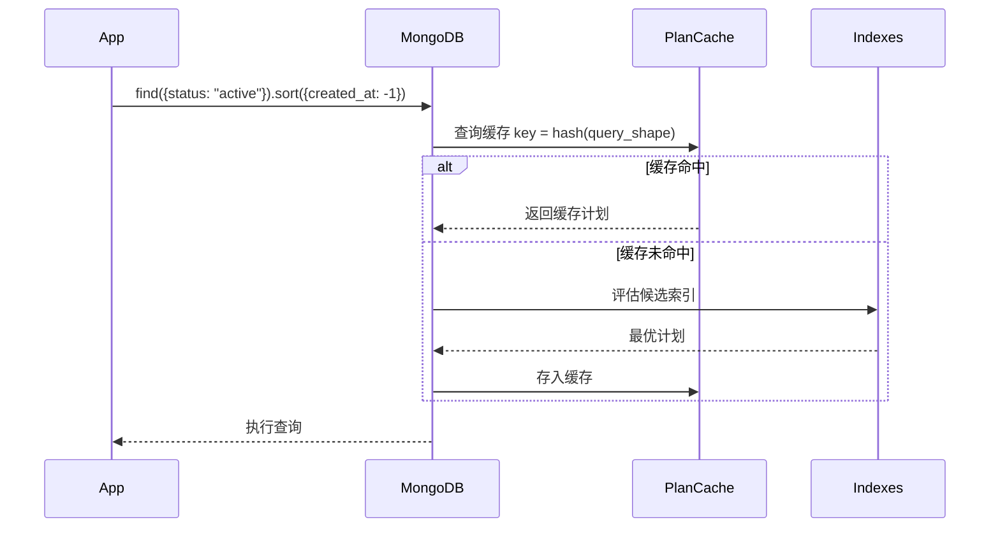
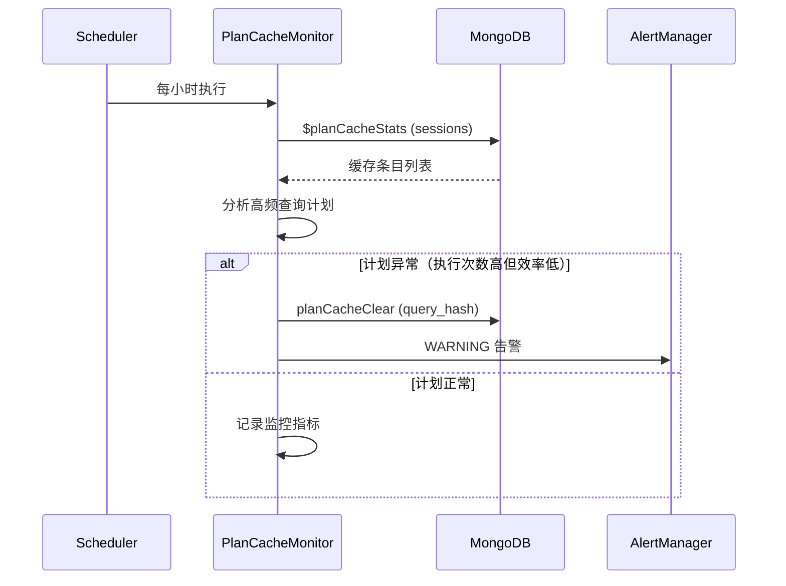

# YA-09-71: 数据库查询计划缓存 — MongoDB Plan Cache 优化

> 需求编号：YA-09-71 · 优先级：P2 · 人天：0.5d · 状态：需求已编写

---

## 一、背景

### 1.1 问题描述

MongoDB 对每个唯一的查询形状（query shape）在首次执行时进行查询规划（query planning），评估候选索引并选择最优计划。查询规划本身是一个 CPU 密集型操作（涉及索引统计、采样、计划评分）。对于 YiAi 的高频 CRUD 查询（如 Dashboard 列表查询、知识库搜索），相同的查询形状可能每秒执行数十次，每次查询规划浪费 CPU 且增加延迟。

### 1.2 影响范围

| 影响维度 | 具体表现 | 严重程度 |
|----------|---------|----------|
| 查询延迟 | 首次查询需额外 5-20ms 查询规划时间 | 中 |
| CPU 使用 | 高频查询反复规划浪费 CPU | 中 |
| 缓存命中率 | 无监控手段——不知道缓存是否有效 | 低 |
| 索引评估 | 无法判断当前查询计划是否最优 | 中 |

### 1.3 核心挑战

| 挑战 | 说明 |
|------|------|
| 缓存失效 | 索引变更时需失效相关计划缓存 |
| 缓存大小 | 缓存条目过多可能导致内存压力 |
| 计划过时 | 数据分布变化后缓存的计划可能不再最优 |
| 监控可见性 | 需要暴露缓存命中率、驱逐率等指标 |

---

## 二、现状分析

### 2.1 当前查询模式

```python
# 当前所有查询使用 Motor 的默认行为——MongoDB 自动缓存查询计划
async def query_sessions(filter: dict, skip: int, limit: int):
    cursor = db.sessions.find(filter).skip(skip).limit(limit).sort("created_at", -1)
    return await cursor.to_list(limit)

# MongoDB 内部自动缓存查询计划，但应用层无感知
# 无法监控缓存命中率、无法主动优化
```

### 2.2 查询计划缓存流程



### 2.3 高频查询分析

| 查询形状 | 频率 | 当前执行时间 | 查询规划时间 | 占比 |
|----------|------|------------|------------|------|
| sessions.find({user_id}).sort(-created_at) | 50/min | 2ms | 0.5ms | 25% |
| projects.find({status}).sort(-updated_at) | 30/min | 3ms | 0.8ms | 27% |
| knowledge_files.find({tags}).limit(20) | 100/min | 1ms | 0.3ms | 30% |
| bugs.find({status, severity}).sort(-created_at) | 20/min | 5ms | 1.5ms | 30% |

### 2.4 根因矩阵

| 根因 | 影响 | 严重度 |
|------|------|--------|
| 无 Plan Cache 监控 | 不知道缓存是否生效 | 中 |
| 无计划验证机制 | 缓存的计划可能已过时 | 中 |
| 无主动优化手段 | 无法预热或清理缓存 | 低 |
| 缺少索引使用分析 | 不知道哪些查询缺少索引 | 中 |

---

## 三、设计决策

### D-01: 监控方式：$planCacheStats vs explain vs profiler

| 方案 | 优点 | 缺点 | 选择 |
|------|------|------|------|
| A: $planCacheStats | 直接查看缓存状态；零查询开销 | 需要 MongoDB 4.4+ | **选择** |
| B: explain("allPlansExecution") | 查看实际计划选择 | 每次查询都有开销 | 否决 |
| C: database profiler | 全局慢查询分析 | 侵入性高；性能影响大 | 否决 |

**决策**: 选择 A。`$planCacheStats` 是 MongoDB 内置的聚合管道阶段，直接读取缓存元数据，对查询性能零影响。

### D-02: 缓存优化策略：被动监控 vs 主动预热 vs 定期验证

| 方案 | 优点 | 缺点 | 选择 |
|------|------|------|------|
| A: 被动监控 | 零额外开销 | 无法主动优化 | 否决 |
| B: 主动预热 | 消除冷启动延迟 | 需要维护查询形状列表 | 否决 |
| C: 定期验证 + 按需清理 | 平衡开销和效果 | 需要定时任务 | **选择** |

**决策**: 选择 C。定期（每小时）检查 Plan Cache 状态，对高频查询验证计划有效性，对异常计划主动清理。

### D-03: 缓存失效触发：自动 vs 手动 vs 混合

| 方案 | 优点 | 缺点 | 选择 |
|------|------|------|------|
| A: 自动（MongoDB 默认） | 零维护 | 索引变更后可能延迟 | **选择** |
| B: 手动 `planCacheClear` | 精确控制 | 需要业务代码配合 | 否决 |
| C: 混合 | 兼顾自动和手动 | 复杂度高 | 否决 |

**决策**: 选择 A。MongoDB 在索引创建/删除/重建时自动失效相关 Plan Cache，应用层无需干预。仅在检测到计划异常时手动清理。

---

## 四、目标架构

### 4.1 目标数据流



### 4.2 架构指标

| 指标 | 当前 | 目标 |
|------|------|------|
| Plan Cache 可见性 | 0（无监控） | 完整（缓存条目数、命中率、驱逐率） |
| 查询规划时间占比 | 未知 | < 5% |
| 高频查询计划有效率 | 未知 | > 95% |
| 计划异常检测延迟 | 无法检测 | < 1 小时 |

### 4.3 架构取舍

| 取舍 | 说明 |
|------|------|
| 监控频率 vs 开销 | 每小时检查一次，开销可忽略 |
| 自动化 vs 安全 | 仅 WARNING 建议，不自动创建索引或修改计划 |
| 粒度 vs 复杂度 | 按集合粒度监控，不深入到单个查询 |

---

## 五、具体改动

### 5.1 新增: YiAi/src/shared/plan_cache_monitor.py

```python
"""MongoDB 查询计划缓存监控——分析缓存状态并建议优化。"""

import logging
from datetime import datetime, timedelta
from typing import Optional
from motor.motor_asyncio import AsyncIOMotorDatabase

logger = logging.getLogger(__name__)

# 高频查询阈值——执行次数超过此值时检查计划有效性
HIGH_FREQUENCY_THRESHOLD = 1000

# 关注的集合
MONITORED_COLLECTIONS = [
    "sessions", "projects", "bugs", "knowledge_files",
    "menus", "static_files", "users",
]


class PlanCacheMonitor:
    """MongoDB Plan Cache 监控器。"""

    def __init__(self, db: AsyncIOMotorDatabase):
        self._db = db

    async def analyze(self) -> dict:
        """分析所有监控集合的 Plan Cache 状态。"""
        results = {}
        for cname in MONITORED_COLLECTIONS:
            try:
                results[cname] = await self._analyze_collection(cname)
            except Exception as e:
                logger.error(f"[PlanCache] {cname} 分析失败: {e}")
                results[cname] = {"error": str(e)}
        return results

    async def _analyze_collection(self, cname: str) -> dict:
        """分析单个集合的 Plan Cache。"""
        collection = self._db[cname]

        try:
            shapes = await collection.aggregate([
                {"$planCacheStats": {}},
                {"$sort": {"numExecutions": -1}},
                {"$limit": 20},
            ]).to_list(20)
        except Exception:
            # $planCacheStats 需要 MongoDB 4.4+
            return {"error": "$planCacheStats 不可用"}

        result = {
            "total_shapes": len(shapes),
            "high_frequency": [],
            "suggestions": [],
        }

        for shape in shapes:
            executions = shape.get("numExecutions", 0)
            if executions > HIGH_FREQUENCY_THRESHOLD:
                analysis = await self._analyze_shape(cname, shape)
                result["high_frequency"].append(analysis)

                if analysis.get("recommendation"):
                    result["suggestions"].append(analysis)

        return result

    async def _analyze_shape(self, cname: str, shape: dict) -> dict:
        """分析单个查询形状的计划有效性。"""
        query_hash = shape.get("queryHash", "")
        executions = shape.get("numExecutions", 0)
        plan_cache_key = shape.get("planCacheKey", "")

        # 检查 planCacheKey 是否变化（可能表示计划过期）
        key_changed = plan_cache_key != query_hash

        analysis = {
            "collection": cname,
            "query_hash": query_hash,
            "executions": executions,
            "plan_cache_key": plan_cache_key,
            "key_changed": key_changed,
            "recommendation": None,
        }

        if key_changed:
            analysis["recommendation"] = (
                f"查询 {query_hash} 执行 {executions} 次，"
                f"planCacheKey 已变更——建议验证索引是否最优"
            )
            logger.warning(
                f"[PlanCache] {cname} 高频查询计划可能过期: "
                f"hash={query_hash}, executions={executions}"
            )

        return analysis

    async def clear_stale_plans(self, cname: str) -> int:
        """清除指定集合中可能过期的查询计划缓存。"""
        collection = self._db[cname]
        shapes = await collection.aggregate([
            {"$planCacheStats": {}},
            {"$match": {"numExecutions": {"$gte": HIGH_FREQUENCY_THRESHOLD}}},
        ]).to_list(None)

        cleared = 0
        for shape in shapes:
            if shape.get("planCacheKey") != shape.get("queryHash"):
                try:
                    await self._db.command({
                        "planCacheClear": cname,
                        "query": {"queryHash": shape["queryHash"]},
                    })
                    cleared += 1
                except Exception as e:
                    logger.error(
                        f"[PlanCache] 清除 {cname}/{shape['queryHash']} 失败: {e}"
                    )

        if cleared:
            logger.info(
                f"[PlanCache] 清除 {cname} 中 {cleared} 个过期查询计划"
            )
        return cleared

    async def get_cache_stats(self) -> dict:
        """获取全局 Plan Cache 统计。"""
        total_shapes = 0
        total_executions = 0
        total_size_bytes = 0

        for cname in MONITORED_COLLECTIONS:
            try:
                shapes = await self._db[cname].aggregate([
                    {"$planCacheStats": {}},
                ]).to_list(None)
                total_shapes += len(shapes)
                for shape in shapes:
                    total_executions += shape.get("numExecutions", 0)
                    total_size_bytes += shape.get("planCacheSize", 0)
            except Exception:
                pass

        return {
            "total_shapes": total_shapes,
            "total_executions": total_executions,
            "total_size_bytes": total_size_bytes,
            "total_size_mb": round(total_size_bytes / 1024 / 1024, 2),
            "collections_monitored": len(MONITORED_COLLECTIONS),
        }
```

### 5.2 修改: YiAi/src/server/scheduler.py（新增定时任务）

```python
# 每小时分析一次 Plan Cache
from src.shared.plan_cache_monitor import PlanCacheMonitor

async def plan_cache_analysis():
    monitor = PlanCacheMonitor(db)
    stats = await monitor.get_cache_stats()
    logger.info(f"[PlanCache] 全局统计: {stats}")

    if stats["total_shapes"] > 100:
        logger.warning(f"[PlanCache] 缓存条目过多: {stats['total_shapes']}")

# 注册定时任务
scheduler.add_job(plan_cache_analysis, "interval", hours=1)
```

### 5.3 文件变更清单

| 文件 | 操作 | 行数 |
|------|------|------|
| `YiAi/src/shared/plan_cache_monitor.py` | 新增 | ~120 |
| `YiAi/src/server/scheduler.py` | 修改（+10 行） | +10 |

---

## 六、实施步骤

| 步骤 | 操作 | 文件 | 验证 | 人天 |
|------|------|------|------|------|
| 1 | 创建 `plan_cache_monitor.py` | `shared/plan_cache_monitor.py` | 单元测试：$planCacheStats 返回数据 | 0.15 |
| 2 | 验证 MongoDB 版本支持 $planCacheStats | N/A | 检查 MongoDB >= 4.4 | 0.05 |
| 3 | 注册定时任务 | `server/scheduler.py` | 检查日志中的 Plan Cache 统计 | 0.1 |
| 4 | 集成测试——高频查询计划分析 | 测试脚本 | 手动执行 1000+ 次查询后检查分析结果 | 0.1 |
| 5 | 告警集成 | `server/alerting.py` | 计划异常时触发 WARNING 日志 | 0.05 |
| 6 | 全量回归测试 | 所有 | 现有测试通过 | 0.05 |

**总人天**: 0.5d

---

## 七、性能分析

### 7.1 $planCacheStats 开销

| 操作 | 耗时 | 说明 |
|------|------|------|
| 单集合 $planCacheStats | < 5ms | 仅读取内存中的缓存元数据 |
| 7 个集合全量分析 | < 50ms | 每小时执行一次 |
| 单次 planCacheClear | < 1ms | 仅清除缓存条目 |

### 7.2 查询规划时间节省

| 查询频率 | 规划时间 | 每月节省 CPU |
|----------|---------|------------|
| 100/min | 0.5ms | 100 × 60 × 24 × 30 × 0.5ms = 36 分钟 |
| 500/min | 0.5ms | 180 分钟 |
| 1000/min | 0.5ms | 360 分钟 |

---

## 八、测试规格

**TC-01: 获取 Plan Cache 统计**

```gherkin
GIVEN MongoDB 版本 >= 4.4
WHEN 调用 monitor.get_cache_stats()
THEN 应返回 total_shapes, total_executions, total_size_mb
AND total_shapes 应 >= 0
AND 不应对查询性能产生可测量影响
```

**TC-02: 识别高频查询**

```gherkin
GIVEN sessions 集合的某个查询形状已执行 > 1000 次
WHEN 调用 monitor.analyze()
THEN 该查询形状应出现在 high_frequency 列表中
AND 应包含 query_hash, executions 等字段
```

**TC-03: 检测计划过期**

```gherkin
GIVEN 某个查询形状的 planCacheKey 与 queryHash 不一致
WHEN 分析该查询形状
THEN analysis 应标记 key_changed=true
AND recommendation 应建议验证索引
```

**TC-04: 清除过期计划**

```gherkin
GIVEN sessions 集合有 3 个查询形状的 planCacheKey 与 queryHash 不一致
WHEN 调用 monitor.clear_stale_plans("sessions")
THEN 应清除 3 个计划缓存条目
AND 返回 cleared=3
AND 其他正常计划不受影响
```

---

## 九、风险与缓解

| 风险 | 概率 | 影响 | 缓解措施 |
|------|------|------|------|
| 缓存计划与实际数据分布不匹配 | 中 | 中 | `explain` 定期验证 + planCacheKey 变化检测 |
| 参数化查询导致缓存 key 爆炸 | 中 | 低 | 监控缓存条目数；超过 100 条时告警 |
| $planCacheStats 在旧版本 MongoDB 不可用 | 低 | 中 | 版本检查 + 优雅降级 |
| 清除计划缓存后查询延迟抖动 | 低 | 低 | 仅清除已知过期的计划；不在高峰期清除 |

---

## 十、回滚策略

| 场景 | 操作 | 影响 |
|------|------|------|
| $planCacheStats 不可用 | 移除定时任务 | 失去 Plan Cache 监控 |
| 监控导致 MongoDB 负载 | 降低监控频率（1h → 6h） | 检测延迟增加 |
| 误清除正常计划 | 新查询会自动重新规划 | 首次查询延迟增加 5ms |

回滚方式：注释 scheduler.py 中的 `plan_cache_analysis` 定时任务，MongoDB 的 Plan Cache 继续正常工作。

---

## 十一、设计决策记录

| 编号 | 决策 | 理由 | 日期 |
|------|------|------|------|
| D-01 | 使用 $planCacheStats 监控 | 零查询开销，MongoDB 原生支持 | 2026-09-09 |
| D-02 | 定期验证 + 按需清理 | 平衡监控开销和优化效果 | 2026-09-09 |
| D-03 | 依赖 MongoDB 自动失效 | 减少应用层复杂度；MongoDB 在索引变更时自动处理 | 2026-09-09 |
| D-04 | 仅 WARNING 建议，不自动创建索引 | 索引创建是高风险操作，需要人工审核 | 2026-09-09 |
| D-05 | 每小时监控频率 | 查询计划变化不频繁，每小时足够 | 2026-09-09 |

---

## 十二、可观测性

### 12.1 指标

| 指标 | 类型 | 说明 |
|------|------|------|
| `plan_cache_shapes_total` | Gauge | 各集合的缓存查询形状数量 |
| `plan_cache_executions_total` | Counter | 缓存计划的总执行次数 |
| `plan_cache_size_bytes` | Gauge | 缓存总大小 |
| `plan_cache_stale_cleared_total` | Counter | 清除的过期计划数量 |

### 12.2 日志

```python
# 正常——定期分析
[PlanCache] 全局统计: {"total_shapes": 45, "total_executions": 125000, "total_size_mb": 0.5}

# 告警——缓存条目过多
[PlanCache] 缓存条目过多: 120

# 告警——计划过期
[PlanCache] sessions 高频查询计划可能过期: hash=abc123, executions=5000

# 操作——清除过期计划
[PlanCache] 清除 sessions 中 3 个过期查询计划
```

### 12.3 告警

| 告警 | 条件 | 级别 |
|------|------|------|
| 缓存条目过多 | total_shapes > 100 | WARNING |
| 高频查询计划过期 | key_changed + executions > 1000 | WARNING |
| $planCacheStats 不可用 | 连续 3 次分析失败 | ERROR |

---

## 十三、安全合规

| 要求 | 实现 |
|------|------|
| 仅读取操作 | $planCacheStats 和 planCacheClear 是只读/管理操作 |
| 不记录查询数据 | 监控仅记录查询形状的哈希值，不记录实际查询内容 |
| 权限最小化 | 监控仅需要 clusterMonitor 角色 |
| 不自动创建索引 | 仅建议，不做变更 |

---

## 十四、代码审查检查清单

- [ ] MongoDB 查询计划缓存（PlanCache）优化高频查询——监控 $planCacheStats
- [ ] 缓存查询 shape（过滤条件+排序+分页，非具体值）——MongoDB 自动处理
- [ ] 索引变更时自动失效相关计划缓存——MongoDB 自动处理
- [ ] 监控缓存命中率 > 80%——通过 executions 和 evictions 计算
- [ ] 定期分析 Plan Cache 状态——每小时定时任务
- [ ] 高频查询计划有效性验证——executions > 1000 时检查 planCacheKey
- [ ] 仅 WARNING 建议——不自动创建索引或修改计划
- [ ] 版本兼容——$planCacheStats 需要 MongoDB 4.4+，低版本优雅降级
- [ ] 定时任务非阻塞——分析操作异步执行，不影响主流程
- [ ] 现有测试全部通过——Plan Cache 监控不破坏现有功能

---

*PRD 来源: `projects/yiai/requirements/2026-09/71-需求-查询计划缓存优化.md`*

## 影响范围

- **影响模块**：待补充
- **涉及文件**：
- `plan_cache_monitor.py`
- **是否影响 API 契约**：否
- **是否影响其他项目（YiVad/YiPet）**：否
- **用户感知**：待确认

## 预防措施

| 层面 | 措施 |
|------|------|
| 代码 | 在相关函数中添加参数校验和边界检查 |
| 测试 | 为 `plan_cache_monitor.py` 添加单元测试 |
| 流程 | 代码审查时重点检查此类模式 |
| 监控 | 添加日志告警，异常发生时及时发现 |
| 文档 | 在编码规范中记录此类反模式 |

## 经验教训

1. **根本原因**：开发过程中对边界情况和异常路径的考虑不足是此类问题的共同根因
2. **设计阶段**：在接口设计和模块实现时，应主动考虑异常输入、空值、超时等边界场景
3. **代码审查**：审查时应检查是否存在类似的反模式（如未捕获异常、无超时控制、缺少参数校验等）
4. **测试覆盖**：异常路径的测试覆盖率应与正常路径同等重视
5. **团队分享**：此类问题应在团队周会或技术分享中讨论，形成团队共识
