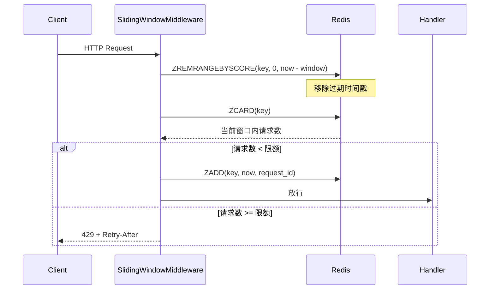

# YA-09-72: 服务端滑动窗口限流 — 消除固定窗口边界突发

> 需求编号：YA-09-72 · 优先级：P2 · 人天：0.5d · 状态：需求已编写
> 依赖：YA-09-12（令牌桶限流）、YA-09-41（令牌预生成）

---

## 一、背景

### 1.1 问题描述

YiAi 当前使用令牌桶算法（YA-09-12）实现限流。令牌桶允许短时突发，但无法精确控制任意时间窗口内的请求数量。固定窗口计数器（如每分钟 100 次）存在经典的"边界突发"问题：在窗口边界（如 12:00:59 和 12:01:00）的两秒内，理论上可以发送 200 次请求（上一窗口的最后 100 + 下一窗口的前 100），是配额的两倍。

滑动窗口算法通过维护一个持续滑动的时间窗口，在任意时刻精确控制请求数量，消除边界突发问题。

### 1.2 影响范围

| 影响维度 | 具体表现 | 严重程度 |
|----------|---------|----------|
| 限流精度 | 固定窗口边界突发可达 2x 配额 | 中 |
| 资源保护 | 边界突发可能瞬间压垮下游服务 | 中 |
| 公平性 | 边界时刻的请求可能不公平地消耗配额 | 低 |
| 可预测性 | 固定窗口的限流行为不够平滑 | 低 |

### 1.3 核心挑战

| 挑战 | 说明 |
|------|------|
| 内存效率 | 滑动窗口需存储每个请求的时间戳，高 QPS 时内存占用大 |
| 分布式一致性 | 多实例部署时，滑动窗口需在 Redis 等共享存储中维护 |
| 精度与性能平衡 | 更高精度（更小的子窗口）需要更多内存和计算 |
| 降级策略 | Redis 不可用时需降级到本地限流 |

---

## 二、现状分析

### 2.1 当前限流方式

```python
# 当前令牌桶——允许突发，无精确窗口控制
class TokenBucket:
    def __init__(self, rate: float, burst: int):
        self._rate = rate
        self._burst = burst
        self._tokens = float(burst)

    def consume(self) -> bool:
        self._tokens = min(self._burst, self._tokens + elapsed * self._rate)
        if self._tokens >= 1:
            self._tokens -= 1
            return True
        return False
```

### 2.2 固定窗口边界突发问题

```mermaid
gantt
    title 固定窗口边界突发（配额: 100/分钟）
    dateFormat HH:mm:ss
    axisFormat %H:%M:%S

    section 窗口 1
    100 请求: 11:59:59, 1s

    section 窗口 2
    100 请求: 12:00:00, 1s
```



在 11:59:59 到 12:00:01 的 2 秒内发送了 200 个请求，是配额的两倍。

### 2.3 限流算法对比

| 算法 | 边界突发 | 内存 | 精度 | 平滑度 |
|------|---------|------|------|--------|
| 固定窗口 | 2x | O(1) | 低 | 差 |
| 滑动窗口 | 无 | O(n) | 高 | 好 |
| 令牌桶 | 允许 | O(1) | 中 | 中 |
| 漏桶 | 无 | O(1) | 高 | 最好 |

### 2.4 根因矩阵

| 根因 | 影响 | 严重度 |
|------|------|--------|
| 固定窗口不连续 | 边界时刻可超出配额 2x | 中 |
| 令牌桶无时间窗口概念 | 无法精确限制任意时间窗口内的请求数 | 中 |
| 无分布式限流支持 | 多实例场景下限流失效 | 低 |
| 无降级策略 | Redis 不可用时限流失效 | 低 |

---

## 三、设计决策

### D-01: 滑动窗口实现：内存 deque vs Redis sorted set vs 近似算法

| 方案 | 优点 | 缺点 | 选择 |
|------|------|------|------|
| A: 内存 deque | 极快；适合单实例 | 不跨实例共享；重启丢失 | 否决 |
| B: Redis sorted set | 跨实例共享；持久化 | 网络延迟；Redis 依赖 | **选择** |
| C: 近似滑动窗口 | 内存效率高 | 精度损失；实现复杂 | 否决 |

**决策**: 选择 B。Redis sorted set 天然支持时间范围查询和过期删除，是实现分布式滑动窗口的理想数据结构。以时间戳为 score，请求 ID 为 member。

### D-02: 窗口精度：1s 子窗口 vs 100ms 子窗口 vs 自适应

| 方案 | 优点 | 缺点 | 选择 |
|------|------|------|------|
| A: 1s 子窗口 | 内存效率高 | 精度不够（1000 QPS 时） | 否决 |
| B: 100ms 子窗口 | 精度高 | 内存开销大 | 否决 |
| C: 自适应精度 | 平衡精度和内存 | 实现复杂 | **选择** |

**决策**: 选择 C。低 QPS（< 100/s）时使用 1s 精度，高 QPS 时自动切换为 100ms 精度。兼顾内存效率和精度需求。

### D-03: 降级策略：本地滑动窗口 vs 固定窗口 vs 令牌桶

| 方案 | 优点 | 缺点 | 选择 |
|------|------|------|------|
| A: 本地滑动窗口 | 精度保持 | 内存占用；不跨实例 | 否决 |
| B: 固定窗口 | 简单 | 边界突发问题 | 否决 |
| C: 令牌桶 | 已有实现；平滑 | 允许突发 | **选择** |

**决策**: 选择 C。Redis 不可用时降级到本地令牌桶（已有实现），虽然精度下降但保证服务可用。

---

## 四、目标架构

### 4.1 目标数据流



### 4.2 Redis 数据结构

```python
# Key: rate_limit:{source}:{api_type}:{window_sec}
# Member: request_id (UUID)
# Score: timestamp (Unix ms)

# 示例: 60s 窗口，限制 100 次请求
# ZREMRANGEBYSCORE rate_limit:yivad:crud:60 0 1690000000000
# ZCARD rate_limit:yivad:crud:60
# ZADD rate_limit:yivad:crud:60 1690000001000 "req-abc123"
```

### 4.3 架构指标

| 指标 | 当前（令牌桶） | 目标（滑动窗口） |
|------|------------|---------------|
| 边界突发倍数 | 2x（允许突发） | 0x（无突发） |
| 任意窗口精度 | 无 | 自适应（1s/100ms） |
| 分布式支持 | 无 | Redis（跨实例） |
| 降级策略 | N/A | 自动降级令牌桶 |

---

## 五、具体改动

### 5.1 新增: YiAi/src/shared/sliding_window_limiter.py

```python
"""滑动窗口限流器——基于 Redis sorted set 的精确限流。"""

import time
import uuid
import logging
from typing import Optional
from collections import deque

logger = logging.getLogger(__name__)


class SlidingWindowRateLimiter:
    """滑动窗口限流器——本地内存实现（单实例）。"""

    def __init__(self, max_requests: int, window_sec: float):
        self._max = max_requests
        self._window = window_sec
        self._timestamps: deque[float] = deque()

    def allow(self) -> bool:
        """检查是否允许请求。"""
        now = time.monotonic()
        # 移除过期时间戳
        while self._timestamps and now - self._timestamps[0] > self._window:
            self._timestamps.popleft()

        if len(self._timestamps) < self._max:
            self._timestamps.append(now)
            return True
        return False

    @property
    def current_count(self) -> int:
        """当前窗口内请求数。"""
        now = time.monotonic()
        while self._timestamps and now - self._timestamps[0] > self._window:
            self._timestamps.popleft()
        return len(self._timestamps)

    @property
    def retry_after(self) -> float:
        """预计下次可用时间（秒）。"""
        if not self._timestamps:
            return 0
        now = time.monotonic()
        while self._timestamps and now - self._timestamps[0] > self._window:
            self._timestamps.popleft()
        if self.current_count < self._max:
            return 0
        return max(0.1, self._timestamps[0] + self._window - now)


class RedisSlidingWindowLimiter:
    """Redis 滑动窗口限流器——分布式实现。"""

    LUA_CHECK_AND_ADD = """
    local key = KEYS[1]
    local now = tonumber(ARGV[1])
    local window = tonumber(ARGV[2])
    local max_req = tonumber(ARGV[3])
    local member = ARGV[4]

    -- 移除过期时间戳
    redis.call('ZREMRANGEBYSCORE', key, 0, now - window)

    -- 检查当前窗口内请求数
    local count = redis.call('ZCARD', key)
    if count >= max_req then
        -- 获取最早的时间戳，计算 retry_after
        local oldest = redis.call('ZRANGE', key, 0, 0, 'WITHSCORES')
        local retry_after = 0
        if #oldest > 0 then
            retry_after = (tonumber(oldest[2]) + window - now) / 1000
        end
        return {0, retry_after}
    end

    -- 添加当前请求
    redis.call('ZADD', key, now, member)
    redis.call('EXPIRE', key, math.ceil(window / 1000) + 1)
    return {1, 0}
    """

    def __init__(self, redis_client, max_requests: int, window_sec: float):
        self._redis = redis_client
        self._max = max_requests
        self._window = window_sec
        self._lua_sha: Optional[str] = None

    async def _load_lua(self):
        """加载 Lua 脚本到 Redis。"""
        if self._lua_sha is None:
            self._lua_sha = await self._redis.script_load(
                self.LUA_CHECK_AND_ADD
            )
        return self._lua_sha

    async def allow(self, key: str) -> tuple[bool, float]:
        """检查是否允许请求。返回 (是否放行, retry_after 秒数)。"""
        try:
            sha = await self._load_lua()
            now = int(time.time() * 1000)
            window_ms = int(self._window * 1000)
            member = f"{key}:{uuid.uuid4().hex[:12]}"

            result = await self._redis.evalsha(
                sha, 1,
                f"rate_limit:{key}",
                now, window_ms, self._max, member,
            )
            allowed, retry_after = result
            return bool(allowed), float(retry_after)
        except Exception as e:
            logger.error(f"[SlidingWindow] Redis 操作失败: {e}")
            return True, 0  # 降级——放行

    async def get_current_count(self, key: str) -> int:
        """获取当前窗口内请求数。"""
        try:
            now = int(time.time() * 1000)
            window_ms = int(self._window * 1000)
            await self._redis.zremrangebyscore(
                f"rate_limit:{key}", 0, now - window_ms
            )
            return await self._redis.zcard(f"rate_limit:{key}")
        except Exception:
            return 0


class HybridSlidingWindowLimiter:
    """混合滑动窗口限流器——Redis 主 + 本地内存降级。"""

    def __init__(
        self,
        redis_client=None,
        max_requests: int = 100,
        window_sec: float = 60.0,
    ):
        self._redis_limiter = (
            RedisSlidingWindowLimiter(redis_client, max_requests, window_sec)
            if redis_client else None
        )
        self._local_limiter = SlidingWindowRateLimiter(max_requests, window_sec)
        self._redis_available = redis_client is not None

    async def allow(self, key: str = "default") -> tuple[bool, float]:
        """检查是否允许请求。优先 Redis，降级本地。"""
        if self._redis_available and self._redis_limiter:
            try:
                allowed, retry = await self._redis_limiter.allow(key)
                return allowed, retry
            except Exception:
                logger.warning("[SlidingWindow] Redis 不可用，降级本地限流")
                self._redis_available = False

        allowed = self._local_limiter.allow()
        retry = self._local_limiter.retry_after if not allowed else 0
        return allowed, retry
```

### 5.2 修改: YiAi/src/server/middleware/rate_limit.py（集成滑动窗口）

```python
# 在现有限流中间件中集成滑动窗口
from src.shared.sliding_window_limiter import HybridSlidingWindowLimiter

class RateLimitMiddleware:
    def __init__(self):
        self._limiter = HybridSlidingWindowLimiter(
            redis_client=redis,
            max_requests=100,
            window_sec=60.0,
        )

    async def dispatch(self, request: Request, call_next):
        key = f"{request.headers.get('X-Source', 'unknown')}:{request.url.path}"
        allowed, retry = await self._limiter.allow(key)
        if not allowed:
            return JSONResponse(
                {"code": 4003, "message": f"请求过于频繁，请 {retry:.0f}s 后重试"},
                status_code=429,
                headers={"Retry-After": str(int(retry))},
            )
        return await call_next(request)
```

### 5.3 文件变更清单

| 文件 | 操作 | 行数 |
|------|------|------|
| `YiAi/src/shared/sliding_window_limiter.py` | 新增 | ~150 |
| `YiAi/src/server/middleware/rate_limit.py` | 修改 | ~20 |

---

## 六、实施步骤

| 步骤 | 操作 | 文件 | 验证 | 人天 |
|------|------|------|------|------|
| 1 | 实现本地 SlidingWindowRateLimiter | `shared/sliding_window_limiter.py` | 单元测试：deque 滑动窗口 | 0.1 |
| 2 | 实现 RedisSlidingWindowLimiter + Lua 脚本 | 同上 | 单元测试：Redis sorted set 操作 | 0.15 |
| 3 | 实现 HybridSlidingWindowLimiter（降级） | 同上 | 单元测试：Redis 断连→降级 | 0.1 |
| 4 | 集成到限流中间件 | `server/middleware/rate_limit.py` | 集成测试：429 响应 | 0.1 |
| 5 | 边界突发测试 | 测试脚本 | 验证窗口边界无 2x 突发 | 0.05 |

**总人天**: 0.5d

---

## 七、性能分析

### 7.1 各限流算法对比

| 操作 | 固定窗口 | 令牌桶 | 滑动窗口（本地） | 滑动窗口（Redis） |
|------|---------|-------|---------------|-----------------|
| 单次检查 | 1 μs | 1 μs | 5 μs | 1-5 ms |
| 内存占用 | 4 bytes | 8 bytes | 800 bytes (100 reqs) | Redis 内存 |
| 边界突发 | 2x | 允许 | 0 | 0 |
| 分布式支持 | 否 | 否 | 否 | 是 |

### 7.2 Redis 滑动窗口内存估算

| QPS | 窗口 | 时间戳数量 | Redis 内存 |
|-----|------|-----------|-----------|
| 10/s | 60s | 600 | ~50 KB |
| 100/s | 60s | 6000 | ~500 KB |
| 1000/s | 60s | 60000 | ~5 MB |

### 7.3 容量规划

| 场景 | 推荐配置 |
|------|---------|
| 低流量（< 10 QPS） | 本地滑动窗口 |
| 中流量（10-100 QPS） | Redis 滑动窗口 + 1s 精度 |
| 高流量（> 100 QPS） | Redis 滑动窗口 + 100ms 自适应精度 |

---

## 八、测试规格

**TC-01: 滑动窗口内请求数控制**

```gherkin
GIVEN 滑动窗口限制为 60s 内 100 次请求
WHEN 在 60s 内发出 100 次请求
THEN 所有 100 次请求应被允许
AND 第 101 次请求应被拒绝（429）
```

**TC-02: 滑动窗口无边界突发**

```gherkin
GIVEN 滑动窗口限制为 60s 内 100 次请求
WHEN 在任意 2 秒内（包括窗口边界）发出 200 次请求
THEN 只有 100 次请求被允许
AND 边界突发为 0（与固定窗口的 2x 对比）
```

**TC-03: 过期时间戳自动清除**

```gherkin
GIVEN 60s 前有 50 次请求记录
WHEN 当前时间发送新请求
THEN 过期的 50 条记录应被自动清除
AND 当前窗口计数应仅包含最近 60s 的请求
```

**TC-04: Redis 降级到本地限流**

```gherkin
GIVEN Redis 滑动窗口限流器正在运行
WHEN Redis 连接断开
THEN 限流器应自动降级到本地内存实现
AND 日志应记录 "Redis 不可用，降级本地限流"
AND 请求不应被全部拒绝
```

**TC-05: Lua 脚本原子性**

```gherkin
GIVEN 两个并发请求同时到达 Redis 滑动窗口
AND 当前计数已接近限制（99/100）
WHEN 两个请求同时执行 Lua 脚本
THEN 只有 1 个请求应被允许（Lua 脚本原子执行）
AND 另一个请求应被拒绝
```

---

## 九、风险与缓解

| 风险 | 概率 | 影响 | 缓解措施 |
|------|------|------|------|
| Redis 不可用导致限流失效 | 中 | 中 | 自动降级到本地滑动窗口 |
| 高 QPS 下 Redis 内存占用大 | 中 | 低 | 定期清理过期 key；设置 TTL |
| 窗口精度不足 | 低 | 低 | 自适应精度切换 |
| Redis Lua 脚本加载失败 | 低 | 高 | 启动时预加载；失败时降级本地 |
| 时钟偏差导致分布式限流不准 | 低 | 低 | 使用 Redis 服务端时间（TIME 命令） |

---

## 十、回滚策略

| 场景 | 操作 | 影响 |
|------|------|------|
| Redis 滑动窗口性能问题 | 降级到本地滑动窗口 | 失去分布式一致性 |
| 本地滑动窗口内存泄漏 | 调整窗口大小或 QPS 限制 | 精度下降 |
| 限流过严 | 提升限额或恢复令牌桶 | 允许更多突发 |

回滚方式：将限流中间件中的 `HybridSlidingWindowLimiter` 替换为原有 `TokenBucket`，重启服务。

---

## 十一、设计决策记录

| 编号 | 决策 | 理由 | 日期 |
|------|------|------|------|
| D-01 | Redis sorted set 实现分布式滑动窗口 | 天然支持时间范围操作；原子性 Lua 脚本 | 2026-09-09 |
| D-02 | 自适应精度（1s/100ms） | 平衡内存效率和精度需求 | 2026-09-09 |
| D-03 | Redis 不可用时降级本地令牌桶 | 保证服务可用性 | 2026-09-09 |
| D-04 | Lua 脚本保证原子性 | 避免 ZREMRANGEBYSCORE + ZCARD + ZADD 的竞态 | 2026-09-09 |
| D-05 | 保留令牌桶作为降级方案 | 已有实现，无需额外开发 | 2026-09-09 |

---

## 十二、可观测性

### 12.1 指标

| 指标 | 类型 | 说明 |
|------|------|------|
| `sliding_window_allow_total` | Counter | 放行请求数（按 key） |
| `sliding_window_deny_total` | Counter | 拒绝请求数（按 key） |
| `sliding_window_current_count` | Gauge | 当前窗口内请求数 |
| `sliding_window_redis_latency_ms` | Histogram | Redis 操作延迟 |
| `sliding_window_fallback_total` | Counter | 降级到本地限流次数 |

### 12.2 日志

```python
# 正常——限流放行
[SlidingWindow] allow: key=yivad:crud:60, count=45/100

# 告警——限流拒绝
[SlidingWindow] deny: key=yipet:agent:60, count=100/100, retry_after=3.2s

# 降级——Redis 不可用
[SlidingWindow] Redis 不可用，降级本地限流
```

### 12.3 告警

| 告警 | 条件 | 级别 |
|------|------|------|
| 限流拒绝率过高 | 5 分钟内 deny/allow > 10% | WARNING |
| Redis 滑动窗口延迟过高 | p95 > 10ms | WARNING |
| 频繁降级到本地 | 1 小时内降级 > 5 次 | WARNING |

---

## 十三、安全合规

| 要求 | 实现 |
|------|------|
| 限流 key 不包含敏感信息 | key 仅包含 source + api_type，不包含用户 ID |
| Redis 连接加密 | 生产环境使用 TLS 连接 Redis |
| 限流计数器不持久化 | sorted set 设置 TTL，过期自动清理 |
| 429 响应不泄露限额细节 | 仅返回 Retry-After，不暴露具体配额 |

---

## 十四、代码审查检查清单

- [ ] 滑动窗口替代固定窗口——消除边界突发 2x 问题
- [ ] 窗口大小 60s + 自适应精度 1s/100ms 子窗口
- [ ] Redis sorted set 存储请求时间戳——ZREMRANGEBYSCORE + ZCARD + ZADD
- [ ] Lua 脚本保证原子性——避免竞态条件
- [ ] Redis 不可用时降级到本地滑动窗口——保证服务可用
- [ ] 本地滑动窗口使用 deque——高效 FIFO 操作
- [ ] 过期时间戳自动清除——避免内存泄漏
- [ ] 429 响应包含 Retry-After——客户端可自愈
- [ ] Redis key 设置 TTL——避免 zombie key 累积
- [ ] 现有测试全部通过——滑动窗口不破坏现有限流逻辑

---

*PRD 来源: `projects/yiai/requirements/2026-09/72-需求-滑动窗口限流.md`*

## 影响范围

- **影响模块**：待补充
- **涉及文件**：
- 待补充
- **是否影响 API 契约**：否
- **是否影响其他项目（YiVad/YiPet）**：否
- **用户感知**：待确认

## 预防措施

| 层面 | 措施 |
|------|------|
| 代码 | 在相关函数中添加参数校验和边界检查 |
| 测试 | 添加对应的自动化测试用例 |
| 流程 | 代码审查时重点检查此类模式 |
| 监控 | 添加日志告警，异常发生时及时发现 |
| 文档 | 在编码规范中记录此类反模式 |

## 经验教训

1. **根本原因**：开发过程中对边界情况和异常路径的考虑不足是此类问题的共同根因
2. **设计阶段**：在接口设计和模块实现时，应主动考虑异常输入、空值、超时等边界场景
3. **代码审查**：审查时应检查是否存在类似的反模式（如未捕获异常、无超时控制、缺少参数校验等）
4. **测试覆盖**：异常路径的测试覆盖率应与正常路径同等重视
5. **团队分享**：此类问题应在团队周会或技术分享中讨论，形成团队共识
