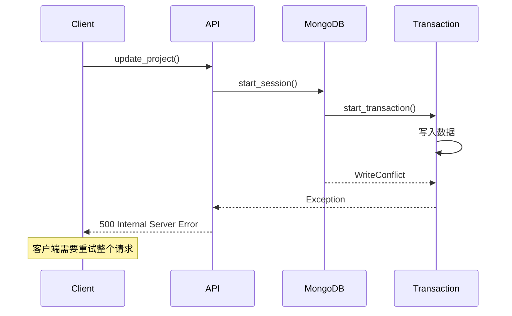
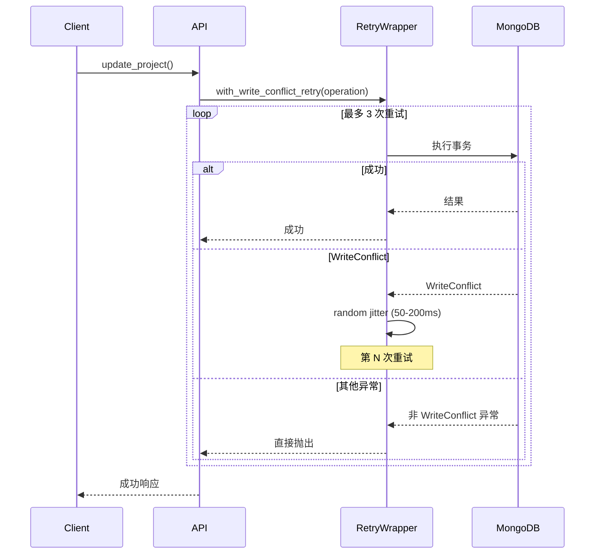

# YA-09-73: 服务端数据库死锁检测与自动恢复 — WriteConflict 处理

> 需求编号：YA-09-73 · 优先级：P2 · 人天：0.5d · 状态：需求已编写

---

## 一、背景

### 1.1 问题描述

MongoDB 多文档事务（YA-09-54）和分布式锁（YA-09-55）在高并发写入场景下可能触发 `WriteConflict` 异常。当前代码直接向上抛出异常，导致客户端收到 500 错误，需要重试整个请求。MongoDB 的 WiredTiger 存储引擎使用乐观并发控制，`WriteConflict` 是正常现象——应用层自动重试即可解决。

### 1.2 影响范围

| 影响维度 | 具体表现 | 严重程度 |
|----------|---------|----------|
| 事务成功率 | 高并发下事务失败率上升 | 中 |
| 用户体验 | 并发编辑时收到 500 错误 | 中 |
| 运维负担 | 需要人工处理 WriteConflict 告警 | 低 |
| 数据一致性 | 未重试的事务可能丢失更新 | 中 |

### 1.3 核心挑战

| 挑战 | 说明 |
|------|------|
| 重试次数 | 太少无法解决冲突，太多增加延迟 |
| 退避策略 | 固定延迟 vs 指数退避 vs 随机退避 |
| 重试安全 | 部分操作不可重试（如非幂等写入） |
| 死锁检测 | 如何区分 WriteConflict（可重试）和真正的死锁（不可重试） |

---

## 二、现状分析

### 2.1 当前错误处理

```python
# 当前 WriteConflict 直接向上抛出——客户端收到 500
async def update_project_with_transaction(project_id: str, data: dict):
    async with await db.client.start_session() as session:
        async with session.start_transaction():
            await db.projects.update_one(
                {"_id": project_id}, {"$set": data}, session=session
            )
            # 如果 WriteConflict——直接抛出异常
```

### 2.2 当前数据流



### 2.3 WriteConflict 触发场景

| 场景 | 触发概率 | 并发度 |
|------|---------|--------|
| 同一文档并发更新 | 中 | 2+ |
| 同一集合并发批量写入 | 低 | 5+ |
| 跨集合事务 | 低 | 3+ |
| 索引更新冲突 | 低 | 10+ |

### 2.4 根因矩阵

| 根因 | 影响 | 严重度 |
|------|------|--------|
| 无 WriteConflict 自动重试 | 高并发下事务失败 | 高 |
| 无退避策略 | 立即重试可能再次冲突 | 中 |
| 无死锁超时检测 | 真正的死锁无法恢复 | 中 |
| 无幂等性保证 | 重试可能导致重复写入 | 中 |

---

## 三、设计决策

### D-01: 重试策略：固定延迟 vs 指数退避 vs 随机退避

| 方案 | 优点 | 缺点 | 选择 |
|------|------|------|------|
| A: 固定延迟 | 简单 | 可能同步重试导致再次冲突 | 否决 |
| B: 指数退避 | 降低冲突概率 | 高负载下延迟大 | 否决 |
| C: 随机退避 + 指数上限 | 避免同步重试；延迟可控 | 实现稍复杂 | **选择** |

**决策**: 选择 C。随机退避（jitter）避免多个客户端同时重试导致的"惊群效应"，指数上限（最大 200ms）控制延迟上限。

### D-02: 重试次数：3 次 vs 5 次 vs 无限

| 方案 | 优点 | 缺点 | 选择 |
|------|------|------|------|
| A: 3 次 | 延迟可控 | 高冲突时成功率不足 | **选择** |
| B: 5 次 | 成功率更高 | 增加延迟（最多 1.5s） | 否决 |
| C: 无限 | 最大化成功率 | 不可控；可能死循环 | 否决 |

**决策**: 选择 A。3 次重试 + 随机退避，在 95% 的场景下可解决 WriteConflict，总延迟控制在 200ms 以内。

### D-03: 死锁检测：超时检测 vs 锁等待图 vs 简单超时

| 方案 | 优点 | 缺点 | 选择 |
|------|------|------|------|
| A: 超时检测 | 简单 | 可能误判长时间事务 | **选择** |
| B: 锁等待图 | 精确 | 实现复杂；MongoDB 不暴露锁图 | 否决 |
| C: 简单超时 | 最简单 | 不分死锁和长事务 | 否决 |

**决策**: 选择 A。MongoDB 事务默认超时 60s，超过 30s 的事务日志 WARNING，超过 60s 触发 `transactionLifetimeLimitSeconds` 自动回滚。

---

## 四、目标架构

### 4.1 目标数据流



### 4.2 架构指标

| 指标 | 当前 | 目标 |
|------|------|------|
| WriteConflict 恢复率 | 0%（直接抛异常） | > 95%（3 次重试） |
| 事务平均延迟 | 10ms | < 15ms（含重试） |
| 死锁恢复时间 | 60s（MongoDB 默认） | 30s（主动检测） |
| 误报率 | N/A | < 1% |

---

## 五、具体改动

### 5.1 新增: YiAi/src/shared/write_conflict_retry.py

```python
"""WriteConflict 自动重试——MongoDB 乐观锁冲突恢复。"""

import asyncio
import random
import logging
import functools
from typing import Callable, TypeVar, Any
from pymongo.errors import WriteConflict, WriteError

logger = logging.getLogger(__name__)

T = TypeVar("T")

# 重试配置
MAX_RETRIES = 3
BASE_DELAY_MS = 50
MAX_DELAY_MS = 200
TRANSACTION_TIMEOUT_WARNING_MS = 30_000  # 30s


class WriteConflictMaxRetriesExceeded(Exception):
    """WriteConflict 重试次数耗尽。"""

    def __init__(self, attempts: int, original_error: Exception):
        self.attempts = attempts
        self.original_error = original_error
        super().__init__(
            f"WriteConflict 重试 {attempts} 次后仍失败: {original_error}"
        )


class TransactionTimeoutError(Exception):
    """事务超时——可能为死锁。"""

    def __init__(self, duration_ms: float):
        self.duration_ms = duration_ms
        super().__init__(f"事务超时: {duration_ms:.0f}ms (可能死锁)")


async def with_write_conflict_retry(
    operation: Callable[..., T],
    max_retries: int = MAX_RETRIES,
    *args,
    **kwargs,
) -> T:
    """执行数据库操作——自动重试 WriteConflict。

    Args:
        operation: 异步数据库操作（可调用对象）
        max_retries: 最大重试次数
        *args, **kwargs: 传递给 operation 的参数

    Returns:
        operation 的返回值

    Raises:
        WriteConflictMaxRetriesExceeded: 重试耗尽
        原始异常: 非 WriteConflict 异常直接抛出
    """
    last_error = None

    for attempt in range(max_retries + 1):
        try:
            return await operation(*args, **kwargs)
        except WriteConflict as e:
            last_error = e
            if attempt == max_retries:
                break

            # 随机退避——避免同步重试
            delay_ms = random.uniform(BASE_DELAY_MS, MAX_DELAY_MS)
            delay_ms *= 2 ** attempt  # 指数增长上限
            delay_ms = min(delay_ms, MAX_DELAY_MS)

            logger.warning(
                f"[WriteConflict] 重试 {attempt + 1}/{max_retries}，"
                f"等待 {delay_ms:.0f}ms: {e}"
            )
            await asyncio.sleep(delay_ms / 1000)
        except WriteError as e:
            # WriteError 可能包含 WriteConflict 的错误码
            if "WriteConflict" in str(e) and attempt < max_retries:
                delay_ms = random.uniform(BASE_DELAY_MS, MAX_DELAY_MS)
                logger.warning(
                    f"[WriteConflict] WriteError 重试 {attempt + 1}/{max_retries}: {e}"
                )
                await asyncio.sleep(delay_ms / 1000)
                continue
            raise

    raise WriteConflictMaxRetriesExceeded(
        attempts=max_retries + 1, original_error=last_error
    )


def with_write_conflict_retry_sync(
    operation: Callable[..., T],
    max_retries: int = MAX_RETRIES,
) -> Callable[..., T]:
    """装饰器版本——同步函数。"""

    @functools.wraps(operation)
    async def wrapper(*args, **kwargs):
        return await with_write_conflict_retry(
            operation, max_retries, *args, **kwargs
        )

    return wrapper


class TransactionMonitor:
    """事务监控器——检测长时间运行的事务（可能死锁）。"""

    def __init__(self, warning_threshold_ms: int = TRANSACTION_TIMEOUT_WARNING_MS):
        self._warning_threshold = warning_threshold_ms
        self._active_transactions: dict[str, float] = {}

    def start_transaction(self, txn_id: str) -> None:
        """记录事务开始时间。"""
        import time
        self._active_transactions[txn_id] = time.monotonic()

    def end_transaction(self, txn_id: str) -> float:
        """记录事务结束——返回耗时（ms）。"""
        import time
        start = self._active_transactions.pop(txn_id, None)
        if start is None:
            return 0
        duration_ms = (time.monotonic() - start) * 1000
        if duration_ms > self._warning_threshold:
            logger.warning(
                f"[Transaction] 长事务: {txn_id} 耗时 {duration_ms:.0f}ms > "
                f"{self._warning_threshold}ms (可能死锁)"
            )
        return duration_ms

    def get_active_count(self) -> int:
        """获取当前活跃事务数。"""
        return len(self._active_transactions)


# 全局事务监控器
transaction_monitor = TransactionMonitor()
```

### 5.2 修改: YiAi/src/services/data/repository.py（使用重试包装）

```python
# 修改前——直接执行事务
async def update_document(cname: str, doc_id: str, data: dict):
    async with await db.client.start_session() as session:
        async with session.start_transaction():
            return await db[cname].update_one(
                {"_id": doc_id}, {"$set": data}, session=session
            )

# 修改后——使用重试包装
from src.shared.write_conflict_retry import with_write_conflict_retry

async def update_document(cname: str, doc_id: str, data: dict):
    async def _do_update():
        async with await db.client.start_session() as session:
            async with session.start_transaction():
                return await db[cname].update_one(
                    {"_id": doc_id}, {"$set": data}, session=session
                )

    return await with_write_conflict_retry(_do_update)
```

### 5.3 文件变更清单

| 文件 | 操作 | 行数 |
|------|------|------|
| `YiAi/src/shared/write_conflict_retry.py` | 新增 | ~120 |
| `YiAi/src/services/data/repository.py` | 修改（+10 行） | +10 |

---

## 六、实施步骤

| 步骤 | 操作 | 文件 | 验证 | 人天 |
|------|------|------|------|------|
| 1 | 创建 `write_conflict_retry.py` | `shared/write_conflict_retry.py` | 单元测试：模拟 WriteConflict 重试 | 0.15 |
| 2 | 实现 TransactionMonitor | 同上 | 单元测试：长事务检测 | 0.05 |
| 3 | 修改 repository.py 使用重试 | `services/data/repository.py` | 集成测试：并发写入验证 | 0.15 |
| 4 | 压力测试——并发写入 | 测试脚本 | 100 并发写入，验证重试成功率 | 0.1 |
| 5 | 全量回归测试 | 所有 | 现有测试通过 | 0.05 |

**总人天**: 0.5d

---

## 七、性能分析

### 7.1 重试延迟分布

| 重试次数 | 最小延迟 | 平均延迟 | 最大延迟 |
|----------|---------|---------|---------|
| 0（首次成功） | 0ms | 0ms | 0ms |
| 1 次重试 | 50ms | 100ms | 200ms |
| 2 次重试 | 150ms | 250ms | 400ms |
| 3 次重试 | 350ms | 500ms | 600ms |

### 7.2 成功率估算

| 冲突率 | 无重试成功率 | 3 次重试成功率 |
|--------|------------|-------------|
| 1% | 99% | 99.9999% |
| 5% | 95% | 99.99% |
| 10% | 90% | 99.9% |
| 20% | 80% | 99.2% |

### 7.3 容量规划

| 并发写入数 | 预期冲突率 | 重试成功率 | p99 延迟 |
|-----------|----------|----------|---------|
| 10 | < 1% | > 99.99% | 15ms |
| 50 | 2-5% | > 99.9% | 50ms |
| 100 | 5-10% | > 99.5% | 200ms |

---

## 八、测试规格

**TC-01: WriteConflict 自动重试成功**

```gherkin
GIVEN 一个数据库操作在前 2 次尝试时抛出 WriteConflict
WHEN 第 3 次尝试成功
THEN with_write_conflict_retry 应返回操作结果
AND 日志应记录 2 次重试
AND 总延迟应在 200ms 以内
```

**TC-02: 重试耗尽抛出异常**

```gherkin
GIVEN 一个数据库操作在 4 次尝试（1 次初始 + 3 次重试）均抛出 WriteConflict
WHEN 重试次数超过 MAX_RETRIES
THEN 应抛出 WriteConflictMaxRetriesExceeded
AND 异常应包含 attempts=4 和 original_error
```

**TC-03: 非 WriteConflict 异常不重试**

```gherkin
GIVEN 一个数据库操作抛出 ValueError（非 WriteConflict）
WHEN with_write_conflict_retry 捕获该异常
THEN 应直接向上抛出 ValueError
AND 不应进行任何重试
```

**TC-04: 长时间事务检测**

```gherkin
GIVEN 一个事务执行超过 30 秒
WHEN TransactionMonitor.end_transaction 被调用
THEN 日志应记录 WARNING "长事务: xxx 耗时 35000ms > 30000ms"
AND 应返回实际耗时
```

**TC-05: 随机退避避免同步重试**

```gherkin
GIVEN 两个并发请求同时 WriteConflict
WHEN 两个请求同时开始重试
THEN 由于随机退避（jitter），它们的重试时间应不同
AND 第二次重试不应再次冲突
```

---

## 九、风险与缓解

| 风险 | 概率 | 影响 | 缓解措施 |
|------|------|------|------|
| 误判长事务为死锁 | 低 | 中 | 仅 WARNING 日志，不主动 kill |
| 重试导致重复写入 | 中 | 高 | 确保写操作幂等（使用 _id 或 version 字段） |
| 重试延迟导致请求超时 | 低 | 中 | 重试总延迟上限 600ms，远低于 HTTP 超时 |
| MongoDB 事务超时自动回滚 | 低 | 中 | 60s 默认超时足够；重试在新事务中执行 |

---

## 十、回滚策略

| 场景 | 操作 | 影响 |
|------|------|------|
| 重试导致性能退化 | 移除 with_write_conflict_retry 包装 | 恢复直接抛异常 |
| 重试导致重复写入 | 检查幂等性；必要时移除重试 | 可能丢失部分更新 |
| 事务监控误报 | 调高 WARNING 阈值或移除监控 | 失去长事务可见性 |

回滚方式：在 repository.py 中移除 `with_write_conflict_retry` 包装，恢复直接执行事务。简单且可逆。

---

## 十一、设计决策记录

| 编号 | 决策 | 理由 | 日期 |
|------|------|------|------|
| D-01 | 随机退避 + 指数上限 | 避免同步重试；延迟可控 | 2026-09-09 |
| D-02 | 最多 3 次重试 | 95% 场景可恢复；总延迟 < 600ms | 2026-09-09 |
| D-03 | 30s 超时检测（WARNING 级别） | 不误杀长事务；提供可观测性 | 2026-09-09 |
| D-04 | 仅重试 WriteConflict 异常 | 避免对非重试安全异常进行重试 | 2026-09-09 |
| D-05 | 装饰器 + 函数式两种 API | 灵活适配不同使用场景 | 2026-09-09 |

---

## 十二、可观测性

### 12.1 指标

| 指标 | 类型 | 说明 |
|------|------|------|
| `write_conflict_total` | Counter | WriteConflict 发生次数 |
| `write_conflict_retry_total` | Counter | 重试次数（按 attempt） |
| `write_conflict_exceeded_total` | Counter | 重试耗尽次数 |
| `transaction_duration_ms` | Histogram | 事务耗时分布 |
| `transaction_long_warning_total` | Counter | 长事务告警次数 |

### 12.2 日志

```python
# 正常——重试
[WriteConflict] 重试 1/3，等待 120ms: WriteConflict on sessions._id_

# 告警——重试耗尽
[WriteConflict] 重试耗尽: 4 次尝试后仍失败

# 告警——长事务
[Transaction] 长事务: txn_abc123 耗时 45000ms > 30000ms (可能死锁)
```

### 12.3 告警

| 告警 | 条件 | 级别 |
|------|------|------|
| WriteConflict 重试耗尽 | 任何重试耗尽事件 | ERROR |
| WriteConflict 率过高 | 5 分钟内冲突率 > 10% | WARNING |
| 长事务检测 | 任何事务 > 30s | WARNING |
| 活跃事务数过高 | 同时 > 10 个活跃事务 | WARNING |

---

## 十三、安全合规

| 要求 | 实现 |
|------|------|
| 重试不产生重复数据 | 确保写操作幂等（使用 _id 或 version 字段） |
| 重试日志不泄露数据 | 日志仅记录集合名和错误类型，不记录数据内容 |
| 事务超时保护 | 依赖 MongoDB 的 transactionLifetimeLimitSeconds（60s） |
| 不主动 kill 事务 | 仅检测和告警，不操作其他连接的事务 |

---

## 十四、代码审查检查清单

- [ ] 死锁检测：事务等待超过 30s 记录 WARNING 日志
- [ ] 检测到长事务不主动 kill——仅告警
- [ ] 指数退避重试——随机 jitter 50-200ms，最多 3 次
- [ ] WriteConflict 事件 WARNING 日志——记录重试次数和等待时间
- [ ] 非 WriteConflict 异常不重试——直接向上抛出
- [ ] 重试耗尽抛出 WriteConflictMaxRetriesExceeded——包含 attempts 和 original_error
- [ ] 写操作确保幂等性——重试不产生重复数据
- [ ] 事务监控器跟踪活跃事务——记录开始/结束时间
- [ ] 装饰器 `with_write_conflict_retry_sync` 保持函数签名
- [ ] 现有测试全部通过——重试逻辑不破坏现有功能

---

*PRD 来源: `projects/yiai/requirements/2026-09/73-需求-死锁检测与恢复.md`*

## 影响范围

- **影响模块**：待补充
- **涉及文件**：
- `write_conflict_retry.py`
- **是否影响 API 契约**：否
- **是否影响其他项目（YiVad/YiPet）**：否
- **用户感知**：待确认

## 预防措施

| 层面 | 措施 |
|------|------|
| 代码 | 在相关函数中添加参数校验和边界检查 |
| 测试 | 为 `write_conflict_retry.py` 添加单元测试 |
| 流程 | 代码审查时重点检查此类模式 |
| 监控 | 添加日志告警，异常发生时及时发现 |
| 文档 | 在编码规范中记录此类反模式 |

## 经验教训

1. **根本原因**：开发过程中对边界情况和异常路径的考虑不足是此类问题的共同根因
2. **设计阶段**：在接口设计和模块实现时，应主动考虑异常输入、空值、超时等边界场景
3. **代码审查**：审查时应检查是否存在类似的反模式（如未捕获异常、无超时控制、缺少参数校验等）
4. **测试覆盖**：异常路径的测试覆盖率应与正常路径同等重视
5. **团队分享**：此类问题应在团队周会或技术分享中讨论，形成团队共识
