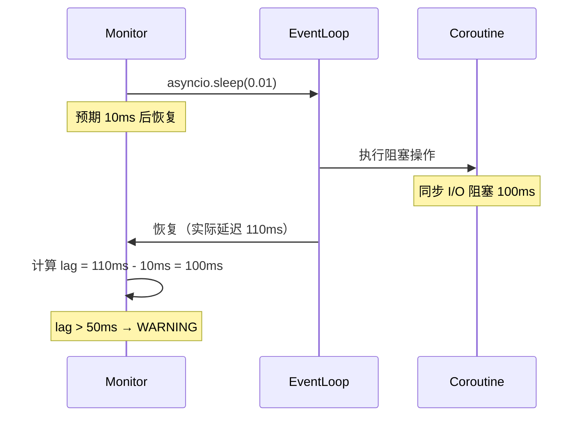
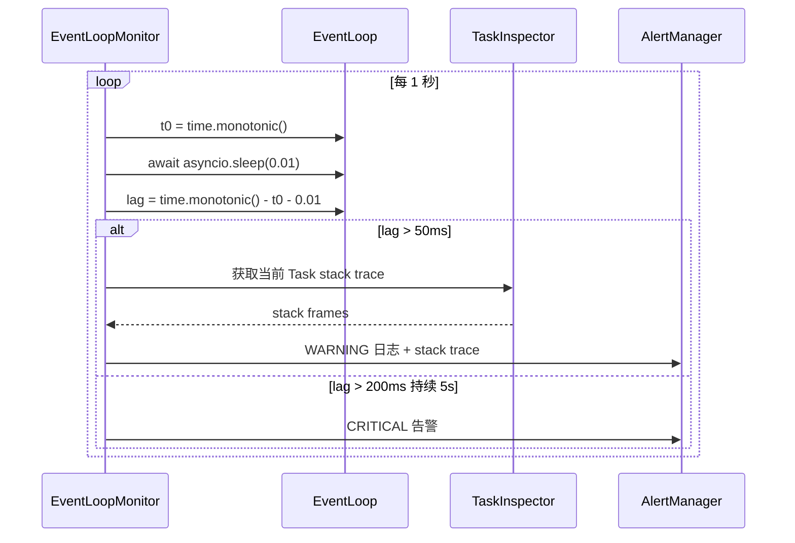

# YA-09-74: 服务端 Event Loop 阻塞检测 — asyncio 任务队列积压监控

> 需求编号：YA-09-74 · 优先级：P2 · 人天：0.5d · 状态：需求已编写

---

## 一、背景

### 1.1 问题描述

YiAi 基于 asyncio 的 FastAPI 服务器依赖事件循环（Event Loop）的及时调度来维持高并发性能。当同步阻塞操作（如 FAISS 磁盘 I/O、大文件读取、CPU 密集计算）在协程中执行时，会阻塞整个事件循环，导致所有其他协程暂停。症状包括：

1. **请求延迟抖动**：正常 5ms 的请求突然变成 500ms。
2. **连接超时**：SSE 流式连接因事件循环阻塞而断开。
3. **雪崩效应**：一个阻塞操作导致请求积压，恢复后请求洪峰。

### 1.2 影响范围

| 影响维度 | 具体表现 | 严重程度 |
|----------|---------|----------|
| 请求延迟 | 阻塞期间所有请求延迟增加 | 高 |
| 连接稳定性 | SSE 连接因阻塞而断开 | 高 |
| 吞吐量 | 阻塞期间有效吞吐量下降 | 中 |
| 可观测性 | 无法快速定位阻塞源 | 中 |

### 1.3 核心挑战

| 挑战 | 说明 |
|------|------|
| 非侵入检测 | 不应修改业务代码即可检测阻塞 |
| 低开销 | 监控本身不能成为性能瓶颈 |
| 阻塞源定位 | 检测到阻塞后需要定位具体是哪个协程/操作 |
| 误报处理 | GC 暂停、系统调度延迟可能被误识别为阻塞 |

---

## 二、现状分析

### 2.1 当前阻塞风险点

```python
# 已知的潜在阻塞操作
# 1. FAISS 索引加载——同步磁盘 I/O
faiss_index = faiss.read_index("data/vector.index")  # 同步调用

# 2. 大文件读取
with open("large_file.txt") as f:
    content = f.read()  # 阻塞 I/O

# 3. JSON 序列化大对象
json.dumps(large_dict)  # CPU 密集

# 4. 未使用 asyncio 的数据库驱动
# Motor 已正确处理，但直接使用 pymongo 会阻塞
```

### 2.2 阻塞检测原理



### 2.3 根因矩阵

| 根因 | 影响 | 严重度 |
|------|------|--------|
| 同步 I/O 在协程中执行 | 阻塞事件循环 | 高 |
| 无事件循环延迟监控 | 阻塞发生时无感知 | 高 |
| 无阻塞源定位 | 无法快速修复 | 中 |
| 开发者不了解 asyncio 阻塞模型 | 持续引入阻塞代码 | 中 |

---

## 三、设计决策

### D-01: 检测方式：tick 监控 vs slow_callback 钩子 vs 外部探针

| 方案 | 优点 | 缺点 | 选择 |
|------|------|------|------|
| A: tick 监控（asyncio.sleep） | 实现简单；可测量真实延迟 | 轻微开销 | **选择** |
| B: slow_callback_duration 钩子 | Python 3.12+ 原生支持 | 仅 3.12+；不向前兼容 | 否决 |
| C: 外部探针（HTTP health check） | 独立于进程 | 无法区分阻塞 vs 网络延迟 | 否决 |

**决策**: 选择 A。tick 监控通过 `asyncio.sleep(short)` 测量实际 vs 预期唤醒时间，计算延迟。Python 3.7+ 可用，兼容性好。

### D-02: 阻塞阈值：10ms vs 50ms vs 100ms

| 方案 | 优点 | 缺点 | 选择 |
|------|------|------|------|
| A: 10ms | 高灵敏度 | 误报多（GC、系统调度） | 否决 |
| B: 50ms | 平衡灵敏度和误报 | 快速阻塞可能漏检 | **选择** |
| C: 100ms | 低误报率 | 检测延迟大 | 否决 |

**决策**: 选择 B。50ms 是 HTTP 请求延迟的用户可感知阈值，同时能过滤大部分 GC 暂停（通常 < 20ms）。

### D-03: 阻塞源定位：stack trace vs 回调链 vs 日志关联

| 方案 | 优点 | 缺点 | 选择 |
|------|------|------|------|
| A: 记录当前 Task 的 stack trace | 直接定位阻塞协程 | 阻塞时可能无法获取 | **选择** |
| B: 回调链分析 | 精确定位 | 实现复杂 | 否决 |
| C: 日志关联 | 无需额外代码 | 精度低 | 否决 |

**决策**: 选择 A。阻塞检测到后，记录当前运行 Task 的 stack trace（通过 `asyncio.current_task()`），帮助定位阻塞源。

---

## 四、目标架构

### 4.1 目标数据流



### 4.2 架构指标

| 指标 | 当前 | 目标 |
|------|------|------|
| 阻塞检测延迟 | 无 | < 1s |
| 检测开销 | 无 | < 0.5% CPU |
| 阻塞源定位 | 无 | 自动记录 stack trace |
| 误报率 | N/A | < 5% |

---

## 五、具体改动

### 5.1 新增: YiAi/src/shared/event_loop_monitor.py

```python
"""asyncio Event Loop 阻塞检测——监控延迟并定位阻塞源。"""

import asyncio
import time
import logging
import traceback
from typing import Optional
from collections import deque

logger = logging.getLogger(__name__)

# 检测阈值
BLOCK_WARNING_THRESHOLD_MS = 50    # WARNING 级别
BLOCK_CRITICAL_THRESHOLD_MS = 200  # CRITICAL 级别
CRITICAL_DURATION_SEC = 5          # 持续 5 秒触发 CRITICAL

# 历史记录
HISTORY_SIZE = 60  # 保留最近 60 次检测结果


class EventLoopMonitor:
    """asyncio 事件循环阻塞检测器。"""

    def __init__(
        self,
        warning_threshold_ms: float = BLOCK_WARNING_THRESHOLD_MS,
        critical_threshold_ms: float = BLOCK_CRITICAL_THRESHOLD_MS,
        check_interval_sec: float = 1.0,
    ):
        self._warning_threshold = warning_threshold_ms
        self._critical_threshold = critical_threshold_ms
        self._check_interval = check_interval_sec
        self._running = False
        self._task: Optional[asyncio.Task] = None

        # 统计
        self._lag_history: deque[float] = deque(maxlen=HISTORY_SIZE)
        self._block_count = 0
        self._critical_count = 0
        self._max_lag_ms = 0.0
        self._critical_start_time: Optional[float] = None

    async def start(self) -> None:
        """启动监控任务。"""
        self._running = True
        self._task = asyncio.create_task(self._monitor_loop())
        logger.info(
            f"[EventLoop] 阻塞检测已启动 (WARNING={self._warning_threshold}ms, "
            f"CRITICAL={self._critical_threshold}ms)"
        )

    async def stop(self) -> None:
        """停止监控任务。"""
        self._running = False
        if self._task:
            self._task.cancel()
            try:
                await self._task
            except asyncio.CancelledError:
                pass
        logger.info("[EventLoop] 阻塞检测已停止")

    async def _monitor_loop(self) -> None:
        """监控循环——每秒检测一次事件循环延迟。"""
        while self._running:
            try:
                await self._check_lag()
            except asyncio.CancelledError:
                break
            except Exception as e:
                logger.error(f"[EventLoop] 监控异常: {e}")
            await asyncio.sleep(self._check_interval)

    async def _check_lag(self) -> None:
        """检测事件循环延迟。"""
        t0 = time.monotonic()
        await asyncio.sleep(0.01)  # 预期 10ms 后恢复
        actual_elapsed = time.monotonic() - t0
        lag_ms = (actual_elapsed - 0.01) * 1000

        self._lag_history.append(lag_ms)
        self._max_lag_ms = max(self._max_lag_ms, lag_ms)

        if lag_ms > self._critical_threshold:
            self._handle_critical(lag_ms)
        elif lag_ms > self._warning_threshold:
            self._handle_warning(lag_ms)

    def _handle_warning(self, lag_ms: float) -> None:
        """处理 WARNING 级别阻塞。"""
        self._block_count += 1

        # 获取当前运行 Task 的调用栈
        task = asyncio.current_task()
        stack_info = ""
        if task:
            stack = task.get_stack()
            stack_info = "\n".join(
                f"  {frame.f_code.co_filename}:{frame.f_lineno} "
                f"in {frame.f_code.co_name}"
                for frame in stack[-10:]  # 最近 10 帧
            )

        logger.warning(
            f"[EventLoop] 阻塞检测: {lag_ms:.0f}ms (阈值={self._warning_threshold}ms)\n"
            f"当前 Task 调用栈:\n{stack_info or '  无法获取'}"
        )

    def _handle_critical(self, lag_ms: float) -> None:
        """处理 CRITICAL 级别阻塞。"""
        self._critical_count += 1

        now = time.monotonic()
        if self._critical_start_time is None:
            self._critical_start_time = now
        elif now - self._critical_start_time > CRITICAL_DURATION_SEC:
            # 持续阻塞超过阈值——触发告警
            self._critical_start_time = None
            self._handle_warning(lag_ms)  # 复用 WARNING 的 stack trace
            logger.critical(
                f"[EventLoop] 持续阻塞: {lag_ms:.0f}ms "
                f"持续 > {CRITICAL_DURATION_SEC}s"
            )
            # TODO: 触发企业微信/邮件告警
        else:
            self._handle_warning(lag_ms)

    def get_stats(self) -> dict:
        """获取统计信息。"""
        recent = self._lag_history
        avg_lag = sum(recent) / len(recent) if recent else 0
        return {
            "avg_lag_ms": round(avg_lag, 2),
            "max_lag_ms": round(self._max_lag_ms, 2),
            "p95_lag_ms": round(
                sorted(recent)[int(len(recent) * 0.95)] if recent else 0, 2
            ),
            "block_count": self._block_count,
            "critical_count": self._critical_count,
            "warning_threshold_ms": self._warning_threshold,
            "critical_threshold_ms": self._critical_threshold,
        }

    def reset_stats(self) -> None:
        """重置统计计数器。"""
        self._block_count = 0
        self._critical_count = 0
        self._max_lag_ms = 0.0


# 全局监控器
event_loop_monitor = EventLoopMonitor()
```

### 5.2 修改: YiAi/src/server/main.py（启动时注册）

```python
from src.shared.event_loop_monitor import event_loop_monitor

@app.on_event("startup")
async def startup_event_loop_monitor():
    await event_loop_monitor.start()

@app.on_event("shutdown")
async def shutdown_event_loop_monitor():
    await event_loop_monitor.stop()

# 暴露监控端点
@app.get("/health/event-loop")
async def event_loop_health():
    stats = event_loop_monitor.get_stats()
    return {"status": "ok", "stats": stats}
```

### 5.3 文件变更清单

| 文件 | 操作 | 行数 |
|------|------|------|
| `YiAi/src/shared/event_loop_monitor.py` | 新增 | ~120 |
| `YiAi/src/server/main.py` | 修改（+15 行） | +15 |

---

## 六、实施步骤

| 步骤 | 操作 | 文件 | 验证 | 人天 |
|------|------|------|------|------|
| 1 | 创建 `event_loop_monitor.py` | `shared/event_loop_monitor.py` | 单元测试：模拟阻塞检测 | 0.15 |
| 2 | 实现 stack trace 采集 | 同上 | 模拟同步 sleep 验证 stack trace | 0.1 |
| 3 | 注册启动/关闭事件 | `server/main.py` | 启动后检查日志 | 0.05 |
| 4 | 添加健康检查端点 | `server/main.py` | GET /health/event-loop 返回统计 | 0.05 |
| 5 | 阻塞场景测试 | 测试脚本 | 同步 sleep 1s 验证检测 | 0.1 |
| 6 | 全量回归测试 | 所有 | 现有测试通过 | 0.05 |

**总人天**: 0.5d

---

## 七、性能分析

### 7.1 监控开销

| 操作 | 频率 | 耗时 |
|------|------|------|
| asyncio.sleep(0.01) | 每秒 1 次 | ~10ms 等待 |
| lag 计算 | 每秒 1 次 | < 1 μs |
| stack trace 采集 | 仅在阻塞时 | ~50 μs |
| CPU 开销 | 持续 | < 0.1% |

### 7.2 阻塞检测延迟

| 阻塞持续时间 | 检测延迟 | 说明 |
|-------------|---------|------|
| 10ms | 可能漏检 | 低于 50ms 阈值 |
| 50ms | < 1s | 下次 tick 检测到 |
| 200ms | < 1s | 下次 tick 检测到 |
| 1000ms | < 1s | 下次 tick 检测到 |

---

## 八、测试规格

**TC-01: 正常运行时无阻塞告警**

```gherkin
GIVEN 事件循环正常运行（无阻塞操作）
WHEN EventLoopMonitor 持续运行 60 秒
THEN lag_ms 应始终 < 50ms
AND 不应产生 WARNING 日志
AND avg_lag_ms 应 < 5ms
```

**TC-02: 同步阻塞操作被检测**

```gherkin
GIVEN 一个协程中执行 time.sleep(0.1)（阻塞 100ms）
WHEN EventLoopMonitor 的下一次 tick 执行
THEN 应检测到 lag > 50ms
AND 应记录 WARNING 日志，包含实际延迟
AND 日志应包含当前 Task 的调用栈
```

**TC-03: 持续阻塞触发 CRITICAL**

```gherkin
GIVEN 事件循环持续阻塞 > 200ms，持续超过 5 秒
WHEN EventLoopMonitor 检测到持续的 CRITICAL 级别阻塞
THEN 应记录 CRITICAL 日志
AND 应触发企业微信告警
```

**TC-04: 健康检查端点返回统计**

```gherkin
GIVEN EventLoopMonitor 已运行
WHEN 请求 GET /health/event-loop
THEN 应返回 avg_lag_ms, max_lag_ms, p95_lag_ms, block_count, critical_count
AND 所有值应为非负
```

**TC-05: GC 暂停不被误报**

```gherkin
GIVEN Python GC 触发导致 20ms 暂停
WHEN EventLoopMonitor 检测到 lag = 20ms
THEN lag < 50ms 阈值，不应产生 WARNING
AND 不记录为阻塞事件
```

---

## 九、风险与缓解

| 风险 | 概率 | 影响 | 缓解措施 |
|------|------|------|------|
| 监控本身增加 CPU 开销 | 低 | 低 | 每秒仅 1 次检测；CPU < 0.1% |
| GC 暂停被误识别为阻塞 | 中 | 低 | 50ms 阈值过滤大部分 GC 暂停（< 20ms） |
| 系统调度延迟被误识别 | 低 | 低 | 结合系统负载指标判断 |
| 阻塞时无法获取 stack trace | 中 | 低 | 阻塞时事件循环暂停，stack trace 可能延迟获取 |
| 监控协程本身被阻塞 | 低 | 中 | 监控协程与其他协程同时被阻塞，检测延迟增加 |

---

## 十、回滚策略

| 场景 | 操作 | 影响 |
|------|------|------|
| 监控导致性能退化 | 移除 startup 事件注册 | 失去阻塞检测 |
| 误报过多 | 提高阈值（50ms → 100ms） | 灵敏度降低 |
| 监控协程异常 | 移除 startup 事件注册 | 功能回退 |

回滚方式：注释 `main.py` 中 `startup_event_loop_monitor` 的注册，重启服务。监控完全移除，不影响业务。

---

## 十一、设计决策记录

| 编号 | 决策 | 理由 | 日期 |
|------|------|------|------|
| D-01 | tick 监控（asyncio.sleep） | 实现简单；兼容 Python 3.7+ | 2026-09-09 |
| D-02 | 50ms WARNING + 200ms CRITICAL 阈值 | 平衡灵敏度和误报率 | 2026-09-09 |
| D-03 | 自动记录当前 Task stack trace | 帮助定位阻塞源 | 2026-09-09 |
| D-04 | 每秒检测一次 | 平衡检测延迟和 CPU 开销 | 2026-09-09 |
| D-05 | 持续 5s 触发 CRITICAL 告警 | 避免瞬态阻塞误报 | 2026-09-09 |

---

## 十二、可观测性

### 12.1 指标

| 指标 | 类型 | 说明 |
|------|------|------|
| `event_loop_lag_ms` | Gauge | 当前事件循环延迟 |
| `event_loop_avg_lag_ms` | Gauge | 平均延迟 |
| `event_loop_max_lag_ms` | Gauge | 最大延迟 |
| `event_loop_p95_lag_ms` | Gauge | P95 延迟 |
| `event_loop_block_count` | Counter | WARNING 级别阻塞次数 |
| `event_loop_critical_count` | Counter | CRITICAL 级别阻塞次数 |

### 12.2 日志

```python
# 正常——无阻塞
[EventLoop] 阻塞检测已启动 (WARNING=50ms, CRITICAL=200ms)

# 告警——检测到阻塞
[EventLoop] 阻塞检测: 120ms (阈值=50ms)
当前 Task 调用栈:
  src/services/rag/vector_store.py:45 in load_index
  src/services/rag/retriever.py:89 in query

# 严重——持续阻塞
[EventLoop] 持续阻塞: 250ms 持续 > 5s
```

### 12.3 告警

| 告警 | 条件 | 级别 |
|------|------|------|
| 事件循环阻塞 | 任何 lag > 50ms | WARNING |
| 持续阻塞 | lag > 200ms 持续 5s | CRITICAL |
| 监控异常 | 监控协程异常退出 | ERROR |

---

## 十三、安全合规

| 要求 | 实现 |
|------|------|
| 健康检查端点无需认证 | /health/event-loop 公开访问 |
| stack trace 不泄露敏感信息 | 仅记录文件名和行号，不记录变量值 |
| 监控不影响业务 | 异步执行，CPU 开销 < 0.1% |
| 日志不包含请求数据 | 仅记录延迟和调用栈 |

---

## 十四、代码审查检查清单

- [ ] Event Loop 延迟监控——每秒检测实际 vs 预期 tick 时间
- [ ] 延迟 > 50ms 记录 WARNING + 调用栈——帮助定位阻塞源
- [ ] 检测到持续阻塞触发 CRITICAL 告警（> 200ms 持续 5s）
- [ ] 非侵入式——通过 `asyncio.sleep` 检测，不修改业务代码
- [ ] 监控 CPU 开销 < 0.5%——每秒仅 1 次 tick
- [ ] 健康检查端点 `/health/event-loop`——返回统计信息
- [ ] GC 暂停不被误报——50ms 阈值高于典型 GC 暂停（< 20ms）
- [ ] 优雅启动/关闭——`app.on_event("startup"/"shutdown")`
- [ ] 历史数据保留 60 次——避免内存泄漏
- [ ] 现有测试全部通过——监控不影响业务逻辑

---

*PRD 来源: `projects/yiai/requirements/2026-09/74-需求-EventLoop阻塞检测.md`*

## 影响范围

- **影响模块**：待补充
- **涉及文件**：
- `main.py`
- `event_loop_monitor.py`
- **是否影响 API 契约**：否
- **是否影响其他项目（YiVad/YiPet）**：否
- **用户感知**：待确认

## 预防措施

| 层面 | 措施 |
|------|------|
| 代码 | 在相关函数中添加参数校验和边界检查 |
| 测试 | 为 `main.py` 添加单元测试 |
| 流程 | 代码审查时重点检查此类模式 |
| 监控 | 添加日志告警，异常发生时及时发现 |
| 文档 | 在编码规范中记录此类反模式 |

## 经验教训

1. **根本原因**：开发过程中对边界情况和异常路径的考虑不足是此类问题的共同根因
2. **设计阶段**：在接口设计和模块实现时，应主动考虑异常输入、空值、超时等边界场景
3. **代码审查**：审查时应检查是否存在类似的反模式（如未捕获异常、无超时控制、缺少参数校验等）
4. **测试覆盖**：异常路径的测试覆盖率应与正常路径同等重视
5. **团队分享**：此类问题应在团队周会或技术分享中讨论，形成团队共识
