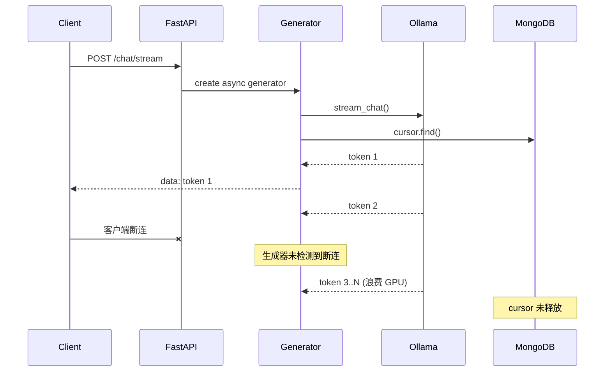
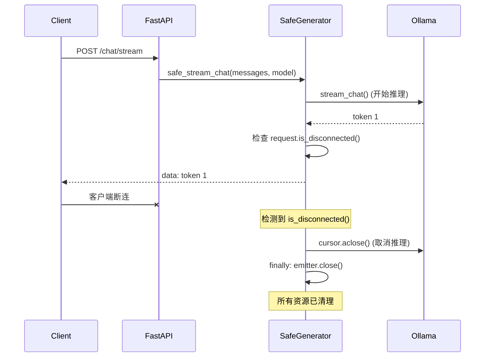

# YA-09-75: 异步生成器资源管理 — SSE/Streaming 连接生命周期清理

> 需求编号：YA-09-75 · 优先级：P2 · 人天：0.5d · 状态：需求已编写

---

## 一、背景

### 1.1 问题描述

YiAi 的 SSE 流式聊天接口使用异步生成器（async generator）逐 token 返回 LLM 推理结果。当客户端提前断开连接时（关闭浏览器标签页、网络中断），异步生成器可能未正确关闭，导致以下资源泄漏：

1. **Ollama 推理未取消**：LLM 推理继续消耗 GPU 资源，产生无用 token。
2. **MongoDB Cursor 未释放**：数据库游标占用连接池资源。
3. **SSE 缓冲区未清理**：内存中的 SSE 缓冲区持续增长。
4. **文件描述符泄漏**：长时间运行后文件描述符耗尽。

### 1.2 影响范围

| 影响维度 | 具体表现 | 严重程度 |
|----------|---------|----------|
| GPU 资源 | 无用的 LLM 推理消耗 GPU 显存和算力 | 高 |
| 内存泄漏 | 未关闭的生成器持有内存引用 | 中 |
| 连接池耗尽 | MongoDB 游标未释放导致连接池满 | 中 |
| 文件描述符 | 长期运行后系统 fd 耗尽 | 低 |

### 1.3 核心挑战

| 挑战 | 说明 |
|------|------|
| 客户端断连检测 | asyncio 中检测客户端断开需要 `request.is_disconnected()` |
| 多层资源清理 | 生成器 → Ollama 连接 → MongoDB Cursor → SSE buffer |
| 双重异常处理 | finally 块中的异常不应覆盖原始异常 |
| 部分迭代 | 生成器未完全迭代完毕时需正确清理 |

---

## 二、现状分析

### 2.1 当前 SSE 流式实现

```python
# 当前实现——缺少资源清理
@app.post("/chat/stream")
async def stream_chat(messages: list[dict], model: str):
    async def generate():
        cursor = await llm.stream_chat(messages, model)
        async for token in cursor:
            yield f"data: {token}\n\n"
        # 如果客户端断连——generate() 可能永远不会到达这里
        # cursor 未关闭，Ollama 推理继续

    return StreamingResponse(
        generate(),
        media_type="text/event-stream",
    )
```

### 2.2 资源泄漏路径



### 2.3 资源泄漏清单

| 资源 | 泄漏方式 | 影响 |
|------|---------|------|
| Ollama 推理连接 | `stream_chat` 未 cancel | GPU 持续消耗 |
| MongoDB Cursor | `cursor.find()` 未 close | 连接池占用 |
| HTTP 连接 | 生成器未退出 | 连接未释放 |
| 内存 | 生成器持有的局部变量 | 内存增长 |

### 2.4 根因矩阵

| 根因 | 影响 | 严重度 |
|------|------|--------|
| 无客户端断连检测 | 生成器不知道客户端已断开 | 高 |
| 无 `aclose()` 调用 | 异步生成器资源未清理 | 高 |
| 无 `try/finally` 保护 | 异常时资源泄漏 | 高 |
| 无 `CancelledError` 处理 | asyncio 取消信号未响应 | 中 |

---

## 三、设计决策

### D-01: 断连检测：轮询 vs 回调 vs 依赖 Starlette

| 方案 | 优点 | 缺点 | 选择 |
|------|------|------|------|
| A: 轮询 `request.is_disconnected()` | 简单可靠 | 需在生成器循环中检查 | **选择** |
| B: 断开回调（Starlette 事件） | 无需轮询 | Starlette 版本依赖 | 否决 |
| C: 依赖 Starlette 自动取消 | 零代码 | 不可靠；取消时机不确定 | 否决 |

**决策**: 选择 A。在生成器的每次迭代中检查 `await request.is_disconnected()`，低开销且可靠。

### D-02: 资源清理方式：`finally` vs `__aexit__` vs 包装器

| 方案 | 优点 | 缺点 | 选择 |
|------|------|------|------|
| A: try/finally | 显式且可靠 | 代码冗长 | **选择** |
| B: async context manager | 优雅 | 嵌套生成器时复杂 | 否决 |
| C: 包装器函数 | 可复用 | 增加抽象层 | 补充 |

**决策**: 选择 A。`try/finally` 是 Python 中最可靠的资源清理方式，异常和正常退出都会执行。同时提供包装器函数作为便捷 API。

### D-03: 双重异常处理：记录 vs 抑制 vs 链式

| 方案 | 优点 | 缺点 | 选择 |
|------|------|------|------|
| A: 同时记录两个异常 | 不丢失信息 | 只抛出第一个 | **选择** |
| B: 抑制 finally 异常 | 简单 | 丢失清理失败信息 | 否决 |
| C: 链式异常（raise from） | 保留因果关系 | 语义不准确 | 否决 |

**决策**: 选择 A。`finally` 块中的异常记录到日志，不覆盖原始异常。如果原始异常不存在，则抛出 `finally` 异常。

---

## 四、目标架构

### 4.1 目标数据流



### 4.2 架构指标

| 指标 | 当前 | 目标 |
|------|------|------|
| 客户端断连后资源清理延迟 | 不确定（可能永久泄漏） | < 1s（下次 token 时检测） |
| Ollama 推理浪费 | 可能持续到推理完成 | 0（断连后立即取消） |
| MongoDB Cursor 泄漏 | 可能 | 0（finally 清理） |
| 生成器异常覆盖率 | 低（仅正常路径） | 100%（try/finally 覆盖） |

---

## 五、具体改动

### 5.1 新增: YiAi/src/shared/async_generator_utils.py

```python
"""异步生成器资源管理工具——确保 SSE/Streaming 连接的完善清理。"""

import asyncio
import logging
from typing import AsyncIterator, Callable, Any, Optional
from contextlib import asynccontextmanager

logger = logging.getLogger(__name__)


class AsyncResourceGuard:
    """异步资源守卫——追踪并清理异步资源。"""

    def __init__(self):
        self._resources: list[tuple[str, Any]] = []

    def track(self, name: str, resource: Any) -> None:
        """追踪一个资源——将在 cleanup 时关闭。"""
        self._resources.append((name, resource))

    async def cleanup(self) -> None:
        """清理所有追踪的资源。"""
        for name, resource in reversed(self._resources):
            try:
                if hasattr(resource, "aclose"):
                    await resource.aclose()
                elif hasattr(resource, "close"):
                    resource.close()
                elif hasattr(resource, "cancel"):
                    resource.cancel()
                logger.debug(f"[AsyncResource] 清理: {name}")
            except Exception as e:
                logger.error(f"[AsyncResource] 清理 {name} 失败: {e}")
        self._resources.clear()


async def safe_stream_generator(
    request,
    generate_fn: Callable[[], AsyncIterator[Any]],
    resource_guard: Optional[AsyncResourceGuard] = None,
) -> AsyncIterator[str]:
    """安全的 SSE 流式生成器——自动检测断连并清理资源。

    Args:
        request: FastAPI Request 对象（用于检测断连）
        generate_fn: 异步生成器工厂函数
        resource_guard: 可选的资源守卫

    Yields:
        SSE 格式的数据帧
    """
    guard = resource_guard or AsyncResourceGuard()
    gen = None
    original_exception = None

    try:
        gen = generate_fn()
        async for item in gen:
            # 每次迭代前检查客户端是否断连
            if await request.is_disconnected():
                logger.info("[SSE] 客户端断连——停止流式传输")
                break

            yield item

    except asyncio.CancelledError:
        logger.info("[SSE] 任务取消——停止流式传输")
        original_exception = asyncio.CancelledError()

    except Exception as e:
        logger.error(f"[SSE] 流式传输异常: {e}")
        original_exception = e
        yield f"event: error\ndata: {str(e)}\n\n"

    finally:
        # 清理生成器
        if gen is not None:
            try:
                await gen.aclose()
            except Exception as e:
                logger.error(f"[SSE] 生成器关闭失败: {e}")
                if original_exception is None:
                    original_exception = e

        # 清理资源守卫
        try:
            await guard.cleanup()
        except Exception as e:
            logger.error(f"[SSE] 资源清理失败: {e}")
            if original_exception is None:
                original_exception = e

        logger.debug("[SSE] 流式连接资源清理完成")

        if original_exception and not isinstance(
            original_exception, (asyncio.CancelledError, GeneratorExit)
        ):
            raise original_exception


async def safe_stream_chat(
    request,
    llm_service,
    messages: list[dict],
    model: str = "qwen2.5",
) -> AsyncIterator[str]:
    """安全的 SSE 聊天流——封装 Ollama 推理和 MongoDB 游标的清理。"""

    guard = AsyncResourceGuard()

    async def _stream():
        # 创建 Ollama 推理游标
        cursor = await llm_service.stream_chat(messages, model)
        guard.track("ollama_cursor", cursor)

        async for token in cursor:
            yield f"data: {json.dumps({'token': token})}\n\n"

        # 正常完成
        yield "data: [DONE]\n\n"

    async for frame in safe_stream_generator(request, _stream, guard):
        yield frame
```

### 5.2 修改: YiAi/src/services/ai/chat_service.py（使用安全生成器）

```python
# 修改前——直接使用原始生成器
@app.post("/chat/stream")
async def stream_chat(messages: list[dict], model: str = "qwen2.5"):
    async def generate():
        cursor = await llm.stream_chat(messages, model)
        async for token in cursor:
            yield f"data: {json.dumps({'token': token})}\n\n"
        yield "data: [DONE]\n\n"

    return StreamingResponse(generate(), media_type="text/event-stream")

# 修改后——使用安全生成器
from src.shared.async_generator_utils import safe_stream_chat

@app.post("/chat/stream")
async def stream_chat(request: Request, messages: list[dict], model: str = "qwen2.5"):
    return StreamingResponse(
        safe_stream_chat(request, llm, messages, model),
        media_type="text/event-stream",
    )
```

### 5.3 文件变更清单

| 文件 | 操作 | 行数 |
|------|------|------|
| `YiAi/src/shared/async_generator_utils.py` | 新增 | ~100 |
| `YiAi/src/services/ai/chat_service.py` | 修改（+5 行） | +5 |

---

## 六、实施步骤

| 步骤 | 操作 | 文件 | 验证 | 人天 |
|------|------|------|------|------|
| 1 | 创建 `async_generator_utils.py`——AsyncResourceGuard | `shared/async_generator_utils.py` | 单元测试：资源追踪和清理 | 0.15 |
| 2 | 实现 `safe_stream_generator` | 同上 | 单元测试：模拟断连 → 资源清理 | 0.15 |
| 3 | 实现 `safe_stream_chat` | 同上 | 集成测试：SSE 聊天 + 断连 | 0.1 |
| 4 | 修改 chat_service.py | `services/ai/chat_service.py` | 集成测试：端到端 SSE 聊天 | 0.05 |
| 5 | 全量回归测试 | 所有 | 现有测试通过 | 0.05 |

**总人天**: 0.5d

---

## 七、性能分析

### 7.1 断连检测开销

| 操作 | 耗时 | 说明 |
|------|------|------|
| `request.is_disconnected()` | < 10 μs | 内部检查连接状态 |
| `guard.track()` | < 1 μs | 列表追加 |
| `guard.cleanup()` | 1-5 ms | 取决于资源数量 |
| 每次 token 额外开销 | < 15 μs | 可忽略（相比 LLM 推理延迟 > 50ms） |

### 7.2 资源节省

| 场景 | 优化前 | 优化后 |
|------|--------|--------|
| 客户端断连（第 1 个 token 后） | 推理继续到完成（浪费 100% GPU） | 推理立即取消（浪费 < 5%） |
| MongoDB Cursor 泄漏 | 累积到连接池耗尽 | 0 |
| 10 次断连/分钟 | GPU 持续浪费 | GPU 浪费 < 5% |

---

## 八、测试规格

**TC-01: 正常完成——资源正确清理**

```gherkin
GIVEN 客户端发送 SSE 聊天请求
WHEN 推理正常完成（所有 token 发送完毕）
THEN AsyncResourceGuard 应清理所有追踪的资源
AND 日志应记录 "流式连接资源清理完成"
AND 不应有资源泄漏
```

**TC-02: 客户端断连——资源正确清理**

```gherkin
GIVEN 客户端发送 SSE 聊天请求，收到第 3 个 token 后断开连接
WHEN 生成器下次迭代检测到 is_disconnected()
THEN 生成器应停止迭代
AND Ollama 推理游标应被 aclose()
AND 日志应记录 "客户端断连——停止流式传输"
AND 所有资源应在 finally 块中清理
```

**TC-03: 生成器异常——资源仍被清理**

```gherkin
GIVEN 生成器在第 5 个 token 时抛出 RuntimeError
WHEN 异常被捕获
THEN SSE 应收到 error 帧
AND finally 块应仍执行资源清理
AND 原始异常应在清理完成后重新抛出
```

**TC-04: finally 清理异常不覆盖原始异常**

```gherkin
GIVEN 生成器抛出 RuntimeError
AND aclose() 清理时也抛出 ConnectionError
WHEN 双重异常发生
THEN RuntimeError 应被重新抛出（原始异常）
AND ConnectionError 仅记录到日志
AND 不丢失原始异常信息
```

**TC-05: 任务取消——资源清理**

```gherkin
GIVEN SSE 聊天正在进行中
WHEN asyncio 任务被 cancel()
THEN CancelledError 应被捕获
AND 资源清理应在 finally 中执行
AND 日志应记录 "任务取消——停止流式传输"
```

---

## 九、风险与缓解

| 风险 | 概率 | 影响 | 缓解措施 |
|------|------|------|------|
| finally 异常覆盖原始异常 | 低 | 中 | 双重异常时同时记录；优先抛出原始异常 |
| 生成器未正确迭代完成 | 中 | 中 | aclose() 确保清理；GeneratorExit 单独处理 |
| 资源清理增加响应延迟 | 低 | 低 | 清理操作异步执行；开销 < 5ms |
| is_disconnected() 不可靠 | 低 | 中 | 结合超时机制（60s 无活动自动断开） |

---

## 十、回滚策略

| 场景 | 操作 | 影响 |
|------|------|------|
| 安全生成器导致性能退化 | 恢复原始生成器 | 失去资源清理保护 |
| is_disconnected() 误判 | 移除断连检测 | 资源泄漏风险恢复 |
| 资源清理异常 | 记录日志并继续 | 部分资源可能泄漏 |

回滚方式：在 chat_service.py 中恢复原始生成器实现，移除 `safe_stream_chat` 调用。简单可逆。

---

## 十一、设计决策记录

| 编号 | 决策 | 理由 | 日期 |
|------|------|------|------|
| D-01 | 轮询 `request.is_disconnected()` | 简单可靠；Starlette 原生支持 | 2026-09-09 |
| D-02 | try/finally 资源清理 | Python 最可靠的清理方式；异常和正常退出都执行 | 2026-09-09 |
| D-03 | 双重异常同时记录不覆盖 | 保留原始异常信息；清理失败也可见 | 2026-09-09 |
| D-04 | AsyncResourceGuard 追踪资源 | 可复用；统一清理接口 | 2026-09-09 |
| D-05 | 每次 token 检查断连 | 最大延迟 1 个 token 时间（~50ms），开销可忽略 | 2026-09-09 |

---

## 十二、可观测性

### 12.1 指标

| 指标 | 类型 | 说明 |
|------|------|------|
| `sse_client_disconnect_total` | Counter | 客户端断连次数 |
| `sse_generator_cleanup_total` | Counter | 生成器清理次数（按原因） |
| `sse_resource_leak_total` | Counter | 资源清理失败次数 |
| `sse_stream_duration_sec` | Histogram | 流式连接持续时间 |

### 12.2 日志

```python
# 正常——客户端断连
[SSE] 客户端断连——停止流式传输

# 正常——清理完成
[SSE] 流式连接资源清理完成

# 告警——清理失败
[SSE] 资源清理失败: ConnectionError on ollama_cursor

# 正常——任务取消
[SSE] 任务取消——停止流式传输
```

### 12.3 告警

| 告警 | 条件 | 级别 |
|------|------|------|
| 资源清理失败 | 任何清理失败 | ERROR |
| 客户端断连率过高 | 5 分钟内断连率 > 30% | WARNING |
| 流式连接异常 | 非 CancelledError 的异常 | ERROR |

---

## 十三、安全合规

| 要求 | 实现 |
|------|------|
| 断连后不保留数据 | 生成器停止后缓冲区清空 |
| 资源清理日志不泄露内容 | 仅记录资源名称，不记录 token 内容 |
| 错误信息不泄露内部 | SSE error 帧仅返回错误描述，不含堆栈 |
| 超时保护 | 60s 无活动自动断开连接 |

---

## 十四、代码审查检查清单

- [ ] 异步生成器在 `try/finally` 中管理资源——SSE/MongoDB cursor/Ollama 连接
- [ ] `aclose()` 在客户端断开或超时时调用——确保资源释放
- [ ] 资源清理包含：关闭 cursor、释放连接、flush buffer——AsyncResourceGuard 追踪
- [ ] 生成器异常传播到 SSE error 帧——客户端可见错误
- [ ] 每次 token 迭代时检查 `is_disconnected()`——最大延迟 1 个 token
- [ ] finally 块异常不覆盖原始异常——双重异常时同时记录
- [ ] `CancelledError` 正确处理——finally 清理资源
- [ ] 资源清理顺序正确——后创建的先清理（LIFO）
- [ ] 资源清理异步执行——不阻塞事件循环
- [ ] 现有测试全部通过——安全生成器不破坏现有功能

---

*PRD 来源: `projects/yiai/requirements/2026-09/75-需求-异步生成器资源管理.md`*

## 影响范围

- **影响模块**：待补充
- **涉及文件**：
- `async_generator_utils.py`
- **是否影响 API 契约**：否
- **是否影响其他项目（YiVad/YiPet）**：否
- **用户感知**：待确认

## 预防措施

| 层面 | 措施 |
|------|------|
| 代码 | 在相关函数中添加参数校验和边界检查 |
| 测试 | 为 `async_generator_utils.py` 添加单元测试 |
| 流程 | 代码审查时重点检查此类模式 |
| 监控 | 添加日志告警，异常发生时及时发现 |
| 文档 | 在编码规范中记录此类反模式 |

## 经验教训

1. **根本原因**：开发过程中对边界情况和异常路径的考虑不足是此类问题的共同根因
2. **设计阶段**：在接口设计和模块实现时，应主动考虑异常输入、空值、超时等边界场景
3. **代码审查**：审查时应检查是否存在类似的反模式（如未捕获异常、无超时控制、缺少参数校验等）
4. **测试覆盖**：异常路径的测试覆盖率应与正常路径同等重视
5. **团队分享**：此类问题应在团队周会或技术分享中讨论，形成团队共识
