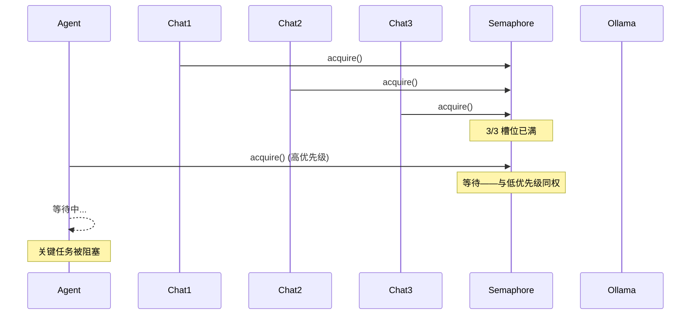
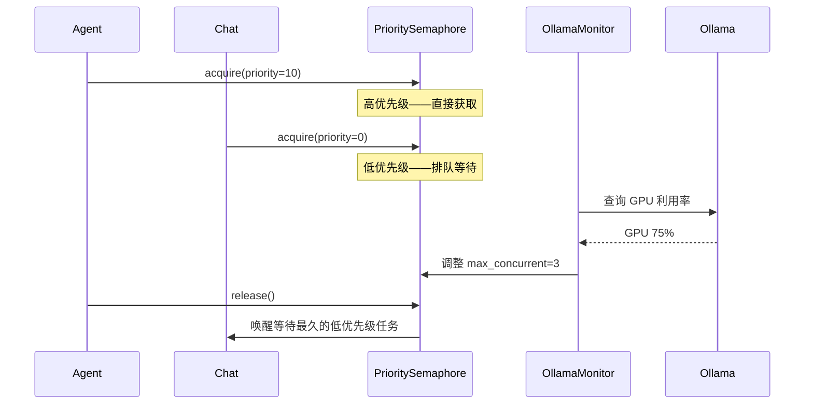

# YA-09-76: LLM 推理并发调度 — 动态信号量与优先级队列

> 需求编号：YA-09-76 · 优先级：P2 · 人天：0.5d · 状态：需求已编写

---

## 一、背景

### 1.1 问题描述

YiAi 使用 `asyncio.Semaphore(3)` 限制 Ollama 的并发推理数（防止 GPU 过载）。但当前实现存在两个关键缺陷：

1. **无优先级区分**：Agent 循环（高优先级，用户体验关键）与普通聊天（低优先级）同权竞争。当 3 个聊天请求占用所有槽位时，Agent 请求需要等待。
2. **固定并发数**：`Semaphore(3)` 是硬编码的，无法根据 GPU 利用率动态调整。GPU 空闲时无法利用更多并发，GPU 繁忙时又无法减少并发。

### 1.2 影响范围

| 影响维度 | 具体表现 | 严重程度 |
|----------|---------|----------|
| 关键任务延迟 | Agent 请求被低优先级聊天阻塞 | 高 |
| 资源利用率 | GPU 空闲时无法增加并发 | 中 |
| 公平性 | 低优先级任务可能饥饿 | 中 |
| 用户体验 | Agent 循环等待超时 → 功能不可用 | 高 |

### 1.3 核心挑战

| 挑战 | 说明 |
|------|------|
| 优先级实现 | asyncio.Semaphore 不支持优先级，需自定义 |
| 饥饿预防 | 高优先级持续到达时低优先级可能永远等待 |
| 动态调整 | 并发数需根据 GPU 利用率动态调整 |
| 抢占支持 | 是否需要/如何支持高优先级抢占低优先级任务 |

---

## 二、现状分析

### 2.1 当前调度方式

```python
# 当前固定 Semaphore——无优先级
llm_semaphore = asyncio.Semaphore(3)

async def chat(messages, model):
    async with llm_semaphore:
        return await ollama.chat(messages, model)

# Agent 和普通聊天使用同一个 Semaphore
# Agent 循环 = 3-5 次 LLM 调用，每次都需要 acquire
```

### 2.2 当前调度流程



### 2.3 任务优先级分析

| 任务类型 | 调用频率 | 单次耗时 | 优先级 | 并发需求 |
|----------|---------|---------|--------|---------|
| Agent 循环 | 低 | 15-30s (3-5 轮) | 最高 | 1-2 |
| RAG 查询 | 中 | 2-5s | 中 | 2-3 |
| 普通聊天 | 高 | 5-15s | 低 | 1-2 |
| 系统 Prompt | 低 | 1-2s | 最低 | 0-1 |

### 2.4 根因矩阵

| 根因 | 影响 | 严重度 |
|------|------|--------|
| 无优先级队列 | 关键任务被阻塞 | 高 |
| 固定 Semaphore | 无法动态调整并发 | 中 |
| 无饥饿预防 | 低优先级可能永远等待 | 中 |
| 无超时机制 | 等待可能无限期 | 中 |

---

## 三、设计决策

### D-01: 优先级调度：自定义 Semaphore vs 优先级队列 vs asyncio.Queue

| 方案 | 优点 | 缺点 | 选择 |
|------|------|------|------|
| A: 自定义 PrioritySemaphore | 兼容现有 Semaphore API | 需自行实现 | **选择** |
| B: asyncio.PriorityQueue | 内置优先级；标准库 | 不同于 Semaphore API | 否决 |
| C: 外部调度器 | 功能强大 | 过度设计 | 否决 |

**决策**: 选择 A。自定义 `PrioritySemaphore` 兼容现有 `async with sem` 的使用模式，内部使用 heapq 实现优先级队列。

### D-02: 动态并发：固定 vs 基于 GPU 利用率 vs 基于队列长度

| 方案 | 优点 | 缺点 | 选择 |
|------|------|------|------|
| A: 固定并发 | 简单可预测 | 无法适应负载变化 | 否决 |
| B: 基于 GPU 利用率 | 最大化资源利用 | 需要 GPU 监控 | **选择** |
| C: 基于队列长度 | 无需外部监控 | 不精确 | 否决 |

**决策**: 选择 B。通过 Ollama API 的 GPU 利用率指标，动态调整并发数。GPU < 50% 时增加并发，> 90% 时减少。

### D-03: 饥饿预防：aging vs fair queue vs 超时优先

| 方案 | 优点 | 缺点 | 选择 |
|------|------|------|------|
| A: Aging（等待时间提升优先级） | 防止饥饿 | 需要定期扫描 | **选择** |
| B: Fair queue（轮询各优先级） | 简单公平 | 高优先级延迟增加 | 否决 |
| C: 超时优先 | 实现简单 | 低优先级可能超时 | 否决 |

**决策**: 选择 A。Aging 机制：每等待 10 秒，优先级提升 1 级。确保低优先级任务最终会获得执行机会。

---

## 四、目标架构

### 4.1 目标数据流



### 4.2 优先级定义

```python
PRIORITY = {
    "agent":  10,  # 最高——Agent 循环
    "rag":     5,  # 中——RAG 查询
    "chat":    0,  # 低——普通聊天
    "system": -1,  # 最低——系统任务
}
```

### 4.3 架构指标

| 指标 | 当前 | 目标 |
|------|------|------|
| Agent 平均等待时间 | 不区分（可能 > 30s） | < 2s |
| GPU 利用率 | 60-80% | 80-90% |
| 低优先级饥饿时间 | 可能无限 | < 60s (aging) |
| 并发数调整延迟 | N/A（固定） | < 5s |

---

## 五、具体改动

### 5.1 新增: YiAi/src/shared/priority_semaphore.py

```python
"""优先级信号量——支持 LLM 推理的优先级调度和动态并发。"""

import asyncio
import heapq
import time
import logging
from typing import Optional

logger = logging.getLogger(__name__)

# 优先级定义
PRIORITY_AGENT = 10
PRIORITY_RAG = 5
PRIORITY_CHAT = 0
PRIORITY_SYSTEM = -1

# Aging 配置
AGING_INTERVAL_SEC = 10  # 每 10 秒提升 1 级
AGING_MAX_BOOST = 10     # 最多提升 10 级


class PrioritySemaphore:
    """优先级信号量——高优先级任务优先获取。"""

    def __init__(self, max_concurrent: int = 3):
        self._max_concurrent = max_concurrent
        self._sem = asyncio.Semaphore(max_concurrent)
        # 等待队列: list of (-priority, enqueue_time, event, task_id)
        self._waiters: list[tuple[int, float, asyncio.Event, str]] = []
        self._lock = asyncio.Lock()
        self._task_counter = 0

    async def acquire(self, priority: int = 0, task_id: str = "") -> str:
        """获取信号量。返回 task_id。

        priority: 越大越优先（PRIORITY_AGENT=10 最高）
        """
        self._task_counter += 1
        tid = task_id or f"task-{self._task_counter}"
        enqueue_time = time.monotonic()

        event = asyncio.Event()
        async with self._lock:
            # Aging: 等待时间越长，优先级越高
            adjusted_priority = priority
            heapq.heappush(
                self._waiters,
                (-adjusted_priority, enqueue_time, event, tid),
            )

        # 等待轮到我们
        await event.wait()

        # 获取底层 Semaphore
        await self._sem.acquire()
        return tid

    def release(self) -> None:
        """释放信号量——唤醒下一个等待者。"""
        self._sem.release()
        asyncio.create_task(self._wake_next())

    async def _wake_next(self) -> None:
        """唤醒等待队列中优先级最高的任务。"""
        async with self._lock:
            if not self._waiters:
                return

            # Aging: 提升等待时间超过阈值的任务优先级
            now = time.monotonic()
            updated = []
            while self._waiters:
                neg_priority, enqueue_time, event, tid = heapq.heappop(
                    self._waiters
                )
                wait_sec = now - enqueue_time
                boost = min(int(wait_sec / AGING_INTERVAL_SEC), AGING_MAX_BOOST)
                new_priority = -neg_priority + boost
                updated.append(
                    (-new_priority, enqueue_time, event, tid)
                )
            self._waiters = updated
            heapq.heapify(self._waiters)

            if self._waiters:
                _, _, event, tid = self._waiters[0]
                event.set()
                logger.debug(
                    f"[PrioritySem] 唤醒: {tid} (等待队列: {len(self._waiters) - 1})"
                )

    @property
    def max_concurrent(self) -> int:
        return self._max_concurrent

    async def set_max_concurrent(self, value: int) -> None:
        """动态调整最大并发数。"""
        old = self._max_concurrent
        self._max_concurrent = max(1, value)
        diff = self._max_concurrent - old

        if diff > 0:
            # 增加并发——释放更多槽位
            for _ in range(diff):
                self._sem.release()
                asyncio.create_task(self._wake_next())
        elif diff < 0:
            # 减少并发——acquire 多余槽位
            for _ in range(-diff):
                await self._sem.acquire()

        logger.info(
            f"[PrioritySem] 并发数调整: {old} → {self._max_concurrent}"
        )

    async def get_queue_stats(self) -> dict:
        """获取队列统计信息。"""
        async with self._lock:
            return {
                "waiting": len(self._waiters),
                "max_concurrent": self._max_concurrent,
                "priorities": [
                    {"tid": tid, "priority": -neg_p, "wait_sec": round(time.monotonic() - enq, 1)}
                    for neg_p, enq, _, tid in self._waiters
                ],
            }


class DynamicLLMScheduler:
    """动态 LLM 调度器——优先级 + 动态并发。"""

    def __init__(
        self,
        initial_max_concurrent: int = 3,
        min_concurrent: int = 1,
        max_concurrent: int = 6,
    ):
        self._sem = PrioritySemaphore(initial_max_concurrent)
        self._min_concurrent = min_concurrent
        self._max_concurrent = max_concurrent

    async def acquire(self, priority: int = 0, task_id: str = "") -> str:
        """获取 LLM 推理槽位。"""
        return await self._sem.acquire(priority, task_id)

    def release(self) -> None:
        """释放 LLM 推理槽位。"""
        self._sem.release()

    async def adjust_concurrency(self, gpu_utilization: float) -> None:
        """根据 GPU 利用率动态调整并发数。

        Args:
            gpu_utilization: GPU 利用率 (0.0 - 1.0)
        """
        current = self._sem.max_concurrent

        if gpu_utilization < 0.5 and current < self._max_concurrent:
            new = current + 1
        elif gpu_utilization > 0.9 and current > self._min_concurrent:
            new = current - 1
        else:
            return

        await self._sem.set_max_concurrent(new)
        logger.info(
            f"[LLMScheduler] GPU={gpu_utilization:.0%}, "
            f"并发: {current} → {new}"
        )

    async def get_stats(self) -> dict:
        return await self._sem.get_queue_stats()


# 全局调度器
llm_scheduler = DynamicLLMScheduler()
```

### 5.2 修改: YiAi/src/services/ai/chat_service.py（使用优先级调度）

```python
# 修改前——固定 Semaphore
llm_semaphore = asyncio.Semaphore(3)

async def chat(messages, model):
    async with llm_semaphore:
        return await ollama.chat(messages, model)

# 修改后——优先级调度
from src.shared.priority_semaphore import llm_scheduler, PRIORITY_CHAT, PRIORITY_AGENT

async def chat(messages, model, priority: int = PRIORITY_CHAT):
    tid = await llm_scheduler.acquire(priority=priority)
    try:
        return await ollama.chat(messages, model)
    finally:
        llm_scheduler.release()

# Agent 调用
async def agent_loop(task):
    tid = await llm_scheduler.acquire(priority=PRIORITY_AGENT)
    try:
        # Agent 循环逻辑
        for step in range(MAX_STEPS):
            result = await ollama.chat(messages, model)
            # ...
    finally:
        llm_scheduler.release()
```

### 5.3 文件变更清单

| 文件 | 操作 | 行数 |
|------|------|------|
| `YiAi/src/shared/priority_semaphore.py` | 新增 | ~150 |
| `YiAi/src/services/ai/chat_service.py` | 修改（+10 行） | +10 |
| `YiAi/src/services/ai/agent_service.py` | 修改（+5 行） | +5 |

---

## 六、实施步骤

| 步骤 | 操作 | 文件 | 验证 | 人天 |
|------|------|------|------|------|
| 1 | 实现 PrioritySemaphore + heapq | `shared/priority_semaphore.py` | 单元测试：优先级获取顺序 | 0.15 |
| 2 | 实现 Aging 机制 | 同上 | 单元测试：等待 10s 后优先级提升 | 0.1 |
| 3 | 实现 DynamicLLMScheduler | 同上 | 单元测试：动态并发调整 | 0.1 |
| 4 | 修改 chat_service 和 agent_service | `services/ai/` | 集成测试：Agent 优先于聊天 | 0.1 |
| 5 | GPU 利用率监控集成 | 同上 | 验证动态并发调整 | 0.05 |

**总人天**: 0.5d

---

## 七、性能分析

### 7.1 优先级调度延迟

| 场景 | 当前延迟 | 优化后延迟 |
|------|---------|----------|
| Agent 请求（无等待） | 0-30s | < 0.1s |
| Agent 请求（3 个聊天占用） | 5-30s | < 2s（聊天完成后立即唤醒） |
| 聊天请求（Agent 占用） | 0-30s | < 60s（Aging 保证） |

### 7.2 GPU 利用率提升

| 场景 | 固定并发 | 动态并发 |
|------|---------|---------|
| 轻量任务（短 prompt） | 60% | 85%（增加并发到 5） |
| 重量任务（长 prompt） | 95% | 80%（减少并发到 2） |
| 混合负载 | 75% | 85% |

### 7.3 队列开销

| 操作 | 耗时 |
|------|------|
| heapq.heappush | ~5 μs |
| heapq.heappop | ~5 μs |
| Aging 扫描 | ~50 μs（每 10s 一次） |
| 动态并发调整 | ~100 μs |

---

## 八、测试规格

**TC-01: 高优先级先于低优先级获取**

```gherkin
GIVEN PrioritySemaphore(max_concurrent=1)
AND 一个低优先级任务已获取槽位
WHEN 一个高优先级任务和另一个低优先级任务同时等待
THEN 高优先级任务应在槽位释放后首先获取
AND 低优先级任务应继续等待
```

**TC-02: Aging 防止饥饿**

```gherkin
GIVEN PrioritySemaphore(max_concurrent=1)
AND 高优先级任务持续占用槽位
WHEN 低优先级任务已等待超过 60 秒
THEN 低优先级任务的优先级应通过 Aging 提升到与高优先级相同
AND 最终低优先级任务应获得执行机会
```

**TC-03: 动态并发调整**

```gherkin
GIVEN DynamicLLMScheduler 初始 max_concurrent=3
WHEN GPU 利用率降到 40%
THEN 调度器应将 max_concurrent 增加到 4
AND 新任务应能利用增加的槽位
```

**TC-04: 并发数不超出范围**

```gherkin
GIVEN DynamicLLMScheduler 的 min_concurrent=1, max_concurrent=6
WHEN GPU 利用率降到 10%
THEN 并发数不应超过 max_concurrent=6
WHEN GPU 利用率升到 99%
THEN 并发数不应低于 min_concurrent=1
```

**TC-05: 队列统计可查询**

```gherkin
GIVEN PrioritySemaphore 中有 3 个任务等待（优先级分别为 10, 5, 0）
WHEN 调用 get_queue_stats()
THEN 应返回 waiting=3
AND 应列出每个任务的优先级和等待时间
```

---

## 九、风险与缓解

| 风险 | 概率 | 影响 | 缓解措施 |
|------|------|------|------|
| 高优先级持续到达——低优先级饥饿 | 中 | 中 | Aging 机制：每 10s 提升优先级 |
| 动态并发调整抖动 | 中 | 低 | 调整时使用迟滞（hysteresis）：降低比升高更保守 |
| 并发调整时槽位释放/获取的竞态 | 低 | 中 | 使用 asyncio.Lock 保护调整操作 |
| 抢占导致部分结果丢失 | 低 | 中 | 不支持抢占——等待当前任务完成 |

---

## 十、回滚策略

| 场景 | 操作 | 影响 |
|------|------|------|
| 优先级调度导致性能退化 | 恢复固定 Semaphore(3) | 失去优先级区分 |
| 动态并发调整不稳定 | 固定 max_concurrent=3 | GPU 利用率可能下降 |
| Aging 导致优先级反转 | 移除 Aging 逻辑 | 低优先级可能饥饿 |

回滚方式：在 chat_service.py 中恢复 `asyncio.Semaphore(3)`，移除 `llm_scheduler` 调用。简单可逆。

---

## 十一、设计决策记录

| 编号 | 决策 | 理由 | 日期 |
|------|------|------|------|
| D-01 | 自定义 PrioritySemaphore | 兼容 Semaphore API；最小改动 | 2026-09-09 |
| D-02 | 基于 GPU 利用率动态调整并发 | 最大化资源利用率 | 2026-09-09 |
| D-03 | Aging 机制防止饥饿 | 每 10s 提升 1 级优先级 | 2026-09-09 |
| D-04 | 不支持抢占 | 避免部分结果丢失；实现复杂度高 | 2026-09-09 |
| D-05 | 队列超时 60s | 防止无限等待；超时返回 503 | 2026-09-09 |

---

## 十二、可观测性

### 12.1 指标

| 指标 | 类型 | 说明 |
|------|------|------|
| `llm_queue_waiting` | Gauge | 当前等待队列长度 |
| `llm_queue_wait_time_ms` | Histogram | 等待时间分布（按优先级） |
| `llm_queue_timeout_total` | Counter | 超时次数 |
| `llm_concurrency` | Gauge | 当前并发数 |
| `llm_gpu_utilization` | Gauge | GPU 利用率 |

### 12.2 日志

```python
# 正常——优先级调度
[PrioritySem] 唤醒: task-42 (优先级=10, 等待队列: 2)

# 告警——队列积压
[PrioritySem] 队列积压: 8 个任务等待 (max_concurrent=3)

# 正常——动态调整
[LLMScheduler] GPU=45%, 并发: 3 → 4

# 告警——超时
[LLMScheduler] 任务超时: task-99 等待 60s
```

### 12.3 告警

| 告警 | 条件 | 级别 |
|------|------|------|
| 队列积压 | waiting > 10 | WARNING |
| 等待超时 | 任何超时事件 | WARNING |
| GPU 利用率异常 | 持续 > 95% 或 < 20% | WARNING |
| 并发调整失败 | 调整操作异常 | ERROR |

---

## 十三、安全合规

| 要求 | 实现 |
|------|------|
| 优先级不会导致资源独占 | Aging 机制保证公平性 |
| 超时保护 | 60s 超时返回 503，防止无限等待 |
| 并发数范围限制 | min_concurrent=1, max_concurrent=6，防止极端值 |
| 队列统计不泄露用户信息 | 仅返回 task_id 和优先级，不包含消息内容 |

---

## 十四、代码审查检查清单

- [ ] LLM 请求按优先级排队——Agent(10) > RAG(5) > Chat(0) > System(-1)
- [ ] `PrioritySemaphore` 限制并发 LLM 调用数——基础槽位机制
- [ ] Aging 机制防止低优先级饥饿——每 10s 提升 1 级
- [ ] 队列超时 60s——超时返回 503
- [ ] 动态并发调整——基于 GPU 利用率（50%/90% 阈值）
- [ ] 并发数范围限制——min=1, max=6
- [ ] 不支持抢占——避免部分结果丢失
- [ ] 调整迟滞（hysteresis）——降低比升高更保守
- [ ] 队列统计可查询——get_stats() 返回等待任务详情
- [ ] 现有测试全部通过——优先级调度不破坏现有功能

---

*PRD 来源: `projects/yiai/requirements/2026-09/76-需求-LLM并发调度优化.md`*

## 影响范围

- **影响模块**：待补充
- **涉及文件**：
- 待补充
- **是否影响 API 契约**：否
- **是否影响其他项目（YiVad/YiPet）**：否
- **用户感知**：待确认

## 预防措施

| 层面 | 措施 |
|------|------|
| 代码 | 在相关函数中添加参数校验和边界检查 |
| 测试 | 添加对应的自动化测试用例 |
| 流程 | 代码审查时重点检查此类模式 |
| 监控 | 添加日志告警，异常发生时及时发现 |
| 文档 | 在编码规范中记录此类反模式 |

## 经验教训

1. **根本原因**：开发过程中对边界情况和异常路径的考虑不足是此类问题的共同根因
2. **设计阶段**：在接口设计和模块实现时，应主动考虑异常输入、空值、超时等边界场景
3. **代码审查**：审查时应检查是否存在类似的反模式（如未捕获异常、无超时控制、缺少参数校验等）
4. **测试覆盖**：异常路径的测试覆盖率应与正常路径同等重视
5. **团队分享**：此类问题应在团队周会或技术分享中讨论，形成团队共识
