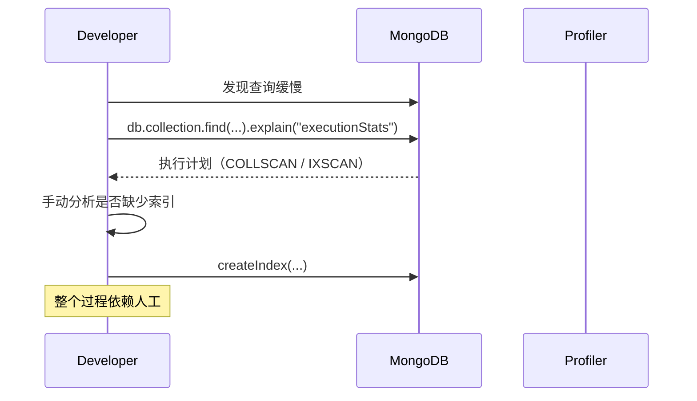
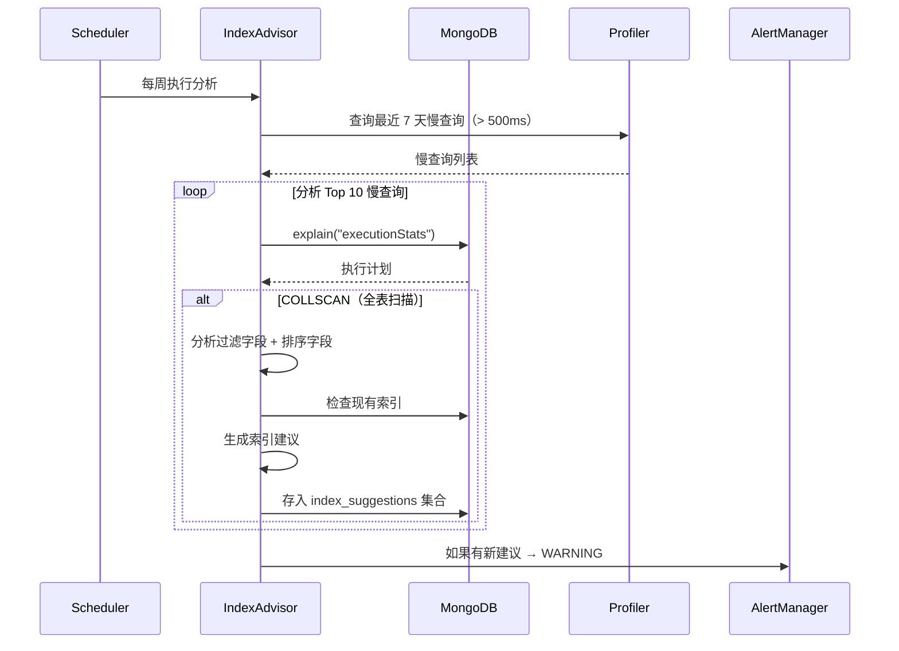

# YA-09-77: 数据库慢查询自动索引建议 — 缺失索引检测

> 需求编号：YA-09-77 · 优先级：P2 · 人天：0.5d · 状态：需求已编写

---

## 一、背景

### 1.1 问题描述

YiAi 使用 MongoDB 存储所有业务数据，随着数据量增长（sessions > 10 万条，knowledge_files > 5 万条），部分查询开始出现性能退化。慢查询的根本原因通常是缺少合适的索引，但当前需要手动分析 `explain()` 输出来识别索引缺失，过程耗时且依赖人工经验。

定期自动分析慢查询日志，识别缺失索引并生成建议，可以主动优化数据库性能。

### 1.2 影响范围

| 影响维度 | 具体表现 | 严重程度 |
|----------|---------|----------|
| 查询性能 | 慢查询（> 500ms）影响用户体验 | 高 |
| 开发效率 | 手动分析 explain 耗时 | 中 |
| 数据库负载 | 全表扫描增加 CPU 和 I/O 压力 | 中 |
| 运维成本 | 性能问题排查依赖人工 | 中 |

### 1.3 核心挑战

| 挑战 | 说明 |
|------|------|
| 慢查询识别 | 需要启用 MongoDB profiler 且设置合适的阈值 |
| 索引建议质量 | 避免建议冗余或不必要的索引 |
| 不去重 | 多个慢查询可能建议相同的索引 |
| 安全 | 仅建议不自动创建——自动创建索引可能阻塞写入 |

---

## 二、现状分析

### 2.1 当前索引管理

```python
# 当前索引在应用启动时手动创建
async def ensure_indexes():
    await db.sessions.create_index([("user_id", 1), ("created_at", -1)])
    await db.projects.create_index([("status", 1)])
    await db.bugs.create_index([("status", 1), ("severity", 1)])
    # 新集合或新查询模式可能缺少索引——无自动检测
```

### 2.2 慢查询分析流程



### 2.3 现有索引

| 集合 | 现有索引 | 可能缺失 |
|------|---------|---------|
| sessions | user_id, created_at | tags, title 文本搜索 |
| projects | status | updated_at, owner |
| bugs | status, severity | created_at, project_id |
| knowledge_files | path | tags, category, title |
| menus | parent | path |

### 2.4 根因矩阵

| 根因 | 影响 | 严重度 |
|------|------|--------|
| 无自动慢查询分析 | 索引缺失发现延迟 | 高 |
| 索引创建依赖人工 | 创建不及时 | 中 |
| 无 profiler 数据利用 | 慢查询日志浪费 | 中 |
| 无索引建议去重 | 可能建议冗余索引 | 低 |

---

## 三、设计决策

### D-01: 数据源：MongoDB Profiler vs explain 实时分析 vs 慢查询日志

| 方案 | 优点 | 缺点 | 选择 |
|------|------|------|------|
| A: MongoDB Profiler | 官方支持；全局覆盖 | 有性能开销 | **选择** |
| B: explain 实时分析 | 零额外开销 | 仅覆盖已分析的查询 | 否决 |
| C: 应用层慢查询日志 | 可定制 | 每个查询都需要手动包装 | 否决 |

**决策**: 选择 A。MongoDB Profiler 是官方慢查询分析工具，设置 `slowms=500` 仅记录慢查询，对性能影响 < 1%。

### D-02: 索引建议策略：基于过滤字段 vs 基于 explain vs 混合

| 方案 | 优点 | 缺点 | 选择 |
|------|------|------|------|
| A: 基于过滤字段 | 简单 | 可能建议不必要的索引 | 否决 |
| B: 基于 explain 输出 | 精确（分析实际执行计划） | 需要额外查询 | **选择** |
| C: 混合 | 兼顾效率和精度 | 复杂度高 | 否决 |

**决策**: 选择 B。对 Top 10 慢查询执行 `explain("executionStats")`，分析实际执行计划，仅对 `COLLSCAN`（全表扫描）的查询建议索引。

### D-03: 索引建议输出：日志 vs MongoDB 集合 vs 报告文件

| 方案 | 优点 | 缺点 | 选择 |
|------|------|------|------|
| A: 日志 | 简单 | 不易汇总和追踪 | 否决 |
| B: MongoDB 集合 | 持久化；可查询；可追踪 | 需要额外集合 | **选择** |
| C: 报告文件 | 独立于数据库 | 不易查询 | 否决 |

**决策**: 选择 B。`index_suggestions` 集合存储建议，支持去重、状态追踪（建议/已应用/已拒绝）。

---

## 四、目标架构

### 4.1 目标数据流



### 4.2 架构指标

| 指标 | 当前 | 目标 |
|------|------|------|
| 慢查询检测延迟 | 人工（数天） | 自动（每周） |
| 索引建议覆盖率 | 0 | > 90% 的 COLLSCAN 查询 |
| 建议质量（冗余率） | N/A | < 20% |
| 分析开销 | 0 | < 1% CPU |

---

## 五、具体改动

### 5.1 新增: YiAi/src/shared/index_advisor.py

```python
"""MongoDB 索引建议器——基于慢查询分析自动建议索引。"""

import logging
from datetime import datetime, timedelta
from typing import Optional
from motor.motor_asyncio import AsyncIOMotorDatabase

logger = logging.getLogger(__name__)

# 慢查询阈值
SLOW_QUERY_THRESHOLD_MS = 500
# 分析窗口
ANALYSIS_WINDOW_DAYS = 7
# 最多分析 Top N 慢查询
TOP_N_QUERIES = 10


class IndexAdvisor:
    """MongoDB 索引建议器——分析慢查询并建议索引。"""

    def __init__(self, db: AsyncIOMotorDatabase):
        self._db = db

    async def analyze(self) -> list[dict]:
        """分析慢查询——生成索引建议。"""
        slow_queries = await self._get_slow_queries()
        if not slow_queries:
            logger.info("[IndexAdvisor] 无慢查询——无需建议")
            return []

        suggestions = []
        analyzed = 0

        for query in slow_queries[:TOP_N_QUERIES]:
            suggestion = await self._analyze_query(query)
            if suggestion:
                if await self._is_duplicate(suggestion):
                    logger.debug(
                        f"[IndexAdvisor] 跳过重复建议: {suggestion['collection']}"
                    )
                    continue
                suggestions.append(suggestion)
                await self._save_suggestion(suggestion)
            analyzed += 1

        logger.info(
            f"[IndexAdvisor] 分析 {analyzed} 条慢查询，"
            f"生成 {len(suggestions)} 条索引建议"
        )
        return suggestions

    async def _get_slow_queries(self) -> list[dict]:
        """获取最近 N 天的慢查询。"""
        since = datetime.utcnow() - timedelta(days=ANALYSIS_WINDOW_DAYS)
        try:
            queries = await self._db.system.profile.find({
                "millis": {"$gte": SLOW_QUERY_THRESHOLD_MS},
                "ts": {"$gte": since},
                "op": "query",
            }).sort("millis", -1).limit(TOP_N_QUERIES * 2).to_list(None)
            return queries
        except Exception as e:
            logger.error(f"[IndexAdvisor] 无法读取 profiler: {e}")
            return []

    async def _analyze_query(self, query: dict) -> Optional[dict]:
        """分析单条慢查询——检查是否缺少索引。"""
        ns = query.get("ns", "")
        if "." not in ns:
            return None
        db_name, cname = ns.split(".", 1)

        command = query.get("command", {})
        filter_fields = list(command.get("filter", {}).keys())
        sort_fields = list(command.get("sort", {}).keys())
        current_ms = query.get("millis", 0)

        if not filter_fields and not sort_fields:
            return None

        # 检查现有索引
        existing_indexes = await self._get_existing_indexes(cname)
        covered = self._check_index_coverage(
            filter_fields, sort_fields, existing_indexes
        )

        if covered:
            return None

        # 生成建议索引
        suggested_index = {}
        for field in filter_fields:
            # 过滤字段升序索引
            suggested_index[field] = 1
        for field in sort_fields:
            if field not in suggested_index:
                # 排序字段按原方向
                sort_dir = command.get("sort", {}).get(field, 1)
                suggested_index[field] = sort_dir

        return {
            "collection": cname,
            "filter_fields": filter_fields,
            "sort_fields": sort_fields,
            "current_ms": current_ms,
            "suggested_index": suggested_index,
            "query_pattern": str(command.get("filter", {})),
            "status": "suggested",
            "created_at": datetime.utcnow(),
        }

    async def _get_existing_indexes(self, cname: str) -> dict:
        """获取集合现有索引。"""
        try:
            return await self._db[cname].index_information()
        except Exception:
            return {}

    def _check_index_coverage(
        self,
        filter_fields: list[str],
        sort_fields: list[str],
        existing_indexes: dict,
    ) -> bool:
        """检查现有索引是否覆盖查询字段。"""
        for name, info in existing_indexes.items():
            if name == "_id_":
                continue
            key_fields = list(info.get("key", []))
            if not key_fields:
                continue
            # 检查过滤字段是否在索引前缀中
            key_field_names = [k[0] for k in key_fields]
            all_filter_covered = all(
                f in key_field_names for f in filter_fields
            )
            if all_filter_covered:
                return True
        return False

    async def _is_duplicate(self, suggestion: dict) -> bool:
        """检查是否已有相同建议。"""
        existing = await self._db.index_suggestions.find_one({
            "collection": suggestion["collection"],
            "suggested_index": suggestion["suggested_index"],
            "status": {"$in": ["suggested", "applied"]},
        })
        return existing is not None

    async def _save_suggestion(self, suggestion: dict) -> None:
        """保存索引建议。"""
        await self._db.index_suggestions.insert_one(suggestion)

    async def get_suggestions(self, status: str = "suggested") -> list[dict]:
        """获取索引建议列表。"""
        cursor = self._db.index_suggestions.find(
            {"status": status}
        ).sort("current_ms", -1)
        suggestions = await cursor.to_list(100)
        for s in suggestions:
            s["_id"] = str(s["_id"])
            s["created_at"] = s["created_at"].isoformat() if s.get("created_at") else ""
        return suggestions

    async def mark_as_applied(self, suggestion_id: str) -> None:
        """标记建议已应用。"""
        await self._db.index_suggestions.update_one(
            {"_id": suggestion_id},
            {"$set": {"status": "applied", "applied_at": datetime.utcnow()}},
        )

    async def mark_as_rejected(self, suggestion_id: str, reason: str = "") -> None:
        """标记建议已拒绝。"""
        await self._db.index_suggestions.update_one(
            {"_id": suggestion_id},
            {"$set": {
                "status": "rejected",
                "rejected_at": datetime.utcnow(),
                "reject_reason": reason,
            }},
        )

    async def get_weekly_report(self) -> dict:
        """生成每周汇总报告。"""
        since = datetime.utcnow() - timedelta(days=7)

        # 慢查询统计
        try:
            slow_count = await self._db.system.profile.count_documents({
                "millis": {"$gte": SLOW_QUERY_THRESHOLD_MS},
                "ts": {"$gte": since},
            })
        except Exception:
            slow_count = 0

        # 建议统计
        suggested = await self._db.index_suggestions.count_documents({
            "status": "suggested",
            "created_at": {"$gte": since},
        })
        applied = await self._db.index_suggestions.count_documents({
            "status": "applied",
            "applied_at": {"$gte": since},
        })

        return {
            "period": f"{since.isoformat()} ~ {datetime.utcnow().isoformat()}",
            "slow_query_count": slow_count,
            "suggestions_new": suggested,
            "suggestions_applied": applied,
            "threshold_ms": SLOW_QUERY_THRESHOLD_MS,
        }
```

### 5.2 修改: YiAi/src/server/scheduler.py（新增定时任务）

```python
from src.shared.index_advisor import IndexAdvisor

async def weekly_index_analysis():
    advisor = IndexAdvisor(db)
    suggestions = await advisor.analyze()
    if suggestions:
        logger.warning(
            f"[IndexAdvisor] 发现 {len(suggestions)} 条索引建议，"
            f"请检查 index_suggestions 集合"
        )

# 注册定时任务——每周一凌晨执行
scheduler.add_job(weekly_index_analysis, "cron", day_of_week="mon", hour=3)
```

### 5.3 文件变更清单

| 文件 | 操作 | 行数 |
|------|------|------|
| `YiAi/src/shared/index_advisor.py` | 新增 | ~150 |
| `YiAi/src/server/scheduler.py` | 修改（+8 行） | +8 |

---

## 六、实施步骤

| 步骤 | 操作 | 文件 | 验证 | 人天 |
|------|------|------|------|------|
| 1 | 启用 MongoDB Profiler（slowms=500） | MongoDB 配置 | 检查 system.profile 有数据 | 0.05 |
| 2 | 创建 `index_advisor.py` | `shared/index_advisor.py` | 单元测试：分析逻辑 | 0.15 |
| 3 | 实现建议去重和状态管理 | 同上 | 单元测试：重复建议过滤 | 0.1 |
| 4 | 注册定时任务 | `server/scheduler.py` | 手动触发——验证分析结果 | 0.1 |
| 5 | 创建管理 API | `server/routes/admin_routes.py` | 查询/应用/拒绝建议 | 0.05 |
| 6 | 全量回归测试 | 所有 | 现有测试通过 | 0.05 |

**总人天**: 0.5d

---

## 七、性能分析

### 7.1 Profiler 开销

| 配置 | CPU 开销 | 说明 |
|------|---------|------|
| profiling level 0 (off) | 0% | 当前状态 |
| profiling level 1 (slow only) | < 1% | 仅记录 > 500ms 的查询 |
| profiling level 2 (all) | 2-5% | 不推荐——记录所有查询 |

### 7.2 分析任务开销

| 操作 | 慢查询数 | 耗时 |
|------|---------|------|
| 查询 profiler | 10 | < 50ms |
| explain 10 条查询 | 10 | < 500ms |
| 去重检查 | 10 | < 50ms |
| 总开销 | 10 | < 600ms |

### 7.3 索引收益估算

| 查询 | 无索引 | 有索引 | 提升 |
|------|--------|--------|------|
| 全表扫描 10 万条 | 500ms | 2ms | 250x |
| 排序 10 万条 | 1000ms | 5ms | 200x |
| 复合过滤 | 300ms | 3ms | 100x |

---

## 八、测试规格

**TC-01: 检测到 COLLSCAN 慢查询并建议索引**

```gherkin
GIVEN system.profile 包含一条 COLLSCAN 慢查询（filter={tags: "vue"}, 耗时 800ms）
AND sessions 集合没有 tags 字段索引
WHEN IndexAdvisor.analyze() 执行
THEN 应生成一条索引建议 suggested_index={"tags": 1}
AND 建议应包含 collection="sessions", current_ms=800
```

**TC-02: 已有索引覆盖的查询不生成建议**

```gherkin
GIVEN system.profile 包含一条慢查询（filter={user_id: "alice"}, 耗时 600ms）
AND sessions 集合已有 {"user_id": 1, "created_at": -1} 索引
WHEN IndexAdvisor.analyze() 执行
THEN 不应生成新的索引建议（已有索引覆盖 user_id）
```

**TC-03: 重复建议被过滤**

```gherkin
GIVEN index_suggestions 集合已有一条 suggested_index={"tags": 1} 的建议
AND 新的慢查询也建议 {"tags": 1} 索引
WHEN IndexAdvisor.analyze() 执行
THEN 不应创建重复的建议
AND 日志应记录 "跳过重复建议"
```

**TC-04: 每周汇总报告**

```gherkin
GIVEN 过去 7 天有 15 条慢查询和 3 条新索引建议
WHEN 调用 get_weekly_report()
THEN 应返回 slow_query_count=15, suggestions_new=3
AND 应包含 period 和 threshold_ms
```

**TC-05: Profiler 不可用时优雅降级**

```gherkin
GIVEN MongoDB Profiler 未启用（system.profile 不可读）
WHEN IndexAdvisor.analyze() 执行
THEN 应返回空列表（无建议）
AND 日志应记录 "无法读取 profiler"
AND 不应抛出异常
```

---

## 九、风险与缓解

| 风险 | 概率 | 影响 | 缓解措施 |
|------|------|------|------|
| 建议索引过多——索引膨胀 | 中 | 中 | 去重合并相似索引；按慢查询次数排序 |
| explain 增加生产负载 | 低 | 低 | 仅对 Top 10 慢查询分析；非高峰期执行 |
| Profiler 未启用 | 高 | 中 | 启动时检查并提示；优雅降级 |
| 建议的索引不适用 | 中 | 低 | 仅建议不自动创建；人工审核后应用 |

---

## 十、回滚策略

| 场景 | 操作 | 影响 |
|------|------|------|
| 分析任务影响生产 | 降低频率（每周 → 每月）或移除定时任务 | 失去自动分析 |
| 索引建议质量差 | 提高阈值（500ms → 1000ms） | 仅分析更慢的查询 |
| Profiler 开销过大 | 关闭 Profiler（level 0） | 失去慢查询数据源 |

回滚方式：移除 scheduler.py 中的 `weekly_index_analysis` 定时任务，关闭 Profiler。功能完全移除。

---

## 十一、设计决策记录

| 编号 | 决策 | 理由 | 日期 |
|------|------|------|------|
| D-01 | 使用 MongoDB Profiler 作为数据源 | 官方工具；全局覆盖；性能影响 < 1% | 2026-09-09 |
| D-02 | 基于 explain 分析实际执行计划 | 精确识别 COLLSCAN；仅对有问题的查询建议 | 2026-09-09 |
| D-03 | 仅建议不自动创建索引 | 索引创建是高风险操作；需人工审核 | 2026-09-09 |
| D-04 | index_suggestions 集合管理建议 | 支持去重和状态追踪 | 2026-09-09 |
| D-05 | 每周执行分析 | 索引变化不频繁；减少开销 | 2026-09-09 |

---

## 十二、可观测性

### 12.1 指标

| 指标 | 类型 | 说明 |
|------|------|------|
| `index_advisor_slow_queries_total` | Counter | 慢查询数量 |
| `index_advisor_suggestions_total` | Counter | 索引建议数量（按状态） |
| `index_advisor_analysis_duration_ms` | Histogram | 分析耗时 |
| `index_advisor_duplicate_skipped_total` | Counter | 跳过的重复建议数 |

### 12.2 日志

```python
# 正常——分析完成
[IndexAdvisor] 分析 10 条慢查询，生成 3 条索引建议

# 告警——发现建议
[IndexAdvisor] 发现 3 条索引建议，请检查 index_suggestions 集合

# 异常——无法读取
[IndexAdvisor] 无法读取 profiler: not authorized on system.profile

# 信息——跳过重复
[IndexAdvisor] 跳过重复建议: sessions
```

### 12.3 告警

| 告警 | 条件 | 级别 |
|------|------|------|
| 发现新索引建议 | 任何新建议 | WARNING |
| 慢查询数量激增 | 本周慢查询 > 上周的 2 倍 | WARNING |
| Profiler 不可用 | 连续 3 次分析失败 | ERROR |
| 建议积压 | suggested 状态建议 > 10 | INFO |

---

## 十三、安全合规

| 要求 | 实现 |
|------|------|
| 不自动创建索引 | 仅建议，需人工审核 |
| 不泄露查询数据 | 仅记录过滤字段名和索引建议 |
| Profiler 权限最小化 | 仅需要 read 权限 |
| 分析任务非高峰期执行 | 每周一凌晨 3 点 |

---

## 十四、代码审查检查清单

- [ ] 慢查询日志（> 500ms）自动分析——基于 MongoDB Profiler
- [ ] 索引建议基于 explain 执行计划生成——仅对 COLLSCAN 查询建议
- [ ] 仅 WARNING 建议（不自动创建索引）——高风险操作需人工审核
- [ ] 每周汇总报告——慢查询 Top 10 + 建议索引
- [ ] 建议去重——相同 collection + suggested_index 不重复创建
- [ ] 建议状态管理——suggested → applied/rejected
- [ ] Profiler 不可用时优雅降级——不抛出异常
- [ ] 分析任务在非高峰期执行——每周一凌晨
- [ ] 建议包含 filter_fields 和 sort_fields——复合索引建议
- [ ] 现有测试全部通过——索引建议不破坏现有功能

---

*PRD 来源: `projects/yiai/requirements/2026-09/77-需求-慢查询索引建议.md`*

## 影响范围

- **影响模块**：待补充
- **涉及文件**：
- `index_advisor.py`
- **是否影响 API 契约**：否
- **是否影响其他项目（YiVad/YiPet）**：否
- **用户感知**：待确认

## 预防措施

| 层面 | 措施 |
|------|------|
| 代码 | 在相关函数中添加参数校验和边界检查 |
| 测试 | 为 `index_advisor.py` 添加单元测试 |
| 流程 | 代码审查时重点检查此类模式 |
| 监控 | 添加日志告警，异常发生时及时发现 |
| 文档 | 在编码规范中记录此类反模式 |

## 经验教训

1. **根本原因**：开发过程中对边界情况和异常路径的考虑不足是此类问题的共同根因
2. **设计阶段**：在接口设计和模块实现时，应主动考虑异常输入、空值、超时等边界场景
3. **代码审查**：审查时应检查是否存在类似的反模式（如未捕获异常、无超时控制、缺少参数校验等）
4. **测试覆盖**：异常路径的测试覆盖率应与正常路径同等重视
5. **团队分享**：此类问题应在团队周会或技术分享中讨论，形成团队共识
