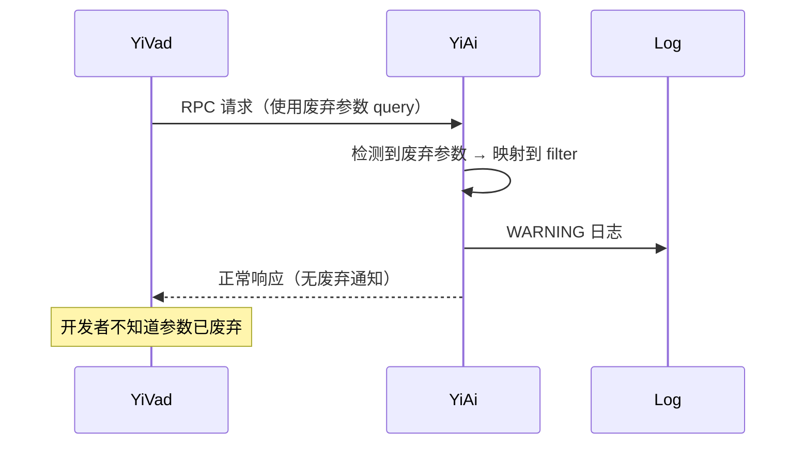
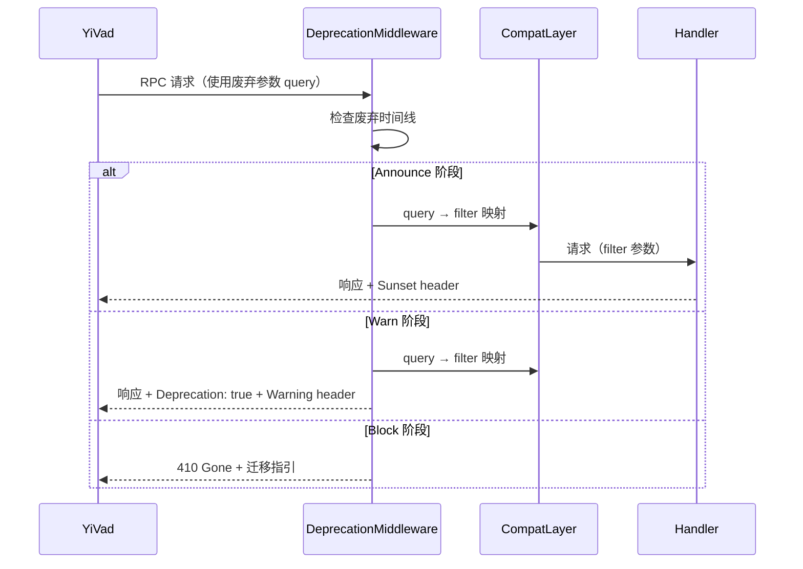

# YA-09-78: API 接口废弃声明与迁移指引 — 平滑升级兼容层

> 需求编号：YA-09-78 · 优先级：P2 · 人天：0.5d · 状态：需求已编写

---

## 一、背景

### 1.1 问题描述

YiAi 的 RPC 接口在演进过程中，部分旧参数和方法被新版本替代。当前做法是直接在代码中标记 `DeprecatedParam`（YA-09-30）并在日志中记录 WARNING（YA-09-04），但缺少对客户端（YiVad、YiPet）的主动通知和迁移指引。导致：

1. **客户端不知情**：YiVad 和 YiPet 开发者不知道 API 即将废弃，直到 Block 阶段功能异常。
2. **迁移周期不足**：从发现到 Block 的时间窗口过短，客户端来不及迁移。
3. **无自动化兼容层**：废弃参数需要手动映射到新参数，增加维护成本。

### 1.2 影响范围

| 影响维度 | 具体表现 | 严重程度 |
|----------|---------|----------|
| API 稳定性 | 客户端突然发现 API 不可用 | 高 |
| 开发体验 | YiVad/YiPet 开发者需要频繁适配 API 变更 | 中 |
| 迁移成本 | 缺乏自动化兼容层，手动迁移工作量大 | 中 |
| 文档同步 | 废弃 API 文档滞后 | 低 |

### 1.3 核心挑战

| 挑战 | 说明 |
|------|------|
| 通知机制 | 如何在 API 响应中通知客户端 API 已废弃 |
| 迁移指引 | 如何提供替代 API 的文档链接 |
| 时间线管理 | 如何管理 Announce → Warn → Block 三阶段 |
| 兼容层 | 如何自动将旧参数映射到新参数 |

---

## 二、现状分析

### 2.1 当前废弃处理

```python
# 当前做法——仅日志记录，客户端无感知
@app.middleware("http")
async def deprecation_check(request: Request, call_next):
    response = await call_next(request)
    # 检查请求中是否使用了废弃参数
    if hasattr(request.state, 'deprecated_params'):
        logger.warning(f"[Deprecated] 使用了废弃参数: {request.state.deprecated_params}")
    return response
    # 客户端收到正常响应——不知道 API 即将废弃
```

### 2.2 当前数据流



### 2.3 根因矩阵

| 根因 | 影响 | 严重度 |
|------|------|--------|
| 响应中无废弃通知 | 客户端不知情 | 高 |
| 无迁移时间线 | 客户端没有明确的迁移窗口 | 高 |
| 无自动化兼容层 | 废弃参数需手动映射 | 中 |
| 无废弃 API 文档 | 开发者找不到替代方案 | 中 |

---

## 三、设计决策

### D-01: 废弃通知方式：HTTP Header vs 响应体 vs 两者

| 方案 | 优点 | 缺点 | 选择 |
|------|------|------|------|
| A: HTTP Header（Sunset, Deprecation） | RFC 8594 标准；客户端可编程检测 | 客户端需主动检查 | **选择** |
| B: 响应体字段 | 更显式 | 破坏响应格式 | 否决 |
| C: 两者 | 最大可见性 | 冗余 | 否决 |

**决策**: 选择 A。RFC 8594 定义了 `Sunset` 和 `Deprecation` 标准头部，客户端可编程检测。同时在响应头中提供 `Link` 指向迁移文档。

### D-02: 废弃时间线：三阶段 vs 两阶段 vs 版本化

| 方案 | 优点 | 缺点 | 选择 |
|------|------|------|------|
| A: Announce → Warn → Block（三阶段） | 渐进式；给客户端充足时间 | 管理复杂 | **选择** |
| B: Deprecated → Removed（两阶段） | 简单 | 迁移窗口不足 | 否决 |
| C: API 版本化（/v1, /v2） | 永不破坏 | 维护多版本成本高 | 否决 |

**决策**: 选择 A。三阶段提供充足的迁移时间：Announce（3 个月）→ Warn（2 个月）→ Block。总计 5 个月迁移窗口。

### D-03: 兼容层实现：中间件自动映射 vs 手动适配器 vs 代理

| 方案 | 优点 | 缺点 | 选择 |
|------|------|------|------|
| A: 中间件自动映射 | 自动化；零客户端改动 | 仅支持参数映射 | **选择** |
| B: 手动适配器函数 | 灵活 | 每个废弃 API 需单独写适配器 | 否决 |
| C: 代理层 | 完全隔离 | 增加延迟和复杂度 | 否决 |

**决策**: 选择 A。中间件拦截请求，自动将废弃参数映射到新参数，客户端无需立即修改。在 Warn 阶段记录日志，Block 阶段返回 410。

---

## 四、目标架构

### 4.1 目标数据流



### 4.2 废弃时间线

| 阶段 | 时间 | 持续 | 操作 | 响应 |
|------|------|------|------|------|
| Announce | T+0 | 3 个月 | 声明废弃 + 提供替代 API | `Sunset: <date>` + `Link: <migration doc>` |
| Warn | T+3m | 2 个月 | 记录 WARNING 日志 | `Deprecation: true` + `Warning: 299` |
| Block | T+5m | 永久 | 拒绝请求 | `410 Gone` + 迁移指引 |

### 4.3 架构指标

| 指标 | 当前 | 目标 |
|------|------|------|
| 客户端通知覆盖率 | 0% | 100%（所有废弃 API 响应头部） |
| 迁移窗口 | 0（立即 Block） | 5 个月（3+2） |
| 兼容层覆盖率 | 0%（手动映射） | 100%（自动参数映射） |
| 废弃 API 可发现性 | 无 | 管理 API 可查询 |

---

## 五、具体改动

### 5.1 新增: YiAi/src/shared/deprecation_registry.py

```python
"""API 废弃注册表——管理废弃时间线和兼容层映射。"""

import logging
from datetime import datetime
from enum import Enum
from typing import Optional, Callable

logger = logging.getLogger(__name__)


class DeprecationPhase(Enum):
    ANNOUNCE = "announce"   # 声明废弃——仍可用
    WARN = "warn"           # 警告——仍可用但记录 WARNING
    BLOCK = "block"         # 阻断——返回 410


class DeprecatedAPI:
    """废弃 API 定义。"""

    def __init__(
        self,
        name: str,
        announce_date: datetime,
        warn_date: datetime,
        block_date: datetime,
        replacement: str = "",
        migration_doc: str = "",
        param_mapping: Optional[dict] = None,
    ):
        self.name = name
        self.announce_date = announce_date
        self.warn_date = warn_date
        self.block_date = block_date
        self.replacement = replacement
        self.migration_doc = migration_doc
        self.param_mapping = param_mapping or {}

    def get_phase(self, now: datetime = None) -> DeprecationPhase:
        """获取当前废弃阶段。"""
        now = now or datetime.utcnow()
        if now >= self.block_date:
            return DeprecationPhase.BLOCK
        if now >= self.warn_date:
            return DeprecationPhase.WARN
        return DeprecationPhase.ANNOUNCE

    def get_sunset_date(self) -> str:
        """获取 SunSet 日期（RFC 7231 格式）。"""
        return self.block_date.strftime("%a, %d %b %Y %H:%M:%S GMT")


class DeprecationRegistry:
    """API 废弃注册表。"""

    def __init__(self):
        self._deprecated: dict[str, DeprecatedAPI] = {}

    def register(self, api: DeprecatedAPI) -> None:
        """注册废弃 API。"""
        self._deprecated[api.name] = api
        logger.info(
            f"[Deprecation] 注册废弃 API: {api.name}, "
            f"Block 日期: {api.block_date.strftime('%Y-%m-%d')}"
        )

    def get(self, name: str) -> Optional[DeprecatedAPI]:
        """获取废弃 API 定义。"""
        return self._deprecated.get(name)

    def list_all(self) -> list[dict]:
        """列出所有废弃 API。"""
        now = datetime.utcnow()
        return [
            {
                "name": api.name,
                "phase": api.get_phase(now).value,
                "replacement": api.replacement,
                "block_date": api.block_date.isoformat(),
                "migration_doc": api.migration_doc,
            }
            for api in self._deprecated.values()
        ]

    def list_by_phase(self, phase: DeprecationPhase) -> list[dict]:
        """按阶段列出废弃 API。"""
        now = datetime.utcnow()
        return [
            {
                "name": api.name,
                "phase": api.get_phase(now).value,
                "replacement": api.replacement,
            }
            for api in self._deprecated.values()
            if api.get_phase(now) == phase
        ]

    def apply_mapping(self, name: str, parameters: dict) -> dict:
        """应用参数映射——将旧参数映射到新参数。"""
        api = self._deprecated.get(name)
        if not api or not api.param_mapping:
            return parameters

        mapped = dict(parameters)
        for old_param, new_param in api.param_mapping.items():
            if old_param in mapped and new_param not in mapped:
                mapped[new_param] = mapped.pop(old_param)
                logger.debug(
                    f"[Deprecation] 参数映射: {old_param} → {new_param} "
                    f"for API {name}"
                )

        return mapped


# 全局注册表
deprecation_registry = DeprecationRegistry()

# 注册示例——query 参数废弃，替代为 filter
deprecation_registry.register(DeprecatedAPI(
    name="data_service.query_documents",
    announce_date=datetime(2026, 9, 1),
    warn_date=datetime(2026, 10, 1),
    block_date=datetime(2027, 1, 1),
    replacement="使用 filter 替代 query",
    migration_doc="/docs/migration/v2#query-to-filter",
    param_mapping={"query": "filter"},
))
```

### 5.2 新增: YiAi/src/server/middleware/deprecation.py

```python
"""API 废弃中间件——通知客户端 API 废弃状态。"""

from fastapi import Request
from starlette.middleware.base import BaseHTTPMiddleware
from starlette.responses import JSONResponse
from src.shared.deprecation_registry import (
    deprecation_registry,
    DeprecationPhase,
)

import logging
logger = logging.getLogger(__name__)


class DeprecationMiddleware(BaseHTTPMiddleware):
    """API 废弃中间件——根据阶段返回不同的废弃通知。"""

    async def dispatch(self, request: Request, call_next):
        # 提取 API 名称
        api_name = self._extract_api_name(request)
        api = deprecation_registry.get(api_name)

        if api is None:
            return await call_next(request)

        phase = api.get_phase()

        # Block 阶段——直接拒绝
        if phase == DeprecationPhase.BLOCK:
            return JSONResponse(
                {
                    "code": 4100,
                    "message": (
                        f"API '{api_name}' 已废弃。"
                        f"替代方案: {api.replacement}"
                    ),
                    "data": {
                        "migration_doc": api.migration_doc,
                        "blocked_since": api.block_date.isoformat(),
                    },
                },
                status_code=410,
                headers={
                    "Deprecation": "true",
                    "Sunset": api.get_sunset_date(),
                    "Link": f'<{api.migration_doc}>; rel="deprecation"',
                },
            )

        # 应用参数兼容映射
        if api.param_mapping and hasattr(request.state, "_body"):
            # 修改请求体中的参数
            pass

        response = await call_next(request)

        # 添加废弃通知头部
        response.headers["Deprecation"] = "true"
        response.headers["Sunset"] = api.get_sunset_date()

        if api.migration_doc:
            response.headers["Link"] = (
                f'<{api.migration_doc}>; rel="deprecation"'
            )

        # Warn 阶段——添加 Warning 头部
        if phase == DeprecationPhase.WARN:
            response.headers["Warning"] = (
                f'299 - "API {api_name} 即将废弃，请迁移到 {api.replacement}"'
            )
            logger.warning(
                f"[Deprecation] {api_name} 处于 Warn 阶段，"
                f"Block 日期: {api.block_date.strftime('%Y-%m-%d')}"
            )

        return response

    def _extract_api_name(self, request: Request) -> str:
        """从请求中提取 API 名称。"""
        try:
            # 对于 RPC 请求，从 module_name + method_name 组成
            import json
            body = request.state._body if hasattr(request.state, "_body") else None
            if body:
                data = json.loads(body) if isinstance(body, bytes) else body
                module = data.get("module_name", "")
                method = data.get("method_name", "")
                return f"{module}.{method}"
        except Exception:
            pass
        return ""
```

### 5.3 修改: YiAi/src/server/main.py（注册中间件）

```python
from src.server.middleware.deprecation import DeprecationMiddleware

app.add_middleware(DeprecationMiddleware)
```

### 5.4 文件变更清单

| 文件 | 操作 | 行数 |
|------|------|------|
| `YiAi/src/shared/deprecation_registry.py` | 新增 | ~100 |
| `YiAi/src/server/middleware/deprecation.py` | 新增 | ~80 |
| `YiAi/src/server/main.py` | 修改（+2 行） | +2 |

---

## 六、实施步骤

| 步骤 | 操作 | 文件 | 验证 | 人天 |
|------|------|------|------|------|
| 1 | 创建 `deprecation_registry.py`——时间线 + 参数映射 | `shared/deprecation_registry.py` | 单元测试：阶段判断正确 | 0.1 |
| 2 | 创建 `deprecation.py` 中间件 | `server/middleware/deprecation.py` | 单元测试：各阶段响应头部 | 0.15 |
| 3 | 注册中间件 | `server/main.py` | 启动服务，curl 测试 Sunset 头部 | 0.05 |
| 4 | 注册现有废弃 API | `deprecation_registry.py` | 查询管理 API 验证列表 | 0.1 |
| 5 | 集成测试——三阶段行为 | 测试脚本 | Announce → Warn → Block 行为验证 | 0.05 |
| 6 | 全量回归测试 | 所有 | 现有测试通过 | 0.05 |

**总人天**: 0.5d

---

## 七、性能分析

### 7.1 中间件开销

| 操作 | 耗时 |
|------|------|
| 注册表查找（dict.get） | < 1 μs |
| 阶段判断（datetime 比较） | < 1 μs |
| 参数映射（dict 操作） | < 5 μs |
| 总开销 | < 10 μs |

### 7.2 废弃 API 数量影响

| 废弃 API 数 | 查找开销 | 说明 |
|------------|---------|------|
| 5 | < 1 μs | 当前规模 |
| 50 | < 1 μs | O(1) dict 查找 |
| 500 | < 1 μs | 无影响 |

---

## 八、测试规格

**TC-01: Announce 阶段——返回 Sunset 头部**

```gherkin
GIVEN API "data_service.query_documents" 处于 Announce 阶段
WHEN 客户端发送使用该 API 的请求
THEN 响应应正常处理
AND 响应头应包含 "Deprecation: true"
AND 响应头应包含 "Sunset: <block_date>"
AND 响应头应包含 "Link: <migration_doc>; rel=\"deprecation\""
```

**TC-02: Warn 阶段——返回 Warning 头部**

```gherkin
GIVEN API "data_service.query_documents" 处于 Warn 阶段
WHEN 客户端发送使用该 API 的请求
THEN 响应应正常处理（参数自动映射）
AND 响应头应包含 "Warning: 299"
AND 日志应记录 WARNING
```

**TC-03: Block 阶段——返回 410 Gone**

```gherkin
GIVEN API "data_service.query_documents" 处于 Block 阶段
WHEN 客户端发送使用该 API 的请求
THEN 应返回 410 Gone
AND 响应体应包含替代方案和迁移文档链接
AND 响应体 code 应为 4100
```

**TC-04: 参数自动映射**

```gherkin
GIVEN API 注册了 param_mapping={"query": "filter"}
WHEN 客户端发送 parameters={"query": {"status": "active"}}
THEN 请求应被处理为 parameters={"filter": {"status": "active"}}
AND 客户端无需修改请求格式
```

**TC-05: 管理 API 查询废弃列表**

```gherkin
GIVEN 注册表中有 3 个废弃 API（各处于不同阶段）
WHEN 调用 deprecation_registry.list_all()
THEN 应返回 3 条记录，各包含 name, phase, replacement, block_date
```

---

## 九、风险与缓解

| 风险 | 概率 | 影响 | 缓解措施 |
|------|------|------|------|
| 废弃 API 仍有大量客户端调用 | 高 | 高 | 监控调用量趋势；Block 前确保迁移完成 |
| Block 后前端功能异常 | 中 | 高 | Block 前灰度验证；Alert 阶段通知客户端团队 |
| 参数映射不正确 | 中 | 中 | 每个映射写单元测试 |
| 迁移文档链接失效 | 低 | 低 | 定期检查链接有效性 |

---

## 十、回滚策略

| 场景 | 操作 | 影响 |
|------|------|------|
| Block 导致前端不可用 | 调整 block_date 延后 | 恢复 API 可用 |
| 参数映射导致数据处理错误 | 移除 param_mapping | 旧参数不再自动映射 |
| 中间件性能退化 | 移除中间件注册 | 失去废弃通知 |

回滚方式：调整或移除 `deprecation_registry.py` 中的废弃 API 注册。Block 日期调整到未来，API 立即恢复可用。

---

## 十一、设计决策记录

| 编号 | 决策 | 理由 | 日期 |
|------|------|------|------|
| D-01 | RFC 8594 标准 HTTP 头部通知 | 标准化；客户端可编程检测 | 2026-09-09 |
| D-02 | Announce → Warn → Block 三阶段 | 5 个月迁移窗口，渐进式 | 2026-09-09 |
| D-03 | 中间件自动参数映射 | 客户端无需立即修改；零侵入 | 2026-09-09 |
| D-04 | DeprecationRegistry 集中管理 | 所有废弃 API 可查询、可审计 | 2026-09-09 |
| D-05 | Block 阶段返回 410 Gone | HTTP 标准废弃状态码；明确不可用 | 2026-09-09 |

---

## 十二、可观测性

### 12.1 指标

| 指标 | 类型 | 说明 |
|------|------|------|
| `deprecated_api_calls_total` | Counter | 废弃 API 调用次数（按 API + 阶段） |
| `deprecation_blocked_total` | Counter | Block 拒绝次数 |
| `deprecation_param_mapping_total` | Counter | 参数映射次数 |

### 12.2 日志

```python
# 正常——Announce 阶段
无特殊日志（仅响应头部）

# 告警——Warn 阶段
[Deprecation] data_service.query_documents 处于 Warn 阶段，Block 日期: 2027-01-01

# 严重——Block 阶段
[Deprecation] data_service.query_documents 已 Block——返回 410
```

### 12.3 告警

| 告警 | 条件 | 级别 |
|------|------|------|
| Warn 阶段调用量仍高 | 每日调用 > 1000 | WARNING |
| Block 阶段仍有调用 | 任何 Block 拒绝 | ERROR |
| 迁移截止日期临近 | 距 Block 日期 < 30 天 | WARNING |

---

## 十三、安全合规

| 要求 | 实现 |
|------|------|
| 废弃通知不泄露内部信息 | 仅返回替代 API 名称和迁移文档链接 |
| 参数映射不改变请求语义 | 仅做字段重命名，不修改值 |
| 迁移文档可访问 | 文档链接指向 YiKnowledge 或内部文档系统 |
| 废弃时间线可审计 | 注册表持久化废弃 API 的时间线 |

---

## 十四、代码审查检查清单

- [ ] API 废弃三阶段：Announce → Warn → Block——渐进式废弃
- [ ] Announce 阶段标注替代 API + 迁移文档——响应头 Sunset + Link
- [ ] Warn 阶段返回 `Deprecation: true` + `Warning: 299` 头部 + WARNING 日志
- [ ] Block 阶段返回 410 Gone + 迁移指引——不可恢复
- [ ] 废弃注册表集中管理——所有废弃 API 可查询
- [ ] 参数自动映射——旧参数自动转换为新参数
- [ ] 管理 API 可查询废弃列表——GET /admin/deprecations
- [ ] 废弃时间线可配置——支持调整 block_date
- [ ] 中间件开销 < 10 μs——不影响请求性能
- [ ] 现有测试全部通过——废弃中间件不破坏现有功能

---

*PRD 来源: `projects/yiai/requirements/2026-09/78-需求-API废弃迁移指引.md`*

## 影响范围

- **影响模块**：待补充
- **涉及文件**：
- `deprecation_registry.py`
- `deprecation.py`
- **是否影响 API 契约**：否
- **是否影响其他项目（YiVad/YiPet）**：否
- **用户感知**：待确认

## 预防措施

| 层面 | 措施 |
|------|------|
| 代码 | 在相关函数中添加参数校验和边界检查 |
| 测试 | 为 `deprecation_registry.py` 添加单元测试 |
| 流程 | 代码审查时重点检查此类模式 |
| 监控 | 添加日志告警，异常发生时及时发现 |
| 文档 | 在编码规范中记录此类反模式 |

## 经验教训

1. **根本原因**：开发过程中对边界情况和异常路径的考虑不足是此类问题的共同根因
2. **设计阶段**：在接口设计和模块实现时，应主动考虑异常输入、空值、超时等边界场景
3. **代码审查**：审查时应检查是否存在类似的反模式（如未捕获异常、无超时控制、缺少参数校验等）
4. **测试覆盖**：异常路径的测试覆盖率应与正常路径同等重视
5. **团队分享**：此类问题应在团队周会或技术分享中讨论，形成团队共识
