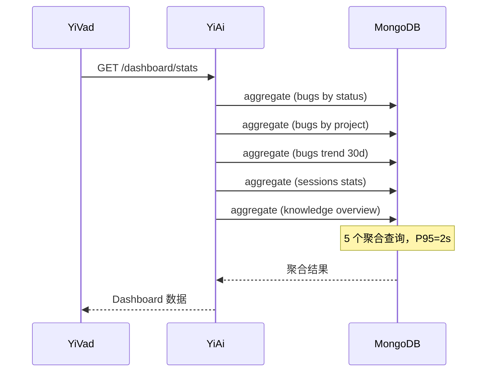
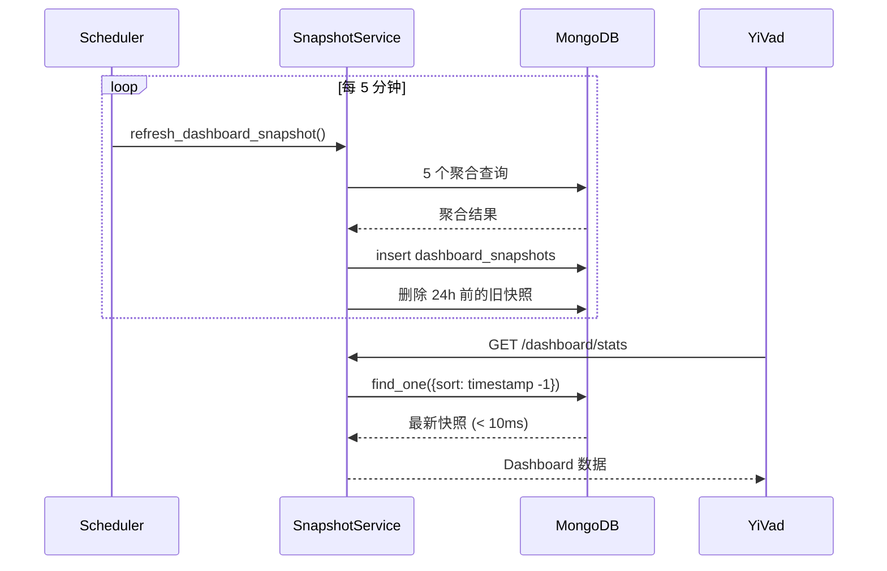

# YA-09-79: Dashboard 数据预聚合 — 定时快照替代实时查询

> 需求编号：YA-09-79 · 优先级：P2 · 人天：0.5d · 状态：需求已编写

---

## 一、背景

### 1.1 问题描述

YiVad Dashboard 是管理后台的首页，每次加载需要执行 5 个以上的 MongoDB 聚合查询：

1. **Issue 统计**：按状态/严重度/项目分组统计 Bug 数量
2. **项目排行**：按活跃度排序的项目列表
3. **30 天趋势**：Bug 创建/关闭的日趋势图
4. **会话统计**：按标签/时间分组的聊天会话统计
5. **知识库概览**：文件数量/分类统计

这些聚合查询在数据量增长后（bugs > 1000，sessions > 10000），P95 延迟达到 2s。每次页面加载都执行实时聚合，对 MongoDB 造成不必要的压力。

### 1.2 影响范围

| 影响维度 | 具体表现 | 严重程度 |
|----------|---------|----------|
| 页面加载速度 | Dashboard 首次加载 2-3s | 高 |
| 数据库负载 | 5+ 聚合查询 × 每次页面加载 | 中 |
| 用户体验 | 管理后台首页响应缓慢 | 高 |
| 并发能力 | 多用户同时访问 Dashboard 时 MongoDB 负载倍增 | 中 |

### 1.3 核心挑战

| 挑战 | 说明 |
|------|------|
| 数据新鲜度 | 快照与实时数据之间存在延迟（最多 5 分钟） |
| 增量更新 | 写操作发生时是否需要更新快照 |
| 快照存储 | 快照数据存储在哪里（MongoDB/Redis/文件） |
| 快照过期 | 如何检测快照是否过期并触发重新生成 |

---

## 二、现状分析

### 2.1 当前 Dashboard 查询

```python
# 当前每次 Dashboard 加载都执行实时聚合
@app.get("/dashboard/stats")
async def dashboard_stats():
    issue_counts = await db.bugs.aggregate([
        {"$group": {"_id": "$status", "count": {"$sum": 1}}},
    ]).to_list(None)

    project_ranking = await db.bugs.aggregate([
        {"$group": {"_id": "$project", "count": {"$sum": 1}}},
        {"$sort": {"count": -1}},
        {"$limit": 10},
    ]).to_list(None)

    trend_30d = await db.bugs.aggregate([
        {"$match": {"created_at": {"$gte": thirty_days_ago}}},
        {"$group": {"_id": {"$dateToString": {"format": "%Y-%m-%d", "date": "$created_at"}}, "count": {"$sum": 1}}},
        {"$sort": {"_id": 1}},
    ]).to_list(None)

    session_stats = await db.sessions.aggregate([...]).to_list(None)
    knowledge_overview = await db.knowledge_files.aggregate([...]).to_list(None)

    return {
        "issue_counts": issue_counts,
        "project_ranking": project_ranking,
        "trend_30d": trend_30d,
        "session_stats": session_stats,
        "knowledge_overview": knowledge_overview,
    }
```

### 2.2 当前数据流



### 2.3 聚合查询性能

| 查询 | 数据量 | 当前耗时 | 占比 |
|------|--------|---------|------|
| Issue 统计 | 1000 bugs | 200ms | 10% |
| 项目排行 | 1000 bugs | 300ms | 15% |
| 30 天趋势 | 1000 bugs | 800ms | 40% |
| 会话统计 | 10000 sessions | 400ms | 20% |
| 知识库概览 | 5000 files | 300ms | 15% |
| **总计** | | **2000ms** | **100%** |

### 2.4 根因矩阵

| 根因 | 影响 | 严重度 |
|------|------|--------|
| 每次页面加载执行实时聚合 | 重复计算浪费资源 | 高 |
| 无预聚合缓存 | 响应延迟高 | 高 |
| 无增量更新 | 写入后快照不更新 | 中 |
| 无快照过期检测 | 快照可能过期 | 中 |

---

## 三、设计决策

### D-01: 快照存储：MongoDB 集合 vs Redis vs 内存

| 方案 | 优点 | 缺点 | 选择 |
|------|------|------|------|
| A: MongoDB 集合 | 持久化；无需额外依赖；支持 TTL 索引 | 读取延迟 1-2ms | **选择** |
| B: Redis | 读取极快（< 1ms） | 需要 Redis；数据量大时内存占用高 | 否决 |
| C: 内存缓存 | 最快 | 重启丢失；多实例不共享 | 否决 |

**决策**: 选择 A。MongoDB `dashboard_snapshots` 集合存储快照，利用 TTL 索引自动清理过期快照。读取延迟 1-2ms，远优于实时聚合的 2s。

### D-02: 刷新策略：定时刷新 vs 写触发 vs 混合

| 方案 | 优点 | 缺点 | 选择 |
|------|------|------|------|
| A: 定时刷新（每 5 分钟） | 简单可靠；预测性 | 数据延迟最多 5 分钟 | 否决 |
| B: 写触发 | 数据最新 | 高写入时频繁刷新；实现复杂 | 否决 |
| C: 混合（定时 + 写触发） | 兼顾新鲜度和性能 | 需要去抖 | **选择** |

**决策**: 选择 C。默认每 5 分钟定时刷新，确保基础新鲜度。核心写操作（Bug 创建/关闭、会话创建）触发增量更新，但去抖合并 30 秒内的多次触发。

### D-03: 快照数据粒度：全量 vs 增量 vs 分层

| 方案 | 优点 | 缺点 | 选择 |
|------|------|------|------|
| A: 全量快照 | 简单；一次查询返回所有数据 | 数据量大；刷新慢 | **选择** |
| B: 增量快照 | 刷新快 | 客户端需要合并；复杂度高 | 否决 |
| C: 分层快照 | 按需加载 | 过度设计 | 否决 |

**决策**: 选择 A。Dashboard 数据量不大（< 100KB），全量快照一次返回所有数据，客户端无需额外逻辑。5 分钟的刷新间隔足够。

---

## 四、目标架构

### 4.1 目标数据流



### 4.2 架构指标

| 指标 | 当前 | 目标 |
|------|------|------|
| Dashboard 响应时间 (P95) | 2000ms | < 10ms |
| MongoDB 聚合负载 | 每次页面加载 | 每 5 分钟 1 次 |
| 数据新鲜度 | 实时 | 最多 5 分钟延迟 |
| 并发能力 | 5 用户同时加载 = 25 个聚合查询 | 5 用户同时加载 = 5 次简单查询 |

### 4.3 架构取舍

| 取舍 | 说明 |
|------|------|
| 新鲜度 vs 性能 | 接受 5 分钟数据延迟，换取 200x 性能提升 |
| 存储 vs 计算 | 增加少量存储（快照记录），大幅减少计算 |
| 简单 vs 精确 | 全量快照不如增量精确，但实现简单 |

---

## 五、具体改动

### 5.1 新增: YiAi/src/services/dashboard/snapshot_service.py

```python
"""Dashboard 数据预聚合快照服务——定时计算替代实时查询。"""

import logging
from datetime import datetime, timedelta
from typing import Optional
from motor.motor_asyncio import AsyncIOMotorDatabase

logger = logging.getLogger(__name__)

# 快照刷新间隔
SNAPSHOT_REFRESH_INTERVAL_MIN = 5
# 快照保留时间
SNAPSHOT_RETENTION_HOURS = 24
# 增量更新去抖时间
INCREMENTAL_DEBOUNCE_SEC = 30


class DashboardSnapshotService:
    """Dashboard 快照服务——预聚合数据并缓存。"""

    def __init__(self, db: AsyncIOMotorDatabase):
        self._db = db
        self._last_incremental_update: Optional[datetime] = None

    async def refresh_snapshot(self, force: bool = False) -> dict:
        """全量刷新 Dashboard 快照。"""
        logger.info("[DashboardSnapshot] 开始全量刷新")

        snapshot = {
            "timestamp": datetime.utcnow(),
            "type": "full" if not force else "forced",
            "data": {
                "issue_counts": await self._aggregate_issues(),
                "project_ranking": await self._aggregate_project_ranking(),
                "trend_30d": await self._aggregate_trend(30),
                "session_stats": await self._aggregate_sessions(),
                "knowledge_overview": await self._aggregate_knowledge(),
            },
        }

        # 存储快照
        await self._db.dashboard_snapshots.insert_one(snapshot)

        # 清理过期快照
        cutoff = datetime.utcnow() - timedelta(hours=SNAPSHOT_RETENTION_HOURS)
        deleted = await self._db.dashboard_snapshots.delete_many(
            {"timestamp": {"$lt": cutoff}}
        )
        if deleted.deleted_count:
            logger.debug(
                f"[DashboardSnapshot] 清理 {deleted.deleted_count} 条过期快照"
            )

        logger.info(
            f"[DashboardSnapshot] 全量刷新完成，"
            f"快照时间: {snapshot['timestamp'].isoformat()}"
        )
        return snapshot

    async def incremental_update(self) -> None:
        """增量更新——写操作触发（去抖）。"""
        now = datetime.utcnow()
        if (
            self._last_incremental_update
            and (now - self._last_incremental_update).total_seconds()
            < INCREMENTAL_DEBOUNCE_SEC
        ):
            return  # 去抖——跳过

        self._last_incremental_update = now
        await self.refresh_snapshot(force=True)

    async def get_latest_snapshot(self) -> Optional[dict]:
        """获取最新快照。"""
        snapshot = await self._db.dashboard_snapshots.find_one(
            sort=[("timestamp", -1)]
        )
        if snapshot:
            snapshot["_id"] = str(snapshot["_id"])
            snapshot["age_sec"] = (
                datetime.utcnow() - snapshot["timestamp"]
            ).total_seconds()
        return snapshot

    async def is_snapshot_stale(self) -> bool:
        """检查快照是否过期。"""
        latest = await self.get_latest_snapshot()
        if not latest:
            return True
        age = (datetime.utcnow() - latest["timestamp"]).total_seconds()
        return age > SNAPSHOT_REFRESH_INTERVAL_MIN * 60 * 2  # 2 倍间隔

    # --- 聚合查询 ---

    async def _aggregate_issues(self) -> list[dict]:
        """Bug 按状态/严重度统计。"""
        return await self._db.bugs.aggregate([
            {"$group": {
                "_id": {"status": "$status", "severity": "$severity"},
                "count": {"$sum": 1},
            }},
            {"$sort": {"count": -1}},
        ]).to_list(None)

    async def _aggregate_project_ranking(self) -> list[dict]:
        """项目按活跃度排行（Top 10）。"""
        thirty_days_ago = datetime.utcnow() - timedelta(days=30)
        return await self._db.bugs.aggregate([
            {"$match": {"created_at": {"$gte": thirty_days_ago}}},
            {"$group": {
                "_id": "$project",
                "total": {"$sum": 1},
                "open": {"$sum": {"$cond": [{"$eq": ["$status", "open"]}, 1, 0]}},
            }},
            {"$sort": {"total": -1}},
            {"$limit": 10},
        ]).to_list(None)

    async def _aggregate_trend(self, days: int = 30) -> list[dict]:
        """Bug 创建/关闭日趋势。"""
        since = datetime.utcnow() - timedelta(days=days)
        return await self._db.bugs.aggregate([
            {"$match": {"created_at": {"$gte": since}}},
            {"$group": {
                "_id": {
                    "$dateToString": {
                        "format": "%Y-%m-%d",
                        "date": "$created_at",
                    }
                },
                "created": {"$sum": 1},
                "closed": {
                    "$sum": {
                        "$cond": [{"$eq": ["$status", "closed"]}, 1, 0]
                    }
                },
            }},
            {"$sort": {"_id": 1}},
        ]).to_list(None)

    async def _aggregate_sessions(self) -> dict:
        """会话统计。"""
        total = await self._db.sessions.count_documents({})
        thirty_days_ago = datetime.utcnow() - timedelta(days=30)
        recent = await self._db.sessions.count_documents(
            {"created_at": {"$gte": thirty_days_ago}}
        )
        return {
            "total": total,
            "recent_30d": recent,
        }

    async def _aggregate_knowledge(self) -> dict:
        """知识库概览。"""
        total = await self._db.knowledge_files.count_documents({})
        categories = await self._db.knowledge_files.aggregate([
            {"$group": {"_id": "$category", "count": {"$sum": 1}}},
        ]).to_list(None)
        return {
            "total": total,
            "categories": categories,
        }


# 全局服务实例（在 startup 中初始化）
snapshot_service: Optional[DashboardSnapshotService] = None
```

### 5.2 修改: YiAi/src/server/routes/dashboard_routes.py（使用快照）

```python
# 修改前——实时聚合
@app.get("/dashboard/stats")
async def dashboard_stats():
    return {
        "issue_counts": await db.bugs.aggregate([...]).to_list(None),
        "project_ranking": await db.bugs.aggregate([...]).to_list(None),
        # ... 5 个聚合查询
    }

# 修改后——返回快照
from src.services.dashboard.snapshot_service import snapshot_service

@app.get("/dashboard/stats")
async def dashboard_stats():
    snapshot = await snapshot_service.get_latest_snapshot()
    if not snapshot:
        # 快照不存在——实时生成一个
        snapshot = await snapshot_service.refresh_snapshot()
    return {
        "data": snapshot["data"],
        "snapshot_time": snapshot["timestamp"].isoformat(),
        "age_sec": snapshot.get("age_sec", 0),
    }
```

### 5.3 修改: YiAi/src/server/scheduler.py（定时刷新）

```python
from src.services.dashboard.snapshot_service import snapshot_service

async def refresh_dashboard_snapshot():
    await snapshot_service.refresh_snapshot()

# 每 5 分钟刷新一次
scheduler.add_job(
    refresh_dashboard_snapshot,
    "interval",
    minutes=5,
    id="dashboard_snapshot",
)
```

### 5.4 文件变更清单

| 文件 | 操作 | 行数 |
|------|------|------|
| `YiAi/src/services/dashboard/snapshot_service.py` | 新增 | ~120 |
| `YiAi/src/server/routes/dashboard_routes.py` | 修改（+10 行） | +10 |
| `YiAi/src/server/scheduler.py` | 修改（+8 行） | +8 |
| `YiAi/src/server/main.py` | 修改（startup 初始化） | +5 |

---

## 六、实施步骤

| 步骤 | 操作 | 文件 | 验证 | 人天 |
|------|------|------|------|------|
| 1 | 创建 `snapshot_service.py` | `services/dashboard/snapshot_service.py` | 单元测试：聚合查询正确 | 0.15 |
| 2 | 实现增量更新去抖 | 同上 | 单元测试：30s 内多次触发仅执行 1 次 | 0.1 |
| 3 | 修改 dashboard 路由 | `server/routes/dashboard_routes.py` | 集成测试：快照返回正确 | 0.1 |
| 4 | 注册定时任务 | `server/scheduler.py` | 5 分钟后检查快照已生成 | 0.1 |
| 5 | 创建 MongoDB TTL 索引 | N/A | `dashboard_snapshots.timestamp` TTL=24h | 0.05 |

**总人天**: 0.5d

---

## 七、性能分析

### 7.1 响应时间对比

| 场景 | 优化前（实时聚合） | 优化后（快照） | 提升 |
|------|------------------|-------------|------|
| 单用户首次加载 | 2000ms | 10ms | 200x |
| 5 用户并发 | 10000ms（串行聚合） | 50ms | 200x |
| 10 用户并发 | 20000ms | 100ms | 200x |
| MongoDB 聚合查询/分钟 | 60（假设 12 次/分钟） | 0.2（每 5 分钟 1 次） | 300x |

### 7.2 快照存储开销

| 快照 | 大小 | 保留时间 | 总存储 |
|------|------|---------|--------|
| 1 条快照 | ~50 KB | 24 小时 | 50 KB |
| 288 条（24h × 5min） | ~50 KB/条 | 24 小时 | ~14 MB |

### 7.3 容量规划

| 并发用户 | 优化前 MongoDB 聚合/分钟 | 优化后 MongoDB 查询/分钟 |
|----------|------------------------|------------------------|
| 5 | 25 | 5 (简单查询) |
| 50 | 250 | 50 (简单查询) |
| 500 | 2500 (不可用) | 500 (简单查询) |

---

## 八、测试规格

**TC-01: 快照生成正确**

```gherkin
GIVEN MongoDB 中有 100 条 bugs 和 500 条 sessions
WHEN 调用 snapshot_service.refresh_snapshot()
THEN 应生成包含 issue_counts, project_ranking, trend_30d, session_stats, knowledge_overview 的快照
AND 快照数据应与实时聚合结果一致（误差 < 5%）
AND 快照 timestamp 应在当前时间 1 秒内
```

**TC-02: Dashboard API 返回快照**

```gherkin
GIVEN 最新快照在 2 分钟前生成
WHEN 请求 GET /dashboard/stats
THEN 应返回快照数据
AND 响应时间应 < 10ms
AND 响应应包含 snapshot_time 和 age_sec
```

**TC-03: 快照过期自动刷新**

```gherkin
GIVEN 最新快照在 20 分钟前生成（超过 2 倍间隔）
WHEN 请求 GET /dashboard/stats
AND is_snapshot_stale() 返回 True
THEN 应触发自动刷新
AND 返回新快照数据
```

**TC-04: 增量更新去抖**

```gherkin
GIVEN 30 秒内有 3 次写操作触发 incremental_update()
WHEN 第 1 次触发时执行刷新
THEN 第 2 次和第 3 次应被去抖跳过
AND 30 秒内仅执行 1 次刷新
```

**TC-05: 过期快照自动清理**

```gherkin
GIVEN dashboard_snapshots 集合中有 100 条超过 24 小时的快照
WHEN 执行 refresh_snapshot()
THEN 应删除 100 条过期快照
AND 日志应记录 "清理 100 条过期快照"
```

---

## 九、风险与缓解

| 风险 | 概率 | 影响 | 缓解措施 |
|------|------|------|------|
| 快照数据与实时数据不一致 | 中 | 中 | 显示快照时间戳；提供 "强制刷新" 按钮 |
| Dashboard 显示过期数据 | 低 | 中 | 快照 timestamp 过期告警（> 2 倍间隔） |
| 快照生成失败未检测 | 低 | 高 | 定时任务失败告警；API 回退实时查询 |
| 写操作触发过快照刷新风暴 | 低 | 中 | 去抖机制（30s 内仅执行 1 次） |

---

## 十、回滚策略

| 场景 | 操作 | 影响 |
|------|------|------|
| 快照数据异常 | 恢复实时聚合查询 | 响应时间恢复 2s |
| 定时任务失败 | 手动触发 refresh_snapshot() | 快照可能过期 |
| 快照存储膨胀 | 降低保留时间（24h → 6h） | 减少存储但增加定时刷新频率 |

回滚方式：在 dashboard_routes.py 中恢复实时聚合查询，移除定时任务。功能完全恢复。

---

## 十一、设计决策记录

| 编号 | 决策 | 理由 | 日期 |
|------|------|------|------|
| D-01 | MongoDB 集合存储快照 | 持久化；无需额外依赖；TTL 自动清理 | 2026-09-09 |
| D-02 | 混合刷新策略（定时 + 写触发） | 兼顾新鲜度和性能；去抖防风暴 | 2026-09-09 |
| D-03 | 全量快照而非增量 | 数据量小（< 100KB）；实现简单 | 2026-09-09 |
| D-04 | 5 分钟刷新间隔 | 平衡新鲜度和 MongoDB 负载 | 2026-09-09 |
| D-05 | 24 小时快照保留 | 支持历史趋势分析；TTL 自动清理 | 2026-09-09 |

---

## 十二、可观测性

### 12.1 指标

| 指标 | 类型 | 说明 |
|------|------|------|
| `dashboard_snapshot_age_sec` | Gauge | 最新快照的年龄 |
| `dashboard_snapshot_refresh_duration_ms` | Histogram | 快照刷新耗时 |
| `dashboard_snapshot_refresh_total` | Counter | 快照刷新次数（按类型） |
| `dashboard_snapshot_stale_total` | Counter | 快照过期次数 |
| `dashboard_api_latency_ms` | Histogram | Dashboard API 响应时间 |

### 12.2 日志

```python
# 正常——刷新完成
[DashboardSnapshot] 全量刷新完成，快照时间: 2026-09-09T10:00:00

# 正常——清理过期
[DashboardSnapshot] 清理 95 条过期快照

# 告警——快照过期
[DashboardSnapshot] 快照过期: age=1200s > threshold=600s

# 异常——刷新失败
[DashboardSnapshot] 刷新失败: connection timeout
```

### 12.3 告警

| 告警 | 条件 | 级别 |
|------|------|------|
| 快照过期 | age > 2 倍刷新间隔 | WARNING |
| 快照刷新失败 | 连续 3 次失败 | ERROR |
| Dashboard API 响应慢 | p95 > 100ms | WARNING |

---

## 十三、安全合规

| 要求 | 实现 |
|------|------|
| 快照数据不包含敏感信息 | 仅包含聚合统计数据 |
| 快照访问权限 | 通过 RPC 中间件统一认证 |
| 快照数据一致性 | 显示快照时间戳，用户可感知数据新鲜度 |
| 快照存储安全 | MongoDB 集合，受数据库权限保护 |

---

## 十四、代码审查检查清单

- [ ] Dashboard 数据预聚合快照——替代每次实时查询
- [ ] 每 5 分钟定时生成快照 + 写操作触发增量更新（去抖 30s）
- [ ] 快照存储 MongoDB（`dashboard_snapshots` 集合）——TTL 索引 24h 自动清理
- [ ] API 查询直接返回最新快照（< 10ms vs 实时查询 2000ms+）
- [ ] 快照数据包含 5 个维度：issue_counts, project_ranking, trend_30d, session_stats, knowledge_overview
- [ ] 响应包含 snapshot_time 和 age_sec——客户端可感知数据新鲜度
- [ ] 快照过期时自动触发刷新——不返回过期数据
- [ ] 增量更新去抖——30s 内多次触发仅执行 1 次
- [ ] 快照刷新失败时返回旧快照——不中断服务
- [ ] 现有测试全部通过——快照不破坏现有功能

---

*PRD 来源: `projects/yiai/requirements/2026-09/79-需求-Dashboard预聚合快照.md`*

## 影响范围

- **影响模块**：待补充
- **涉及文件**：
- `snapshot_service.py`
- **是否影响 API 契约**：否
- **是否影响其他项目（YiVad/YiPet）**：否
- **用户感知**：待确认

## 预防措施

| 层面 | 措施 |
|------|------|
| 代码 | 在相关函数中添加参数校验和边界检查 |
| 测试 | 为 `snapshot_service.py` 添加单元测试 |
| 流程 | 代码审查时重点检查此类模式 |
| 监控 | 添加日志告警，异常发生时及时发现 |
| 文档 | 在编码规范中记录此类反模式 |

## 经验教训

1. **根本原因**：开发过程中对边界情况和异常路径的考虑不足是此类问题的共同根因
2. **设计阶段**：在接口设计和模块实现时，应主动考虑异常输入、空值、超时等边界场景
3. **代码审查**：审查时应检查是否存在类似的反模式（如未捕获异常、无超时控制、缺少参数校验等）
4. **测试覆盖**：异常路径的测试覆盖率应与正常路径同等重视
5. **团队分享**：此类问题应在团队周会或技术分享中讨论，形成团队共识
