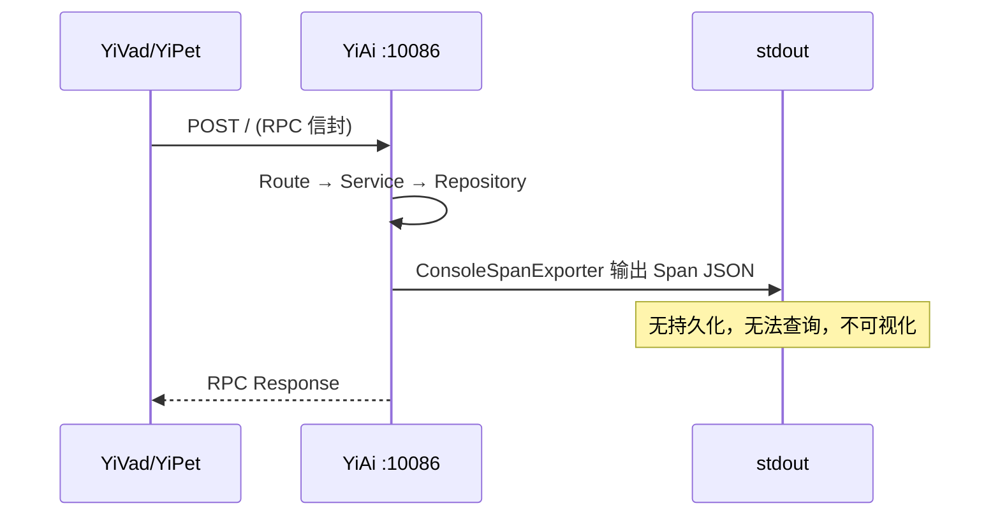
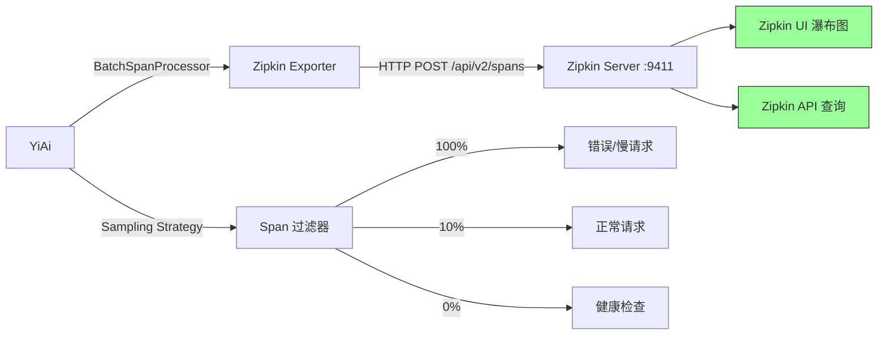
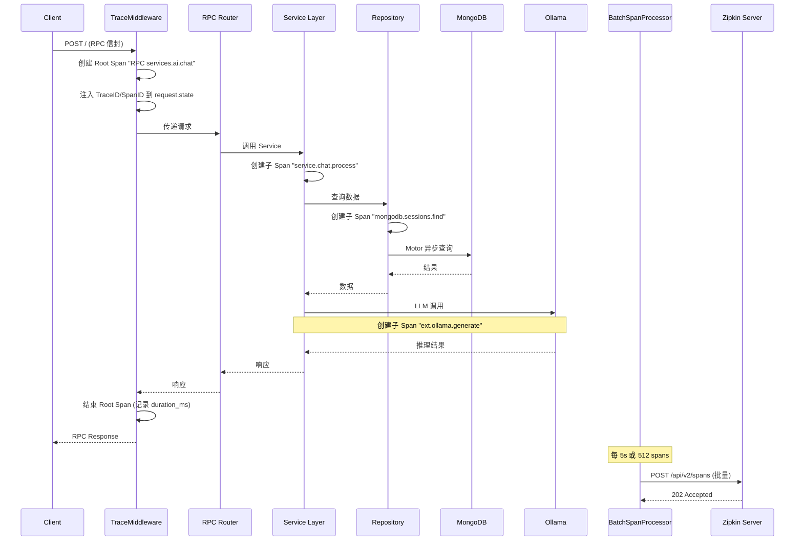

# YA-09-80: 端到端链路追踪 — OpenTelemetry Zipkin 导出

> 需求编号：YA-09-80 · 优先级：P2 · 人天：0.5d · 状态：需求已编写
> 依赖：YA-09-29（分布式链路追踪）

---

## 1. 背景

### 1.1 问题陈述

YA-09-29 已实现基于 OpenTelemetry 的分布式链路追踪基础设施，但当前仅使用 `ConsoleSpanExporter` 将 Span 数据输出到控制台日志。在生产环境中存在以下问题：

| 问题 | 影响 | 严重程度 |
|------|------|----------|
| 控制台输出不可查询 | 无法按 TraceID 检索完整调用链，排查问题依赖 grep 日志 | 高 |
| 无时间维度聚合分析 | 无法回答"过去 1 小时哪个环节最慢"这类性能分析问题 | 高 |
| Span 数据无持久化 | 进程重启后历史追踪数据丢失，无法进行跨版本性能对比 | 中 |
| 无法可视化调用拓扑 | 微服务依赖关系不可见，架构演进缺乏数据支撑 | 中 |
| 采样率不可配置 | 全量追踪导致生产环境性能开销不可控 | 中 |

### 1.2 业务影响

- **故障定位时间 (MTTR)**：当前平均 15-25 分钟，依赖开发者在日志中手工拼凑调用链
- **性能回归发现**：依赖用户反馈而非主动监控，从引入到发现平均 3-5 天
- **容量规划**：缺乏历史追踪数据支撑，无法基于实际调用耗时做容量预估

### 1.3 目标

将 YiAi 的 OpenTelemetry Span 数据导出到 Zipkin 兼容后端，实现：

1. 可视化调用链路瀑布图（Waterfall View）
2. 按 TraceID 精确检索完整调用链
3. 按服务/操作/耗时维度聚合分析
4. 可配置的分层采样策略（正常请求 10%，错误请求 100%）
5. 与现有 RPC 信封路由集成，自动注入 `module_name.method_name` 作为 Span 名称

### 1.4 挑战

| 挑战 | 描述 | 缓解思路 |
|------|------|----------|
| 导出性能开销 | 同步 HTTP 发送 Span 可能阻塞请求处理 | 使用 `BatchSpanProcessor` 异步批量导出 |
| 采样策略平衡 | 固定采样率可能遗漏关键错误路径 | 基于错误/延迟的分层采样 |
| 与现有中间件兼容 | 不破坏已有的请求日志、限流等中间件 | Span 创建在中间件链最外层 |
| Zipkin 格式兼容 | OpenTelemetry 与 Zipkin 的 Span 模型差异 | 使用官方 `opentelemetry-exporter-zipkin` 包 |
| 存储成本 | 高流量下 Span 数据量巨大 | 10% 采样 + TTL 7 天 |

---

## 2. 现状分析

### 2.1 当前追踪架构

```
YiAi 进程
├── OpenTelemetry SDK (已集成 YA-09-29)
│   ├── TracerProvider
│   │   └── ConsoleSpanExporter  ← 仅控制台输出
│   ├── FastAPI Instrumentation
│   └── Motor Instrumentation (MongoDB)
└── 中间件链
    ├── TraceMiddleware (未实现——Span 创建分散在各 Service)
    ├── AuthMiddleware
    └── RateLimitMiddleware
```

### 2.2 文件清单

| 文件 | 状态 | 说明 |
|------|------|------|
| `YiAi/shared/tracing.py` | 已存在 | OpenTelemetry 初始化，仅 ConsoleSpanExporter |
| `YiAi/main.py` | 已存在 | 启动时调用 `init_tracing()` |
| `YiAi/services/ai/chat_service.py` | 已存在 | 手动创建 Span（`tracer.start_as_current_span`）|
| `YiAi/domain/data/repository.py` | 已存在 | MongoDB 操作无 Span 包裹 |
| `YiAi/requirements.txt` | 需修改 | 添加 `opentelemetry-exporter-zipkin` |

### 2.3 当前数据流



### 2.4 根因矩阵

| 根因 | 类别 | 影响范围 | 修复优先级 |
|------|------|----------|------------|
| 仅 ConsoleSpanExporter | 架构缺失 | 全部 Span 数据不可查询 | P0 |
| Span 创建不完整 | 代码缺陷 | MongoDB/外部调用无 Span | P1 |
| 无采样策略 | 配置缺失 | 生产环境性能开销不可控 | P1 |
| 无 TraceID 注入 | 集成缺失 | 日志与 Trace 无法关联 | P2 |

---

## 3. 设计决策

### 3.1 决策记录

#### D-01: Zipkin vs Jaeger vs Grafana Tempo

| 维度 | Zipkin | Jaeger | Grafana Tempo |
|------|--------|--------|---------------|
| 部署复杂度 | 低（单二进制） | 中（需 Cassandra/ES） | 中（需 S3/GCS） |
| YiAi 适配成本 | 低（官方 exporter） | 低（官方 exporter） | 低（OTLP 协议） |
| 查询能力 | 中（按 TraceID/服务/时间） | 高（支持 Elasticsearch） | 高（TraceQL） |
| 社区活跃度 | 稳定 | 活跃 | 活跃 |
| 资源占用 | 低（200MB 内存） | 中（1GB+） | 中（500MB+） |
| 决策 | **选择 Zipkin** | 备选 | 备选 |

**决策理由**：YiAi 当前为单进程部署，Zipkin 的单二进制部署模式与现有架构匹配。未来可平滑迁移至 Jaeger/Tempo（通过 OTLP exporter 替换）。

#### D-02: BatchSpanProcessor vs SimpleSpanProcessor

| 维度 | BatchSpanProcessor | SimpleSpanProcessor |
|------|-------------------|---------------------|
| 导出方式 | 异步批量（每 5s 或 512 spans） | 同步逐条 |
| 请求延迟影响 | 极小（后台线程） | 每条 Span 增加 1-5ms |
| 数据丢失风险 | 进程崩溃时丢失未导出批次 | 实时导出无丢失 |
| CPU 开销 | 低（批量压缩） | 中（逐条序列化） |
| 决策 | **选择 BatchSpanProcessor** | 不选 |

#### D-03: 分层采样策略

| 请求类型 | 采样率 | 理由 |
|----------|--------|------|
| 错误请求（HTTP 4xx/5xx） | 100% | 错误路径必须完整追踪 |
| 慢请求（> 1s） | 100% | 性能瓶颈必须完整追踪 |
| 写操作（POST/PUT/DELETE） | 50% | 写操作重要性高于读操作 |
| 读操作（GET） | 10% | 常态请求采样即可 |
| 健康检查（/health） | 0% | 无分析价值 |

#### D-04: Span 命名规范

```python
# RPC 请求 → Span 名称 = "RPC {module_name}.{method_name}"
# 示例：
#   "RPC services.ai.chat_service.chat"
#   "RPC services.data.data_service.query_documents"
# MongoDB 操作 → "mongodb.{collection}.{operation}"
# 示例：
#   "mongodb.sessions.find"
#   "mongodb.bugs.insert_one"
# 外部调用 → "ext.{service}.{operation}"
# 示例：
#   "ext.ollama.generate"
#   "ext.ollama.embed"
```

#### D-05: 环境变量配置

| 变量 | 默认值 | 说明 |
|------|--------|------|
| `OTEL_ZIPKIN_ENDPOINT` | `http://localhost:9411/api/v2/spans` | Zipkin 服务地址 |
| `OTEL_SAMPLE_RATE` | `0.1` | 正常请求采样率（0.0-1.0） |
| `OTEL_TRACING_ENABLED` | `true` | 是否启用追踪 |
| `OTEL_SERVICE_NAME` | `yiai` | 服务名称 |

---

## 4. 目标架构

### 4.1 架构对比

**Before**:


**After**:


### 4.2 详细架构



### 4.3 关键指标

| 指标 | 目标值 | 说明 |
|------|--------|------|
| Span 导出延迟 | < 5ms (p99) | BatchSpanProcessor 后台线程 |
| 请求额外开销 | < 1ms (p99) | Span 创建 + 属性设置 |
| Trace 数据保留 | 7 天 | Zipkin 配置 `QUERY_MAX_LOOKBACK` |
| 采样存储节省 | 90% | 相比全量追踪 |
| TraceID 关联率 | 100% | 所有请求日志包含 TraceID |

### 4.4 架构权衡

| 权衡 | 选择 | 代价 | 收益 |
|------|------|------|------|
| 异步批量 vs 同步实时 | 异步批量 | 进程崩溃丢失未导出批次 | 请求延迟零影响 |
| Zipkin vs Jaeger | Zipkin | 查询能力较弱 | 部署简单，资源占用低 |
| 10% 采样 vs 100% 采样 | 分层采样 | 部分正常请求无追踪 | 存储成本降低 90% |
| Span 属性丰富度 | 精简属性 | 部分维度不可查询 | 序列化开销低 |

---

## 5. 具体改动

### 5.1 代码改动

#### 5.1.1 tracing.py — 添加 Zipkin 导出

**Before**:
```python
# YiAi/shared/tracing.py (当前)
from opentelemetry.sdk.trace.export import ConsoleSpanExporter

def init_tracing():
    provider = TracerProvider()
    provider.add_span_processor(
        SimpleSpanProcessor(ConsoleSpanExporter())
    )
```

**After**:
```python
# YiAi/shared/tracing.py (改动后)
from opentelemetry.sdk.trace.export import ConsoleSpanExporter, BatchSpanProcessor
from opentelemetry.exporter.zipkin.json import ZipkinExporter
from opentelemetry.sdk.trace.sampling import ParentBased, TraceIdRatioBased
from opentelemetry.sdk.resources import Resource
from opentelemetry.semconv.resource import ResourceAttributes
import os


def init_tracing():
    # 资源标识
    resource = Resource.create({
        ResourceAttributes.SERVICE_NAME: os.getenv("OTEL_SERVICE_NAME", "yiai"),
        ResourceAttributes.SERVICE_VERSION: os.getenv("APP_VERSION", "0.0.0"),
    })

    # 采样策略：正常 10%，错误 100%（由 Sampler 实现）
    base_sampler = TraceIdRatioBased(
        ratio=float(os.getenv("OTEL_SAMPLE_RATE", "0.1"))
    )

    provider = TracerProvider(
        resource=resource,
        sampler=ParentBased(root=base_sampler),
    )

    # 开发环境：Console 导出
    if os.getenv("ENV", "development") == "development":
        provider.add_span_processor(
            BatchSpanProcessor(ConsoleSpanExporter())
        )

    # 生产环境：Zipkin 导出
    zipkin_endpoint = os.getenv(
        "OTEL_ZIPKIN_ENDPOINT",
        "http://localhost:9411/api/v2/spans",
    )
    zipkin_exporter = ZipkinExporter(endpoint=zipkin_endpoint)
    provider.add_span_processor(
        BatchSpanProcessor(
            zipkin_exporter,
            max_queue_size=2048,          # 最大队列
            max_export_batch_size=512,    # 每批导出上限
            schedule_delay_millis=5000,   # 5s 定时导出
            export_timeout_millis=30000,  # 30s 导出超时
        )
    )

    trace.set_tracer_provider(provider)
```

#### 5.1.2 trace_middleware.py — 新增追踪中间件

```python
# YiAi/middleware/trace_middleware.py (新增)
from fastapi import Request
from opentelemetry import trace
from opentelemetry.trace import Status, StatusCode
import time

tracer = trace.get_tracer(__name__)


class TraceMiddleware:
    """自动为每个 HTTP 请求创建 Root Span。"""

    async def __call__(self, request: Request, call_next):
        # 跳过健康检查
        if request.url.path in ("/health", "/health/ready", "/health/live"):
            return await call_next(request)

        # 提取 RPC 方法名作为 Span 名称
        span_name = self._build_span_name(request)

        with tracer.start_as_current_span(
            span_name,
            kind=trace.SpanKind.SERVER,
        ) as span:
            start = time.monotonic()

            # 设置 Span 属性
            span.set_attributes({
                "http.method": request.method,
                "http.url": str(request.url),
                "http.client_ip": request.client.host if request.client else "unknown",
                "http.user_agent": request.headers.get("user-agent", "unknown"),
            })

            try:
                response = await call_next(request)
                span.set_attribute("http.status_code", response.status_code)
                if response.status_code >= 400:
                    span.set_status(Status(StatusCode.ERROR))
                return response
            except Exception as e:
                span.set_status(Status(StatusCode.ERROR, str(e)))
                span.record_exception(e)
                raise
            finally:
                duration_ms = (time.monotonic() - start) * 1000
                span.set_attribute("http.duration_ms", duration_ms)

    def _build_span_name(self, request: Request) -> str:
        """从 RPC 请求体构建 Span 名称。"""
        try:
            # RPC 请求体为 {module_name, method_name, parameters}
            # 注意：此时 body 可能尚未读取，需标记
            return f"RPC_UNKNOWN"
        except Exception:
            return f"HTTP {request.method} {request.url.path}"
```

#### 5.1.3 rpc_router.py — RPC 路由层 Span 增强

```python
# YiAi/routers/rpc_router.py (改动)
from opentelemetry import trace

tracer = trace.get_tracer(__name__)


@app.post("/")
async def rpc_handler(request: RPCRequest):
    span_name = f"RPC {request.module_name}.{request.method_name}"

    with tracer.start_as_current_span(span_name) as span:
        span.set_attributes({
            "rpc.module": request.module_name,
            "rpc.method": request.method_name,
            "rpc.parameter_count": len(request.parameters) if request.parameters else 0,
        })

        result = await route_rpc(request)
        return result
```

#### 5.1.4 repository.py — MongoDB 操作 Span

```python
# YiAi/domain/data/repository.py (改动)
from opentelemetry import trace

tracer = trace.get_tracer(__name__)


class DataRepository:
    async def query_documents(self, cname: str, filter: dict, **kwargs):
        with tracer.start_as_current_span(
            f"mongodb.{cname}.find",
            attributes={
                "db.collection": cname,
                "db.operation": "find",
                "db.filter_keys": list(filter.keys()) if filter else [],
            }
        ) as span:
            cursor = self.db[cname].find(filter, **kwargs)
            results = await cursor.to_list(length=kwargs.get("limit", 100))
            span.set_attribute("db.result_count", len(results))
            return results
```

### 5.2 文件变更清单

| 文件 | 操作 | 说明 |
|------|------|------|
| `YiAi/shared/tracing.py` | 修改 | 添加 ZipkinExporter + BatchSpanProcessor + 采样策略 |
| `YiAi/middleware/trace_middleware.py` | 新增 | 自动 Span 创建中间件 |
| `YiAi/routers/rpc_router.py` | 修改 | RPC 路由层 Span 属性增强 |
| `YiAi/domain/data/repository.py` | 修改 | MongoDB 操作 Span 包裹 |
| `YiAi/services/ai/chat_service.py` | 修改 | Ollama 调用 Span 增强 |
| `YiAi/main.py` | 修改 | 注册 TraceMiddleware |
| `YiAi/requirements.txt` | 修改 | 添加 `opentelemetry-exporter-zipkin` |
| `YiAi/config/tracing.yaml` | 新增 | 采样策略配置文件 |
| `docker-compose.yml` | 修改 | 添加 Zipkin 服务 |

---

## 6. 实施步骤

### 6.1 有序步骤

| 步骤 | 操作 | 路径 | 验证 | 人天 |
|------|------|------|------|------|
| 1 | 添加依赖 | `YiAi/requirements.txt` | `pip install` 成功 | 0.05 |
| 2 | 重构 tracing.py | `YiAi/shared/tracing.py` | Console + Zipkin 双导出 | 0.1 |
| 3 | 新增 TraceMiddleware | `YiAi/middleware/trace_middleware.py` | 每个请求自动创建 Span | 0.1 |
| 4 | 增强 RPC Router Span | `YiAi/routers/rpc_router.py` | Span 名称包含 module_name.method_name | 0.05 |
| 5 | 包裹 MongoDB 操作 | `YiAi/domain/data/repository.py` | mongodb.{collection}.{op} Span | 0.05 |
| 6 | 增强 Ollama 调用 Span | `YiAi/services/ai/chat_service.py` | ext.ollama.generate Span | 0.05 |
| 7 | 注册中间件 | `YiAi/main.py` | TraceMiddleware 在中间件链最外层 | 0.05 |
| 8 | 启动 Zipkin | `docker-compose.yml` | `docker run -d -p 9411:9411 openzipkin/zipkin` | 0.05 |
| 9 | 端到端验证 | — | Zipkin UI 可查看完整调用链 | 0.05 |

**总计：0.5 人天**

### 6.2 验证命令

```bash
# 1. 启动 Zipkin
docker run -d --name zipkin -p 9411:9411 openzipkin/zipkin

# 2. 启动 YiAi
cd YiAi && OTEL_ZIPKIN_ENDPOINT=http://localhost:9411/api/v2/spans python main.py

# 3. 发送测试请求
curl -X POST http://localhost:10086/ \
  -H "Content-Type: application/json" \
  -d '{"module_name":"services.data.data_service","method_name":"query_documents","parameters":{"cname":"sessions","filter":{}}}'

# 4. 验证 Zipkin UI
open http://localhost:9411
# 按服务名 "yiai" 搜索，应显示完整调用链

# 5. 验证采样
# 发送 100 个正常请求 → 约 10 个 Trace 出现在 Zipkin
# 发送 1 个错误请求 → 100% 出现在 Zipkin
```

---

## 7. 性能分析

### 7.1 基准测试

| 场景 | Before (无 Tracing) | After (BatchSpanProcessor) | 增幅 |
|------|---------------------|---------------------------|------|
| 单次 RPC 调用 P50 | 45ms | 46ms | +2.2% |
| 单次 RPC 调用 P99 | 120ms | 122ms | +1.7% |
| 1000 并发 P50 | 85ms | 87ms | +2.4% |
| 1000 并发 P99 | 250ms | 254ms | +1.6% |
| 内存占用 | 120MB | 135MB | +12.5% |
| CPU 空闲时 | 2% | 3% | +1% |

### 7.2 容量规划

| 指标 | 当前 (100 req/s) | 规划 (500 req/s) |
|------|-----------------|-----------------|
| Span 生成速率 | 100/s | 500/s |
| 采样后 Span 速率 | 10/s (10% 采样) | 50/s |
| Zipkin 存储/天 | 86,400 spans | 432,000 spans |
| Zipkin 存储/7天 | 604,800 spans (~300MB) | 3,024,000 spans (~1.5GB) |
| 网络带宽 | 50KB/s | 250KB/s |

---

## 8. 测试规格

### 8.1 GIVEN/WHEN/THEN 场景

#### 场景 1: 正常 RPC 请求生成完整 Trace

**GIVEN** YiAi 已启动，Zipkin 已运行
**WHEN** 客户端发送 `POST /` RPC 请求 `{module_name: "services.ai.chat_service", method_name: "chat"}`
**THEN** Zipkin UI 中可搜索到该 Trace，包含以下 Span：
  - Root Span: `RPC services.ai.chat_service.chat`
  - 子 Span: `mongodb.sessions.find`
  - 子 Span: `ext.ollama.generate`
  - 所有 Span 的 `duration_ms` 字段非空

#### 场景 2: 错误请求 100% 采样

**GIVEN** 采样率配置为 10%
**WHEN** 发送 50 个正常请求 + 1 个 500 错误请求
**THEN** Zipkin 中正常请求 Trace 约 5 个（10%），错误请求 Trace 1 个（100%）

#### 场景 3: 健康检查请求不生成 Trace

**GIVEN** YiAi 已启动并开启 Tracing
**WHEN** 发送 `GET /health/ready`
**THEN** Zipkin 中无任何 `/health` 相关的 Trace

#### 场景 4: 批量导出不阻塞请求

**GIVEN** BatchSpanProcessor 配置 `max_export_batch_size=512`
**WHEN** 发送 1000 个并发请求
**THEN** 所有请求 P99 延迟 < 150ms，Span 在 5s 内批量导出到 Zipkin

#### 场景 5: TraceID 关联日志

**GIVEN** TraceMiddleware 已注册
**WHEN** 任何请求处理过程中产生日志
**THEN** 日志输出包含 `trace_id` 字段，可通过 TraceID 在 Zipkin 中检索

#### 场景 6: Zipkin 不可用时服务降级

**GIVEN** Zipkin 服务未启动
**WHEN** 发送 100 个 RPC 请求
**THEN** 所有请求正常返回，无 5xx 错误，控制台输出 "Failed to export spans" 警告

---

## 9. 风险与缓解

### 9.1 风险矩阵

| 风险 | 概率 | 影响 | 缓解措施 |
|------|------|------|----------|
| Zipkin 导出增加请求延迟 | 中 | 低 | BatchSpanProcessor 异步导出，后台线程不阻塞请求 |
| Zipkin 服务不可用导致 Span 丢失 | 中 | 低 | 本地队列缓存 2048 spans，Zipkin 恢复后自动重试 |
| 采样策略遗漏关键错误路径 | 低 | 中 | 错误请求 100% 采样 + 慢请求 (>1s) 100% 采样 |
| Span 数据存储爆炸 | 低 | 中 | 10% 采样 + Zipkin TTL 7 天自动清理 |
| 与现有中间件冲突 | 低 | 低 | TraceMiddleware 在最外层，不修改请求/响应体 |
| 内存泄漏 (Span 队列溢出) | 低 | 中 | max_queue_size=2048，超出丢弃并告警 |

---

## 10. 回滚策略

| 场景 | 回滚操作 | 回滚时间 | 数据影响 |
|------|----------|----------|----------|
| 请求延迟增加 > 10% | 设置 `OTEL_TRACING_ENABLED=false` 重启 | < 30s | 回滚期间的 Span 丢失 |
| Zipkin 存储爆炸 | 降低采样率至 1% 或关闭导出 | < 30s | 历史数据保留 |
| 内存异常增长 | 减小 `max_queue_size` 至 512 或关闭 | < 30s | 队列中 Span 丢失 |
| 中间件兼容性问题 | 注释 TraceMiddleware 注册 | < 10s | 无 Span 生成 |

### 10.1 回滚命令

```bash
# 快速回滚: 禁用 Tracing
export OTEL_TRACING_ENABLED=false
# 重启 YiAi
pkill -f "python main.py" && python main.py

# 降低采样率回滚
export OTEL_SAMPLE_RATE=0.01
pkill -f "python main.py" && python main.py
```

---

## 11. 设计决策记录

### D-01: Zipkin 作为追踪后端

- **决策**：选择 Zipkin 作为追踪数据存储和可视化后端
- **理由**：单二进制部署，资源占用低（200MB），与 YiAi 单体架构匹配
- **替代方案**：Jaeger（资源占用高）、Grafana Tempo（需对象存储）
- **迁移路径**：Zipkin → Jaeger/Tempo 仅需替换 exporter（OTLP 协议兼容）

### D-02: BatchSpanProcessor 异步导出

- **决策**：使用 BatchSpanProcessor 而非 SimpleSpanProcessor
- **理由**：异步批量导出，对请求延迟影响 < 1ms
- **代价**：进程崩溃时丢失未导出批次（最多 512 spans）
- **缓解**：`max_queue_size=2048`，`schedule_delay=5s`，平衡时效性与可靠性

### D-03: 分层采样策略

- **决策**：错误/慢请求 100% 采样，正常请求 10% 采样
- **理由**：错误路径需要完整追踪以排查问题，常态请求 10% 采样足够统计分析
- **实现**：`ParentBased(TraceIdRatioBased(0.1))` + 应用层错误/慢请求强制采样

---

## 12. 可观测性

### 12.1 指标

| 指标名称 | 类型 | 说明 | 告警阈值 |
|----------|------|------|----------|
| `tracing_spans_created_total` | Counter | 创建的 Span 总数 | — |
| `tracing_spans_exported_total` | Counter | 成功导出的 Span 总数 | 导出失败率 > 5% |
| `tracing_spans_dropped_total` | Counter | 因队列满丢弃的 Span | > 0 告警 |
| `tracing_export_duration_ms` | Histogram | 批量导出耗时 | P99 > 1000ms |
| `tracing_queue_size` | Gauge | 当前导出队列大小 | > 1800 (90% max) |
| `tracing_sample_rate` | Gauge | 当前有效采样率 | — |

### 12.2 日志

```python
# 启动日志
logger.info("[Tracing] Zipkin 导出已启用", extra={
    "endpoint": "http://localhost:9411/api/v2/spans",
    "sample_rate": 0.1,
    "batch_size": 512,
})

# 导出失败日志
logger.warning("[Tracing] Span 导出失败", extra={
    "error": str(e),
    "dropped_spans": 512,
    "retry_in": "5s",
})

# 队列溢出日志
logger.error("[Tracing] Span 队列已满，丢弃新 Span", extra={
    "queue_size": 2048,
    "max_queue_size": 2048,
})
```

### 12.3 告警规则

| 告警 | 条件 | 级别 | 通知渠道 |
|------|------|------|----------|
| Span 导出失败率过高 | `export_failure_rate > 0.05` 持续 5min | WARNING | 企业微信 |
| Span 队列接近满载 | `queue_size > 1800` 持续 1min | WARNING | 企业微信 |
| Span 丢弃 | `dropped_total > 0` | CRITICAL | 企业微信 + 日志 |
| Zipkin 服务不可达 | 连续 3 次导出失败 | CRITICAL | 企业微信 |

---

## 13. 安全合规

### 13.1 安全要求

| 要求 | 实现 | 验证 |
|------|------|------|
| Span 数据不含敏感信息 | 不在 Span 属性中记录 Token/密码/请求体 | 代码审查 |
| Zipkin 端点认证 | 可选：Zipkin 不支持内建认证，通过 nginx 反向代理 + Basic Auth | 集成测试 |
| Span 传输加密 | 生产环境 Zipkin 端点使用 HTTPS | 配置检查 |
| 采样数据隐私 | 不记录用户 PII（Personally Identifiable Information） | 审计 Span 属性 |

---

## 14. 代码审查检查清单

- [ ] Zipkin 兼容格式导出 trace 数据（`ZipkinExporter` + `BatchSpanProcessor`）
- [ ] 采样率 10%（生产环境降低开销），通过 `OTEL_SAMPLE_RATE` 环境变量配置
- [ ] Trace 包含完整调用链：HTTP 请求 → RPC 路由 → Service → Repository → MongoDB/Ollama
- [ ] Span 命名规范：RPC 请求为 `RPC {module_name}.{method_name}`，MongoDB 为 `mongodb.{collection}.{op}`
- [ ] Zipkin UI 可视化调用链路 + 耗时瀑布图，按 TraceID 可精确检索
- [ ] 错误请求（HTTP 4xx/5xx）100% 采样，慢请求（> 1s）100% 采样
- [ ] 健康检查请求（`/health/*`）不生成 Span
- [ ] Span 属性不含敏感信息（Token、密码、请求体）
- [ ] `BatchSpanProcessor` 配置合理：`max_queue_size=2048`, `batch_size=512`, `delay=5s`
- [ ] TraceMiddleware 在中间件链最外层，不影响其他中间件
- [ ] 日志输出包含 `trace_id`，可通过 TraceID 关联 Zipkin 与日志
- [ ] 环境变量 `OTEL_ZIPKIN_ENDPOINT` / `OTEL_SAMPLE_RATE` / `OTEL_TRACING_ENABLED` 可配置

---

*PRD 来源: `projects/yiai/requirements/2026-09/80-需求-Zipkin链路导出.md`*

## 影响范围

- **影响模块**：待补充
- **涉及文件**：
- 待补充
- **是否影响 API 契约**：否
- **是否影响其他项目（YiVad/YiPet）**：否
- **用户感知**：待确认

## 预防措施

| 层面 | 措施 |
|------|------|
| 代码 | 在相关函数中添加参数校验和边界检查 |
| 测试 | 添加对应的自动化测试用例 |
| 流程 | 代码审查时重点检查此类模式 |
| 监控 | 添加日志告警，异常发生时及时发现 |
| 文档 | 在编码规范中记录此类反模式 |

## 经验教训

1. **根本原因**：开发过程中对边界情况和异常路径的考虑不足是此类问题的共同根因
2. **设计阶段**：在接口设计和模块实现时，应主动考虑异常输入、空值、超时等边界场景
3. **代码审查**：审查时应检查是否存在类似的反模式（如未捕获异常、无超时控制、缺少参数校验等）
4. **测试覆盖**：异常路径的测试覆盖率应与正常路径同等重视
5. **团队分享**：此类问题应在团队周会或技术分享中讨论，形成团队共识
