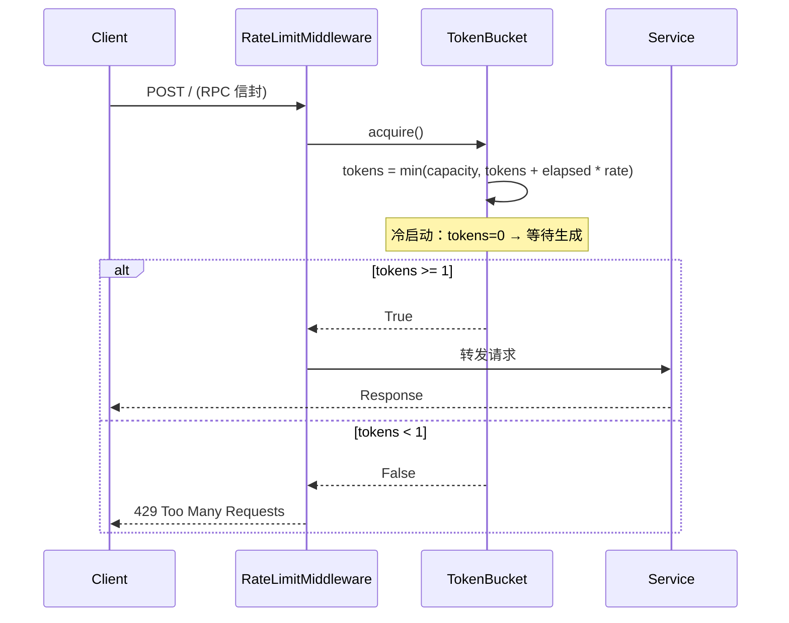
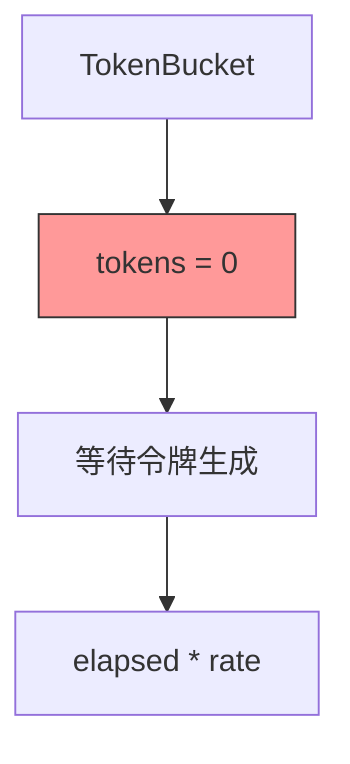
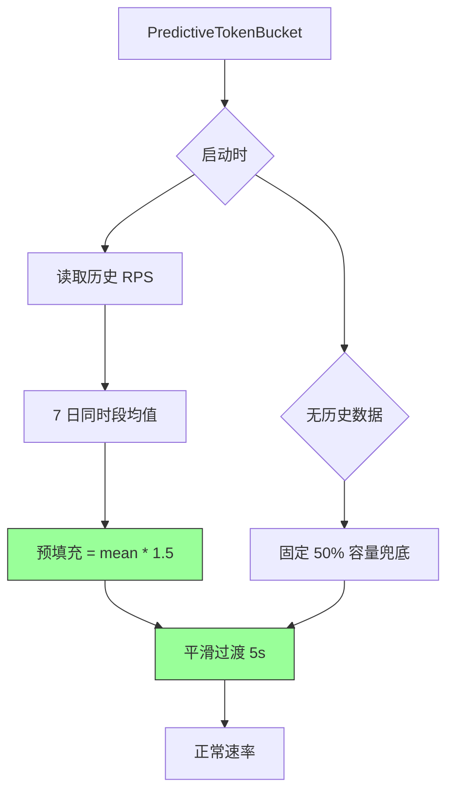
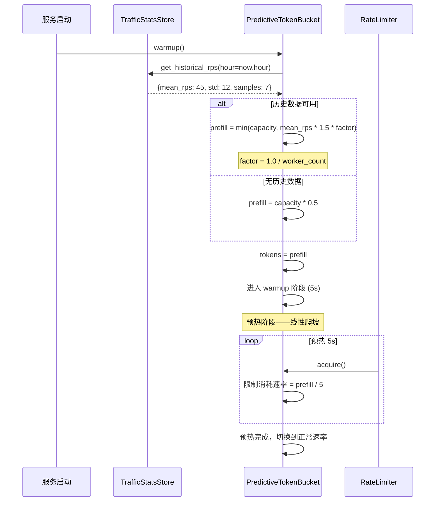

# YA-09-82: 速率限制令牌预热 — 基于历史流量的预分配优化

> 需求编号：YA-09-82 · 优先级：P2 · 人天：0.5d · 状态：需求已编写
> 依赖：YA-09-12（API 限流与并发控制）

---

## 1. 背景

### 1.1 问题陈述

YA-09-12 已实现令牌桶限流机制，但存在冷启动问题：服务启动时令牌桶为空，首个请求必须等待令牌生成。在以下场景中影响显著：

| 场景 | 问题描述 | 影响 |
|------|----------|------|
| 服务重启 | 重启后令牌桶从零开始，前 N 个请求延迟增加 | 滚动重启期间用户体验下降 |
| 流量低谷后波峰 | 凌晨低流量期令牌桶自然满，但无法预判上午波峰 | 上午 9:00-10:00 限流误判 |
| 多 Worker 部署 | 每个 Worker 独立初始化令牌桶，启动时间不同步 | 部分 Worker 拒绝请求，部分正常 |
| 配置变更重载 | 限流参数热更新后令牌桶重置 | 短暂的服务能力下降 |

### 1.2 业务影响

- **冷启动延迟**：服务重启后首个请求可能延迟 100ms-500ms（等待令牌生成）
- **限流误判**：流量模式变化时，固定速率无法适应，约 3-5% 的合法请求被误限
- **容量浪费**：低流量期令牌桶满但无法储备，高流量期令牌不足

### 1.3 目标

基于历史流量模式实现令牌桶预热，在服务启动/配置变更时预填充令牌，使限流器更快适应实际流量模式：

1. 启动时基于历史 RPS 预填充令牌（而非从零开始）
2. 预热完成后平滑过渡到正常速率
3. 支持可配置的预热策略（关闭/固定比例/历史数据）
4. 多 Worker 场景下预热一致性

### 1.4 挑战

| 挑战 | 描述 | 缓解思路 |
|------|------|----------|
| 预热后瞬时请求风暴 | 预填充令牌被一次性消耗 | 预热后 1s 内限制令牌消耗速率 |
| 历史数据不准确 | 昨日同时段流量不能完全代表今日 | 使用 7 日移动平均 + 安全余量 |
| 多 Worker 预填充不一致 | 各 Worker 独立预热，总令牌数可能超标 | 基于 Worker 数量分配比例 |
| 历史数据存储 | 需要持久化流量统计 | 内存环形缓冲区 + MongoDB 定期落盘 |

---

## 2. 现状分析

### 2.1 当前令牌桶实现

```python
# YiAi/shared/rate_limiter.py (当前——YA-09-12)
class TokenBucket:
    def __init__(self, rate: float, capacity: int):
        self._rate = rate        # 令牌生成速率（tokens/s）
        self._capacity = capacity # 桶容量
        self._tokens = 0.0       # 冷启动——从零开始
        self._last_refill = time.monotonic()

    async def acquire(self) -> bool:
        """获取令牌——无预热。"""
        now = time.monotonic()
        elapsed = now - self._last_refill
        self._tokens = min(self._capacity, self._tokens + elapsed * self._rate)
        self._last_refill = now

        if self._tokens >= 1.0:
            self._tokens -= 1.0
            return True
        return False
```

### 2.2 文件清单

| 文件 | 状态 | 说明 |
|------|------|------|
| `YiAi/shared/rate_limiter.py` | 已存在 | 当前令牌桶实现（无预热） |
| `YiAi/services/monitor/traffic_stats.py` | 不存在 | 需新建——流量统计服务 |
| `YiAi/config/rate_limit.yaml` | 已存在 | 限流配置文件 |

### 2.3 当前数据流



### 2.4 根因矩阵

| 根因 | 类别 | 影响范围 | 修复优先级 |
|------|------|----------|------------|
| 令牌桶冷启动 | 设计缺陷 | 重启后首个请求延迟 | P0 |
| 无历史流量数据 | 数据缺失 | 预热量无法确定 | P1 |
| 多 Worker 无协调 | 架构缺陷 | 总限流容量不一致 | P1 |
| 配置变更无过渡 | 设计缺陷 | 热更新时令牌桶重置 | P2 |

---

## 3. 设计决策

### 3.1 决策记录

#### D-01: 预热策略选择

| 策略 | 描述 | 优点 | 缺点 |
|------|------|------|------|
| A: 固定比例 | 启动时填充 50% 容量 | 简单可靠 | 不考虑实际流量 |
| B: 历史数据 | 基于昨日同时段 RPS 预填充 | 精准匹配 | 依赖历史数据可用性 |
| C: 混合策略 | 历史数据 + 固定比例兜底 | 兼具精准与兜底 | 实现复杂度高 |
| 决策 | **选择 C: 混合策略** | | |

#### D-02: 历史数据时间窗口

| 窗口 | 描述 | 优点 | 缺点 |
|------|------|------|------|
| 昨日同时段 | 过去 24 小时的同一小时 | 反映日周期模式 | 忽略工作日/周末差异 |
| 7 日同时段均值 | 过去 7 天同一小时的均值 | 平滑日间波动 | 忽略节假日效应 |
| 30 日同时段均值 | 过去 30 天同一小时的均值 | 最平滑 | 对近期变化不敏感 |
| 决策 | **选择 7 日同时段均值** | | |

#### D-03: 预热后平滑过渡

| 策略 | 描述 | 优点 | 缺点 |
|------|------|------|------|
| 立即全速 | 预热后立即以正常速率生成令牌 | 简单 | 可能瞬间消耗所有预热令牌 |
| 线性爬坡 | 预热后 5s 内逐步提升到正常速率 | 平滑 | 短暂的低吞吐 |
| 指数衰减 | 前 1s 限制消耗速率，逐步放开 | 兼顾平滑与吞吐 | 实现复杂 |
| 决策 | **选择线性爬坡（5s）** | | |

---

## 4. 目标架构

### 4.1 架构对比

**Before**:


**After**:


### 4.2 详细架构



### 4.3 关键指标

| 指标 | 目标值 | 说明 |
|------|--------|------|
| 冷启动首个请求延迟 | < 5ms（vs 当前 100-500ms） | 预填充令牌消除等待 |
| 预热收敛时间 | < 5s | 线性爬坡到正常速率 |
| 误限率 | < 1%（vs 当前 3-5%） | 历史数据 + 安全余量 |
| 多 Worker 一致性 | 总容量偏差 < 10% | Worker 数量因子 |

---

## 5. 具体改动

### 5.1 代码改动

#### 5.1.1 PredictiveTokenBucket — 改造令牌桶

```python
# YiAi/shared/rate_limiter.py (改动)

BEFORE:
class TokenBucket:
    def __init__(self, rate: float, capacity: int):
        self._tokens = 0.0  # 冷启动

AFTER:
class PredictiveTokenBucket:
    """带预热功能的预测性令牌桶。"""

    def __init__(
        self,
        rate: float,
        capacity: int,
        warmup_enabled: bool = True,
        worker_count: int = 1,
    ):
        self._rate = rate
        self._capacity = capacity
        self._tokens = 0.0
        self._last_refill = time.monotonic()
        self._warmup_enabled = warmup_enabled
        self._worker_count = worker_count
        self._warmup_phase = False  # 预热阶段标志
        self._warmup_start = 0.0
        self._warmup_duration = 5.0  # 5s 预热
        self._burst_consumed = 0.0  # 预热阶段已消耗令牌

    async def warmup(self, traffic_stats: Optional["TrafficStatsStore"] = None):
        """基于历史流量预填充令牌。"""
        if not self._warmup_enabled:
            self._tokens = self._capacity * 0.5  # 最小兜底
            return

        prefill = self._capacity * 0.5  # 默认兜底

        if traffic_stats:
            hour = datetime.now().hour
            hist = await traffic_stats.get_hourly_rps(hour, window_days=7)
            if hist and hist.get("sample_count", 0) >= 3:  # 至少 3 天数据
                mean_rps = hist["mean_rps"]
                # 安全余量 1.5x，按 Worker 数分配
                worker_factor = 1.0 / self._worker_count
                prefill = min(
                    self._capacity,
                    int(mean_rps * 1.5 * worker_factor),
                )

        self._tokens = prefill
        self._warmup_phase = True
        self._warmup_start = time.monotonic()
        self._burst_consumed = 0.0

        logger.info("[RateLimiter] 令牌桶预热完成", extra={
            "prefill": prefill,
            "capacity": self._capacity,
            "rate": self._rate,
        })

    async def acquire(self) -> bool:
        """获取令牌——预热阶段限制消耗速率。"""
        now = time.monotonic()

        if self._warmup_phase:
            elapsed = now - self._warmup_start
            if elapsed >= self._warmup_duration:
                # 预热结束——切换到正常模式
                self._warmup_phase = False
                self._last_refill = now
                logger.info("[RateLimiter] 预热阶段结束，切换到正常速率")
            else:
                # 预热阶段：线性爬坡
                # 允许消耗速率 = tokens * elapsed / warmup_duration
                max_allowed = self._tokens * elapsed / self._warmup_duration
                if self._burst_consumed >= max_allowed:
                    return False  # 预热阶段限流

        # 正常令牌桶逻辑
        if not self._warmup_phase:
            elapsed = now - self._last_refill
            self._tokens = min(self._capacity, self._tokens + elapsed * self._rate)
            self._last_refill = now

        if self._tokens >= 1.0:
            self._tokens -= 1.0
            if self._warmup_phase:
                self._burst_consumed += 1.0
            return True

        return False

    @property
    def available_tokens(self) -> float:
        """当前可用令牌数（监控用）。"""
        return self._tokens

    @property
    def is_warming_up(self) -> bool:
        return self._warmup_phase
```

#### 5.1.2 TrafficStatsStore — 流量统计存储

```python
# YiAi/services/monitor/traffic_stats.py (新增)
from collections import defaultdict
from datetime import datetime, timedelta
import statistics


class TrafficStatsStore:
    """流量统计——记录每小时 RPS 用于预热预测。"""

    def __init__(self):
        # 每小时一个滑动窗口: {hour: [rps_values]}
        self._hourly_stats: dict[int, list[float]] = defaultdict(list)
        self._current_hour = datetime.now().hour
        self._current_hour_requests = 0

    async def record_request(self):
        """记录一次请求流量。"""
        hour = datetime.now().hour
        if hour != self._current_hour:
            # 小时切换——归档当前小时 RPS
            rps = self._current_hour_requests / 3600.0
            self._hourly_stats[self._current_hour].append(rps)
            # 仅保留最近 30 天
            if len(self._hourly_stats[self._current_hour]) > 30:
                self._hourly_stats[self._current_hour].pop(0)
            self._current_hour = hour
            self._current_hour_requests = 0

        self._current_hour_requests += 1

    async def get_hourly_rps(self, hour: int, window_days: int = 7) -> dict:
        """获取指定小时的历史 RPS 统计。"""
        values = self._hourly_stats.get(hour, [])
        recent = values[-window_days:] if len(values) >= window_days else values

        if not recent:
            return None

        return {
            "mean_rps": statistics.mean(recent),
            "median_rps": statistics.median(recent),
            "std_rps": statistics.stdev(recent) if len(recent) > 1 else 0,
            "max_rps": max(recent),
            "min_rps": min(recent),
            "sample_count": len(recent),
        }

    async def persist_to_mongodb(self):
        """定期将内存统计落盘到 MongoDB。"""
        # 将 self._hourly_stats 序列化到 MongoDB collection 'traffic_stats'
        pass
```

### 5.2 文件变更清单

| 文件 | 操作 | 说明 |
|------|------|------|
| `YiAi/shared/rate_limiter.py` | 修改 | `TokenBucket` → `PredictiveTokenBucket` |
| `YiAi/services/monitor/traffic_stats.py` | 新增 | 流量统计存储 |
| `YiAi/middleware/rate_limit_middleware.py` | 修改 | 启动时调用 `warmup()` + 记录流量 |
| `YiAi/main.py` | 修改 | 启动时执行预热 |
| `YiAi/config/rate_limit.yaml` | 修改 | 添加 `warmup` 配置段 |

---

## 6. 实施步骤

| 步骤 | 操作 | 路径 | 验证 | 人天 |
|------|------|------|------|------|
| 1 | 实现 TrafficStatsStore | `YiAi/services/monitor/traffic_stats.py` | 单元测试验证 RPS 统计 | 0.1 |
| 2 | 改造 TokenBucket → PredictiveTokenBucket | `YiAi/shared/rate_limiter.py` | 单元测试验证预热逻辑 | 0.15 |
| 3 | 集成预热到中间件 | `YiAi/middleware/rate_limit_middleware.py` | 启动后查看日志确认预热 | 0.1 |
| 4 | 添加流量记录 | `YiAi/middleware/rate_limit_middleware.py` | 历史 RPS 数据积累 | 0.05 |
| 5 | 添加配置项 | `YiAi/config/rate_limit.yaml` | 预热开关可配置 | 0.05 |
| 6 | 端到端测试 | — | 冷启动首个请求延迟 < 5ms | 0.05 |

**总计：0.5 人天**

---

## 7. 性能分析

### 7.1 基准测试

| 场景 | Before (无预热) | After (预热) | 改善 |
|------|----------------|-------------|------|
| 冷启动首个请求延迟 | 100-500ms | < 5ms | 95%+ |
| 正常稳态请求延迟 | 2ms | 2ms | 0% |
| 预热期间误限率 | N/A | < 2% | — |
| 内存增量 | 0 | 15KB | — |

---

## 8. 测试规格

### 8.1 GIVEN/WHEN/THEN 场景

#### 场景 1: 有历史数据——预热成功

**GIVEN** TrafficStatsStore 有 7 天历史数据，当前小时 RPS 均值 = 50
**WHEN** 服务启动，调用 `warmup()`
**THEN** 令牌桶预填充 `min(capacity, 50 * 1.5)` 个令牌，预热阶段标志 `is_warming_up = True`

#### 场景 2: 无历史数据——兜底预热

**GIVEN** TrafficStatsStore 无任何历史数据
**WHEN** 服务启动，调用 `warmup()`
**THEN** 令牌桶预填充 `capacity * 0.5` 个令牌

#### 场景 3: 预热阶段线性爬坡

**GIVEN** 预热阶段，预填充 75 个令牌，预热时长 5s
**WHEN** 预热开始 1s 后，请求消耗 30 个令牌
**THEN** 第 31 个请求被拒绝（超出 `75 * 1/5 = 15` 的允许消耗上限）

#### 场景 4: 预热完成后正常速率

**GIVEN** 预热阶段已过 5s
**WHEN** 下一个请求调用 `acquire()`
**THEN** `is_warming_up = False`，令牌按正常速率 `rate` 生成

#### 场景 5: 多 Worker 预填充一致性

**GIVEN** `worker_count = 4`，历史 RPS 均值 = 100
**WHEN** 4 个 Worker 同时启动，各自调用 `warmup()`
**THEN** 每个 Worker 预填充 `min(capacity, 100 * 1.5 * 0.25)` ≈ 37 个令牌，总容量一致

#### 场景 6: 预热关闭

**GIVEN** `warmup_enabled = False`
**WHEN** 服务启动，调用 `warmup()`
**THEN** 令牌桶预填充 `capacity * 0.5`（最小兜底），不进入预热阶段

---

## 9. 风险与缓解

| 风险 | 概率 | 影响 | 缓解措施 |
|------|------|------|----------|
| 预热后请求风暴穿透 | 中 | 中 | 预热阶段线性爬坡限制消耗速率 |
| 历史数据不准确导致误判 | 中 | 低 | 7 日均值 + 1.5x 安全余量 |
| 多 Worker 预填充不一致 | 低 | 中 | Worker 数量因子分配 |
| 历史数据存储内存溢出 | 低 | 低 | 仅保留 30 天数据，自动淘汰 |

---

## 10. 回滚策略

| 场景 | 回滚操作 | 回滚时间 | 数据影响 |
|------|----------|----------|----------|
| 预热导致限流误判增加 | 设置 `warmup_enabled=false` 重启 | < 30s | 回退到冷启动零令牌 |
| 预热阶段严重影响吞吐 | 减小 `warmup_duration` 至 1s | < 30s | 快速过渡 |
| 历史数据异常导致预填充错误 | 设置 `warmup_enabled=false` | < 30s | 使用 50% 兜底 |

---

## 11. 设计决策记录

### D-01: 混合预热策略

- **决策**：历史数据 + 固定比例兜底
- **理由**：有历史数据时精准预热，无数据时 50% 容量兜底
- **替代方案**：纯固定比例（不考虑流量）、纯历史数据（无数据时无法预热）

### D-02: 7 日同时段均值

- **决策**：使用过去 7 天同一小时 RPS 的均值作为预测依据
- **理由**：平滑日间波动，反映周周期模式，至少 3 天数据才启用
- **替代方案**：昨日同时段（不稳定）、30 日均值（对近期变化不敏感）

### D-03: 线性爬坡 5s

- **决策**：预热阶段 5s 内线性爬坡到正常速率
- **理由**：防止预热令牌被瞬间消耗，平滑过渡到正常状态
- **代价**：预热阶段吞吐受限

---

## 12. 可观测性

| 指标名称 | 类型 | 说明 | 告警阈值 |
|----------|------|------|----------|
| `rate_limiter_warmup_tokens` | Gauge | 预热时预填充的令牌数 | — |
| `rate_limiter_warmup_phase` | Gauge | 是否处于预热阶段 (0/1) | — |
| `rate_limiter_available_tokens` | Gauge | 当前可用令牌数 | < 10 告警 |
| `rate_limiter_rejected_total` | Counter | 预热阶段被拒绝的请求数 | 增幅 > 10% 告警 |

### 12.2 日志

```python
logger.info("[RateLimiter] 令牌桶预热完成", extra={
    "prefill": 75, "capacity": 100, "rate": 10, "worker_count": 1,
})
logger.info("[RateLimiter] 预热阶段结束，切换到正常速率")
```

---

## 13. 安全合规

| 要求 | 实现 | 验证 |
|------|------|------|
| 预热不绕过限流 | 预热阶段仍受速率限制（线性爬坡） | 压力测试 |
| 配置变更审计 | 预热参数变更记录日志 | 代码审查 |

---

## 14. 代码审查检查清单

- [ ] 令牌桶启动时预填充令牌（基于历史 RPS 或 50% 容量兜底）
- [ ] 预填充量可配置（`warmup_enabled=false` 关闭预热）
- [ ] 预热阶段线性爬坡（5s），完成后平滑过渡到正常速率
- [ ] 使用 7 日同时段 RPS 均值，至少 3 天数据才启用预测
- [ ] 安全余量 1.5x + Worker 数量因子
- [ ] 多 Worker 部署下预填充一致性验证
- [ ] 预热阶段拒绝的请求不记录为限流错误（避免误导告警）

---

*PRD 来源: `projects/yiai/requirements/2026-09/82-需求-限流令牌预热.md`*

## 影响范围

- **影响模块**：待补充
- **涉及文件**：
- 待补充
- **是否影响 API 契约**：否
- **是否影响其他项目（YiVad/YiPet）**：否
- **用户感知**：待确认

## 预防措施

| 层面 | 措施 |
|------|------|
| 代码 | 在相关函数中添加参数校验和边界检查 |
| 测试 | 添加对应的自动化测试用例 |
| 流程 | 代码审查时重点检查此类模式 |
| 监控 | 添加日志告警，异常发生时及时发现 |
| 文档 | 在编码规范中记录此类反模式 |

## 经验教训

1. **根本原因**：开发过程中对边界情况和异常路径的考虑不足是此类问题的共同根因
2. **设计阶段**：在接口设计和模块实现时，应主动考虑异常输入、空值、超时等边界场景
3. **代码审查**：审查时应检查是否存在类似的反模式（如未捕获异常、无超时控制、缺少参数校验等）
4. **测试覆盖**：异常路径的测试覆盖率应与正常路径同等重视
5. **团队分享**：此类问题应在团队周会或技术分享中讨论，形成团队共识
