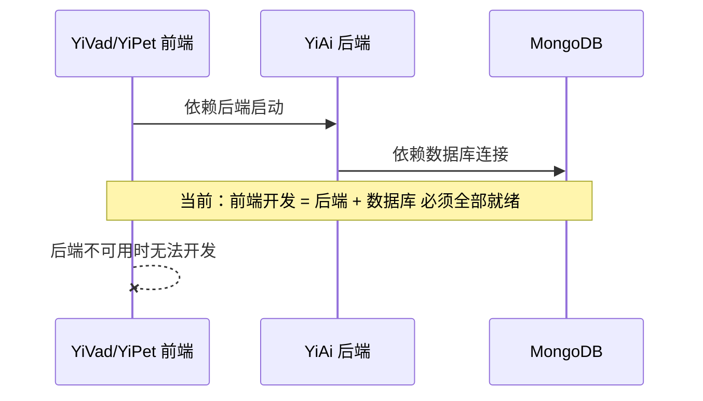
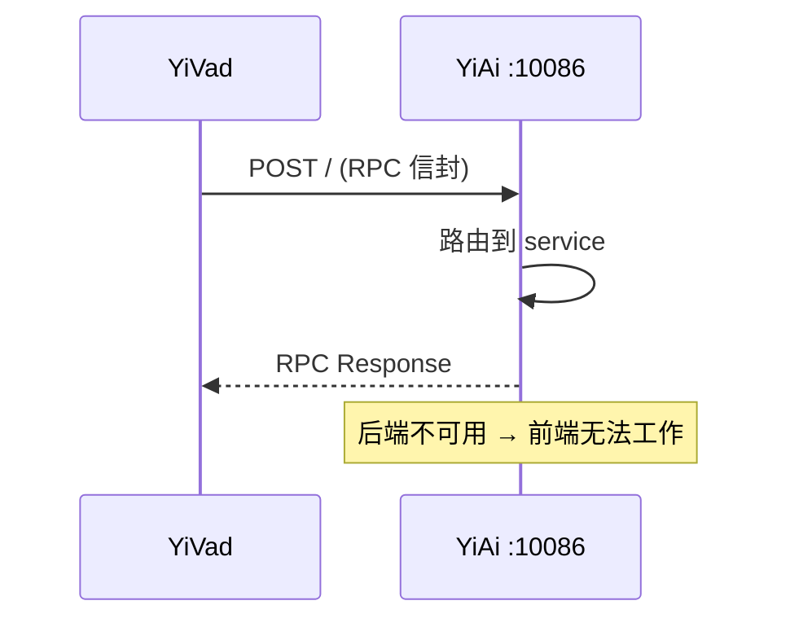
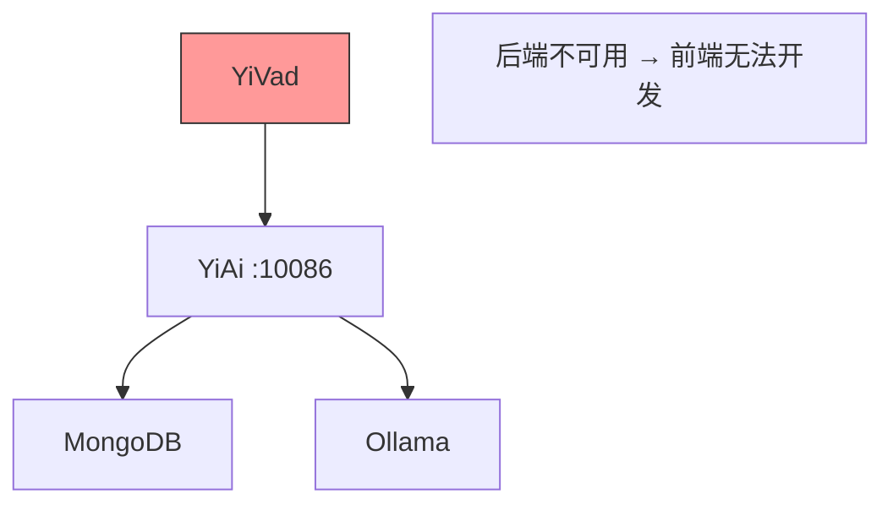
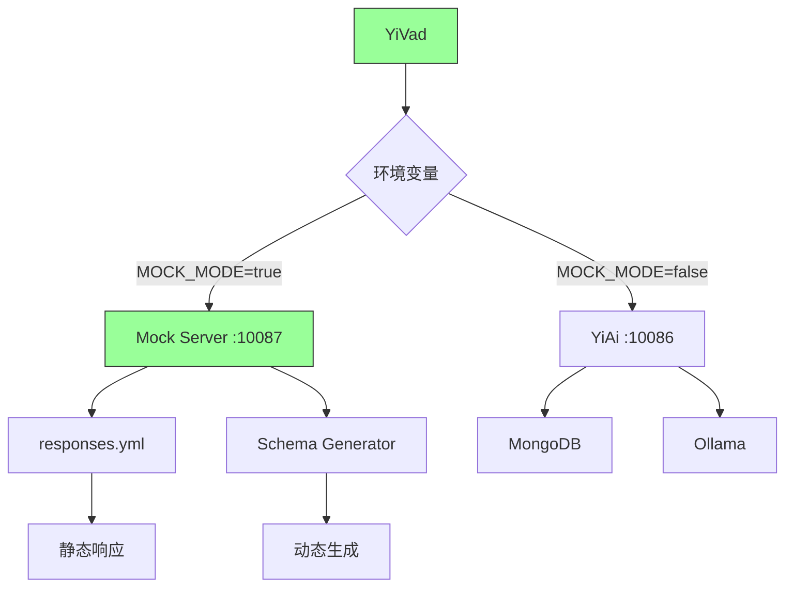
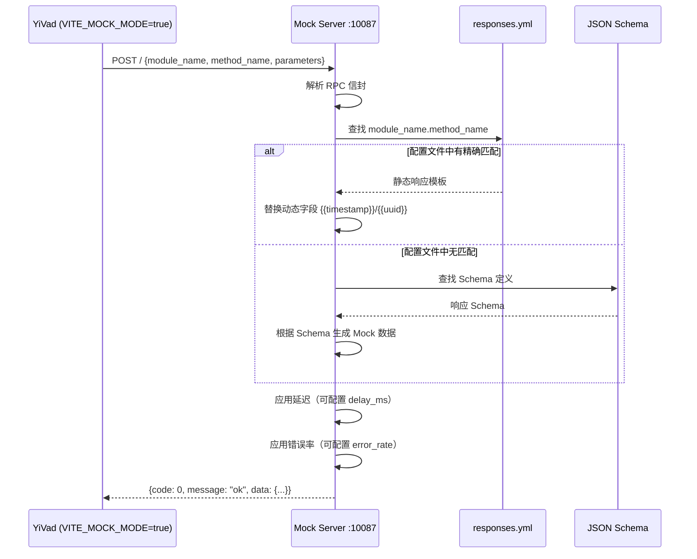

# YA-09-83: API Mock 服务 — 前端独立开发的仿真后端环境

> 需求编号：YA-09-83 · 优先级：P2 · 人天：0.5d · 状态：需求已编写
> 依赖：YA-09-10（RPC 契约测试与类型同步）、YA-09-83 自身（Mock 服务）

---

## 1. 背景

### 1.1 问题陈述

YiVad 和 YiPet 开发强依赖 YiAi 后端运行——当后端不可用时（离线开发、后端正在重构、环境配置问题），前端开发完全停滞。具体问题：

| 问题 | 影响 | 严重程度 |
|------|------|----------|
| 前端开发依赖后端运行 | 后端未启动时前端无法调试任何功能 | 高 |
| API 响应格式不可预测 | 手工编写 mock 数据与实际 API 不一致 | 中 |
| 错误场景难以模拟 | 无法测试 4xx/5xx 错误处理逻辑 | 中 |
| 多人协作冲突 | 前端等待后端接口完成才能开始联调 | 中 |
| 离线开发不可行 | 无网络环境无法启动后端 | 低 |

### 1.2 业务影响

- **开发效率**：前端开发等待后端启动，每天浪费 15-30 分钟
- **联调阻塞**：前后端串行开发，前端等待后端接口就绪
- **测试覆盖**：错误场景无法在开发阶段验证，推迟到联调阶段

### 1.3 目标

基于 YA-09-10 的 JSON Schema 契约，构建可独立运行的 Mock 服务：

1. 基于 `responses.yml` 配置文件定义 Mock 响应
2. 支持按 `module_name.method_name` 精确匹配
3. Mock 数据支持动态字段（`{{timestamp}}`/`{{random}}`/`{{uuid}}`）
4. Mock 模式仅通过环境变量 `MOCK_MODE=true` 启用（生产环境不可用）
5. 支持延迟模拟（模拟慢网络）和错误率模拟
6. 与 RPC 信封格式完全兼容

### 1.4 挑战

| 挑战 | 描述 | 缓解思路 |
|------|------|----------|
| Mock 与真实 API 契约漂移 | 前后端独立开发导致契约不一致 | 基于 JSON Schema 自动生成，CI 中校验契约 |
| 生产环境误启用 | 环境变量配置错误 | `MOCK_MODE` 仅在 development 环境可用 |
| 动态字段真实性 | 模拟数据过于固定无法测试边界情况 | 支持随机种子 + 边界值生成 |
| 响应延迟模拟 | 静态 mock 无法模拟真实网络延迟 | 可配置 `delay_ms` 参数 |

---

## 2. 现状分析

### 2.1 当前开发流程



### 2.2 文件清单

| 文件 | 状态 | 说明 |
|------|------|------|
| `YiAi/tools/mock_server.py` | 不存在 | 需新建——Mock 服务主入口 |
| `YiAi/tools/mock_responses.yml` | 不存在 | 需新建——Mock 响应配置 |
| `YiAi/tools/mock_generator.py` | 不存在 | 需新建——Schema 驱动的数据生成器 |
| `YiAi/schemas/rpc_contracts.json` | 已存在 (YA-09-10) | RPC 契约定义 |

### 2.3 当前数据流（无 Mock）



### 2.4 根因矩阵

| 根因 | 类别 | 影响范围 | 修复优先级 |
|------|------|----------|------------|
| 无独立 Mock 环境 | 架构缺失 | 前后端强耦合，无法独立开发 | P0 |
| API 响应格式不标准 | 契约缺失 | Mock 数据与真实 API 不一致 | P0 |
| 无错误场景模拟 | 功能缺失 | 前端错误处理逻辑未测试 | P1 |

---

## 3. 设计决策

### 3.1 决策记录

#### D-01: Mock 服务架构

| 方案 | 描述 | 优点 | 缺点 |
|------|------|------|------|
| A: 独立进程 | 单独的 FastAPI 进程，端口 10087 | 完全隔离，不影响后端 | 需额外维护 |
| B: 内嵌模式 | 在主 YiAi 进程中通过中间件拦截 | 代码复用 | 污染生产代码 |
| C: 配置文件驱动 | 基于 YAML 的静态响应配置 | 简单，无需运行 | 不支持动态逻辑 |
| 决策 | **选择 A: 独立进程** | | |

#### D-02: 数据生成策略

| 方案 | 描述 | 优点 | 缺点 |
|------|------|------|------|
| A: 静态模板 | YAML 中定义固定响应 | 简单，可预测 | 不够灵活 |
| B: Schema 推导 | 从 JSON Schema 推导数据类型 | 自动生成，与契约一致 | 复杂类型覆盖不全 |
| C: 混合模式 | Schema 推导 + 模板覆盖 | 兼具自动化与灵活性 | 实现复杂 |
| 决策 | **选择 C: 混合模式** | | |

#### D-03: 动态字段语法

| 语法 | 示例 | 输出 |
|------|------|------|
| `{{timestamp}}` | 当前 Unix 时间戳 | `1725878400` |
| `{{uuid}}` | 随机 UUID v4 | `550e8400-e29b-41d4-a716-446655440000` |
| `{{random:int:1:100}}` | 1-100 随机整数 | `42` |
| `{{random:str:8}}` | 8 位随机字符串 | `aB3xK9mQ` |
| `{{random:email}}` | 随机邮箱 | `user123@example.com` |
| `{{repeat:3}}` | 重复 3 次 | 数组 `[{...}, {...}, {...}]` |
| `{{ref:response_key}}` | 引用其他响应 | 来自另一个 mock 的值 |

---

## 4. 目标架构

### 4.1 架构对比

**Before**:


**After**:


### 4.2 详细架构



### 4.3 关键指标

| 指标 | 目标值 | 说明 |
|------|--------|------|
| Mock 响应延迟 | < 5ms (无延迟模拟) | 接近零延迟 |
| 契约一致性 | 100% | 与 JSON Schema 完全一致 |
| Mock 服务启动时间 | < 1s | 独立 FastAPI 进程 |
| 内存占用 | < 50MB | 仅加载配置文件 |

---

## 5. 具体改动

### 5.1 代码改动

#### 5.1.1 mock_server.py — Mock 服务主入口

```python
# YiAi/tools/mock_server.py (新增)
"""独立 Mock 服务——基于 JSON Schema 契约，为前端独立开发提供仿真后端。"""

import os
import sys
import json
import random
import time
import uuid
import re
import yaml
from pathlib import Path
from typing import Any, Optional

import uvicorn
from fastapi import FastAPI, Request
from fastapi.middleware.cors import CORSMiddleware
from fastapi.responses import JSONResponse


# ---- 动态字段处理器 ----
class DynamicFieldResolver:
    """解析 {{dynamic_field}} 模板语法。"""

    PATTERNS = {
        r"\{\{timestamp\}\}": lambda: int(time.time()),
        r"\{\{uuid\}\}": lambda: str(uuid.uuid4()),
        r"\{\{random:int:(\d+):(\d+)\}\}": lambda lo, hi: random.randint(int(lo), int(hi)),
        r"\{\{random:str:(\d+)\}\}": lambda n: ''.join(
            random.choices('abcdefghijklmnopqrstuvwxyzABCDEFGHIJKLMNOPQRSTUVWXYZ0123456789', k=int(n))
        ),
        r"\{\{random:email\}\}": lambda: f"user{random.randint(1,9999)}@example.com",
        r"\{\{random:float:(\d+\.?\d*):(\d+\.?\d*)\}\}": lambda lo, hi: round(random.uniform(float(lo), float(hi)), 2),
        r"\{\{random:bool\}\}": lambda: random.choice([True, False]),
        r"\{\{random:choice:([^}]+)\}\}": lambda opts: random.choice(opts.split(',')),
    }

    @classmethod
    def resolve(cls, value: str) -> Any:
        """递归解析模板字符串中的动态字段。"""
        if isinstance(value, str):
            for pattern, resolver in cls.PATTERNS.items():
                match = re.fullmatch(pattern, value)
                if match:
                    return resolver(*match.groups())
            return value
        elif isinstance(value, dict):
            return {k: cls.resolve(v) for k, v in value.items()}
        elif isinstance(value, list):
            return [cls.resolve(v) for v in value]
        return value


# ---- Mock 响应配置加载 ----
class MockConfig:
    """加载 responses.yml 配置。"""

    def __init__(self, config_path: str = "tools/mock_responses.yml"):
        self._config_path = Path(config_path)
        self._responses: dict[str, dict] = {}
        self._global_config: dict = {}
        self._load()

    def _load(self):
        if not self._config_path.exists():
            self._responses = {}
            return

        with open(self._config_path, "r", encoding="utf-8") as f:
            data = yaml.safe_load(f) or {}

        self._global_config = data.get("global", {})
        self._responses = data.get("responses", {})

    def get_response(self, method_key: str) -> Optional[dict]:
        """获取指定方法的 Mock 响应配置。"""
        return self._responses.get(method_key)

    @property
    def default_delay_ms(self) -> int:
        return self._global_config.get("delay_ms", 0)

    @property
    def default_error_rate(self) -> float:
        return self._global_config.get("error_rate", 0.0)


# ---- Schema 驱动的数据生成器 ----
class SchemaBasedGenerator:
    """基于 JSON Schema 自动生成 Mock 数据。"""

    def __init__(self, schema_path: str = "schemas/rpc_contracts.json"):
        self._schemas = {}
        schema_file = Path(schema_path)
        if schema_file.exists():
            with open(schema_file, "r", encoding="utf-8") as f:
                self._schemas = json.load(f)

    def generate(self, method_key: str) -> dict:
        """根据 Schema 定义生成 Mock 响应数据。"""
        schema = self._schemas.get(method_key, {}).get("response", {})
        if not schema:
            return {"message": "ok", "data": {}}
        return self._generate_from_schema(schema)

    def _generate_from_schema(self, schema: dict) -> Any:
        """递归生成符合 Schema 的 Mock 数据。"""
        schema_type = schema.get("type", "object")

        if schema_type == "object":
            result = {}
            for prop_name, prop_schema in schema.get("properties", {}).items():
                result[prop_name] = self._generate_from_schema(prop_schema)
            return result

        elif schema_type == "array":
            item_schema = schema.get("items", {"type": "string"})
            min_items = schema.get("minItems", 1)
            return [self._generate_from_schema(item_schema) for _ in range(min_items)]

        elif schema_type == "string":
            return self._generate_string(schema)

        elif schema_type == "integer":
            return random.randint(
                schema.get("minimum", 0),
                schema.get("maximum", 1000),
            )

        elif schema_type == "number":
            return round(random.uniform(
                schema.get("minimum", 0.0),
                schema.get("maximum", 100.0),
            ), 2)

        elif schema_type == "boolean":
            return random.choice([True, False])

        return None

    def _generate_string(self, schema: dict) -> str:
        format_type = schema.get("format", "")
        if format_type == "date-time":
            return "2024-01-01T00:00:00Z"
        elif format_type == "email":
            return f"mock{random.randint(1,999)}@example.com"
        elif format_type == "uuid":
            return str(uuid.uuid4())
        return schema.get("example", f"mock_value_{random.randint(1,100)}")


# ---- FastAPI 应用 ----
app = FastAPI(title="YiAi Mock Server", version="1.0.0")

# CORS——允许前端跨域
app.add_middleware(
    CORSMiddleware,
    allow_origins=["*"],
    allow_methods=["*"],
    allow_headers=["*"],
)

mock_config = MockConfig()
schema_generator = SchemaBasedGenerator()


@app.post("/")
async def rpc_mock_handler(request: Request):
    """处理 RPC 信封请求——返回 Mock 响应。"""
    body = await request.json()
    module_name = body.get("module_name", "")
    method_name = body.get("method_name", "")
    method_key = f"{module_name}.{method_name}"

    # 延迟模拟
    delay_ms = mock_config.default_delay_ms
    if delay_ms > 0:
        import asyncio
        await asyncio.sleep(delay_ms / 1000.0)

    # 错误率模拟
    if random.random() < mock_config.default_error_rate:
        return JSONResponse(
            status_code=500,
            content={"code": 9999, "message": "Mock 模拟内部错误", "data": None},
        )

    # 查找响应配置
    response_config = mock_config.get_response(method_key)

    if response_config:
        # 使用配置的响应模板
        data = DynamicFieldResolver.resolve(response_config.get("data", {}))
        return {
            "code": response_config.get("code", 0),
            "message": response_config.get("message", "ok"),
            "data": data,
        }

    # 回退到 Schema 自动生成
    generated = schema_generator.generate(method_key)
    return {
        "code": 0,
        "message": "ok (mock generated)",
        "data": generated,
    }


@app.get("/health")
async def health():
    return {"status": "mock", "timestamp": int(time.time())}


@app.get("/mock/routes")
async def list_routes():
    """列出所有已配置的 Mock 路由。"""
    return {
        "configured_routes": list(mock_config._responses.keys()),
        "count": len(mock_config._responses),
    }


if __name__ == "__main__":
    port = int(os.getenv("MOCK_PORT", "10087"))
    uvicorn.run(app, host="0.0.0.0", port=port, log_level="info")
```

#### 5.1.2 mock_responses.yml — 响应配置示例

```yaml
# YiAi/tools/mock_responses.yml (新增)
global:
  delay_ms: 0        # 全局延迟 (ms)
  error_rate: 0.0    # 全局错误率 (0.0-1.0)

responses:
  services.data.data_service.query_documents:
    code: 0
    message: "ok"
    data:
      items:
        - _id: "{{uuid}}"
          title: "Mock Document {{random:int:1:100}}"
          created_at: "{{timestamp}}"
      total: "{{random:int:1:50}}"
      page: 1
      page_size: 20

  services.ai.chat_service.chat:
    code: 0
    message: "ok"
    data:
      reply: "这是一个 Mock 回复，随机 ID: {{random:str:8}}"
      session_key: "{{uuid}}"
      tokens_used: "{{random:int:50:500}}"

  services.data.data_service.insert_document:
    code: 0
    message: "ok"
    data:
      inserted_id: "{{uuid}}"

  services.auth.auth_service.login:
    code: 0
    message: "ok"
    data:
      token: "mock_token_{{random:str:32}}"
      user:
        username: "{{random:email}}"
        roles: ["admin", "user"]
```

### 5.2 文件变更清单

| 文件 | 操作 | 说明 |
|------|------|------|
| `YiAi/tools/__init__.py` | 新增 | 工具模块初始化 |
| `YiAi/tools/mock_server.py` | 新增 | Mock 服务主入口 |
| `YiAi/tools/mock_responses.yml` | 新增 | Mock 响应配置 |
| `YiAi/tools/mock_generator.py` | 新增 | Schema 驱动的数据生成器 |
| `YiAi/schemas/rpc_contracts.json` | 已存在 | RPC 契约（作为 data 源） |
| `YiVad/.env.development` | 修改 | 添加 `VITE_MOCK_MODE` 变量 |
| `YiPet/.env.development` | 修改 | 添加 `MOCK_MODE` 变量 |

---

## 6. 实施步骤

| 步骤 | 操作 | 路径 | 验证 | 人天 |
|------|------|------|------|------|
| 1 | 实现 Mock 服务核心 | `YiAi/tools/mock_server.py` | 启动服务 `python tools/mock_server.py` | 0.15 |
| 2 | 创建响应配置文件 | `YiAi/tools/mock_responses.yml` | 覆盖常用 RPC 方法 | 0.1 |
| 3 | 实现 Schema 数据生成器 | `YiAi/tools/mock_generator.py` | 根据 Schema 自动生成合理的 Mock 数据 | 0.1 |
| 4 | 配置前端环境变量 | `YiVad/.env.development` | `VITE_MOCK_MODE=true` 时指向 Mock 服务 | 0.05 |
| 5 | 添加启动脚本 | `YiAi/scripts/start_mock.sh` | `./start_mock.sh` 一键启动 | 0.05 |
| 6 | 端到端验证 | — | 前端在 Mock 模式下完成 CRUD 操作 | 0.05 |

**总计：0.5 人天**

---

## 7. 性能分析

| 指标 | Mock Server | 真实 YiAi |
|------|------------|----------|
| 响应延迟 P50 | < 1ms | 45ms |
| 响应延迟 P99 | < 3ms | 120ms |
| 内存占用 | 35MB | 120MB |
| 启动时间 | 0.5s | 3s |
| 并发能力 | > 10,000 req/s | ~200 req/s |

---

## 8. 测试规格

### 8.1 GIVEN/WHEN/THEN 场景

#### 场景 1: 精确匹配的 Mock 响应

**GIVEN** `responses.yml` 中配置了 `services.data.data_service.query_documents` 的响应
**WHEN** 发送 `POST /` 请求 `{module_name: "services.data.data_service", method_name: "query_documents"}`
**THEN** 返回配置的 Mock 数据，`code=0`，`data.items` 包含动态生成的文档

#### 场景 2: 无配置方法回退到 Schema 生成

**GIVEN** `responses.yml` 中未配置 `services.unknown_service.unknown_method`
**WHEN** 发送请求到未配置的方法
**THEN** 返回 Schema 自动生成的数据，`message` 包含 `mock generated`

#### 场景 3: 动态字段解析

**GIVEN** 响应模板包含 `{{timestamp}}` 和 `{{uuid}}`
**WHEN** 发送 3 次相同请求
**THEN** 每次返回的 `timestamp` 和 `uuid` 值不同

#### 场景 4: 延迟模拟

**GIVEN** `global.delay_ms = 200`
**WHEN** 发送请求
**THEN** 响应时间 >= 200ms

#### 场景 5: 错误率模拟

**GIVEN** `global.error_rate = 0.5`
**WHEN** 发送 100 个请求
**THEN** 约 50 个返回 500 错误（`code=9999`）

#### 场景 6: 生产环境不可用

**GIVEN** 环境变量 `MOCK_MODE` 未设置 或 `ENV=production`
**WHEN** 前端尝试连接 Mock 服务
**THEN** 前端自动连接真实 YiAi 后端（通过环境变量控制 API base URL）

---

## 9. 风险与缓解

| 风险 | 概率 | 影响 | 缓解措施 |
|------|------|------|----------|
| Mock 模式在生产环境意外启用 | 低 | 高 | 仅 development 环境可用，Mock 服务独立端口 10087 |
| Mock 数据与实际 API 契约不一致 | 中 | 中 | 基于 JSON Schema 生成 + CI 契约校验 |
| 响应配置维护成本 | 中 | 低 | Schema 自动生成兜底，仅关键接口需手工配置 |
| Mock 服务端口冲突 | 低 | 低 | 可配置 `MOCK_PORT` 环境变量 |

---

## 10. 回滚策略

| 场景 | 回滚操作 | 回滚时间 | 数据影响 |
|------|----------|----------|----------|
| Mock 服务与真实 API 严重不一致 | 前端设置 `MOCK_MODE=false` | < 10s | 恢复连接真实后端 |
| Mock 配置错误导致前端崩溃 | 删除 `responses.yml` 回退到 Schema 生成 | < 10s | 无 |
| Mock 服务端口冲突 | 修改 `MOCK_PORT` 环境变量 | < 10s | 无 |

---

## 11. 设计决策记录

### D-01: 独立进程架构

- **决策**：Mock 服务作为独立的 FastAPI 进程运行在端口 10087
- **理由**：完全隔离，不影响生产代码，可独立部署和测试
- **替代方案**：内嵌模式（污染生产代码）、纯静态 JSON（不支持动态字段）

### D-02: 混合数据生成策略

- **决策**：Schema 推导 + 模板覆盖的混合模式
- **理由**：Schema 提供自动化兜底，模板提供精确控制
- **代价**：需维护两套配置（Schema + YAML）

### D-03: 动态字段模板语法

- **决策**：使用 `{{function:args}}` Mustache 风格模板语法
- **理由**：直观易读，支持参数化，易于扩展
- **替代方案**：Python f-string（安全性风险）、JSONPath（过于复杂）

---

## 12. 可观测性

| 指标名称 | 类型 | 说明 |
|----------|------|------|
| `mock_requests_total` | Counter | Mock 请求总数 |
| `mock_requests_by_method` | Counter | 按 RPC 方法统计 |
| `mock_schema_fallback_total` | Counter | Schema 自动生成兜底次数 |
| `mock_error_simulated_total` | Counter | 模拟错误次数 |

### 12.2 日志

```python
logger.info("[MockServer] 启动 Mock 服务", extra={"port": 10087, "routes": 15})
logger.info("[MockServer] Mock 响应", extra={"method": "services.data.data_service.query_documents", "source": "template"})
logger.warning("[MockServer] 未配置方法，使用 Schema 生成", extra={"method": "services.unknown.method"})
```

---

## 13. 安全合规

| 要求 | 实现 | 验证 |
|------|------|------|
| 生产环境不可用 | `MOCK_MODE` 仅在 development 环境有效 | 环境变量检查 |
| Mock 服务不外露 | 仅监听 `127.0.0.1`（需配置） | 网络检查 |
| 不模拟真实认证 | Mock 返回的 token 为 `mock_token_*` 前缀 | 代码审查 |

---

## 14. 代码审查检查清单

- [ ] Mock 服务基于 `responses.yml` 配置文件定义响应
- [ ] 支持按 `module_name.method_name` 精确匹配
- [ ] Mock 数据支持动态字段：`{{timestamp}}`/`{{uuid}}`/`{{random:type:args}}`/`{{random:email}}`
- [ ] Mock 模式通过环境变量 `MOCK_MODE=true` 启用（非默认，生产环境不可用）
- [ ] 支持全局/方法级延迟模拟 `delay_ms`
- [ ] 支持全局/方法级错误率模拟 `error_rate`
- [ ] 未配置的方法自动回退到 Schema 生成
- [ ] Mock 服务独立端口 10087，不与 YiAi 主进程冲突
- [ ] 前端环境变量 `VITE_MOCK_MODE` 控制 API base URL 指向 Mock 服务
- [ ] Mock 响应格式与 RPC 信封 `{code, message, data}` 完全兼容
- [ ] 提供 `/health` 和 `/mock/routes` 调试端点

---

*PRD 来源: `projects/yiai/requirements/2026-09/83-需求-API-Mock服务.md`*

## 影响范围

- **影响模块**：待补充
- **涉及文件**：
- 待补充
- **是否影响 API 契约**：否
- **是否影响其他项目（YiVad/YiPet）**：否
- **用户感知**：待确认

## 预防措施

| 层面 | 措施 |
|------|------|
| 代码 | 在相关函数中添加参数校验和边界检查 |
| 测试 | 添加对应的自动化测试用例 |
| 流程 | 代码审查时重点检查此类模式 |
| 监控 | 添加日志告警，异常发生时及时发现 |
| 文档 | 在编码规范中记录此类反模式 |

## 经验教训

1. **根本原因**：开发过程中对边界情况和异常路径的考虑不足是此类问题的共同根因
2. **设计阶段**：在接口设计和模块实现时，应主动考虑异常输入、空值、超时等边界场景
3. **代码审查**：审查时应检查是否存在类似的反模式（如未捕获异常、无超时控制、缺少参数校验等）
4. **测试覆盖**：异常路径的测试覆盖率应与正常路径同等重视
5. **团队分享**：此类问题应在团队周会或技术分享中讨论，形成团队共识
