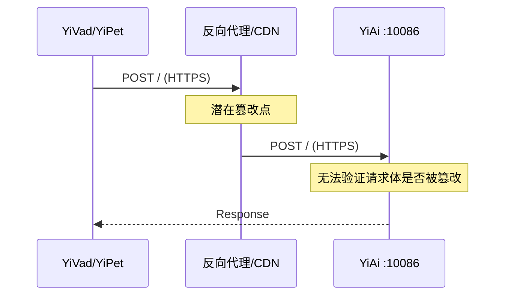
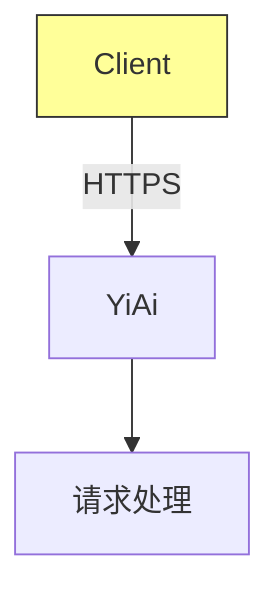
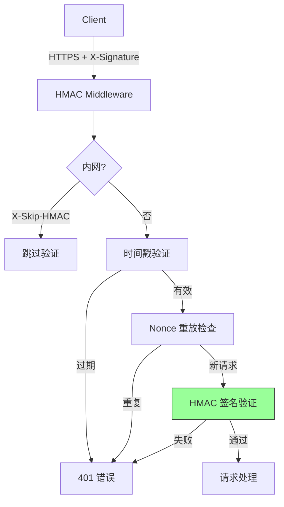
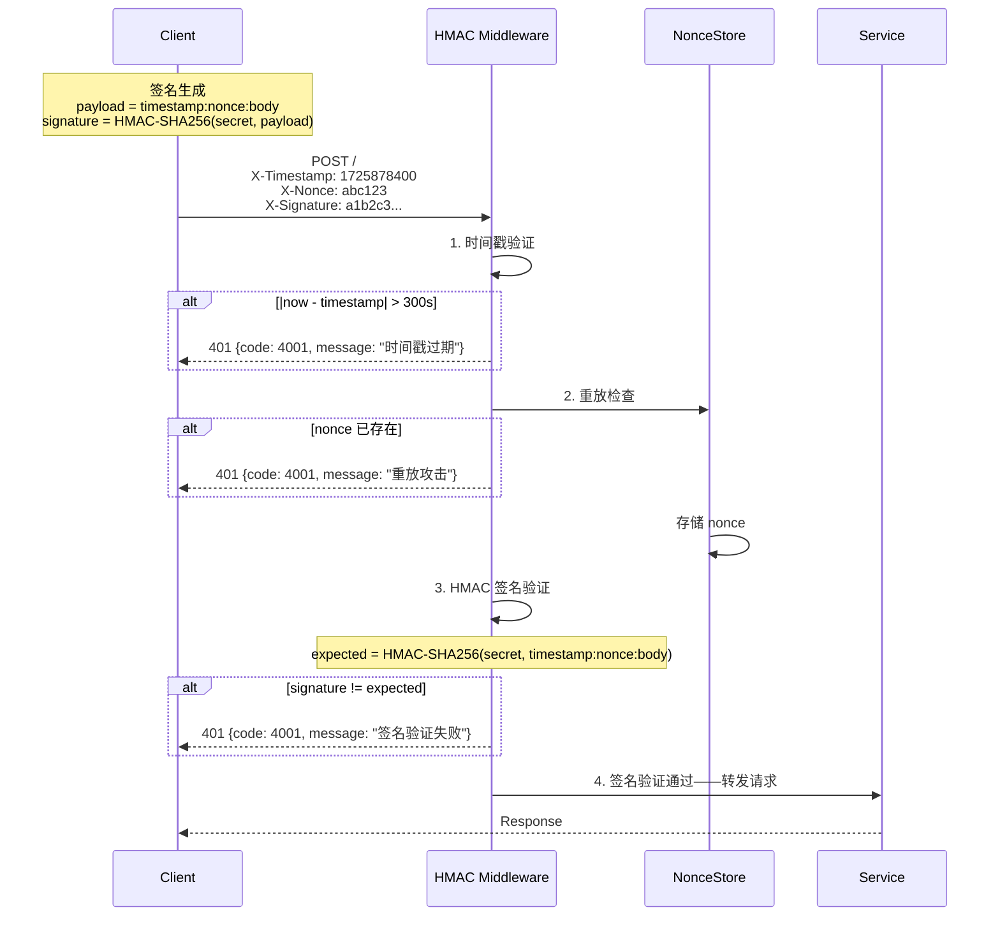

# YA-09-85: 服务端请求体签名验证 — HMAC 防篡改与重放保护

> 需求编号：YA-09-85 · 优先级：P2 · 人天：0.5d · 状态：需求已编写
> 依赖：YA-09-84（凭证轮换——共享密钥轮换）

---

## 1. 背景

### 1.1 问题陈述

RPC 请求体在传输过程中可能被中间代理篡改——虽然 HTTPS 提供传输层加密，但端到端的请求完整性验证需要应用层签名。当前 YiAi 的 RPC 协议缺乏以下安全保护：

| 问题 | 影响 | 严重程度 |
|------|------|----------|
| 无请求体完整性校验 | 中间代理可篡改请求参数，导致数据损坏或权限绕过 | 高 |
| 无重放攻击保护 | 攻击者可截获合法请求并重复发送，造成重复操作 | 高 |
| 无请求时效性验证 | 旧请求可被延迟执行，绕过时间敏感的业务逻辑 | 中 |
| 仅依赖 HTTPS | HTTPS 保护传输层但不保护应用层（CDN/反向代理后） | 中 |

### 1.2 业务影响

- **重放攻击**：攻击者截获 `insert_document` 请求，重复发送 1000 次造成数据污染
- **请求篡改**：反向代理/CDN 被入侵后，请求参数可被修改
- **合规风险**：金融/医疗等场景要求端到端请求完整性验证

### 1.3 目标

基于 HMAC-SHA256 实现请求签名验证：

1. 客户端对请求体进行 HMAC 签名，服务端验证
2. 基于时间戳 + Nonce 的防重放保护（5 分钟窗口）
3. 内网请求可跳过签名验证（`X-Skip-HMAC` 头部）
4. 共享密钥定期轮换（与 YA-09-84 凭证轮换联动）
5. 签名验证失败返回统一错误码 4001

### 1.4 挑战

| 挑战 | 描述 | 缓解思路 |
|------|------|----------|
| 时间同步 | 客户端和服务端时间偏差导致验证失败 | 5 分钟窗口 + NTP 同步 |
| Nonce 存储膨胀 | 5 分钟内所有请求的 Nonce 需存储 | 时间分区清理 + LRU 淘汰 |
| 性能开销 | HMAC 计算 + Nonce 查找增加延迟 | 高效数据结构 + 非阻塞操作 |
| 向后兼容 | 现有客户端未实现签名 | 可选启用 + 渐进式迁移 |

---

## 2. 现状分析

### 2.1 当前请求验证

```
YiAi 当前安全层
├── HTTPS 传输加密         ← 传输层保护
├── JWT Token 认证          ← 身份认证（可选）
├── CORS 策略               ← 浏览器跨域保护
└── ❌ 请求体签名验证       ← 缺失
    ├── ❌ HMAC 完整性校验
    ├── ❌ 防重放保护
    └── ❌ 时间戳验证
```

### 2.2 文件清单

| 文件 | 状态 | 说明 |
|------|------|------|
| `YiAi/middleware/auth_middleware.py` | 已存在 | JWT 认证中间件 |
| `YiAi/middleware/hmac_middleware.py` | 不存在 | 需新建——HMAC 签名验证中间件 |
| `YiAi/shared/hmac_signer.py` | 不存在 | 需新建——签名生成/验证工具 |
| `YiAi/shared/nonce_store.py` | 不存在 | 需新建——Nonce 防重放存储 |

### 2.3 当前数据流



### 2.4 根因矩阵

| 根因 | 类别 | 影响范围 | 修复优先级 |
|------|------|----------|------------|
| 无应用层签名验证 | 设计缺失 | 所有 RPC 请求 | P0 |
| 无防重放机制 | 设计缺失 | 所有写操作 | P0 |
| 无时间戳验证 | 设计缺失 | 所有请求 | P1 |

---

## 3. 设计决策

### 3.1 决策记录

#### D-01: 签名算法

| 算法 | 安全性 | 性能 | 兼容性 | 决策 |
|------|--------|------|--------|------|
| HMAC-SHA256 | 高（对称密钥） | 快（~1μs/req） | 所有平台 | **选择** |
| RSA-SHA256 | 高（非对称） | 慢（~1ms/req） | 需证书管理 | 不选 |
| Ed25519 | 最高 | 快 | Python 3.8+ | 备选 |
| 简单 MD5 | 低（已破解） | 最快 | 所有平台 | 不安全 |

#### D-02: 防重放窗口

| 窗口 | 优点 | 缺点 | 决策 |
|------|------|------|------|
| 1 分钟 | 存储需求小 | 时钟偏差敏感 | 太短 |
| 5 分钟 | 平衡 | 适中 | **选择** |
| 30 分钟 | 时钟偏差容忍度高 | Nonce 存储膨胀 | 太长 |

#### D-03: Nonce 存储策略

| 策略 | 优点 | 缺点 | 决策 |
|------|------|------|------|
| 内存 Set | 最快 | 进程重启丢失 | 主要方案 |
| Redis | 持久化 | 额外依赖 | 可选增强 |
| 布隆过滤器 | 内存极小 | 误判率 | 不选（需精确判断） |
| 决策 | **选择内存 Set + 可选 Redis** | | |

#### D-04: 内网信任策略

| 策略 | 描述 | 适用场景 |
|------|------|----------|
| IP 白名单 | 内网 IP 段自动跳过签名验证 | 内网服务间调用 |
| Header 跳过 | `X-Skip-HMAC: true` 头部 | 开发环境 |
| 始终验证 | 所有请求都验证 | 生产环境全量启用 |

---

## 4. 目标架构

### 4.1 架构对比

**Before**:


**After**:


### 4.2 详细架构



### 4.3 关键指标

| 指标 | 目标值 | 说明 |
|------|--------|------|
| 签名验证延迟 | < 1ms | HMAC 计算 + Nonce 查找 |
| 误拒率 | < 0.01% | 时钟偏差导致 |
| Nonce 存储 | < 50MB | 5 分钟窗口 × 1000 req/s |
| 签名生成时间（客户端） | < 0.5ms | 前端 JS/Python |

---

## 5. 具体改动

### 5.1 代码改动

#### 5.1.1 hmac_signer.py — 签名生成/验证

```python
# YiAi/shared/hmac_signer.py (新增)
"""HMAC-SHA256 请求签名生成与验证。"""

import hmac
import hashlib
import os
import time
from typing import Tuple


class HMACSigner:
    """HMAC-SHA256 签名器。"""

    def __init__(self, secret: str = None):
        self._secret = secret or os.getenv("RPC_HMAC_SECRET", "")
        if not self._secret:
            raise ValueError("RPC_HMAC_SECRET 环境变量未设置")

    def sign(self, body: str, timestamp: int = None, nonce: str = None) -> Tuple[str, str, str]:
        """生成请求签名。

        Returns:
            (signature, timestamp, nonce) 元组
        """
        timestamp = timestamp or int(time.time())
        nonce = nonce or self._generate_nonce()

        payload = f"{timestamp}:{nonce}:{body}"
        signature = hmac.new(
            self._secret.encode("utf-8"),
            payload.encode("utf-8"),
            hashlib.sha256,
        ).hexdigest()

        return signature, str(timestamp), nonce

    def verify(self, body: str, timestamp: str, nonce: str, signature: str) -> bool:
        """验证请求签名。

        Returns:
            True 如果签名匹配
        """
        payload = f"{timestamp}:{nonce}:{body}"
        expected = hmac.new(
            self._secret.encode("utf-8"),
            payload.encode("utf-8"),
            hashlib.sha256,
        ).hexdigest()

        return hmac.compare_digest(expected, signature)

    def _generate_nonce(self) -> str:
        """生成随机 Nonce。"""
        return hashlib.sha256(os.urandom(32)).hexdigest()[:16]

    def rotate_secret(self, new_secret: str):
        """轮换共享密钥。"""
        self._secret = new_secret
```

#### 5.1.2 nonce_store.py — Nonce 防重放存储

```python
# YiAi/shared/nonce_store.py (新增)
"""Nonce 防重放存储——基于时间分区的 LRU 淘汰。"""

import time
import threading
from collections import OrderedDict


class NonceStore:
    """基于时间分区的 Nonce 存储，防止重放攻击。"""

    def __init__(self, window_seconds: int = 300, max_size: int = 100000):
        """
        Args:
            window_seconds: 防重放窗口（秒），默认 5 分钟
            max_size: 最大 Nonce 数量
        """
        self._window_seconds = window_seconds
        self._max_size = max_size
        self._store: OrderedDict[str, float] = OrderedDict()
        self._lock = threading.Lock()
        self._last_cleanup = time.time()

    def is_valid_and_store(self, nonce: str, timestamp: int) -> bool:
        """检查 Nonce 是否有效并存储。

        Args:
            nonce: 请求 Nonce
            timestamp: 请求时间戳

        Returns:
            True 如果 Nonce 有效（未使用过且未过期）
        """
        now = time.time()

        # 验证时间戳是否在窗口内
        if abs(now - timestamp) > self._window_seconds:
            return False

        with self._lock:
            # 定期清理过期 Nonce
            if now - self._last_cleanup > 60:  # 每分钟清理一次
                self._cleanup_expired(now)
                self._last_cleanup = now

            # 检查 Nonce 是否已存在
            if nonce in self._store:
                return False

            # 存储 Nonce
            self._store[nonce] = now

            # 容量保护
            if len(self._store) > self._max_size:
                self._store.popitem(last=False)  # 移除最旧的

            return True

    def _cleanup_expired(self, now: float):
        """清理过期的 Nonce。"""
        cutoff = now - self._window_seconds
        expired = [k for k, v in self._store.items() if v < cutoff]
        for k in expired:
            del self._store[k]

    @property
    def size(self) -> int:
        return len(self._store)
```

#### 5.1.3 hmac_middleware.py — HMAC 验证中间件

```python
# YiAi/middleware/hmac_middleware.py (新增)
"""HMAC 签名验证中间件——防篡改 + 防重放。"""

import time
from fastapi import Request
from fastapi.responses import JSONResponse
from shared.hmac_signer import HMACSigner
from shared.nonce_store import NonceStore

# 内网 IP 前缀（可配置）
INTERNAL_IPS = {"127.0.0.1", "192.168.", "10.", "172.16."}
REPLAY_WINDOW = 300  # 5 分钟


class HMACMiddleware:
    """HMAC 签名验证中间件。"""

    def __init__(
        self,
        signer: HMACSigner = None,
        nonce_store: NonceStore = None,
        skip_paths: list[str] = None,
    ):
        self._signer = signer or HMACSigner()
        self._nonce_store = nonce_store or NonceStore(window_seconds=REPLAY_WINDOW)
        self._skip_paths = set(skip_paths or ["/health", "/health/ready", "/health/live", "/metrics"])

    async def __call__(self, request: Request, call_next):
        # 跳过不需要验证的路径
        if request.url.path in self._skip_paths:
            return await call_next(request)

        # 内网请求可跳过
        if self._is_internal(request):
            return await call_next(request)

        # 检查是否显式跳过
        if request.headers.get("X-Skip-HMAC") == "true":
            return await call_next(request)

        # 提取签名头部
        signature = request.headers.get("X-Signature", "")
        timestamp = request.headers.get("X-Timestamp", "")
        nonce = request.headers.get("X-Nonce", "")

        if not all([signature, timestamp, nonce]):
            return JSONResponse(
                status_code=401,
                content={
                    "code": 4001,
                    "message": "缺少签名头部: X-Signature, X-Timestamp, X-Nonce",
                    "data": None,
                },
            )

        # 1. 时间戳验证
        try:
            ts = int(timestamp)
        except ValueError:
            return JSONResponse(
                status_code=401,
                content={"code": 4001, "message": "无效的时间戳格式", "data": None},
            )

        if abs(time.time() - ts) > REPLAY_WINDOW:
            return JSONResponse(
                status_code=401,
                content={"code": 4001, "message": "时间戳过期", "data": None},
            )

        # 2. 重放检查
        if not self._nonce_store.is_valid_and_store(nonce, ts):
            return JSONResponse(
                status_code=401,
                content={"code": 4001, "message": "重放攻击检测", "data": None},
            )

        # 3. HMAC 签名验证
        body = await request.body()
        body_str = body.decode("utf-8")

        if not self._signer.verify(body_str, timestamp, nonce, signature):
            return JSONResponse(
                status_code=401,
                content={"code": 4001, "message": "签名验证失败", "data": None},
            )

        # 签名验证通过
        return await call_next(request)

    def _is_internal(self, request: Request) -> bool:
        """检查请求是否来自内网。"""
        client_ip = request.client.host if request.client else ""
        for prefix in INTERNAL_IPS:
            if client_ip.startswith(prefix):
                return True
        return client_ip == "127.0.0.1"
```

#### 5.1.4 客户端签名示例

```typescript
// YiVad/src/utils/hmac-signer.ts (新增)
// 前端 HMAC 签名工具

import { createHmac, randomBytes } from 'crypto';

const SHARED_SECRET = process.env.RPC_HMAC_SECRET || '';

export function signRequest(body: string): {
  signature: string;
  timestamp: string;
  nonce: string;
} {
  const timestamp = Math.floor(Date.now() / 1000).toString();
  const nonce = randomBytes(16).toString('hex');
  const payload = `${timestamp}:${nonce}:${body}`;

  const signature = createHmac('sha256', SHARED_SECRET)
    .update(payload)
    .digest('hex');

  return { signature, timestamp, nonce };
}

// 使用方式
// const { signature, timestamp, nonce } = signRequest(JSON.stringify(rpcBody));
// headers['X-Signature'] = signature;
// headers['X-Timestamp'] = timestamp;
// headers['X-Nonce'] = nonce;
```

### 5.2 文件变更清单

| 文件 | 操作 | 说明 |
|------|------|------|
| `YiAi/shared/hmac_signer.py` | 新增 | 签名生成/验证工具 |
| `YiAi/shared/nonce_store.py` | 新增 | Nonce 防重放存储 |
| `YiAi/middleware/hmac_middleware.py` | 新增 | HMAC 验证中间件 |
| `YiAi/main.py` | 修改 | 注册 HMAC 中间件 |
| `YiVad/src/utils/hmac-signer.ts` | 新增 | 前端签名工具 |
| `YiVad/src/utils/request.ts` | 修改 | RequestHttp 自动附加签名头部 |
| `YiPet/src/api/api-client.ts` | 修改 | ApiClient 自动附加签名头部 |

---

## 6. 实施步骤

| 步骤 | 操作 | 路径 | 验证 | 人天 |
|------|------|------|------|------|
| 1 | 实现 HMACSigner | `YiAi/shared/hmac_signer.py` | 单元测试 sign/verify 往返 | 0.05 |
| 2 | 实现 NonceStore | `YiAi/shared/nonce_store.py` | 单元测试重放检测 + 过期清理 | 0.05 |
| 3 | 实现 HMACMiddleware | `YiAi/middleware/hmac_middleware.py` | 集成测试签名验证流程 | 0.1 |
| 4 | 注册中间件 | `YiAi/main.py` | 中间件链顺序验证 | 0.05 |
| 5 | 实现前端签名工具 | `YiVad/src/utils/hmac-signer.ts` | 前端签名 + 后端验证通过 | 0.1 |
| 6 | 集成到 RequestHttp | `YiVad/src/utils/request.ts` | 自动附加签名头部 | 0.05 |
| 7 | 集成到 ApiClient | `YiPet/src/api/api-client.ts` | 自动附加签名头部 | 0.05 |
| 8 | 端到端验证 | — | 签名请求→验证通过，无签名→401 | 0.05 |

**总计：0.5 人天**

---

## 7. 性能分析

| 场景 | Before (无签名) | After (签名验证) | 增幅 |
|------|----------------|-----------------|------|
| HMAC 计算 | 0ms | 0.001ms | +0.001ms |
| Nonce 查找 | 0ms | 0.002ms | +0.002ms |
| 请求延迟 P50 | 45ms | 45.01ms | +0.02% |
| 请求延迟 P99 | 120ms | 120.01ms | +0.008% |
| 内存增量 | 0MB | 5MB (Nonce 存储) | +5MB |

---

## 8. 测试规格

### 8.1 GIVEN/WHEN/THEN 场景

#### 场景 1: 有效签名请求通过

**GIVEN** 客户端使用共享密钥对请求体进行 HMAC 签名
**WHEN** 发送 `POST /` 请求，包含正确的 `X-Signature`、`X-Timestamp`、`X-Nonce`
**THEN** 请求正常处理，返回 RPC 响应

#### 场景 2: 签名验证失败

**GIVEN** 客户端使用了错误的共享密钥
**WHEN** 发送签名请求
**THEN** 返回 401，`{code: 4001, message: "签名验证失败"}`

#### 场景 3: 时间戳过期

**GIVEN** 请求的 `X-Timestamp` 为 10 分钟前
**WHEN** 发送请求
**THEN** 返回 401，`{code: 4001, message: "时间戳过期"}`

#### 场景 4: 重放攻击检测

**GIVEN** 已发送过 Nonce 为 `abc123` 的请求
**WHEN** 再次发送 Nonce 为 `abc123` 的请求
**THEN** 返回 401，`{code: 4001, message: "重放攻击检测"}`

#### 场景 5: 内网请求跳过验证

**GIVEN** 请求来自 `127.0.0.1` 或 `192.168.x.x`
**WHEN** 发送无签名头部的请求
**THEN** 请求正常处理（跳过签名验证）

#### 场景 6: 缺少签名头部

**GIVEN** 请求体不包含 `X-Signature` 头部
**WHEN** 发送请求
**THEN** 返回 401，`{message: "缺少签名头部: X-Signature, X-Timestamp, X-Nonce"}`

#### 场景 7: 健康检查跳过验证

**GIVEN** 请求路径为 `/health/ready`
**WHEN** 发送无签名头部的请求
**THEN** 请求正常处理（跳过验证）

---

## 9. 风险与缓解

| 风险 | 概率 | 影响 | 缓解措施 |
|------|------|------|----------|
| 时钟偏差导致正常请求被拒 | 中 | 中 | 5 分钟窗口 + NTP 同步 |
| Nonce 存储内存溢出 | 低 | 中 | max_size=100000 + 定期清理 |
| 共享密钥泄露 | 低 | 高 | 定期轮换（YA-09-84）+ 环境变量存储 |
| 性能影响 | 低 | 低 | HMAC-SHA256 极快（~1μs） |
| 向后兼容——现有客户端无签名 | 中 | 中 | 可选启用 + 内网跳过 |

---

## 10. 回滚策略

| 场景 | 回滚操作 | 回滚时间 | 数据影响 |
|------|----------|----------|----------|
| 签名验证导致大量 401 | 从中间件链移除 HMACMiddleware | < 10s | 无 |
| 时钟偏差导致误拒 | 增加 REPLAY_WINDOW 至 600s | < 30s | 无 |
| Nonce 存储内存溢出 | 减小 max_size 或重启 | < 30s | Nonce 丢失（短期重放风险） |

---

## 11. 设计决策记录

### D-01: HMAC-SHA256 签名算法

- **决策**：使用 HMAC-SHA256 作为请求签名算法
- **理由**：对称密钥，性能极佳（~1μs），所有平台原生支持
- **替代方案**：RSA（慢）、Ed25519（需额外依赖）

### D-02: 5 分钟防重放窗口

- **决策**：防重放时间窗口为 5 分钟
- **理由**：平衡时钟偏差容错与存储需求
- **代价**：5 分钟内的请求可被重放（但 Nonce 去重保护）

### D-03: 内存 Nonce 存储

- **决策**：使用内存 OrderedDict 存储 Nonce，定期清理过期条目
- **理由**：最快，无外部依赖，5 分钟窗口控制在 50MB 以内
- **替代方案**：Redis（持久化但增加依赖）、布隆过滤器（误判不可接受）

---

## 12. 可观测性

| 指标名称 | 类型 | 说明 | 告警阈值 |
|----------|------|------|----------|
| `hmac_requests_total` | Counter | 签名验证请求总数 | — |
| `hmac_verification_failures_total` | Counter | 签名验证失败数 | 增幅 > 10% WARNING |
| `hmac_replay_detected_total` | Counter | 重放攻击检测数 | > 0 CRITICAL |
| `hmac_expired_timestamp_total` | Counter | 时间戳过期数 | 增幅 > 5% WARNING |
| `nonce_store_size` | Gauge | 当前 Nonce 存储数量 | > 80000 WARNING |

### 12.2 日志

```python
logger.warning("[HMAC] 签名验证失败", extra={
    "client_ip": "192.168.1.100",
    "reason": "invalid_signature",
})
logger.critical("[HMAC] 重放攻击检测", extra={
    "client_ip": "10.0.0.5",
    "nonce": "abc123...",
})
```

---

## 13. 安全合规

| 要求 | 实现 | 验证 |
|------|------|------|
| 请求完整性 | HMAC-SHA256 签名 | 篡改请求体后验证失败 |
| 防重放 | Nonce + 时间戳 | 重复 Nonce 返回 401 |
| 共享密钥保护 | 环境变量 + 定期轮换 | 密钥泄露后快速轮换 |
| 审计 | 签名失败事件记录日志 | 日志审计 |

---

## 14. 代码审查检查清单

- [ ] HMAC-SHA256 签名验证使用 `hmac.compare_digest` 防止时序攻击
- [ ] 防重放窗口 5 分钟（`REPLAY_WINDOW = 300`）
- [ ] 时间戳验证使用绝对值比较（`abs(now - timestamp) > window`）
- [ ] Nonce 存储支持定期清理过期条目（每分钟清理一次）
- [ ] Nonce 存储容量保护（`max_size=100000`，超出淘汰最旧条目）
- [ ] 内网 IP 自动跳过验证（`127.0.0.1`、`192.168.*`、`10.*`）
- [ ] 健康检查/指标端点跳过验证（`/health`、`/metrics`）
- [ ] 签名验证失败返回统一错误码 4001
- [ ] 签名头部缺失时返回明确的错误消息（指明缺失哪些头部）
- [ ] 共享密钥通过 `RPC_HMAC_SECRET` 环境变量配置
- [ ] 前端 `RequestHttp` 拦截器自动附加签名头部
- [ ] 中间件在认证中间件之前执行（先验证签名，再验证 Token）

---

*PRD 来源: `projects/yiai/requirements/2026-09/85-需求-请求签名验证.md`*

## 影响范围

- **影响模块**：待补充
- **涉及文件**：
- 待补充
- **是否影响 API 契约**：否
- **是否影响其他项目（YiVad/YiPet）**：否
- **用户感知**：待确认

## 预防措施

| 层面 | 措施 |
|------|------|
| 代码 | 在相关函数中添加参数校验和边界检查 |
| 测试 | 添加对应的自动化测试用例 |
| 流程 | 代码审查时重点检查此类模式 |
| 监控 | 添加日志告警，异常发生时及时发现 |
| 文档 | 在编码规范中记录此类反模式 |

## 经验教训

1. **根本原因**：开发过程中对边界情况和异常路径的考虑不足是此类问题的共同根因
2. **设计阶段**：在接口设计和模块实现时，应主动考虑异常输入、空值、超时等边界场景
3. **代码审查**：审查时应检查是否存在类似的反模式（如未捕获异常、无超时控制、缺少参数校验等）
4. **测试覆盖**：异常路径的测试覆盖率应与正常路径同等重视
5. **团队分享**：此类问题应在团队周会或技术分享中讨论，形成团队共识
