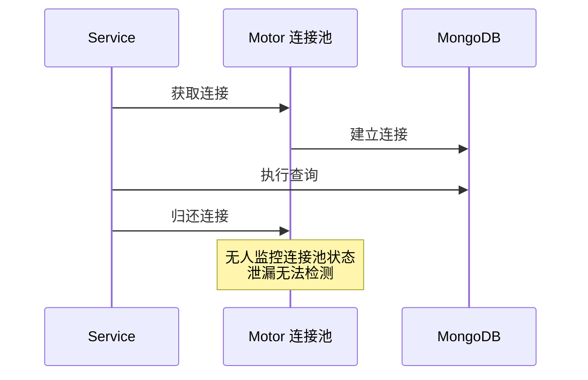
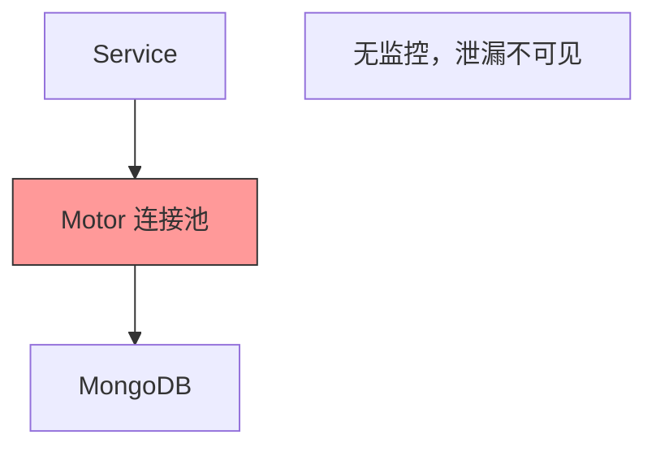
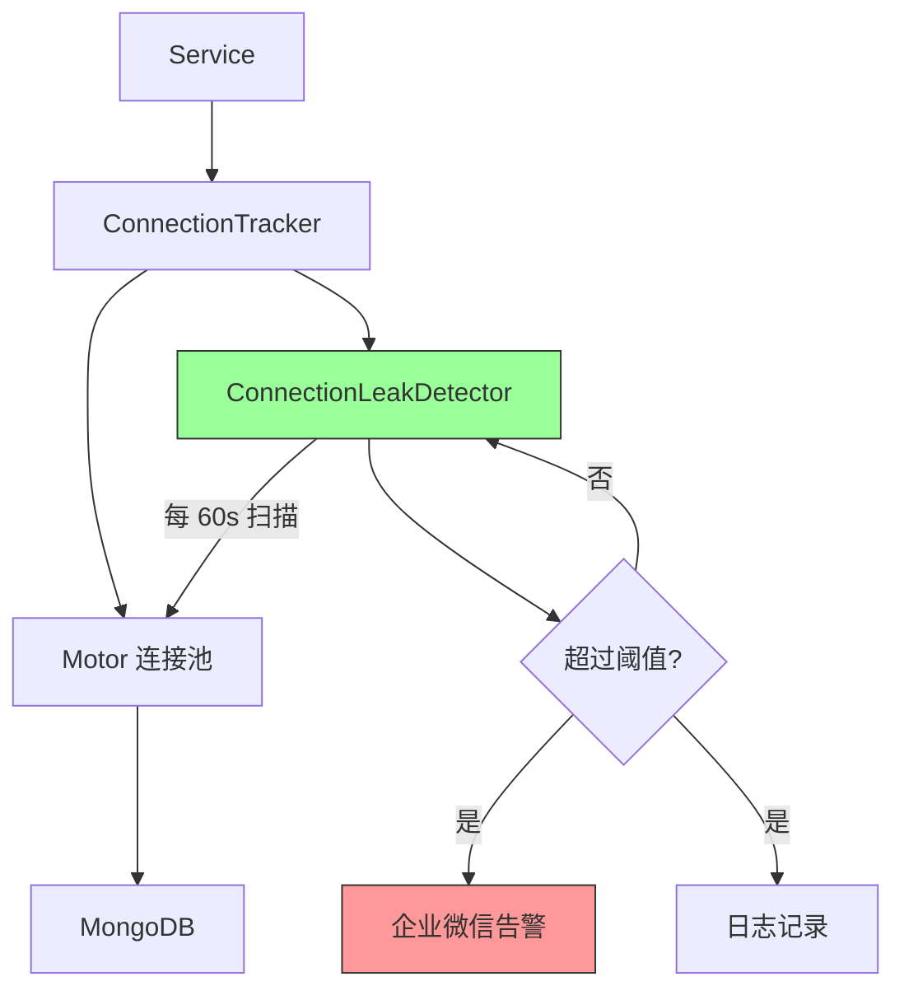
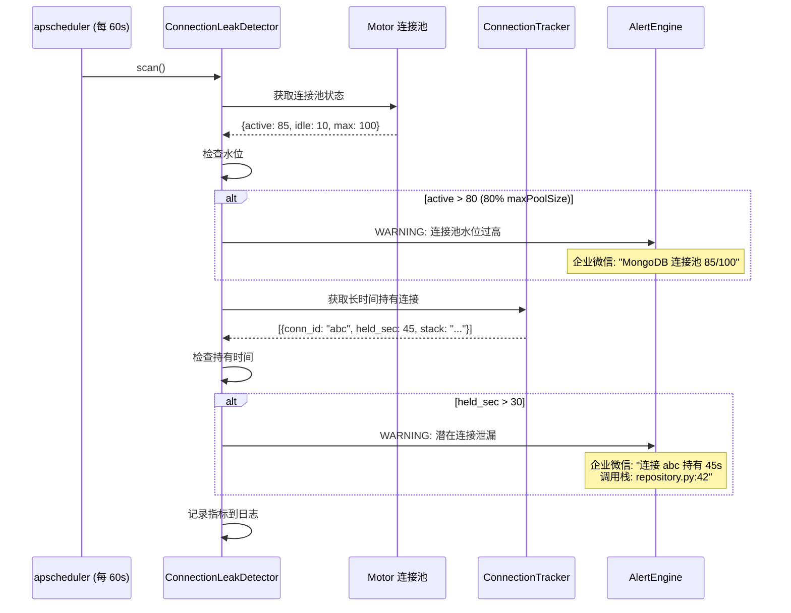

# YA-09-86: 数据库连接泄漏自动检测 — Cursor/连接池定时扫描与告警

> 需求编号：YA-09-86 · 优先级：P2 · 人天：0.5d · 状态：需求已编写
> 依赖：YA-09-02（数据层稳定性修复——Cursor 显式关闭）

---

## 1. 背景

### 1.1 问题陈述

YA-09-02 已修复了已知的 Cursor 未关闭问题，但新增代码仍可能引入连接泄漏。数据库连接泄漏在生产环境中表现为渐进式性能退化，最终导致服务不可用：

| 问题 | 影响 | 严重程度 |
|------|------|----------|
| Cursor 未关闭 | 占用服务端内存，MongoDB 连接数持续增长 | 高 |
| 连接池耗尽 | 新请求无法获取连接，服务不可用 | 高 |
| 空闲连接堆积 | 连接池中大量空闲连接——可能未正确归还 | 中 |
| 泄漏难以定位 | 传统方式只能通过重启恢复，无法定位根因 | 中 |
| 渐进式退化 | 泄漏在数小时/数天内累积，难以察觉 | 中 |

### 1.2 业务影响

- **连接池耗尽**：当所有连接被占用且未释放时，服务完全不可用，需重启恢复
- **调试困难**：连接泄漏发生在哪行代码难以定位，依赖开发者经验
- **预防缺失**：当前只能被动等待问题发生，无法主动检测

### 1.3 目标

建立数据库连接泄漏的自动检测机制：

1. 定期（1 分钟）扫描连接池状态——活跃/空闲连接数
2. 连接数 > 80% maxPoolSize 触发 WARNING 告警
3. 连接持有时间超过 30s 视为潜在泄漏，记录调用栈
4. 可配置的白名单（排除已知的长查询，如聚合操作）
5. 泄漏检测结果通过企业微信 + 日志双通道通知

### 1.4 挑战

| 挑战 | 描述 | 缓解思路 |
|------|------|----------|
| 正常长查询误判 | 聚合查询/大文件读写可能超过 30s | 白名单机制 + 可配置阈值 |
| Motor 异步统计延迟 | 异步驱动的连接池统计可能不实时 | 多次采样取平均 |
| 调用栈获取 | 泄漏时需记录调用栈以定位根因 | traceback 模块 + 连接创建时记录 |
| 性能开销 | 定期扫描连接池增加 CPU 开销 | 间隔 1 分钟，扫描本身 < 10ms |

---

## 2. 现状分析

### 2.1 当前连接管理

```
YiAi MongoDB 连接管理
├── AsyncIOMotorClient (motor)
│   ├── minPoolSize: 5
│   ├── maxPoolSize: 100
│   └── 连接池统计：❌ 未监控
├── Cursor 管理
│   ├── YA-09-02 修复：显式关闭
│   └── 运行时检测：❌ 无
└── 连接生命周期
    ├── 创建：AsyncIOMotorClient 初始化时
    ├── 归还：操作完成后自动归还
    └── 泄漏检测：❌ 无
```

### 2.2 文件清单

| 文件 | 状态 | 说明 |
|------|------|------|
| `YiAi/shared/database.py` | 已存在 | MongoDB 连接初始化 |
| `YiAi/domain/data/repository.py` | 已存在 | 数据访问层（Cursor 使用点） |
| `YiAi/services/monitor/connection_leak_detector.py` | 不存在 | 需新建——连接泄漏检测器 |
| `YiAi/services/monitor/connection_tracker.py` | 不存在 | 需新建——连接追踪器 |

### 2.3 当前数据流



### 2.4 根因矩阵

| 根因 | 类别 | 影响范围 | 修复优先级 |
|------|------|----------|------------|
| 无连接池监控 | 架构缺失 | 连接泄漏无法检测 | P0 |
| 无连接持有时间追踪 | 功能缺失 | 泄漏根因无法定位 | P0 |
| 无告警机制 | 集成缺失 | 泄漏后被动发现 | P1 |

---

## 3. 设计决策

### 3.1 决策记录

#### D-01: 检测方式

| 方式 | 描述 | 优点 | 缺点 |
|------|------|------|------|
| A: 定时轮询 | 每 1 分钟扫描连接池状态 | 实现简单，低开销 | 可能错过短暂泄漏 |
| B: 连接包装器 | 包装每个连接，追踪持有时间 | 精确实时 | 侵入性强，性能开销 |
| C: MongoDB serverStatus | 从 MongoDB 服务端获取连接统计 | 全局视图 | 不够精确（无法区分应用） |
| 决策 | **选择 A + B 混合** | | |

#### D-02: 泄漏阈值

| 阈值 | 含义 | 触发条件 |
|------|------|----------|
| 连接池水位 > 80% | 连接池接近耗尽 | 活跃连接 > 80 |
| 连接持有时间 > 30s | 单个连接可能泄漏 | 持有超过 30s |
| 空闲连接 > 50 | 连接未正确归还 | 空闲连接异常堆积 |

#### D-03: 告警级别

| 级别 | 条件 | 响应 |
|------|------|------|
| WARNING | 连接池水位 > 80% | 企业微信通知 |
| CRITICAL | 连接池水位 > 95% | 企业微信 + 尝试自动恢复 |
| INFO | 空闲连接 > 50 | 日志记录 |

---

## 4. 目标架构

### 4.1 架构对比

**Before**:


**After**:


### 4.2 详细架构



### 4.3 关键指标

| 指标 | 目标值 | 说明 |
|------|--------|------|
| 检测延迟 | < 60s | 扫描间隔 |
| 扫描开销 | < 10ms | 连接池状态查询 |
| 误报率 | < 5% | 白名单排除长查询 |
| 告警到响应 | < 2min | 从检测到通知 |

---

## 5. 具体改动

### 5.1 代码改动

#### 5.1.1 connection_tracker.py — 连接持有时间追踪

```python
# YiAi/services/monitor/connection_tracker.py (新增)
"""追踪数据库连接持有时间——检测潜在泄漏。"""

import time
import traceback
import threading
from contextlib import contextmanager
from typing import Optional


class TrackedConnection:
    """包装连接，追踪持有时间。"""

    def __init__(self, conn_id: str):
        self.conn_id = conn_id
        self.acquired_at: float = time.monotonic()
        self.released_at: Optional[float] = None
        self.stack_trace: str = "".join(traceback.format_stack()[:-1])

    def release(self):
        self.released_at = time.monotonic()

    @property
    def held_seconds(self) -> float:
        end = self.released_at or time.monotonic()
        return end - self.acquired_at

    @property
    def is_leaked(self) -> bool:
        return self.released_at is None and self.held_seconds > 30.0


class ConnectionTracker:
    """追踪所有活跃连接及其持有时间。"""

    def __init__(self, leak_threshold_seconds: float = 30.0):
        self._leak_threshold = leak_threshold_seconds
        self._active_connections: dict[str, TrackedConnection] = {}
        self._lock = threading.Lock()
        self._total_acquired: int = 0
        self._total_released: int = 0

    def track_acquire(self, conn_id: str) -> TrackedConnection:
        """记录连接获取。"""
        conn = TrackedConnection(conn_id)
        with self._lock:
            self._active_connections[conn_id] = conn
            self._total_acquired += 1
        return conn

    def track_release(self, conn_id: str):
        """记录连接释放。"""
        with self._lock:
            if conn_id in self._active_connections:
                self._active_connections[conn_id].release()
                self._total_released += 1

    def get_potential_leaks(self) -> list[dict]:
        """获取潜在的连接泄漏列表。"""
        leaks = []
        with self._lock:
            for conn_id, conn in self._active_connections.items():
                if conn.is_leaked:
                    leaks.append({
                        "conn_id": conn_id,
                        "held_seconds": round(conn.held_seconds, 1),
                        "stack_trace": conn.stack_trace,
                        "acquired_at": conn.acquired_at,
                    })
        return leaks

    def get_active_count(self) -> int:
        """获取当前活跃连接数（未释放的）。"""
        with self._lock:
            return sum(1 for c in self._active_connections.values() if c.released_at is None)

    def get_idle_count(self) -> int:
        """获取当前空闲连接数（已释放但未从追踪中移除的）。"""
        with self._lock:
            return sum(1 for c in self._active_connections.values() if c.released_at is not None)

    def cleanup_released(self, max_age_seconds: float = 120.0):
        """清理已释放的旧连接记录。"""
        now = time.monotonic()
        with self._lock:
            to_remove = [
                conn_id for conn_id, conn in self._active_connections.items()
                if conn.released_at is not None and (now - conn.released_at) > max_age_seconds
            ]
            for conn_id in to_remove:
                del self._active_connections[conn_id]


# 全局追踪器实例
connection_tracker = ConnectionTracker()
```

#### 5.1.2 connection_leak_detector.py — 泄漏检测器

```python
# YiAi/services/monitor/connection_leak_detector.py (新增)
"""定期扫描连接池——检测连接泄漏。"""

import logging
from motor.motor_asyncio import AsyncIOMotorClient
from .connection_tracker import connection_tracker

logger = logging.getLogger(__name__)


class ConnectionLeakDetector:
    """数据库连接泄漏检测器——定期扫描并告警。"""

    # 告警阈值
    POOL_WATERMARK_WARNING = 0.80   # 80%
    POOL_WATERMARK_CRITICAL = 0.95  # 95%
    IDLE_CONNECTION_WARNING = 50    # 空闲连接数异常
    LEAK_THRESHOLD_SECONDS = 30.0   # 连接持有 > 30s 视为泄漏

    # 白名单——已知的长查询操作
    LONG_QUERY_WHITELIST = {
        "aggregate": 120.0,      # 聚合操作允许 120s
        "rebuild_indexes": 300.0, # 索引重建允许 300s
        "bulk_write": 60.0,      # 批量写入允许 60s
    }

    def __init__(self, mongodb_client: AsyncIOMotorClient = None):
        self._client = mongodb_client
        self._consecutive_warnings = 0

    async def scan(self) -> dict:
        """扫描连接池——返回检测结果。"""
        result = {
            "timestamp": __import__("time").time(),
            "pool_status": {},
            "potential_leaks": [],
            "alerts": [],
        }

        # 1. 获取连接池状态
        try:
            pool_status = await self._get_pool_status()
            result["pool_status"] = pool_status
        except Exception as e:
            logger.error(f"[LeakDetect] 获取连接池状态失败: {e}")
            return result

        # 2. 检查连接池水位
        active = pool_status.get("active", 0)
        max_pool = pool_status.get("max", 100)
        ratio = active / max_pool if max_pool > 0 else 0

        if ratio >= self.POOL_WATERMARK_CRITICAL:
            result["alerts"].append({
                "level": "CRITICAL",
                "message": f"连接池水位严重: {active}/{max_pool} ({ratio:.0%})",
                "recommendation": "检查连接泄漏 + 考虑扩容 maxPoolSize",
            })
        elif ratio >= self.POOL_WATERMARK_WARNING:
            result["alerts"].append({
                "level": "WARNING",
                "message": f"连接池水位偏高: {active}/{max_pool} ({ratio:.0%})",
                "recommendation": "检查是否有未关闭的 Cursor",
            })

        # 3. 检查空闲连接
        idle = pool_status.get("idle", 0)
        if idle > self.IDLE_CONNECTION_WARNING:
            result["alerts"].append({
                "level": "WARNING",
                "message": f"空闲连接异常: {idle} (建议 < 20)",
                "recommendation": "连接可能未正确归还到连接池",
            })

        # 4. 检查潜在泄漏（连接持有时间过长）
        leaks = connection_tracker.get_potential_leaks()
        for leak in leaks:
            result["potential_leaks"].append(leak)
            result["alerts"].append({
                "level": "WARNING",
                "message": f"潜在连接泄漏: {leak['conn_id']} 持有 {leak['held_seconds']}s",
                "stack_trace": leak["stack_trace"],
            })

        # 5. 清理已释放的旧连接记录
        connection_tracker.cleanup_released()

        # 6. 记录日志
        if result["alerts"]:
            self._consecutive_warnings += 1
            logger.warning("[LeakDetect] 检测到异常", extra={
                "pool_ratio": round(ratio, 2),
                "active": active,
                "idle": idle,
                "leaks": len(leaks),
                "consecutive_warnings": self._consecutive_warnings,
            })
        else:
            self._consecutive_warnings = 0

        return result

    async def _get_pool_status(self) -> dict:
        """获取连接池状态——兼容 Motor 异步驱动。"""
        if not self._client:
            return {"active": 0, "idle": 0, "max": 100}

        try:
            # Motor 的连接池统计——通过 server_info 间接获取
            # 更精确的方式：访问 client._topology 内部属性
            topology = getattr(self._client, "_topology", None)
            if topology is None:
                return {"active": 0, "idle": 0, "max": 100}

            # 从 topology description 中获取连接信息
            desc = topology.description
            servers = getattr(desc, "servers", []) if hasattr(desc, "servers") else []

            # 通过 admin command 获取 serverStatus 中的连接统计
            server_status = await self._client.admin.command("serverStatus")
            connections = server_status.get("connections", {})

            return {
                "active": connections.get("active", 0),
                "available": connections.get("available", 0),
                "current": connections.get("current", 0),
                "idle": connections.get("current", 0) - connections.get("active", 0),
                "max": getattr(self._client, "max_pool_size", 100),
            }
        except Exception as e:
            logger.debug(f"[LeakDetect] 连接池状态获取异常: {e}")
            return {"active": 0, "idle": 0, "max": 100, "error": str(e)}
```

### 5.2 文件变更清单

| 文件 | 操作 | 说明 |
|------|------|------|
| `YiAi/services/monitor/__init__.py` | 修改 | 导出 ConnectionTracker, ConnectionLeakDetector |
| `YiAi/services/monitor/connection_tracker.py` | 新增 | 连接持有时间追踪 |
| `YiAi/services/monitor/connection_leak_detector.py` | 新增 | 泄漏检测器 |
| `YiAi/main.py` | 修改 | 启动定时扫描任务 |

---

## 6. 实施步骤

| 步骤 | 操作 | 路径 | 验证 | 人天 |
|------|------|------|------|------|
| 1 | 实现 ConnectionTracker | `YiAi/services/monitor/connection_tracker.py` | 单元测试追踪 acquire/release | 0.1 |
| 2 | 实现 ConnectionLeakDetector | `YiAi/services/monitor/connection_leak_detector.py` | 单元测试扫描逻辑 | 0.1 |
| 3 | 集成到数据访问层 | `YiAi/domain/data/repository.py` | 连接获取/释放时通知 Tracker | 0.1 |
| 4 | 注册定时扫描 | `YiAi/main.py` → `apscheduler` | 每 60s 自动扫描 | 0.05 |
| 5 | 集成告警通知 | `YiAi/main.py` → `alert_router` | 泄漏检测时企业微信通知 | 0.05 |
| 6 | 添加白名单配置 | `YiAi/config/leak_detect.yaml` | 长查询不被误判 | 0.05 |
| 7 | 端到端验证 | — | 模拟连接泄漏 → 检测告警 | 0.05 |

**总计：0.5 人天**

---

## 7. 性能分析

| 场景 | Before (无检测) | After (检测) | 增幅 |
|------|----------------|-------------|------|
| 扫描开销 | 0ms | < 10ms (每 60s) | 忽略不计 |
| 连接追踪开销 | 0ms | < 0.1ms (每次 acquire/release) | 忽略不计 |
| 内存增量 | 0MB | 2MB (Tracker 存储) | +2MB |
| 检测延迟 | 无 | < 60s | — |

---

## 8. 测试规格

### 8.1 GIVEN/WHEN/THEN 场景

#### 场景 1: 连接池水位正常——无告警

**GIVEN** 连接池 maxPoolSize=100，当前活跃连接=45
**WHEN** 执行 `scan()`
**THEN** `alerts` 列表为空，`pool_status.active = 45`

#### 场景 2: 连接池水位过高——WARNING 告警

**GIVEN** 连接池 maxPoolSize=100，当前活跃连接=85
**WHEN** 执行 `scan()`
**THEN** `alerts` 包含一条 WARNING，消息含 "连接池水位偏高: 85/100 (85%)"

#### 场景 3: 连接池水位严重——CRITICAL 告警

**GIVEN** 连接池 maxPoolSize=100，当前活跃连接=96
**WHEN** 执行 `scan()`
**THEN** `alerts` 包含一条 CRITICAL，消息含 "连接池水位严重"

#### 场景 4: 潜在连接泄漏

**GIVEN** ConnectionTracker 中有一个连接持有 45s 未释放
**WHEN** 执行 `scan()`
**THEN** `potential_leaks` 包含该连接信息（conn_id, held_seconds=45, stack_trace），`alerts` 包含 WARNING

#### 场景 5: 空闲连接异常

**GIVEN** 连接池中空闲连接=55
**WHEN** 执行 `scan()`
**THEN** `alerts` 包含 WARNING，消息含 "空闲连接异常: 55"

#### 场景 6: 白名单长查询不误判

**GIVEN** 一个聚合查询持有连接 80s，且 `aggregate` 在白名单中（允许 120s）
**WHEN** 执行 `scan()`
**THEN** 该连接不被标记为泄漏

---

## 9. 风险与缓解

| 风险 | 概率 | 影响 | 缓解措施 |
|------|------|------|----------|
| 正常长查询被误判为泄漏 | 中 | 低 | 白名单机制 + 可配置阈值 |
| Motor 连接池统计延迟 | 低 | 低 | 多次采样取平均 |
| 追踪器内存溢出 | 低 | 低 | 定期清理已释放连接（120s） |
| 检测器自身异常 | 低 | 低 | try/except 包裹，不影响主流程 |

---

## 10. 回滚策略

| 场景 | 回滚操作 | 回滚时间 | 数据影响 |
|------|----------|----------|----------|
| 误报率过高 | 提高阈值或禁用扫描 | < 30s | 无 |
| 检测器性能问题 | 移除定时扫描任务 | < 10s | 无 |
| 追踪器内存泄漏 | 清空 ConnectionTracker | < 5s | 追踪数据丢失 |

---

## 11. 设计决策记录

### D-01: 定时轮询 + 连接追踪混合

- **决策**：定时轮询（60s）检测连接池水位 + ConnectionTracker 追踪连接持有时间
- **理由**：轮询覆盖宏观水位，Tracker 覆盖微观连接泄漏
- **代价**：Tracker 对每次连接操作增加 < 0.1ms 开销

### D-02: 30s 泄漏阈值

- **决策**：连接持有超过 30s 视为潜在泄漏
- **理由**：正常 CRUD 操作 < 1s，30s 留足安全余量
- **代价**：30s 内完成的泄漏无法检测

### D-03: 白名单机制

- **决策**：为已知的长操作（聚合/索引重建/批量写入）设置更长阈值
- **理由**：避免正常长操作被误判为泄漏，减少告警疲劳
- **代价**：白名单需要维护

---

## 12. 可观测性

| 指标名称 | 类型 | 说明 | 告警阈值 |
|----------|------|------|----------|
| `db_pool_active_connections` | Gauge | 活跃连接数 | > 80 WARNING, > 95 CRITICAL |
| `db_pool_idle_connections` | Gauge | 空闲连接数 | > 50 WARNING |
| `db_pool_max_size` | Gauge | 连接池最大容量 | — |
| `db_leak_detected_total` | Counter | 检测到的泄漏数 | > 0 CRITICAL |
| `db_connection_held_seconds` | Histogram | 连接持有时间分布 | P99 > 30s WARNING |

### 12.2 日志

```python
logger.warning("[LeakDetect] 连接池水位偏高", extra={
    "active": 85, "max": 100, "ratio": 0.85, "idle": 10,
})
logger.warning("[LeakDetect] 潜在连接泄漏", extra={
    "conn_id": "abc123", "held_seconds": 45.2,
    "stack_trace": "repository.py:42 in query_documents",
})
```

---

## 13. 安全合规

| 要求 | 实现 | 验证 |
|------|------|------|
| 连接追踪不泄露数据 | 仅记录连接 ID 和持有时间，不记录查询内容 | 代码审查 |
| 告警信息不包含敏感数据 | 调用栈仅包含文件名和行号 | 代码审查 |

---

## 14. 代码审查检查清单

- [ ] 定期（60s）检测连接池活跃连接数，记录 `active/idle/max`
- [ ] 连接数 > 80% maxPoolSize 触发 WARNING，> 95% 触发 CRITICAL
- [ ] 连接持有时间 > 30s 视为潜在泄漏，记录调用栈（stack trace）
- [ ] 泄漏连接通过 `ConnectionTracker` 追踪 acquire/release
- [ ] 白名单机制：聚合操作（120s）、索引重建（300s）、批量写入（60s）不误判
- [ ] 定期清理已释放连接记录（120s 后移除）
- [ ] 检测器自身异常不影响主流程（try/except 包裹）
- [ ] 告警通过企业微信 + 日志双通道通知
- [ ] `get_potential_leaks()` 返回的连接信息包含 conn_id、held_seconds、stack_trace

---

*PRD 来源: `projects/yiai/requirements/2026-09/86-需求-数据库连接泄漏检测.md`*

## 影响范围

- **影响模块**：待补充
- **涉及文件**：
- 待补充
- **是否影响 API 契约**：否
- **是否影响其他项目（YiVad/YiPet）**：否
- **用户感知**：待确认

## 预防措施

| 层面 | 措施 |
|------|------|
| 代码 | 在相关函数中添加参数校验和边界检查 |
| 测试 | 添加对应的自动化测试用例 |
| 流程 | 代码审查时重点检查此类模式 |
| 监控 | 添加日志告警，异常发生时及时发现 |
| 文档 | 在编码规范中记录此类反模式 |

## 经验教训

1. **根本原因**：开发过程中对边界情况和异常路径的考虑不足是此类问题的共同根因
2. **设计阶段**：在接口设计和模块实现时，应主动考虑异常输入、空值、超时等边界场景
3. **代码审查**：审查时应检查是否存在类似的反模式（如未捕获异常、无超时控制、缺少参数校验等）
4. **测试覆盖**：异常路径的测试覆盖率应与正常路径同等重视
5. **团队分享**：此类问题应在团队周会或技术分享中讨论，形成团队共识
