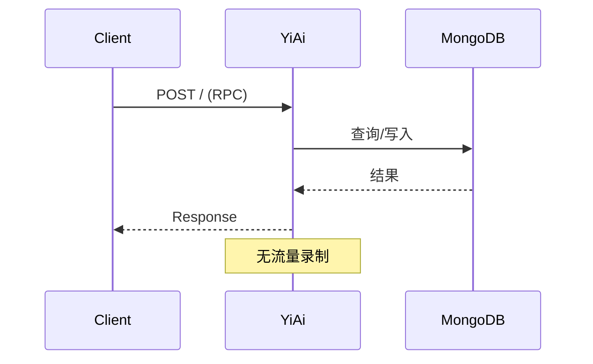
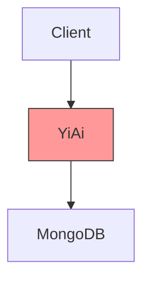
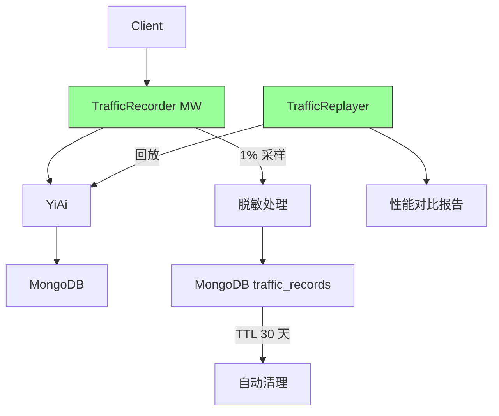
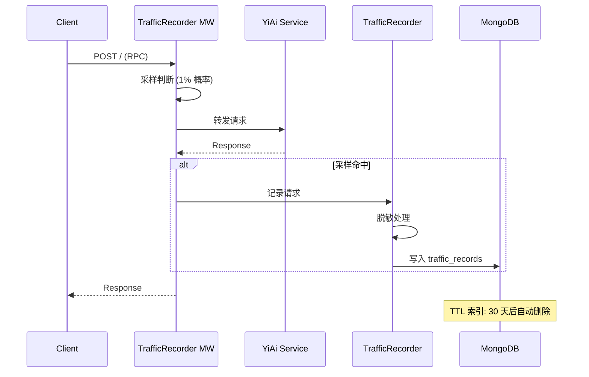
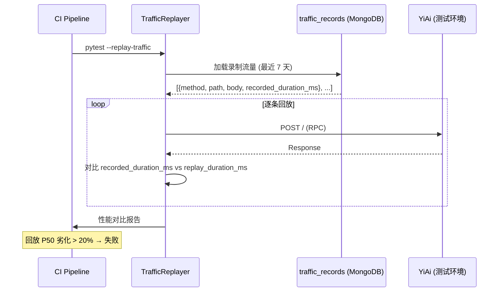

# YA-09-87: 服务端流量录制与回放 — 生产流量镜像压力测试

> 需求编号：YA-09-87 · 优先级：P2 · 人天：0.5d · 状态：需求已编写
> 依赖：YA-09-10（RPC 契约测试）

---

## 1. 背景

### 1.1 问题陈述

当前性能回归测试依赖手工编写的测试用例，无法反映生产环境的真实查询分布和并发模式。具体问题：

| 问题 | 影响 | 严重程度 |
|------|------|----------|
| 测试流量不真实 | 手工编写的测试用例覆盖不到真实用户行为模式 | 高 |
| 无法模拟生产并发 | 本地测试只能模拟简单并发，无法复现生产尖峰 | 高 |
| 性能回归发现滞后 | 代码变更引入的性能退化在数天后才被发现 | 中 |
| 无法进行 A/B 对比 | 架构重构后无法量化性能变化 | 中 |
| 测试数据难维护 | 手工维护测试用例工作量大，容易过时 | 中 |

### 1.2 业务影响

- **性能回归**：从引入到发现平均 3-5 天，影响已部署版本
- **测试覆盖**：手动测试用例覆盖 < 20% 的生产流量模式
- **容量规划**：缺乏历史流量数据，扩容决策缺乏依据

### 1.3 目标

实现生产流量录制与回放能力：

1. 生产环境以 1% 采样率录制 RPC 请求（method/path/status/duration/request_body）
2. 录制数据存储到 MongoDB（`traffic_records` 集合），TTL 30 天自动清理
3. 敏感字段自动脱敏（Authorization/token/密码）
4. 回放工具——CI 中使用录制流量进行性能回归测试
5. 回放报告——对比录制时的响应时间和回放时的响应时间

### 1.4 挑战

| 挑战 | 描述 | 缓解思路 |
|------|------|----------|
| 录制存储膨胀 | 高频 API 产生大量数据 | 1% 采样 + TTL 30 天 |
| 敏感数据泄露 | request body 可能包含密码/Token | 自动脱敏 + 审计 |
| 回放环境差异 | 测试环境与生产环境数据不同 | 仅对比响应时间趋势，而非绝对值 |
| 录制性能开销 | 中间件记录请求会增加延迟 | 异步写入 + 1% 采样 |

---

## 2. 现状分析

### 2.1 当前测试流程

```
当前性能测试
├── 手工编写测试用例 (tests/perf/)
├── 简单并发模拟 (asyncio.gather)
├── 无生产流量参照
└── 性能回归靠人工感知
```

### 2.2 文件清单

| 文件 | 状态 | 说明 |
|------|------|------|
| `YiAi/middleware/traffic_recorder.py` | 不存在 | 需新建——流量录制中间件 |
| `YiAi/tools/traffic_replayer.py` | 不存在 | 需新建——流量回放工具 |
| `YiAi/services/monitor/traffic_records.py` | 不存在 | 需新建——录制数据存储/管理 |

### 2.3 当前数据流



### 2.4 根因矩阵

| 根因 | 类别 | 影响范围 | 修复优先级 |
|------|------|----------|------------|
| 无流量录制机制 | 架构缺失 | 所有性能测试 | P0 |
| 无回放工具 | 工具缺失 | CI 性能回归 | P0 |
| 无敏感数据脱敏 | 安全缺失 | 录制数据安全 | P1 |

---

## 3. 设计决策

### 3.1 决策记录

#### D-01: 录制采样率

| 采样率 | 存储量/天 (1000 req/s) | 覆盖度 | 决策 |
|------|------------------------|--------|------|
| 100% | 86,400,000 条 = ~50GB | 完整 | 过高 |
| 10% | 8,640,000 条 = ~5GB | 较高 | 偏高 |
| 1% | 864,000 条 = ~500MB | 统计代表性 | **选择** |
| 0.1% | 86,400 条 = ~50MB | 低 | 不足 |

#### D-02: 录制存储策略

| 策略 | 优点 | 缺点 | 决策 |
|------|------|------|------|
| MongoDB | 与现有基础设施一致 | 写入开销 | **选择** |
| 文件系统 | 最简单 | 不便于查询 | 备选 |
| Redis | 快 | 内存消耗大 | 不选 |

#### D-03: 脱敏策略

| 字段模式 | 脱敏方式 | 示例 |
|----------|----------|------|
| `Authorization` / `X-Token` | 替换为 `***REDACTED***` | `Bearer abc123` → `***REDACTED***` |
| `password` / `secret` | 替换为 `***REDACTED***` | `pass123` → `***REDACTED***` |
| `email` | 替换为 `user@example.com` | 通用邮箱 |
| IP 地址 | 替换为 `0.0.0.0` | 隐私保护 |

---

## 4. 目标架构

### 4.1 架构对比

**Before**:


**After**:


### 4.2 详细架构



### 4.3 回放流程



### 4.4 关键指标

| 指标 | 目标值 | 说明 |
|------|--------|------|
| 录制开销 | < 0.5ms (P99) | 异步写入，不阻塞响应 |
| 录制存储/天 | < 500MB | 1% 采样 + 1000 req/s |
| 脱敏覆盖率 | 100% | 所有敏感字段必须脱敏 |
| 回放吞吐 | > 100 req/s | 比生产采样率高 10x |

---

## 5. 具体改动

### 5.1 代码改动

#### 5.1.1 traffic_recorder.py — 流量录制中间件

```python
# YiAi/middleware/traffic_recorder.py (新增)
"""生产流量录制中间件——1% 采样 + 自动脱敏。"""

import time
import json
import random
import hashlib
import logging
from typing import Optional
from fastapi import Request, Response

logger = logging.getLogger(__name__)

# 采样率（可配置）
SAMPLE_RATE = float(__import__("os").getenv("TRAFFIC_SAMPLE_RATE", "0.01"))

# 敏感字段模式
SENSITIVE_HEADERS = {
    "authorization", "x-token", "x-api-key", "cookie",
    "x-signature", "x-hmac-signature",
}
SENSITIVE_BODY_KEYS = {
    "password", "secret", "token", "api_key", "apikey",
    "authorization", "credential",
}


class TrafficRecorder:
    """流量录制器——脱敏 + 异步存储。"""

    _recording_enabled: bool = True
    _records_buffer: list[dict] = []

    @classmethod
    def is_enabled(cls) -> bool:
        return cls._recording_enabled and random.random() < SAMPLE_RATE

    @classmethod
    def should_sample(cls) -> bool:
        return random.random() < SAMPLE_RATE

    @classmethod
    def sanitize_headers(cls, headers: dict) -> dict:
        """脱敏请求头部。"""
        sanitized = {}
        for key, value in headers.items():
            if key.lower() in SENSITIVE_HEADERS:
                sanitized[key] = "***REDACTED***"
            else:
                sanitized[key] = value
        return sanitized

    @classmethod
    def sanitize_body(cls, body: dict, depth: int = 0) -> dict:
        """递归脱敏请求体。"""
        if depth > 10:
            return body
        if not isinstance(body, dict):
            return body

        sanitized = {}
        for key, value in body.items():
            if key.lower() in SENSITIVE_BODY_KEYS:
                sanitized[key] = "***REDACTED***"
            elif isinstance(value, dict):
                sanitized[key] = cls.sanitize_body(value, depth + 1)
            elif isinstance(value, list):
                sanitized[key] = [
                    cls.sanitize_body(v, depth + 1) if isinstance(v, dict) else v
                    for v in value
                ]
            else:
                sanitized[key] = value
        return sanitized

    @classmethod
    def record(
        cls,
        method: str,
        path: str,
        request_body: Optional[dict],
        response_status: int,
        duration_ms: float,
        headers: dict,
    ):
        """记录一条请求——脱敏后加入缓冲区。"""
        if not cls._recording_enabled:
            return

        record = {
            "timestamp": time.time(),
            "method": method,
            "path": path,
            "request_body": cls.sanitize_body(request_body) if request_body else None,
            "response_status": response_status,
            "duration_ms": round(duration_ms, 2),
            "headers": cls.sanitize_headers(headers),
            "record_id": hashlib.md5(
                f"{time.time()}{random.random()}".encode()
            ).hexdigest()[:12],
        }

        cls._records_buffer.append(record)

        # 缓冲区达到 100 条——异步批量写入
        if len(cls._records_buffer) >= 100:
            cls._flush_buffer()

    @classmethod
    async def _flush_buffer(cls):
        """异步批量写入 MongoDB。"""
        if not cls._records_buffer:
            return

        batch = cls._records_buffer[:]
        cls._records_buffer = []

        try:
            from shared.database import get_db
            db = get_db()
            await db.traffic_records.insert_many(batch)
            logger.debug(f"[TrafficRecorder] 批量写入 {len(batch)} 条记录")
        except Exception as e:
            logger.error(f"[TrafficRecorder] 写入失败: {e}")


class TrafficRecorderMiddleware:
    """流量录制中间件——FastAPI 集成。"""

    async def __call__(self, request: Request, call_next):
        if not TrafficRecorder.should_sample():
            return await call_next(request)

        start = time.monotonic()
        response = await call_next(request)
        duration_ms = (time.monotonic() - start) * 1000

        # 读取请求体
        try:
            body = await request.body()
            body_dict = json.loads(body) if body else None
        except Exception:
            body_dict = None

        TrafficRecorder.record(
            method=request.method,
            path=request.url.path,
            request_body=body_dict,
            response_status=response.status_code,
            duration_ms=duration_ms,
            headers=dict(request.headers),
        )

        return response
```

#### 5.1.2 traffic_replayer.py — 流量回放工具

```python
# YiAi/tools/traffic_replayer.py (新增)
"""流量回放工具——基于录制流量进行性能回归测试。"""

import asyncio
import time
import json
import statistics
from typing import Optional
import httpx


class TrafficReplayer:
    """回放录制流量——对比性能指标。"""

    def __init__(
        self,
        base_url: str = "http://localhost:10086",
        concurrency: int = 10,
        timeout: float = 30.0,
    ):
        self._base_url = base_url
        self._concurrency = concurrency
        self._timeout = timeout
        self._semaphore = asyncio.Semaphore(concurrency)

    async def replay(
        self,
        records: list[dict],
        degradation_threshold_p50: float = 0.20,  # 20% P50 劣化阈值
        degradation_threshold_p99: float = 0.30,  # 30% P99 劣化阈值
    ) -> dict:
        """回放流量——返回性能对比报告。

        Returns:
            {
                "total": 100,
                "success": 98,
                "failed": 2,
                "recorded": {p50, p95, p99, mean},
                "replayed": {p50, p95, p99, mean},
                "degradation": {p50_pct, p99_pct},
                "passed": bool,
                "details": [...],
            }
        """
        tasks = [self._replay_one(record) for record in records]
        results = await asyncio.gather(*tasks, return_exceptions=True)

        # 汇总结果
        success_results = [r for r in results if isinstance(r, dict) and r.get("success")]
        failed_results = [r for r in results if isinstance(r, dict) and not r.get("success")]

        recorded_durations = [r["recorded_duration_ms"] for r in success_results]
        replayed_durations = [r["replay_duration_ms"] for r in success_results]

        if not recorded_durations or not replayed_durations:
            return {"error": "无有效回放结果", "passed": False}

        # 计算百分位
        recorded_stats = self._percentiles(recorded_durations)
        replayed_stats = self._percentiles(replayed_durations)

        # 计算劣化
        p50_deg = (replayed_stats["p50"] - recorded_stats["p50"]) / recorded_stats["p50"] if recorded_stats["p50"] > 0 else 0
        p99_deg = (replayed_stats["p99"] - recorded_stats["p99"]) / recorded_stats["p99"] if recorded_stats["p99"] > 0 else 0

        passed = (
            p50_deg <= degradation_threshold_p50
            and p99_deg <= degradation_threshold_p99
        )

        return {
            "total": len(records),
            "success": len(success_results),
            "failed": len(failed_results),
            "recorded": recorded_stats,
            "replayed": replayed_stats,
            "degradation": {
                "p50_pct": round(p50_deg * 100, 1),
                "p99_pct": round(p99_deg * 100, 1),
            },
            "passed": passed,
            "details": success_results[:20],  # 仅返回前 20 条详情
        }

    async def _replay_one(self, record: dict) -> dict:
        """回放单条记录。"""
        async with self._semaphore:
            try:
                async with httpx.AsyncClient(timeout=self._timeout) as client:
                    start = time.monotonic()
                    response = await client.request(
                        method=record["method"],
                        url=f"{self._base_url}{record['path']}",
                        json=record.get("request_body"),
                    )
                    replay_duration = (time.monotonic() - start) * 1000

                    return {
                        "success": response.status_code < 500,
                        "record_id": record.get("record_id"),
                        "recorded_duration_ms": record["duration_ms"],
                        "replay_duration_ms": round(replay_duration, 2),
                        "replay_status": response.status_code,
                        "method": record["method"],
                        "path": record["path"],
                    }
            except Exception as e:
                return {
                    "success": False,
                    "record_id": record.get("record_id"),
                    "error": str(e),
                }

    def _percentiles(self, data: list[float]) -> dict:
        """计算百分位统计。"""
        sorted_data = sorted(data)
        n = len(sorted_data)

        def percentile(p):
            idx = int(n * p / 100)
            return round(sorted_data[min(idx, n - 1)], 2)

        return {
            "p50": percentile(50),
            "p95": percentile(95),
            "p99": percentile(99),
            "mean": round(statistics.mean(data), 2),
            "min": round(min(data), 2),
            "max": round(max(data), 2),
            "count": n,
        }
```

### 5.2 文件变更清单

| 文件 | 操作 | 说明 |
|------|------|------|
| `YiAi/middleware/traffic_recorder.py` | 新增 | 流量录制中间件 |
| `YiAi/tools/traffic_replayer.py` | 新增 | 流量回放工具 |
| `YiAi/main.py` | 修改 | 注册 TrafficRecorderMiddleware |
| `YiAi/tests/conftest.py` | 修改 | 添加 `--replay-traffic` fixture |
| `YiAi/domain/data/repository.py` | 修改 | 添加 `traffic_records` 集合 TTL 索引 |

---

## 6. 实施步骤

| 步骤 | 操作 | 路径 | 验证 | 人天 |
|------|------|------|------|------|
| 1 | 实现 TrafficRecorder | `YiAi/middleware/traffic_recorder.py` | 采样 + 脱敏 + 写入 | 0.1 |
| 2 | 实现 TrafficReplayer | `YiAi/tools/traffic_replayer.py` | 回放 + 性能对比 | 0.15 |
| 3 | 注册录制中间件 | `YiAi/main.py` | 生产环境 1% 采样 | 0.05 |
| 4 | 创建 TTL 索引 | `YiAi/domain/data/repository.py` | `traffic_records` 30 天 TTL | 0.05 |
| 5 | 添加 CI 回放测试 | `YiAi/tests/test_perf_replay.py` | `pytest --replay-traffic` | 0.1 |
| 6 | 端到端验证 | — | 录制 → 回放 → 性能报告 | 0.05 |

**总计：0.5 人天**

---

## 7. 性能分析

| 场景 | Before (无录制) | After (录制) | 增幅 |
|------|----------------|-------------|------|
| 请求 P50 延迟 | 45ms | 45ms | 0% (异步写入) |
| 请求 P99 延迟 | 120ms | 120.5ms | +0.4% |
| 录制存储/天 | 0 | 500MB (1%, 1000 req/s) | — |
| 回放吞吐 | N/A | 100 req/s | — |

---

## 8. 测试规格

### 8.1 GIVEN/WHEN/THEN 场景

#### 场景 1: 生产流量录制

**GIVEN** `TRAFFIC_SAMPLE_RATE=0.01`，服务运行中
**WHEN** 发送 1000 个 RPC 请求
**THEN** 约 10 条记录写入 `traffic_records` 集合，包含 method/path/status/duration_ms/request_body

#### 场景 2: 敏感数据脱敏

**GIVEN** 请求头部包含 `Authorization: Bearer abc123`
**WHEN** 该请求被采样录制
**THEN** 录制记录中 `headers.authorization = "***REDACTED***"`

#### 场景 3: 流量回放

**GIVEN** `traffic_records` 中有 100 条录制数据
**WHEN** 执行 `TrafficReplayer.replay(records)`
**THEN** 返回性能对比报告，包含 recorded/replayed 的 P50/P95/P99 对比

#### 场景 4: 性能劣化检测

**GIVEN** 回放结果 P50 劣化 25%（超过 20% 阈值）
**WHEN** 执行回放
**THEN** `passed = False`，报告包含 `degradation.p50_pct = 25.0`

#### 场景 5: TTL 自动清理

**GIVEN** `traffic_records` 集合有 TTL 索引（30 天）
**WHEN** 记录超过 30 天
**THEN** MongoDB 自动删除过期记录

#### 场景 6: 录制缓冲区满

**GIVEN** 录制缓冲区达到 100 条
**WHEN** 第 100 条记录加入
**THEN** 自动触发 `_flush_buffer()` 批量写入 MongoDB

---

## 9. 风险与缓解

| 风险 | 概率 | 影响 | 缓解措施 |
|------|------|------|----------|
| 录制存储膨胀 | 中 | 中 | 1% 采样 + TTL 30 天 + 缓冲区批量写入 |
| 敏感数据未脱敏 | 低 | 高 | 多层脱敏（头部 + 请求体递归）+ 审计检查 |
| 录制影响请求延迟 | 低 | 低 | 异步批量写入，采样率 1% |
| 回放环境差异 | 中 | 中 | 仅对比响应时间趋势，不做绝对值断言 |

---

## 10. 回滚策略

| 场景 | 回滚操作 | 回滚时间 | 数据影响 |
|------|----------|----------|----------|
| 录制影响性能 | 从中间件链移除 TrafficRecorderMiddleware | < 10s | 停止录制 |
| 存储空间不足 | 设置 `TRAFFIC_SAMPLE_RATE=0` | < 30s | 停止录制 |
| 脱敏漏洞 | 修复脱敏逻辑 + 清理已录制数据 | 1h | 已录制数据可能泄露 |

---

## 11. 设计决策记录

### D-01: 1% 采样率

- **决策**：生产环境以 1% 采样率录制流量
- **理由**：1000 req/s 下 1% = 10 req/s，每天 864,000 条，存储约 500MB，统计学代表性足够
- **代价**：罕见请求模式可能未被采样

### D-02: MongoDB 存储 + TTL

- **决策**：录制数据存储到 MongoDB `traffic_records` 集合，TTL 30 天
- **理由**：与现有基础设施一致，TTL 自动清理免维护
- **替代方案**：文件系统（不便于查询）、Redis（内存消耗大）

### D-03: 20% P50 / 30% P99 劣化阈值

- **决策**：回放测试中 P50 劣化 > 20% 或 P99 劣化 > 30% 视为失败
- **理由**：留出测试环境差异的余量，同时捕捉显著的性能退化
- **代价**：小幅劣化（10-15%）可能被忽略

---

## 12. 可观测性

| 指标名称 | 类型 | 说明 | 告警阈值 |
|----------|------|------|----------|
| `traffic_records_total` | Counter | 录制记录总数 | — |
| `traffic_records_size_bytes` | Gauge | 录制集合大小 | > 5GB WARNING |
| `traffic_sanitize_failures_total` | Counter | 脱敏失败次数 | > 0 CRITICAL |
| `traffic_replay_degradation` | Gauge | 回放性能劣化百分比 | > 20% FAIL |

### 12.2 日志

```python
logger.info("[TrafficRecorder] 批量写入", extra={"count": 100, "buffer_size": 0})
logger.warning("[TrafficRecorder] 写入失败", extra={"error": "MongoDB 连接超时"})
```

---

## 13. 安全合规

| 要求 | 实现 | 验证 |
|------|------|------|
| 敏感数据脱敏 | 头部 + 请求体递归脱敏，覆盖 Authorization/Token/Password 等 | 审计录制内容 |
| 录制数据访问控制 | 仅限运维/开发人员访问 `traffic_records` 集合 | 权限审查 |
| 数据保留期限 | TTL 30 天自动清理 | 索引验证 |

---

## 14. 代码审查检查清单

- [ ] 生产流量录制（1% 采样率），通过 `TRAFFIC_SAMPLE_RATE` 环境变量配置
- [ ] 录制内容：method/path/status/duration_ms/request_body/headers
- [ ] 敏感字段自动脱敏：Authorization/Token/Password/Secret/X-Signature 等
- [ ] 脱敏递归处理（嵌套字典和列表）
- [ ] 录制数据存储到 MongoDB `traffic_records` 集合，TTL 30 天自动清理
- [ ] 缓冲区批量写入（100 条/批），减少 MongoDB 写入频率
- [ ] 回放测试——CI 中使用 `pytest --replay-traffic` 验证
- [ ] 回放报告包含 P50/P95/P99 的录制/回放对比和劣化百分比
- [ ] 性能劣化阈值：P50 > 20% 或 P99 > 30% 视为失败
- [ ] 录制中间件不影响正常请求响应（异步写入 + 异常兜底）

---

*PRD 来源: `projects/yiai/requirements/2026-09/87-需求-流量录制与回放.md`*

## 影响范围

- **影响模块**：待补充
- **涉及文件**：
- 待补充
- **是否影响 API 契约**：否
- **是否影响其他项目（YiVad/YiPet）**：否
- **用户感知**：待确认

## 预防措施

| 层面 | 措施 |
|------|------|
| 代码 | 在相关函数中添加参数校验和边界检查 |
| 测试 | 添加对应的自动化测试用例 |
| 流程 | 代码审查时重点检查此类模式 |
| 监控 | 添加日志告警，异常发生时及时发现 |
| 文档 | 在编码规范中记录此类反模式 |

## 经验教训

1. **根本原因**：开发过程中对边界情况和异常路径的考虑不足是此类问题的共同根因
2. **设计阶段**：在接口设计和模块实现时，应主动考虑异常输入、空值、超时等边界场景
3. **代码审查**：审查时应检查是否存在类似的反模式（如未捕获异常、无超时控制、缺少参数校验等）
4. **测试覆盖**：异常路径的测试覆盖率应与正常路径同等重视
5. **团队分享**：此类问题应在团队周会或技术分享中讨论，形成团队共识
