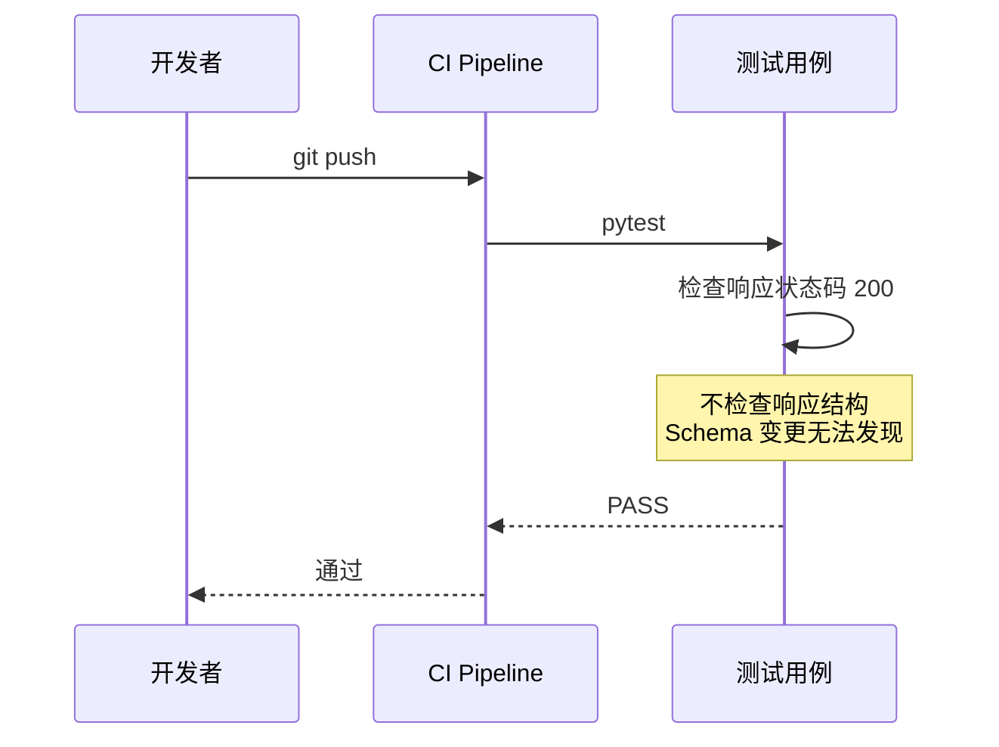
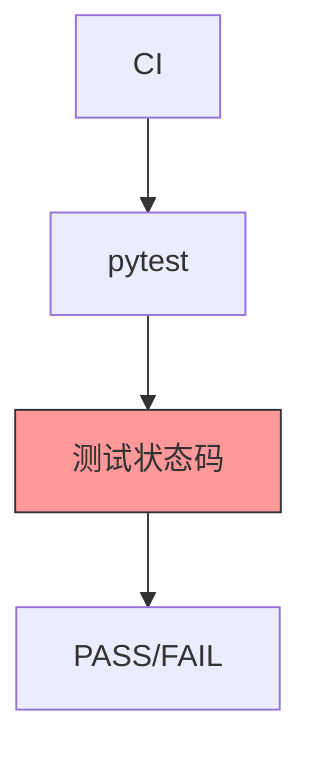
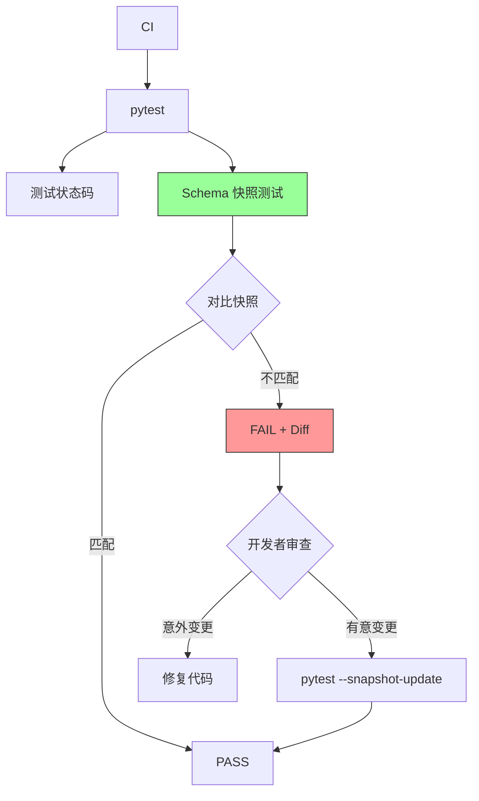
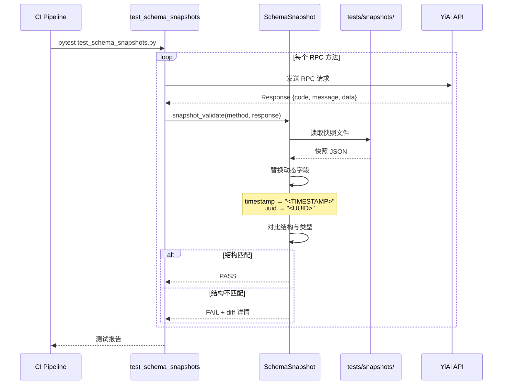

# YA-09-88: API 响应 Schema 快照测试 — JSON Schema 回归验证

> 需求编号：YA-09-88 · 优先级：P2 · 人天：0.5d · 状态：需求已编写
> 依赖：YA-09-10（RPC 契约测试与类型同步）

---

## 1. 背景

### 1.1 问题陈述

API 响应格式的意外变更（新增/删除/重命名字段、类型变更）是导致前端崩溃的最常见原因之一。当前 YiAi 缺乏系统化的响应 Schema 回归验证：

| 问题 | 影响 | 严重程度 |
|------|------|----------|
| 响应字段删除未感知 | 前端 `undefined` 访问导致白屏/功能异常 | 高 |
| 字段类型变更 | 前端类型校验失败，数据展示错误 | 高 |
| 新增必填字段 | 旧版本前端无法处理新字段 | 中 |
| 嵌套结构变更 | 深层嵌套路径变更导致数据提取失败 | 中 |
| 变更不可追溯 | 无法快速定位是哪个 commit 引入了变更 | 中 |

### 1.2 业务影响

- **前端崩溃**：响应 Schema 变更后 YiVad/YiPet 在 1-2 小时内发现（依赖用户反馈）
- **调试时间**：定位 Schema 变更根因平均 30-60 分钟
- **回滚决策**：缺乏数据支撑"是否应该回滚"

### 1.3 目标

建立 API 响应 Schema 快照测试体系：

1. 将每个 RPC 方法的响应 Schema 保存为快照文件（`tests/snapshots/`）
2. 每次 CI 运行自动对比实际响应 vs 快照 Schema
3. Schema 变更时明确审查 + 更新快照（`pytest --snapshot-update`）
4. 快照文件纳入 Git 版本控制（可追溯变更历史）
5. 动态字段（timestamp/uuid）自动替换为 placeholder

### 1.4 挑战

| 挑战 | 描述 | 缓解思路 |
|------|------|----------|
| 动态字段不稳定 | timestamp/uuid 每次不同导致快照对比失败 | 自动替换为 placeholder |
| 快照文件膨胀 | 每端点生成大量快照 | 仅存储关键响应 + 分页裁剪 |
| 快照维护成本 | 新接口需要手动创建快照 | 自动生成初始快照 |
| 误报 | 合法的 Schema 演进被误判为断裂 | 通过 `--snapshot-update` 明确更新 |

---

## 2. 现状分析

### 2.1 当前测试覆盖

```
YiAi 当前测试
├── 单元测试：76 个 (pytest)
├── 集成测试：API 端点测试
├── RPC 契约测试：YA-09-10 校验参数
└── ❌ 响应 Schema 测试：无
    ├── ❌ 无 Schema 快照
    ├── ❌ 无回归对比
    └── ❌ 无变更审查
```

### 2.2 文件清单

| 文件 | 状态 | 说明 |
|------|------|------|
| `YiAi/tests/snapshots/` | 不存在 | 需新建——快照存储目录 |
| `YiAi/tests/conftest.py` | 已存在 | 需修改——添加 snapshot fixture |
| `YiAi/tests/test_schema_snapshots.py` | 不存在 | 需新建——快照测试用例 |
| `YiAi/shared/schema_snapshot.py` | 不存在 | 需新建——快照生成/对比工具 |

### 2.3 当前数据流



### 2.4 根因矩阵

| 根因 | 类别 | 影响范围 | 修复优先级 |
|------|------|----------|------------|
| 无响应 Schema 验证 | 测试缺失 | 所有 API 端点 | P0 |
| 无快照机制 | 工具缺失 | 回归测试 | P0 |
| 无 Schema 变更审查 | 流程缺失 | 变更管理 | P1 |

---

## 3. 设计决策

### 3.1 决策记录

#### D-01: 快照格式

| 格式 | 优点 | 缺点 | 决策 |
|------|------|------|------|
| JSON Schema | 标准化，可验证类型 | 生成复杂 | 备选 |
| 简化 JSON 结构 | 直观，易读 | 不支持类型验证 | **选择** |
| YAML | 可读性好 | 解析复杂 | 不选 |

#### D-02: 动态字段处理

| 策略 | 示例 | 说明 |
|------|------|------|
| 替换为 placeholder | `timestamp` → `"<TIMESTAMP>"` | 快照中标记为动态字段 |
| 忽略字段 | 跳过 timestamp/uuid | 可能遗漏字段删除 |
| 正则匹配 | `\d{10}` 匹配 timestamp | 复杂，容易出错 |
| 决策 | **选择替换为 placeholder** | |

#### D-03: 快照更新策略

| 策略 | 优点 | 缺点 | 决策 |
|------|------|------|------|
| 手动更新 | 每次变更都经人工审查 | 繁琐 | 部分采用 |
| CI 自动更新 | 自动化 | 变更可能未经审查 | 不采用 |
| 命令触发 | `--snapshot-update` 显式更新 | 明确意图 | **选择** |

---

## 4. 目标架构

### 4.1 架构对比

**Before**:


**After**:


### 4.2 详细架构



### 4.3 关键指标

| 指标 | 目标值 | 说明 |
|------|--------|------|
| 快照覆盖率 | 100% | 所有 RPC 方法均有快照 |
| 快照测试耗时 | < 5s | 所有端点快照测试 |
| 误报率 | < 1% | 动态字段导致的误报 |
| 快照文件大小 | < 50KB/文件 | 单个快照文件 |

---

## 5. 具体改动

### 5.1 代码改动

#### 5.1.1 schema_snapshot.py — 快照工具

```python
# YiAi/shared/schema_snapshot.py (新增)
"""API 响应 Schema 快照——生成 + 对比 + 更新。"""

import json
import re
import os
from pathlib import Path
from typing import Any, Optional


# 快照存储目录
SNAPSHOT_DIR = Path(__file__).parent.parent / "tests" / "snapshots"

# 动态字段模式——替换为 placeholder
DYNAMIC_PATTERNS = [
    (re.compile(r"^\d{10,13}$"), "<TIMESTAMP>"),           # Unix 时间戳
    (re.compile(r"^\d{4}-\d{2}-\d{2}T\d{2}:\d{2}:\d{2}"), "<DATETIME>"),  # ISO 日期
    (re.compile(r"^[0-9a-f]{8}-[0-9a-f]{4}-[0-9a-f]{4}-[0-9a-f]{4}-[0-9a-f]{12}$", re.I), "<UUID>"),
    (re.compile(r"^[0-9a-f]{24}$", re.I), "<OBJECTID>"),   # MongoDB ObjectId
    (re.compile(r"^[0-9a-f]{32,}$", re.I), "<HASH>"),      # MD5/SHA 哈希
]


class SchemaSnapshot:
    """响应 Schema 快照管理。"""

    @staticmethod
    def normalize(value: Any) -> Any:
        """标准化值——替换动态字段为 placeholder。"""
        if isinstance(value, str):
            for pattern, placeholder in DYNAMIC_PATTERNS:
                if pattern.match(value):
                    return placeholder
            return value
        elif isinstance(value, dict):
            return {k: SchemaSnapshot.normalize(v) for k, v in value.items()}
        elif isinstance(value, list):
            return [SchemaSnapshot.normalize(v) for v in value]
        elif isinstance(value, (int, float)):
            # 数字值保留类型但忽略具体值
            return f"<{type(value).__name__.upper()}>"
        elif isinstance(value, bool):
            return "<BOOL>"
        elif value is None:
            return "<NULL>"
        return value

    @staticmethod
    def extract_structure(value: Any) -> Any:
        """提取数据结构——仅保留 key 和类型信息，忽略具体值。"""
        if isinstance(value, dict):
            return {k: SchemaSnapshot.extract_structure(v) for k, v in value.items()}
        elif isinstance(value, list):
            if value:
                return [SchemaSnapshot.extract_structure(value[0])]
            return ["<EMPTY_LIST>"]
        elif isinstance(value, str):
            return "<STRING>"
        elif isinstance(value, bool):
            return "<BOOL>"
        elif isinstance(value, int):
            return "<INT>"
        elif isinstance(value, float):
            return "<FLOAT>"
        elif value is None:
            return "<NULL>"
        return f"<{type(value).__name__.upper()}>"

    @staticmethod
    def save(method_name: str, response: dict, normalize_dynamic: bool = True):
        """保存响应快照。"""
        os.makedirs(SNAPSHOT_DIR, exist_ok=True)

        # 提取结构
        structure = SchemaSnapshot.extract_structure(response)

        filename = SchemaSnapshot._method_to_filename(method_name)
        filepath = SNAPSHOT_DIR / filename

        with open(filepath, "w", encoding="utf-8") as f:
            json.dump(structure, f, ensure_ascii=False, indent=2)

    @staticmethod
    def load(method_name: str) -> Optional[dict]:
        """加载快照。"""
        filename = SchemaSnapshot._method_to_filename(method_name)
        filepath = SNAPSHOT_DIR / filename

        if not filepath.exists():
            return None

        with open(filepath, "r", encoding="utf-8") as f:
            return json.load(f)

    @staticmethod
    def compare(method_name: str, response: dict) -> dict:
        """对比响应与快照——返回差异。

        Returns:
            {
                "matched": bool,
                "added_keys": [...],
                "removed_keys": [...],
                "type_changes": [...],
                "snapshot": {...},
                "actual": {...},
            }
        """
        snapshot = SchemaSnapshot.load(method_name)
        if snapshot is None:
            return {"matched": False, "error": "快照不存在", "snapshot": None, "actual": None}

        actual = SchemaSnapshot.extract_structure(response)
        diff = SchemaSnapshot._diff_dicts(snapshot, actual)

        return {
            "matched": len(diff["added_keys"]) == 0 and len(diff["removed_keys"]) == 0 and len(diff["type_changes"]) == 0,
            "added_keys": diff["added_keys"],
            "removed_keys": diff["removed_keys"],
            "type_changes": diff["type_changes"],
            "snapshot": snapshot,
            "actual": actual,
        }

    @staticmethod
    def _diff_dicts(snapshot: dict, actual: dict, path: str = "") -> dict:
        """递归对比两个结构——返回差异。"""
        added = []
        removed = []
        type_changes = []

        snapshot_keys = set(snapshot.keys()) if isinstance(snapshot, dict) else set()
        actual_keys = set(actual.keys()) if isinstance(actual, dict) else set()

        for key in snapshot_keys - actual_keys:
            removed.append(f"{path}.{key}" if path else key)

        for key in actual_keys - snapshot_keys:
            added.append(f"{path}.{key}" if path else key)

        for key in snapshot_keys & actual_keys:
            snap_val = snapshot[key]
            act_val = actual[key]
            key_path = f"{path}.{key}" if path else key

            if isinstance(snap_val, dict) and isinstance(act_val, dict):
                sub = SchemaSnapshot._diff_dicts(snap_val, act_val, key_path)
                added.extend(sub["added_keys"])
                removed.extend(sub["removed_keys"])
                type_changes.extend(sub["type_changes"])
            elif type(snap_val) != type(act_val):
                type_changes.append({
                    "key": key_path,
                    "snapshot_type": type(snap_val).__name__,
                    "actual_type": type(act_val).__name__,
                })
            elif isinstance(snap_val, list) and isinstance(act_val, list):
                if snap_val and act_val:
                    if isinstance(snap_val[0], dict) and isinstance(act_val[0], dict):
                        sub = SchemaSnapshot._diff_dicts(snap_val[0], act_val[0], f"{key_path}[]")
                        added.extend(sub["added_keys"])
                        removed.extend(sub["removed_keys"])
                        type_changes.extend(sub["type_changes"])

        return {"added_keys": added, "removed_keys": removed, "type_changes": type_changes}

    @staticmethod
    def _method_to_filename(method_name: str) -> str:
        """RPC 方法名 → 安全文件名。"""
        return method_name.replace(".", "_").replace("/", "_") + ".json"
```

#### 5.1.2 test_schema_snapshots.py — 快照测试

```python
# YiAi/tests/test_schema_snapshots.py (新增)
"""API 响应 Schema 快照测试。"""

import pytest
import json
from shared.schema_snapshot import SchemaSnapshot


# 需要快照测试的 RPC 方法列表
SNAPSHOT_METHODS = [
    "services.data.data_service.query_documents",
    "services.data.data_service.insert_document",
    "services.ai.chat_service.chat",
    "services.auth.auth_service.login",
    # ... 更多方法
]


@pytest.mark.parametrize("method_name", SNAPSHOT_METHODS)
@pytest.mark.asyncio
async def test_response_schema_snapshot(method_name: str, client, snapshot_update: bool):
    """测试响应 Schema 与快照一致。"""
    # 发送 RPC 请求
    module_name, method = method_name.rsplit(".", 1)
    response = client.post("/", json={
        "module_name": module_name,
        "method_name": method,
        "parameters": _get_test_params(method_name),
    })

    assert response.status_code == 200
    data = response.json()

    if snapshot_update:
        # 更新快照
        SchemaSnapshot.save(method_name, data)
        pytest.skip(f"快照已更新: {method_name}")
    else:
        # 对比快照
        result = SchemaSnapshot.compare(method_name, data)

        if not result["matched"]:
            error_msg = (
                f"Schema 快照不匹配: {method_name}\n"
                f"新增字段: {result['added_keys']}\n"
                f"删除字段: {result['removed_keys']}\n"
                f"类型变更: {result['type_changes']}\n"
                f"\n如果这是有意变更，请运行: pytest --snapshot-update"
            )
            pytest.fail(error_msg)


def _get_test_params(method_name: str) -> dict:
    """获取测试参数。"""
    params = {
        "services.data.data_service.query_documents": {"cname": "sessions", "filter": {}, "limit": 1},
        "services.data.data_service.insert_document": {"cname": "sessions", "document": {"test": True}},
        "services.ai.chat_service.chat": {"session_key": "test", "message": "hello"},
        "services.auth.auth_service.login": {"username": "test", "password": "test"},
    }
    return params.get(method_name, {})
```

### 5.2 文件变更清单

| 文件 | 操作 | 说明 |
|------|------|------|
| `YiAi/shared/schema_snapshot.py` | 新增 | 快照生成/对比工具 |
| `YiAi/tests/snapshots/` | 新增 | 快照存储目录 |
| `YiAi/tests/test_schema_snapshots.py` | 新增 | 快照测试用例 |
| `YiAi/tests/conftest.py` | 修改 | 添加 `--snapshot-update` 参数 |

---

## 6. 实施步骤

| 步骤 | 操作 | 路径 | 验证 | 人天 |
|------|------|------|------|------|
| 1 | 实现 SchemaSnapshot 工具 | `YiAi/shared/schema_snapshot.py` | 单元测试 extract_structure/diff | 0.1 |
| 2 | 生成初始快照 | `YiAi/tests/snapshots/` | `pytest --snapshot-update` 生成快照文件 | 0.1 |
| 3 | 实现快照测试用例 | `YiAi/tests/test_schema_snapshots.py` | `pytest` 对比快照 | 0.1 |
| 4 | 添加 CI 配置 | `.github/workflows/test.yml` | CI 中自动运行快照测试 | 0.05 |
| 5 | 添加 conftest fixture | `YiAi/tests/conftest.py` | `--snapshot-update` 参数 | 0.05 |
| 6 | 端到端验证 | — | 修改响应 → 快照测试失败 → 更新快照 → 通过 | 0.1 |

**总计：0.5 人天**

---

## 7. 性能分析

| 场景 | Before (无快照) | After (快照) | 增幅 |
|------|----------------|-------------|------|
| 快照测试耗时 | 0s | 2-5s (所有端点) | — |
| 单次快照对比 | 0ms | < 1ms | — |
| 快照存储 | 0MB | 1-2MB | — |

---

## 8. 测试规格

### 8.1 GIVEN/WHEN/THEN 场景

#### 场景 1: 快照匹配——测试通过

**GIVEN** `tests/snapshots/services.data.data_service.query_documents.json` 快照存在
**WHEN** API 响应结构与快照一致
**THEN** `test_response_schema_snapshot` 通过，`result.matched = True`

#### 场景 2: 新增字段——测试失败

**GIVEN** 快照中不包含 `new_field`
**WHEN** 响应中新增了 `new_field` 字段
**THEN** 测试失败，`result.added_keys` 包含 `new_field`，提示运行 `--snapshot-update`

#### 场景 3: 删除字段——测试失败

**GIVEN** 快照中包含 `old_field`
**WHEN** 响应中移除了 `old_field`
**THEN** 测试失败，`result.removed_keys` 包含 `old_field`

#### 场景 4: 类型变更——测试失败

**GIVEN** 快照中 `count` 字段类型为 `<INT>`
**WHEN** 响应中 `count` 变为 `<STRING>`
**THEN** 测试失败，`result.type_changes` 包含 `{key: "count", snapshot_type: "int", actual_type: "str"}`

#### 场景 5: 更新快照

**GIVEN** 开发者有意变更了响应结构
**WHEN** 运行 `pytest --snapshot-update`
**THEN** 快照文件更新为新结构，测试跳过（skip）

#### 场景 6: 快照不存在

**GIVEN** `tests/snapshots/` 中不存在某方法的快照
**WHEN** 运行快照测试
**THEN** 返回 `{matched: false, error: "快照不存在"}`

---

## 9. 风险与缓解

| 风险 | 概率 | 影响 | 缓解措施 |
|------|------|------|----------|
| 动态字段导致误报 | 中 | 中 | 自动替换 placeholder（timestamp/uuid/objectid） |
| 快照过多导致 CI 存储膨胀 | 低 | 低 | 仅存储关键响应 + 分页裁剪到 1 条 |
| 快照文件冲突 | 低 | 低 | 使用 `--snapshot-update` 明确更新 |
| 嵌套结构 diff 不完整 | 低 | 中 | 递归 diff 覆盖嵌套字典和列表 |

---

## 10. 回滚策略

| 场景 | 回滚操作 | 回滚时间 | 数据影响 |
|------|----------|----------|----------|
| 快照测试误报过多 | 从 CI 中移除快照测试步骤 | < 10s | 无 |
| 快照文件损坏 | `git checkout` 恢复快照文件 | < 10s | 修复快照 |

---

## 11. 设计决策记录

### D-01: 结构对比而非值对比

- **决策**：快照仅对比响应结构（key 存在性 + 类型），不对比具体值
- **理由**：具体值因测试数据而异，结构变更才是真正的断裂性变更
- **代价**：无法检测值范围变更（如 `status` 从 `[1,2,3]` 变为 `[1,2,3,4]`）

### D-02: 显式快照更新

- **决策**：通过 `--snapshot-update` 参数显式更新快照，不自动更新
- **理由**：确保每次 Schema 变更都经过人工审查
- **代价**：开发者需要额外执行一步操作

### D-03: 动态字段 placeholder

- **决策**：将动态字段（timestamp/uuid/objectid）替换为 `<TYPE>` placeholder
- **理由**：消除动态字段导致的不稳定测试
- **代价**：无法检测动态字段的删除（但类型变更仍可检测）

---

## 12. 可观测性

| 指标名称 | 类型 | 说明 |
|----------|------|------|
| `snapshot_tests_total` | Counter | 快照测试总数 |
| `snapshot_tests_failed` | Counter | 快照测试失败数 |
| `snapshot_mismatch_by_method` | Counter | 按方法统计的快照不匹配数 |

---

## 13. 安全合规

| 要求 | 实现 | 验证 |
|------|------|------|
| 快照不包含敏感数据 | 仅存储结构（类型信息），不存储具体值 | 代码审查 |
| 快照文件纳入 Git | 变更可追溯 | Git log |

---

## 14. 代码审查检查清单

- [ ] API 响应 Schema 快照存储在 `tests/snapshots/` 目录，文件命名规则 `{module}_{service}_{method}.json`
- [ ] 每次 CI 运行通过 `pytest test_schema_snapshots.py` 对比实际响应 vs 快照
- [ ] Schema 变更时通过 `pytest --snapshot-update` 明确审查并更新快照
- [ ] 快照文件纳入 Git 版本控制（可追溯每次 Schema 变更）
- [ ] 动态字段（timestamp/uuid/objectid/hash）自动替换为 placeholder 避免不稳定测试
- [ ] 快照对比覆盖：新增字段、删除字段、类型变更、嵌套结构变更
- [ ] 快照不匹配时错误消息包含具体差异和修复指引
- [ ] 快照不存在时提示生成错误（而非静默通过）
- [ ] 每个 RPC 方法至少有一个快照（覆盖率 100%）

---

*PRD 来源: `projects/yiai/requirements/2026-09/88-需求-响应Schema快照测试.md`*

## 影响范围

- **影响模块**：待补充
- **涉及文件**：
- 待补充
- **是否影响 API 契约**：否
- **是否影响其他项目（YiVad/YiPet）**：否
- **用户感知**：待确认

## 预防措施

| 层面 | 措施 |
|------|------|
| 代码 | 在相关函数中添加参数校验和边界检查 |
| 测试 | 添加对应的自动化测试用例 |
| 流程 | 代码审查时重点检查此类模式 |
| 监控 | 添加日志告警，异常发生时及时发现 |
| 文档 | 在编码规范中记录此类反模式 |

## 经验教训

1. **根本原因**：开发过程中对边界情况和异常路径的考虑不足是此类问题的共同根因
2. **设计阶段**：在接口设计和模块实现时，应主动考虑异常输入、空值、超时等边界场景
3. **代码审查**：审查时应检查是否存在类似的反模式（如未捕获异常、无超时控制、缺少参数校验等）
4. **测试覆盖**：异常路径的测试覆盖率应与正常路径同等重视
5. **团队分享**：此类问题应在团队周会或技术分享中讨论，形成团队共识
