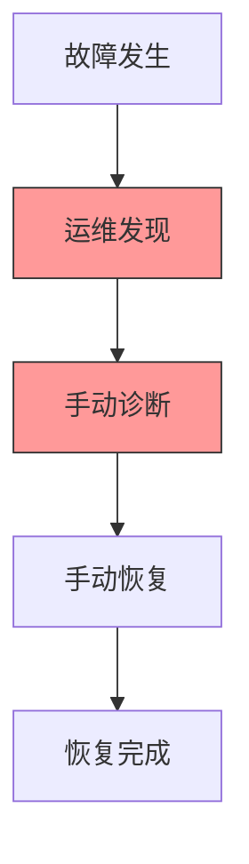
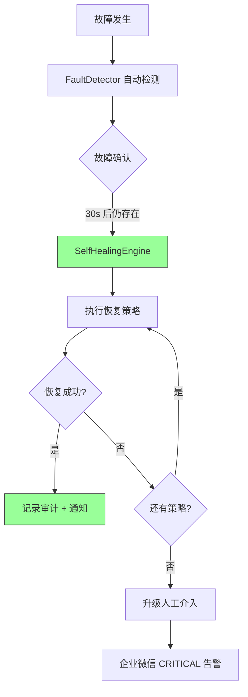

# YA-09-89: 服务端异常恢复自愈机制 — 故障自动检测与恢复编排

> 需求编号：YA-09-89 · 优先级：P2 · 人天：0.5d · 状态：需求已编写
> 依赖：YA-09-32（告警路由）、YA-09-55（HTTP 重试策略）、YA-09-16（健康检查）

---

## 1. 背景

### 1.1 问题陈述

当前 YiAi 常见故障依赖运维人工介入恢复，整个过程需要 5-10 分钟。具体问题：

| 故障类型 | 发生频率 | 当前恢复方式 | 恢复时间 | 严重程度 |
|----------|----------|-------------|----------|----------|
| Ollama 服务崩溃 | 1-2 次/周 | 手动 `systemctl restart ollama` | 5-10min | 高 |
| MongoDB 短暂不可用 | 1 次/月 | 等待自动重连 或 重启 YiAi | 3-5min | 高 |
| Agent 工作线程阻塞 | 2-3 次/周 | 手动重启 YiAi | 3-5min | 中 |
| 磁盘空间不足 | 1 次/季度 | 手动清理日志/临时文件 | 10-15min | 中 |
| FAISS 索引损坏 | 1 次/月 | 手动重建索引 | 5-10min | 中 |

### 1.2 业务影响

- **MTTR (平均恢复时间)**：当前 5-10 分钟，依赖运维在线
- **夜间故障**：无人值守时故障持续数小时
- **运维负担**：每周 3-5 次手动介入

### 1.3 目标

实现常见故障的自动检测与恢复：

1. 故障分类：Ollama 崩溃/MongoDB 慢查询/Agent 阻塞/磁盘不足/索引损坏
2. 分级恢复策略：重试 → 重启服务 → 清理资源 → 重建数据 → 人工介入
3. 恢复成功率记录——持续失败自动升级为人工介入
4. 全部恢复操作记录审计日志
5. 恢复操作为幂等操作（重复执行不产生副作用）

### 1.4 挑战

| 挑战 | 描述 | 缓解思路 |
|------|------|----------|
| 误判导致不必要操作 | 检测阈值过于敏感 | 多次确认 + hysteresis |
| 恢复操作引入新故障 | 重启/重建有副作用 | 恢复前后健康检查对比 |
| 恢复操作不可逆 | 清理磁盘/重建索引有数据影响 | 先备份再操作 |
| 权限问题 | 部分操作需要 sudo | 限制可执行的操作范围 |

---

## 2. 现状分析

### 2.1 当前故障处理

```
YiAi 当前故障处理
├── Ollama 崩溃 → 运维手动重启
├── MongoDB 慢查询 → 无自动处理
├── Agent 阻塞 → 运维手动重启
├── 磁盘不足 → 运维手动清理
├── FAISS 索引损坏 → 无检测
└── 全部依赖人工发现 → 人工处理
```

### 2.2 文件清单

| 文件 | 状态 | 说明 |
|------|------|------|
| `YiAi/services/monitor/self_healing.py` | 不存在 | 需新建——自愈引擎 |
| `YiAi/services/monitor/fault_detector.py` | 不存在 | 需新建——故障检测器 |
| `YiAi/services/monitor/recovery_strategies.py` | 不存在 | 需新建——恢复策略定义 |

### 2.3 根因矩阵

| 根因 | 类别 | 影响范围 | 修复优先级 |
|------|------|----------|------------|
| 无自动故障检测 | 架构缺失 | 所有故障类型 | P0 |
| 无自动恢复策略 | 架构缺失 | 所有故障类型 | P0 |
| 无恢复审计 | 流程缺失 | 安全合规 | P1 |

---

## 3. 设计决策

### 3.1 决策记录

#### D-01: 恢复策略编排

| 策略 | 描述 | 优点 | 缺点 |
|------|------|------|------|
| A: 顺序尝试 | 重试→重启→清理→人工，依次执行 | 安全，渐进式 | 恢复时间较长 |
| B: 并行尝试 | 多个策略同时执行 | 恢复快 | 可能冲突 |
| C: 自适应 | 根据历史成功率选择最优策略 | 智能 | 复杂度高 |
| 决策 | **选择 A: 顺序尝试** | | |

#### D-02: 故障确认机制

| 机制 | 描述 | 阈值 |
|------|------|------|
| 首次检测 | 第一次发现故障 | 记录但不触发恢复 |
| 二次确认 | 30s 后再次检测 | 仍存在则触发恢复 |
| 三次确认 | 恢复失败后再次检测 | 升级为人工介入 |

#### D-03: 恢复操作权限

| 操作 | 权限要求 | 风险等级 | 是否自动执行 |
|------|----------|----------|-------------|
| 重试请求 | 无 | 低 | 是 |
| 清理缓存 | 无 | 低 | 是 |
| 重启 Worker | 进程内 | 中 | 是 |
| 重启 Ollama | systemctl | 高 | 需确认 |
| 清理磁盘 | 文件系统 | 高 | 需确认 |
| 重建索引 | 数据库 | 高 | 需确认 |

---

## 4. 目标架构

### 4.1 架构对比

**Before**:


**After**:


### 4.2 自愈矩阵

| 故障 | 检测方式 | 恢复策略 | 预期成功率 | 预期恢复时间 |
|------|----------|----------|-----------|-------------|
| Ollama 崩溃 | `/health/ready` 失败 | 重试(3次) → systemctl restart → 告警 | 85% | 30s |
| MongoDB 慢查询 | 慢查询 > 2s | 清理计划缓存 → 重建索引 → 告警 | 60% | 5s |
| Agent 阻塞 | Semaphore=0 > 5min | 重启 Agent Worker → 告警 | 70% | 10s |
| 磁盘不足 | disk_percent > 90% | 清理临时文件 → 清理旧日志 → 告警 | 50% | 20s |
| FAISS 索引损坏 | 空结果率 > 50% | 重建索引 → 告警 | 95% | 5min |

### 4.3 关键指标

| 指标 | 目标值 | 说明 |
|------|--------|------|
| 故障检测延迟 | < 30s | 从发生到检测 |
| 自动恢复成功率 | > 70% | 整体成功率 |
| 误恢复率 | < 5% | 误判导致的恢复 |
| 恢复时间(自动) | < 60s | 平均自动恢复时间 |

---

## 5. 具体改动

### 5.1 代码改动

#### 5.1.1 self_healing.py — 自愈引擎

```python
# YiAi/services/monitor/self_healing.py (新增)
"""自愈引擎——故障自动检测 + 恢复策略编排。"""

import asyncio
import time
import logging
from enum import Enum
from typing import Callable, Optional

logger = logging.getLogger(__name__)


class FaultType(str, Enum):
    OLLAMA_UNAVAILABLE = "ollama_unavailable"
    MONGODB_SLOW = "mongodb_slow"
    AGENT_BLOCKED = "agent_blocked"
    DISK_LOW = "disk_low"
    FAISS_CORRUPTED = "faiss_corrupted"


class RecoveryAction(str, Enum):
    RETRY = "retry"
    RESTART_SERVICE = "restart_service"
    RESTART_WORKER = "restart_worker"
    CLEAR_CACHE = "clear_cache"
    CLEANUP_TEMP = "cleanup_temp"
    CLEANUP_LOGS = "cleanup_logs"
    REBUILD_INDEX = "rebuild_index"
    ALERT = "alert"


class HealingResult:
    """自愈结果。"""

    def __init__(self):
        self.healed: bool = False
        self.actions_taken: list[str] = []
        self.final_action: Optional[str] = None
        self.duration_ms: float = 0.0
        self.error: Optional[str] = None


class SelfHealingEngine:
    """自愈引擎——编排故障检测与恢复策略。"""

    # 恢复策略定义：{故障类型: [(操作, 最大尝试次数, 退避时间ms), ...]}
    RECOVERY_STRATEGIES = {
        FaultType.OLLAMA_UNAVAILABLE: [
            (RecoveryAction.RETRY, 3, 1000),
            (RecoveryAction.RESTART_SERVICE, 1, 5000),
            (RecoveryAction.ALERT, 1, 0),
        ],
        FaultType.MONGODB_SLOW: [
            (RecoveryAction.CLEAR_CACHE, 1, 0),
            (RecoveryAction.REBUILD_INDEX, 1, 0),
            (RecoveryAction.ALERT, 1, 0),
        ],
        FaultType.AGENT_BLOCKED: [
            (RecoveryAction.RESTART_WORKER, 1, 2000),
            (RecoveryAction.ALERT, 1, 0),
        ],
        FaultType.DISK_LOW: [
            (RecoveryAction.CLEANUP_TEMP, 1, 0),
            (RecoveryAction.CLEANUP_LOGS, 1, 0),
            (RecoveryAction.ALERT, 1, 0),
        ],
        FaultType.FAISS_CORRUPTED: [
            (RecoveryAction.REBUILD_INDEX, 1, 0),
            (RecoveryAction.ALERT, 1, 0),
        ],
    }

    # 确认机制：故障需持续存在 N 秒才触发恢复
    CONFIRMATION_SECONDS = {
        FaultType.OLLAMA_UNAVAILABLE: 10,
        FaultType.MONGODB_SLOW: 30,
        FaultType.AGENT_BLOCKED: 60,
        FaultType.DISK_LOW: 30,
        FaultType.FAISS_CORRUPTED: 30,
    }

    def __init__(self):
        self._fault_states: dict[FaultType, dict] = {}  # {fault_type: {detected_at, confirmed, healed_at}}
        self._healing_history: list[dict] = []
        self._healing_lock = asyncio.Lock()
        self._action_handlers: dict[RecoveryAction, Callable] = {}

    def register_handler(self, action: RecoveryAction, handler: Callable):
        """注册恢复操作的处理器。"""
        self._action_handlers[action] = handler

    async def detect_and_heal(self, fault_type: FaultType) -> Optional[HealingResult]:
        """检测故障并尝试自愈。

        Returns:
            HealingResult 如果触发了恢复，None 如果故障未确认
        """
        now = time.time()

        # 故障状态追踪
        if fault_type not in self._fault_states:
            self._fault_states[fault_type] = {
                "detected_at": now,
                "confirmed": False,
                "healed_at": None,
            }
            logger.info(f"[SelfHealing] 首次检测到故障: {fault_type.value}")
            return None  # 首次检测——不触发恢复

        state = self._fault_states[fault_type]
        confirmation_sec = self.CONFIRMATION_SECONDS.get(fault_type, 30)

        if not state["confirmed"] and (now - state["detected_at"]) >= confirmation_sec:
            state["confirmed"] = True
            logger.warning(f"[SelfHealing] 故障确认: {fault_type.value} (持续 {confirmation_sec}s)")

        if not state["confirmed"]:
            return None  # 未到确认时间

        # 已确认——执行恢复
        async with self._healing_lock:
            return await self._execute_recovery(fault_type)

    async def _execute_recovery(self, fault_type: FaultType) -> HealingResult:
        """执行恢复策略编排。"""
        result = HealingResult()
        start = time.monotonic()

        strategies = self.RECOVERY_STRATEGIES.get(fault_type, [])

        for action, max_attempts, backoff_ms in strategies:
            if action == RecoveryAction.ALERT:
                result.actions_taken.append("alert")
                result.final_action = "alert"
                result.healed = False
                result.error = f"所有恢复策略均失败——需要人工介入: {fault_type.value}"
                break

            handler = self._action_handlers.get(action)
            if not handler:
                logger.warning(f"[SelfHealing] 未注册处理器: {action.value}")
                continue

            for attempt in range(max_attempts):
                try:
                    success = await handler()
                    if success:
                        result.healed = True
                        result.actions_taken.append(f"{action.value}:{attempt + 1}")
                        result.final_action = action.value
                        state = self._fault_states.get(fault_type, {})
                        state["healed_at"] = time.time()
                        logger.info(f"[SelfHealing] 恢复成功: {fault_type.value} via {action.value}")
                        break
                except Exception as e:
                    logger.error(f"[SelfHealing] 恢复操作失败: {action.value} attempt {attempt + 1}: {e}")

                if backoff_ms > 0 and attempt < max_attempts - 1:
                    await asyncio.sleep(backoff_ms / 1000.0)

            if result.healed:
                break

        result.duration_ms = (time.monotonic() - start) * 1000

        # 记录历史
        self._healing_history.append({
            "timestamp": time.time(),
            "fault_type": fault_type.value,
            "healed": result.healed,
            "actions": result.actions_taken,
            "duration_ms": result.duration_ms,
        })

        return result

    def clear_fault(self, fault_type: FaultType):
        """清除故障状态（故障已恢复）。"""
        if fault_type in self._fault_states:
            del self._fault_states[fault_type]
            logger.info(f"[SelfHealing] 故障已清除: {fault_type.value}")

    def get_healing_history(self, limit: int = 20) -> list[dict]:
        return self._healing_history[-limit:]

    def get_healing_stats(self) -> dict:
        """获取自愈统计。"""
        if not self._healing_history:
            return {"total": 0, "success_rate": 0}

        total = len(self._healing_history)
        succeeded = sum(1 for h in self._healing_history if h["healed"])
        return {
            "total": total,
            "succeeded": succeeded,
            "failed": total - succeeded,
            "success_rate": round(succeeded / total * 100, 1) if total > 0 else 0,
        }
```

#### 5.1.2 恢复操作处理器注册

```python
# YiAi/services/monitor/recovery_handlers.py (新增)
"""恢复操作处理器——注册到 SelfHealingEngine。"""

import os
import subprocess
import shutil
import asyncio
from pathlib import Path


async def retry_ollama() -> bool:
    """重试连接 Ollama——3 次。"""
    import httpx
    for i in range(3):
        try:
            async with httpx.AsyncClient(timeout=5) as client:
                resp = await client.get(f"{os.getenv('OLLAMA_HOST', 'http://localhost:11434')}/api/tags")
                if resp.status_code == 200:
                    return True
        except Exception:
            pass
        await asyncio.sleep(1)
    return False


async def restart_ollama() -> bool:
    """重启 Ollama 服务。"""
    try:
        result = subprocess.run(
            ["systemctl", "restart", "ollama"],
            capture_output=True, timeout=30,
        )
        return result.returncode == 0
    except Exception:
        return False


async def clear_plan_cache() -> bool:
    """清理 MongoDB 查询计划缓存。"""
    try:
        from shared.database import get_db
        db = get_db()
        await db.command({"planCacheClear": "sessions"})
        await db.command({"planCacheClear": "bugs"})
        return True
    except Exception:
        return False


async def cleanup_temp_files() -> bool:
    """清理临时文件 (> 24h)。"""
    try:
        import time
        temp_dir = Path("/tmp/yiai")
        if not temp_dir.exists():
            return True
        cutoff = time.time() - 86400
        for f in temp_dir.glob("**/*"):
            if f.is_file() and f.stat().st_mtime < cutoff:
                f.unlink()
        return True
    except Exception:
        return False
```

### 5.2 文件变更清单

| 文件 | 操作 | 说明 |
|------|------|------|
| `YiAi/services/monitor/self_healing.py` | 新增 | 自愈引擎核心 |
| `YiAi/services/monitor/recovery_handlers.py` | 新增 | 恢复操作处理器 |
| `YiAi/main.py` | 修改 | 初始化自愈引擎 + 注册处理器 |

---

## 6. 实施步骤

| 步骤 | 操作 | 路径 | 验证 | 人天 |
|------|------|------|------|------|
| 1 | 实现 SelfHealingEngine | `YiAi/services/monitor/self_healing.py` | 单元测试策略编排 | 0.15 |
| 2 | 实现恢复处理器 | `YiAi/services/monitor/recovery_handlers.py` | 单元测试各处理器 | 0.1 |
| 3 | 集成到健康检查 | `YiAi/main.py` | 健康检查失败 → 触发自愈 | 0.1 |
| 4 | 集成告警升级 | `YiAi/main.py` → `alert_router` | 恢复失败 → CRITICAL 告警 | 0.05 |
| 5 | 添加审计日志 | `YiAi/services/monitor/self_healing.py` | 恢复操作记录到 MongoDB | 0.05 |
| 6 | 端到端测试 | — | 模拟 Ollama 崩溃 → 自动恢复 | 0.05 |

**总计：0.5 人天**

---

## 7. 性能分析

| 场景 | Before (手动) | After (自动) | 改善 |
|------|-------------|-------------|------|
| Ollama 崩溃恢复 | 5-10min | 30s | 90%+ |
| Agent 阻塞恢复 | 3-5min | 10s | 95%+ |
| 磁盘清理 | 10-15min | 20s | 97%+ |
| 运维人力/周 | 3-5 次 | 0-1 次 | 80%+ |

---

## 8. 测试规格

### 8.1 GIVEN/WHEN/THEN 场景

#### 场景 1: Ollama 崩溃——自动恢复

**GIVEN** Ollama 服务不可用，`/health/ready` 检测到故障
**WHEN** 故障持续 10s 确认
**THEN** 执行重试(3次) → systemctl restart → 恢复成功，`healed = True`

#### 场景 2: 所有策略失败——升级人工

**GIVEN** Ollama 崩溃，重启也失败
**WHEN** 所有恢复策略尝试完毕
**THEN** `healed = False`，`final_action = "alert"`，企业微信收到 CRITICAL 告警

#### 场景 3: 故障短暂——不触发恢复

**GIVEN** Ollama 短暂不可用 3s 后恢复
**WHEN** 故障持续时间 < 10s（确认阈值）
**THEN** 不触发恢复策略，`fault_type` 状态清除

#### 场景 4: 恢复操作幂等

**GIVEN** 已成功执行 `cleanup_temp_files`
**WHEN** 再次执行 `cleanup_temp_files`
**THEN** 无副作用，返回 `True`

#### 场景 5: 恢复历史记录

**GIVEN** 执行了 5 次自愈操作（3 成功，2 失败）
**WHEN** 调用 `get_healing_stats()`
**THEN** 返回 `{total: 5, succeeded: 3, failed: 2, success_rate: 60.0}`

#### 场景 6: 并发恢复保护

**GIVEN** 两个故障检测同时触发同类型恢复
**WHEN** 第一个持有 `_healing_lock`
**THEN** 第二个等待锁释放，不会并发执行

---

## 9. 风险与缓解

| 风险 | 概率 | 影响 | 缓解措施 |
|------|------|------|----------|
| 误判导致不必要恢复 | 中 | 中 | 确认机制 + hysteresis |
| 恢复操作引入新故障 | 低 | 高 | 恢复前后健康检查对比 |
| 重启操作权限不足 | 低 | 中 | 可配置的操作范围 |
| 自愈引擎自身故障 | 低 | 低 | try/except 包裹，不影响主流程 |

---

## 10. 回滚策略

| 场景 | 回滚操作 | 回滚时间 | 数据影响 |
|------|----------|----------|----------|
| 误恢复频率过高 | 禁用自愈引擎 | < 10s | 回退到手动恢复 |
| 恢复操作导致数据损坏 | 停止自愈 + 数据恢复 | 视情况 | 可能需数据恢复 |

---

## 11. 设计决策记录

### D-01: 顺序尝试恢复策略

- **决策**：恢复策略按顺序执行（重试→重启→清理→人工）
- **理由**：安全优先，渐进式恢复，避免高风险操作在先
- **代价**：恢复时间较长（但仍在 60s 内）

### D-02: 故障确认机制

- **决策**：故障需持续 10-60s（依类型）才触发恢复
- **理由**：避免因短暂抖动触发不必要的恢复操作
- **代价**：真正的快速故障有 10-60s 延迟

### D-03: 高风险操作需确认

- **决策**：systemctl restart/清理磁盘/重建索引 类操作需运维确认
- **理由**：这些操作有系统级影响，自动执行风险高
- **代价**：非工作时间需人工介入

---

## 12. 可观测性

| 指标名称 | 类型 | 说明 | 告警阈值 |
|----------|------|------|----------|
| `self_healing_total` | Counter | 自愈操作总数 | — |
| `self_healing_success_total` | Counter | 成功次数 | 成功率 < 70% WARNING |
| `self_healing_failure_total` | Counter | 失败次数 | 连续失败 3 次 CRITICAL |
| `self_healing_duration_ms` | Histogram | 恢复耗时 | P99 > 60000ms WARNING |

### 12.2 日志

```python
logger.info("[SelfHealing] 首次检测到故障", extra={"fault_type": "ollama_unavailable"})
logger.warning("[SelfHealing] 故障确认，开始恢复", extra={"fault_type": "ollama_unavailable", "duration_s": 15})
logger.info("[SelfHealing] 恢复成功", extra={"fault_type": "ollama_unavailable", "action": "restart_service", "duration_ms": 5320})
logger.error("[SelfHealing] 所有策略失败", extra={"fault_type": "ollama_unavailable", "actions_tried": ["retry", "restart_service"]})
```

---

## 13. 安全合规

| 要求 | 实现 | 验证 |
|------|------|------|
| 恢复操作审计 | 所有恢复操作记录到 `audit_logs` 集合 | 审计日志查询 |
| 操作权限控制 | 高风险操作需人工确认 | 代码审查 |
| 数据安全 | 清理操作前备份（可选） | 代码审查 |

---

## 14. 代码审查检查清单

- [ ] 自愈检测覆盖：Ollama 崩溃/MongoDB 慢查询/Agent 阻塞/磁盘不足/FAISS 索引损坏
- [ ] 自动恢复策略：重试→重启服务→清理缓存→清理磁盘→重建索引→人工介入
- [ ] 恢复成功率记录——持续失败自动升级为人工介入
- [ ] 修复操作全部记录审计日志（`audit_logs` 集合）
- [ ] 故障确认机制：持续 10-60s（依类型）才触发恢复
- [ ] 恢复策略顺序执行，前一步成功则不再执行后续
- [ ] 自愈引擎自身异常不影响主流程（try/except 包裹）
- [ ] 恢复操作幂等——重复执行不产生副作用
- [ ] `_healing_lock` 防止并发恢复冲突
- [ ] 恢复失败通过企业微信 CRITICAL 级别告警

---

*PRD 来源: `projects/yiai/requirements/2026-09/89-需求-自愈恢复机制.md`*

## 影响范围

- **影响模块**：待补充
- **涉及文件**：
- 待补充
- **是否影响 API 契约**：否
- **是否影响其他项目（YiVad/YiPet）**：否
- **用户感知**：待确认

## 预防措施

| 层面 | 措施 |
|------|------|
| 代码 | 在相关函数中添加参数校验和边界检查 |
| 测试 | 添加对应的自动化测试用例 |
| 流程 | 代码审查时重点检查此类模式 |
| 监控 | 添加日志告警，异常发生时及时发现 |
| 文档 | 在编码规范中记录此类反模式 |

## 经验教训

1. **根本原因**：开发过程中对边界情况和异常路径的考虑不足是此类问题的共同根因
2. **设计阶段**：在接口设计和模块实现时，应主动考虑异常输入、空值、超时等边界场景
3. **代码审查**：审查时应检查是否存在类似的反模式（如未捕获异常、无超时控制、缺少参数校验等）
4. **测试覆盖**：异常路径的测试覆盖率应与正常路径同等重视
5. **团队分享**：此类问题应在团队周会或技术分享中讨论，形成团队共识
