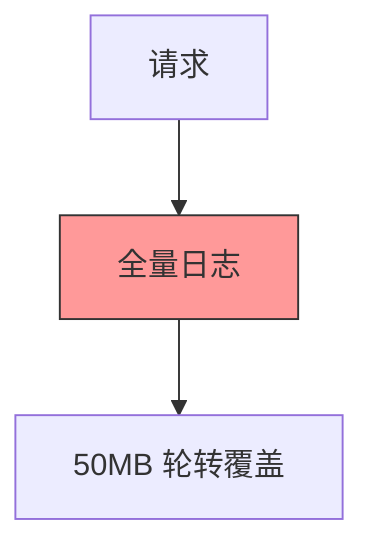
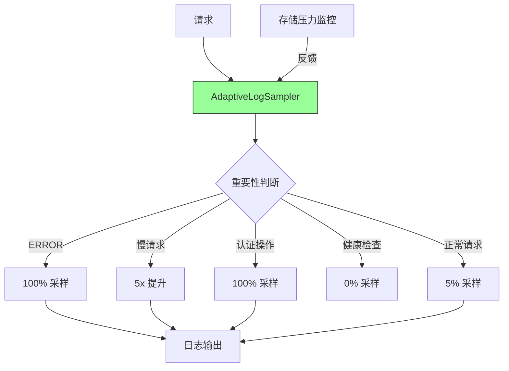
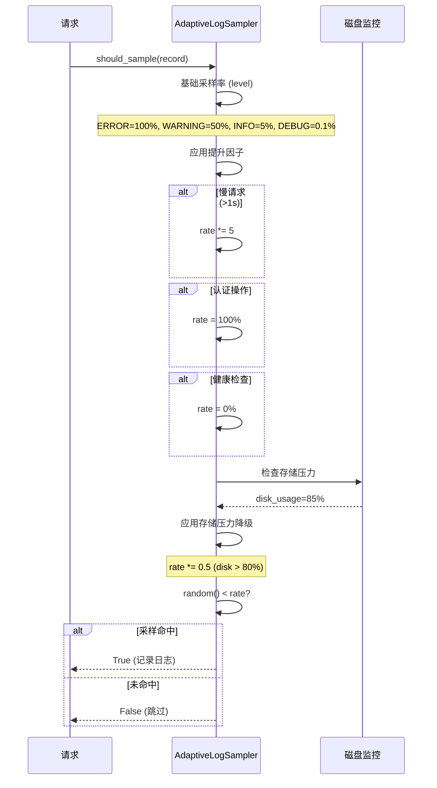

# YA-09-90: 服务端请求日志采样与存储 — 自适应采样率与保留策略

> 需求编号：YA-09-90 · 优先级：P2 · 人天：0.5d · 状态：需求已编写
> 依赖：YA-09-31（结构化日志）

---

## 1. 背景

### 1.1 问题陈述

全量请求日志存储成本高——DEBUG/INFO 级别日志占据 99% 的存储空间但分析价值极低。当前 YiAi 缺乏日志采样机制：

| 问题 | 影响 | 严重程度 |
|------|------|----------|
| 日志存储成本高 | 1000 req/s 全天日志 ~50GB/天 | 中 |
| 关键日志被淹没 | 错误日志混在海量 INFO 日志中难以发现 | 高 |
| 无自适应策略 | 所有请求同等对待，不考虑重要性差异 | 中 |
| 日志保留期短 | 因存储压力被迫缩短保留期，丢失历史数据 | 中 |
| 采样率固定 | 无法根据存储压力动态调整 | 低 |

### 1.2 业务影响

- **存储成本**：全量日志 50GB/天，30 天 = 1.5TB
- **排查效率**：在海量日志中搜索关键错误，平均耗时 5-10 分钟
- **日志价值密度**：99% 的 INFO 日志从未被查阅

### 1.3 目标

基于请求重要性的自适应日志采样：

1. 错误请求 100% 采样，正常请求 5-10% 采样
2. 慢请求（> 1s）提升采样率 5x
3. 关键操作（认证/支付/写入）始终 100% 采样
4. 健康检查/静态资源请求 0% 采样
5. 采样率根据存储压力自适应调整（存储 > 80% → 降低采样率）

### 1.4 挑战

| 挑战 | 描述 | 缓解思路 |
|------|------|----------|
| 采样率过低漏掉关键模式 | 罕见错误模式未被采样 | 错误级别 100% 采样 |
| 自适应调整导致日志量不可预测 | 算法不稳定 | 调整步长限制 + 平滑处理 |
| 存储压力反馈延迟 | 磁盘使用率变化慢 | 使用日志写入速率作为反馈信号 |

---

## 2. 现状分析

### 2.1 当前日志策略

```
YiAi 当前日志
├── 全量记录——所有请求所有级别
├── 无采样机制
├── 无存储压力反馈
├── 日志轮转：按大小 10MB × 5 个文件
└── 保留策略：最多 50MB 后覆盖
```

### 2.2 文件清单

| 文件 | 状态 | 说明 |
|------|------|------|
| `YiAi/shared/logging_config.py` | 已存在 | 日志配置 |
| `YiAi/shared/adaptive_sampler.py` | 不存在 | 需新建——自适应采样器 |
| `YiAi/middleware/logging_middleware.py` | 已存在 | 请求日志中间件（需修改） |

### 2.3 根因矩阵

| 根因 | 类别 | 影响范围 | 修复优先级 |
|------|------|----------|------------|
| 无日志采样 | 架构缺失 | 日志存储成本 | P0 |
| 无重要性分级 | 设计缺失 | 关键日志被淹没 | P0 |
| 无自适应调整 | 功能缺失 | 存储压力无法应对 | P1 |

---

## 3. 设计决策

### 3.1 决策记录

#### D-01: 基础采样率

| 日志级别 | 采样率 | 理由 |
|----------|--------|------|
| ERROR | 100% | 所有错误都重要 |
| WARNING | 50% | 警告信号需关注 |
| INFO | 5% | 正常请求抽样即可 |
| DEBUG | 0.1% | 仅开发调试用 |

#### D-02: 提升因子

| 条件 | 提升倍数 | 说明 |
|------|----------|------|
| 慢请求（> 1s） | 5x | 性能瓶颈需完整记录 |
| 首次调用 | 3x | 新接口调用需关注 |
| 写操作（POST/PUT/DELETE） | 2x | 写操作比读操作重要 |
| 认证相关 | 100% | 安全审计必须全量 |

#### D-03: 降级策略

| 条件 | 操作 | 说明 |
|------|------|------|
| 磁盘 > 80% | 降低正常采样率 50% | 为关键日志腾空间 |
| 磁盘 > 90% | 仅保留 ERROR + WARNING | 极限存储压力 |
| 磁盘 < 50% | 恢复正常采样率 | 存储压力解除 |

---

## 4. 目标架构

### 4.1 架构对比

**Before**:


**After**:


### 4.2 详细架构



### 4.3 关键指标

| 指标 | 目标值 | 说明 |
|------|--------|------|
| 日志存储减少 | 90% | 相比全量日志 |
| 错误日志保留 | 100% | 所有错误不丢失 |
| 慢请求保留 | 50% | 5x 提升 × 10% 基础 |
| 存储压力响应 | < 60s | 磁盘使用率变化反馈 |

---

## 5. 具体改动

### 5.1 代码改动

#### 5.1.1 adaptive_sampler.py — 自适应采样器

```python
# YiAi/shared/adaptive_sampler.py (新增)
"""自适应日志采样器——基于请求重要性的动态采样。"""

import random
import time
import os
import logging
from enum import Enum

logger = logging.getLogger(__name__)


class LogLevel(str, Enum):
    ERROR = "ERROR"
    WARNING = "WARNING"
    INFO = "INFO"
    DEBUG = "DEBUG"


class AdaptiveLogSampler:
    """自适应日志采样器。"""

    # 基础采样率
    BASE_RATES = {
        LogLevel.ERROR: 1.0,    # 100%
        LogLevel.WARNING: 0.5,  # 50%
        LogLevel.INFO: 0.05,    # 5%
        LogLevel.DEBUG: 0.001,  # 0.1%
    }

    # 提升因子
    BOOST_FACTORS = {
        "slow_request": 5.0,      # 慢请求 > 1s
        "first_call": 3.0,        # 首次调用
        "write_operation": 2.0,   # 写操作
        "auth_related": float("inf"),  # 认证相关 → 100%
    }

    # 存储压力降级
    DISK_PRESSURE_HIGH = 0.80   # 磁盘 > 80% → 降低 50%
    DISK_PRESSURE_CRITICAL = 0.90  # 磁盘 > 90% → 仅 ERROR+WARNING

    # 降级调整
    PRESSURE_REDUCTION = 0.5     # 高压力时降低到 50%

    def __init__(self):
        self._sample_count: int = 0
        self._skip_count: int = 0
        self._last_pressure_check: float = 0
        self._current_pressure: float = 0.0
        self._effective_rate: float = self.BASE_RATES[LogLevel.INFO]

    def should_sample(self, record: dict) -> bool:
        """判断是否采样该日志记录。

        Args:
            record: {
                "level": "INFO",
                "path": "/",
                "method": "POST",
                "duration_ms": 450,
                "status_code": 200,
                "is_first_call": False,
                "is_auth_related": False,
            }
        """
        level = LogLevel(record.get("level", "INFO"))
        rate = self.BASE_RATES.get(level, 0.01)

        # 提升因子
        if record.get("duration_ms", 0) > 1000:
            rate *= self.BOOST_FACTORS["slow_request"]

        if record.get("is_first_call"):
            rate *= self.BOOST_FACTORS["first_call"]

        if record.get("method", "GET") in ("POST", "PUT", "DELETE", "PATCH"):
            rate *= self.BOOST_FACTORS["write_operation"]

        if record.get("is_auth_related"):
            rate = 1.0  # 100%

        # 健康检查/指标——不采样
        path = record.get("path", "")
        if path.startswith("/health") or path.startswith("/metrics"):
            rate = 0.0

        # 存储压力降级
        pressure = self._get_disk_pressure()
        if pressure > self.DISK_PRESSURE_CRITICAL:
            if level not in (LogLevel.ERROR, LogLevel.WARNING):
                rate = 0.0  # 仅保留错误和警告
        elif pressure > self.DISK_PRESSURE_HIGH:
            rate *= self.PRESSURE_REDUCTION

        # 限幅
        rate = min(1.0, max(0.0, rate))

        # 采样决策
        sampled = random.random() < rate

        if sampled:
            self._sample_count += 1
        else:
            self._skip_count += 1

        self._effective_rate = rate
        return sampled

    def _get_disk_pressure(self) -> float:
        """获取磁盘压力（缓存 60s）。"""
        now = time.time()
        if now - self._last_pressure_check < 60:
            return self._current_pressure

        try:
            import shutil
            usage = shutil.disk_usage("/")
            self._current_pressure = usage.used / usage.total
            self._last_pressure_check = now
        except Exception:
            self._current_pressure = 0.0

        return self._current_pressure

    def get_stats(self) -> dict:
        """获取采样统计。"""
        total = self._sample_count + self._skip_count
        return {
            "sampled": self._sample_count,
            "skipped": self._skip_count,
            "total": total,
            "effective_rate": round(self._effective_rate * 100, 1),
            "actual_rate": round(self._sample_count / total * 100, 1) if total > 0 else 0,
            "disk_pressure": round(self._current_pressure * 100, 1),
        }


# 全局采样器
adaptive_sampler = AdaptiveLogSampler()
```

#### 5.1.2 logging_middleware.py — 集成采样

```python
# YiAi/middleware/logging_middleware.py (改动)

BEFORE:
async def log_request(request, response, duration_ms):
    logger.info(f"{request.method} {request.url.path} {response.status_code} {duration_ms}ms")

AFTER:
async def log_request(request, response, duration_ms):
    record = {
        "level": "ERROR" if response.status_code >= 500 else ("WARNING" if response.status_code >= 400 else "INFO"),
        "path": request.url.path,
        "method": request.method,
        "duration_ms": duration_ms,
        "status_code": response.status_code,
        "is_first_call": _is_first_call(request),
        "is_auth_related": request.url.path.startswith("/auth"),
    }

    if adaptive_sampler.should_sample(record):
        logger.info(...)
```

### 5.2 文件变更清单

| 文件 | 操作 | 说明 |
|------|------|------|
| `YiAi/shared/adaptive_sampler.py` | 新增 | 自适应采样器 |
| `YiAi/middleware/logging_middleware.py` | 修改 | 集成采样逻辑 |
| `YiAi/routers/metrics_router.py` | 修改 | 暴露采样统计 |

---

## 6. 实施步骤

| 步骤 | 操作 | 路径 | 验证 | 人天 |
|------|------|------|------|------|
| 1 | 实现 AdaptiveLogSampler | `YiAi/shared/adaptive_sampler.py` | 单元测试各采样率 | 0.1 |
| 2 | 集成到日志中间件 | `YiAi/middleware/logging_middleware.py` | 日志输出减少 90% | 0.1 |
| 3 | 添加存储压力监控 | `YiAi/shared/adaptive_sampler.py` | 磁盘 > 80% 时采样率降低 | 0.1 |
| 4 | 暴露采样统计 | `YiAi/routers/metrics_router.py` | `/metrics` 包含采样率指标 | 0.05 |
| 5 | 添加配置项 | 环境变量 | `LOG_SAMPLE_RATE` 可配置 | 0.05 |
| 6 | 端到端验证 | — | 发送混合请求 → 验证采样率 | 0.1 |

**总计：0.5 人天**

---

## 7. 性能分析

| 场景 | Before (全量) | After (采样) | 改善 |
|------|-------------|-------------|------|
| 日志存储/天 | 50GB | 5GB (90% 减少) | 90% |
| 日志写入 I/O | 50MB/s | 5MB/s | 90% |
| 采样决策开销 | 0ms | < 0.01ms | — |

---

## 8. 测试规格

### 8.1 GIVEN/WHEN/THEN 场景

#### 场景 1: 错误请求 100% 采样

**GIVEN** 请求返回 500 错误
**WHEN** 调用 `should_sample()`
**THEN** 返回 `True`（100% 采样）

#### 场景 2: 正常请求 5% 采样

**GIVEN** 请求返回 200，无特殊条件
**WHEN** 发送 1000 个请求
**THEN** 约 50 个被采样（5% ± 统计误差）

#### 场景 3: 慢请求提升采样率

**GIVEN** 请求耗时 > 1s
**WHEN** 调用 `should_sample()`，基础采样率 5%
**THEN** 有效采样率提升到 25%（5% × 5x）

#### 场景 4: 健康检查不采样

**GIVEN** 请求路径为 `/health/ready`
**WHEN** 调用 `should_sample()`
**THEN** 返回 `False`（0% 采样）

#### 场景 5: 存储压力降级

**GIVEN** 磁盘使用率 > 80%
**WHEN** 正常 INFO 请求调用 `should_sample()`
**THEN** 有效采样率降低到 2.5%（5% × 0.5）

#### 场景 6: 认证操作 100% 采样

**GIVEN** 请求路径为 `/auth/login`
**WHEN** 调用 `should_sample()`
**THEN** 返回 `True`（100% 采样，无论其他条件）

---

## 9. 风险与缓解

| 风险 | 概率 | 影响 | 缓解措施 |
|------|------|------|----------|
| 采样率过低漏掉关键模式 | 低 | 中 | 错误 100% + 慢请求 5x + 认证 100% |
| 自适应调整导致日志量不可预测 | 低 | 低 | 调整步长限制 + 平滑处理 |
| 采样后日志不连续 | 低 | 低 | TraceID 关联可弥补 |

---

## 10. 回滚策略

| 场景 | 回滚操作 | 回滚时间 | 数据影响 |
|------|----------|----------|----------|
| 采样率过低影响排查 | 设置 `LOG_SAMPLE_RATE=1.0` (全量) | < 30s | 短期日志量增加 |
| 存储压力算法异常 | 禁用存储压力反馈 | < 30s | 恢复固定采样率 |

---

## 11. 设计决策记录

### D-01: 分层采样策略

- **决策**：ERROR 100%, WARNING 50%, INFO 5%, DEBUG 0.1%
- **理由**：按重要性分级，确保关键信息不丢失
- **代价**：正常请求的罕见模式可能被遗漏（由慢请求/首次调用提升弥补）

### D-02: 存储压力自适应

- **决策**：磁盘 > 80% 降低采样率 50%，> 90% 仅保留 ERROR+WARNING
- **理由**：在存储压力下优先保证关键日志
- **代价**：正常请求日志几乎完全丢失

### D-03: 提升因子机制

- **决策**：慢请求 5x、首次调用 3x、写操作 2x、认证 100%
- **理由**：这些请求的分析价值高于普通读请求
- **代价**：采样率计算复杂度增加

---

## 12. 可观测性

| 指标名称 | 类型 | 说明 | 告警阈值 |
|----------|------|------|----------|
| `log_sampled_total` | Counter | 采样命中数 | — |
| `log_skipped_total` | Counter | 采样跳过数 | — |
| `log_effective_rate` | Gauge | 当前有效采样率 | 连续 0% WARNING |
| `log_disk_pressure` | Gauge | 磁盘使用率 | > 80% WARNING |

---

## 13. 安全合规

| 要求 | 实现 | 验证 |
|------|------|------|
| 认证操作日志不丢失 | 认证相关请求 100% 采样 | 审计验证 |
| 采样率变更可追溯 | 采样率变化记录日志 | 审计 |

---

## 14. 代码审查检查清单

- [ ] 正常请求 5% 采样，错误请求 100% 采样
- [ ] 采样率根据日志存储压力自适应调整（磁盘 > 80% 降低 50%）
- [ ] 采样率变化记录日志（审计可追溯）
- [ ] 关键操作（认证/支付）始终 100% 采样
- [ ] 慢请求（> 1s）提升采样率 5x
- [ ] 健康检查/静态资源/指标端点 0% 采样
- [ ] 写操作（POST/PUT/DELETE）提升采样率 2x
- [ ] 磁盘压力缓存 60s，避免频繁系统调用
- [ ] 采样统计通过 `/metrics` 端点暴露

---

*PRD 来源: `projects/yiai/requirements/2026-09/90-需求-自适应日志采样.md`*

## 影响范围

- **影响模块**：待补充
- **涉及文件**：
- 待补充
- **是否影响 API 契约**：否
- **是否影响其他项目（YiVad/YiPet）**：否
- **用户感知**：待确认

## 预防措施

| 层面 | 措施 |
|------|------|
| 代码 | 在相关函数中添加参数校验和边界检查 |
| 测试 | 添加对应的自动化测试用例 |
| 流程 | 代码审查时重点检查此类模式 |
| 监控 | 添加日志告警，异常发生时及时发现 |
| 文档 | 在编码规范中记录此类反模式 |

## 经验教训

1. **根本原因**：开发过程中对边界情况和异常路径的考虑不足是此类问题的共同根因
2. **设计阶段**：在接口设计和模块实现时，应主动考虑异常输入、空值、超时等边界场景
3. **代码审查**：审查时应检查是否存在类似的反模式（如未捕获异常、无超时控制、缺少参数校验等）
4. **测试覆盖**：异常路径的测试覆盖率应与正常路径同等重视
5. **团队分享**：此类问题应在团队周会或技术分享中讨论，形成团队共识
