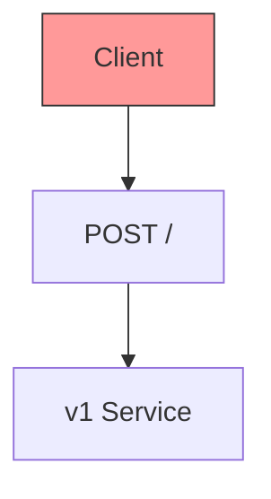
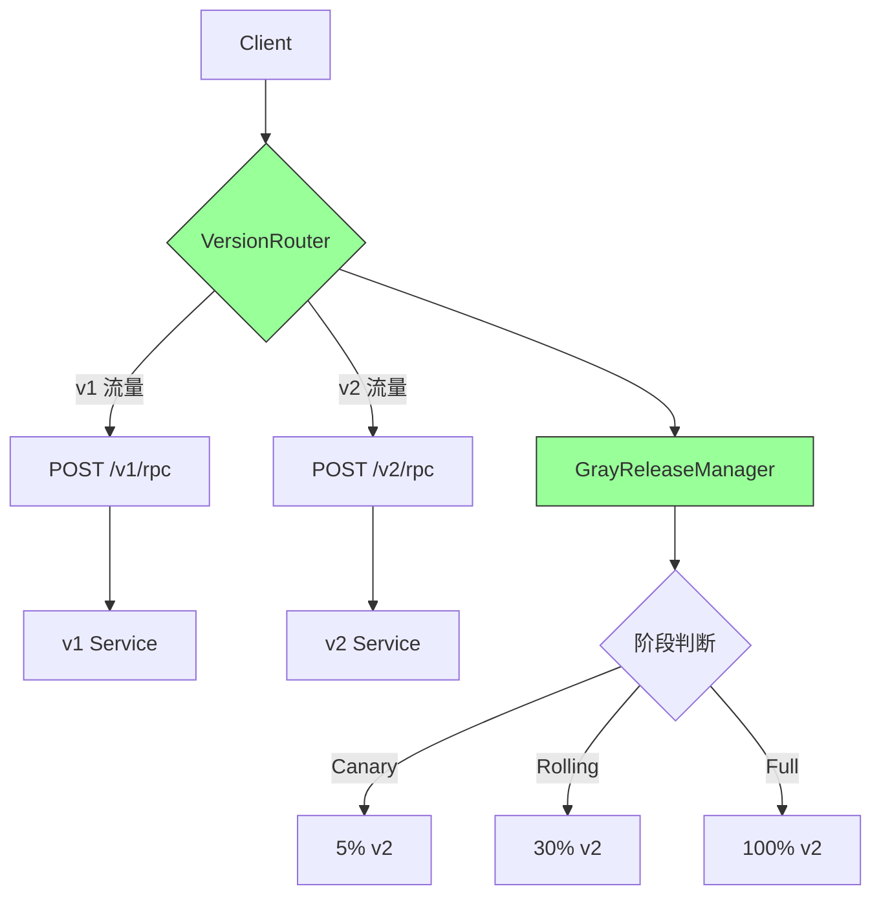

# YA-09-91: API 版本化路由 — URL 路径版本隔离与灰度流量分发

> 需求编号：YA-09-91 · 优先级：P2 · 人天：0.5d · 状态：需求已编写
> 依赖：YA-09-30（API 版本管理）

---

## 1. 背景

### 1.1 问题陈述

YA-09-30 通过 RPC 信封中的 `version` 字段实现了 v1/v2 版本区分，但缺乏灰度流量分发能力。当前版本切换是"全有或全无"模式：

| 问题 | 影响 | 严重程度 |
|------|------|----------|
| 无灰度发布 | 新版本一次性全量上线，风险集中 | 高 |
| 无法 A/B 测试 | 无法对比新旧版本的性能差异 | 中 |
| 回滚需全量切换 | 回滚影响所有用户，而非仅灰度用户 | 中 |
| 客户端无感知迁移 | 版本升级时客户端可能使用错误的 API 版本 | 中 |
| 无版本废弃通知 | 旧版本客户端不知道何时停止工作 | 低 |

### 1.2 业务影响

- **发布风险**：每次 API 变更都是"全有或全无"的赌博
- **回滚爆炸半径**：一次回滚影响所有用户
- **迁移困难**：无法渐进式迁移客户端到新版本

### 1.3 目标

实现基于 URL 路径的 API 版本化与灰度流量分发：

1. URL 路径版本化：`/v1/rpc` 和 `/v2/rpc` 共存
2. 灰度三阶段：Canary(5%) → Rolling(30%) → Full(100%)
3. 每阶段推进条件：P95 延迟无劣化 + 错误率无上升
4. 快速回滚：通过 `X-API-Version` Header 或流量权重调整
5. 旧版本废弃通知：v1 返回 `410 Gone` + 迁移指引

### 1.4 挑战

| 挑战 | 描述 | 缓解思路 |
|------|------|----------|
| 灰度期间客户端缓存不一致 | 同一用户被路由到不同版本 | 用户级 sticky routing |
| v1 下线后仍有客户端调用 | 未及时通知客户端 | v1 返回 410 + 迁移指引 |
| 版本间数据兼容性 | v1/v2 可能使用不同的数据格式 | 版本间数据转换层 |

---

## 2. 现状分析

### 2.1 当前版本管理

```
YiAi 当前 API 版本
├── RPC 信封中 version 字段 (YA-09-30)
├── 单一路由: POST /
├── 无版本隔离
├── 无灰度分发
└── 版本切换: 全量
```

### 2.2 文件清单

| 文件 | 状态 | 说明 |
|------|------|------|
| `YiAi/routers/rpc_router.py` | 已存在 | 当前 RPC 路由（POST /） |
| `YiAi/routers/versioned_router.py` | 不存在 | 需新建——版本化路由 |
| `YiAi/shared/version_manager.py` | 不存在 | 需新建——版本管理器 |

### 2.3 根因矩阵

| 根因 | 类别 | 影响范围 | 修复优先级 |
|------|------|----------|------------|
| 无灰度分发 | 架构缺失 | 发布风险 | P0 |
| 无版本隔离 | 架构缺失 | 兼容性 | P0 |
| 无废弃通知 | 功能缺失 | 客户端迁移 | P1 |

---

## 3. 设计决策

### 3.1 决策记录

#### D-01: 灰度阶段

| 阶段 | v1 流量 | v2 流量 | 持续时间 | 推进条件 |
|------|---------|---------|----------|----------|
| Canary | 95% | 5% | 2h | 错误率无上升 |
| Rolling | 70% | 30% | 24h | P95 延迟无劣化 |
| Full | 0% | 100% | — | v1 下线 |
| 决策 | **选择三阶段渐进式** | | | |

#### D-02: 流量路由策略

| 策略 | 描述 | 优点 | 缺点 |
|------|------|------|------|
| 随机权重 | 按百分比随机分配 | 简单 | 同一用户可能切换版本 |
| Sticky Routing | 用户 ID hash → 固定版本 | 用户体验一致 | 需维护路由表 |
| Header 控制 | `X-API-Version` 指定版本 | 精确控制 | 需客户端支持 |
| 决策 | **选择 Sticky Routing + Header 控制** | | |

#### D-03: 版本废弃策略

| 阶段 | 行为 | 时间 |
|------|------|------|
| Active | 正常服务 | — |
| Deprecated | 返回 `Warning` 头部 | 废弃前 30 天 |
| Sunset | 返回 `410 Gone` + 迁移指引 | 废弃后 |

---

## 4. 目标架构

### 4.1 架构对比

**Before**:


**After**:


### 4.2 灰度发布路线

```mermaid
gantt
    title API 版本灰度发布路线
    dateFormat HH:mm
    axisFormat %H:%M

    section Canary
    v2 5% 流量监控    :a1, 00:00, 2h
    section Rolling
    v2 30% 流量监控   :a2, after a1, 24h
    section Full
    v2 100% 流量      :a3, after a2, 1h
    v1 下线           :milestone, after a3, 0h
```



### 4.3 关键指标

| 指标 | 目标值 | 说明 |
|------|--------|------|
| 灰度切换时间 | < 1min | 修改流量权重 |
| v1→v2 延迟对比 | P95 无劣化 | 灰度推进条件 |
| 回滚时间 | < 30s | 重置流量权重 |
| 废弃通知提前期 | 30 天 | 给客户端迁移时间 |

---

## 5. 具体改动

### 5.1 代码改动

#### 5.1.1 versioned_router.py — 版本化路由

```python
# YiAi/routers/versioned_router.py (新增)
"""API 版本化路由——支持 v1/v2 共存 + 灰度分发。"""

import hashlib
from fastapi import APIRouter, Request, Response
from fastapi.responses import JSONResponse

router = APIRouter()


class GrayReleaseManager:
    """灰度发布管理器。"""

    STAGES = {
        "canary": {"v2_weight": 0.05},   # 5%
        "rolling": {"v2_weight": 0.30},  # 30%
        "full": {"v2_weight": 1.0},      # 100%
    }

    def __init__(self):
        self._current_stage: str = "canary"
        self._version_health: dict[str, dict] = {
            "v1": {"error_rate": 0.0, "p95_latency_ms": 0},
            "v2": {"error_rate": 0.0, "p95_latency_ms": 0},
        }

    def get_target_version(self, user_id: str = None, header_version: str = None) -> str:
        """根据灰度策略确定目标版本。

        Args:
            user_id: 用户标识（用于 sticky routing）
            header_version: 客户端指定的版本（X-API-Version）

        Returns:
            "v1" 或 "v2"
        """
        # Header 优先级最高
        if header_version in ("v1", "v2"):
            return header_version

        # Sticky routing: 用户 ID hash → 固定版本
        if user_id:
            hash_val = int(hashlib.md5(user_id.encode()).hexdigest()[:8], 16)
            v2_weight = self.STAGES[self._current_stage]["v2_weight"]
            threshold = int(v2_weight * 0xFFFFFFFF)
            return "v2" if hash_val < threshold else "v1"

        # 默认 v1
        return "v1"

    def advance_stage(self, new_stage: str) -> bool:
        """推进灰度阶段。"""
        if new_stage not in self.STAGES:
            return False
        self._current_stage = new_stage
        return True

    def rollback(self):
        """紧急回滚到 v1。"""
        self._current_stage = "canary"
        self.STAGES["canary"]["v2_weight"] = 0.0  # 关闭 v2

    @property
    def current_stage(self) -> str:
        return self._current_stage

    @property
    def v2_weight(self) -> float:
        return self.STAGES[self._current_stage]["v2_weight"]


# 全局实例
gray_manager = GrayReleaseManager()


@router.post("/v1/rpc")
async def rpc_handler_v1(request: Request):
    """v1 RPC 路由。"""
    # 检查是否已废弃
    if gray_manager.current_stage == "full":
        return JSONResponse(
            status_code=410,
            content={
                "code": 4003,
                "message": "API v1 已废弃，请迁移到 v2。文档: /docs/v2-migration",
                "data": None,
            },
            headers={"X-API-Deprecated": "true", "X-API-Migration": "/v2/rpc"},
        )

    return await route_rpc(request, version="v1")


@router.post("/v2/rpc")
async def rpc_handler_v2(request: Request):
    """v2 RPC 路由。"""
    return await route_rpc(request, version="v2")


@router.post("/")
async def rpc_handler_legacy(request: Request):
    """兼容旧版 POST / 路由——自动灰度分发。"""
    user_id = request.headers.get("X-User-ID", "")
    header_version = request.headers.get("X-API-Version", "")

    target = gray_manager.get_target_version(user_id, header_version)

    if target == "v2":
        return await route_rpc(request, version="v2")
    return await route_rpc(request, version="v1")


@router.get("/api/version/status")
async def version_status():
    """查询当前版本和灰度状态。"""
    return {
        "current_stage": gray_manager.current_stage,
        "v2_weight": gray_manager.v2_weight,
        "versions": {
            "v1": gray_manager._version_health.get("v1", {}),
            "v2": gray_manager._version_health.get("v2", {}),
        },
    }


@router.post("/api/version/advance")
async def advance_gray_stage(stage: str):
    """推进灰度阶段（管理接口）。"""
    success = gray_manager.advance_stage(stage)
    return {"success": success, "current_stage": gray_manager.current_stage}


@router.post("/api/version/rollback")
async def rollback_version():
    """紧急回滚到 v1。"""
    gray_manager.rollback()
    return {"success": True, "current_stage": gray_manager.current_stage}
```

### 5.2 文件变更清单

| 文件 | 操作 | 说明 |
|------|------|------|
| `YiAi/routers/versioned_router.py` | 新增 | 版本化路由 + 灰度管理器 |
| `YiAi/routers/rpc_router.py` | 修改 | 保留 POST / 作为兼容入口 |
| `YiAi/main.py` | 修改 | 注册版本化路由 |

---

## 6. 实施步骤

| 步骤 | 操作 | 路径 | 验证 | 人天 |
|------|------|------|------|------|
| 1 | 实现 GrayReleaseManager | `YiAi/routers/versioned_router.py` | 单元测试灰度逻辑 | 0.1 |
| 2 | 实现版本化路由 | `YiAi/routers/versioned_router.py` | `/v1/rpc` + `/v2/rpc` 共存 | 0.1 |
| 3 | 实现 Sticky Routing | `YiAi/routers/versioned_router.py` | 同一用户始终路由到相同版本 | 0.1 |
| 4 | 添加管理接口 | `YiAi/routers/versioned_router.py` | 推进/回滚灰度阶段 | 0.05 |
| 5 | 添加废弃通知 | `YiAi/routers/versioned_router.py` | v1 废弃时返回 410 | 0.05 |
| 6 | 端到端验证 | — | Canary→Rolling→Full 灰度流程 | 0.1 |

**总计：0.5 人天**

---

## 7. 性能分析

| 场景 | Before (单版本) | After (版本化) | 增幅 |
|------|----------------|---------------|------|
| 路由分发延迟 | 0ms | < 0.1ms (hash + 权重计算) | 忽略不计 |
| 内存增量 | 0MB | 1MB (GrayReleaseManager) | 微小 |

---

## 8. 测试规格

### 8.1 GIVEN/WHEN/THEN 场景

#### 场景 1: Canary 阶段 5% 流量到 v2

**GIVEN** `current_stage = "canary"` (v2_weight=5%)
**WHEN** 100 个不同用户发送请求到 `POST /`
**THEN** 约 5 个请求路由到 v2，95 个路由到 v1

#### 场景 2: Sticky Routing——同一用户固定版本

**GIVEN** 用户 ID 为 `user123`
**WHEN** 该用户发送 10 次请求
**THEN** 全部 10 次请求路由到同一版本（v1 或 v2）

#### 场景 3: Header 指定版本

**GIVEN** 客户端发送 `X-API-Version: v2`
**WHEN** 请求到达
**THEN** 无论灰度阶段，路由到 v2

#### 场景 4: Full 阶段 v1 返回 410

**GIVEN** `current_stage = "full"` (v2_weight=100%)
**WHEN** 客户端直接请求 `/v1/rpc`
**THEN** 返回 410，消息包含迁移指引

#### 场景 5: 紧急回滚

**GIVEN** 当前处于 Rolling 阶段（v2=30%）
**WHEN** 调用 `rollback()`
**THEN** `current_stage = "canary"`，`v2_weight = 0.0`，所有流量回到 v1

#### 场景 6: 阶段推进

**GIVEN** 当前处于 Canary 阶段
**WHEN** 调用 `advance_stage("rolling")`
**THEN** `current_stage = "rolling"`，`v2_weight = 0.30`

---

## 9. 风险与缓解

| 风险 | 概率 | 影响 | 缓解措施 |
|------|------|------|----------|
| 灰度期间客户端缓存不一致 | 中 | 中 | Sticky routing + Header 控制 |
| v1 下线后仍有客户端调用 | 低 | 中 | v1 返回 410 + 迁移指引 + 30 天提前通知 |
| 灰度权重计算开销 | 低 | 低 | MD5 hash 极快 (< 0.1ms) |

---

## 10. 回滚策略

| 场景 | 回滚操作 | 回滚时间 | 数据影响 |
|------|----------|----------|----------|
| v2 发布后发现问题 | 调用 `rollback()` 或 `POST /api/version/rollback` | < 30s | 全部流量回到 v1 |
| v1 误废弃 | 设置 `current_stage = "canary"` | < 30s | 恢复 v1 服务 |

---

## 11. 设计决策记录

### D-01: 三阶段灰度发布

- **决策**：Canary(5%) → Rolling(30%) → Full(100%)
- **理由**：渐进式降低风险，每阶段有明确的推进条件
- **代价**：发布周期延长至 26h+

### D-02: Sticky Routing

- **决策**：基于用户 ID hash 的 sticky routing
- **理由**：确保同一用户始终看到同一版本，避免体验不一致
- **代价**：需要用户 ID 标识

### D-03: 410 Gone 废弃通知

- **决策**：废弃版本返回 HTTP 410 + 迁移指引头部
- **理由**：明确的废弃信号，优于静默失败或通用 404
- **代价**：需要客户端处理 410 响应

---

## 12. 可观测性

| 指标名称 | 类型 | 说明 | 告警阈值 |
|----------|------|------|----------|
| `api_version_distribution` | Gauge | v1/v2 流量分布 | — |
| `api_version_errors` | Counter | 按版本统计错误数 | v2 错误率 > v1 WARNING |
| `api_410_responses_total` | Counter | v1 废弃 410 响应数 | > 0 后持续上升 WARNING |

---

## 13. 安全合规

| 要求 | 实现 | 验证 |
|------|------|------|
| 版本管理接口权限 | `/api/version/*` 仅管理员可访问 | 认证检查 |
| 灰度操作审计 | 阶段推进/回滚记录审计日志 | 审计日志查询 |

---

## 14. 代码审查检查清单

- [ ] API 版本化路由：v1/v2 共存（`/v1/rpc` + `/v2/rpc`）
- [ ] 灰度三阶段：Canary(5%) → Rolling(30%) → Full(100%)
- [ ] 每阶段推进条件：错误率无上升 + P95 延迟无劣化
- [ ] Sticky routing：用户 ID hash → 固定版本
- [ ] Header 优先级：`X-API-Version` 可覆盖灰度路由
- [ ] 快速回滚：`POST /api/version/rollback` 立即生效
- [ ] v1 废弃时返回 410 + `X-API-Migration` 头部
- [ ] 版本状态查询：`GET /api/version/status`
- [ ] 灰度操作记录审计日志

---

*PRD 来源: `projects/yiai/requirements/2026-09/91-需求-API版本化路由灰度.md`*

## 影响范围

- **影响模块**：待补充
- **涉及文件**：
- 待补充
- **是否影响 API 契约**：否
- **是否影响其他项目（YiVad/YiPet）**：否
- **用户感知**：待确认

## 预防措施

| 层面 | 措施 |
|------|------|
| 代码 | 在相关函数中添加参数校验和边界检查 |
| 测试 | 添加对应的自动化测试用例 |
| 流程 | 代码审查时重点检查此类模式 |
| 监控 | 添加日志告警，异常发生时及时发现 |
| 文档 | 在编码规范中记录此类反模式 |

## 经验教训

1. **根本原因**：开发过程中对边界情况和异常路径的考虑不足是此类问题的共同根因
2. **设计阶段**：在接口设计和模块实现时，应主动考虑异常输入、空值、超时等边界场景
3. **代码审查**：审查时应检查是否存在类似的反模式（如未捕获异常、无超时控制、缺少参数校验等）
4. **测试覆盖**：异常路径的测试覆盖率应与正常路径同等重视
5. **团队分享**：此类问题应在团队周会或技术分享中讨论，形成团队共识
