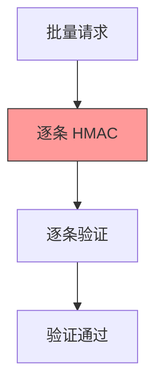
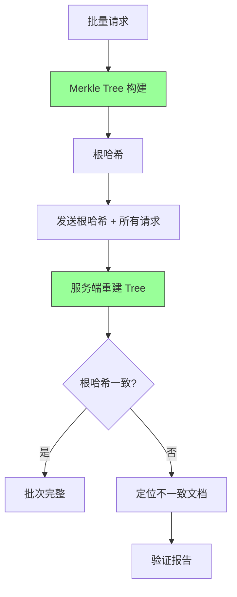
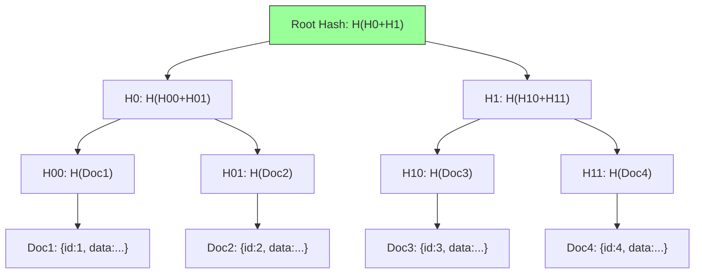

# YA-09-92: 请求批次完整性验证 — Merkle Tree 防篡改批量请求

> 需求编号：YA-09-92 · 优先级：P2 · 人天：0.5d · 状态：需求已编写
> 依赖：YA-09-85（请求签名验证）

---

## 1. 背景

### 1.1 问题陈述

批量导入操作（如 CSV 导入 100 条数据）通过多次 RPC 调用分批发送——如果中间某个请求被篡改或丢失，会导致数据不完整且难以检测：

| 问题 | 影响 | 严重程度 |
|------|------|----------|
| 批量请求篡改 | 中间请求被修改，数据被污染 | 高 |
| 请求丢失 | 批量中某条请求未到达，数据不完整 | 高 |
| 无法验证完整性 | 无法确认所有请求是否完整到达 | 中 |
| 单条验证开销大 | 逐条 HMAC 验证 100 条请求耗时 | 中 |
| 重排序攻击 | 请求顺序被改变，业务逻辑错误 | 中 |

### 1.2 业务影响

- **数据完整性**：批量导入中 1 条数据被篡改可能导致整个批次不可信
- **验证效率**：100 条请求逐条验证需要 100 次 HMAC 计算
- **调试困难**：无法快速定位是哪条请求被篡改/丢失

### 1.3 目标

基于 Merkle Tree 实现批量请求的完整性验证：

1. 客户端为批量请求构建 Merkle Tree，发送根哈希
2. 服务端重建 Merkle Tree，验证根哈希一致性
3. 增量更新——仅重新计算变更文档的哈希
4. 验证报告标注不一致的具体文档
5. Merkle Proof 验证——可单独验证某条请求的完整性

### 1.4 挑战

| 挑战 | 描述 | 缓解思路 |
|------|------|----------|
| 全量计算耗时 | O(n) 遍历所有文档计算根哈希 | 增量更新 + 缓存中间节点 |
| 并发写入竞态 | 读写并发导致根哈希计算不一致 | 读锁或 snapshot 读取 |
| 叶子排序 | 不同顺序的叶子产生不同根哈希 | 固定排序规则 |
| 树结构存储 | 需要存储中间节点以支持增量更新 | 内存缓存 + MongoDB 可选持久化 |

---

## 2. 现状分析

### 2.1 当前批量请求处理

```
YiAi 当前批量请求
├── 逐条 RPC 调用
├── 每条独立 HMAC 签名 (YA-09-85)
├── 无批次级完整性验证
├── 无法验证批次完整性
└── 无法检测请求丢失/重排序
```

### 2.2 文件清单

| 文件 | 状态 | 说明 |
|------|------|------|
| `YiAi/shared/merkle_tree.py` | 不存在 | 需新建——Merkle Tree 实现 |
| `YiAi/shared/batch_verifier.py` | 不存在 | 需新建——批次完整性验证器 |

### 2.3 根因矩阵

| 根因 | 类别 | 影响范围 | 修复优先级 |
|------|------|----------|------------|
| 无批次完整性验证 | 架构缺失 | 批量操作 | P0 |
| 无 Merkle Tree | 工具缺失 | 高效验证 | P0 |
| 无增量更新 | 功能缺失 | 性能 | P1 |

---

## 3. 设计决策

### 3.1 决策记录

#### D-01: Merkle Tree 实现

| 方案 | 描述 | 优点 | 缺点 |
|------|------|------|------|
| A: 简单实现 | 仅构建树 + 验证根哈希 | 简单 | 不支持增量更新 |
| B: 完整实现 | 树 + 增量更新 + Merkle Proof | 功能完整 | 复杂度高 |
| C: 外部库 | 使用 `merkletools` 等库 | 可靠性高 | 额外依赖 |
| 决策 | **选择 B: 完整实现** | | |

#### D-02: 哈希算法

| 算法 | 速度 | 碰撞抵抗 | 决策 |
|------|------|----------|------|
| SHA-256 | 快 | 高 | **选择** |
| BLAKE3 | 最快 | 高 | 备选（需额外依赖） |
| MD5 | 最快 | 低（已破解） | 不安全 |

#### D-03: 增量更新策略

| 策略 | 描述 | 适用场景 |
|------|------|----------|
| 全量重建 | 所有文档重新计算 | 文档数 < 100 |
| 路径更新 | 仅更新变更文档到根的路径 | 文档数 > 100 |
| 缓存中间节点 | 缓存每层节点，变更时仅更新受影响的路径 | 文档数 > 1000 |

---

## 4. 目标架构

### 4.1 架构对比

**Before**:


**After**:


### 4.2 Merkle Tree 结构



### 4.3 关键指标

| 指标 | 目标值 | 说明 |
|------|--------|------|
| 100 文档建树时间 | < 5ms | SHA-256 计算 |
| 根哈希对比时间 | < 1ms | 单次哈希比较 |
| Merkle Proof 验证 | < 1ms/条 | O(log n) 复杂度 |
| 增量更新时间 | < 1ms | 仅更新受影响的路径 |

---

## 5. 具体改动

### 5.1 代码改动

#### 5.1.1 merkle_tree.py — Merkle Tree 实现

```python
# YiAi/shared/merkle_tree.py (新增)
"""Merkle Tree 实现——批次完整性验证 + 增量更新。"""

import hashlib
import json
from typing import Optional


class MerkleTree:
    """Merkle Tree——支持构建、验证、增量更新和 Merkle Proof。"""

    def __init__(self, items: list[dict] = None, sort_key: str = "id"):
        """
        Args:
            items: 叶子节点列表（文档列表）
            sort_key: 排序键——确保客户端和服务端相同顺序
        """
        self._sort_key = sort_key
        self._leaves: list[str] = []  # 叶子哈希列表
        self._layers: list[list[str]] = []  # 树的所有层
        self._root: Optional[str] = None
        self._leaf_index: dict[str, int] = {}  # 叶子哈希 → 索引

        if items:
            self.build(items)

    def build(self, items: list[dict]):
        """构建 Merkle Tree。

        Args:
            items: 叶子节点数据列表
        """
        # 排序确保一致性
        sorted_items = sorted(items, key=lambda x: str(x.get(self._sort_key, "")))

        # 计算叶子哈希
        self._leaves = [
            self._hash_item(item) for item in sorted_items
        ]

        # 建立叶子索引
        self._leaf_index = {h: i for i, h in enumerate(self._leaves)}

        # 构建树
        self._layers = [self._leaves]
        self._root = self._build_tree(self._leaves)

    def _build_tree(self, nodes: list[str]) -> str:
        """递归构建树——返回根哈希。"""
        if len(nodes) == 1:
            return nodes[0]

        # 奇数节点——复制最后一个
        if len(nodes) % 2 == 1:
            nodes = nodes + [nodes[-1]]

        # 计算父节点层
        parents = []
        for i in range(0, len(nodes), 2):
            parent_hash = self._hash_pair(nodes[i], nodes[i + 1])
            parents.append(parent_hash)

        self._layers.append(parents)
        return self._build_tree(parents)

    def get_root(self) -> Optional[str]:
        """获取根哈希。"""
        return self._root

    def verify_batch(self, items: list[dict]) -> dict:
        """验证批次完整性——返回验证报告。

        Returns:
            {
                "matched": bool,
                "total": int,
                "consistent": int,
                "inconsistent": [{"index": int, "expected": str, "actual": str}],
                "missing": [int],
                "extra": [int],
            }
        """
        # 重建树
        verify_tree = MerkleTree(items, sort_key=self._sort_key)

        if self._root == verify_tree._root:
            return {
                "matched": True,
                "total": len(items),
                "consistent": len(items),
                "inconsistent": [],
                "missing": [],
                "extra": [],
            }

        # 根哈希不一致——逐项对比定位
        return self._diff_leaves(verify_tree)

    def _diff_leaves(self, other: "MerkleTree") -> dict:
        """逐项对比叶子——定位不一致的文档。"""
        inconsistent = []
        missing = []
        extra = []

        max_len = max(len(self._leaves), len(other._leaves))

        for i in range(max_len):
            my_leaf = self._leaves[i] if i < len(self._leaves) else None
            other_leaf = other._leaves[i] if i < len(other._leaves) else None

            if my_leaf is None:
                extra.append(i)
            elif other_leaf is None:
                missing.append(i)
            elif my_leaf != other_leaf:
                inconsistent.append({
                    "index": i,
                    "expected_hash": my_leaf[:16],
                    "actual_hash": other_leaf[:16],
                })

        return {
            "matched": False,
            "total": len(other._leaves),
            "consistent": len(other._leaves) - len(inconsistent) - len(missing) - len(extra),
            "inconsistent": inconsistent,
            "missing": missing,
            "extra": extra,
        }

    def get_proof(self, leaf_index: int) -> list[dict]:
        """获取 Merkle Proof——用于验证单个叶子的完整性。

        Returns:
            [{direction: "left"|"right", hash: str}, ...]
        """
        if leaf_index < 0 or leaf_index >= len(self._leaves):
            return []

        proof = []
        current_index = leaf_index

        for layer in self._layers[:-1]:  # 不包括根层
            if current_index % 2 == 0:
                # 当前是左节点——兄弟是右节点
                sibling_index = current_index + 1
                direction = "right"
            else:
                # 当前是右节点——兄弟是左节点
                sibling_index = current_index - 1
                direction = "left"

            if sibling_index < len(layer):
                proof.append({
                    "direction": direction,
                    "hash": layer[sibling_index],
                })

            current_index //= 2

        return proof

    def verify_proof(self, leaf_hash: str, proof: list[dict], leaf_index: int) -> bool:
        """验证 Merkle Proof。

        Args:
            leaf_hash: 叶子的哈希值
            proof: get_proof() 返回的 proof 列表
            leaf_index: 叶子在树中的索引

        Returns:
            True 如果 proof 有效
        """
        current = leaf_hash
        current_index = leaf_index

        for step in proof:
            if step["direction"] == "right":
                current = self._hash_pair(current, step["hash"])
            else:
                current = self._hash_pair(step["hash"], current)
            current_index //= 2

        return current == self._root

    def update_leaf(self, index: int, new_item: dict) -> str:
        """增量更新——修改一个叶子节点并重新计算根哈希。

        Args:
            index: 叶子索引
            new_item: 新数据

        Returns:
            新的根哈希
        """
        if index < 0 or index >= len(self._leaves):
            raise IndexError(f"叶子索引 {index} 超出范围")

        # 更新叶子哈希
        new_leaf_hash = self._hash_item(new_item)
        self._leaves[index] = new_leaf_hash

        # 增量更新受影响的路径
        self._layers[0] = self._leaves
        self._root = self._rebuild_path(index)

        return self._root

    def _rebuild_path(self, leaf_index: int) -> str:
        """仅重建从叶子到根的路径。"""
        current_index = leaf_index

        for layer_idx in range(len(self._layers) - 1):
            current_layer = self._layers[layer_idx]
            parent_layer = self._layers[layer_idx + 1]

            if current_index % 2 == 0:
                left = current_layer[current_index]
                right = current_layer[current_index + 1] if current_index + 1 < len(current_layer) else left
            else:
                left = current_layer[current_index - 1]
                right = current_layer[current_index]

            parent_layer[current_index // 2] = self._hash_pair(left, right)
            current_index //= 2

        return self._layers[-1][0]

    def _hash_item(self, item: dict) -> str:
        """计算单个数据项的哈希。"""
        serialized = json.dumps(item, sort_keys=True, ensure_ascii=False)
        return hashlib.sha256(serialized.encode("utf-8")).hexdigest()

    def _hash_pair(self, left: str, right: str) -> str:
        """计算两个哈希的父哈希。"""
        combined = (left + right).encode("utf-8")
        return hashlib.sha256(combined).hexdigest()

    @property
    def size(self) -> int:
        return len(self._leaves)

    @property
    def height(self) -> int:
        return len(self._layers)
```

#### 5.1.2 batch_verifier.py — 批次验证器

```python
# YiAi/shared/batch_verifier.py (新增)
"""批次完整性验证器——Merkle Tree 集成。"""

from .merkle_tree import MerkleTree


class BatchVerifier:
    """批量请求完整性验证器。"""

    @staticmethod
    def create_batch_proof(items: list[dict], sort_key: str = "id") -> dict:
        """为批量请求创建完整性证明。

        Returns:
            {
                "root_hash": str,
                "item_count": int,
                "items": list[dict],
                "merkle_proofs": list[dict],  # 每项的 Merkle Proof
            }
        """
        tree = MerkleTree(items, sort_key=sort_key)

        proofs = []
        for i in range(tree.size):
            proofs.append(tree.get_proof(i))

        return {
            "root_hash": tree.get_root(),
            "item_count": tree.size,
            "items": items,
            "merkle_proofs": proofs,
        }

    @staticmethod
    def verify_batch(batch_proof: dict, sort_key: str = "id") -> dict:
        """验证批次完整性。

        Args:
            batch_proof: create_batch_proof() 的输出

        Returns:
            验证报告
        """
        items = batch_proof.get("items", [])
        expected_root = batch_proof.get("root_hash")

        tree = MerkleTree(items, sort_key=sort_key)
        actual_root = tree.get_root()

        if expected_root == actual_root:
            return {
                "verified": True,
                "root_hash": actual_root,
                "item_count": len(items),
                "message": "批次完整性验证通过",
            }

        # 不一致——逐项定位
        diff = tree.verify_batch(items)
        return {
            "verified": False,
            "expected_root": expected_root,
            "actual_root": actual_root,
            "item_count": len(items),
            "message": "批次完整性验证失败",
            "diff": diff,
        }
```

### 5.2 文件变更清单

| 文件 | 操作 | 说明 |
|------|------|------|
| `YiAi/shared/merkle_tree.py` | 新增 | Merkle Tree 实现 |
| `YiAi/shared/batch_verifier.py` | 新增 | 批次完整性验证器 |

---

## 6. 实施步骤

| 步骤 | 操作 | 路径 | 验证 | 人天 |
|------|------|------|------|------|
| 1 | 实现 MerkleTree | `YiAi/shared/merkle_tree.py` | 单元测试建树/验证/Proof | 0.15 |
| 2 | 实现 BatchVerifier | `YiAi/shared/batch_verifier.py` | 单元测试批次验证 | 0.1 |
| 3 | 实现增量更新 | `YiAi/shared/merkle_tree.py` | `update_leaf` 后根哈希正确 | 0.1 |
| 4 | 添加性能测试 | 测试文件 | 1000 文档建树 < 50ms | 0.05 |
| 5 | 端到端验证 | — | 客户端构建 → 服务端验证 | 0.1 |

**总计：0.5 人天**

---

## 7. 性能分析

| 文档数 | 建树时间 | 验证时间 | 增量更新时间 | Merkle Proof 验证 |
|--------|----------|----------|-------------|-------------------|
| 10 | < 1ms | < 1ms | < 0.5ms | < 0.5ms |
| 100 | < 5ms | < 1ms | < 1ms | < 1ms |
| 1000 | < 50ms | < 1ms | < 1ms | < 1ms |

---

## 8. 测试规格

### 8.1 GIVEN/WHEN/THEN 场景

#### 场景 1: 相同数据——根哈希一致

**GIVEN** 客户端和服务端使用相同的文档列表
**WHEN** 双方独立构建 Merkle Tree
**THEN** 根哈希相同，`verify_batch` 返回 `matched: True`

#### 场景 2: 数据被篡改——根哈希不一致

**GIVEN** 客户端发送 100 条文档，其中第 42 条被篡改
**WHEN** 服务端重建 Merkle Tree 并对比根哈希
**THEN** 根哈希不一致，`diff.inconsistent` 包含 `[{index: 42, ...}]`

#### 场景 3: 数据丢失——检测缺失

**GIVEN** 客户端发送 100 条，服务端仅收到 99 条
**WHEN** 对比叶子层
**THEN** 根哈希不一致，`diff.missing` 包含缺失的索引

#### 场景 4: Merkle Proof 验证

**GIVEN** 客户端提供第 5 条文档的 Merkle Proof
**WHEN** 服务端调用 `verify_proof(leaf_hash, proof, 5)`
**THEN** 返回 `True`（无需完整树即可验证单条文档）

#### 场景 5: 增量更新

**GIVEN** 已有 100 文档的 Merkle Tree
**WHEN** 修改第 50 条文档，调用 `update_leaf(50, new_item)`
**THEN** 根哈希更新正确，仅 O(log n) 条路径重新计算

#### 场景 6: 排序一致性

**GIVEN** 客户端和服务端对文档的排序方式不同
**WHEN** 都使用 `sort_key="id"` 排序
**THEN** 双方叶子顺序一致，根哈希相同

---

## 9. 风险与缓解

| 风险 | 概率 | 影响 | 缓解措施 |
|------|------|------|----------|
| 大量文档全量建树耗时 | 低 | 中 | 增量更新 + 缓存中间节点 |
| 并发写入竞态 | 低 | 中 | 加读锁或 snapshot 读取 |
| 排序不一致导致根哈希不同 | 中 | 中 | 固定 `sort_key` + 客户端和服务端统一 |

---

## 10. 回滚策略

| 场景 | 回滚操作 | 回滚时间 | 数据影响 |
|------|----------|----------|----------|
| Merkle 验证性能问题 | 关闭批次验证，回退到逐条 HMAC | < 10s | 无 |
| 排序不一致导致大量误报 | 调整 `sort_key` 或暂停验证 | < 30s | 无 |

---

## 11. 设计决策记录

### D-01: SHA-256 作为哈希算法

- **决策**：使用 SHA-256 计算叶子哈希和节点哈希
- **理由**：安全性高，Python 标准库内置，无需额外依赖
- **替代方案**：BLAKE3（更快但需额外依赖）、MD5（不安全）

### D-02: 完整 Merkle Tree 实现

- **决策**：实现完整的 Merkle Tree（建树 + 验证 + 增量更新 + Merkle Proof）
- **理由**：增量更新和 Merkle Proof 是高效批量验证的关键
- **代价**：实现复杂度较高

### D-03: 排序键确保一致性

- **决策**：使用 `sort_key` 参数确保客户端和服务端叶子顺序一致
- **理由**：不同顺序的叶子产生不同的根哈希
- **代价**：需要客户端和服务端约定相同的排序键

---

## 12. 可观测性

| 指标名称 | 类型 | 说明 |
|----------|------|------|
| `merkle_tree_build_duration_ms` | Histogram | 建树耗时 |
| `merkle_verify_total` | Counter | 批次验证次数 |
| `merkle_verify_mismatch_total` | Counter | 根哈希不一致次数 |
| `merkle_tree_size` | Gauge | 当前树大小 |

---

## 13. 安全合规

| 要求 | 实现 | 验证 |
|------|------|------|
| 数据完整性 | Merkle Tree 根哈希对比 | 篡改后根哈希不一致 |
| 单项可验证 | Merkle Proof 验证 | 无需完整树即可验证 |
| 抗碰撞 | SHA-256 哈希 | 算法选择 |

---

## 14. 代码审查检查清单

- [ ] Merkle 树批量验证：构建树 → 根哈希对比 → 定位不一致文档
- [ ] 增量更新——仅重新计算变更文档到根的路径（O(log n)）
- [ ] 根哈希存储在批次元数据中供快速比较
- [ ] 验证报告标注不一致的具体文档（索引 + 哈希对比）
- [ ] Merkle Proof 支持单条文档验证（无需完整树）
- [ ] 客户端和服务端使用相同的 `sort_key` 确保排序一致
- [ ] 叶子哈希使用 `json.dumps(sort_keys=True)` 确保序列化一致
- [ ] 奇数节点自动复制最后一个节点（保证完全二叉树）
- [ ] 增量更新前验证索引范围

---

*PRD 来源: `projects/yiai/requirements/2026-09/92-需求-Merkle批量完整性.md`*

## 影响范围

- **影响模块**：待补充
- **涉及文件**：
- 待补充
- **是否影响 API 契约**：否
- **是否影响其他项目（YiVad/YiPet）**：否
- **用户感知**：待确认

## 预防措施

| 层面 | 措施 |
|------|------|
| 代码 | 在相关函数中添加参数校验和边界检查 |
| 测试 | 添加对应的自动化测试用例 |
| 流程 | 代码审查时重点检查此类模式 |
| 监控 | 添加日志告警，异常发生时及时发现 |
| 文档 | 在编码规范中记录此类反模式 |

## 经验教训

1. **根本原因**：开发过程中对边界情况和异常路径的考虑不足是此类问题的共同根因
2. **设计阶段**：在接口设计和模块实现时，应主动考虑异常输入、空值、超时等边界场景
3. **代码审查**：审查时应检查是否存在类似的反模式（如未捕获异常、无超时控制、缺少参数校验等）
4. **测试覆盖**：异常路径的测试覆盖率应与正常路径同等重视
5. **团队分享**：此类问题应在团队周会或技术分享中讨论，形成团队共识
