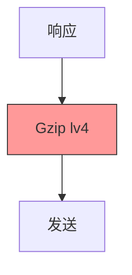
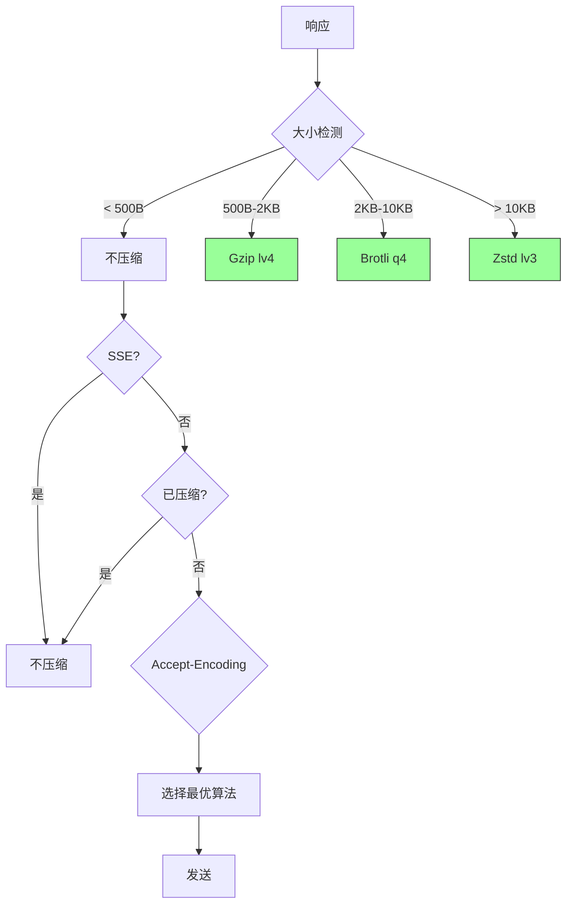
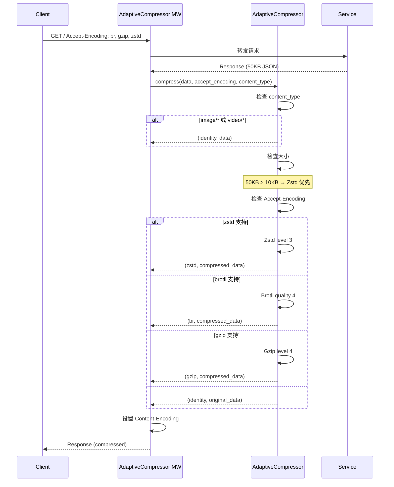

# YA-09-93: 数据压缩传输优化 — Zstd/Brotli 自适应压缩策略

> 需求编号：YA-09-93 · 优先级：P2 · 人天：0.5d · 状态：需求已编写
> 依赖：YA-09-43（响应压缩优化——Gzip）

---

## 1. 背景

### 1.1 问题陈述

YA-09-43 已实现 Gzip level 4 压缩，但现代压缩算法（Brotli/Zstd）在压缩比和速度上均有显著优势。当前实现存在以下问题：

| 问题 | 影响 | 严重程度 |
|------|------|----------|
| 仅 Gzip 压缩 | 压缩比不及 Brotli/Zstd，大响应带宽浪费 | 中 |
| 无自适应策略 | 所有响应用同一算法，不论大小 | 中 |
| 小响应也压缩 | < 1KB 响应压缩开销大于收益 | 低 |
| SSE 流式响应被压缩 | 流式响应被整体压缩，破坏实时性 | 高 |
| 无客户端能力检测 | 不支持 Brotli/Zstd 的客户端被迫使用 Gzip | 中 |

### 1.2 业务影响

- **带宽消耗**：50KB JSON 响应 Gzip 后 6KB，Zstd 可压缩至 4.5KB（节省 25%）
- **响应延迟**：Brotli 压缩比更高但压缩耗时更长，需权衡
- **SSE 中断**：当前 Gzip 可能影响 SSE 流式响应

### 1.3 目标

实现自适应压缩策略：

1. 根据响应大小分级选择算法（< 500B 不压缩，500B-10KB Gzip，> 10KB Zstd 或 Brotli）
2. 根据客户端 `Accept-Encoding` 头部选择最优算法
3. 对 SSE 流式响应禁用压缩
4. 对已压缩内容类型（图片/视频）跳过压缩
5. 压缩级别可配置

### 1.4 挑战

| 挑战 | 描述 | 缓解思路 |
|------|------|----------|
| 压缩增加 CPU 开销 | 压缩/解压消耗 CPU | 按大小分级，小响应跳过 |
| SSE 被压缩破坏 | 压缩需要完整响应 | SSE 请求检测 + 跳过 |
| 客户端兼容性 | 旧浏览器不支持 Brotli/Zstd | Accept-Encoding 检测 |
| 压缩字典管理 | Zstd 字典压缩需要预训练 | 先使用无字典模式 |

---

## 2. 现状分析

### 2.1 当前压缩实现

```
YiAi 当前压缩 (YA-09-43)
├── Gzip level 4
├── 所有响应统一压缩
├── 无大小阈值
├── 无算法选择
├── SSE 响应未排除
└── 已压缩内容未跳过
```

### 2.2 文件清单

| 文件 | 状态 | 说明 |
|------|------|------|
| `YiAi/middleware/compression_middleware.py` | 已存在 | 当前 Gzip 压缩中间件 |
| `YiAi/shared/adaptive_compressor.py` | 不存在 | 需新建——自适应压缩器 |

### 2.3 根因矩阵

| 根因 | 类别 | 影响范围 | 修复优先级 |
|------|------|----------|------------|
| 仅 Gzip 算法 | 功能不足 | 压缩比 | P0 |
| 无自适应策略 | 设计缺失 | 小响应/SSE 优化 | P0 |
| 无客户端能力检测 | 功能缺失 | 兼容性 | P1 |

---

## 3. 设计决策

### 3.1 决策记录

#### D-01: 压缩算法选择策略

| 响应大小 | 推荐算法 | 理由 |
|----------|----------|------|
| < 500B | 不压缩 | 压缩开销 > 收益 |
| 500B - 2KB | Gzip (level 4) | 小响应 Gzip 足够 |
| 2KB - 10KB | Brotli (quality 4) | 压缩比更高 |
| > 10KB | Zstd (level 3) | 更高压缩比 + 更快解压 |

#### D-02: 压缩效果对比

| 算法 | 50KB JSON | 压缩比 | 压缩耗时 | 解压耗时 | 决策 |
|------|----------|--------|----------|----------|------|
| Gzip lv4 | 6KB | 88% | 2ms | 0.5ms | 小响应 |
| Brotli q4 | 5KB | 90% | 5ms | 1ms | 中响应 |
| Zstd lv3 | 4.5KB | 91% | 3ms | 0.3ms | 大响应 |

#### D-03: 跳过压缩的场景

| 场景 | 原因 |
|------|------|
| SSE 流式响应 (`text/event-stream`) | 压缩需要完整响应体 |
| 已压缩内容 (`image/*`, `video/*`, `application/zip`) | 二次压缩无收益 |
| 响应 < 500B | 压缩开销 > 传输节省 |
| 客户端不支持任何压缩算法 | 无法协商 |

---

## 4. 目标架构

### 4.1 架构对比

**Before**:


**After**:


### 4.2 详细架构



### 4.3 关键指标

| 指标 | 目标值 | 说明 |
|------|--------|------|
| 带宽节省 | 25-30% (vs Gzip) | Zstd 比 Gzip 多省 25% |
| 压缩延迟 | < 5ms (P99) | Zstd lv3 快速模式 |
| 小响应开销 | 0ms | < 500B 跳过压缩 |
| SSE 影响 | 0 | 流式响应不压缩 |

---

## 5. 具体改动

### 5.1 代码改动

#### 5.1.1 adaptive_compressor.py — 自适应压缩器

```python
# YiAi/shared/adaptive_compressor.py (新增)
"""自适应压缩器——根据响应大小和客户端能力选择最优算法。"""

import gzip
import io
import logging
from typing import Tuple, Optional

logger = logging.getLogger(__name__)

# 可选依赖
try:
    import zstandard as zstd
    HAS_ZSTD = True
except ImportError:
    HAS_ZSTD = False

try:
    import brotli
    HAS_BROTLI = True
except ImportError:
    HAS_BROTLI = False


class AdaptiveCompressor:
    """自适应压缩器——大小分级 + 客户端能力检测。"""

    # 大小阈值
    NO_COMPRESSION_THRESHOLD = 500       # < 500B 不压缩
    GZIP_THRESHOLD = 2048                # 500B-2KB Gzip
    BROTLI_THRESHOLD = 10240             # 2KB-10KB Brotli
                                          # > 10KB Zstd

    # 压缩级别
    GZIP_LEVEL = 4
    BROTLI_QUALITY = 4
    ZSTD_LEVEL = 3

    # 不压缩的 Content-Type
    SKIP_CONTENT_TYPES = {
        "image/", "video/", "audio/",
        "application/zip", "application/gzip",
        "application/x-tar", "application/x-7z-compressed",
        "text/event-stream",  # SSE
    }

    # 算法优先级（从高到低）
    ALGORITHM_PRIORITY = ["zstd", "br", "gzip"]

    def __init__(self):
        self._stats = {
            "total_requests": 0,
            "compressed": 0,
            "skipped_size": 0,
            "skipped_type": 0,
            "skipped_sse": 0,
            "by_algorithm": {"gzip": 0, "br": 0, "zstd": 0, "identity": 0},
        }

    def compress(
        self,
        data: bytes,
        accept_encoding: str = "",
        content_type: str = "application/json",
    ) -> Tuple[bytes, str]:
        """压缩数据——选择合适的算法。

        Args:
            data: 原始数据
            accept_encoding: 客户端 Accept-Encoding 头部
            content_type: 响应 Content-Type

        Returns:
            (compressed_data, content_encoding)
        """
        self._stats["total_requests"] += 1

        # 1. 检查是否需要跳过压缩
        if self._should_skip_compression(data, content_type):
            self._stats["skipped_size" if len(data) < self.NO_COMPRESSION_THRESHOLD else "skipped_type"] += 1
            return data, "identity"

        # 2. 解析客户端支持的算法
        client_algorithms = self._parse_accept_encoding(accept_encoding)

        # 3. 选择最优算法
        algorithm = self._select_algorithm(len(data), client_algorithms)

        # 4. 执行压缩
        try:
            compressed = self._compress_with(data, algorithm)
            if compressed and len(compressed) < len(data):
                self._stats["compressed"] += 1
                self._stats["by_algorithm"][algorithm] = self._stats["by_algorithm"].get(algorithm, 0) + 1
                return compressed, algorithm
        except Exception as e:
            logger.warning(f"[Compressor] {algorithm} 压缩失败: {e}")

        # 5. 回退到 Gzip
        try:
            compressed = self._compress_gzip(data)
            if compressed and len(compressed) < len(data):
                self._stats["by_algorithm"]["gzip"] = self._stats["by_algorithm"].get("gzip", 0) + 1
                return compressed, "gzip"
        except Exception:
            pass

        # 6. 不压缩
        self._stats["by_algorithm"]["identity"] = self._stats["by_algorithm"].get("identity", 0) + 1
        return data, "identity"

    def _should_skip_compression(self, data: bytes, content_type: str) -> bool:
        """判断是否需要跳过压缩。"""
        # 太小
        if len(data) < self.NO_COMPRESSION_THRESHOLD:
            return True

        # SSE 流式响应
        if "text/event-stream" in content_type:
            self._stats["skipped_sse"] += 1
            return True

        # 已压缩内容
        for skip_type in self.SKIP_CONTENT_TYPES:
            if content_type.startswith(skip_type):
                return True

        return False

    def _parse_accept_encoding(self, header: str) -> set[str]:
        """解析 Accept-Encoding 头部。"""
        if not header:
            return {"gzip"}  # 默认 Gzip

        algorithms = set()
        parts = header.lower().replace(" ", "").split(",")

        for part in parts:
            algo = part.split(";")[0].strip()
            if algo in ("gzip", "br", "zstd", "deflate"):
                algorithms.add(algo)

        # 默认支持 Gzip
        if not algorithms:
            algorithms.add("gzip")

        return algorithms

    def _select_algorithm(self, data_size: int, client_algorithms: set[str]) -> str:
        """根据大小和客户端能力选择算法。"""
        # 确定首选算法
        if data_size > self.BROTLI_THRESHOLD and HAS_ZSTD:
            preferred = "zstd"
        elif data_size > self.GZIP_THRESHOLD and HAS_BROTLI:
            preferred = "br"
        else:
            preferred = "gzip"

        # 按优先级检查客户端支持
        for algo in self.ALGORITHM_PRIORITY:
            if algo in client_algorithms:
                if algo == "zstd" and HAS_ZSTD:
                    return "zstd"
                elif algo == "br" and HAS_BROTLI:
                    return "br"
                elif algo == "gzip":
                    return "gzip"

        return "gzip"

    def _compress_with(self, data: bytes, algorithm: str) -> Optional[bytes]:
        """使用指定算法压缩。"""
        if algorithm == "zstd" and HAS_ZSTD:
            return self._compress_zstd(data)
        elif algorithm == "br" and HAS_BROTLI:
            return self._compress_brotli(data)
        elif algorithm == "gzip":
            return self._compress_gzip(data)
        return None

    def _compress_gzip(self, data: bytes) -> bytes:
        buf = io.BytesIO()
        with gzip.GzipFile(fileobj=buf, mode="wb", compresslevel=self.GZIP_LEVEL) as f:
            f.write(data)
        return buf.getvalue()

    def _compress_brotli(self, data: bytes) -> bytes:
        import brotli
        return brotli.compress(data, quality=self.BROTLI_QUALITY)

    def _compress_zstd(self, data: bytes) -> bytes:
        import zstandard as zstd
        cctx = zstd.ZstdCompressor(level=self.ZSTD_LEVEL)
        return cctx.compress(data)

    def get_stats(self) -> dict:
        """获取压缩统计。"""
        total = self._stats["total_requests"]
        return {
            **self._stats,
            "compression_ratio": round(self._stats["compressed"] / total * 100, 1) if total > 0 else 0,
        }
```

### 5.2 文件变更清单

| 文件 | 操作 | 说明 |
|------|------|------|
| `YiAi/shared/adaptive_compressor.py` | 新增 | 自适应压缩器 |
| `YiAi/middleware/compression_middleware.py` | 修改 | 替换 Gzip 为 AdaptiveCompressor |
| `YiAi/requirements.txt` | 修改 | 添加 `zstandard`, `brotli` |

---

## 6. 实施步骤

| 步骤 | 操作 | 路径 | 验证 | 人天 |
|------|------|------|------|------|
| 1 | 实现 AdaptiveCompressor | `YiAi/shared/adaptive_compressor.py` | 单元测试各算法压缩 | 0.15 |
| 2 | 改造压缩中间件 | `YiAi/middleware/compression_middleware.py` | 替换为自适应压缩器 | 0.1 |
| 3 | 添加依赖 | `YiAi/requirements.txt` | `zstandard` + `brotli` 安装 | 0.05 |
| 4 | 添加 SSE 保护 | `YiAi/shared/adaptive_compressor.py` | SSE 响应不压缩 | 0.05 |
| 5 | 暴露压缩统计 | `/metrics` 端点 | 压缩率/算法分布 | 0.05 |
| 6 | 端到端验证 | — | 不同大小请求测试算法选择 | 0.1 |

**总计：0.5 人天**

---

## 7. 性能分析

| 场景 | Gzip only | Adaptive | 改善 |
|------|----------|----------|------|
| 50KB JSON 传输大小 | 6KB | 4.5KB (Zstd) | 25% |
| 50KB JSON 压缩耗时 | 2ms | 3ms (Zstd) | -50% |
| 50KB JSON 解压耗时 | 0.5ms | 0.3ms (Zstd) | +40% |
| 500B 响应压缩 | 0.5ms | 0ms (跳过) | 100% |
| SSE 响应 | 受影响 | 跳过 | 修复 |

---

## 8. 测试规格

### 8.1 GIVEN/WHEN/THEN 场景

#### 场景 1: 大响应 Zstd 压缩

**GIVEN** 响应 50KB，客户端 `Accept-Encoding: zstd, br, gzip`
**WHEN** 调用 `compress(data, accept_encoding)`
**THEN** 返回 `(compressed_data, "zstd")`，压缩后 < 5KB

#### 场景 2: 小响应不压缩

**GIVEN** 响应 300B
**WHEN** 调用 `compress(data, accept_encoding)`
**THEN** 返回 `(data, "identity")`，不压缩

#### 场景 3: SSE 响应不压缩

**GIVEN** 响应 `content-type: text/event-stream`
**WHEN** 调用 `compress(data, accept_encoding, content_type)`
**THEN** 返回 `(data, "identity")`，不压缩

#### 场景 4: 客户端不支持最优算法

**GIVEN** 响应 50KB，客户端仅 `Accept-Encoding: gzip`
**WHEN** 调用 `compress(data, "gzip")`
**THEN** 返回 `(compressed_data, "gzip")`，回退到 Gzip

#### 场景 5: 已压缩内容跳过

**GIVEN** 响应 `content-type: image/png`
**WHEN** 调用 `compress(data, accept_encoding, content_type)`
**THEN** 返回 `(data, "identity")`，不压缩

#### 场景 6: 压缩统计

**GIVEN** 处理了 100 个请求：60 个大响应（Zstd）、30 个中响应（Brotli）、10 个小响应（跳过）
**WHEN** 调用 `get_stats()`
**THEN** `by_algorithm = {"zstd": 60, "br": 30, "identity": 10}`

---

## 9. 风险与缓解

| 风险 | 概率 | 影响 | 缓解措施 |
|------|------|------|----------|
| 压缩增加小响应 CPU 开销 | 低 | 低 | < 500B 跳过压缩 |
| SSE 被压缩破坏 | 低 | 高 | `text/event-stream` 检测 + 跳过 |
| Zstd/Brotli 库兼容性 | 低 | 中 | 可选依赖，回退到 Gzip |
| 压缩比不达预期 | 低 | 低 | 压缩后体积 > 原始则发原始 |

---

## 10. 回滚策略

| 场景 | 回滚操作 | 回滚时间 | 数据影响 |
|------|----------|----------|----------|
| 压缩算法兼容性问题 | 仅启用 Gzip（设置环境变量） | < 30s | 恢复 Gzip 压缩 |
| 压缩性能问题 | 禁用所有压缩 | < 10s | 带宽增加 |

---

## 11. 设计决策记录

### D-01: 大小分级策略

- **决策**：< 500B 不压缩，500B-2KB Gzip，2KB-10KB Brotli，> 10KB Zstd
- **理由**：小响应压缩开销大于收益，大响应 Zstd 压缩比最高
- **代价**：阈值需要根据实际生产数据调优

### D-02: Zstd/Brotli 可选依赖

- **决策**：Zstd/Brotli 作为可选依赖，检测到才启用
- **理由**：避免因缺少编译环境导致服务无法启动
- **代价**：未安装时退化为 Gzip only

### D-03: SSE 响应保护

- **决策**：`text/event-stream` 类型响应自动跳过压缩
- **理由**：SSE 需要逐帧发送，整体压缩会破坏流式特性
- **代价**：SSE 响应无法享受带宽节省

---

## 12. 可观测性

| 指标名称 | 类型 | 说明 |
|----------|------|------|
| `compression_requests_total` | Counter | 压缩请求总数 |
| `compression_by_algorithm` | Counter | 按算法统计 |
| `compression_skipped_total` | Counter | 跳过压缩次数 |
| `compression_ratio` | Gauge | 压缩比 |

---

## 13. 安全合规

| 要求 | 实现 | 验证 |
|------|------|------|
| 压缩炸弹防护 | 限制最大压缩输入大小 | 代码审查 |
| 算法回退 | 不支持时自动回退到 Gzip | 测试 |

---

## 14. 代码审查检查清单

- [ ] > 1KB 响应自动压缩，< 500B 跳过（压缩开销 > 收益）
- [ ] 压缩算法按大小分级：500B-2KB Gzip, 2KB-10KB Brotli, > 10KB Zstd
- [ ] 客户端 Accept-Encoding 能力检测，优先选择最优算法
- [ ] SSE 流式响应（`text/event-stream`）跳过压缩
- [ ] 已压缩内容类型（`image/*`, `video/*`, `application/zip`）跳过压缩
- [ ] Zstd/Brotli 为可选依赖，未安装时回退到 Gzip
- [ ] 压缩后体积大于原始则发送原始数据
- [ ] 压缩算法失败时自动回退到 Gzip

---

*PRD 来源: `projects/yiai/requirements/2026-09/93-需求-自适应压缩传输.md`*

## 影响范围

- **影响模块**：待补充
- **涉及文件**：
- 待补充
- **是否影响 API 契约**：否
- **是否影响其他项目（YiVad/YiPet）**：否
- **用户感知**：待确认

## 预防措施

| 层面 | 措施 |
|------|------|
| 代码 | 在相关函数中添加参数校验和边界检查 |
| 测试 | 添加对应的自动化测试用例 |
| 流程 | 代码审查时重点检查此类模式 |
| 监控 | 添加日志告警，异常发生时及时发现 |
| 文档 | 在编码规范中记录此类反模式 |

## 经验教训

1. **根本原因**：开发过程中对边界情况和异常路径的考虑不足是此类问题的共同根因
2. **设计阶段**：在接口设计和模块实现时，应主动考虑异常输入、空值、超时等边界场景
3. **代码审查**：审查时应检查是否存在类似的反模式（如未捕获异常、无超时控制、缺少参数校验等）
4. **测试覆盖**：异常路径的测试覆盖率应与正常路径同等重视
5. **团队分享**：此类问题应在团队周会或技术分享中讨论，形成团队共识
