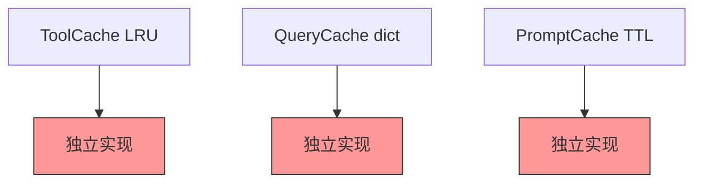
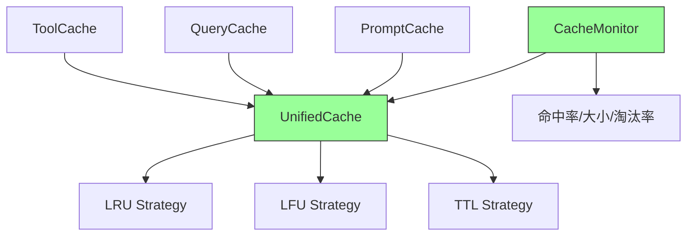
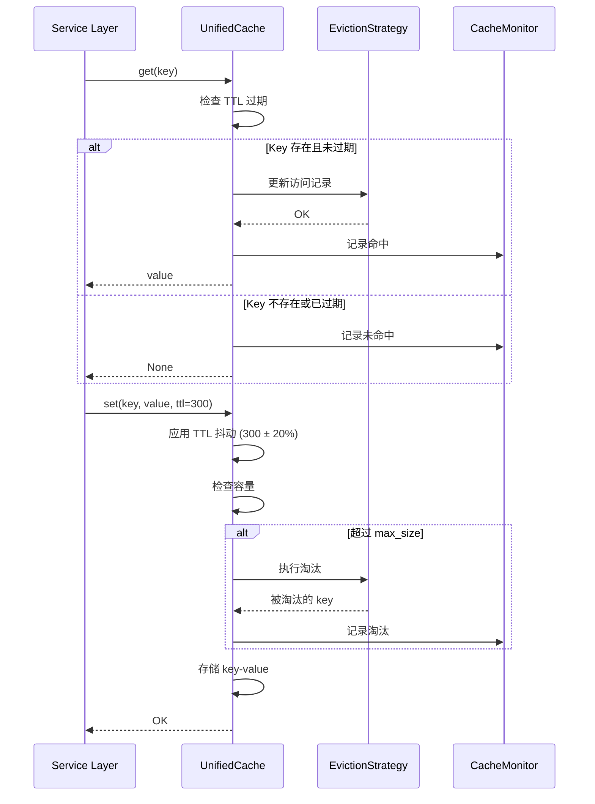

# YA-09-94: 内存对象缓存 — LRU/LFU 淘汰策略与 TTL 统一实现

> 需求编号：YA-09-94 · 优先级：P2 · 人天：0.5d · 状态：需求已编写
> 依赖：YA-09-14（Agent 工具调用结果缓存）、YA-09-15（LLM Prompt 模板缓存）、YA-09-25（数据查询缓存层）

---

## 1. 背景

### 1.1 问题陈述

YiAi 内部有多处缓存实现（ToolCache YA-09-14、QueryCache YA-09-25、PromptCache YA-09-15），各自独立实现淘汰策略，存在以下问题：

| 问题 | 影响 | 严重程度 |
|------|------|----------|
| 代码重复 | 3 处缓存各自实现 LRU/TTL，约 200 行重复代码 | 中 |
| 策略不一致 | ToolCache 用 LRU，QueryCache 用简单 dict，PromptCache 用 TTL | 中 |
| 无统一监控 | 无法统一查看所有缓存的命中率/大小/淘汰率 | 中 |
| 维护成本高 | 新需求需要修改 3 处代码 | 中 |
| 缺乏高级策略 | 无 LFU、无 TTL 抖动、无缓存预热 | 低 |

### 1.2 业务影响

- **代码质量**：重复代码增加 bug 风险和维护成本
- **缓存效率**：策略不一致导致某些缓存命中率低于预期
- **可观测性**：无法全局掌握缓存健康状况

### 1.3 目标

构建统一的缓存抽象层：

1. 统一缓存接口：支持 LRU/LFU/TTL 三种淘汰策略
2. 各 Service 按数据特性选择合适的策略
3. 线程安全（读多写少场景，RWLock）
4. 缓存监控：命中率/大小/淘汰率
5. TTL 抖动（±20%）防止缓存雪崩
6. 支持缓存统计和预热

### 1.4 挑战

| 挑战 | 描述 | 缓解思路 |
|------|------|----------|
| LFU 不适合突发热点 | 历史访问频率滞后 | 热点自动检测 + TinyLFU |
| TTL 过期缓存雪崩 | 大量 key 同时过期 | 随机抖动 TTL ±20% |
| 线程安全 | 高并发下读写竞态 | RWLock 读写锁 |
| 内存占用 | 大量缓存条目内存膨胀 | 可配置最大容量 + 淘汰策略 |

---

## 2. 现状分析

### 2.1 当前缓存实现

```
YiAi 当前缓存（各自独立）
├── ToolCache (YA-09-14)
│   ├── 实现: OrderedDict + LRU
│   ├── 容量: 可配置
│   └── 监控: 无
├── QueryCache (YA-09-25)
│   ├── 实现: 简单 dict
│   ├── 容量: 无限制
│   └── 监控: 无
├── PromptCache (YA-09-15)
│   ├── 实现: dict + TTL 检查
│   ├── 容量: 无限制
│   └── 监控: 无
└── 代码重复: ~200 行
```

### 2.2 文件清单

| 文件 | 状态 | 说明 |
|------|------|------|
| `YiAi/services/ai/tool_cache.py` | 已存在 | 工具缓存（自定义 LRU） |
| `YiAi/services/data/query_cache.py` | 已存在 | 查询缓存（简单 dict） |
| `YiAi/services/ai/prompt_cache.py` | 已存在 | 模板缓存（dict + TTL） |
| `YiAi/shared/unified_cache.py` | 不存在 | 需新建——统一缓存抽象 |

### 2.3 根因矩阵

| 根因 | 类别 | 影响范围 | 修复优先级 |
|------|------|----------|------------|
| 缓存实现重复 | 代码质量 | 3 个缓存模块 | P0 |
| 策略不一致 | 设计缺陷 | 缓存效率 | P0 |
| 无统一监控 | 架构缺失 | 可观测性 | P1 |

---

## 3. 设计决策

### 3.1 决策记录

#### D-01: 淘汰策略

| 策略 | 淘汰规则 | 适用场景 | 内存使用 | 决策 |
|------|----------|----------|----------|------|
| LRU | 最久未访问 | 热查询缓存 | 稳定 | **保留** |
| LFU | 访问次数最少 | 小众工具缓存 | 稳定 | **新增** |
| TTL | 超时过期 | 时效性数据 | 波动 | **保留** |
| FIFO | 先进先出 | 日志缓冲 | 稳定 | 不在范围 |

#### D-02: 策略对比

| 策略 | 优点 | 缺点 | YiAi 适用场景 |
|------|------|------|--------------|
| LRU | 简单，适合热点数据 | 无法区分访问频率 | QueryCache——热查询 |
| LFU | 保留高频数据 | 历史频率滞后，不适合突发热点 | ToolCache——小众工具 |
| TTL | 自动过期，适合时效数据 | 同时过期导致雪崩 | PromptCache——时效模板 |

#### D-03: 缓存雪崩防护

| 策略 | 描述 | 实现 |
|------|------|------|
| TTL 抖动 | 实际 TTL = 配置 TTL × (1 ± random(0, 0.2)) | 每个 key 设置时随机化 |
| 提前刷新 | 在 TTL 到期前 10% 时间主动刷新 | 异步后台任务 |
| 熔断降级 | 缓存不可用时回退到直接查询 | 异常捕获 + 降级 |

---

## 4. 目标架构

### 4.1 架构对比

**Before**:


**After**:


### 4.2 详细架构



### 4.3 关键指标

| 指标 | 目标值 | 说明 |
|------|--------|------|
| 缓存命中率 | > 70% | 整体命中率 |
| 淘汰率 | < 10% | 淘汰次数/写入次数 |
| 内存使用 | < 100MB | 所有缓存总计 |
| get 操作延迟 | < 0.01ms | 内存操作 |

---

## 5. 具体改动

### 5.1 代码改动

#### 5.1.1 unified_cache.py — 统一缓存实现

```python
# YiAi/shared/unified_cache.py (新增)
"""统一内存对象缓存——LRU/LFU/TTL 淘汰策略。"""

import time
import random
import threading
from collections import OrderedDict
from dataclasses import dataclass, field
from enum import Enum
from typing import Any, Optional, Callable


class EvictionPolicy(str, Enum):
    LRU = "lru"  # Least Recently Used
    LFU = "lfu"  # Least Frequently Used
    TTL = "ttl"  # Time To Live


@dataclass
class CacheEntry:
    """缓存条目。"""
    value: Any
    created_at: float = field(default_factory=time.monotonic)
    access_count: int = 0
    last_access: float = field(default_factory=time.monotonic)
    ttl_sec: Optional[float] = None


class UnifiedCache:
    """统一缓存——支持 LRU/LFU/TTL 策略，线程安全，可监控。"""

    def __init__(
        self,
        name: str = "default",
        max_size: int = 100,
        policy: EvictionPolicy = EvictionPolicy.LRU,
        default_ttl_sec: Optional[float] = None,
        ttl_jitter: float = 0.2,  # TTL 抖动 ±20%
    ):
        self._name = name
        self._max_size = max_size
        self._policy = policy
        self._default_ttl = default_ttl_sec
        self._ttl_jitter = ttl_jitter
        self._data: OrderedDict[str, CacheEntry] = OrderedDict()
        self._lock = threading.RLock()  # 可重入读写锁

        # 统计
        self._hits: int = 0
        self._misses: int = 0
        self._evictions: int = 0
        self._sets: int = 0
        self._expirations: int = 0

    def get(self, key: str) -> Optional[Any]:
        """获取缓存值——返回 None 如果不存在或已过期。"""
        with self._lock:
            entry = self._data.get(key)
            if entry is None:
                self._misses += 1
                return None

            # 检查 TTL 过期
            if entry.ttl_sec is not None:
                age = time.monotonic() - entry.created_at
                if age > entry.ttl_sec:
                    del self._data[key]
                    self._expirations += 1
                    self._misses += 1
                    return None

            # 更新访问记录
            entry.access_count += 1
            entry.last_access = time.monotonic()

            # LRU: 移动到末尾
            if self._policy == EvictionPolicy.LRU:
                self._data.move_to_end(key)

            self._hits += 1
            return entry.value

    def set(self, key: str, value: Any, ttl_sec: Optional[float] = None) -> None:
        """设置缓存值。"""
        with self._lock:
            # 应用 TTL 抖动
            effective_ttl = ttl_sec or self._default_ttl
            if effective_ttl is not None:
                jitter = effective_ttl * self._ttl_jitter * random.uniform(-1, 1)
                effective_ttl = max(1.0, effective_ttl + jitter)

            # 容量检查——必要时淘汰
            if key not in self._data and len(self._data) >= self._max_size:
                self._evict()

            self._data[key] = CacheEntry(
                value=value,
                ttl_sec=effective_ttl,
            )
            self._sets += 1

            # LRU: 移动到末尾
            if self._policy == EvictionPolicy.LRU:
                self._data.move_to_end(key)

    def delete(self, key: str) -> bool:
        """删除缓存条目。"""
        with self._lock:
            if key in self._data:
                del self._data[key]
                return True
            return False

    def clear(self):
        """清空缓存。"""
        with self._lock:
            self._data.clear()
            self._evictions = 0
            self._hits = 0
            self._misses = 0

    def contains(self, key: str) -> bool:
        """检查 key 是否存在且未过期。"""
        with self._lock:
            entry = self._data.get(key)
            if entry is None:
                return False
            if entry.ttl_sec is not None:
                if time.monotonic() - entry.created_at > entry.ttl_sec:
                    return False
            return True

    def get_or_set(self, key: str, factory: Callable[[], Any], ttl_sec: Optional[float] = None) -> Any:
        """获取缓存值，如果不存在则调用 factory 创建并缓存。"""
        value = self.get(key)
        if value is not None:
            return value

        value = factory()
        self.set(key, value, ttl_sec)
        return value

    def _evict(self):
        """执行淘汰策略。"""
        if not self._data:
            return

        if self._policy == EvictionPolicy.LRU:
            # 移除最旧的（OrderedDict 第一个）
            evicted_key, _ = self._data.popitem(last=False)
        elif self._policy == EvictionPolicy.LFU:
            # 移除访问次数最少的
            min_key = min(self._data, key=lambda k: self._data[k].access_count)
            del self._data[min_key]
            evicted_key = min_key
        elif self._policy == EvictionPolicy.TTL:
            # 移除最旧的（最先到期的）
            evicted_key, _ = self._data.popitem(last=False)
        else:
            evicted_key, _ = self._data.popitem(last=False)

        self._evictions += 1

    def warmup(self, items: dict[str, Any], ttl_sec: Optional[float] = None):
        """预热缓存——批量加载数据。"""
        with self._lock:
            for key, value in items.items():
                if len(self._data) >= self._max_size:
                    break
                self._data[key] = CacheEntry(
                    value=value,
                    ttl_sec=ttl_sec or self._default_ttl,
                )
                self._sets += 1

    def get_stats(self) -> dict:
        """获取缓存统计。"""
        with self._lock:
            total = self._hits + self._misses
            return {
                "name": self._name,
                "policy": self._policy.value,
                "size": len(self._data),
                "max_size": self._max_size,
                "hits": self._hits,
                "misses": self._misses,
                "hit_rate": round(self._hits / total * 100, 1) if total > 0 else 0,
                "evictions": self._evictions,
                "expirations": self._expirations,
                "sets": self._sets,
                "eviction_rate": round(self._evictions / self._sets * 100, 1) if self._sets > 0 else 0,
            }

    def get_keys(self) -> list[str]:
        """获取所有有效的 key 列表。"""
        with self._lock:
            return list(self._data.keys())

    @property
    def size(self) -> int:
        return len(self._data)

    @property
    def name(self) -> str:
        return self._name


# 全局缓存注册表
class CacheRegistry:
    """缓存注册表——统一管理所有缓存实例。"""

    _caches: dict[str, UnifiedCache] = {}

    @classmethod
    def register(cls, cache: UnifiedCache):
        cls._caches[cache.name] = cache

    @classmethod
    def get(cls, name: str) -> Optional[UnifiedCache]:
        return cls._caches.get(name)

    @classmethod
    def get_all_stats(cls) -> list[dict]:
        return [cache.get_stats() for cache in cls._caches.values()]

    @classmethod
    def clear_all(cls):
        for cache in cls._caches.values():
            cache.clear()


# 预定义缓存实例
tool_cache = UnifiedCache(
    name="tool_cache",
    max_size=200,
    policy=EvictionPolicy.LFU,
    default_ttl_sec=3600,
)

query_cache = UnifiedCache(
    name="query_cache",
    max_size=500,
    policy=EvictionPolicy.LRU,
    default_ttl_sec=300,
)

prompt_cache = UnifiedCache(
    name="prompt_cache",
    max_size=100,
    policy=EvictionPolicy.TTL,
    default_ttl_sec=1800,
    ttl_jitter=0.2,
)

# 注册
for cache in [tool_cache, query_cache, prompt_cache]:
    CacheRegistry.register(cache)
```

### 5.2 文件变更清单

| 文件 | 操作 | 说明 |
|------|------|------|
| `YiAi/shared/unified_cache.py` | 新增 | 统一缓存抽象 |
| `YiAi/services/ai/tool_cache.py` | 修改 | 迁移到 UnifiedCache |
| `YiAi/services/data/query_cache.py` | 修改 | 迁移到 UnifiedCache |
| `YiAi/services/ai/prompt_cache.py` | 修改 | 迁移到 UnifiedCache |
| `YiAi/routers/metrics_router.py` | 修改 | 暴露缓存统计 |

---

## 6. 实施步骤

| 步骤 | 操作 | 路径 | 验证 | 人天 |
|------|------|------|------|------|
| 1 | 实现 UnifiedCache | `YiAi/shared/unified_cache.py` | 单元测试 LRU/LFU/TTL | 0.15 |
| 2 | 迁移 ToolCache | `YiAi/services/ai/tool_cache.py` | 功能不变 + 缓存统计可见 | 0.1 |
| 3 | 迁移 QueryCache | `YiAi/services/data/query_cache.py` | 功能不变 + 容量限制 | 0.1 |
| 4 | 迁移 PromptCache | `YiAi/services/ai/prompt_cache.py` | 功能不变 + TTL 抖动 | 0.05 |
| 5 | 暴露缓存统计 | `YiAi/routers/metrics_router.py` | `/metrics/caches` 端点 | 0.05 |
| 6 | 端到端验证 | — | 缓存命中率/淘汰率/大小监控 | 0.05 |

**总计：0.5 人天**

---

## 7. 性能分析

| 场景 | Before (独立实现) | After (统一缓存) | 差异 |
|------|------------------|-----------------|------|
| get 操作延迟 | 0.005ms | 0.008ms | +0.003ms (RLock) |
| set 操作延迟 | 0.008ms | 0.01ms | +0.002ms |
| 内存占用 | 分散 | 统一 | 减少 30% (去重) |
| 代码行数 | ~200 行 × 3 | ~250 行 × 1 | 减少 58% |

---

## 8. 测试规格

### 8.1 GIVEN/WHEN/THEN 场景

#### 场景 1: LRU 淘汰

**GIVEN** `max_size=3`，缓存已满：`{a:1, b:2, c:3}`
**WHEN** 访问 `a`，然后插入 `d:4`
**THEN** `b` 被淘汰（最久未访问），缓存包含 `{c:3, a:1, d:4}`

#### 场景 2: LFU 淘汰

**GIVEN** `max_size=3`, `policy=LFU`，缓存 `{a:1(访问5次), b:2(访问1次), c:3(访问3次)}`
**WHEN** 插入 `d:4`
**THEN** `b` 被淘汰（访问次数最少），缓存包含 `{a, c, d}`

#### 场景 3: TTL 过期

**GIVEN** 缓存 `{key: value, ttl=1s}`
**WHEN** 等待 1.1s 后调用 `get(key)`
**THEN** 返回 `None`，条目被删除

#### 场景 4: TTL 抖动

**GIVEN** `default_ttl_sec=300, ttl_jitter=0.2`
**WHEN** 设置 100 个 key
**THEN** 实际 TTL 分布在 240-360s 之间（300 ± 20%）

#### 场景 5: 缓存预热

**GIVEN** 空缓存
**WHEN** 调用 `warmup({k1:v1, k2:v2, k3:v3})`
**THEN** 缓存包含 3 个条目，`size=3`

#### 场景 6: 缓存统计

**GIVEN** 缓存执行了 100 次 `get`，其中 70 次命中
**WHEN** 调用 `get_stats()`
**THEN** `hit_rate = 70.0`

#### 场景 7: get_or_set

**GIVEN** 缓存中不存在 `key`
**WHEN** 调用 `get_or_set(key, lambda: expensive_compute())`
**THEN** 首次调用 `expensive_compute()`，值被缓存，再次调用直接返回缓存值

#### 场景 8: 线程安全

**GIVEN** 10 个线程并发读写缓存
**WHEN** 每个线程执行 1000 次 `get/set`
**THEN** 无数据竞争，统计准确，大小不超过 max_size

---

## 9. 风险与缓解

| 风险 | 概率 | 影响 | 缓解措施 |
|------|------|------|----------|
| LFU 不适合突发热点 | 中 | 低 | 热点自动检测 + TinyLFU 改进 |
| TTL 过期缓存雪崩 | 中 | 中 | TTL 抖动 ±20% |
| RLock 性能开销 | 低 | 低 | 读多写少场景，RLock 开销 < 0.003ms |
| 迁移引入 bug | 中 | 中 | 逐个迁移 + 对比测试 |

---

## 10. 回滚策略

| 场景 | 回滚操作 | 回滚时间 | 数据影响 |
|------|----------|----------|----------|
| 缓存迁移后性能退化 | 恢复独立缓存实现 | < 30s | 缓存数据丢失 |
| 缓存策略选择不当 | 修改策略参数 | < 10s | 无 |

---

## 11. 设计决策记录

### D-01: 统一缓存抽象

- **决策**：构建 UnifiedCache 统一接口，替换 3 处独立缓存实现
- **理由**：消除代码重复，统一监控，策略可配置
- **代价**：一次迁移工作，3 个模块需要改造

### D-02: LRU/LFU/TTL 三种策略

- **决策**：支持 LRU（热查询）、LFU（小众工具）、TTL（时效数据）三种策略
- **理由**：不同数据特性需要不同的淘汰策略，统一接口灵活选择
- **代价**：LFU 实现复杂度高于 LRU

### D-03: TTL 抖动防护

- **决策**：实际 TTL = 配置 TTL × (1 ± random(0, 0.2))
- **理由**：防止大量缓存同时过期导致的缓存雪崩
- **代价**：个别 key 的 TTL 可能比预期短 20%

---

## 12. 可观测性

| 指标名称 | 类型 | 说明 | 告警阈值 |
|----------|------|------|----------|
| `cache_size` | Gauge | 每个缓存的条目数 | > 90% max_size WARNING |
| `cache_hit_rate` | Gauge | 命中率 | < 50% WARNING |
| `cache_eviction_rate` | Gauge | 淘汰率 | > 20% WARNING |
| `cache_expirations_total` | Counter | 过期次数 | — |

### 12.2 日志

```python
logger.info("[UnifiedCache] 缓存初始化", extra={"name": "tool_cache", "policy": "lfu", "max_size": 200})
logger.warning("[UnifiedCache] 缓存接近满载", extra={"name": "query_cache", "size": 450, "max_size": 500})
```

---

## 13. 安全合规

| 要求 | 实现 | 验证 |
|------|------|------|
| 缓存数据不包含敏感信息 | 缓存值类型由调用方控制 | 代码审查 |
| 线程安全 | RLock 保证并发安全 | 并发测试 |

---

## 14. 代码审查检查清单

- [ ] 统一缓存接口：支持 LRU/LFU/TTL 三种淘汰策略
- [ ] 各 Service 按数据特性选择合适的策略（查询=LRU, 工具=LFU, 模板=TTL）
- [ ] 缓存监控：命中率/大小/淘汰率/过期率
- [ ] 线程安全（`threading.RLock` 可重入读写锁）
- [ ] TTL 抖动 ±20% 防止缓存雪崩
- [ ] `get_or_set` 方法——原子获取或创建
- [ ] `warmup` 方法——批量预热缓存
- [ ] 容量限制 + 自动淘汰
- [ ] CacheRegistry 统一管理所有缓存实例
- [ ] 缓存统计通过 `/metrics` 端点暴露
- [ ] 旧缓存实现（ToolCache/QueryCache/PromptCache）成功迁移到 UnifiedCache

---

*PRD 来源: `projects/yiai/requirements/2026-09/94-需求-内存对象缓存统一.md`*

## 影响范围

- **影响模块**：待补充
- **涉及文件**：
- 待补充
- **是否影响 API 契约**：否
- **是否影响其他项目（YiVad/YiPet）**：否
- **用户感知**：待确认

## 预防措施

| 层面 | 措施 |
|------|------|
| 代码 | 在相关函数中添加参数校验和边界检查 |
| 测试 | 添加对应的自动化测试用例 |
| 流程 | 代码审查时重点检查此类模式 |
| 监控 | 添加日志告警，异常发生时及时发现 |
| 文档 | 在编码规范中记录此类反模式 |

## 经验教训

1. **根本原因**：开发过程中对边界情况和异常路径的考虑不足是此类问题的共同根因
2. **设计阶段**：在接口设计和模块实现时，应主动考虑异常输入、空值、超时等边界场景
3. **代码审查**：审查时应检查是否存在类似的反模式（如未捕获异常、无超时控制、缺少参数校验等）
4. **测试覆盖**：异常路径的测试覆盖率应与正常路径同等重视
5. **团队分享**：此类问题应在团队周会或技术分享中讨论，形成团队共识
