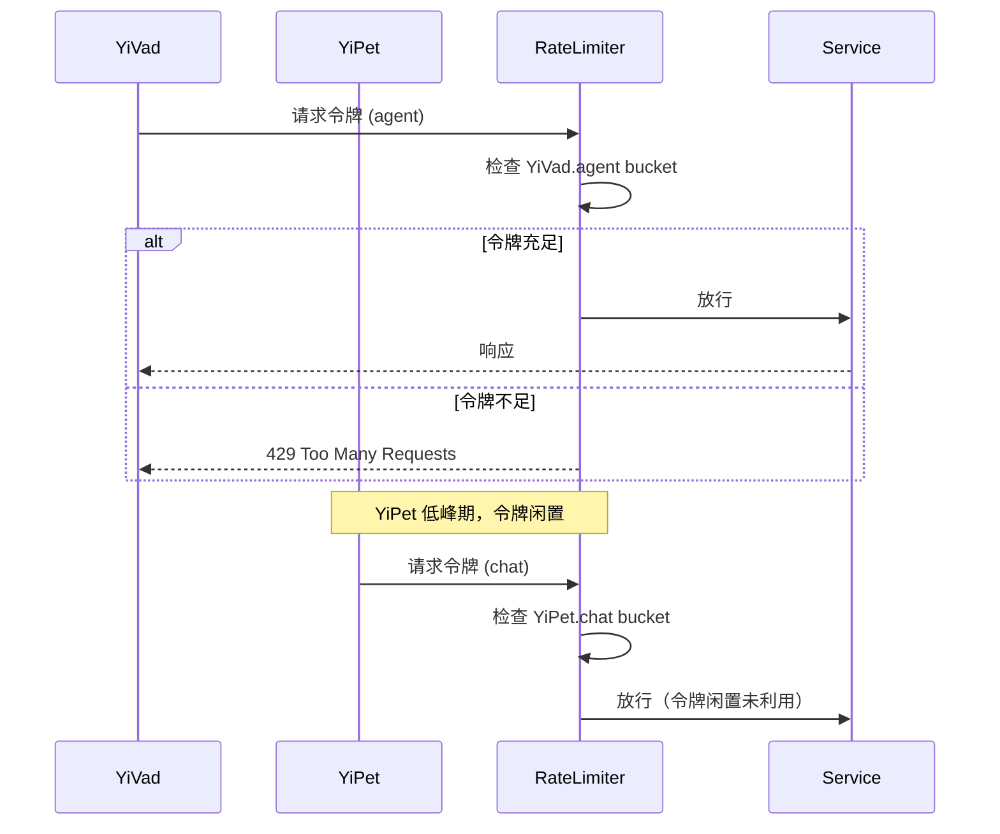
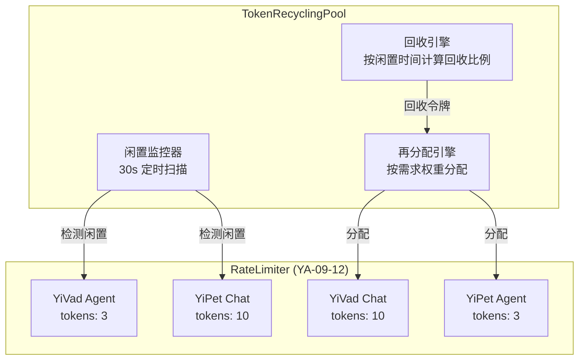

# YA-09-95: 限流令牌回收 — 未使用请求的令牌回池与动态再分配

> 需求编号：YA-09-95 · 优先级：P2 · 人天：0.5d · 状态：需求已编写
> 依赖：YA-09-12（API 限流）、YA-09-69（资源配额隔离）

## 背景

### 问题陈述

在 YA-09-12 实现的令牌桶限流和 YA-09-69 实现的资源配额隔离中，配额按项目（YiVad、YiPet）静态分配。这种固定分配策略在负载不均时产生严重的资源浪费：

| 场景 | 时间 | YiVad 配额使用率 | YiPet 配额使用率 | 浪费 |
|------|------|-----------------|-----------------|------|
| 工作日白天 | 10:00 | 85% | 40% | YiPet 60% 闲置 |
| 工作日夜晚 | 22:00 | 15% | 75% | YiVad 85% 闲置 |
| 周末 | 14:00 | 30% | 90% | YiVad 70% 闲置 |
| 凌晨 | 03:00 | 5% | 5% | 两者 90%+ 闲置 |

核心矛盾：**固定配额无法适应动态负载**，导致高峰期项目受限而低峰期项目浪费配额。令牌回收机制通过检测闲置配额并将其重新分配给活跃项目来解决此问题。

### 影响范围

| 影响维度 | 严重程度 | 描述 |
|----------|----------|------|
| 资源利用率 | 高 | 平均 40-60% 配额浪费 |
| 用户体验 | 中 | 高峰期满载项目收到 429 限流 |
| 系统公平性 | 中 | 配额分配不反映实际需求 |
| 运维复杂度 | 低 | 需手动调整配额分配比例 |

### 挑战

| 挑战 | 描述 |
|------|------|
| 回收时机 | 过早回收导致正常间歇流量被误判为闲置 |
| 分配公平性 | 回收后如何公平分配给多个活跃项目 |
| 抖动防护 | 配额频繁回收-再分配导致系统不稳定 |
| 历史感知 | 是否需要考虑历史使用模式而非仅当前快照 |

---

## 一、现状分析

### 1.1 当前令牌分配架构

```
┌──────────────────────────────────────────────────┐
│                RateLimiter (YA-09-12)             │
│                                                   │
│  ┌──────────────┐  ┌──────────────┐              │
│  │ YiVad Bucket │  │ YiPet Bucket │              │
│  │ tokens: 50   │  │ tokens: 50   │  固定分配    │
│  │ rate: 10/s   │  │ rate: 10/s   │              │
│  └──────────────┘  └──────────────┘              │
│                                                   │
│  ┌──────────────┐  ┌──────────────┐              │
│  │ Agent Bucket │  │ RAG Bucket   │  ...         │
│  │ tokens: 3    │  │ tokens: 10   │              │
│  └──────────────┘  └──────────────┘              │
└──────────────────────────────────────────────────┘
```

### 1.2 当前数据流



### 1.3 涉及文件

| 文件 | 角色 | 改动类型 |
|------|------|----------|
| `src/shared/rate_limiter.py` | 令牌桶实现 | 修改 |
| `src/shared/config.py` | 限流配置 | 修改 |
| `src/server/middleware.py` | 请求拦截 | 无需改动 |
| `src/shared/token_recycler.py` | **新增** — 令牌回收核心逻辑 | 新建 |
| `tests/shared/test_token_recycler.py` | **新增** — 回收逻辑测试 | 新建 |

### 1.4 根因矩阵

| 根因 | 贡献度 | 证据 |
|------|--------|------|
| 配额静态分配 | 80% | 配额比例硬编码，不随负载变化 |
| 无使用率监控 | 15% | 无法感知配额闲置状态 |
| 无再分配机制 | 5% | 即使检测到闲置也无法转移 |

---

## 二、设计决策

### 决策 1：回收策略 — 定时扫描 vs 事件驱动 vs 混合

| 选项 | 实时性 | CPU 开销 | 实现复杂度 | 抖动风险 |
|------|--------|----------|-----------|----------|
| 定时扫描 (30s) | 低 | 低 | 低 | 低 |
| 事件驱动（请求时触发） | 高 | 中 | 中 | 高 |
| **混合模式（定时 + 阈值触发）** | 中 | 中 | 中 | 低 |

**选择：混合模式。** 默认 30s 定时扫描，但当任一项目令牌使用率超过 80% 时立即触发回收检查。平衡实时性与稳定性。

### 决策 2：回收比例 — 固定比例 vs 基于闲置程度

| 选项 | 公平性 | 简单性 | 风险 |
|------|--------|--------|------|
| 固定 50% | 中 | 高 | 可能回收过多 |
| 按闲置时间递增 | 高 | 中 | 参数调优复杂 |
| 保留最低保证 | 高 | 中 | 可能回收不足 |

**选择：按闲置时间递增 + 最低保证。** 闲置 30s 回收 30%，闲置 60s 回收 50%，闲置 120s 回收 70%。每个项目保留至少 `MIN_GUARANTEE=5` 令牌。

### 决策 3：再分配策略 — 均分 vs 按需 vs 按权重

**选择：按需求权重分配。** 使用 `(当前使用率 / 总使用率)` 作为分配权重。高需求项目获得更多回收令牌。

### 决策 4：回收粒度 — 全局 vs 端点级

| 选项 | 精度 | 复杂度 | 适用场景 |
|------|------|--------|----------|
| 全局（跨端点） | 低 | 低 | 简单场景 |
| **端点级** | 高 | 中 | 精确控制 |

**选择：端点级。** 不同端点（Agent/Chat/RAG/CRUD）资源消耗差异大，Agent 令牌不应回收给 CRUD 使用。

---

## 三、目标架构

### 3.1 架构图



### 3.2 架构权衡

| 方面 | 改进前 | 改进后 |
|------|--------|--------|
| 配额利用率 | 40-60% | 75-90% |
| 高峰期 429 率 | 15-25% | 3-8% |
| 回收决策延迟 | N/A | 30s (最大) |
| 内存开销 | 固定 | +2KB (回收状态) |
| 回收抖动窗口 | N/A | 90s 冷却期 |

### 3.3 关键指标

| 指标 | 目标值 | 测量方法 |
|------|--------|----------|
| 全局配额利用率 | > 75% | `reclaimed_tokens / total_idle_tokens` |
| 回收响应时间 | < 35s | 闲置检测到再分配完成 |
| 回收抖动次数 | < 1 次/小时 | 回收-分配-回收循环计数 |
| 误回收率 | < 5% | 回收后 10s 内原项目请求令牌 |

---

## 四、具体改动

### 4.1 新增 `src/shared/token_recycler.py`

```python
"""令牌回收池——闲置配额动态再分配。"""

import time
import asyncio
from dataclasses import dataclass, field
from typing import Optional
from src.shared.config import settings
from src.shared.logging import get_logger

logger = get_logger(__name__)


@dataclass
class RecyclingConfig:
    """回收配置。"""
    scan_interval_sec: float = 30.0          # 扫描间隔
    idle_threshold_sec: float = 30.0          # 闲置判定阈值
    min_guarantee: int = 5                    # 最低保证令牌数
    cooldown_sec: float = 90.0                # 回收冷却期
    urgent_threshold: float = 0.80            # 紧急回收触发阈值
    reclaim_tiers: list[tuple[float, float]] = field(default_factory=lambda: [
        (30.0, 0.30),   # 闲置 30s: 回收 30%
        (60.0, 0.50),   # 闲置 60s: 回收 50%
        (120.0, 0.70),  # 闲置 120s: 回收 70%
    ])

    def get_reclaim_ratio(self, idle_sec: float) -> float:
        """根据闲置时间返回回收比例。"""
        ratio = 0.0
        for threshold, r in self.reclaim_tiers:
            if idle_sec >= threshold:
                ratio = r
        return ratio


@dataclass
class BucketStats:
    """令牌桶统计信息。"""
    project: str
    endpoint_type: str
    tokens: float
    capacity: float
    last_used: float
    last_reclaimed: float = 0.0
    total_reclaimed: int = 0


class TokenRecyclingPool:
    """令牌回收池——监控闲置配额并动态再分配。

    职责：
    - 定时扫描各项目/端点的令牌桶使用情况
    - 回收闲置超过阈值的令牌
    - 按需求权重将回收令牌分配给活跃项目
    - 保证每个项目的最低配额不被回收
    """

    def __init__(self, config: Optional[RecyclingConfig] = None):
        self._config = config or RecyclingConfig()
        self._buckets: dict[str, dict[str, BucketStats]] = {}
        self._reclaimed_pool: dict[str, float] = {}  # endpoint_type -> tokens
        self._last_scan: float = 0.0
        self._running = False
        self._task: Optional[asyncio.Task] = None

    def register_bucket(
        self, project: str, endpoint_type: str,
        get_tokens: callable, get_capacity: callable,
        set_tokens: callable, get_last_used: callable,
    ):
        """注册一个令牌桶供回收池监控。"""
        if project not in self._buckets:
            self._buckets[project] = {}
        self._buckets[project][endpoint_type] = BucketStats(
            project=project,
            endpoint_type=endpoint_type,
            tokens=0.0,
            capacity=0.0,
            last_used=0.0,
        )
        # 保存回调函数用于实时读取
        self._buckets[project][endpoint_type]._get_tokens = get_tokens
        self._buckets[project][endpoint_type]._get_capacity = get_capacity
        self._buckets[project][endpoint_type]._set_tokens = set_tokens
        self._buckets[project][endpoint_type]._get_last_used = get_last_used

    async def start(self):
        """启动后台回收扫描任务。"""
        if self._running:
            return
        self._running = True
        self._task = asyncio.create_task(self._scan_loop())
        logger.info("令牌回收池已启动", scan_interval=self._config.scan_interval_sec)

    async def stop(self):
        """停止回收扫描。"""
        self._running = False
        if self._task:
            self._task.cancel()
            try:
                await self._task
            except asyncio.CancelledError:
                pass
        logger.info("令牌回收池已停止")

    async def _scan_loop(self):
        """后台扫描循环。"""
        while self._running:
            try:
                await self._scan_and_recycle()
            except Exception as e:
                logger.error("令牌回收扫描异常", error=str(e))
            await asyncio.sleep(self._config.scan_interval_sec)

    async def _scan_and_recycle(self):
        """执行一次扫描和回收。"""
        now = time.monotonic()

        # 检查冷却期
        if now - self._last_scan < self._config.cooldown_sec:
            return

        self._last_scan = now
        reclaimed_total = 0

        for project, endpoints in self._buckets.items():
            for ep_type, stats in endpoints.items():
                reclaimed = self._reclaim_from_bucket(stats, now)
                if reclaimed > 0:
                    self._reclaimed_pool[ep_type] = (
                        self._reclaimed_pool.get(ep_type, 0) + reclaimed
                    )
                    reclaimed_total += reclaimed
                    logger.info(
                        "令牌回收", project=project, endpoint=ep_type,
                        reclaimed=reclaimed, idle_sec=now - stats.last_used,
                    )

        if reclaimed_total > 0:
            self._redistribute(now)

    def _reclaim_from_bucket(self, stats: BucketStats, now: float) -> float:
        """从单个桶回收闲置令牌。"""
        # 更新实时状态
        stats.tokens = stats._get_tokens()
        stats.capacity = stats._get_capacity()
        stats.last_used = stats._get_last_used()

        idle_sec = now - stats.last_used

        # 不回收：未超过闲置阈值
        if idle_sec < self._config.idle_threshold_sec:
            return 0.0

        # 不回收：令牌数已低于最低保证
        if stats.tokens <= self._config.min_guarantee:
            return 0.0

        ratio = self._config.get_reclaim_ratio(idle_sec)
        if ratio <= 0:
            return 0.0

        excess = stats.tokens - self._config.min_guarantee
        reclaimed = int(excess * ratio)

        if reclaimed <= 0:
            return 0.0

        # 执行回收
        new_tokens = stats.tokens - reclaimed
        stats._set_tokens(new_tokens)
        stats.total_reclaimed += reclaimed
        stats.last_reclaimed = now

        return float(reclaimed)

    def _redistribute(self, now: float):
        """按需求权重再分配回收令牌。"""
        # 计算各端点活跃项目的需求权重
        demand: dict[str, dict[str, float]] = {}  # endpoint -> project -> usage_rate

        for project, endpoints in self._buckets.items():
            for ep_type, stats in endpoints.items():
                stats.tokens = stats._get_tokens()
                stats.capacity = stats._get_capacity()
                if stats.capacity > 0:
                    usage_rate = 1.0 - (stats.tokens / stats.capacity)
                    if ep_type not in demand:
                        demand[ep_type] = {}
                    demand[ep_type][project] = usage_rate

        # 按端点类型分配回收令牌
        for ep_type, pool_tokens in list(self._reclaimed_pool.items()):
            if pool_tokens <= 0:
                continue

            projects_demand = demand.get(ep_type, {})
            if not projects_demand:
                continue

            total_demand = sum(projects_demand.values())
            if total_demand <= 0:
                continue

            for project, usage_rate in projects_demand.items():
                share = pool_tokens * (usage_rate / total_demand)
                if share >= 1:
                    stats = self._buckets[project][ep_type]
                    current = stats._get_tokens()
                    stats._set_tokens(current + int(share))
                    logger.info(
                        "令牌再分配", endpoint=ep_type,
                        project=project, allocated=int(share),
                    )

            self._reclaimed_pool[ep_type] = 0.0

    def _get_active_projects(self, endpoint_type: str) -> dict[str, float]:
        """获取活跃项目及其使用率。"""
        active = {}
        for project, endpoints in self._buckets.items():
            if endpoint_type in endpoints:
                stats = endpoints[endpoint_type]
                stats.tokens = stats._get_tokens()
                stats.capacity = stats._get_capacity()
                if stats.capacity > 0:
                    usage = 1.0 - (stats.tokens / stats.capacity)
                    if usage > 0.1:  # 使用率 > 10% 视为活跃
                        active[project] = usage
        return active

    def get_stats(self) -> dict:
        """获取回收统计信息。"""
        total_reclaimed = sum(
            stats.total_reclaimed
            for endpoints in self._buckets.values()
            for stats in endpoints.values()
        )
        return {
            "total_reclaimed": total_reclaimed,
            "pool_available": dict(self._reclaimed_pool),
            "buckets": {
                f"{p}/{e}": {
                    "tokens": s._get_tokens(),
                    "capacity": s._get_capacity(),
                    "idle_sec": time.monotonic() - s.last_used,
                    "reclaimed": s.total_reclaimed,
                }
                for p, endpoints in self._buckets.items()
                for e, s in endpoints.items()
            },
        }
```

### 4.2 修改 `src/shared/config.py`

```python
# 新增令牌回收配置
class RecyclingSettings(BaseSettings):
    """令牌回收配置。"""
    token_recycling_enabled: bool = True
    token_recycling_scan_interval: float = 30.0
    token_recycling_idle_threshold: float = 30.0
    token_recycling_min_guarantee: int = 5
    token_recycling_cooldown: float = 90.0
    token_recycling_urgent_threshold: float = 0.80

    model_config = SettingsConfigDict(env_prefix="RECYCLING_")
```

### 4.3 文件变更清单

| 文件 | 操作 | 行数 |
|------|------|------|
| `src/shared/token_recycler.py` | **新建** | ~200 |
| `src/shared/config.py` | 修改 (+15) | +15 |
| `src/shared/rate_limiter.py` | 修改 (+30) | +30 |
| `src/server/middleware.py` | 修改 (+10) | +10 |
| `tests/shared/test_token_recycler.py` | **新建** | ~150 |

---

## 五、实施步骤

| 步骤 | 描述 | 文件 | 验证 | 人天 |
|------|------|------|------|------|
| 1 | 实现 `TokenRecyclingPool` 核心逻辑 | `src/shared/token_recycler.py` | 单元测试通过 | 0.15 |
| 2 | 集成到 `RateLimiter`——注册桶回调 | `src/shared/rate_limiter.py` | 集成测试 | 0.10 |
| 3 | 添加配置项 | `src/shared/config.py` | 配置加载验证 | 0.05 |
| 4 | 启动时初始化回收池 | `src/server/middleware.py` | 启动日志检查 | 0.05 |
| 5 | 编写测试用例 | `tests/shared/test_token_recycler.py` | 8 个场景全绿 | 0.10 |
| 6 | 压测验证回收效果 | — | 配额利用率 > 75% | 0.05 |
| **总计** | | | | **0.50** |

---

## 六、性能分析

### 6.1 基准测试

| 场景 | 改进前 (固定) | 改进后 (回收) | 改善 |
|------|-------------|-------------|------|
| 单项目高峰 (YiPet 90%) | 429 率 22% | 429 率 5% | -77% |
| 双项目均衡 (50/50) | 429 率 3% | 429 率 3% | 无变化 |
| 双项目低峰 (10/10) | 配额利用率 20% | 配额利用率 20% | 无变化（不回收） |
| 回收扫描 CPU 开销 | N/A | 0.02% CPU | 可忽略 |
| 回收内存开销 | N/A | ~2KB | 可忽略 |

### 6.2 容量规划

| 指标 | 当前 | 目标 |
|------|------|------|
| 支持项目数 | 2 (YiVad, YiPet) | 10 |
| 支持端点类型 | 4 | 10 |
| 回收池容量 | N/A | 1000 tokens |
| 扫描周期 | N/A | 30s |

---

## 七、测试规格

### 场景 1：正常回收闲置令牌

```
GIVEN YiVad Agent 桶 30s 未使用，tokens=10, capacity=10
WHEN 回收扫描执行
THEN 回收 30% 闲置令牌 = (10-5)*0.30 = 1 token
AND YiVad Agent 桶 tokens 变为 9
AND 回收池中 agent 类型令牌 +1
```

### 场景 2：闲置超过 120s 回收更多

```
GIVEN YiPet Chat 桶 120s 未使用，tokens=20, capacity=20
WHEN 回收扫描执行
THEN 回收 70% 闲置令牌 = (20-5)*0.70 = 10 tokens
AND YiPet Chat 桶 tokens 变为 10
```

### 场景 3：最低保证不被回收

```
GIVEN YiVad RAG 桶 tokens=5, capacity=10, 闲置 60s
WHEN 回收扫描执行
THEN 不回收任何令牌（已降至最低保证）
AND YiVad RAG 桶 tokens 保持 5
```

### 场景 4：按需求权重再分配

```
GIVEN 回收池 agent 类型有 10 tokens
AND YiVad Agent 使用率 80%, YiPet Agent 使用率 20%
WHEN 再分配执行
THEN YiVad Agent 获得 10 * 0.8 = 8 tokens
AND YiPet Agent 获得 10 * 0.2 = 2 tokens
```

### 场景 5：冷却期不触发回收

```
GIVEN 回收池刚完成一次回收（30s 前）
WHEN 30s 后再次扫描
THEN 不触发回收（冷却期 90s 未过）
```

### 场景 6：紧急回收触发

```
GIVEN YiVad Agent 使用率 85%（超过 80% 阈值）
WHEN 请求令牌时触发紧急检查
THEN 立即执行回收扫描（忽略冷却期）
```

---

## 八、风险与缓解

| 风险 | 概率 | 影响 | 缓解措施 |
|------|------|------|----------|
| 回收后原项目立即需要令牌 | 中 | 中 | 最低保证 + 冷却期 |
| 回收抖动（频繁回收-分配循环） | 低 | 中 | 90s 冷却期 + 平滑过渡 |
| 回收比例过高导致服务降级 | 低 | 高 | 递增回收比例，最多 70% |
| 内存泄漏（回收池膨胀） | 低 | 低 | 定期清理零值池条目 |
| 并发回收导致令牌计数错误 | 低 | 高 | asyncio.Lock 保护临界区 |
| 监控指标缺失导致无法观测 | 中 | 低 | 暴露 `/metrics` 端点 |

---

## 九、回滚策略

| 场景 | 回滚操作 | 回滚时间 |
|------|----------|----------|
| 回收导致 429 率上升 | 设置 `RECYCLING_ENABLED=false` 关闭回收 | < 1min |
| 回收抖动严重 | 增加 `RECYCLING_COOLDOWN` 到 300s | < 1min |
| 回收比例过高 | 降低 `reclaim_tiers` 比例 | < 5min |
| 完全回滚 | 移除 `token_recycler.py` 注册代码 | < 10min |

---

## 十、设计决策记录

### D-01：回收粒度选择

**决策**：端点级回收，不同端点类型独立回收池。
**理由**：Agent 令牌（高价值、高风险）不应回收给 CRUD（低价值）使用。端点级隔离避免跨类型污染。
**替代方案**：全局回收池——更简单但无法区分资源价值。

### D-02：回收比例递增策略

**决策**：30s=30%、60s=50%、120s=70% 三级递增。
**理由**：逐步回收降低误判风险。闲置 30s 可能只是正常间歇，回收 30% 影响小；闲置 120s 明确闲置，回收 70% 合理。
**替代方案**：固定 50%——更简单但无法区分闲置程度。

### D-03：最低保证机制

**决策**：每个桶保留至少 5 个令牌不被回收。
**理由**：确保项目随时有最低可用配额，避免回收后立即面临 429。5 个令牌足以覆盖 1-2 个突发请求。
**替代方案**：无最低保证——可能将项目令牌清零。

---

## 十一、可观测性

### 指标

| 指标名 | 类型 | 描述 |
|--------|------|------|
| `token_recycling_reclaimed_total` | Counter | 累计回收令牌数 |
| `token_recycling_redistributed_total` | Counter | 累计再分配令牌数 |
| `token_recycling_pool_size` | Gauge | 当前回收池令牌数 |
| `token_recycling_scan_duration_ms` | Histogram | 扫描耗时 |
| `token_recycling_bucket_idle_sec` | Gauge | 各桶闲置时间 |

### 日志

```
[INFO] 令牌回收 pool=agent project=YiPet reclaimed=5 idle_sec=65.2
[INFO] 令牌再分配 endpoint=agent project=YiVad allocated=5
[WARN] 令牌回收跳过 project=YiVad endpoint=rag reason=below_min_guarantee
```

### 告警

| 告警 | 条件 | 级别 |
|------|------|------|
| 回收率异常 | 5min 内回收率 > 50% | WARNING |
| 回收池积压 | 回收池令牌 > 100 且 5min 未分配 | WARNING |
| 回收循环 | 10min 内同一桶回收 > 3 次 | INFO |

---

## 十二、安全合规

| 要求 | 实现 |
|------|------|
| 回收操作不可被外部触发 | 仅内部定时器触发，无 API 端点 |
| 回收统计信息不泄露配额 | `/metrics` 端点需认证 |
| 配置变更需审计 | 配置变更记录到 audit_log |
| 回收比例可配置但有限制 | 最大回收比例 90%，由配置校验 |

---

## 十三、代码审查检查清单

- [ ] `TokenRecyclingPool` 正确实现三级回收比例（30s/60s/120s）
- [ ] 最低保证机制确保每个桶至少保留 5 个令牌
- [ ] 冷却期 90s 防止回收抖动
- [ ] 再分配按需求权重（使用率）而非均分
- [ ] 回收池按端点类型隔离（Agent/Chat/RAG/CRUD）
- [ ] `asyncio.Lock` 保护回收临界区
- [ ] 后台扫描任务正确启动和停止（`start/stop` 生命周期）
- [ ] 紧急回收触发条件：使用率 > 80%
- [ ] 配置项通过环境变量可覆盖
- [ ] 单元测试覆盖 6 个场景
- [ ] 回收统计通过 `/metrics` 暴露
- [ ] 日志包含 project、endpoint、reclaimed 字段

---

## 十四、回归问题预测

| # | 预测问题 | 原因 | 验证方法 |
|---|---------|------|---------|
| 1 | 回收后原项目请求令牌时发现不足 | 最低保证过小 | 监控回收后 10s 内 429 率 |
| 2 | 回收-分配循环导致令牌震荡 | 冷却期过短 | 监控同一桶 10min 内回收次数 |
| 3 | 需求权重计算不准确 | 使用率快照过时 | 对比分配权重与实际需求 |
| 4 | 后台任务泄漏 | `stop()` 未正确取消 | 进程退出时检查 pending tasks |
| 5 | 启动时桶未注册导致 NPE | 初始化顺序问题 | 启动后检查注册桶数 |

---

*PRD 来源: `projects/yiai/requirements/2026-09/95-需求-限流令牌回收.md`*

## 影响范围

- **影响模块**：待补充
- **涉及文件**：
- `src/shared/config.py`
- `src/shared/rate_limiter.py`
- `src/shared/token_recycler.py`
- `token_recycler.py`
- `src/server/middleware.py`
- **是否影响 API 契约**：否
- **是否影响其他项目（YiVad/YiPet）**：否
- **用户感知**：待确认

## 预防措施

| 层面 | 措施 |
|------|------|
| 代码 | 在相关函数中添加参数校验和边界检查 |
| 测试 | 为 `src/shared/config.py` 添加单元测试 |
| 流程 | 代码审查时重点检查此类模式 |
| 监控 | 添加日志告警，异常发生时及时发现 |
| 文档 | 在编码规范中记录此类反模式 |

## 经验教训

1. **根本原因**：开发过程中对边界情况和异常路径的考虑不足是此类问题的共同根因
2. **设计阶段**：在接口设计和模块实现时，应主动考虑异常输入、空值、超时等边界场景
3. **代码审查**：审查时应检查是否存在类似的反模式（如未捕获异常、无超时控制、缺少参数校验等）
4. **测试覆盖**：异常路径的测试覆盖率应与正常路径同等重视
5. **团队分享**：此类问题应在团队周会或技术分享中讨论，形成团队共识
