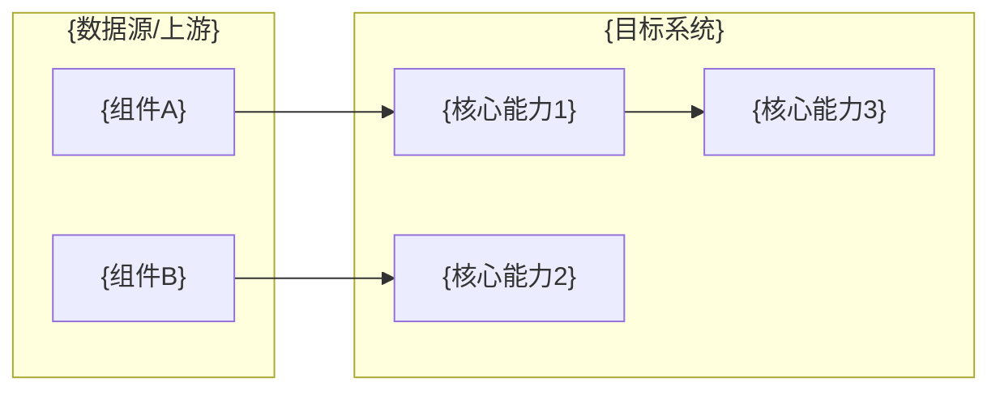

# {YP-XX-NN}: {需求标题} — {一句话描述}

> 需求编号：{YP-XX-NN} · 优先级：{P0|P1|P2|P3} · 人天：{N.N}d · 状态：{状态}
> 依赖：{依赖的需求编号，无则写"无"}
> 交付物：{关键交付物列表}

本文档定义**需求**——系统必须提供什么能力、边界在哪里、如何验收。实现方案见[开发方案](../../devs/{YYYY-MM}/{序号}-prd-task-{描述}.md)，验证方式见[测试用例](../../tests/{YYYY-MM}/{序号}-prd-test-{描述}.md)。

---

## 背景

### 业务背景

{描述业务场景：谁、在什么情况下、遇到什么问题、为什么现在要解决}

| 角色 | 角色标识 | 职责 | 典型用户 |
|------|---------|------|---------|
| {角色1} | `{role_key}` | {职责描述} | {人数或范围} |
| {角色2} | `{role_key}` | {职责描述} | {人数或范围} |

### 核心挑战

| 挑战 | 影响 | 说明 |
|------|------|------|
| {挑战1} | {影响} | {详细说明} |
| {挑战2} | {影响} | {详细说明} |

---

## 一、现状与目标

### 1.1 改造前

{当前状态描述——无此需求时系统的行为、限制、痛点}

### 1.2 改造后能力全景

{用文字或 Mermaid 图描述目标架构}

| 能力 | 载体 | 作用点 |
|------|------|--------|
| {能力1} | {实现载体} | {在哪个环节生效} |
| {能力2} | {实现载体} | {在哪个环节生效} |
| {能力3} | {实现载体} | {在哪个环节生效} |

### 1.3 能力边界

{明确本需求**不**建立的能力、**不**覆盖的场景。防止范围蔓延和误判已交付。}

---

## 二、需求范围

### 2.1 范围内

| 编号 | 需求项 |
|------|--------|
| R-01 | {需求项描述} |
| R-02 | {需求项描述} |

### 2.2 范围外

以下能力**明确不在本期范围**，避免误认为已交付：

| 不做的事 | 原因 | 归属 |
|---------|------|------|
| {不做的事1} | {原因} | 未来按需 / 技术债 T-NN |
| {不做的事2} | {原因} | 未来按需 / 技术债 T-NN |

---

## 三、功能需求

### FR-01 {功能模块名}

{详细描述该功能模块的必须行为}

| 项 | 要求 |
|----|------|
| {属性1} | {要求} |
| {属性2} | {要求} |

### FR-02 {功能模块名}

{详细描述}

---

## 四、领域模型与数据

{如适用——权限码、数据模型、状态机、枚举定义等}

| 模块 | 标识 | 关键字段 | 数量 |
|------|------|--------|------|
| {模块1} | `{key}` | {字段列表} | {N} |
| {模块2} | `{key}` | {字段列表} | {N} |

---

## 五、非功能需求

### 5.1 安全需求

| 需求 | 要求 | 验证方式 |
|------|------|---------|
| {安全需求1} | {具体要求} | {如何验证} |

### 5.2 性能需求

| 指标 | 目标 | 说明 |
|------|------|------|
| {指标1} | {P95 ≤ Nms 等} | {说明} |

### 5.3 可用性需求

- {可用性要求1}
- {可用性要求2}

### 5.4 可观测性需求

| 事件 | 级别 | 必须记录 |
|------|------|---------|
| {事件1} | INFO/WARN/ERROR | {记录内容} |

### 5.5 兼容性需求

- {兼容性约束}

---

## 六、设计决策

### 决策 1：{决策主题}

| 选项 | 维度A | 维度B | 维度C |
|------|------|------|------|
| 选项 A | {评价} | {评价} | {评价} |
| 选项 B | {评价} | {评价} | {评价} |
| **选项 C** | {评价} | {评价} | {评价} |

**选择：{选项 + 理由}。**

### 设计决策记录

| 决策 | 选项 A | 选项 B | 选项 C | 选择 | 理由 |
|------|--------|--------|--------|------|------|
| {决策主题1} | {A} | {B} | {C} | **{选择}** | {理由} |
| {决策主题2} | {A} | {B} | — | **{选择}** | {理由} |

---

## 七、验收标准

需求级验收条件（逐条可验证）：

- [ ] **AC-01** {验收条件}
- [ ] **AC-02** {验收条件}
- [ ] **AC-03** {验收条件}
- [ ] **AC-04** {类型检查/构建通过}

---

## 八、风险与缓解

| 风险 | 概率 | 影响 | 等级 | 缓解措施 | 应急预案 |
|------|------|------|------|---------|---------|
| {风险1} | 高/中/低 | 高/中/低 | **高/中/低** | {缓解措施} | {应急预案} |
| {风险2} | 高/中/低 | 高/中/低 | **高/中/低** | {缓解措施} | {应急预案} |

---

## 九、回滚策略

| 回滚场景 | 回滚方式 | 影响范围 | 恢复时间 |
|----------|----------|----------|----------|
| {场景1} | {回滚操作} | {影响范围} | {恢复时间} |
| {场景2} | {回滚操作} | {影响范围} | {恢复时间} |

---

## 十、后续演进

| 编号 | 事项 | 优先级 | 说明 |
|------|------|--------|------|
| T-01 | {后续事项} | P0/P1/P2/P3 | {说明} |

---

## 十一、关联需求

- 依赖：{依赖的 PRD 链接}
- 上游：{上游需求链接}
- 开发方案：[{序号}-prd-task-{描述}.md](../../devs/{YYYY-MM}/{序号}-prd-task-{描述}.md)
- 测试用例：[{序号}-prd-test-{描述}.md](../../tests/{YYYY-MM}/{序号}-prd-test-{描述}.md)

---

*PRD 来源: [{总览PRD}](./{00-prd-总览}.md)*