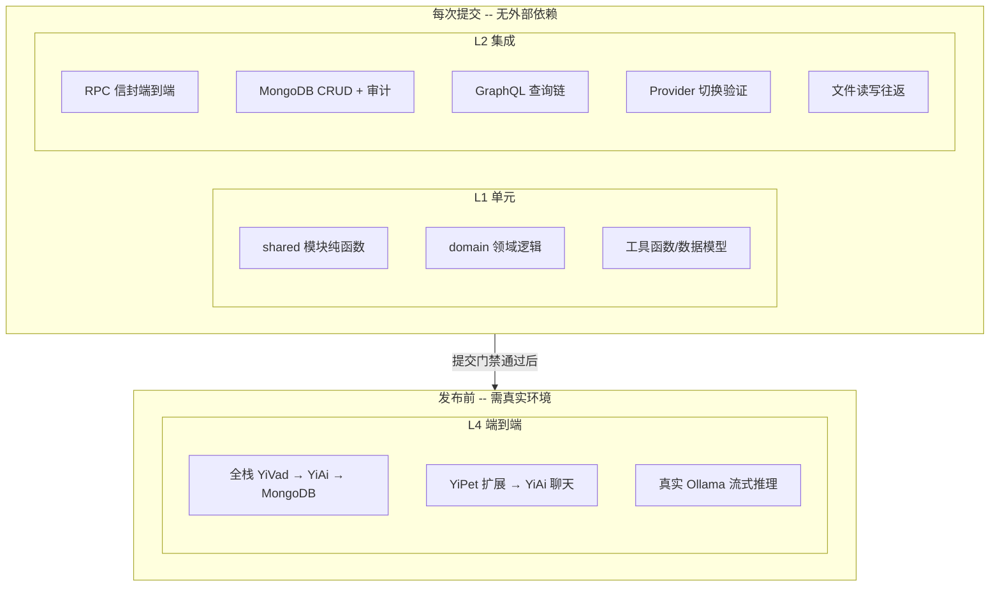

---

doc_type: test
title: "YiAi 八月迭代 — 需求总览测试规格"
status: 待开始
priority: 高
owner: 陈铭
roles: [engineer, qa]
created: 2026-09-11
updated: 2026-09-23
project: YiAi
project_id: yiai
prd_month: "202608"
prd_task_id: "YA-08-01"
source_prds: ["00-需求总览"]
source_modules: ["00-prd-task-00-需求总览"]
source_okr: [yiai-001]

type: test
---

# YiAi 八月迭代 — 需求总览测试规格

> 来源 PRD：[00-需求总览.md](../../prds/2026-08/00-需求总览.md)
> 开发方案：[00-prd-task-00-需求总览.md](../../devs/2026-08/00-prd-task-00-需求总览.md)
> 提取日期：2026-09-23

本文档定义八月迭代 16 项需求的**跨需求集成验证**——测整体交互、回归影响、兼容性。各单需求详细测试见对应 `XX-prd-test-*.md`。

---

## 一、测试范围与策略

### 1.1 测试分层

| 层级 | 工具 | 环境依赖 | 执行时机 |
|------|------|---------|---------|
| L1 单元 | pytest | 无外部依赖 | 每次提交 |
| L2 集成 | pytest + httpx + mongomock | MongoDB (test 实例) | 每次提交 |
| L4 端到端 | 手动 + curl | 真实 Ollama + YiVad | 发布前 |

### 1.2 跨需求集成覆盖范围

| 编号 | 被测交互 | 涉及需求 | 层级 |
|------|---------|---------|------|
| COV-00-1 | RPC 信封 → data_service → @audit_write → audit_logs | YA-08-07 + YA-08-17 | L2 |
| COV-00-2 | OpenAI 兼容 API → ModelRuntime → DeepSeek → SSE 流式 | YA-08-11 + YA-08-16 | L2 |
| COV-00-3 | Agent 工具系统 → web_search/web_fetch → Jina/BeautifulSoup | YA-08-15 + YA-08-12 | L2 |
| COV-00-4 | MCP 工具代理 → query_collection → data_service | YA-08-14 + YA-08-17 | L2 |
| COV-00-5 | 文件管理 → write_file → static_files 备份 → 审计日志 | YA-08-05 + YA-08-07 | L2 |
| COV-00-6 | GraphQL 查询 → DataLoader 批量 → repository.query_documents | YA-08-06 + YA-08-17 | L2 |
| COV-00-7 | RSS 抓取 → feedparser → MongoDB rss_entries → Dashboard | YA-08-09 + YA-08-08 | L2 |
| COV-00-8 | 维护工具 → 扫描引用 → 清理图片 → 审计日志 | YA-08-13 + YA-08-07 | L2 |

### 1.3 不覆盖范围

| 不覆盖 | 原因 |
|--------|------|
| 真实 DeepSeek API 调用 | 需 API Key，CI 环境不可控 |
| 真实 Ollama 模型推理质量 | 模型行为不确定，不适合自动化断言 |
| YiVad/YiPet 前端 E2E | 超出 YiAi 测试范围，由各自项目覆盖 |
| 性能压测 | 不属于功能测试范畴 |

### 1.4 测试环境

| 项 | 值 |
|----|-----|
| 运行器 | pytest 8 + pytest-asyncio + httpx |
| Mock 策略 | LLM 调用使用 stub，外部 HTTP 使用 unittest.mock.AsyncMock |
| MongoDB | mongomock（L1 单元）或测试实例（L2 集成） |
| 覆盖阈值 | 整体 lines >= 70% |

### 1.5 测试数据

| 夹具 | 数据 | 用途 |
|------|------|------|
| `test_db` | mongomock 或 test 数据库实例 | 所有 L2 集成测试 |
| `sample_session` | `{key: "sess_001", messages: [...], title: "测试会话"}` | 会话 CRUD + 审计测试 |
| `sample_rss_feed` | 标准 RSS 2.0 XML 字符串 | RSS 解析测试 |
| `sample_markdown_file` | `# Test\n\nContent` | 文件读写测试 |
| `stub_llm_response` | `{"message": {"content": "你好"}}` | Agent/聊天 stub 测试 |

---

## 二、跨需求集成测试用例

### 2.1 RPC 信封全链路（COV-00-1 . L2）

> 自动化落点：`tests/integration/test_rpc_audit_chain.py`（**待新增**）

| 编号 | 用例 | 步骤 | 预期结果 | 优先级 | 状态 |
|------|------|------|---------|--------|------|
| TC-INT-001 | RPC create_document → 审计日志写入 | 1. 通过 RPC 信封调用 `data_service.create_document(cname="test_coll", data={...})`；2. 检查 `audit_logs` 集合 | `audit_logs` 存在一条 `operation: "CREATE"` 的记录，`actor` 字段非空，`after` 包含完整文档 | P0 | 待实现 |
| TC-INT-002 | RPC update_document → before/after + changes | 1. 插入文档 `{key: "u1", title: "旧"}`；2. 通过 RPC 调用 `update_document(data={key: "u1", title: "新"})`；3. 检查审计日志 | `before.title = "旧"`，`after.title = "新"`，`changes.title = {old: "旧", new: "新"}` | P0 | 待实现 |
| TC-INT-003 | RPC delete_document → before 快照 | 1. 插入文档 `{key: "d1", data: "important"}`；2. 通过 RPC 调用 `delete_document(key="d1")`；3. 检查审计日志 | `before` 包含完整文档，`after = null`，`operation = "DELETE"` | P0 | 待实现 |
| TC-INT-004 | RPC 查询不需要审计 | 1. 通过 RPC 调用 `query_documents(cname="test_coll")`；2. 检查审计日志 | `audit_logs` 无新增记录（读操作不审计） | P0 | 待实现 |
| TC-INT-005 | RPC 信封错误码映射 | 1. 调用不存在的模块 `module_name: "services.nonexistent"` | 返回 `code: 1002`（资源不存在），非 500 | P1 | 待实现 |
| TC-INT-006 | RPC 参数校验：缺少 cname | 1. 调用 `query_documents` 但不传 `cname` 参数 | 返回 `code: 1001`（参数验证失败） | P1 | 待实现 |
| TC-INT-007 | RPC 白名单拦截 | 1. 调用 `execute_module` 但 module:method 不在 `EXEC_ALLOWLIST` | 返回 `code: 4002`（权限不足） | P1 | 待实现 |

### 2.2 Multi-Provider + OpenAI 兼容 API 交互（COV-00-2 . L2）

> 自动化落点：`tests/integration/test_provider_openai_chain.py`（**待新增**）

| 编号 | 用例 | 步骤 | 预期结果 | 优先级 | 状态 |
|------|------|------|---------|--------|------|
| TC-INT-008 | Ollama Provider → OpenAI 兼容端点 chat/completions | 1. 发送 `POST /v1/chat/completions` 带 `model: "qwen2.5"`；2. 验证非流式响应格式 | 返回 `{id, object: "chat.completion", choices: [{message: {role, content}}]}` | P0 | 待实现 |
| TC-INT-009 | OpenAI 兼容端点 SSE 流式输出 | 1. 发送 `POST /v1/chat/completions` 带 `stream: true`；2. 验证 SSE 帧格式 | 每帧 `data: {"id":..., "choices": [{"delta": {"content": ...}}]}`，以 `data: [DONE]` 结束 | P0 | 待实现 |
| TC-INT-010 | /v1/models 返回模型列表 | 1. 调用 `GET /v1/models` | 返回 `{object: "list", data: [{id, object: "model"}]}` 格式 | P0 | 待实现 |
| TC-INT-011 | Provider 自动判定：gpt- 前缀 → openai | 1. 发送 `model: "gpt-4o"` | Provider 判定为 openai，调用 OpenAIRuntime | P1 | 待实现 |
| TC-INT-012 | Provider 自动判定：deepseek → openai | 1. 发送 `model: "deepseek-chat"` | Provider 判定为 openai（DeepSeek 兼容） | P1 | 待实现 |

### 2.3 Agent 工具 + Web 搜索交互（COV-00-3 . L2）

> 自动化落点：`tests/integration/test_agent_web_chain.py`（**待新增**）

| 编号 | 用例 | 步骤 | 预期结果 | 优先级 | 状态 |
|------|------|------|---------|--------|------|
| TC-INT-013 | web_search → DuckDuckGo 返回结果 | 1. Mock DDGS.text 返回 `[{title, url, snippet}]`；2. 调用 `web_search("Python FastAPI")` | 返回 `[{title, url, snippet}]` 列表，最多 6 条 | P0 | 待实现 |
| TC-INT-014 | web_fetch → Jina Reader 成功 | 1. Mock Jina API 返回 Markdown 内容；2. 调用 `web_fetch("http://example.com")` | 返回 `{text, url, source: "jina"}`，内容非空 | P0 | 待实现 |
| TC-INT-015 | web_fetch → Jina 失败 → BeautifulSoup 降级 | 1. Mock Jina 返回 500；2. Mock HTTP GET 返回 HTML；3. 调用 `web_fetch(url)` | 降级到 BeautifulSoup 提取，返回 `{text, source: "direct"}` | P0 | 待实现 |
| TC-INT-016 | web_fetch 缓存 5 分钟 TTL | 1. 首次调用 `web_fetch(url)`；2. 5 分钟内再次调用同一 URL | 第二次调用返回缓存结果，不发起 HTTP 请求 | P1 | 待实现 |

### 2.4 MCP 协议 + 数据访问交互（COV-00-4 . L2）

> 自动化落点：`tests/integration/test_mcp_data_chain.py`（**待新增**）

| 编号 | 用例 | 步骤 | 预期结果 | 优先级 | 状态 |
|------|------|------|---------|--------|------|
| TC-INT-017 | MCP query_collection → 返回文档列表 | 1. 插入测试文档到 `test_coll`；2. 调用 MCP `query_collection("test_coll", "{}", 10)` | 返回 JSON 字符串，包含测试文档 | P0 | 待实现 |
| TC-INT-018 | MCP list_tools → 5 个工具可发现 | 1. 调用 `GET /mcp/tools` | 返回包含 `chat_with_ollama`、`list_ollama_models`、`health_check`、`list_collections`、`query_collection` 的工具列表 | P0 | 待实现 |
| TC-INT-019 | MCP call 不存在的工具 → 错误 | 1. 调用 `POST /mcp/call` 带 `{"name": "nonexistent"}` | 返回错误信息 | P1 | 待实现 |

### 2.5 文件服务 + 审计交互（COV-00-5 . L2）

> 自动化落点：`tests/integration/test_files_audit_chain.py`（**待新增**）

| 编号 | 用例 | 步骤 | 预期结果 | 优先级 | 状态 |
|------|------|------|---------|--------|------|
| TC-INT-020 | write_file → static_files 备份 + 审计日志 | 1. 创建测试文件 `test.md`；2. 调用 `write_file(target_file, new_content)`；3. 检查 static_files + audit_logs | `static_files` 有旧内容备份，`audit_logs` 有文件写入审计记录（如已覆盖） | P1 | 待实现 |
| TC-INT-021 | write_file → read_file 往返 | 1. `write_file(target_file, "hello world")`；2. `read_file(target_file)` | 读取内容与写入一致 | P0 | 待实现 |
| TC-INT-022 | read_file 路径遍历拒绝 | 1. 调用 `read_file("../../etc/passwd")` | 返回 `code: 3002`（文件不存在或无权访问） | P0 | 待实现 |

---

## 三、回归测试

> 确保八月迭代不破坏七月已交付功能。

| 编号 | 场景 | 步骤 | 预期结果 | 优先级 | 状态 |
|------|------|------|---------|--------|------|
| TC-REG-001 | Ollama 聊天向后兼容 | 1. 通过 RPC 调用 `chat_service.chat(messages=[{role:"user", content:"hi"}])` | 返回非空响应，`code: 0` | P0 | 待实现 |
| TC-REG-002 | RAG 检索向后兼容 | 1. 调用 `rag_service.rag_query("测试查询")` | 返回检索结果（sources 列表） | P0 | 待实现 |
| TC-REG-003 | Knowledge Watcher 文件同步 | 1. 在 YiKnowledge 中添加测试 markdown 文件；2. 等待 watcher 扫描 | `knowledge_files` 集合中有新记录 | P1 | 待实现 |
| TC-REG-004 | 现有 76 个 pytest 无回归 | 1. 运行 `python -m pytest tests/ -v` | 全部通过，无新增失败 | P0 | 待实现 |
| TC-REG-005 | RPC 信封格式不变 | 1. 发送标准 RPC 请求；2. 检查响应格式 | `{code, message, data}` 结构不变 | P0 | 待实现 |
| TC-REG-006 | config.yaml 向后兼容 | 1. 使用不含八月新增配置段的旧 config.yaml 启动服务 | 服务正常启动，新功能默认关闭 | P0 | 待实现 |

---

## 四、兼容性测试

| 编号 | 场景 | 步骤 | 预期结果 | 优先级 | 状态 |
|------|------|------|---------|--------|------|
| TC-COMP-001 | 认证禁用时审计 actor 为 "anonymous" | 1. `auth_enabled: false`；2. 不带 X-User 头发送 RPC 写入请求 | 审计日志 `actor = "anonymous"` | P1 | 待实现 |
| TC-COMP-002 | 认证启用时审计 actor 来自 JWT | 1. `auth_enabled: true`；2. 带有效 JWT Token 发送写入请求 | 审计日志 `actor` 为 JWT 中的 username | P1 | 待实现 |
| TC-COMP-003 | GraphQL + RPC 双协议共存 | 1. 同时注册 GraphQL 路由和 RPC 路由；2. 分别测试两种协议 | 两种协议均正常工作，互不影响 | P0 | 待实现 |
| TC-COMP-004 | Provider 切换不影响现有 Chat API | 1. 切换 `llm_chat_provider`；2. 通过 RPC 调用 chat_service | Chat API 响应格式不变 | P0 | 待实现 |

---

## 五、边缘场景用例

| 编号 | 场景 | 步骤 | 预期结果 | 优先级 | 状态 |
|------|------|------|---------|--------|------|
| TC-EDGE-001 | 空参数 RPC 调用 | 1. 发送 `parameters: {}` 到 `query_documents` | 返回全量数据（不使用默认分页的集合可能返回大量数据） | P1 | 待实现 |
| TC-EDGE-002 | MongoDB 连接断开后恢复 | 1. 断开 MongoDB 连接；2. 发送 RPC 请求（预期失败）；3. 恢复连接；4. 发送 RPC 请求 | 恢复后请求正常 | P1 | 待实现 |
| TC-EDGE-003 | 超大数据量分页查询 | 1. 插入 1000 条测试文档；2. 请求 `pageSize: 500` | 正确分页，total 准确 | P2 | 待实现 |
| TC-EDGE-004 | 并发 RPC 写入（竞态） | 1. 并发发送 10 个 `create_document` 请求；2. 检查审计日志完整性 | 10 条审计记录全部存在，无丢失 | P1 | 待实现 |
| TC-EDGE-005 | SSE 流式客户端中途断开 | 1. 发起流式聊天；2. 中途关闭连接 | 服务端正确处理断开，不抛异常 | P1 | 待实现 |
| TC-EDGE-006 | 非 UTF-8 编码文件读取 | 1. 创建 GBK 编码文件；2. 调用 `read_file` | 自动检测编码并正确解码，不返回乱码 | P1 | 待实现 |

---

## 六、追溯矩阵

| 需求项（PRD 总览） | 验收标准 | 覆盖用例 |
|--------------|---------|---------|
| YA-08-02 Multi-Provider LLM | AC: 3 个 Provider 可切换 | TC-INT-008 ~ TC-INT-012 |
| YA-08-03 测试覆盖率 | AC: 整体 >= 70% | TC-REG-004 |
| YA-08-06 GraphQL 联邦层 | AC: 核心 RPC 接口类型安全 | TC-COMP-003 |
| YA-08-07 审计日志 | AC: 所有写入操作可审计 | TC-INT-001 ~ TC-INT-004 |
| YA-08-05 文件管理 | AC: 路径遍历防护 | TC-INT-021 ~ TC-INT-022 |
| YA-08-09 RSS 聚合 | AC: RSS/Atom 解析 | TC-INT-013 ~ TC-INT-016 |
| YA-08-08 Dashboard | AC: 7 子系统状态 | 见 07-prd-test-Dashboard |
| YA-08-11 OpenAI 兼容 API | AC: /v1/chat/completions 可用 | TC-INT-008 ~ TC-INT-010 |
| YA-08-12 Web 搜索 | AC: DuckDuckGo + Jina 双层 | TC-INT-013 ~ TC-INT-016 |
| YA-08-14 MCP 协议 | AC: 5 个 MCP 工具可用 | TC-INT-017 ~ TC-INT-019 |
| YA-08-15 Agent 工具 | AC: 12 个内置工具注册 | 见 13-prd-test-Agent |
| YA-08-16 ModelRuntime | AC: 3 种 Runtime 流式统一 | 见 14-prd-test-ModelRuntime |
| YA-08-17 数据访问层 | AC: 6 种过滤策略 | 见 15-prd-test-数据访问层 |

---

## 七、覆盖缺口

| 编号 | 缺口 | 影响 | 建议 |
|------|------|------|------|
| G-1 | 跨需求并发场景未充分覆盖 | 多需求交互的竞态条件可能漏测 | 使用 pytest-asyncio 并发 fixture 补充 |
| G-2 | 长时运行稳定性测试缺失 | 内存泄漏、连接池耗尽等长期问题无法发现 | 后续增加 24h soak test |
| G-3 | 异常恢复路径覆盖不足 | 外部依赖故障后的自动恢复行为未验证 | 引入 fault injection（toxiproxy 或 mock） |
| G-4 | 性能基准缺失 | 无法量化八月迭代对响应时间的影响 | 建立 pytest-benchmark 性能基准套件 |

---

## 八、入口与出口准则

### 入口准则

- [ ] 16 项八月需求开发完成，代码合入 main
- [ ] 各需求单测试文件（01-15）已编写
- [ ] 测试 MongoDB 实例可用（本地或 mongomock）
- [ ] `pytest tests/ -v` 基础测试套件可运行

### 出口准则

- [ ] **P0 集成用例 100% 通过**
- [ ] P1 用例通过率 >= 90%
- [ ] 回归用例全部通过（无七月功能退化）
- [ ] 兼容性用例全部通过
- [ ] `python -m pytest tests/ -v --cov=src --cov-fail-under=70` 通过
- [ ] 已登记缺口可接受，有跟进计划