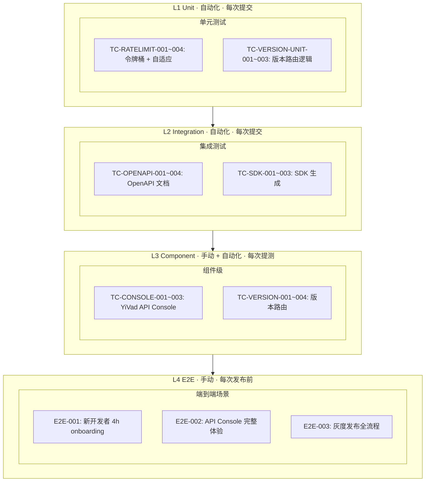

---

doc_type: test
title: "YA-10-02: API 平台化与开发者体验 — 测试规格"
status: 待开始
priority: 高
owner: 陈铭
roles: [engineer, qa]
created: 2026-09-23
updated: 2026-09-23
project: YiAi
project_id: yiai
prd_month: "202610"
prd_task_id: "YA-10-02"
source_prds: ["02-需求-API平台化.md"]
source_modules: ["02-prd-task-API平台化.md"]
source_okr: [yiai-q4-002]

type: test
---

# YA-10-02: API 平台化与开发者体验 — 测试规格

> 来源 PRD：[02-需求-API平台化.md](../../prds/2026-Q4/02-需求-API平台化.md)
> 开发方案：[02-prd-task-API平台化.md](../../devs/2026-Q4/02-prd-task-API平台化.md)
>
> **文档职责**: 本文档定义**怎么验证**（VERIFY），不含产品目标与实现方案。用例覆盖度以 PRD 的 `FR-x.y` / `NFR-x` 编号追溯，不复制需求正文。
> 提取日期：2026-09-23

---

## 目录

- [一、测试范围与策略](#sec-1)
- [二、测试用例](#sec-2)
- [三、边缘场景用例](#sec-3)
- [四、回归用例](#sec-4)
- [五、追溯矩阵](#sec-5)
- [六、覆盖缺口](#sec-6)
- [七、准入与准出标准](#sec-7)
- [八、回归执行记录](#sec-8)

---

<a id="sec-1"></a>
## 一、测试范围与策略

### 1.1 测试分层



| 层级 | 说明 | 自动化 | 执行时机 |
|------|------|--------|---------|
| L1 单元 | Python 工具函数/数据结构纯逻辑 (令牌桶算法、版本解析、灰度计算) | pytest | 每次提交 |
| L2 集成 | FastAPI 端点、OpenAPI 生成、SDK 生成流水线 | pytest + httpx | 每次提交 |
| L3 组件 | YiVad API Console 页面、版本路由中间件行为 | Vitest + 手动 | 提测/回归 |
| L4 端到端 | 完整用户路径 (需 YiAi + YiVad 运行) | 手动 | 每次发布前 |

### 1.2 优先级定义

| 级别 | 含义 | 响应 |
|------|------|------|
| P0 | 核心路径，失败阻塞发布 | 立即修复 |
| P1 | 重要功能，失败需评估 | 当日修复 |
| P2 | 增强功能，可延后 | 排期修复 |

### 1.3 测试环境

| 项 | 要求 |
|----|------|
| Python | 3.10+ |
| 后端 | YiAi @ localhost:10086 |
| 前端 | YiVad (如需 API Console) @ localhost:8848 |
| 包管理器 | pip, pnpm |
| 浏览器 | Chrome 最新版 |
| 自动化框架 | pytest 8 + pytest-asyncio + httpx + Vitest + @vue/test-utils |

```bash
# 后端单元测试
cd YiAi && python -m pytest tests/ -v -k "openapi or rate_limit or versioning"

# 前端组件测试
cd YiVad && npx vitest run tests/console/

# 全量测试
cd YiAi && python -m pytest tests/ -v
```

### 1.4 不覆盖范围

| 不覆盖 | 原因 |
|--------|------|
| 第三方开发者门户的 UX | Out of Scope (PRD 明确不包含) |
| API 计费/计量精确性 | Out of Scope |
| 多语言 SDK (Java/Go/Kotlin) | Out of Scope |
| 限流 Redis 后端的分布式一致性 | P2 — 内存模式为主，Redis 仅最佳努力 |
| openapi.json 与 Swagger Editor 100% 兼容 | 不同版本 Swagger Editor 的渲染差异 |

---

<a id="sec-2"></a>
## 二、测试用例

### 2.1 OpenAPI 文档生成 (TC-OPENAPI)

> L2 集成测试 · 关联 FR-01

| 编号 | 用例 | GIVEN | WHEN | THEN | 优先级 | 状态 |
|------|------|-------|------|------|--------|------|
| TC-OPENAPI-001 | **OpenAPI JSON 完整性** | YiAi 服务启动 | 请求 `GET /openapi.json` | 返回 HTTP 200；响应 body 是有效的 JSON；`openapi` 字段值为 `"3.1.0"`；`paths` 包含所有已注册路由 (REST: `/about`, `/health`, `/read-file`, `/write-file`, `/rag/query` 等 18+；RPC: `POST /` 含 `x-rpc-methods` 数组) | P0 | 待验证 |
| TC-OPENAPI-002 | **RPC 方法参数文档化** | 同上 | 解析 `openapi.json` → `paths./["post"]` → `x-rpc-methods` → 查找 `services.database.data_service.query_documents` | `parameters` 数组包含 `filter` (非 `query`)、`cname` (非 `collection_name`)、`pageNum`、`pageSize`、`orderBy`、`orderType`；每个参数有 `description` 且非空 | P0 | 待验证 |
| TC-OPENAPI-003 | **Swagger UI 渲染** | 同上 | 浏览器访问 `http://localhost:10086/docs` | 页面可加载；RPC 端点 `POST /` 展开后有独立的 RPC method 分组 (如 `data_service.query_documents`)；每个方法有 Try-it-out 按钮和请求体示例 | P0 | 待验证 |
| TC-OPENAPI-004 | **前端类型生成** | openapi.json 可用 | 执行 `npx openapi-typescript http://localhost:10086/openapi.json -o /tmp/types.ts` | 生成的 `types.ts` 文件 > 500 行；执行 `npx tsc --noEmit /tmp/types.ts` 无类型错误；生成的类型中包含 `filter` (非 `query`) 参数 | P0 | 待验证 |
| TC-OPENAPI-005 | **Scalar UI 替代** | YiAi 服务启动 | 浏览器访问 `http://localhost:10086/scalar` | Scalar UI 可加载；RPC 方法有更好的展示效果 (代码示例、请求/响应双栏) | P1 | 待验证 |
| TC-OPENAPI-006 | **错误码枚举文档** | openapi.json 可用 | 解析 `openapi.json` → `components.schemas.ErrorCode` | 包含标准错误码: 0 (成功), 1001 (参数验证), 1002 (资源不存在), 1003 (资源已存在), 2001 (AI 不可用), 3001 (文件读写失败), 4001 (认证失败), 5001 (数据库错误), 9999 (未知错误), 1004 (限流), 1005 (版本废弃) | P1 | 待验证 |

### 2.2 API 版本化路由 (TC-VERSION)

> L3 组件测试 + L1 单元测试 · 关联 FR-02

| 编号 | 用例 | GIVEN | WHEN | THEN | 优先级 | 状态 |
|------|------|-------|------|------|--------|------|
| TC-VERSION-001 | **v1/v2 路由隔离** | app 已注册 `/v1/execution` 和 `/v2/execution` | 发送相同 RPC 请求到 `POST /v1/` 和 `POST /v2/` | 两者返回 HTTP 200；响应 `data` 字段一致 (当前版本行为相同) | P0 | 待验证 |
| TC-VERSION-002 | **无版本向后兼容** | app 启动 | 发送 RPC 请求到 `POST /` (无版本前缀) | 返回 HTTP 200；行为与 `POST /v1/` 完全一致；响应头不含 `Deprecation` 或 `Sunset` | P0 | 待验证 |
| TC-VERSION-003 | **灰度流量百分比** | `canary_percent: 30` 配置生效 | 发送 1000 个请求 (无版本前缀, 无 X-User-Id) | 约 300±15% 个请求路由到 v2，其余到 v1；统计 v1/v2 路由差异在合理范围内 (二项分布, p=0.3, n=1000, 99%CI: 265~335) | P0 | 待验证 |
| TC-VERSION-004 | **用户粘性路由** | `canary_percent: 50`, `canary_sticky: true` | 同一 `X-User-Id: user-123` 发送 50 个请求 | 所有 50 个请求路由到同一版本 (要么全 v1，要么全 v2)；不同 `X-User-Id` 的请求可能路由到不同版本 | P0 | 待验证 |
| TC-VERSION-005 | **Sunset 头部注入** | v1 版本配置 `sunset_date: "2026-12-31T23:59:59"` | 发送请求到 `POST /v1/` | 响应头包含 `Deprecation: true` 和 `Sunset: Wed, 31 Dec 2026 23:59:59 GMT` 和 `Link: </docs/deprecation/v1>; rel="deprecation"` | P1 | 待验证 |
| TC-VERSION-006 | **X-Canary-Version 强制路由** | `canary_percent: 0` (灰度关闭) | 发送请求，Header 包含 `X-Canary-Version: v2` | 请求路由到 v2 (调试用强制覆盖)；去掉 Header 后路由回 v1 | P1 | 待验证 |
| TC-VERSION-007 | **CI 兼容性检测 — Breaking Change** | `/v1/openapi.json` 和 `/v2/openapi.json` 存在差异 | 在 v2 schema 中删除一个必填字段 → 运行 CI OpenAPI diff | CI 步骤输出 "BREAKING CHANGE DETECTED"，构建失败 | P0 | 待验证 |
| TC-VERSION-008 | **CI 兼容性检测 — Non-breaking** | 同上 | 在 v2 schema 中新增一个可选字段 → 运行 CI OpenAPI diff | CI 步骤输出 "Non-breaking changes detected"，构建通过 | P1 | 待验证 |

**L1 单元补充** (纯逻辑，无 HTTP 依赖):

| 编号 | 用例 | 函数 | 输入 | 预期输出 | 优先级 | 状态 |
|------|------|------|------|---------|--------|------|
| TC-VERSION-UNIT-001 | 版本解析 — 显式前缀 | `VersionRouter.resolve_version` | path="/v2/execution" | returns "v2" | P0 | 待实现 |
| TC-VERSION-UNIT-002 | 版本解析 — 无前缀 | 同上 | path="/execution" | returns "v1" (stable) | P0 | 待实现 |
| TC-VERSION-UNIT-003 | 用户哈希确定性 | `VersionRouter._should_use_canary` | user_id="test-user", seed=50 | 多次调用返回相同结果 (同一用户路由稳定) | P0 | 待实现 |

### 2.3 双重令牌桶限流 (TC-RATELIMIT)

> L1 单元测试 · 关联 FR-03

| 编号 | 用例 | GIVEN | WHEN | THEN | 优先级 | 状态 |
|------|------|-------|------|------|--------|------|
| TC-RATELIMIT-001 | **用户级令牌桶 — 正常消费** | 用户 `user-A` 的桶: capacity=300, fill_rate=10, tokens=300 | 连续消费 300 个 token (每次 1) | 前 300 次 `consume()` 返回 True；第 301 次返回 False；`retry_after()` 返回约 0.1s | P0 | 待实现 |
| TC-RATELIMIT-002 | **用户级令牌桶 — 填充恢复** | 同上桶, tokens=0, last_fill=now | 等待 5 秒后消费 1 个 token | `consume()` 返回 True (5s * 10 tokens/s = 50 tokens 已填充)；`tokens` ≈ 49 | P0 | 待实现 |
| TC-RATELIMIT-003 | **端点级令牌桶 — 独立限制** | 用户桶 300 tokens + 聊天端点桶 30 tokens | 消费 30 次 chat 端点 | 前 30 次两桶都通过；第 31 次端点桶返回 False (用户桶 token 被消费但 rollback)；`retry_after()` 端点约 2s | P0 | 待实现 |
| TC-RATELIMIT-004 | **令牌桶 — 不超过容量** | 用户桶: capacity=100, fill_rate=100, tokens=0 | 等待 60 秒 (理论上填充 6000 tokens) | `tokens` == 100 (不会超过 capacity) | P0 | 待实现 |
| TC-RATELIMIT-005 | **429 响应格式** | 用户桶已耗尽 | 发送第 301 个请求 | HTTP 429；响应体: `{ "code": 1004, "message": "Rate limit exceeded...", "data": { "retry_after": N, "limit_type": "user", "limit_remaining": 0 } }` | P0 | 待验证 |
| TC-RATELIMIT-006 | **429 响应头** | 同上 | 检查 429 响应头 | `X-RateLimit-Type: user`；`X-RateLimit-Remaining: 0`；`Retry-After: N` (正整数值) | P0 | 待验证 |
| TC-RATELIMIT-007 | **白名单用户不受限** | `whitelist_users: ["admin"]` | admin 用户发送 1000 个请求 | 所有请求返回 200；无 429 响应 | P0 | 待验证 |
| TC-RATELIMIT-008 | **白名单 IP 不受限** | `whitelist_ips: ["127.0.0.1"]` | 本地发送 1000 个请求 | 所有请求返回 200；无 429 响应 | P0 | 待验证 |
| TC-RATELIMIT-009 | **匿名用户按 IP 限流** | 无 X-User-Id 头部 | 同一 IP 连续发送请求直到耗尽 IP 桶 | 第 (capacity+1) 个请求返回 429；`limit_type: "ip"` | P1 | 待验证 |
| TC-RATELIMIT-010 | **不同用户隔离** | user-A 耗尽桶，user-B 初次请求 | user-B 发送请求 | user-B 返回 200 (不受 user-A 影响)；user-A 返回 429 | P0 | 待验证 |

**自适应限流测试**:

| 编号 | 用例 | GIVEN | WHEN | THEN | 优先级 | 状态 |
|------|------|-------|------|------|--------|------|
| TC-ADAPT-001 | **自适应收紧触发** | 聊天端点 fill_rate=0.5, P95 延迟 2500ms (>2000ms 阈值) | `AdaptiveController.run()` 执行一次 | 聊天端点 `fill_rate` 从 0.5 降为 0.35 (`0.5 * 0.7`)；`adjustments_total` 计数 +1 | P0 | 待实现 |
| TC-ADAPT-002 | **自适应不误触发** | fill_rate=0.5, P95 延迟 1500ms (<2000ms 阈值), 错误率 2% (<5%) | `AdaptiveController.run()` 执行 | fill_rate 保持 0.5 不变；`adjustments_total` 不变 | P0 | 待实现 |
| TC-ADAPT-003 | **自适应不降到最低值以下** | fill_rate=0.05, P95 延迟持续 2500ms | 连续 5 次 `run()` 收紧 | fill_rate 不低于 `0.5 * 0.1 = 0.05` (原始 fill_rate * min_fill_rate_ratio) | P1 | 待实现 |
| TC-ADAPT-004 | **自适应恢复** | fill_rate 已降到 0.35, P95 恢复 1000ms 持续 60s | `run()` 在 cooldown 后首次触发恢复 | fill_rate 恢复为 0.42 (`0.35 * 1.2`)；继续正常则继续恢复到 0.5 | P1 | 待实现 |

### 2.4 SDK 生成与类型安全 (TC-SDK)

> L2 集成测试 · 关联 FR-04

| 编号 | 用例 | GIVEN | WHEN | THEN | 优先级 | 状态 |
|------|------|-------|------|------|--------|------|
| TC-SDK-001 | **TypeScript SDK 类型检查** | `openapi.json` 可用 | `npx openapi-typescript` → `/tmp/types.ts` → 编写 TypeScript 调用代码使用 `YiAiClient.data.queryDocuments({ cname: "bugs", filter: {} })` | `tsc --noEmit` 通过；使用错误参数名 `query` (而非 `filter`) 时 `tsc` 报错: "Object literal may only specify known properties" | P0 | 待验证 |
| TC-SDK-002 | **Python SDK async 客户端** | `python scripts/generate-python-sdk.py --output /tmp/python-sdk` | `pip install /tmp/python-sdk` → 编写 async 代码: `async with YiAiClient(...) as c: result = await c.data.query_documents(cname="bugs")` | 代码可执行 (需要 YiAi 运行)；响应为 Python dict；使用错误参数名 `collection_name` 时 IDE/mypy 类型检查报错 | P0 | 待验证 |
| TC-SDK-003 | **SDK 重新生成一致性** | `openapi.json` 不变 | 连续两次执行 `generate-python-sdk.py` | 两次生成的 client.py 文件内容完全一致 (确定性输出，无时间戳/随机数) | P1 | 待验证 |
| TC-SDK-004 | **RPC 参数名契约检查** | SDK 源码已生成 | 运行 `scripts/check-sdk-contract.sh` | 检测到 SDK 中全部方法均使用 `filter`/`target_file`/`cname` (非 `query`/`path`/`collection_name`)；无错误输出 | P0 | 待验证 |
| TC-SDK-005 | **Python SDK 包结构** | SDK 已生成 | 检查 `python-sdk/` 目录结构 | 包含 `pyproject.toml`、`yiai_client/__init__.py`、`yiai_client/client.py`；`pyproject.toml` 声明 `httpx>=0.27` 依赖；`__init__.py` 导出 `YiAiClient` 和 `YiAiError` | P1 | 待验证 |

### 2.5 YiVad API Console (TC-CONSOLE)

> L3 组件测试 + 手动验证 · 关联 FR-05

| 编号 | 用例 | GIVEN | WHEN | THEN | 优先级 | 状态 |
|------|------|-------|------|------|--------|------|
| TC-CONSOLE-001 | **端点目录树渲染** | YiVad + YiAi 均运行, 已登录且有权限 | 访问 `/console/api` | 左侧展示端点目录树，按服务分组 (data/ai/rag/knowledge/files/...)；点击端点展开详情 (方法名、参数列表、描述) | P0 | 待验证 |
| TC-CONSOLE-002 | **Monaco Editor JSON 校验** | API Console 已加载, 选中 `data_service.query_documents` | 在请求体编辑器输入 invalid JSON: `{ cname: "bugs", filter: {} }` (缺少引号) | Monaco Editor 显示红色波浪线标注语法错误；Send 按钮为 disabled 状态 | P0 | 待验证 |
| TC-CONSOLE-003 | **请求发送 + 响应展示** | Monaco Editor 内容为合法的 RPC 请求体 | 点击 Send 按钮 | 显示 loading 状态；收到响应后展示: (1) 状态码 (2) 响应头 (3) 格式化 JSON 响应体 (4) 响应耗时 (ms) | P0 | 待验证 |
| TC-CONSOLE-004 | **SSE 流式响应** | 选中 `chat_service.chat`, 填写 message="hello" | 点击 Send | 响应面板实时展示增量 SSE 帧；不等待全部完成才显示；流结束时显示 "Stream ended" | P1 | 待验证 |
| TC-CONSOLE-005 | **Token 管理** | API Console 已加载 | 填写 "X-Token" 输入框 → 点击保存 | Token 保存到 localStorage；刷新页面后 Token 输入框仍有值；发送请求时 Header 自动附加 X-Token | P0 | 待验证 |
| TC-CONSOLE-006 | **环境切换** | API Console 已加载 | 切换环境为 "production" (URL: https://api.example.com) | 后续所有请求发送到新 URL；环境选择持久化到 localStorage | P1 | 待验证 |
| TC-CONSOLE-007 | **历史记录** | 已发送 3 个请求 | 点击历史记录 tab | 显示最近 3 条记录: endpoint 名称、请求体摘要、响应状态码、时间戳；点击某条记录 → Monaco Editor 填充该请求体 + 响应面板显示历史响应 | P1 | 待验证 |
| TC-CONSOLE-008 | **参数表单自动生成** | 选中 `query_documents` | 观察中间面板 | 自动生成表单字段: `cname` (必填, 文本输入), `filter` (选填, JSON 对象), `pageNum` (选填, 数字, 默认 1), `pageSize` (选填, 数字, 默认 10) | P1 | 待验证 |
| TC-CONSOLE-009 | **环境列表预置** | 首次打开 API Console | 检查环境选择器 | 预置 3 个环境: localhost (`http://localhost:10086`)、staging (`http://staging.yiai.example.com`)、production (`https://api.yiai.example.com`) | P2 | 待验证 |

---

<a id="sec-3"></a>
## 三、边缘场景用例

| 编号 | 场景 | 触发条件 | 步骤 | 预期结果 | 优先级 | 状态 |
|------|------|---------|------|---------|--------|------|
| TC-EDGE-001 | **空 services/ 目录启动** | 部署时 services/ 目录不存在 | 启动 YiAi → 访问 `/openapi.json` | openapi.json 仅包含 REST 端点 (无 x-rpc-methods)；服务正常启动；Swagger UI 可渲染 | P1 | 待验证 |
| TC-EDGE-002 | **RPC 方法 docstring 为空** | 某个 service 方法缺少 docstring | 启动 → 检查 openapi.json | 该方法 `description` 为空字符串或 "No description"；不导致启动失败或 500 错误；Swagger UI 中显示为 "No description" 占位 | P1 | 待验证 |
| TC-EDGE-003 | **RPC 方法有 `**kwargs`** | 函数签名包含 `**kwargs: Any` | 启动 → 检查 openapi.json | 该方法在 x-rpc-methods 中标记 `additionalParameters: true`；不崩溃 | P2 | 待验证 |
| TC-EDGE-004 | **Redis 不可用回退** | `rate_limit.backend: redis`，Redis 服务未运行 | 启动 YiAi → 发送请求 | 限流器降级为内存存储；WARNING 级别日志输出 "Redis unavailable, falling back to memory backend"；限流功能正常 | P1 | 待验证 |
| TC-EDGE-005 | **服务重启后令牌桶重置** | 内存模式，user-A 已耗尽桶 | 重启 YiAi → user-A 发送请求 | user-A 的桶重置为满容量 (300 tokens)；请求成功 (不返回 429) | P1 | 待验证 |
| TC-EDGE-006 | **canary_percent: 100 全部灰度** | 配置修改 | 发送 100 个请求 | 100 个全部路由到 canary 版本 (v2)；v1 路由收到 0 个请求 | P1 | 待验证 |
| TC-EDGE-007 | **canary_percent: 0 关闭灰度** | 配置修改 | 发送 100 个请求 | 100 个全部路由到稳定版本 (v1)；无请求路由到 v2 | P0 | 待验证 |
| TC-EDGE-008 | **用户 ID 含特殊字符** | `X-User-Id: admin@domain.com` | 发送请求 | 限流正常按 user_id 隔离；`admin@domain.com` 和 `admin@other.com` 被视为不同用户 | P2 | 待验证 |
| TC-EDGE-009 | **超长 JSON 请求体 (>100KB)** | API Console 发送大 payload | 在 Monaco Editor 中粘贴 100KB JSON → Send | 请求体被正确发送；限流中间件仅读取 body 检查 RPC method，不全部缓存 | P2 | 待验证 |
| TC-EDGE-010 | **API Console 无网络连接** | YiAi 未运行 | 在 Console 中发送请求 | 显示连接错误提示 "Cannot connect to API" (而非白屏或崩溃)；不阻塞页面操作 | P1 | 待验证 |

---

<a id="sec-4"></a>
## 四、回归用例

> 针对开发方案中识别的风险项和现有功能保护。

| 编号 | 关联风险/约束 | 场景 | 当前预期 | 修复后预期 | 优先级 | 状态 |
|------|-------------|------|---------|-----------|--------|------|
| TC-REG-001 | 限流中间件 body 读取影响 SSE 流 | 发送 SSE 流式聊天请求 (20 条消息往返) | 所有消息正常接收；无额外延迟；不出现 body 丢失 | 保持不变 | P0 | 待验证 |
| TC-REG-002 | 现有 RPC 行为不变 | `POST /` 发送 `{module_name: "services.database.data_service", method_name: "query_documents", parameters: {cname: "bugs", filter: {}}}` | 返回 HTTP 200 + 正确数据；与 D2 实施前行为完全一致 | 保持不变 | P0 | 待验证 |
| TC-REG-003 | 现有 REST 端点不受版本路由影响 | 访问 `/health`, `/read-file?target_file=test.md`, `/rag/query` | 各端点返回正常结果；不因版本中间件注入而改变行为 | 保持不变 | P0 | 待验证 |
| TC-REG-004 | 无 X-User-Id 的现有客户端 | YiPet 旧版本不发送 X-User-Id | 请求正常通过 (匿名 IP 限流，配额充足) | 保持不变；旧客户端不感知限流 | P1 | 待验证 |
| TC-REG-005 | 自适应控制器过度收紧 | P95 延迟短暂 spike (3s → 回落) | 触发一次收紧 (fill_rate * 0.7)，等待 cooldown 后逐步恢复 | 不超过原始值 min_fill_rate_ratio | P1 | 待验证 |
| TC-REG-006 | openapi.json 生成耗时 | 冷启动时首次访问 `/openapi.json` | < 5 秒生成 (NFR-01) | 加入缓存后，后续访问 < 50ms | P0 | 待验证 |

---

<a id="sec-5"></a>
## 五、追溯矩阵

| 需求项 (PRD) | 验收标准 | 覆盖用例 |
|--------------|---------|---------|
| FR-01.1 OpenAPI JSON 入口 | AC-01 | TC-OPENAPI-001, TC-OPENAPI-006 |
| FR-01.5 RPC 方法覆盖 | AC-02 | TC-OPENAPI-002, TC-OPENAPI-003 |
| FR-01.7 参数名称契约 | AC-01 | TC-OPENAPI-002 (filter/cname > query/collection_name) |
| FR-01.8 错误码文档 | — | TC-OPENAPI-006 |
| FR-01.9 类型生成集成 | AC-03 | TC-OPENAPI-004 |
| FR-02.1 URL 前缀 | AC-04 | TC-VERSION-001 |
| FR-02.3 流量灰度 | AC-05 | TC-VERSION-003, TC-VERSION-006, TC-EDGE-006, TC-EDGE-007 |
| FR-02.4 灰度用户粘性 | — | TC-VERSION-004, TC-VERSION-UNIT-003 |
| FR-02.5 Sunset 头部 | — | TC-VERSION-005 |
| FR-02.7 兼容性检测 CI | AC-06 | TC-VERSION-007, TC-VERSION-008 |
| FR-03.1 用户级令牌桶 | AC-07 | TC-RATELIMIT-001, TC-RATELIMIT-002, TC-RATELIMIT-004 |
| FR-03.2 端点级令牌桶 | AC-07 | TC-RATELIMIT-003 |
| FR-03.5 自适应收紧 | AC-08 | TC-ADAPT-001, TC-ADAPT-002 |
| FR-03.6 自适应恢复 | — | TC-ADAPT-004 |
| FR-03.7 429 响应格式 | — | TC-RATELIMIT-005, TC-RATELIMIT-006 |
| FR-03.9 白名单 | — | TC-RATELIMIT-007, TC-RATELIMIT-008 |
| FR-04.1 TS SDK 生成 | AC-09 | TC-SDK-001 |
| FR-04.4 Python SDK 生成 | AC-10 | TC-SDK-002 |
| FR-04.6 参数名契约保障 | AC-09 | TC-SDK-004 |
| FR-05.1 API Console 路由 | AC-11 | TC-CONSOLE-001 |
| FR-05.3 Monaco Editor | — | TC-CONSOLE-002 |
| FR-05.6 请求发送 | AC-11 | TC-CONSOLE-003, TC-CONSOLE-004 |
| FR-05.7 响应展示 | AC-11 | TC-CONSOLE-003 |
| FR-05.5 Token 管理 | — | TC-CONSOLE-005 |
| FR-05.9 环境切换 | — | TC-CONSOLE-006 |
| FR-05.8 历史记录 | — | TC-CONSOLE-007 |
| NFR-01 文档生成 <5s | — | TC-REG-006 |
| NFR-02 限流开销 <1ms | — | L1 单元测试中 benchmark |
| NFR-08 向后兼容 | AC-04 | TC-REG-002, TC-REG-003 |
| — 全局回归 | AC-12 | TC-REG-001~TC-REG-006 |

---

<a id="sec-6"></a>
## 六、覆盖缺口

| 编号 | 缺口 | 影响 | 建议 |
|------|------|------|------|
| G-1 | **无分布式限流一致性测试** | 多实例部署 + Redis 后端的限流公平性未覆盖 | 引入 `testcontainers` + Redis 集成测试 (P2, 排期) |
| G-2 | **无长时间 (7 天) 稳定性测试** | 自适应控制器的长期行为 (是否过拟合、是否漂移) 未验证 | 运行 7 天 soak test 模拟真实流量，记录自适应调整历史 |
| G-3 | **无 openapi-typescript 版本兼容性矩阵** | openapi-typescript 大版本更新可能改变生成 API | `ts-sdk/package.json` 锁定 openapi-typescript 版本；CI 定期测试最新版兼容性 |
| G-4 | **无 Monaco Editor 打包体积增长监控** | API Console 可能导致 YiVad 首屏体积增长 | 在 CI 中加入 bundle-size 检查，设定上限 (gzip < 50KB 增长) |
| G-5 | **无 API Console 无障碍 (a11y) 测试** | 键盘操作、屏幕阅读器支持未验证 | P2 — 按需引入 axe-core 自动化检查 |
| G-6 | **灰度路由统计数据漂移验证** | 1000 个样本中的二项分布误差可能被误判为 bug | 使用统计检验 (Chi-square goodness-of-fit) 而非硬编码 265-335 区间 |
| G-7 | **限流指标 Prometheus 端点覆盖** | `rate_limit_*` 指标的格式验证和抓取测试未覆盖 | 添加 `/metrics` 端点指标格式检查 (Prometheus text format compliance) |

---

<a id="sec-7"></a>
## 七、准入与准出标准

### 7.1 准入标准

| # | 条件 |
|---|------|
| 1 | 对应 FR 的实现已提交到 feature 分支 |
| 2 | `python -m pytest tests/ -v` 全部通过 (已有测试，新测试可待实现) |
| 3 | `ruff check src/` 无错误 |
| 4 | YiAi 在本地开发环境可正常启动 |
| 5 | `/openapi.json` 返回 HTTP 200 |

### 7.2 准出标准

| # | 条件 | 阈值 |
|---|------|------|
| 1 | P0 用例通过率 | 100% |
| 2 | P1 用例通过率 | >= 90% |
| 3 | P2 用例通过率 | >= 80% |
| 4 | 遗留缺陷 | 无 Blocker / Critical |
| 5 | 性能 NFR | NFR-01~05 全部达标 |
| 6 | 回归用例 | TC-REG-001~006 全部通过 |
| 7 | 文档 | openapi.json 覆盖 100% 端点 |

### 7.3 缺陷分级

| 级别 | 定义 | 示例 |
|------|------|------|
| Blocker | 阻塞测试或数据损坏 | `POST /` 不再工作；限流把所有请求都拦截 |
| Critical | 核心功能不可用 | openapi.json 生成失败导致 `/docs` 白屏；SDK 生成器崩溃 |
| Major | 功能缺陷但有替代路径 | 自适应控制器不触发；灰度分流失效回退到 100% v1 |
| Minor | 体验问题 | Swagger UI 中某个 RPC 方法缺少示例；API Console 历史记录不保存 |
| Trivial | 视觉细节 | 响应面板缩进不对齐；loading spinner 颜色偏差 |

---

<a id="sec-8"></a>
## 八、回归执行记录

| 版本 | 测试人 | 日期 | P0 通过 | P1 通过 | P2 通过 | 备注 |
|------|--------|------|---------|---------|---------|------|
| Phase 1 首轮 | — | — | — | — | — | 待执行 (OpenAPI + 限流) |
| Phase 2 首轮 | — | — | — | — | — | 待执行 (版本化 + SDK) |
| Phase 3 首轮 | — | — | — | — | — | 待执行 (Console + 调优) |
| 全量回归 | — | — | — | — | — | 待执行 (Q4 末) |