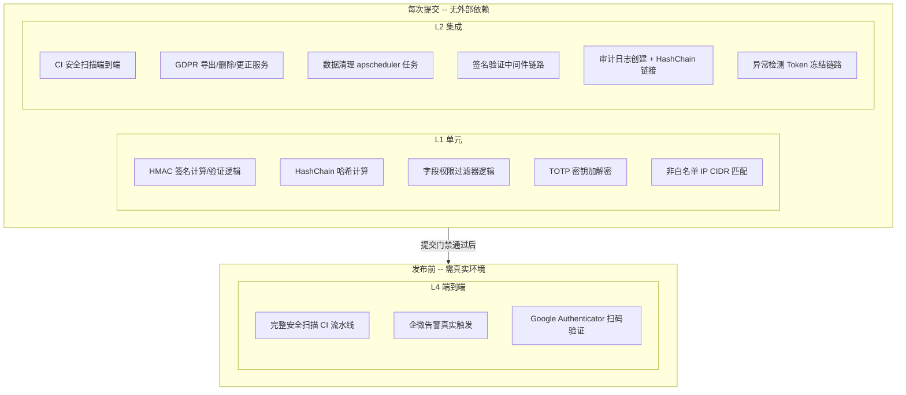

---

doc_type: test
title: "04: 安全合规与数据治理 — 测试用例"
status: 待开始
priority: 高
owner: 陈铭
roles: [engineer, qa]
created: "2026-09-23"
updated: "2026-09-23"
project: YiAi
project_id: yiai
prd_month: "202610"
prd_task_id: "YA-10-04"
source_prds: ["04-需求-安全合规.md"]
source_modules: ["04-prd-task-安全合规.md"]
source_okr: [yiai-q4-004]

type: test
---

# YA-10-04: 安全合规与数据治理 — 测试用例

> 来源 PRD：[04-需求-安全合规.md](../../prds/2026-Q4/04-需求-安全合规.md)
> 开发方案：[04-prd-task-安全合规.md](../../devs/2026-Q4/04-prd-task-安全合规.md)
> 提取日期：2026-09-23

本文档定义**验证方式**——测什么、怎么测、通过标准是什么。需求见 PRD，实现见开发方案。

---

## 一、测试范围与策略

### 1.1 测试分层

| 层级 | 工具 | 环境依赖 | 执行时机 |
|------|------|---------|---------|
| L1 单元 | pytest | 无外部依赖 | 每次提交 |
| L2 集成 | pytest + httpx | MongoDB (test 实例) | 每次提交 |
| L4 端到端 | 手动 + CI | 真实 Ollama + 企微 Webhook | 发布前 |

### 1.2 覆盖范围

| 编号 | 被测对象 | 层级 |
|------|---------|------|
| COV-1 | CI 安全扫描（Bandit + Semgrep + pip-audit） | L2 |
| COV-2 | 数据保留策略与自动过期 | L2 |
| COV-3 | GDPR 导出/删除/更正服务 | L2 |
| COV-4 | IP 白名单中间件 | L2 |
| COV-5 | 字段级权限过滤器 | L1 |
| COV-6 | 请求签名验证 | L1 + L2 |
| COV-7 | TOTP 两步验证 | L1 + L2 |
| COV-8 | HashChain 审计日志 | L1 + L2 |
| COV-9 | 审计完整性验证 | L2 |
| COV-10 | 安全事件实时告警 | L2 |

### 1.3 不覆盖范围

| 不覆盖 | 原因 |
|--------|------|
| 企微 Webhook 真实发送（内容验证） | 外部服务，仅验证 HTTP 调用参数正确性 |
| Google Authenticator 真实扫码 | 依赖外部设备，仅验证 provisioning URI 格式和 TOTP 码计算正确性 |
| pip-audit 依赖数据库实时更新 | 使用固定测试 requirement.txt（含已知有 CVE 的依赖）模拟 |
| 多 worker 进程 nonce 缓存共享 | 部署环境决定，单元测试单进程环境 |

### 1.4 测试环境

| 项 | 值 |
|----|-----|
| 运行器 | pytest 8 + pytest-asyncio |
| 用例发现 | `tests/test_security*.py` |
| 全局装配 | `tests/conftest.py`（现有） + `tests/fixtures/security_fixtures.py`（新增） |
| Mock 策略 | 企微 Webhook 使用 `unittest.mock.AsyncMock`；Redis nonce 使用 fakeredis；MongoDB 使用 mongomock 或 test 实例 |
| 覆盖阈值 | lines >= 85%、branches >= 75% |

### 1.5 测试数据

| 夹具 | 数据 | 用途 |
|------|------|------|
| `valid_user` | `{_id: "user_test_1", roles: ["admin"], totp_secret_encrypted: <encrypted>, ...}` | TOTP 验证、GDPR 操作的用户身份 |
| `viewer_user` | `{_id: "user_viewer", roles: ["viewer"], ...}` | 字段级权限验证 |
| `dev_user` | `{_id: "user_dev", roles: ["developer"], ...}` | 字段级权限验证 |
| `signed_request_headers` | `{X-Signature: ..., X-Timestamp: ..., X-Nonce: ...}` | 签名验证测试的合法请求头 |
| `expired_session` | `{key: "sess_old", created: (now - 200d), status: "active", ...}` | 数据过期清理测试 |
| `audit_events_fixture` | 10 条连续审计事件（预计算的 hash chain） | HashChain 验证测试 |
| `sample_static_file` | `{path: "uploads/test.png", user_id: "user_test_1", content: "base64...", status: "active"}` | GDPR 导出/删除时的文件数据 |

---

## 二、测试用例

### 2.1 安全扫描 CI（COV-1 . L2）

> 自动化落点：`tests/test_security_scan.py`（**待新增**）
> 前置：测试环境安装 bandit、semgrep、pip-audit

| 编号 | 用例 | 步骤 | 预期结果 | 优先级 | 状态 |
|------|------|------|---------|--------|------|
| TC-SECSCAN-001 | Bandit 检测硬编码密钥 → CI 阻断 | 1. 在 `src/test_stub.py` 写入 `PASSWORD = "hardcoded123"`；2. 运行 `bandit -r src/test_stub.py -f json --severity-level medium`；3. 检查 exit code 和 JSON 报告 | `bandit` 检测到 `B105: hardcoded_password_string`，exit code != 0，JSON 报告中包含 `issue_severity: "MEDIUM"` 或 `"HIGH"` | P0 | 待实现 |
| TC-SECSCAN-002 | pip-audit 检测已知 CVE → CI 阻断 | 1. 准备 `test_requirements_cve.txt` 包含 `aiohttp==3.9.0`（含 CVE-2024-23334）；2. 运行 `pip-audit -r test_requirements_cve.txt --format json`；3. 检查 JSON 输出 | `pip-audit` 报告包含 `aiohttp` 的 CVE 信息，JSON 中 `dependencies` 数组长度 > 0 | P0 | 待实现 |
| TC-SECSCAN-003 | Semgrep 自定义规则检测 shell=True | 1. 创建测试文件包含 `subprocess.call(["ls"], shell=True)`；2. 运行 `semgrep --config .semgrep/no-shell-true.yaml` 测试文件；3. 检查 exit code | Semgrep 匹配到 `no-shell-true` 规则，输出包含文件名和行号，exit code != 0 | P0 | 待实现 |
| TC-SECSCAN-004 | Semgrep 检测裸 except 异常捕获 | 1. 创建测试文件包含 `try: ... except: pass`；2. 运行 `semgrep --config .semgrep/no-bare-except.yaml` 测试文件 | Semgrep 匹配到 `no-bare-except` 规则，exit code != 0 | P0 | 待实现 |
| TC-SECSCAN-005 | Semgrep 检测请求体日志泄露 | 1. 创建测试文件包含 `logger.info(f"Request body: {request.json()}")`；2. 运行 `semgrep --config .semgrep/no-request-body-log.yaml` 测试文件 | Semgrep 匹配到日志敏感数据泄露规则 | P1 | 待实现 |
| TC-SECSCAN-006 | 安全扫描脚本 baseline — 无漏洞代码通过 | 1. 确保 `src/` 无 Bandit HIGH/CRITICAL 和 Semgrep ERROR 命中；2. 运行 `bash scripts/security_scan.sh` | exit code 0，控制台输出 `=== Scan complete ===` | P0 | 待实现 |

### 2.2 数据保留策略（COV-2 . L2）

> 自动化落点：`tests/test_data_retention.py`（**待新增**）
> 前置：mongomock 或 test MongoDB 实例，fake apscheduler 触发清理任务

| 编号 | 用例 | 步骤 | 预期结果 | 优先级 | 状态 |
|------|------|------|---------|--------|------|
| TC-RETENTION-001 | 过期 session 被软删除 | 1. MongoDB 插入 `sessions` 文档 `{key: "sess_expired", created: (now - 200d), status: "active"}`；2. 设置 `data_retention.sessions: 180d` 且 `enabled: true`；3. 调用 `run_cleanup()` | 该 session 的 `status` 更新为 `"expired"`，`expired_at` 设为当前时间 | P0 | 待实现 |
| TC-RETENTION-002 | static_file 过期同时删除磁盘文件 | 1. 插入 `static_files` 文档 `{path: "uploads/old.png", created: (now - 100d), ...}` 并创建对应磁盘文件；2. 设置 `data_retention.static_files: 90d`；3. 调用 `run_cleanup()` | 文档 `status` 更新为 `"expired"`；磁盘文件 `os.path.exists(path)` 返回 `False` | P0 | 待实现 |
| TC-RETENTION-003 | 7 天恢复窗口后物理删除 | 1. 插入 `sessions` 文档 `{status: "expired", expired_at: (now - 8d)}`；2. 调用 `run_cleanup()` | 该 session 文档从 MongoDB 中物理删除（`find_one` 返回 `None`） | P0 | 待实现 |
| TC-RETENTION-004 | permanent 集合不被清理 | 1. 插入 `bugs` 文档 `{key: "bug_old", created: (now - 500d)}`；2. 设置 `data_retention.bugs: permanent`；3. 调用 `run_cleanup()` | bugs 文档状态不变，`status` 不更新为 `"expired"` | P0 | 待实现 |
| TC-RETENTION-005 | 未启用的清理任务不执行 | 1. `data_retention.enabled: false`；2. 插入过期 session 文档；3. 调用 `run_cleanup()` | `run_cleanup()` 记录 "disabled" 日志后直接返回，不修改任何文档 | P1 | 待实现 |
| TC-RETENTION-006 | 清理结果写入审计日志 | 1. 存在过期数据；2. 调用 `run_cleanup()` | `audit_logs` 集合出现 `action: data_cleanup` 的审计记录，`details` 包含 `soft_deleted` 和 `hard_deleted` 数量 | P1 | 待实现 |

### 2.3 GDPR 数据治理（COV-3 . L2）

> 自动化落点：`tests/test_gdpr.py`（**待新增**）
> 前置：测试 MongoDB 中预置用户数据和关联记录

| 编号 | 用例 | 步骤 | 预期结果 | 优先级 | 状态 |
|------|------|------|---------|--------|------|
| TC-GDPR-001 | 导出返回用户所有数据 zip | 1. MongoDB 中插入用户 `user_gdpr_test` 的 sessions (3 条)、chat_records (5 条)、static_files (2 个)；2. 调用 `export_user_data("user_gdpr_test", "json")` | 返回 zip 字节流，解压后包含 `sessions.json`（3 条记录）、`chat_records.json`（5 条）、`llm_usage.json`、`static_files.json`、`audit_logs.json`、`files_index.json`、`export_metadata.json` | P0 | 待实现 |
| TC-GDPR-002 | 删除级联到所有关联集合 | 1. 预置用户数据涵盖 sessions/chat_records/llm_usage/static_files/audit_logs 5 个集合；2. 调用 `erase_user_data("user_gdpr_test", valid_totp_code)`；3. 检查各集合该用户文档状态 | 所有集合中 `user_id: user_gdpr_test` 的文档 `status` 全部更新为 `"pending_erasure"`，`erasure_requested_at` 已设置 | P0 | 待实现 |
| TC-GDPR-003 | 删除需要 TOTP 确认——无 TOTP 码失败 | 1. 用户已初始化 TOTP；2. 调用 `erase_user_data("user_gdpr_test", "000000")` | 抛出 `BusinessException(ErrorCode.AUTH_FAILED, "TOTP verification failed")`，无数据被修改 | P0 | 待实现 |
| TC-GDPR-004 | 7 天恢复窗口内可取消删除 | 1. 执行 `erase_user_data` 使数据状态变为 `pending_erasure`（模拟 `erasure_requested_at: now - 1d`）；2. 调用 `restore_user_data("user_gdpr_test")` | 所有集合中 `status: "pending_erasure"` 的 `status` 字段被 `$unset`，新增 `erasure_restored_at` 字段 | P0 | 待实现 |
| TC-GDPR-005 | 7 天恢复窗口过期后无法恢复 | 1. 用户数据 `status: "pending_erasure"` 且 `erasure_requested_at: (now - 8d)`；2. 调用 `restore_user_data("user_gdpr_test")` | 抛出 `BusinessException(ErrorCode.RESOURCE_NOT_FOUND)`（用户状态已过期，不再是 pending_erasure） | P1 | 待实现 |
| TC-GDPR-006 | 更正仅允许白名单字段 | 1. 调用 `correct_user_data("user_gdpr_test", {"username": "new_name", "roles": ["admin"]})` | 抛出 `BusinessException(ErrorCode.PARAM_VALIDATION_FAILED)`（`roles` 非白名单字段），`username` 也不被修改（原子操作） | P0 | 待实现 |
| TC-GDPR-007 | 更正成功记录审计日志 | 1. 调用 `correct_user_data("user_gdpr_test", {"username": "corrected_name"})`；2. 检查 audit_logs | `audit_logs` 存在 `action: gdpr_correct` 记录，`details.previous_values.username` 为原值 | P1 | 待实现 |
| TC-GDPR-008 | 可携带导出仅含用户主动提供的数据 | 1. 预置 sessions 和 static_files（用户数据）以及 audit_logs（系统数据）；2. 调用 `export_portable_data("user_gdpr_test")` | 返回数据包含 sessions 和 files，不包含 audit_logs 和 llm_usage | P1 | 待实现 |
| TC-GDPR-009 | 错误的 TOTP 码被拒绝（边界：±2 窗口外） | 1. 用户已初始化 TOTP；2. 使用 90 秒前的 TOTP 验证码（超过 `valid_window=1` 容错范围）调用 `verify_totp` | 返回 `False`（注意：`valid_window=1` 提供 ±1 窗口容错 = 90 秒；超过 90 秒的码应失效） | P0 | 待实现 |

### 2.4 IP 白名单与字段权限（COV-4 + COV-5 . L1/L2）

> 自动化落点：`tests/test_access_control.py`（**待新增**）
> 前置：ASGI scope 构造 + 中间件测试

| 编号 | 用例 | 步骤 | 预期结果 | 优先级 | 状态 |
|------|------|------|---------|--------|------|
| TC-ACCESS-001 | 非白名单 IP 访问管理端点 → 403 | 1. 配置 `admin_endpoints: ["10.0.0.0/8"]`；2. 构造 ASGI scope `{"type": "http", "path": "/admin/test", "client": ("8.8.8.8", 12345)}`；3. 中间件处理请求 | HTTP 403 响应，响应头 `x-blocked-reason: ip_not_whitelisted` | P0 | 待实现 |
| TC-ACCESS-002 | 白名单 IP（CIDR 内）放行 | 1. 配置 `admin_endpoints: ["10.0.0.0/8"]`；2. 构造 scope `client: ("10.0.1.5", ...), path: "/admin/test"` | 请求正常传递给下游应用 | P0 | 待实现 |
| TC-ACCESS-003 | loopback（127.0.0.1）始终放行 | 1. 配置 `admin_endpoints: ["10.0.0.0/8"]`（不含 127.0.0.0/8）；2. 构造 scope `client: ("127.0.0.1", ...), path: "/admin/test"` | 请求正常传递给下游应用（loopback 豁免） | P0 | 待实现 |
| TC-ACCESS-004 | X-Forwarded-For 头部正确提取 | 1. 配置 `admin_endpoints: ["10.0.0.0/8"]`；2. 构造 headers `x-forwarded-for: "10.0.1.5, 8.8.8.8"`, `client: ("8.8.8.8", ...)`；3. 解析客户端 IP | 使用 `10.0.1.5`（X-Forwarded-For 第一个 IP）判定，请求放行 | P1 | 待实现 |
| TC-ACCESS-005 | viewer 角色查询 sessions 不含敏感字段 | 1. 使用 `viewer` 角色；2. 调用 `apply_field_filter(docs, "sessions", "viewer")` | 每个文档仅包含 `key, title, tags, created, updated, status` 字段，不含 `messages`, `user_id` | P0 | 待实现 |
| TC-ACCESS-006 | developer 角色可查看大部分字段但不含密码 | 1. 使用 `developer` 角色；2. 调用 `apply_field_filter(docs, "users", "developer")` | `password_hash`、`totp_secret_encrypted`、`totp_recovery_codes` 字段被移除 | P0 | 待实现 |
| TC-ACCESS-007 | admin 角色看到所有字段 | 1. 使用 `admin` 角色；2. 调用 `apply_field_filter(docs, "users", "admin")` | 返回原始文档，所有字段未被修改 | P1 | 待实现 |
| TC-ACCESS-008 | 未知集合使用 __default__ 规则 | 1. `viewer` 角色查询未在白名单中定义的集合；2. 调用 `apply_field_filter(docs, "unknown_collection", "viewer")` | 仅返回 `key` 和 `created` 字段（`__default__` 规则） | P1 | 待实现 |

### 2.5 请求签名验证（COV-6 . L1/L2）

> 自动化落点：`tests/test_request_signer.py`（**待新增**）
> 前置：pytest-asyncio + fakeredis

| 编号 | 用例 | 步骤 | 预期结果 | 优先级 | 状态 |
|------|------|------|---------|--------|------|
| TC-SIGN-001 | 签名计算与验证正确 | 1. 生成签名：`generate_signature("test_secret", "POST", "/api/data", 1234567890, "nonce_001", b'{}')`；2. 构造 headers；3. 调用 `verify_request("POST", "/api/data", headers, b'{}', "test_secret")` | `verify_request` 返回 `True` | P0 | 待实现 |
| TC-SIGN-002 | 签名不匹配 → 401 | 1. 修改请求体但保持签名不变；2. 调用 `verify_request(...)` | 抛出 `BusinessException(ErrorCode.AUTH_FAILED, "Signature mismatch")` | P0 | 待实现 |
| TC-SIGN-003 | 时间戳过期 → 401 | 1. 使用 `timestamp = int(time.time()) - 400`（超过 300s 偏差）；2. 调用 `verify_request(...)` | 抛出 `BusinessException(ErrorCode.AUTH_FAILED, "Request timestamp expired")` | P0 | 待实现 |
| TC-SIGN-004 | nonce 重复使用 → 401 | 1. 第一次 `verify_request`（nonce cache）；2. 第二次 `verify_request` 使用同一 nonce | 第一次成功；第二次抛出 `BusinessException(ErrorCode.AUTH_FAILED, "Nonce already used")` | P0 | 待实现 |
| TC-SIGN-005 | 缺少签名头 → 401 | 1. 不设置 `X-Signature` / `X-Timestamp` / `X-Nonce`；2. 调用 `verify_request(...)` | 抛出 `BusinessException(ErrorCode.AUTH_FAILED, "Missing required signature headers")` | P0 | 待实现 |
| TC-SIGN-006 | 时间戳在未来 5 分钟内允许 | 1. 使用 `timestamp = int(time.time()) + 200`（正偏差在 300s 内）；2. 调用 `verify_request(...)` | 验证通过（允许合理的时钟偏差） | P1 | 待实现 |
| TC-SIGN-007 | 内存 nonce 缓存 LRU 淘汰 | 1. 连续插入 10001 个不同 nonce（超过 `LRU_MAX_SIZE = 10000`）；2. 使用第一个 nonce 再次请求 | 第一个 nonce 已被 LRU 淘汰，请求接受（不再报告 nonce 重复）——接受这种宽松行为 | P1 | 待实现 |

### 2.6 TOTP 两步验证（COV-7 . L1/L2）

> 自动化落点：`tests/test_totp.py`（**待新增**）
> 前置：pytest-asyncio + mongomock

| 编号 | 用例 | 步骤 | 预期结果 | 优先级 | 状态 |
|------|------|------|---------|--------|------|
| TC-TOTP-001 | TOTP 密钥生成包含必要信息 | 1. 调用 `generate_totp_secret("user_test")` | 返回 dict 包含 `provisioning_uri`（格式 `otpauth://totp/...`）、`recovery_codes`（8 个 10 位 hex 字符串）和 `secret` | P0 | 待实现 |
| TC-TOTP-002 | provisioning URI 格式符合 Google Authenticator | 1. 调用 `generate_totp_secret("test@yiai")`；2. 解析 `provisioning_uri` | URI 为 `otpauth://totp/YiAi:test@yiai?secret=...&issuer=YiAi` 格式 | P0 | 待实现 |
| TC-TOTP-003 | TOTP 验证码验证通过 | 1. 生成 TOTP secret；2. 使用 `pyotp.TOTP(secret).now()` 计算当前验证码；3. 调用 `verify_totp("user_test", code)` | 返回 `True` | P0 | 待实现 |
| TC-TOTP-004 | 恢复码验证通过并消费 | 1. 生成 TOTP secret，记录 recovery_codes；2. 调用 `verify_totp("user_test", recovery_codes[0])`；3. 再次使用同一恢复码验证 | 第一次返回 `True`；第二次返回 `False`（恢复码已消费）；数据库 `totp_recovery_codes` 数组长度减 1 | P0 | 待实现 |
| TC-TOTP-005 | 连续 3 次 TOTP 失败不冻结（仅在同类操作中使用 TOTP） | 1. 使用错误验证码连续调用 `verify_totp` 3 次 | 3 次都返回 `False`，不触发 Token 冻结（TOTP 验证失败本身不冻结 Token，由调用方决定处理策略） | P1 | 待实现 |
| TC-TOTP-006 | TOTP 未初始化用户 → 错误 | 1. 数据库中用户无 `totp_secret_encrypted` 字段；2. 调用 `verify_totp("no_totp_user", "123456")` | 抛出 `BusinessException(ErrorCode.AUTH_FAILED, "TOTP not initialized for this user")` | P0 | 待实现 |
| TC-TOTP-007 | 管理员可重置 TOTP | 1. 用户已初始化 TOTP；2. 调用 `reset_totp("user_test")`；3. 检查数据库 | `totp_secret_encrypted`、`totp_recovery_codes`、`totp_initialized_at` 字段被 `$unset` | P1 | 待实现 |

### 2.7 HashChain 审计日志（COV-8 + COV-9 . L1/L2）

> 自动化落点：`tests/test_audit_chain.py`（**待新增**）
> 前置：mongomock + 审计服务

| 编号 | 用例 | 步骤 | 预期结果 | 优先级 | 状态 |
|------|------|------|---------|--------|------|
| TC-AUDIT-001 | 写操作创建审计事件并包含 hash chain 字段 | 1. 调用 `create_audit_event(...)` 创建一条审计事件；2. 检查返回的 AuditEvent | `event.prev_hash` 不为空；`event.hash` 为 64 字符 hex 字符串；`event.seq_no` > 0 | P0 | 待实现 |
| TC-AUDIT-002 | 创世块 prev_hash 为全零 | 1. 确保审计日志集合为空；2. 调用 `create_audit_event(...)` | 返回事件的 `prev_hash == "0" * 64`，`seq_no == 1` | P0 | 待实现 |
| TC-AUDIT-003 | HashChain 连续——10 条事件 prev_hash 链正确 | 1. 连续调用 10 次 `create_audit_event(...)`；2. 从 MongoDB 按 seq_no 排序读取所有事件；3. 验证 `event[i].prev_hash == event[i-1].hash`（i > 0） | 所有 10 条记录 prev_hash 链接连续 | P0 | 待实现 |
| TC-AUDIT-004 | `/audit/verify` 返回验证通过 | 1. 插入 10 条 hash chain 连续的审计事件；2. 调用 `verify_audit_chain(from_dt, to_dt)` | 返回 `{verified: true, total_entries: 10, broken_at: null}` | P0 | 待实现 |
| TC-AUDIT-005 | HashChain 断裂检测 | 1. 插入 10 条正常审计事件；2. 在 MongoDB 中手动修改第 5 条事件的 `details` 字段（不改 hash）；3. 调用 `verify_audit_chain(from_dt, to_dt)` | 返回 `{verified: false, broken_at: 5, expected_hash: ..., actual_hash: ...}` | P0 | 待实现 |
| TC-AUDIT-006 | HashChain 断裂（prev_hash 不匹配） | 1. 插入 10 条事件；2. 修改第 3 条事件的 `prev_hash` 为随机值；3. 调用 `verify_audit_chain(...)` | 返回 `{verified: false, broken_at: 3}`（或 `broken_at: 4`，视验证实现细节而定——在 prev_hash 检查点断裂） | P0 | 待实现 |
| TC-AUDIT-007 | 审计日志不可通过 data_service 修改 | 1. 尝试调用 `data_service.update_document(cname="audit_logs", ...)`；2. 尝试调用 `data_service.delete_document(cname="audit_logs", ...)` | 两个操作均返回错误（审计日志集合为只追加） | P1 | 待实现 |
| TC-AUDIT-008 | 空时间范围验证返回 verified | 1. 调用 `verify_audit_chain(dt1, dt2)` 其中 `dt1 > dt2` 或无匹配记录 | 返回 `{verified: true, total_entries: 0}` —— 无数据时视为验证通过 | P1 | 待实现 |
| TC-AUDIT-009 | HashChain 计算确定性——相同输入得相同 hash | 1. 使用相同参数调用 `_compute_hash("0"*64, data)` 两次 | 两次 `hash` 结果完全相同 | P1 | 待实现 |

### 2.8 安全事件实时告警（COV-10 . L2）

> 自动化落点：`tests/test_security_alerts.py`（**待新增**）
> 前置：mock 企微 Webhook HTTP 调用

| 编号 | 用例 | 步骤 | 预期结果 | 优先级 | 状态 |
|------|------|------|---------|--------|------|
| TC-ALERT-001 | 权限变更触发企微告警 | 1. Mock `httpx.AsyncClient.post` 捕获请求；2. 调用 `send_security_alert("permission_change", "user_x", "resource/roles", {"old": ["viewer"], "new": ["admin"]})` | 企微 Webhook 收到 POST 请求，`msgtype: "markdown"`，内容包含 "安全告警"、"permission_change"、"user_x"、"resource/roles"、"viewer"→"admin" | P0 | 待实现 |
| TC-ALERT-002 | 异常删除模式触发 Token 冻结 | 1. 对同一 user_id 连续调用 `track_delete_operation("user_abnormal")` 22 次（超过 20 次阈值）；2. 检查数据库 users 集合 + 企微回调 | 该用户 `status` 更新为 `"frozen"`，`frozen_reason` 包含 "Abnormal delete rate"；企微收到 `event_type: token_frozen` 的告警 | P0 | 待实现 |
| TC-ALERT-003 | 正常删除频率不触发冻结 | 1. 对同一 user_id 调用 `track_delete_operation("user_normal")` 10 次；2. 检查用户状态 | 用户 `status` 仍为正常状态（非 frozen） | P1 | 待实现 |
| TC-ALERT-004 | 删除计数器 5 分钟窗口过期自动清理 | 1. 模拟时间推进：插入 15 条 6 分钟前的删除记录，再插入 10 条 1 分钟前的记录；2. 调用 `track_delete_operation` 检查计数 | 仅统计 5 分钟内的 10 条（+ 1 = 11 条），不触发冻结（11 < 20） | P1 | 待实现 |
| TC-ALERT-005 | 企微 Webhook 不可用时不影响业务 | 1. Mock `httpx.AsyncClient.post` 抛出 `ConnectionError`；2. 调用 `send_security_alert(...)` | 不抛出异常，日志记录 ERROR 级别信息 | P1 | 待实现 |
| TC-ALERT-006 | 未配置 Webhook URL 时跳过告警 | 1. `settings.alert_wework_webhook: ""`；2. 调用 `send_security_alert(...)` | 函数直接返回，不发起 HTTP 请求 | P1 | 待实现 |

---

## 三、边缘场景用例

| 编号 | 场景 | 步骤 | 预期结果 | 优先级 | 状态 |
|------|------|------|---------|--------|------|
| TC-EDGE-001 | GDPR 导出——用户无任何数据 | 1. MongoDB 中该 user_id 无任何关联记录；2. 调用 `export_user_data("empty_user", "json")` | 返回有效 zip，各 JSON 文件包含空数组 `[]`，`export_metadata.json` 中 `collection_count: 5`，各文件 `total: 0` | P1 | 待实现 |
| TC-EDGE-002 | IP 白名单——无效 CIDR 配置 | 1. 配置 `admin_endpoints: ["invalid_cidr"]`；2. 启动中间件 | 中间件初始化记录 ERROR 日志（"Invalid CIDR in whitelist config"），无效 CIDR 被跳过（不影响生效的 CIDR），服务正常启动 | P1 | 待实现 |
| TC-EDGE-003 | nonce 缓存——时间戳边界 ±300s | 1. 生成签名 `timestamp = int(time.time()) - 299`（刚好在容许范围内）；2. 调用 `verify_request(...)` | 验证通过 | P1 | 待实现 |
| TC-EDGE-004 | nonce 缓存——时间戳边界 +301s | 1. 生成签名 `timestamp = int(time.time()) - 301`（刚好超出 1 秒）；2. 调用 `verify_request(...)` | 抛出 `BusinessException(ErrorCode.AUTH_FAILED, "Request timestamp expired")` | P1 | 待实现 |
| TC-EDGE-005 | TOTP——前一个窗口的码仍有效 | 1. `pyotp.TOTP(secret, interval=30).at(int(time.time()) - 30)` 获取前一个窗口的码；2. 调用 `verify_totp("user_test", code)` | 返回 `True`（`valid_window=1` 容错） | P1 | 待实现 |
| TC-EDGE-006 | HashChain——单条审计事件的验证 | 1. 仅创建 1 条审计事件；2. 调用 `verify_audit_chain(from, to)` | 返回 `{verified: true, total_entries: 1}` | P1 | 待实现 |
| TC-EDGE-007 | 数据清理——所有集合均为 permanent | 1. 将所有 `data_retention` 配置设为 `permanent`；2. 插入任意时间的过期数据；3. 调用 `run_cleanup()` | 无数据被标记为 expired，无数据被删除 | P2 | 待实现 |
| TC-EDGE-008 | 字段权限——空文档列表 | 1. 传入空列表 `apply_field_filter([], "sessions", "viewer")` | 返回空列表 `[]`，不抛出异常 | P1 | 待实现 |
| TC-EDGE-009 | GDPR 删除——重复发起 erasure | 1. 用户状态已为 `pending_erasure`；2. 再次调用 `erase_user_data(...)` | 抛出 `BusinessException(ErrorCode.RESOURCE_ALREADY_EXISTS, "Erasure already in progress")` | P1 | 待实现 |
| TC-EDGE-010 | GDPR 更正——空 corrections dict | 1. 调用 `correct_user_data("user_test", {})` | 返回 `{user_id: "user_test", corrected_fields: [], ...}`，不修改数据库 | P2 | 待实现 |

---

## 四、回归用例

> 针对开发方案 .8 已登记的缺陷，每条缺陷至少一条用例**固化当前行为**，并在修复后转为断言期望行为。

| 编号 | 关联缺陷 | 场景 | 当前预期（固化） | 修复后预期 | 优先级 | 状态 |
|------|---------|------|-----------------|-----------|--------|------|
| TC-REG-001 | 缺陷 1（P2）：HashChain 非原子写入 | 两个并发 `create_audit_event` 调用，检查 hash chain 连续性 | hash chain 可能断裂（取决于并发竞态时机）——测试记录为已知限制 | hash chain 始终连续（使用 `$inc` 原子序列号） | P2 | 待实现 |
| TC-REG-002 | 缺陷 2（P2）：内存 nonce 缓存不跨进程 | 单进程验证 nonce 重复拒绝正常 | nonce 重复拒绝正常（单 worker） | 标记测试为 `skip` 在多 worker 环境下验证 | P2 | 待实现 |

---

## 五、配置回退与兼容性用例

| 编号 | 场景 | 步骤 | 预期结果 | 优先级 | 状态 |
|------|------|------|---------|--------|------|
| TC-COMPAT-001 | 数据保留默认禁用——现有数据不受影响 | 1. `data_retention.enabled: false`（默认）；2. 插入旧数据；3. 运行 `run_cleanup()` | 无任何数据被修改 | P0 | 待实现 |
| TC-COMPAT-002 | 字段权限默认 include_all——现有响应不变 | 1. 不配置 `field_permissions` 或 role 未在配置中定义；2. 调用 `apply_field_filter(...)` | 返回原始文档，无字段被移除（默认 admin/include_all 行为） | P1 | 待实现 |
| TC-COMPAT-003 | IP 白名单默认禁用——所有 IP 放行 | 1. `security.ip_whitelist.enabled: false`；2. 从任意 IP 访问管理端点 | 请求正常传递，无 403 响应 | P0 | 待实现 |
| TC-COMPAT-004 | 签名验证默认禁用——无签名的请求不被拒绝 | 1. `security.sign_enabled: false`；2. 不带签名头部访问受保护端点 | 请求正常处理 | P1 | 待实现 |
| TC-COMPAT-005 | 现有配置项向后兼容——不含新 security 段的 config.yaml 可正常启动 | 1. 使用不含 `data_retention` 和 `security` 段的旧版 `config.yaml`；2. 启动服务 | 服务正常启动，所有新功能默认关闭 | P0 | 待实现 |

---

## 六、追溯矩阵

| 需求项（PRD） | 验收标准 | 覆盖用例 |
|--------------|---------|---------|
| FR-01 安全扫描 CI | AC-01, AC-02 | TC-SECSCAN-001 ~ 006 |
| FR-02 数据保留策略 | AC-03 | TC-RETENTION-001 ~ 006 |
| FR-03 GDPR 数据主体权利 | AC-04, AC-05 | TC-GDPR-001 ~ 009 |
| FR-04 IP 白名单 | AC-06 | TC-ACCESS-001 ~ 004 |
| FR-05 字段级权限 | AC-07 | TC-ACCESS-005 ~ 008 |
| FR-06 请求签名验证 | AC-08, AC-09 | TC-SIGN-001 ~ 007 |
| FR-07 TOTP 两步验证 | AC-05 | TC-TOTP-001 ~ 007, TC-GDPR-003 |
| FR-08 HashChain 审计 | AC-10, AC-11 | TC-AUDIT-001 ~ 009 |
| FR-09 实时告警 | AC-12, AC-13 | TC-ALERT-001 ~ 006 |
| NFR 5.1 安全需求（无硬编码密钥） | — | TC-SECSCAN-001 |
| NFR 5.1 安全需求（TOTP Secret 加密存储） | — | TC-TOTP-007（重置验证字段移除） |
| NFR 5.1 安全需求（审计日志 API 不可修改） | — | TC-AUDIT-007 |
| NFR 5.1 安全需求（HMAC Secret 安全分发） | — | TC-SIGN-001 ~ 007（secret 参数化注入，非硬编码） |

---

## 七、覆盖缺口

| 编号 | 缺口 | 影响 | 建议 |
|------|------|------|------|
| G-1 | Semgrep 规则精确度未在高频误报场景下验证 | 可能产生大量噪声导致开发者关闭 CI 检查 | 生产环境运行 1 周后收集误报数据，调优 `pattern-sanitizers` 和 `metavariable-regex` |
| G-2 | GDPR 导出大数据量（>10k sessions）下的内存压力 | 单用户 10k+ 条 session 时 `to_list(length=None)` 可能 OOM | 后续可改为异步流式导出（`async for doc in cursor`），当前版本单用户数据量预期 <1k |
| G-3 | TOTP 加密密钥轮换后的旧数据解密 | 轮换 `TOTP_ENCRYPTION_KEY` 后，旧密钥加密的 secret 无法解密 | 密钥轮换时同步重新加密所有用户的 TOTP secret；建议降级为 `ISSUE` 跟踪 |
| G-4 | 并行 CI 扫描中 Bandit + Semgrep + pip-audit 共享缓存 | 每次 CI 都从头扫描，可能超 5 分钟 | 后续使用 GitHub Actions cache 缓存 pip 依赖和 Semgrep 规则编译结果 |
| G-5 | HashChain 全量验证在大集合上的性能 | `audit_logs` 包含数百万条记录时，全量 hash 重算可能超时 | 后续增加分页验证端点（每次验证 10000 条）和基于 `seq_no` 范围的增量验证 |

---

## 八、入口与出口准则

### 入口准则

- [ ] 开发方案 .2 文件清单 21 个文件全部落地，可通过 python 类型检查
- [ ] 测试夹具 `tests/fixtures/security_fixtures.py` 就绪
- [ ] 测试 MongoDB 实例可用（本地或 mongomock）
- [ ] `pip install bandit semgrep pip-audit` 在测试环境可执行

### 出口准则

- [ ] **P0 用例 100% 通过**（共 45 个 P0 用例）
- [ ] P1 用例通过率 >= 90%，未通过项已登记
- [ ] 回归用例中关键行为用例通过
- [ ] 兼容性用例全部通过（旧版 config.yaml 可正常启动）
- [ ] 全量安全测试用例并入 `tests/` 主测试套件，`python -m pytest tests/ -v` 全量通过
- [ ] 覆盖率达标（lines >= 85%、branches >= 75%）；已登记缺口可接受