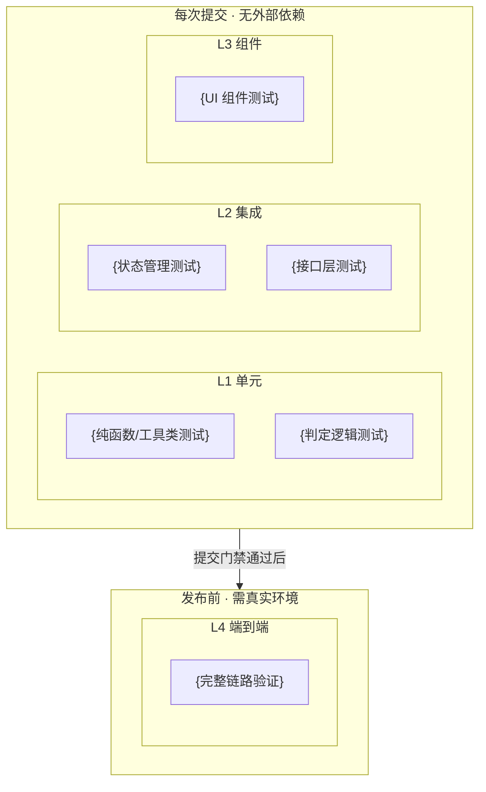

# {YP-XX-NN}: {需求标题} — 测试用例

> 来源 PRD：[{PRD文件名}](../../prds/{YYYY-MM}/{PRD文件名})
> 开发方案：[{开发方案文件名}](../../devs/{YYYY-MM}/{开发方案文件名})
> 提取日期：{YYYY-MM-DD}

本文档定义**验证方式**——测什么、怎么测、通过标准是什么。需求见 PRD，实现见开发方案。

---

## 一、测试范围与策略

### 1.1 测试分层

| 层级 | 工具 | 环境依赖 | 执行时机 |
|------|------|---------|---------|
| L1 单元 | {Vitest/pytest} | 无外部依赖 | 每次提交 |
| L2 集成 | {Vitest/pytest + mock} | 无外部依赖 | 每次提交 |
| L3 组件 | {@vue/test-utils / 无} | 无外部依赖 | 每次提交 |
| L4 端到端 | {Playwright / 手动} | {真实环境} | 发布前 |

### 1.2 覆盖范围

| 编号 | 被测对象 | 层级 |
|------|---------|------|
| COV-1 | {被测模块1} | L1/L2/L3/L4 |
| COV-2 | {被测模块2} | L1/L2/L3/L4 |

### 1.3 不覆盖范围

| 不覆盖 | 原因 |
|--------|------|
| {不覆盖项1} | {原因} |

### 1.4 测试环境

| 项 | 值 |
|----|-----|
| 运行器 | {Vitest x / pytest x} |
| 用例发现 | `{test file pattern}` |
| 全局装配 | `{setup file}` |
| 别名/Mock | {关键 mock 配置} |
| 覆盖阈值 | {lines/functions/branches/statements 阈值} |

### 1.5 测试数据

{测试夹具定义——最小但覆盖全部分支}

| 夹具 | 数据 | 用途 |
|------|------|------|
| `{FIXTURE_A}` | {数据描述} | {使用场景} |
| `{FIXTURE_B}` | {数据描述} | {使用场景} |

---

## 二、测试用例

### 2.1 {被测模块1}（COV-1 · L1）

> 自动化落点：`{test/file/path.test.ts}`（**待新增** / 已存在，追加用例）

| 编号 | 用例 | 步骤 | 预期结果 | 优先级 | 状态 |
|------|------|------|---------|--------|------|
| TC-{MODULE}-001 | {用例标题} | {操作步骤} | {预期结果} | P0 | 待实现 |
| TC-{MODULE}-002 | {用例标题} | {操作步骤} | {预期结果} | P0 | 待实现 |
| TC-{MODULE}-003 | {边界/异常场景} | {操作步骤} | {预期结果} | P1 | 待实现 |

### 2.2 {被测模块2}（COV-2 · L2）

> 自动化落点：`{test/file/path.test.ts}`（**待新增**）
> 前置：{前置条件说明}

| 编号 | 用例 | 步骤 | 预期结果 | 优先级 | 状态 |
|------|------|------|---------|--------|------|
| TC-{MODULE}-001 | {用例标题} | {操作步骤} | {预期结果} | P0 | 待实现 |

---

## 三、边缘场景用例

| 编号 | 场景 | 步骤 | 预期结果 | 优先级 | 状态 |
|------|------|------|---------|--------|------|
| TC-EDGE-001 | {边缘场景} | {操作步骤} | {预期结果} | P0 | 待实现 |
| TC-EDGE-002 | {异常输入} | {操作步骤} | {预期结果} | P1 | 待实现 |

---

## 四、回归用例

> 针对开发方案 §8 已登记的缺陷，每条缺陷至少一条用例**固化当前行为**，并在修复后转为断言期望行为。

| 编号 | 关联缺陷 | 场景 | 当前预期（固化） | 修复后预期 | 优先级 | 状态 |
|------|---------|------|-----------------|-----------|--------|------|
| TC-REG-001 | 缺陷 N（Pn） | {场景} | {当前行为} | {期望行为} | Pn | 待实现 |

---

## 五、追溯矩阵

| 需求项（PRD） | 验收标准 | 覆盖用例 |
|--------------|---------|---------|
| FR-01 {功能名} | AC-01, AC-02 | TC-{MODULE}-001 ~ 00N |
| FR-02 {功能名} | AC-03 | TC-{MODULE}-001 ~ 00N |
| NFR {非功能需求} | — | {用例列表} |

---

## 六、覆盖缺口

| 编号 | 缺口 | 影响 | 建议 |
|------|------|------|------|
| G-1 | {缺口描述} | {影响} | {建议} |

---

## 七、入口与出口准则

### 入口准则

- [ ] 开发方案文件清单全部落地，可通过类型检查
- [ ] 测试夹具就绪
- [ ] 测试环境可运行

### 出口准则

- [ ] **P0 用例 100% 通过**
- [ ] P1 用例通过率 ≥ 90%，未通过项已登记
- [ ] 回归用例中关键行为用例通过
- [ ] 用例并入主测试套件，全量通过
- [ ] 覆盖率达标；已登记缺口可接受