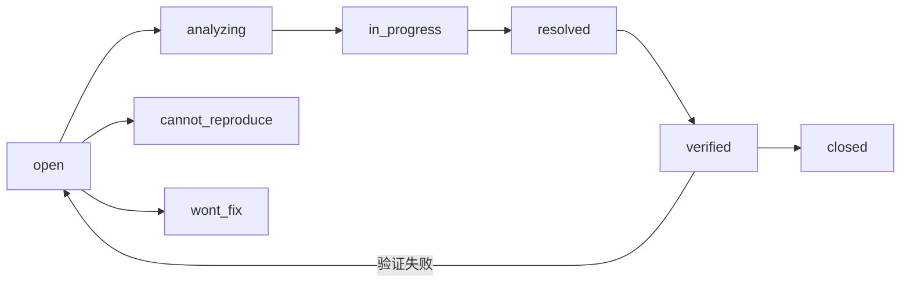

# 缺陷报告模板 — YiKnowledge 知识库

> 使用此模板记录 YiKnowledge 知识库的缺陷。知识库缺陷涉及 frontmatter 格式、文件命名、目录结构、RAG 索引等问题。

---

## 命名规范

文件命名：`{序号}-{分类}-{简短描述}.md`

- **序号**：两位数字，同一分类内递增
- **分类**：缺陷所属类别（如 `frontmatter`、`命名`、`同步`、`RAG`）
- **描述**：5-15 字，描述现象

示例：`01-frontmatter-知识条目缺少必填字段.md`

---

## 知识库特定分类

| 分类 | 说明 | 典型缺陷 |
|------|------|---------|
| `frontmatter` | YAML frontmatter 格式、必填字段 | 字段缺失、格式错误、值非法 |
| `命名` | 文件/目录命名规范 | 下划线、纯数字文件名、超 3 级目录 |
| `同步` | YiAi 知识监视器同步 | 扫描遗漏、bulk_write 失败 |
| `RAG` | RAG 索引与检索 | 索引不完整、元数据丢失 |
| `模板` | 文档模板问题 | 模板过时、字段缺失 |
| `治理` | 生命周期、审核流程 | stale 内容未清理 |

---

## 严重度与优先级

| 严重度 | 定义 | 典型场景 |
|--------|------|---------|
| `critical` | RAG 索引全量失败、知识库不可检索 | 知识监视器崩溃 |
| `major` | 部分知识文件 RAG 不可检索 | frontmatter 格式错误导致索引跳过 |
| `minor` | 命名不规范、目录超深 | 单个文件命名违规 |
| `trivial` | 格式微调、标签优化 | 标签拼写错误 |

| 优先级 | 定义 | 响应时间 |
|--------|------|---------|
| `p0` | 阻断 RAG 检索 | 立即修复 |
| `p1` | 影响批量知识可用性 | 当天修复 |
| `p2` | 单个文件受影响 | 本周修复 |
| `p3` | 可延后 | 下个迭代 |

---

## 生命周期



---

## 模板

### 一、现象

> **一句话描述**：什么文件/目录，出现了什么问题。

**影响文件**（列出受影响的文件路径）：

```
YiKnowledge/projects/...
```

### 二、复现步骤

1. 定位到问题文件
2. 检查规范要求（参考 [MEMORY.md](../../../MEMORY.md) 和 [CLAUDE.md](../../../CLAUDE.md)）
3. 对比实际状态与规范要求

### 三、根因分析

> - **为什么不符合规范**：创建时遗漏、模板过时、迁移残留
> - **影响范围**：单个文件 / 同类文件 / 全库

### 四、修复方案

> 具体的文件变更（重命名、修改 frontmatter、调整目录结构）。

### 五、验证方法

- [ ] frontmatter 通过就绪检查清单
- [ ] 文件命名符合 [命名规范](../../../MEMORY.md)
- [ ] 目录深度 ≤ 3 级
- [ ] YiAi 知识监视器可正常索引（检查 `knowledge_files` 集合）

### 六、预防措施

| 层面 | 措施 |
|------|------|
| 模板 | 更新模板文件，添加校验规则 |
| 流程 | 新文件创建时执行就绪检查清单 |
| CI | 添加 frontmatter 格式校验脚本 |