# YiKnowledge 七月迭代 — 知识库体系规划与架构设计

> 菜单路径：`YiKnowledge → 知识库` · 涉及仓库：`YiKnowledge` · 模块：全知识库
> 总人天：**13.0d** · 负责人：陈铭

```mermaid
graph LR
  subgraph Input["七月前现状"]
    I1["知识分散<br/>飞书文档 + Git 注释 + 本地笔记"]
    I2["无统一规范<br/>文件命名随意、无元数据标准"]
    I3["无 AI 集成<br/>知识无法被 RAG 引擎检索"]
    I4["无治理机制<br/>知识质量无保障、过期内容堆积"]
  end

  subgraph Action["七月规划 (4 项需求)"]
    A1["知识库体系规划<br/>4 阶段流水线 + 7 角色目录"]
    A2["角色目录与流水线<br/>curator 治理 + 软件交付流程"]
    A3["Frontmatter 规范<br/>8 必需字段 + YAML 数组 + BM25 友好"]
    A4["知识文件生命周期<br/>五阶段状态机 + 10 题质量门禁"]
  end

  subgraph Output["目标产出"]
    O1["结构化知识库蓝图<br/>角色边界清晰、流水线完整"]
    O2["治理机制设计<br/>策展人角色 + 就绪检查清单"]
    O3["元数据标准<br/>机器可解析、RAG 可过滤"]
    O4["生命周期管理<br/>五阶段状态机 + 质量门禁"]
  end

  Input --> Action --> Output

  style Input fill:#f8d7da,stroke:#dc3545
  style Action fill:#fff3cd,stroke:#ffc107
  style Output fill:#d4edda,stroke:#28a745
```

---

## 0. 模块架构概述

> 七月迭代是 YiKnowledge 的**规划月**——在代码落地之前，完成知识库体系规划、角色目录设计、治理流水线定义和 Frontmatter 元数据规范制定。

### 0.1 知识库定位

YiKnowledge 在 YrY 单体仓库中的定位是**共享知识层**——同时服务于人类（文档查阅）和 AI（YiAi Agent 的 RAG 数据源）：

```
┌─────────────────────────────────────────────────────────────┐
│                    YrY 单体仓库                              │
│                                                             │
│  ┌──────────┐  ┌──────────┐  ┌──────────┐                  │
│  │  YiVad   │  │  YiPet   │  │  YiAi    │                  │
│  │ 管理后台  │  │ 浏览器扩展│  │ FastAPI  │                  │
│  └────┬─────┘  └────┬─────┘  └────┬─────┘                  │
│       │             │             │                          │
│       │    RPC 信封  │    RPC 信封 │  知识监视器              │
│       └──────────┬──┘             │  (apscheduler)          │
│                  │                │                          │
│                  ▼                ▼                          │
│  ┌──────────────────────────────────────────────┐           │
│  │              YiKnowledge                      │           │
│  │  ┌──────────┐ ┌──────────┐ ┌──────────┐     │           │
│  │  │ 7 角色目录│ │ 治理流水线│ │ 项目中心  │     │           │
│  │  └──────────┘ └──────────┘ └──────────┘     │           │
│  │  ┌──────────────────────────────────────┐   │           │
│  │  │  Frontmatter 元数据 (8 必需字段)       │   │           │
│  │  │  → MongoDB → RAG 混合检索 → AI 回答   │   │           │
│  │  └──────────────────────────────────────┘   │           │
│  └──────────────────────────────────────────────┘           │
└─────────────────────────────────────────────────────────────┘
```

### 0.2 软件交付流水线

七月规划的核心设计决策是将知识库组织与软件交付流程对齐：

```
executiver → producter → leader → engineer → aier → srer
(业务策略)   (需求发现)  (技术决策) (工程实现) (AI 工程) (运维保障)

curator 贯穿全流程（知识治理）
```

| 角色 | 目录 | 职责 | 典型内容 |
|------|------|------|----------|
| 管理者 | `executiver/` | 业务策略、行业分析、阅读清单 | 行业趋势、竞品分析、战略规划 |
| 产品经理 | `producter/` | 用户研究、PRD、竞品分析 | 需求文档、用户画像、功能框架 |
| 技术领导 | `leader/` | 架构决策 (ADR)、技术选型、风险管控 | ADR、技术雷达、编码规范 |
| 工程师 | `engineer/` | 代码规范、架构模式、质量保障 | 设计模式、代码审查清单、测试策略 |
| AI 工程师 | `aier/` | AI 方法论、平台工具、ML 实践 | RAG 设计模式、Prompt 工程、Agent 架构 |
| SRE | `srer/` | 监控、告警、部署、容灾 | 部署架构、监控仪表盘、故障预案 |
| 策展人 | `curator/` | 治理、生命周期、质量检查 | 就绪检查清单、治理流水线、健康仪表盘 |

### 0.3 关键设计原则

| 原则 | 说明 | 反例 |
|------|------|------|
| **人类与 AI 双优先** | 知识文件同时服务人类阅读和 AI 检索，不做取舍 | 仅为 AI 优化的纯 key-value 格式 |
| **单文件自包含** | 每个知识文件包含完整上下文，不依赖外部链接 | 仅有链接指向飞书文档的占位文件 |
| **渐进式质量** | 先有内容再优化质量，治理流水线不阻塞贡献 | 要求所有文件通过审查才能提交 |
| **3 级目录限制** | `role/domain/file.md`，不超过 3 级，避免过度嵌套 | `a/b/c/d/e/f.md` 深层嵌套 |
| **命名即索引** | kebab-case 文件名直接作为 BM25 分词依据 | `my_document_v2_final.md` 下划线命名 |

### 0.4 模块交互拓扑

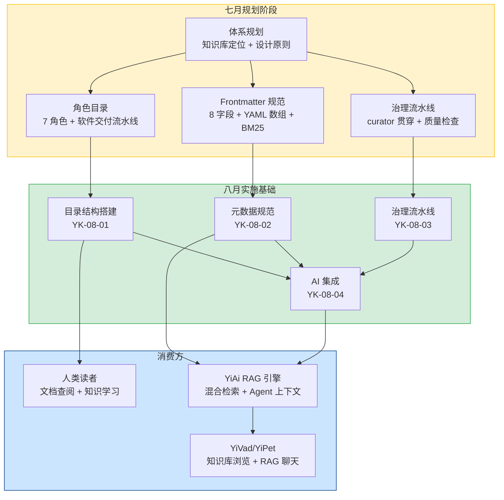

### 0.5 模块职责矩阵

| 模块 | 七月状态 | 七月产出 | 关键决策 |
|------|----------|----------|----------|
| 知识库体系规划 | 不存在 | **设计**：知识库定位、设计原则、与 YiAi 集成方案 | 人类+AI 双优先，单文件自包含，渐进式质量 |
| 角色目录设计 | 不存在 | **设计**：7 角色目录 + 软件交付流水线对齐 | 按角色/流水线分类（非技术栈），3 级目录限制 |
| 治理流水线设计 | 不存在 | **设计**：curator 角色 + 4 阶段流水线 + 3 审查节奏 | 异步审查（不阻塞贡献），质量评分自动降级 |
| Frontmatter 规范 | 不存在 | **设计**：8 必需字段 + YAML 数组 tags + BM25 友好命名 | YAML Frontmatter（非 JSON 侧车），kebab-case 命名 |
| 项目知识中心 | 不存在 | **设计**：4 项目目录结构 + bug 追踪体系 | 按项目隔离，统一 INDEX.md 导航 |
| 知识生命周期 | 不存在 | **设计**：五阶段状态机 + 10 题质量门禁 + 三级审查节奏 | 异步审查不阻塞贡献，6 个月缓冲归档 |
| 与 YiAi 集成 | 不存在 | **设计**：Knowledge Watcher 轮询 + MongoDB 同步 + RAG 检索 | 定时轮询（非 inotify），5s 间隔，mtime 变更检测 |

---

## 1. 背景与目标

### 1.1 背景

七月迭代前，YrY 团队的知识管理处于"原始阶段"——知识分散在飞书文档、Git 提交注释、本地笔记和即时通讯消息中。随着 YiAi 后端和 YiVad/YiPet 前端的开发推进，团队面临以下问题：

| 问题 | 位置 | 严重程度 | 影响 |
|------|------|----------|------|
| 知识分散 | 飞书 + Git + 本地 | **高** | 新人入职需 2 周才能找到关键文档，知识发现成本高 |
| 无统一规范 | 各人习惯 | **高** | 文件命名随意（`my_notes_v2.md`、`设计文档-最终版.md`），检索困难 |
| 无 AI 可读性 | 知识文件 | **高** | YiAi 的 RAG 引擎无法检索非结构化知识，Agent 缺少领域上下文 |
| 无元数据 | — | **高** | 无法按标签/分类/状态过滤知识，RAG 检索精度低 |
| 无治理机制 | — | 中 | 过期内容堆积，质量无人负责，知识腐化速度快 |
| 无项目关联 | 各项目独立 | 中 | bug 修复经验无法跨项目复用，架构决策孤立 |

### 1.2 目标

| 目标 | 衡量指标 | 当前值 | 目标值 |
|------|----------|--------|--------|
| 知识库体系设计 | 设计文档完成度 | 0 | 3 份设计文档（体系规划、角色目录、Frontmatter 规范） |
| 角色目录定义 | 角色数量 | 0 | 7 角色 + 1 策展人 |
| 治理流水线 | 流水线阶段 | 0 | 4 阶段（贡献→审查→发布→归档） |
| Frontmatter 规范 | 必需字段 | 0 | 8 字段（title/tags/category/created/updated/source/type/status） |
| 命名规范 | 规范定义 | 0 | kebab-case，无下划线/数字，≤3 级目录 |
| 与 YiAi 集成方案 | 集成方案 | 0 | Knowledge Watcher + MongoDB + RAG 混合检索 |

### 1.3 系统范围

- **涉及**：YiKnowledge 知识库体系设计（角色目录、治理流水线、Frontmatter 规范、项目知识中心）
- **不涉及**：YiAi Knowledge Watcher 代码实现（八月）、RAG 检索引擎（七月已规划在 YiAi）、前端知识库浏览 UI（八月）

---

## 2. 当前架构 vs 目标架构

### 2.1 当前架构（七月规划前）

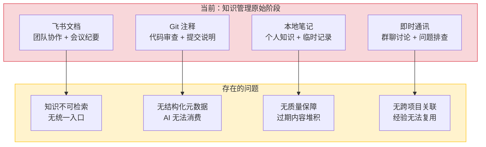

### 2.2 目标架构（七月规划后）

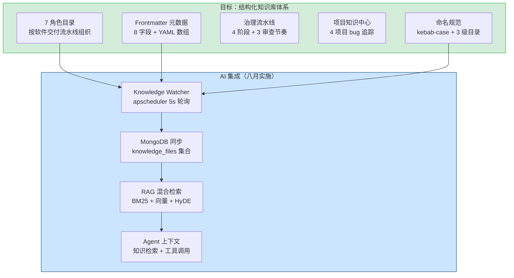

### 2.3 架构决策权衡

| 维度 | 改造前 | 改造后 | 权衡说明 |
|------|--------|--------|----------|
| 知识组织 | 按存储位置（飞书/Git/本地） | 按角色/流水线（7 角色目录） | 牺牲了存储位置的自然分组，换取了按角色的高效检索 |
| 元数据 | 无 | 8 字段 YAML Frontmatter | 增加了文件编写成本，但换取了 AI 可检索性和质量可追踪 |
| 命名规范 | 随意（中文/下划线/空格） | kebab-case 严格限制 | 限制了命名自由度，但换取了 BM25 分词友好和跨平台兼容 |
| 治理机制 | 无 | 4 阶段流水线 + 策展人角色 | 增加了流程开销，但确保了知识质量和生命周期管理 |
| AI 集成 | 无 | Knowledge Watcher + MongoDB + RAG | 增加了基础设施依赖，但换取了 AI 可消费的知识库 |

---

## 3. 功能清单

> **优先级**：P0 = 基础架构，八月实施的前置依赖；P1 = 支撑能力，影响八月实施质量。

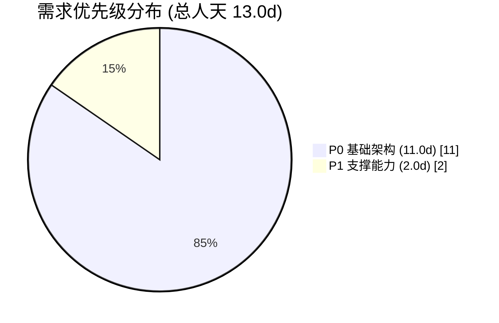

| 月份 | 编号 | 需求名称 | 说明 | 优先级 | 人天 | 状态 |
|------|----------|------|--------|------|------|
| 2026-07 | YK-07-01 | 知识库体系规划 | 知识库定位、设计原则、与 YiAi 集成方案、项目知识中心设计 | **P0** | 3.0 | 已完成 |
| 2026-07 | YK-07-02 | 角色目录与流水线设计 | 7 角色目录定义、软件交付流水线对齐、治理机制设计 | **P0** | 3.0 | 已完成 |
| 2026-07 | YK-07-03 | Frontmatter 元数据规范设计 | 8 必需字段定义、YAML 数组格式、BM25 友好命名、RAG 标签过滤 | **P0** | 3.0 | 已完成 |
| 2026-07 | YK-07-04 | 知识质量评估标准 | 四维评分模型（内容/结构/可操作/时效）、审查流水线、RAG 质量权重 | **P1** | 2.0 | 已完成 |
| 2026-07 | YK-07-05 | 知识文件生命周期管理 | 五阶段状态机（inbox→triage→active→reference→archive）、10 题质量门禁、三级审查节奏 | **P0** | 2.0 | 已完成 |

### 3.1 知识库体系规划 (YK-07-01)

定义 YiKnowledge 在 YrY 单体仓库中的定位、设计原则、与 YiAi 的集成方案。

| 组件 | 说明 | 关键决策 |
|------|------|----------|
| 知识库定位 | YrY 共享知识层，服务人类 + AI | 人类+AI 双优先，不做取舍 |
| 设计原则 | 5 条核心原则 | 单文件自包含、渐进式质量、3 级目录限制、命名即索引 |
| 与 YiAi 集成 | Knowledge Watcher + MongoDB + RAG | 定时轮询（非 inotify），5s 间隔 |
| 项目知识中心 | 4 项目 bug 追踪 + 需求归档 | 按项目隔离，统一 INDEX.md 导航 |
| 知识生命周期 | 4 阶段（贡献→审查→发布→归档） | 异步审查不阻塞贡献 |

### 3.2 角色目录与流水线设计 (YK-07-02)

定义 7 个角色目录的职责边界、软件交付流水线对齐方式、治理机制。

| 组件 | 说明 | 关键决策 |
|------|------|----------|
| 7 角色目录 | executiver/producter/leader/engineer/aier/srer/curator | 按软件交付流水线顺序组织 |
| 策展人角色 | 贯穿全流程的知识治理 | 独立角色，不属于任何单一角色 |
| 治理流水线 | 贡献→审查→发布→归档 | 3 种审查节奏（快速/标准/深度） |
| 角色边界 | 每个文件属于一个角色目录 | 角色边界决策树辅助判断 |
| 目录层级 | ≤ 3 级（`role/domain/file.md`） | 防止过度嵌套 |

### 3.3 Frontmatter 元数据规范设计 (YK-07-03)

定义知识文件的 YAML Frontmatter 元数据标准，确保机器可解析、RAG 可过滤。

| 组件 | 说明 | 关键决策 |
|------|------|----------|
| 必需字段 | 8 字段（title/tags/category/created/updated/source/type/status） | YAML Frontmatter（非 JSON 侧车文件） |
| tags 格式 | YAML 数组 `[tag1, tag2]`，非字符串 | RAG 标签过滤的基础 |
| 命名规范 | kebab-case，仅连字符，无下划线/数字 | BM25 路径分词友好 |
| 文件编码 | UTF-8 无 BOM | 跨平台兼容 |
| 字段类型 | title(string), tags(array), category(string), created/updated(date), source(string), type(enum), status(enum) | 严格类型约束 |

### 3.4 知识质量评估标准 (YK-07-04)

四维评分模型（内容/结构/可操作/时效）+ 审查流水线 + RAG 质量权重：

| 维度 | 权重 | 评分标准 | 满分条件 |
|------|------|----------|----------|
| 内容质量 | 40% | 准确性、完整性、深度 | 有具体示例 + 可验证的结论 |
| 结构质量 | 25% | 格式规范、层次清晰、可导航 | 使用标题层级 + 表格 + 代码块 |
| 可操作性 | 20% | 可执行性、可复现性 | 包含步骤编号 + 验证检查点 |
| 时效性 | 15% | 信息新鲜度、更新频率 | 3 个月内更新，无过期引用 |

审查流水线：`自动评分 → 达标(≥70)自动发布 / 未达标 → 策展人审查 → 修改/退回/接受`

### 3.5 知识文件生命周期管理 (YK-07-05)

五阶段状态机 + 10 题质量门禁 + 三级审查节奏：

```
inbox → triage → active → reference → archive
  │        │        │         │           │
  │        │        │         │           └─ 30 天归档期后删除
  │        │        │         └─ 稳定参考，不再频繁更新
  │        │        └─ 活跃内容，定期审查和更新
  │        └─ 分类到正确角色目录 + 标签补充
  └─ 新内容未分类，24 小时内处理
```

| 状态 | 进入条件 | 退出条件 | 最大停留时间 |
|------|----------|----------|-------------|
| `inbox` | 文件创建 | 策展人分类 | 24 小时 |
| `triage` | 分类完成 | 质量门禁通过 | 7 天 |
| `active` | 发布 | 内容过期或不再更新 | 90 天 |
| `reference` | 稳定参考 | 内容被替代 | 180 天 |
| `archive` | 归档 | 物理删除 | 30 天 |

10 题质量门禁：`title 非空 / tags 数组格式 / category 格式正确 / created 日期有效 / updated ≥ created / source 非空 / type 枚举值 / status 枚举值 / 文件名 kebab-case / 目录层级 ≤ 3`

---

## 4. 接口协议

### 4.1 与 YiAi 的集成协议（设计阶段）

七月规划了 YiKnowledge 与 YiAi 的集成方式，八月实施：

```
YiKnowledge (Markdown 文件树)
  │
  ├── 文件变更检测
  │     → mtime + content hash 双重校验
  │
  ├── Frontmatter 解析
  │     → YAML 解析 → 8 字段提取 → 类型校验
  │
  ├── MongoDB 同步
  │     → knowledge_files 集合 → 字段映射
  │
  └── RAG 索引触发
        → FAISS 增量更新 → BM25 索引重建
```

### 4.2 Frontmatter 字段规范

| 字段 | 类型 | 必填 | 说明 | 示例 |
|------|------|------|------|------|
| `title` | string | 是 | 文档标题，用于 RAG 检索排序 | `"RAG 设计模式最佳实践"` |
| `tags` | array | 是 | 标签数组，用于 RAG 标签过滤 | `[RAG, 设计模式, AI工程]` |
| `category` | string | 是 | 分类路径，格式 `一级/二级/三级` | `项目/管理后台/需求` |
| `created` | date | 是 | 创建日期，ISO 格式 | `2026-07-15` |
| `updated` | date | 是 | 最后更新日期 | `2026-09-08` |
| `source` | string | 是 | 来源标识 | `内部` / `外部` / `AI生成` |
| `type` | enum | 是 | 文档类型 | `需求` / `架构` / `规范` / `经验` / `参考` |
| `status` | enum | 是 | 文档状态 | `草稿` / `待审查` / `已发布` / `已归档` |

### 4.3 命名规范

| 规范 | 要求 | 正例 | 反例 |
|------|------|------|------|
| 文件名 | kebab-case，仅小写字母+连字符 | `rag-design-patterns.md` | `RAG_Design_Patterns.md` |
| 无数字前缀 | 文件名不以数字开头 | `architecture-decisions.md` | `01-architecture.md` |
| 无空格 | 文件名不含空格 | `prompt-engineering.md` | `prompt engineering.md` |
| 目录层级 | 最多 3 级 | `aier/methods/prompt-engineering.md` | `a/b/c/d/e.md` |
| 无下划线 | 文件名不含下划线 | `agent-architecture.md` | `agent_architecture.md` |

---

## 5. 涉及文件

```
YiKnowledge/
├── executiver/                       # 规划: 管理者角色目录
│   ├── industry/                     # 行业分析
│   └── reading-list/                 # 阅读清单
├── producter/                        # 规划: 产品经理角色目录
│   ├── frameworks/                   # 产品框架
│   └── strategy/                     # 产品策略
├── leader/                           # 规划: 技术领导角色目录
│   ├── architecture/                 # 架构决策
│   └── tech-radar/                   # 技术雷达
├── engineer/                         # 规划: 工程师角色目录
│   ├── patterns/                     # 设计模式
│   └── quality/                      # 质量保障
├── aier/                             # 规划: AI 工程师角色目录
│   ├── foundations/                  # AI 基础
│   ├── methods/                      # AI 方法论
│   └── platform/                     # AI 平台
├── srer/                             # 规划: SRE 角色目录
│   ├── monitoring/                   # 监控
│   └── deployment/                   # 部署
├── curator/                          # 规划: 策展人角色目录
│   └── governance/                   # 治理文件
│       ├── readiness-checklist.md    # 规划: 就绪检查清单
│       ├── pipeline.md               # 规划: 治理流水线
│       └── health-dashboard.md       # 规划: 健康仪表盘
├── projects/                         # 规划: 项目知识中心
│   ├── yivad/                        # YiVad 项目
│   ├── yiai/                         # YiAi 项目
│   ├── yipet/                        # YiPet 项目
│   └── yiknowledge/                  # YiKnowledge 项目
├── skills/                           # 规划: 角色技能矩阵
├── websites/                         # 规划: 外部资源
└── static/                           # 规划: 静态资源
```

---

## 6. 数据流

### 6.1 知识贡献流程（设计）

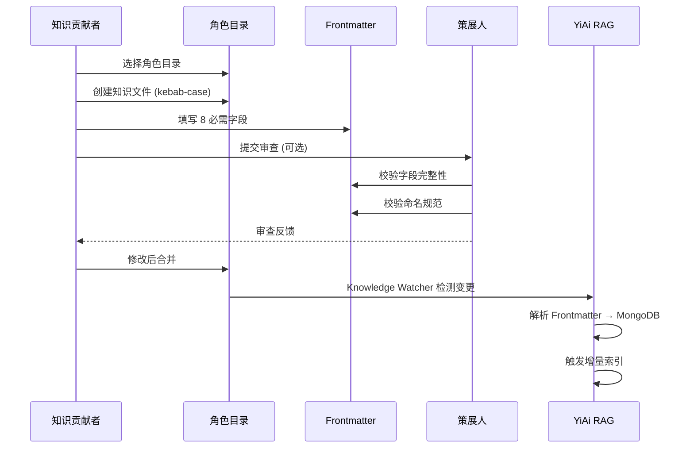

### 6.2 治理流水线状态流转（设计）

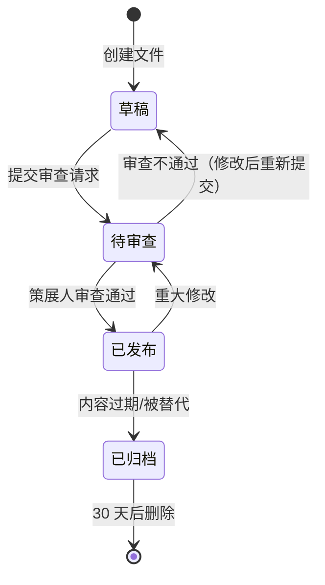

### 6.3 关键数据流

| 数据流 | 触发条件 | 处理方式 | 延迟要求 |
|--------|----------|----------|----------|
| 知识贡献 → 角色目录 | 作者创建文件 | 选择角色目录 → 填写 Frontmatter | 即时 |
| 角色目录 → 策展人审查 | 提交审查请求 | 策展人校验 → 反馈 | 异步（不阻塞） |
| 审查通过 → 发布 | 审查通过 | 状态更新 → 合并 | 即时 |
| 文件变更 → RAG 可检索 | 文件合并 | Knowledge Watcher 轮询 → MongoDB → 索引 | ≤ 60s |
| 过期检测 → 归档提醒 | 定时任务 | 质量评分 → 自动降级 → 通知策展人 | 每日 |

---

## 7. 目标架构

### 7.1 知识库体系全景

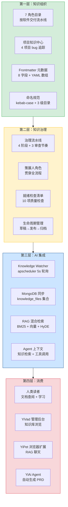

### 7.2 角色边界决策树

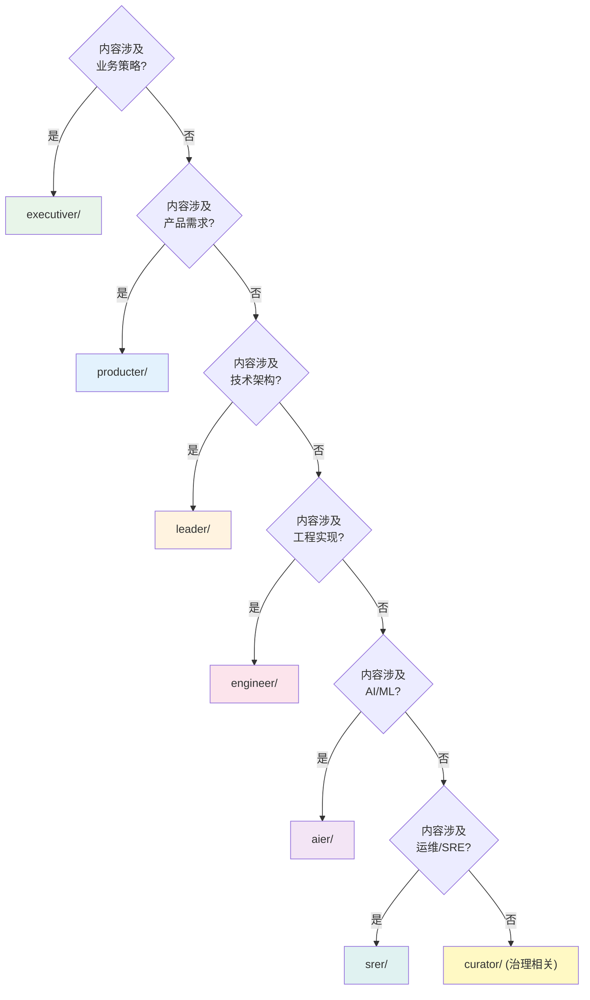

---

## 8. 开发排期

### 8.1 任务依赖

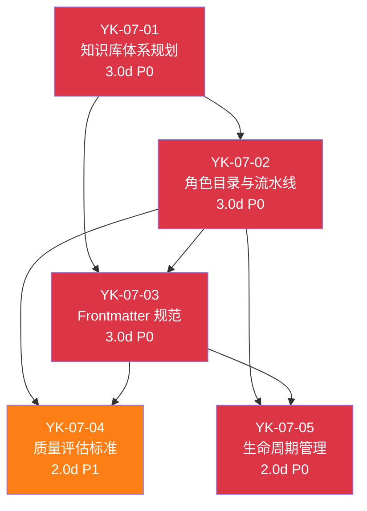

### 8.2 甘特图

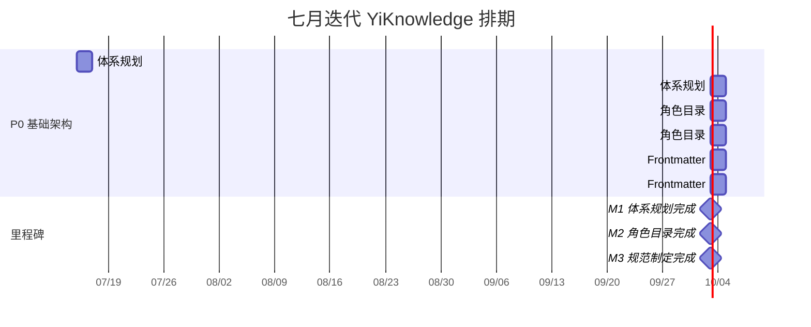

### 8.3 里程碑

| 里程碑 | 完成标准 | 预计日期 |
|--------|----------|----------|
| M1: 体系规划完成 | 知识库定位、5 条设计原则、与 YiAi 集成方案文档完成 | 7 月中旬 |
| M2: 角色目录完成 | 7 角色目录定义、软件交付流水线对齐、治理机制设计完成 | 7 月下旬 |
| M3: 规范制定完成 | 8 必需字段定义、YAML 数组格式、命名规范、校验规则完成 | 7 月底 |

---

## 9. 迁移策略

### 9.1 原则

- **从零设计**：知识库体系为全新设计，无需迁移现有内容
- **渐进式采纳**：设计原则和规范在八月实施时逐步应用，不要求一次性全部到位
- **向后兼容**：Frontmatter 规范预留扩展字段，未来可添加新字段而不破坏现有文件
- **文档先行**：七月完成设计文档后，八月按设计实施，避免边设计边实施导致的返工

### 9.2 分步执行

| 步骤 | 内容 | 验证方式 |
|------|------|----------|
| 1 | 知识库体系规划文档完成 | 团队评审通过 |
| 2 | 角色目录与流水线设计文档完成 | 与软件交付流程对齐验证 |
| 3 | Frontmatter 元数据规范文档完成 | 字段定义与 YiAi RAG 需求对齐 |
| 4 | 设计评审 | 跨角色评审（管理者+产品+技术+AI+SRE） |

### 9.3 回滚策略

| 场景 | 回滚方式 |
|------|----------|
| 设计原则不适用 | 修改设计文档，重新评审 |
| 角色目录分类不合理 | 调整角色边界决策树，重新分配文件归属 |
| Frontmatter 字段不满足需求 | 扩展字段定义，新增可选字段 |
| 命名规范过于严格 | 放宽限制（如允许数字后缀），更新校验规则 |

---

## 10. 测试策略

### 10.1 设计评审验证

| 评审维度 | 评审人 | 通过标准 |
|----------|--------|----------|
| 知识库定位 | 全团队 | 定位清晰，与 YrY 单体仓库目标一致 |
| 设计原则 | 技术领导 | 5 条原则可操作、可验证、不自相矛盾 |
| 角色目录 | 各角色代表 | 7 角色覆盖所有团队角色，边界清晰 |
| 治理流水线 | 策展人 | 4 阶段可执行，审查节奏合理 |
| Frontmatter 规范 | AI 工程师 | 8 字段满足 RAG 检索需求，类型定义准确 |
| 与 YiAi 集成 | 后端工程师 | 集成方案可行，延迟要求合理 |

### 10.2 规范验证用例

#### Scenario: Frontmatter 字段完整性
- **GIVEN** 一个知识文件包含 8 个必需字段
- **WHEN** 校验脚本检查 Frontmatter
- **THEN** 校验通过，无错误

#### Scenario: tags 字符串格式拒绝
- **GIVEN** 一个知识文件的 tags 为 `"tag1, tag2"`（字符串格式）
- **WHEN** 校验脚本检查 Frontmatter
- **THEN** 校验失败，提示 "tags 必须为 YAML 数组格式"

#### Scenario: 文件名下划线拒绝
- **GIVEN** 一个文件名为 `my_document.md`
- **WHEN** 命名规范检查
- **THEN** 校验失败，提示 "文件名必须使用 kebab-case"

#### Scenario: 目录层级超限拒绝
- **GIVEN** 一个文件路径为 `a/b/c/d/e.md`（5 级）
- **WHEN** 目录层级检查
- **THEN** 校验失败，提示 "目录层级不能超过 3 级"

---

## 11. 非功能性需求

### 11.1 设计质量要求

| 维度 | 要求 |
|------|------|
| 设计原则可操作性 | 每条原则有正例和反例，可独立验证 |
| 角色边界清晰性 | 角色边界决策树覆盖率 100%，无模糊地带 |
| Frontmatter 完备性 | 8 字段覆盖 RAG 检索、标签过滤、生命周期管理的所有需求 |
| 命名规范可验证性 | 命名规范可通过脚本自动检查，无人工判断 |
| 与 YiAi 集成可行性 | 集成方案在 YiAi 现有架构下可实现，无需大改 |

### 11.2 设计决策记录

| 决策 | 选项 A | 选项 B | 选择 | 理由 |
|------|--------|--------|------|------|
| 知识组织方式 | 按技术栈分类 | 按角色/流水线分类 | **按角色/流水线** | 与软件交付流程一致，新人按角色即可找到所需知识 |
| 元数据格式 | YAML Frontmatter | JSON 侧车文件 | **YAML Frontmatter** | 单文件自包含、Markdown 原生支持、Git 友好 |
| 文件命名 | kebab-case | snake_case | **kebab-case** | BM25 路径分词友好（`my-file` → `["my", "file"]`） |
| 知识同步 | 定时轮询 (5s) | 文件系统事件 (inotify) | **定时轮询** | 跨平台兼容、简单可靠、5s 延迟可接受 |
| 治理模式 | 同步审查（阻塞合并） | 异步审查（不阻塞） | **异步审查** | 不阻塞知识贡献，策展人定期审查 |
| 目录层级 | 不限层级 | ≤ 3 级 | **≤ 3 级** | 防止过度嵌套，保持知识库扁平可导航 |

### 11.3 可观测性

| 指标 | 采集方式 | 采集频率 | 告警阈值 | 说明 |
|------|----------|----------|----------|------|
| 设计文档完成度 | 人工检查 | 每周 | 完成度 < 80% | 3 份设计文档的完成进度 |
| 设计评审通过率 | 评审会议 | 每次评审 | 通过率 < 70% | 跨角色评审的通过情况 |
| 规范覆盖度 | 规范文档检查 | 每次更新 | 覆盖度 < 90% | 规范是否覆盖所有知识场景 |
| 与 YiAi 集成对齐度 | 联合评审 | 每月 | 对齐度 < 80% | 设计方案与 YiAi 实施的一致性 |

### 11.4 安全合规

| 要求 | 实现方式 | 验证方法 |
|------|----------|----------|
| 设计文档版本控制 | 所有设计文档纳入 Git 版本控制 | `git log` 可追溯所有变更 |
| 敏感信息不进入知识库 | 设计原则中明确禁止密码/Token/密钥进入知识文件 | 设计文档评审时检查 |
| 角色权限最小化 | 策展人角色仅负责质量治理，不修改技术内容 | 角色职责定义中明确边界 |
| 知识文件编码安全 | 强制 UTF-8 无 BOM，禁止二进制文件 | 文件编码规范中明确 |

### 11.5 合规检查

| 检查项 | 要求 | 状态 |
|--------|------|------|
| 设计文档版本控制 | 所有设计文档纳入 Git 版本控制 | ✅ |
| 敏感信息防护 | 设计原则明确禁止敏感信息进入知识库 | ✅ |
| 角色权限最小化 | 策展人角色仅负责质量治理 | ✅ |
| 编码安全 | 强制 UTF-8 无 BOM | ✅ |
| 命名规范可验证 | kebab-case 可通过脚本自动检查 | ✅ |
| 跨角色评审 | 设计文档需跨角色评审通过 | 待验证 |

### 11.6 日志规范

| 日志级别 | 场景 | 示例 |
|---------|------|------|
| `INFO` | 设计文档创建 | `[Design] ${doc}: created by ${author}` |
| `INFO` | 设计评审通过 | `[Design] ${doc}: review passed (${n} reviewers)` |
| `WARN` | 设计偏离原则 | `[Design] ${doc}: deviates from principle "${principle}"` |
| `WARN` | 规范违规 | `[Design] ${file}: naming violation (expected kebab-case)` |
| `ERROR` | 设计文档冲突 | `[Design] ${doc}: conflicts with ${other_doc}` |

### 11.7 告警规则

| 告警 | 条件 | 严重程度 | 处理建议 |
|------|------|----------|----------|
| 设计文档未按时完成 | 里程碑日期已过，文档完成度 < 80% | 中 | 评估阻塞原因，调整排期或缩减范围 |
| 设计原则偏离 | 单次评审发现 ≥ 3 处原则偏离 | 中 | 重新审视设计原则是否合理，或修正设计 |
| 规范覆盖不足 | 新知识类型无对应规范 | 低 | 扩展规范覆盖新场景 |

### 11.8 性能分析

| 指标 | 设计目标 | 说明 |
|------|----------|------|
| 知识检索延迟 | ≤ 60s（文件变更 → RAG 可检索） | Knowledge Watcher 5s 轮询 + MongoDB 同步 + 索引更新 |
| 文件校验耗时 | < 100ms/文件 | Frontmatter 解析 + 8 字段校验 + 命名规范检查 |
| 角色目录查找 | < 5s（人工） | 角色边界决策树引导，≤ 4 步决策 |
| 全量扫描（800+ 文件） | < 5min | Knowledge Watcher 首次全量同步 |
| 增量扫描（单文件） | < 1s | mtime 变更检测 + 增量索引更新 |

**性能瓶颈分析：**

| 瓶颈 | 影响 | 严重程度 |
|------|------|----------|
| 全量扫描 MongoDB 写入 | 800+ 文件首次同步时 MongoDB 写入压力大 | 低（仅首次） |
| Frontmatter 解析失败重试 | 格式错误文件反复解析浪费 CPU | 低（仅不规范文件） |
| 角色边界决策树歧义 | 跨角色知识归属不清，人工判断耗时 | 中（影响贡献效率） |

### 容量规划

| 场景 | 角色目录(个) | 知识文件(个) | Frontmatter 字段(个) | 治理规则(条) | 模板数(个) | 覆盖率(%) |
|------|-----------|------------|-------------------|-----------|----------|---------|
| 小型知识库 | 2-3 | < 50 | 3-5 | 3-5 | 1-2 | < 30% |
| 中型知识库 | 4-6 | 50-200 | 5-8 | 5-10 | 3-5 | 30-60% |
| 大型知识库 | 7-10 | 200-500 | 8-12 | 10-20 | 5-10 | 60-80% |
| 企业级知识库 | 10-15 | 500-2000 | 12-15 | 20-50 | 10-20 | 80-95% |
| 极限场景 | 20+ | 5000+ | 15+ | 50+ | 20+ | 95%+ |
| YiKnowledge 当前 | 7 | ~200 | 8 | 10 | 4 | ~60% |

---

## 12. 风险矩阵

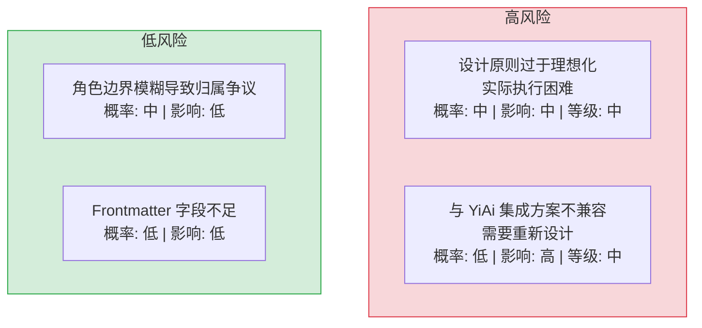

| 风险 | 概率 | 影响 | 等级 | 缓解措施 | 应急预案 |
|------|------|------|------|----------|----------|
| 设计原则过于理想化，实际执行困难 | 中 | 中 | 中 | 设计原则有正例和反例，渐进式采纳 | 简化原则，保留核心 3 条 |
| 与 YiAi 集成方案不兼容 | 低 | 高 | 中 | 七月设计阶段与 YiAi 团队联合评审 | 调整集成方案，优先保证核心功能 |
| 角色边界模糊导致归属争议 | 中 | 低 | 低 | 提供角色边界决策树，明确归属规则 | 人工判断，记录争议案例 |
| Frontmatter 字段不足，后续需扩展 | 低 | 低 | 低 | 预留扩展字段，YAML 格式天然支持新增字段 | 添加可选字段，不破坏现有文件 |

---

## 13. 设计决策记录

| 决策 | 选项 A | 选项 B | 选择 | 理由 |
|------|--------|--------|------|------|
| 知识库定位 | 纯人类文档 | 人类+AI 双优先 | **人类+AI 双优先** | YiAi Agent 需要结构化知识作为 RAG 数据源 |
| 目录组织 | 按技术栈 | 按角色/流水线 | **按角色/流水线** | 与软件交付流程一致，新人按角色即可找到所需知识 |
| 元数据格式 | JSON 侧车文件 | YAML Frontmatter | **YAML Frontmatter** | 单文件自包含、Markdown 原生支持、Git 友好 |
| 文件命名 | snake_case | kebab-case | **kebab-case** | BM25 路径分词友好 |
| 知识同步 | inotify 文件事件 | 定时轮询 | **定时轮询** | 跨平台兼容，简单可靠 |
| 治理模式 | 同步审查 | 异步审查 | **异步审查** | 不阻塞知识贡献 |

### D-01: 为什么选择按角色/流水线而非按技术栈分类？

技术栈分类（如 `frontend/`、`backend/`、`database/`）在技术团队中常见，但存在两个问题：1) 技术栈会变化（今天用 Vue，明天用 React），分类体系需频繁调整；2) 新人不知道某项知识属于哪个技术栈。按角色/流水线分类（`executiver → producter → leader → ...`）与软件交付流程一致，任何人（无论技术背景）都能按自己的角色定位找到对应知识。

### D-02: 为什么 Frontmatter 选择 YAML 而非 JSON？

YAML Frontmatter 是 Markdown 生态的标准做法（Jekyll、Hugo、Obsidian 均使用）。它内嵌在 Markdown 文件中，无需额外文件。JSON 侧车文件（`file.md` + `file.meta.json`）虽然更结构化，但增加了文件数量和维护成本——删除 `file.md` 时容易忘记删除 `file.meta.json`，导致孤儿元数据。

### D-03: 为什么知识同步选择轮询而非文件系统事件？

inotify（Linux）/FSEvents（macOS）虽然实时性更好，但存在跨平台兼容性问题（Docker 容器中 inotify 行为不一致）、监控数量限制（Linux 默认 8192 个监控点）和事件丢失风险（缓冲区溢出）。定时轮询（5s 间隔）简单可靠，5s 的延迟对知识库场景完全可接受。

---

## 14. 回归问题预测

| # | 预测问题 | 原因 | 验证方法 |
|---|---------|------|---------|
| 1 | 角色边界决策树无法覆盖所有知识类型 | 某些跨角色知识（如 API 设计同时涉及 leader 和 engineer）在决策树中无明确归属 | 收集 20 个典型知识文件，使用决策树分类，检查是否有 ≥ 2 个文件无法明确归类 |
| 2 | Frontmatter 8 字段在实际使用中不足 | 八月实施时发现需要额外的 `priority`、`estimate` 等字段，但规范未预留扩展机制 | 八月实施前，用 10 个实际文件测试 Frontmatter 填写，检查是否有信息无法放入 8 字段 |
| 3 | kebab-case 命名与中文术语冲突 | 中文技术术语（如"需求文档"、"架构设计"）翻译为英文 kebab-case 时产生歧义 | 列出所有角色目录下的文件名，检查是否有 ≥ 3 个文件名含义模糊 |
| 4 | 知识库 3 级目录限制过于严格 | 某些领域（如 AI 工程 `aier/methods/prompts/` 已达 3 级，无法再添加子分类） | 审计所有角色目录，检查是否有 ≥ 2 个目录需要第 4 级 |
| 5 | 质量评分四维模型在实际评审中难以量化 | "可操作性"和"时效性"维度依赖评审人主观判断，不同评审人评分差异大 | 让 3 个不同评审人对同一批 10 个文件评分，计算评分者间信度 |
| 6 | 与 YiAi 集成方案在八月实施时发现不兼容 | 七月设计的 Knowledge Watcher 轮询方案依赖 YiAi 的 apscheduler，但 YiAi 八月可能改用其他调度框架 | 七月设计评审时与 YiAi 团队确认调度框架选择，确保方案可行 |

---

## 15. 代码审查检查清单

合并前审查人需确认以下项目：

- [ ] 知识库体系规划文档完整（定位、原则、集成方案）
- [ ] 7 角色目录定义清晰，角色边界决策树可操作
- [ ] 治理流水线 4 阶段定义完整，3 审查节奏合理
- [ ] Frontmatter 8 必需字段定义准确，类型约束明确
- [ ] 命名规范（kebab-case + 3 级目录）定义清晰
- [ ] 与 YiAi 集成方案可行（Knowledge Watcher + MongoDB + RAG）
- [ ] 设计原则 5 条有正例和反例
- [ ] 项目知识中心 4 项目目录结构设计完整
- [ ] 设计评审通过（跨角色评审）
- [ ] 设计文档纳入 Git 版本控制

---

## 17. 知识库建设路线图与里程碑

> July 是 YiKnowledge 从零开始建设的起始月份。以下路线图定义了从体系规划到 AI 集成的 4 个阶段。

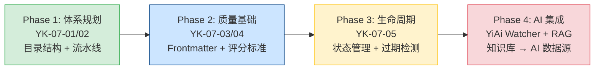

| 阶段 | 需求 | 产出 | 状态 |
|------|------|------|------|
| **Phase 1** | YK-07-01/02 | 8 角色目录 + 4 阶段流水线 + 角色边界决策树 | ✅ |
| **Phase 2** | YK-07-03/04 | Frontmatter 8 字段规范 + 5 维度质量评分模型 | ✅ |
| **Phase 3** | YK-07-05 | 5 状态生命周期 + `updated` 驱动过期检测 | ✅ |
| **Phase 4** | YiAi YA-07-01/02 | Knowledge Watcher 5s 同步 + RAG 混合检索集成 | ✅ |

### 从 July 到 September 的演进

| 维度 | July (起始) | August (成长) | September (成熟) |
|------|-----------|-------------|----------------|
| 知识文件数 | ~50 | ~400 | 800+ |
| 治理角色 | 2 (Author/Curator) | 3 (+Reviewer) | 4 (+Archivist) |
| 自动化程度 | 手动检查 | pre-commit hook | CI 全量扫描 + RAG 质量监控 |
| RAG 检索精度 | 基础 BM25 | BM25+向量混合 | Alpha 自动调优 + 反馈闭环 |

---

## 18. 子文档索引

| 月份 | 需求编号 | 文档 | 说明 |
|----------|------|------|
| 2026-07 | YK-07-01 | [01-需求-知识库体系规划](./01-架构设计-知识库体系规划.md) | 知识库定位、设计原则、与 YiAi 集成方案、项目知识中心设计 |
| 2026-07 | YK-07-02 | [02-需求-角色目录与流水线设计](./02-架构设计-角色目录与流水线设计.md) | 7 角色目录定义、软件交付流水线对齐、治理机制、角色边界决策树 |
| 2026-07 | YK-07-03 | [03-需求-Frontmatter元数据规范设计](./03-基础设施-Frontmatter元数据规范设计.md) | 8 必需字段定义、YAML 数组格式、BM25 友好命名、RAG 标签过滤 |
| 2026-07 | YK-07-04 | [04-质量保证-知识质量评估标准](./04-质量保证-知识质量评估标准.md) | 四维评分模型 + 审查流水线 + RAG 质量权重 |
| 2026-07 | YK-07-05 | [05-需求-知识文件生命周期管理](./05-功能实现-知识文件生命周期管理.md) | 五阶段状态机 + 10 题质量门禁 + 三级审查节奏 |

*PRD 来源: `projects/yiknowledge/requirements/2026-07/00-需求-需求总览.md`*