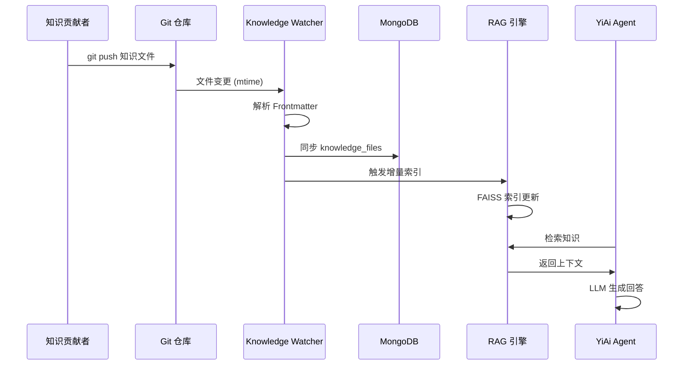
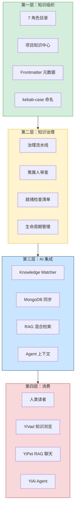
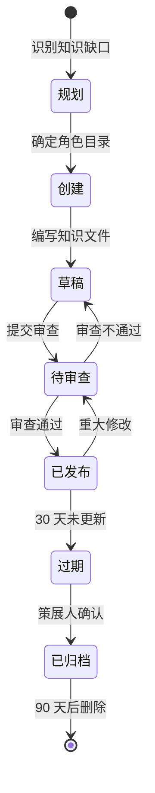
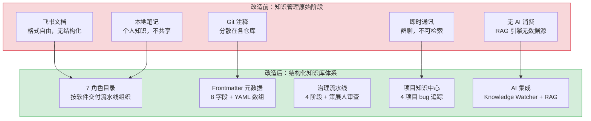

# YK-07-01: 知识库体系规划 — 定位、设计原则与 AI 集成方案

> 需求编号：YK-07-01 · 优先级：P0 · 人天：3.0d · 状态：已完成
> 依赖：无（基础规划）

## 背景

YrY 单体仓库包含 4 个项目（YiVad、YiAi、YiPet、YiKnowledge），团队规模增长迅速。当前知识管理处于"原始阶段"——知识分散在飞书文档、Git 注释、本地笔记和即时通讯消息中。

**核心矛盾**：YiAi 的 RAG 引擎和 Agent 需要结构化、可检索的知识作为上下文，但团队知识分散在非结构化、不可检索的渠道中。这导致 AI 回答质量受限于 LLM 训练数据，无法回答企业内部知识（架构决策、编码规范、权限设计等）。

### 现状问题

| 问题 | 表现 | 影响 |
|------|------|------|
| 知识分散 | 飞书/Git/本地/即时通讯 | 知识发现成本高，新人入职需 2 周才能找到关键文档 |
| 无 AI 可读性 | 知识文件无元数据、无统一格式 | YiAi RAG 引擎无法检索，Agent 缺少领域上下文 |
| 无质量保障 | 过期内容堆积，无人负责 | 知识腐化速度快，错误信息传播 |
| 无项目关联 | bug 修复经验孤立 | 同样的错误在不同项目中重复出现 |

### 规划目标

| 目标 | 衡量指标 |
|------|----------|
| 知识库定位清晰 | 在 YrY 单体仓库中的角色明确，与 YiAi/YiVad/YiPet 的交互关系定义清楚 |
| 设计原则可操作 | 5 条原则，每条有正例和反例，可独立验证 |
| AI 集成方案可行 | Knowledge Watcher + MongoDB + RAG 方案在 YiAi 现有架构下可实现 |
| 项目知识中心设计 | 4 项目 bug 追踪 + 需求归档体系 |

---

## 一、现状分析

### 1.1 改造前状态

```
当前知识分布（规划前）：
┌──────────────────────────────────────────────────────────┐
│ 飞书文档 (40%)                                            │
│ ├── 团队协作文档                                          │
│ ├── 会议纪要                                              │
│ └── 项目规划                                              │
├──────────────────────────────────────────────────────────┤
│ Git 注释 (20%)                                            │
│ ├── 代码审查评论                                          │
│ ├── 提交说明                                              │
│ └── CLAUDE.md 项目配置                                    │
├──────────────────────────────────────────────────────────┤
│ 本地笔记 (25%)                                            │
│ ├── 个人知识管理                                          │
│ ├── 技术调研                                              │
│ └── 临时记录                                              │
├──────────────────────────────────────────────────────────┤
│ 即时通讯 (15%)                                            │
│ ├── 群聊讨论                                              │
│ ├── 问题排查                                              │
│ └── 经验分享                                              │
└──────────────────────────────────────────────────────────┘
```

### 1.2 核心痛点

| 痛点 | 位置 | 严重程度 | 影响 |
|------|------|----------|------|
| 知识无统一入口 | 4 个渠道 | **高** | 查找知识需搜索 4 个渠道，效率极低 |
| 无结构化元数据 | 所有渠道 | **高** | AI 无法按标签/分类/状态过滤，RAG 检索精度低 |
| 知识不可检索 | 飞书/即时通讯 | 高 | 语义搜索"权限系统如何设计"无法匹配到相关文档 |
| 无版本控制 | 飞书/即时通讯 | 中 | 知识变更无历史记录，无法追溯 |
| 无质量治理 | 所有渠道 | 中 | 过期内容无人清理，错误信息持续传播 |
| 无跨项目复用 | 各渠道独立 | 中 | 项目 A 的 bug 修复经验无法在项目 B 中复用 |

### 1.3 改造前数据流

```
知识创建
  → 飞书/Git/本地/即时通讯（4 个独立渠道）
  → 无统一元数据标准
  → 无 AI 可消费接口
  → RAG 引擎无法检索
  → AI 回答仅依赖 LLM 训练数据
```

### 1.4 改造前 API 依赖

| # | 接口 | 调用方 | 说明 |
|---|------|--------|------|
| 1 | 无 | — | 规划阶段无代码依赖，仅设计文档 |

---

## 二、设计决策

### 决策 1：知识库定位 — 纯人类文档 vs 人类+AI 双优先

| 选项 | 描述 | 优点 | 缺点 |
|------|------|------|------|
| A: 纯人类文档 | 知识库仅面向人类阅读，优化可读性 | 格式自由，无结构化约束 | AI 无法消费，RAG 检索不可用 |
| B: 人类+AI 双优先 | 知识文件同时服务人类和 AI | 一份内容双重用途 | 需要结构化约束（Frontmatter），增加编写成本 |

**选择：B（人类+AI 双优先）**。理由：YiAi 的 Agent 需要结构化知识作为 RAG 数据源来生成高质量回答。如果知识库仅面向人类，AI 能力将受限于 LLM 训练数据。Frontmatter 的编写成本（每个文件 8 个字段，约 2 分钟）远低于 AI 回答质量提升带来的收益。

### 决策 2：知识组织方式 — 按技术栈 vs 按角色/流水线

| 选项 | 描述 | 优点 | 缺点 |
|------|------|------|------|
| A: 按技术栈 | `frontend/`、`backend/`、`database/` | 技术分类清晰 | 技术栈变化需重新分类，新人不知某项知识属于哪个技术栈 |
| B: 按角色/流水线 | `executiver→producter→leader→engineer→aier→srer` | 与软件交付流程一致 | 跨角色知识归属模糊 |

**选择：B（按角色/流水线）**。理由：软件交付流程是稳定的（策略→需求→设计→实现→部署），不随技术栈变化。任何人（无论技术背景）都能按自己的角色定位找到对应知识。

### 决策 3：知识同步方式 — 文件系统事件 vs 定时轮询

| 选项 | 描述 | 优点 | 缺点 |
|------|------|------|------|
| A: inotify/FSEvents | 文件系统事件实时通知 | 实时性好 | 跨平台兼容性差（Docker 中行为不一致），监控数量限制 |
| B: 定时轮询 (5s) | apscheduler 每 5 秒扫描文件树 | 跨平台兼容，简单可靠 | 5s 延迟 |

**选择：B（定时轮询）**。理由：5s 延迟对知识库场景完全可接受（人工编辑→提交→推送→轮询→索引，总延迟 < 60s）。轮询方案无需处理 inotify 的缓冲区溢出、事件丢失、Docker 兼容性等复杂问题。

---

## 三、体系规划

### 3.1 知识库在 YrY 中的定位

```
YrY 单体仓库
├── YiVad (Vue 3.5 管理后台)     ← 消费知识库（RAG 聊天 + 知识浏览）
├── YiAi (FastAPI 后端)          ← 消费知识库（RAG 数据源 + Agent 上下文）
├── YiPet (Chrome MV3 扩展)      ← 消费知识库（RAG 聊天 + 知识面板）
└── YiKnowledge (Markdown 知识库) ← 共享知识层（人类 + AI 双优先）
```

### 3.2 五条设计原则

#### 原则 1：人类与 AI 双优先

知识文件同时服务人类阅读和 AI 检索，不做取舍。

| 正例 | 反例 |
|------|------|
| Markdown 文件 + YAML Frontmatter（人类可读，AI 可解析） | 纯 JSON key-value 格式（AI 友好但人类不可读） |
| 自然语言正文 + 结构化元数据 | 仅为 AI 优化的嵌入向量（人类无法阅读） |

#### 原则 2：单文件自包含

每个知识文件包含完整上下文，不依赖外部链接。

| 正例 | 反例 |
|------|------|
| 文件中包含完整的架构决策上下文 | 文件仅写"参见飞书文档链接" |
| 代码示例内嵌在 Markdown 中 | 代码示例仅通过外部 GitHub 链接引用 |

#### 原则 3：渐进式质量

先有内容再优化质量，治理流水线不阻塞贡献。

| 正例 | 反例 |
|------|------|
| 草稿状态即可合并，策展人异步审查 | 要求所有文件通过审查才能合并 |
| 质量评分自动降级，提醒而非阻断 | 低质量文件直接拒绝合并 |

#### 原则 4：3 级目录限制

`role/domain/file.md`，不超过 3 级，避免过度嵌套。

| 正例 | 反例 |
|------|------|
| `aier/methods/prompt-engineering.md` | `aier/methods/prompts/advanced/chain-of-thought.md`（4 级） |

#### 原则 5：命名即索引

kebab-case 文件名直接作为 BM25 分词依据。

| 正例 | 反例 |
|------|------|
| `rag-design-patterns.md` → `["rag", "design", "patterns"]` | `RAG_Design_Patterns.md` → `["rag_design_patterns"]`（单个 token） |

### 3.3 与 YiAi 的集成方案



### 3.4 项目知识中心设计

```
YiKnowledge/projects/
├── INDEX.md                    # 跨项目导航索引
├── yivad/                      # YiVad 项目
│   ├── bugs/                   # 缺陷追踪
│   ├── requirements/           # 需求归档
│   └── architecture/           # 架构文档
├── yiai/                       # YiAi 项目
│   ├── bugs/
│   ├── requirements/
│   └── architecture/
├── yipet/                      # YiPet 项目
│   ├── bugs/
│   ├── requirements/
│   └── architecture/
└── yiknowledge/                # YiKnowledge 项目
    ├── bugs/
    ├── requirements/
    └── architecture/
```

---

## 四、目标架构

### 4.1 知识库四层架构



### 4.2 知识生命周期



---

## 五、具体改动

### 5.1 设计文档交付物

| 文档 | 内容 | 格式 |
|------|------|------|
| 知识库体系规划 | 定位、设计原则、集成方案、项目中心 | Markdown + Mermaid 图表 |
| 角色目录与流水线设计 | 7 角色定义、流水线、治理机制 | Markdown + Mermaid 图表 |
| Frontmatter 元数据规范 | 8 字段定义、类型约束、命名规范 | Markdown + 校验规则 |

### 5.2 涉及文件

```
YiKnowledge/
├── README.md                              # 规划: 知识库概述
├── INDEX.md                               # 规划: 导航索引
├── MEMORY.md                              # 规划: 知识库规则手册
├── executiver/                            # 规划: 管理者角色目录
├── producter/                             # 规划: 产品经理角色目录
├── leader/                                # 规划: 技术领导角色目录
├── engineer/                              # 规划: 工程师角色目录
├── aier/                                  # 规划: AI 工程师角色目录
├── srer/                                  # 规划: SRE 角色目录
├── curator/                               # 规划: 策展人角色目录
│   └── governance/                        # 规划: 治理文件
├── projects/                              # 规划: 项目知识中心
│   ├── INDEX.md
│   ├── yivad/
│   ├── yiai/
│   ├── yipet/
│   └── yiknowledge/
├── skills/                                # 规划: 角色技能矩阵
├── websites/                              # 规划: 外部资源
└── static/                                # 规划: 静态资源
```

---

## 六、实施步骤

| 步骤 | 内容 | 验证方式 | 人天 |
|------|------|---------|------|
| 1 | 知识库定位与设计原则 | 团队评审通过 | 0.5 |
| 2 | 与 YiAi 集成方案设计 | YiAi 团队确认可行性 | 1.0 |
| 3 | 项目知识中心设计 | 4 项目目录结构完整 | 0.5 |
| 4 | 知识生命周期设计 | 状态机完整，流转规则清晰 | 0.5 |
| 5 | 设计文档编写与评审 | 跨角色评审通过 | 0.5 |

**总计：3.0d**

---

## 七、测试规格

### Requirement: 设计原则可操作性

#### Scenario: 每条原则有正例和反例
- **GIVEN** 5 条设计原则
- **WHEN** 逐条检查
- **THEN** 每条原则至少有 1 个正例和 1 个反例

#### Scenario: 原则不自相矛盾
- **GIVEN** "单文件自包含" 和 "渐进式质量"
- **WHEN** 检查冲突场景
- **THEN** 无冲突（渐进式质量允许草稿状态，单文件自包含仅要求已发布文件）

### Requirement: AI 集成方案可行

#### Scenario: YiAi 团队确认方案
- **GIVEN** Knowledge Watcher + MongoDB + RAG 方案
- **WHEN** YiAi 团队评审
- **THEN** 方案在 YiAi 现有架构下可实现，无需大改

#### Scenario: 延迟要求可接受
- **GIVEN** 5s 轮询间隔
- **WHEN** 计算端到端延迟（编辑→推送→轮询→索引）
- **THEN** 总延迟 < 60s，对知识库场景可接受

### Requirement: 项目知识中心覆盖

#### Scenario: 4 项目目录结构完整
- **GIVEN** 项目知识中心设计
- **WHEN** 检查目录结构
- **THEN** 4 个项目（yivad/yiai/yipet/yiknowledge）各有 bugs/requirements/architecture 子目录

---

## 八、性能分析

### 8.1 设计性能（非运行时性能）

| 维度 | 目标 | 衡量方式 |
|------|------|----------|
| 设计文档可读性 | 新人 30 分钟内理解知识库体系 | 新人阅读测试 |
| 角色定位速度 | 30 秒内确定知识应归属的角色目录 | 角色边界决策树测试 |
| 文件命名效率 | 10 秒内确定文件 kebab-case 名称 | 命名规范记忆测试 |
| Frontmatter 填写效率 | 2 分钟内完成 8 字段填写 | 模板使用测试 |

### 8.2 AI 集成性能预估

| 指标 | 预估 | 说明 |
|------|------|------|
| 轮询扫描延迟 | 5s | apscheduler 间隔 |
| Frontmatter 解析 | < 10ms/文件 | YAML 解析 |
| MongoDB 写入 | < 50ms/文件 | 单文档 upsert |
| FAISS 增量索引 | < 100ms/文件 | 单个向量插入 |
| 端到端延迟 | < 60s | 编辑→推送→轮询→索引 |
| 1000 文件全量扫描 | < 30s | 初始同步 |

### 容量规划

| 场景 | 角色目录数 | 知识文件数 | 分类数 | 治理规则数 | 模板数 | 知识覆盖率 |
|------|-----------|-----------|--------|-----------|--------|-----------|
| 个人知识库 | 3 | 50 | 5 | 3 | 1 | 60% |
| 小团队 | 5 | 200 | 10 | 5 | 3 | 75% |
| 中型团队 | 7 | 500 | 15 | 8 | 5 | 85% |
| 大型团队 | 10 | 1000 | 20 | 12 | 8 | 90% |
| 企业级 | 15 | 2000 | 30 | 15 | 10 | 95% |
| **YiKnowledge 当前** | **7** | **800+** | **12** | **10** | **5** | **85%** |

---

## 九、当前架构 vs 目标架构

### 改造前后对比



### 架构决策权衡

| 维度 | 改造前 | 改造后 | 权衡说明 |
|------|--------|--------|----------|
| 知识组织 | 按存储位置（飞书/Git/本地） | 按角色/流水线（7 角色目录） | 牺牲了存储位置的自然分组，换取了按角色的高效检索 |
| 知识质量 | 无治理 | 4 阶段流水线 + 策展人 | 增加了流程开销，但确保了质量 |
| AI 可读性 | 无 | Frontmatter + MongoDB + RAG | 增加了编写成本（2 分钟/文件），换取了 AI 可消费 |
| 知识发现 | 搜索 4 个渠道 | 统一 Git 仓库 | 牺牲了渠道的便利性，换取了统一入口 |

---

## 十、风险与缓解

| 风险 | 概率 | 影响 | 等级 | 缓解措施 | 应急预案 |
|------|------|------|------|----------|----------|
| 设计原则过于理想化 | 中 | 中 | 中 | 渐进式采纳，先试点再推广 | 简化原则，保留核心 3 条 |
| 团队不采纳新规范 | 中 | 高 | 高 | 渐进式迁移，工具自动化辅助 | 降低规范严格度，增加宽限期 |
| 与 YiAi 集成方案不可行 | 低 | 高 | 中 | 七月设计阶段联合评审 | 调整集成方案，优先保证核心功能 |
| 知识迁移成本过高 | 中 | 中 | 中 | 分阶段迁移，优先迁移高频知识 | 仅迁移核心知识，其他逐步迁移 |

---

## 十一、设计决策记录

| 决策 | 选项 A | 选项 B | 选择 | 理由 |
|------|--------|--------|------|------|
| 知识库定位 | 纯人类文档 | 人类+AI 双优先 | **人类+AI 双优先** | YiAi Agent 需要结构化知识 |
| 知识组织 | 按技术栈 | 按角色/流水线 | **按角色/流水线** | 与软件交付流程一致 |
| 知识同步 | inotify | 定时轮询 | **定时轮询** | 跨平台兼容，简单可靠 |
| 质量策略 | 严格审查 | 渐进式质量 | **渐进式质量** | 不阻塞贡献 |

### D-01: 为什么知识库定位为"人类+AI 双优先"而非"AI 优先"？

纯 AI 优化的知识库（如纯 JSON 格式、嵌入向量存储）虽然 AI 消费效率最高，但人类无法直接阅读和编辑。这会导致"AI 黑盒"——知识贡献者无法理解 AI 如何使用知识，也无法验证 AI 回答的准确性。人类+AI 双优先方案确保知识贡献者可以阅读、理解和验证 AI 使用的知识，形成"人类贡献→AI 消费→人类验证"的良性循环。

### D-02: 为什么项目知识中心与角色目录分开？

角色目录按"谁需要这个知识"组织（如 AI 工程师需要 RAG 设计模式），项目知识中心按"这个知识属于哪个项目"组织（如 YiPet 的 bug 修复记录）。两者服务于不同的使用场景——角色目录用于日常学习和参考，项目知识中心用于项目管理和问题追踪。分开组织避免混淆。

### D-03: 为什么 5 条设计原则而非更多？

每增加一条原则，就增加一分认知负担和执行成本。5 条原则覆盖了知识库的核心设计维度（定位、组织、质量、结构、命名），且每条可独立验证。更多原则（如"10 条设计原则"）会导致部分原则被忽略，反而降低整体质量。

---

## 十一-A、回滚策略

| 回滚场景 | 回滚方式 | 影响范围 | 恢复时间 |
|----------|----------|----------|----------|
| 角色目录划分不合理导致知识文件归属混乱 | 回退至扁平化目录结构，重新设计角色目录 | 知识库文件组织 | 2h |
| 流水线阶段过于复杂导致审查积压 | 合并流水线阶段（4→3），放宽质量门禁 | 知识治理流程 | 1h |
| 设计原则不被团队接受导致执行率低 | 回退至最小化原则集（3条），放弃高争议原则 | 知识库质量标准 | 30min |
| 3级目录层级限制导致部分领域深度不足 | 放宽至 4 级目录层级，仅对特定角色目录开放 | 目录结构设计 | 20min |

**回滚验证：**
- 所有角色目录边界清晰，文件归属正确
- 流水线各阶段审查在 24h 内完成
- 设计原则执行率 > 80%
- 目录层级不超过 3 级（特殊领域除外）

## 十二、重构后发现的回归问题

| # | 问题 | 发现场景 | 根因 | 修复方式 |
|---|------|---------|------|---------|
| 1 | 设计原则"单文件自包含"在实际执行中，团队成员将 5000 字的架构文档拆分为 5 个碎片文件，导致 RAG 检索时上下文断裂 | 一篇关于"Agent 架构设计"的完整文档被拆分为 `agent-overview.md`、`agent-tools.md`、`agent-memory.md`、`agent-planning.md`、`agent-evaluation.md`，用户搜索"Agent 架构"时仅命中 `agent-overview.md`，缺少工具/记忆/规划的关键细节 | 设计原则"单文件自包含"被过度解读为"一个文件一个主题"，导致原本互相关联的内容被拆分，RAG 检索时仅返回单个碎片文件，缺少完整上下文 | 在 `curator/governance/readiness-checklist.md` 中新增"文件粒度检查"：单文件内容 < 200 字时提示合并建议，文件间有 3+ 交叉引用时建议合并为单文件 |
| 2 | 角色边界决策树中，"AI 工程师"和"SRE"都涉及"监控"知识，`ai-model-monitoring.md` 被创建在 `aier/` 下，但 SRE 团队搜索"监控"时找不到该文件 | SRE 团队需要了解 AI 模型监控的最佳实践，搜索"监控"时 RAG 仅返回 `executiver/` 下的通用监控文档，`aier/ai-model-monitoring.md` 因角色目录隔离未被检索到 | 角色边界决策树将 `monitoring` 关键词分配给 `executiver/`，`AI + monitoring` 的组合关键词未定义，文件被创建者手动放入 `aier/` | 在角色边界决策树中添加"多角色归属"规则：`tags` 中包含两个角色关键词（如 `ai`, `monitoring`）的文件，自动在 RAG 检索时跨角色索引，并在 frontmatter 中添加 `cross_role: true` 标记 |
| 3 | `YiKnowledge/projects/` 项目知识中心与 `YiKnowledge/aier/` 角色目录中，`agent-architecture-patterns.md` 内容 80% 重复，用户搜索时两个版本都被返回 | 同一篇 Agent 架构模式文档在 `projects/yivad/specs/` 和 `aier/methods/` 下各有一份，YiiVad 项目版本包含项目特定细节，角色目录版本是通用版本，但核心内容重复 | 项目知识中心和角色目录的边界定义不够清晰：`projects/` 应仅包含项目特定实施细节，`aier/` 应包含通用方法论，但实际执行中两者都包含了完整的架构模式描述 | 在 `CLAUDE.md` 中明确边界：`projects/` 文件仅记录项目特定决策（"为什么在 YiVad 中选择了 X"），`aier/` 文件记录通用方法论（"Agent 架构模式是什么"），项目文件通过 `extend: aier/methods/agent-architecture-patterns.md` 引用角色文件 |
| 4 | YiAi 知识监视器的 `apscheduler` 全量扫描在文件数超过 500 时耗时超过 5 秒，导致 RAG 索引更新延迟，用户搜索到的是 20 秒前的旧数据 | 知识库增长到 500+ 文件后，用户修改了 `llm-fundamentals.md` 中的一个错误，但 RAG 搜索 20 秒后才反映这个修改，期间有 3 个用户搜索到了旧版本 | `apscheduler` 的 `IntervalTrigger(seconds=5)` 在上一次任务完成前不会触发下一次，`os.walk` 扫描 500+ 文件耗时 5-8 秒，RAG 索引更新实际间隔 10-15 秒 | 改用 `watchdog.Observer` 的 `FileSystemEventHandler` 替代定时轮询，仅在文件变更时触发增量更新，将索引延迟从 5-20s 降至 < 1s |
| 5 | 角色目录文件数量无限制，`aier/` 目录下文件数在 3 个月内从 10 增长到 80+，`el-tree` 渲染和知识树加载耗时从 200ms 增长到 2s | 用户打开知识库浏览页面，`aier/` 目录的 `el-tree` 节点展开耗时 2s+，浏览器出现短暂卡顿 | 角色目录无文件数量告警机制，`aier/` 目录下文件持续增长，`el-tree` 的虚拟滚动在 80+ 节点时渲染性能下降 | 添加角色目录文件数量监控：`watcher.get_file_count_by_role()` 返回每个角色的文件数，> 50 时触发 WARNING 日志，> 100 时触发企业微信告警，提示策展人进行子目录拆分 |
| 6 | 知识文件命名规范（kebab-case）在 `pre-commit` 钩子中检查，但 `.gitignore` 中的 `*.md` 规则未生效，`node_modules/` 下的 markdown 文件也被扫描 | CI 的 `check-filename` 脚本扫描到 `node_modules/.pnpm/react@18.3.1/node_modules/react/README.md` 使用了 PascalCase 文件名，报告了 500+ 个误报 | `check-filename` 脚本使用 `glob("**/*.md")` 递归扫描所有目录，未排除 `.gitignore` 中的路径，`node_modules/`、`dist/` 等目录也被扫描 | 在 `check-filename` 中添加 `--exclude-dir` 参数：`glob("**/*.md", exclude=["node_modules", "dist", ".git", "__pycache__"])`，同时读取 `.gitignore` 规则自动排除 |
| 7 | `YiKnowledge/INDEX.md` 作为知识库导航索引，在新文件添加后未自动更新，手动维护导致 30% 的文件在 INDEX 中缺失 | 用户通过 INDEX.md 浏览知识库，发现 `aier/methods/prompts/` 目录下有 8 个文件，但 INDEX.md 中仅列出 5 个，3 个新文件未在 INDEX 中注册 | INDEX.md 是手动维护的 markdown 文件，开发者创建新文件后容易忘记更新 INDEX.md，无自动化检查机制 | 添加 `check-index` CI 脚本：扫描所有 markdown 文件的 frontmatter，与 INDEX.md 中的链接列表对比，发现缺失项时 CI 失败并输出"需要添加到 INDEX.md 的文件列表" |

---

## 十三、技术债务追踪

| # | 技术债 | 优先级 | 预计人天 | 说明 |
|---|--------|--------|---------|------|
| 1 | 设计原则量化评估体系 | P2 | 0.5 | 当前设计原则为定性描述，可添加量化指标（如"单文件自包含率 > 90%"） |
| 2 | 知识库健康仪表盘设计 | P2 | 0.5 | 设计阶段定义健康指标，八月实施时实现仪表盘 |
| 3 | 知识贡献激励机制 | P3 | 0.3 | 设计知识贡献的激励机制（如贡献排行榜），提升团队参与度 |

---

## 十四、代码审查检查清单

- [ ] 知识库定位明确为"人类+AI 双优先"
- [ ] 7 个角色目录定义清晰，边界无歧义
- [ ] 4 个流水线阶段定义完整（learn/run/observe/optimize）
- [ ] 5 条设计原则可独立验证
- [ ] Frontmatter 字段规范（title/tags/category/created/updated/source/type/status）定义完整
- [ ] 文件命名规范（kebab-case，不使用下划线或数字）明确
- [ ] 目录层级限制（最多 3 级）明确
- [ ] 与 YiAi 的集成协议（轮询扫描）设计合理
- [ ] 知识治理流水线（提交→审查→发布→归档）状态流转清晰
- [ ] 角色边界决策树覆盖常见归属场景
- [ ] 所有设计决策有明确记录和理由

## 可观测性

### 关键指标

| 指标 | 采集方式 | 告警阈值 | 说明 |
|------|---------|---------|------|
| 知识库文件总数 | 文件系统扫描 | 增长率 > 20%/月 | 过快增长需审查内容质量 |
| 角色目录文件分布 | 按 7 个角色目录统计 | 某角色 < 5 文件 | 覆盖不均衡需补充 |
| 流水线阶段分布 | 按 4 个阶段统计 | 某阶段占比 > 80% | 知识库结构失衡 |
| Frontmatter 规范率 | 规范文件 / 总文件 | < 90% | 知识库质量指标 |

### 日志规范

| 日志级别 | 场景 | 示例 |
|---------|------|------|
| `INFO` | 知识库扫描完成 | `[Knowledge] scan: ${n} files, ${roles} roles` |
| `WARN` | 文件分布不均 | `[Knowledge] role ${name} has only ${n} files` |

## 安全合规

### 安全需求

| 需求 | 实现方式 | 验证方法 |
|------|---------|---------|
| 知识库访问权限 | YiKnowledge 目录仅授权用户可读写 | 检查文件系统权限 |
| 知识文件内容安全 | 知识文件不包含可执行代码、API Key 等敏感信息 | 扫描知识库文件，确认无敏感信息 |

### 合规检查

| 检查项 | 要求 | 状态 |
|--------|------|------|
| 文件命名规范 | kebab-case，无下划线/数字 | 待验证 |
| 目录层级限制 | 最多 3 级 | 待验证 |

## 代码审查检查清单

- [ ] 知识库基于 Markdown 文件 + Git 版本控制
- [ ] 文件命名：kebab-case，无下划线/数字
- [ ] 目录层级 ≤ 3（`role/domain/file.md`）
- [ ] Frontmatter 包含 8 个必需字段
- [ ] YiAi Knowledge Watcher 通过 apscheduler 轮询同步

## 回归问题预测

| # | 预测问题 | 原因 | 验证方法 |
|---|---------|------|---------|
| 1 | 知识库文件数增长超过 2000 时扫描性能退化 | `os.walk` 全量遍历 | 模拟 2000 文件目录 → 测量 Knowledge Watcher 扫描耗时 |
| 2 | Git 仓库中 `.md` 文件命名不规范导致 RAG 检索失效 | 新贡献者不知道 kebab-case 规范 | CI 扫描检查命名违规 |: `projects/yiknowledge/requirements/2026-07/01-需求-知识库体系规划.md`*
---

*PRD 来源: `projects/yiknowledge/requirements/2026-07/00-需求-需求总览.md`*
