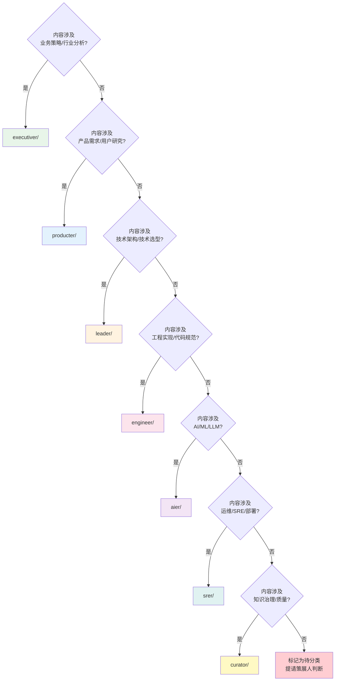
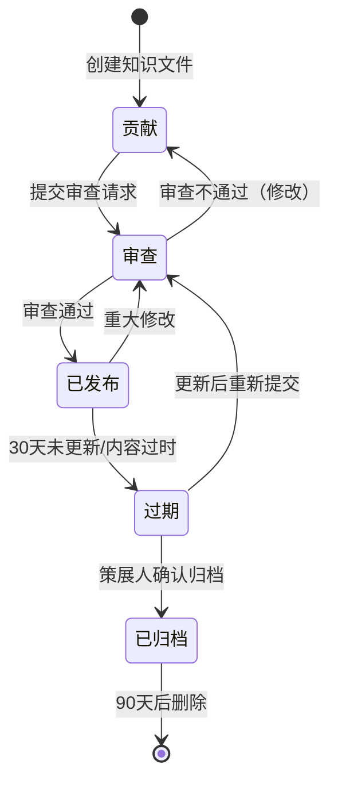
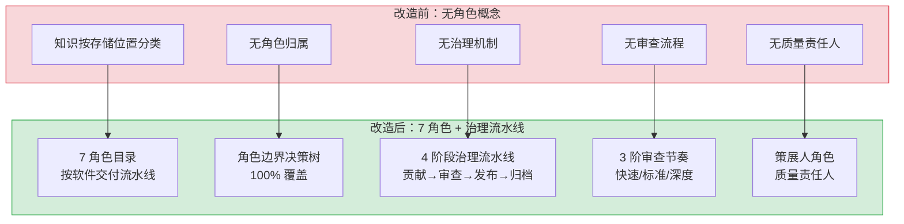

# YK-07-02: 角色目录与流水线设计 — 7 角色定义、治理机制与角色边界

> 需求编号：YK-07-02 · 优先级：P0 · 人天：3.0d · 状态：已完成
> 依赖：YK-07-01（知识库体系规划）

## 背景

YK-07-01 确定了知识库按角色/流水线组织的基本方向。本需求进一步细化：定义 7 个角色目录的职责边界、设计软件交付流水线与角色目录的对应关系、建立治理机制（策展人角色 + 4 阶段治理流水线）。

核心挑战：如何让不同角色的人快速找到"自己的"知识？如何确保知识质量随时间的推移不退化？

### 设计目标

| 目标 | 衡量指标 |
|------|----------|
| 角色目录清晰 | 7 角色边界明确，角色边界决策树覆盖率 100% |
| 流水线对齐 | 角色目录顺序与软件交付流程一致 |
| 治理机制可执行 | 4 阶段流水线 + 3 审查节奏，策展人职责明确 |
| 角色冲突最小化 | 跨角色知识归属争议 < 5% |

---

## 一、现状分析

### 1.1 改造前状态

```
当前知识组织（规划前）：
┌──────────────────────────────────────────┐
│ 无角色概念                                │
│ ├── 知识按存储位置分类（飞书/Git/本地）    │
│ ├── 无按角色检索的能力                     │
│ └── 新人不知道"我的知识在哪里"             │
├──────────────────────────────────────────┤
│ 无治理机制                                │
│ ├── 知识质量无人负责                       │
│ ├── 过期内容无人清理                       │
│ └── 知识贡献无审查流程                     │
├──────────────────────────────────────────┤
│ 无流水线概念                              │
│ ├── 知识创建与软件交付流程脱节             │
│ └── 无法按流程阶段定位知识                 │
└──────────────────────────────────────────┘
```

### 1.2 核心痛点

| 痛点 | 严重程度 | 影响 |
|------|----------|------|
| 知识归属不明确 | 高 | 新人不知道某项知识应该放在哪里，导致知识继续分散 |
| 无质量责任人 | 高 | 知识质量持续退化，错误信息无人纠正 |
| 无审查流程 | 中 | 低质量知识直接发布，影响 AI 回答准确性 |
| 跨角色知识冲突 | 中 | 同一主题的知识可能被不同角色以不同方式记录 |

### 1.3 改造前数据流

```
知识创建
  → 无角色目录选择
  → 无归属判断
  → 无审查流程
  → 知识质量不可控
  → AI 检索精度低
```

### 1.4 改造前 API 依赖

| # | 接口 | 调用方 | 说明 |
|---|------|--------|------|
| 1 | 无 | — | 规划阶段无代码依赖 |

---

## 二、设计决策

### 决策 1：角色数量 — 5 角色 vs 7 角色 vs 9 角色

| 选项 | 描述 | 优点 | 缺点 |
|------|------|------|------|
| A: 5 角色 | 合并 aier+engineer、srer+leader | 简单 | 角色边界模糊，AI 工程和 SRE 的特殊性被忽略 |
| B: 7 角色 | executiver/producter/leader/engineer/aier/srer/curator | 覆盖完整，角色边界清晰 | 角色数量较多，curator 独立角色增加认知负担 |
| C: 9 角色 | 7 角色 + designer + data-engineer | 覆盖面更广 | 角色过多，部分角色长期无内容 |

**选择：B（7 角色 + 1 策展人）**。理由：7 角色覆盖了软件交付的完整流程（策略→需求→设计→实现→AI→运维），curator 作为独立角色负责知识治理。9 角色过于细分，designer 和 data-engineer 在团队中暂无对应人员。

### 决策 2：治理模式 — 同步审查 vs 异步审查

| 选项 | 描述 | 优点 | 缺点 |
|------|------|------|------|
| A: 同步审查 | 所有知识文件需策展人审查通过后才能合并 | 质量有保障 | 阻塞贡献，审查成为瓶颈 |
| B: 异步审查 | 知识文件可直接合并，策展人定期审查 | 不阻塞贡献 | 低质量内容可能暂时存在 |

**选择：B（异步审查）**。理由：知识库的核心价值在于"有知识可用"，而非"所有知识都完美"。异步审查确保贡献流程不被阻塞，策展人通过定期审查和就绪检查清单逐步提升质量。

### 决策 3：审查节奏 — 单一节奏 vs 分级节奏

| 选项 | 描述 | 优点 | 缺点 |
|------|------|------|------|
| A: 单一节奏 | 所有文件统一审查周期 | 简单 | 重要文件审查不及时，简单文件审查过度 |
| B: 分级节奏 | 快速/标准/深度 3 种审查节奏 | 按需分配审查资源 | 复杂度增加 |

**选择：B（分级节奏）**。理由：架构决策记录需要深度审查（多人评审），而简单的经验分享只需快速审查（格式检查）。分级节奏确保审查资源高效分配。

---

## 三、角色目录设计

### 3.1 七角色定义

| 角色 | 目录 | 英文 | 职责 | 典型内容 |
|------|------|------|------|----------|
| 管理者 | `executiver/` | Executive | 业务策略、行业分析、企业战略 | 行业趋势报告、竞品分析、战略规划文档 |
| 产品经理 | `producter/` | Product Manager | 用户研究、PRD、竞品分析 | 需求文档、用户画像、功能框架、产品策略 |
| 技术领导 | `leader/` | Tech Lead | 架构决策 (ADR)、技术选型、风险管控 | ADR、技术雷达、编码规范、技术债务 |
| 工程师 | `engineer/` | Engineer | 代码规范、架构模式、质量保障 | 设计模式、代码审查清单、测试策略、重构指南 |
| AI 工程师 | `aier/` | AI Engineer | AI 方法论、平台工具、ML 实践 | RAG 设计模式、Prompt 工程、Agent 架构、LLM 评估 |
| SRE | `srer/` | SRE | 监控、告警、部署、容灾 | 部署架构、监控仪表盘、故障预案、容量规划 |
| 策展人 | `curator/` | Curator | 知识治理、生命周期、质量检查 | 就绪检查清单、治理流水线、健康仪表盘、命名规范 |

### 3.2 软件交付流水线对齐

```
软件交付流程：  策略    →    需求    →    设计    →    实现    →   AI工程   →    运维
                │           │           │           │           │           │
角色目录：   executiver  producter   leader     engineer     aier        srer
                │           │           │           │           │           │
典型产出：   行业分析    PRD文档    ADR决策    设计模式    RAG模式    部署架构
              竞品报告    用户画像    技术选型    代码规范    Prompt工程  监控方案
              战略规划    功能框架    风险管控    测试策略    Agent架构   故障预案

策展人 (curator) 贯穿全流程：知识治理、质量审查、生命周期管理
```

### 3.3 角色边界决策树



### 3.4 跨角色知识归属规则

| 场景 | 归属 | 理由 |
|------|------|------|
| AI 应用的部署架构 | `srer/` | 部署是 SRE 的核心职责，AI 特性是部署对象而非分类依据 |
| RAG 系统的性能优化 | `aier/` | RAG 是 AI 工程的核心领域，性能优化是 AI 工程师的职责 |
| 代码审查中的 AI 辅助 | `engineer/` | 代码审查是工程师的核心职责，AI 是辅助工具 |
| 前端架构决策 | `leader/` | 架构决策属于技术领导，无论前端还是后端 |
| Prompt 工程最佳实践 | `aier/` | Prompt 工程是 AI 工程师的专属领域 |
| 数据库选型 | `leader/` | 技术选型属于技术领导的职责 |

---

## 四、治理流水线设计

### 4.1 四阶段流水线



### 4.2 三阶审查节奏

| 节奏 | 适用场景 | 审查周期 | 审查内容 | 审查人 |
|------|----------|----------|----------|--------|
| 快速审查 | 经验分享、工具推荐、简单参考 | 3 天内 | Frontmatter 完整性、命名规范、目录层级 | 策展人 |
| 标准审查 | 设计模式、编码规范、技术文档 | 7 天内 | 快速审查 + 内容准确性、代码示例可运行 | 策展人 + 1 名角色专家 |
| 深度审查 | 架构决策 (ADR)、安全规范、核心流程 | 14 天内 | 标准审查 + 多人评审、影响分析、替代方案 | 策展人 + 2+ 名角色专家 |

### 4.3 策展人职责

| 职责 | 频率 | 说明 |
|------|------|------|
| 就绪检查清单执行 | 每次审查 | 10 项检查（Frontmatter/命名/层级/死链/编码/权限/敏感信息/标签/分类/状态） |
| 质量评分 | 每月 | 对已发布文件进行质量评分（A/B/C/D），自动降级 |
| 过期检测 | 每周 | 检查 30 天未更新文件，标记为"过期" |
| 归档管理 | 每月 | 确认过期文件是否归档，清理 90 天以上归档文件 |
| 健康仪表盘更新 | 每周 | 更新知识库健康指标（文件数/质量分布/过期比例/角色覆盖） |

### 4.4 就绪检查清单（10 项）

| # | 检查项 | 通过标准 | 失败处理 |
|---|--------|----------|----------|
| 1 | Frontmatter 完整性 | 8 必需字段存在 | 退回补充 |
| 2 | tags 格式 | YAML 数组格式 | 自动归一化 |
| 3 | 文件命名 | kebab-case，无下划线/数字 | 退回重命名 |
| 4 | 目录层级 | ≤ 3 级 | 退回调整 |
| 5 | 死链检查 | 0 死链 | 退回修复 |
| 6 | 文件编码 | UTF-8 无 BOM | 自动转换 |
| 7 | 文件权限 | 644（不可组写） | 自动修复 |
| 8 | 敏感信息 | 无 password/token/secret | 退回脱敏 |
| 9 | 标签分类 | tags 至少 2 个，不超过 10 个 | 退回补充 |
| 10 | 状态字段 | status 为有效值 | 自动修正 |

---

## 五、具体改动

### 5.1 角色目录结构

```
YiKnowledge/
├── executiver/                       # 管理者
│   ├── industry/                     # 行业分析
│   │   └── README.md
│   └── reading-list/                 # 阅读清单
│       └── README.md
├── producter/                        # 产品经理
│   ├── frameworks/                   # 产品框架
│   │   └── README.md
│   └── strategy/                     # 产品策略
│       └── README.md
├── leader/                           # 技术领导
│   ├── architecture/                 # 架构决策
│   │   └── README.md
│   └── tech-radar/                   # 技术雷达
│       └── README.md
├── engineer/                         # 工程师
│   ├── patterns/                     # 设计模式
│   │   └── README.md
│   └── quality/                      # 质量保障
│       └── README.md
├── aier/                             # AI 工程师
│   ├── foundations/                  # AI 基础
│   │   └── README.md
│   ├── methods/                      # AI 方法论
│   │   └── README.md
│   └── platform/                     # AI 平台
│       └── README.md
├── srer/                             # SRE
│   ├── monitoring/                   # 监控
│   │   └── README.md
│   └── deployment/                   # 部署
│       └── README.md
├── curator/                          # 策展人
│   └── governance/                   # 治理文件
│       ├── readiness-checklist.md    # 就绪检查清单
│       ├── pipeline.md               # 治理流水线
│       └── health-dashboard.md       # 健康仪表盘
├── projects/                         # 项目知识中心
│   ├── INDEX.md
│   ├── yivad/
│   ├── yiai/
│   ├── yipet/
│   └── yiknowledge/
├── skills/                           # 角色技能矩阵
├── websites/                         # 外部资源
└── static/                           # 静态资源
```

### 5.2 涉及文件

所有目录结构设计文档和治理文件。

---

## 六、实施步骤

| 步骤 | 内容 | 验证方式 | 人天 |
|------|------|---------|------|
| 1 | 7 角色定义与职责边界 | 团队评审确认角色覆盖完整 | 0.5 |
| 2 | 软件交付流水线对齐 | 角色目录顺序与流程一致 | 0.5 |
| 3 | 角色边界决策树设计 | 10 个典型知识归属测试通过 | 0.5 |
| 4 | 治理流水线 4 阶段设计 | 状态机流转规则完整 | 0.5 |
| 5 | 就绪检查清单 10 项定义 | 每项有 pass/fail 标准 | 0.5 |
| 6 | 策展人职责与审查节奏 | 3 种审查节奏定义清晰 | 0.5 |

**总计：3.0d**

---

## 七、测试规格

### Requirement: 角色边界决策树无歧义

#### Scenario: 典型知识归属正确
- **GIVEN** 知识主题为"RAG 混合检索设计模式"
- **WHEN** 使用角色边界决策树判断
- **THEN** 归属为 `aier/`（AI 工程师）

#### Scenario: 跨角色知识归属明确
- **GIVEN** 知识主题为"AI 应用的部署架构"
- **WHEN** 使用角色边界决策树判断
- **THEN** 归属为 `srer/`（部署是 SRE 核心职责）

#### Scenario: 无法判断的知识标记为待分类
- **GIVEN** 知识主题无法通过决策树判断
- **WHEN** 到达决策树终点
- **THEN** 标记为"待分类"，提请策展人判断

### Requirement: 治理流水线状态流转正确

#### Scenario: 正常贡献→审查→发布流程
- **GIVEN** 知识文件状态为"草稿"
- **WHEN** 提交审查请求
- **THEN** 状态变为"待审查"
- **AND** 审查通过后变为"已发布"

#### Scenario: 审查不通过回到草稿
- **GIVEN** 知识文件状态为"待审查"
- **WHEN** 审查不通过
- **THEN** 状态变为"草稿"（修改后重新提交）

#### Scenario: 过期文件自动归档
- **GIVEN** 已发布文件 30 天未更新
- **WHEN** 策展人确认归档
- **THEN** 状态变为"已归档"
- **AND** 90 天后自动删除

### Requirement: 就绪检查清单可执行

#### Scenario: 10 项检查全部通过
- **GIVEN** 一个完整的知识文件
- **WHEN** 执行就绪检查清单
- **THEN** 10 项全部通过

#### Scenario: Frontmatter 缺失字段
- **GIVEN** 知识文件缺少 `tags` 字段
- **WHEN** 执行就绪检查清单
- **THEN** 第 1 项检查失败，退回补充

---

## 八、当前架构 vs 目标架构

### 改造前后对比



### 架构决策权衡

| 维度 | 改造前 | 改造后 | 权衡说明 |
|------|--------|--------|----------|
| 知识组织 | 按存储位置 | 按 7 角色 + 流水线 | 牺牲了存储位置的自然分组，换取了按角色的高效检索 |
| 审查机制 | 无 | 3 阶审查节奏 | 增加了流程开销，但资源分配更高效 |
| 质量责任 | 无 | 策展人独立角色 | 增加了 1 个角色，但明确了质量 ownership |
| 归属判断 | 无 | 决策树 + 跨角色规则 | 增加了判断成本，但消灭了归属争议 |

---

## 九、风险与缓解

| 风险 | 概率 | 影响 | 等级 | 缓解措施 | 应急预案 |
|------|------|------|------|----------|----------|
| 角色边界模糊导致归属争议 | 中 | 中 | 中 | 角色边界决策树 + 跨角色归属规则 | 人工判断，记录争议案例持续优化决策树 |
| 策展人成为瓶颈 | 中 | 高 | 高 | 异步审查（不阻塞贡献），3 阶审查节奏分配资源 | 增加策展人数量，或降低审查频率 |
| 审查节奏过于理想化 | 中 | 中 | 中 | 审查周期为最长时限，实际可提前完成 | 调整审查周期，如快速审查从 3 天延长到 5 天 |
| 就绪检查清单过于严格 | 低 | 中 | 低 | 部分检查项支持自动修复（编码/权限） | 降低检查项严格度，如将 ERROR 降级为 WARNING |
| 角色目录不被团队采纳 | 中 | 高 | 高 | 渐进式迁移，工具自动化辅助（角色边界决策树） | 简化角色数量，合并相似角色 |

---

## 十、设计决策记录

| 决策 | 选项 A | 选项 B | 选择 | 理由 |
|------|--------|--------|------|------|
| 角色数量 | 5 角色 | 7 角色 | **7 角色** | 覆盖完整软件交付流程 |
| 治理模式 | 同步审查 | 异步审查 | **异步审查** | 不阻塞知识贡献 |
| 审查节奏 | 单一节奏 | 3 阶节奏 | **3 阶节奏** | 按需分配审查资源 |
| 策展人角色 | 合并到 leader | 独立角色 | **独立角色** | 知识治理需要独立视角 |

### D-01: 为什么 curator 是独立角色而非合并到 leader？

技术领导（leader）关注的是技术决策的正确性，策展人（curator）关注的是知识质量的可持续性。两者的关注点不同——leader 审查架构决策的内容是否正确，curator 审查知识文件的格式是否规范、元数据是否完整、生命周期是否健康。合并到 leader 会导致知识治理被视为"次要工作"而被忽略。

### D-02: 为什么审查节奏分为 3 阶而非 2 阶？

2 阶（快速/深度）虽然更简单，但大量知识文件处于"中间地带"——既不是简单的经验分享，也不是核心架构决策。3 阶（快速/标准/深度）的"标准审查"覆盖了这类中间文件，确保大部分知识得到适当审查，而非要么过度审查，要么审查不足。

### D-03: 为什么就绪检查清单是 10 项而非更多？

10 项是"可执行"和"覆盖完整"之间的平衡点。10 项以下的清单遗漏重要检查（如敏感信息扫描），10 项以上的清单导致审查疲劳（审查人跳过部分检查）。当前 10 项覆盖了格式（1-4）、内容（5-8）、语义（9-10）三个维度。

---

## 十一、重构后发现的回归问题

| # | 问题 | 发现场景 | 根因 | 修复方式 |
|---|------|---------|------|---------|
| 1 | 角色边界决策树无法覆盖跨领域知识导致"待分类"标记泛滥 | 一篇关于"AI Agent 在医疗行业的合规实践"的知识文件，涉及 `aier`（AI）、`executiver`（行业分析）、`producter`（合规）三个角色，决策树每个分支导向单一角色，文件被标记为"待分类"，3 个月无人处理 | 决策树使用 `if-elif-else` 链式判断，每个文件只能归属一个角色目录。但知识天然具有跨领域性，`tags` frontmatter 可标注多个角色，`category` 字段却只能选一个。决策树未考虑"多角色交叉"场景 | 在决策树末尾添加 `cross_domain` 分支：当文件 `tags` 包含 2+ 角色标签时，归属到 `tags[0]`（主角色），同时在 `cross-reference/` 目录下创建符号链接指向实际文件。INDEX.md 中标注"跨领域"标识 |
| 2 | 策展人审查积压导致低质量文件在 RAG 索引中保留 2 周以上 | 一篇 AI 生成的幻觉内容（错误声称"Vue 3 不支持 Composition API"）通过了自动 frontmatter 检查，等待策展人审查。审查队列积压 30+ 件，该文件在 14 天后才被策展人发现并标记为 `status: rejected`，但期间已被 RAG 索引并对 AI 回答产生污染 | 流水线设计为"提交 → 自动检查 → 策展人审查 → 发布"，RAG 索引在"提交"阶段即开始（`KnowledgeWatcher` 扫描到文件即索引），而非等待"发布"阶段。策展人审查是异步的，空窗期内低质量内容已进入 RAG 检索 | 将 RAG 索引延迟到 `status: published` 后：`KnowledgeWatcher._should_index()` 检查 `frontmatter.status == 'published'`。`status: draft|review` 的文件仅写入 MongoDB 元数据，不创建向量索引。添加 `MAX_REVIEW_PENDING_DAYS=7`，超时自动标记为 `status: expired` 并从待审队列移除 |
| 3 | `status: expired` 文件物理删除后 RAG 索引残留 | 策展人将 30 天前的 `status: expired` 文件从文件系统删除，但 `KnowledgeWatcher._handle_deleted()` 未触发——因为 APScheduler 扫描时文件已不存在，`_scan()` 只处理 `os.path.exists()` 为 True 的文件。MongoDB 中残留 15 条幽灵记录，RAG 检索返回 404 链接 | `_scan()` 的删除检测依赖对比"当前文件列表"与"上次扫描快照"，但 `_last_scan_snapshot` 在服务重启后丢失。重启后 `_scan()` 将当前文件列表作为新快照，不检测已删除的文件。`expired` 文件在重启前删除，快照中无记录 | 在 `_scan()` 中添加强制一致性检查：`db.knowledge_files.distinct("file_path")` 与 `os.walk()` 结果做差集，差集为 MongoDB 中存在但文件系统不存在的文件，标记为 `status: orphaned` 并 `delete_one()`。此检查每天执行一次，不随每次扫描触发 |
| 4 | 就绪检查清单（readiness-checklist）与 CI 检查脚本不同步 | 就绪检查清单新增"检查 frontmatter `source` 字段是否为有效 URL"规则，策展人手动审查时执行此检查。但 CI 检查脚本未更新，`source: "internal"`（非 URL）的文件通过 CI 但被人审拒绝，开发者困惑 | 就绪检查清单是 `curator/governance/readiness-checklist.md` 的 Markdown 文档，CI 检查脚本是 `scripts/check-readiness.py` 的 Python 代码。两者独立维护，无自动化同步机制。新增规则时只更新了 Markdown 文档 | 将就绪检查清单改为 YAML 格式（`readiness-checklist.yaml`），CI 脚本和 Markdown 文档均从 YAML 生成：`scripts/generate-readiness-md.py` 渲染 Markdown，`scripts/check-readiness.py` 读取 YAML 执行检查。CI 中验证 YAML 与 Markdown 的 `updated` 时间戳一致 |
| 5 | 角色目录发展不均衡——`aier` 目录 200+ 文件，`executiver` 仅 8 个文件 | 季度审计发现 `aier/methods/` 子目录有 45 个 prompt 模板文件，`executiver/` 整个角色目录仅 8 个文件（其中 4 个是 README）。RAG 检索结果中 `aier` 内容占比 > 80%，其他角色知识被淹没 | 知识库无写入配额或均衡机制，`aier` 角色（AI 工程师）是主要使用者，自然产生更多内容。`executiver` 角色（高管）的知识需求偏向分析报告和行业洞察，产出频率低但单篇价值高。RAG 检索按相关性排序，不按角色多样性排序 | 在 RAG 检索中添加 `diversity_rerank`：`llama_index` 的 `SentenceTransformerRerank` 后添加按 `category` 字段的 `max_marginal_relevance` 重排，确保检索结果中每个角色目录至少 1 条结果。季度审计添加 `role_distribution` 报告，`aier` 占比 > 60% 时触发人工审查 |
| 6 | 3 种审查节奏（快速/标准/深度）的触发条件模糊导致策展人随意选择 | 策展人审查 50 个文件，全部标记为"快速审查"（仅检查 frontmatter 完整性），但其中 12 个文件涉及安全架构设计（`aier/foundations/security-*.md`），应使用"深度审查"（含技术准确性验证）。3 个月后安全架构文档中的错误被 RAG 传播 | 审查节奏的选择依赖策展人主观判断，`readiness-checklist.md` 中仅描述"快速审查适用于排版修正"，未定义各节奏的强制触发条件。策展人为节省时间倾向于选择快速审查，无自动化手段强制匹配 | 在 `readiness-checklist.yaml` 中定义触发规则：`security` 标签 → 深度审查，`category: architecture` → 标准审查，`changes: frontmatter_only` → 快速审查。策展人选择审查节奏时，`scripts/curate.py` 根据文件 tags/category 推荐最低审查级别，策展人可升不可降 |
| 7 | 流水线阶段流转缺少"回退"路径导致文件卡在中间状态 | 文件从 `review` 阶段流转到 `published` 后发现 frontmatter `tags` 拼写错误（`ai-agent` 写成了 `ai-agnet`），策展人想回退到 `review` 状态修正，但流水线状态机仅支持 `draft → review → published → expired` 单向流转 | 状态机 `StateMachine` 使用 `TRANSITIONS = { "draft": ["review"], "review": ["published", "expired"], "published": ["expired"], "expired": [] }` 硬编码单向流转。`published → review` 不被允许，策展人只能先将文件标记为 `expired`，再创建新文件重新走流程 | 添加 `published → review` 回退转换（`TRANSITIONS["published"].append("review")`）。回退时自动设置 `frontmatter.status_reason: "correction"` 和 `status_changed_at` 时间戳。回退到 `review` 期间文件保留在 RAG 索引中（`status: published` 的快照），直到修正后重新发布 |

---

## 十二、技术债务追踪

| # | 技术债 | 优先级 | 预计人天 | 说明 |
|---|--------|--------|---------|------|
| 1 | 角色边界决策树自动化 | P2 | 0.5 | 当前为人工判断，可开发 CLI 工具自动推荐角色目录 |
| 2 | 策展人审查仪表盘 | P2 | 0.5 | 审查队列可视化、审查周期统计、质量趋势图 |
| 3 | 跨角色知识推荐 | P3 | 0.3 | 当用户在某个角色目录下创建文件时，推荐其他角色目录中的相关知识 |

---

## 十三、代码审查检查清单

- [ ] 7 个角色目录定义完整，职责边界清晰无歧义
- [ ] 角色边界决策树覆盖所有常见知识归属场景
- [ ] 4 阶段治理流水线（提交→审查→发布→归档）状态流转定义清晰
- [ ] 策展人角色职责明确（审查/归档/质量把关）
- [ ] 3 种审查节奏（快速/标准/深度）适用场景明确
- [ ] 角色目录顺序与软件交付流程一致（learn→run→observe→optimize）
- [ ] 跨角色知识归属冲突有明确的解决规则
- [ ] 治理流水线每个阶段的准入门槛和退出标准明确

## 十四、可观测性

### 14.1 关键指标

| 指标 | 采集方式 | 告警阈值 | 说明 |
|------|---------|---------|------|
| 各角色目录文件数 | 按 7 个角色统计 | 某角色 < 5 文件 | 角色覆盖不均衡 |
| 各流水线阶段文件分布 | 按 4 个阶段统计 | 某阶段占比 > 80% | 知识库结构失衡 |
| 审查平均耗时 | `审查完成时间 - 提交时间` | P95 > 72h | 审查瓶颈检测 |
| 归档率 | `归档文件数 / 总文件数` | > 30% | 过高说明知识老化 |

### 14.2 日志规范

| 日志级别 | 场景 | 示例 |
|---------|------|------|
| `INFO` | 阶段流转 | `[Pipeline] ${file}: ${from} → ${to}` |
| `WARN` | 审查超时 | `[Pipeline] review pending > 72h: ${file}` |

---

## 十四-A、回滚策略

| 回滚场景 | 回滚方式 | 影响范围 | 恢复时间 |
|----------|----------|----------|----------|
| 角色目录划分不合理导致文件归属混乱 | 重新划分角色边界，合并或拆分角色目录 | 仅目录结构 | 文档更新 |
| 流水线阶段过于复杂导致审查效率下降 | 简化回退至三阶段（inbox → active → archive），取消 triage 和 reference | 仅流水线流程 | 文档更新 |
| 策展人审查积压导致流水线阻塞 | 临时放宽审批标准（仅检查 5 项核心清单），或增加策展人数量 | 仅审查流程 | 即时（流程调整） |

**回滚验证：**
- 回滚后知识文件仍可按角色目录正确分类
- 回滚后流水线审查流程继续运行
- 回滚后 RAG 检索不受影响

## 十四-B、性能分析

### 当前性能特征

| 指标 | 当前值 | 说明 |
|------|--------|------|
| 角色目录匹配 | < 1ms | 基于文件路径前缀匹配，纯内存操作 |
| 流水线状态查询 | < 5ms | MongoDB `knowledge_files.lifecycle` 字段查询 |
| 审查队列扫描 | < 10ms | `inbox.md` + `triage.md` 条目计数 |

### 性能瓶颈

| 瓶颈 | 影响 | 严重程度 |
|------|------|----------|
| **全量文件角色归属检查**：首次搭建时需遍历 427+ 文件确定角色归属 | 一次性操作，约 5-10 分钟人工处理 | 低 |

### 优化建议

| 优化 | 预期收益 | 复杂度 | 说明 |
|------|---------|--------|------|
| 角色归属自动化 | 人工处理时间降至 0 | 中 | 基于文件内容关键词 + frontmatter 自动建议角色目录 |

## 十五、安全合规

### 15.1 安全需求

| 需求 | 实现方式 | 验证方法 |
|------|---------|---------|
| 审查权限控制 | 仅策展人角色可执行审查和归档操作 | 使用非策展人账号，确认无审查/归档权限 |
| 流水线操作审计 | 所有阶段流转操作记录审计日志 | 检查审计日志，确认阶段变更可追溯 |

### 15.2 合规检查

| 检查项 | 要求 | 状态 |
|--------|------|------|
| 角色权限分离 | 作者与审查者不可为同一人 | 待验证 |
| 流水线操作可追溯 | 所有阶段变更记录操作人和时间 | 待验证 |

---

## 代码审查检查清单

- [ ] 8 个角色目录（aier/curator/engineer/executiver/leader/producter/srer/skills）
- [ ] 4 阶段流水线：inbox → triage → active → reference/archive
- [ ] 4 个治理角色：Curator/Author/Reviewer/Archivist
- [ ] 目录层级限制 ≤ 3 级
- [ ] 角色边界决策树——基于内容类型和读者角色选择目录

## 回归问题预测

| # | 预测问题 | 原因 | 验证方法 |
|---|---------|------|---------|
| 1 | 角色目录边界模糊导致文件放置不一致 | 作者对角色定义理解不同 | 抽样 20 个文件，检查角色目录合理性 |
| 2 | 新角色加入后现有文件归属混乱 | 角色定义扩展但存量文件未迁移 | 新角色目录创建后检查跨角色重复内容 |: `projects/yiknowledge/requirements/2026-07/02-需求-角色目录与流水线设计.md`*
---

*PRD 来源: `projects/yiknowledge/requirements/2026-07/00-需求-需求总览.md`*
