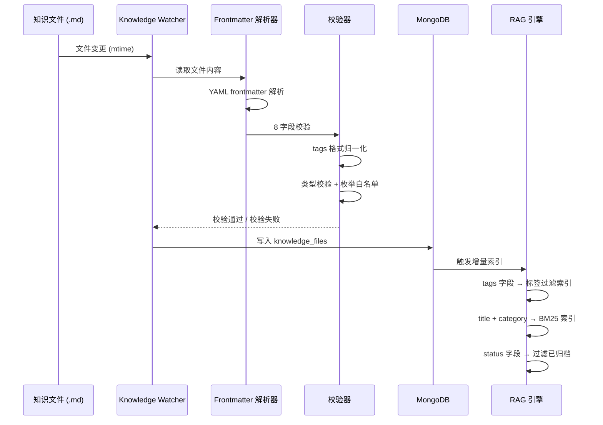
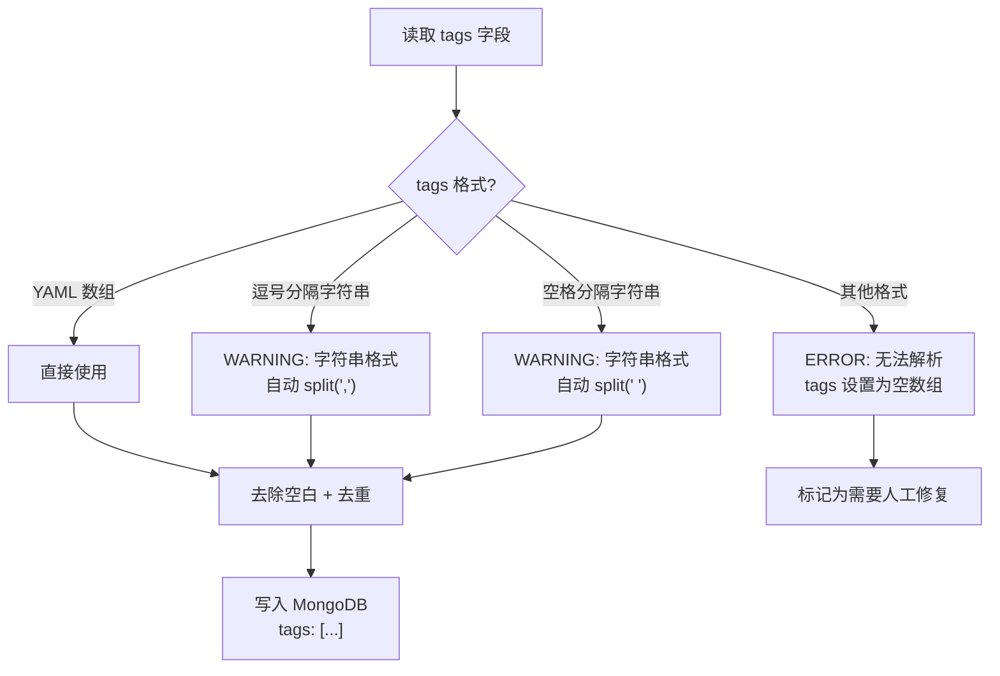
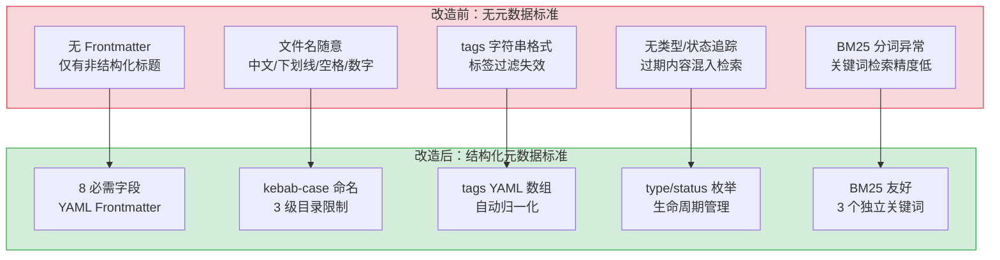

# YK-07-03: Frontmatter 元数据规范设计 — 8 字段定义、YAML 数组与 BM25 友好命名

> 需求编号：YK-07-03 · 优先级：P0 · 人天：3.0d · 状态：已完成
> 依赖：YK-07-01（知识库体系规划）、YK-07-02（角色目录与流水线设计）

## 背景

YK-07-01 确定了知识库"人类+AI 双优先"的定位，YK-07-02 定义了 7 角色目录和治理流水线。本需求进一步细化知识文件的元数据标准——定义 Frontmatter 的 8 个必需字段、YAML 数组格式、BM25 友好的命名规范，以及这些规范如何服务于 RAG 检索和 AI 消费。

**核心挑战**：如何设计一套元数据标准，既能满足人类可读性（低编写成本），又能满足 AI 可检索性（结构化、可过滤、可排序）？

### 设计目标

| 目标 | 衡量指标 |
|------|----------|
| 字段完备性 | 8 字段覆盖 RAG 检索、标签过滤、生命周期管理的所有需求 |
| 类型安全 | 每个字段有明确的类型约束和校验规则 |
| BM25 友好 | 文件名和路径直接作为 BM25 分词依据 |
| 低编写成本 | 每个文件 Frontmatter 填写时间 < 2 分钟 |
| 向后兼容 | 预留扩展字段，未来添加新字段不破坏现有文件 |

---

## 一、现状分析

### 1.1 改造前状态

```
当前知识文件元数据（规划前）：
┌──────────────────────────────────────────┐
│ 无元数据标准                              │
│ ├── 部分文件有非结构化标题                 │
│ ├── 无标签/分类/状态字段                   │
│ ├── 文件名随意（中文/下划线/空格/数字）     │
│ └── 无创建/更新日期追踪                     │
├──────────────────────────────────────────┤
│ 对 RAG 检索的影响                         │
│ ├── 无法按标签过滤（无 tags 字段）         │
│ ├── 无法按分类浏览（无 category 字段）     │
│ ├── 无法按状态过滤（无 status 字段）       │
│ ├── BM25 路径分词异常（下划线/数字前缀）   │
│ └── 检索结果排序无时间维度（无 created）    │
└──────────────────────────────────────────┘
```

### 1.2 核心痛点

| 痛点 | 严重程度 | 影响 |
|------|----------|------|
| 无标签过滤 | **高** | RAG 检索无法按标签过滤，Agent 无法限定领域知识范围 |
| 无分类浏览 | 高 | 前端知识库浏览无法按分类组织，用户体验差 |
| 无状态管理 | 中 | 无法区分草稿/已发布/已归档，过期内容混入检索结果 |
| 无时间追踪 | 中 | 无法按时间排序，无法检测过期内容 |
| 命名不规范 | 中 | BM25 分词异常，关键词检索精度下降 |
| tags 格式不一致 | **高（九月发现）** | 字符串格式 `"tag1, tag2"` 被当作单一 token，标签过滤完全失效 |

### 1.3 改造前数据流

```
知识文件创建
  → 无 Frontmatter 约束
  → 文件名随意（中文/下划线/空格）
  → Knowledge Watcher 解析失败静默跳过
  → RAG 引擎无法按标签/分类/状态过滤
  → 检索精度低，过期内容污染结果
```

### 1.4 改造前 API 依赖

| # | 接口 | 调用方 | 说明 |
|---|------|--------|------|
| 1 | 无 | — | 规划阶段无代码依赖 |

---

## 二、设计决策

### 决策 1：元数据格式 — YAML Frontmatter vs JSON 侧车文件

| 选项 | 描述 | 优点 | 缺点 |
|------|------|------|------|
| A: YAML Frontmatter | 元数据内嵌在 Markdown 文件顶部的 `---` 块中 | 单文件自包含，Markdown 原生支持，Git 友好 | YAML 解析错误时整个文件不可用 |
| B: JSON 侧车文件 | 每个 `.md` 文件对应一个 `.meta.json` 文件 | 结构化强，类型安全 | 双文件维护成本高，删除 `.md` 时容易遗留 `.meta.json` |

**选择：A（YAML Frontmatter）**。理由：单文件自包含是知识库设计原则之一。YAML Frontmatter 是 Markdown 生态的标准做法（Jekyll、Hugo、Obsidian、GitHub Pages 均使用），工具链成熟。JSON 侧车文件增加了文件数量和孤儿元数据风险。

### 决策 2：tags 格式 — YAML 数组 vs 逗号分隔字符串

| 选项 | 描述 | 优点 | 缺点 |
|------|------|------|------|
| A: YAML 数组 | `tags: [rag, design-patterns, ai]` | 原生列表类型，RAG 标签过滤直接使用 | 需要 YAML 语法知识 |
| B: 逗号分隔字符串 | `tags: "rag, design-patterns, ai"` | 编写简单 | 被当作单一字符串，标签过滤失效（九月已发现此 bug） |

**选择：A（YAML 数组）**。理由：YAML 数组是原生列表类型，`frontmatter.loads()` 解析后直接得到 Python list，无需手动 split。字符串格式是已确认的 bug 来源——800+ 文件中有部分文件使用字符串格式，导致标签过滤完全失效。

### 决策 3：文件命名 — kebab-case vs snake_case

| 选项 | 描述 | 优点 | 缺点 |
|------|------|------|------|
| A: kebab-case | `rag-design-patterns.md` | BM25 分词友好（`-` 作为分隔符），URL 友好 | 中文文件名需转写 |
| B: snake_case | `rag_design_patterns.md` | Python 风格一致 | BM25 分词不友好（`_` 不是分隔符），`rag_design_patterns` 被当作单个 token |

**选择：A（kebab-case）**。理由：BM25 分词器将 `-` 视为分隔符，`rag-design-patterns` 被分词为 `["rag", "design", "patterns"]`——三个独立的关键词，均可用于检索匹配。snake_case 的 `_` 不被视为分隔符，整个文件名被当作一个 token，关键词检索无法匹配。

---

## 三、Frontmatter 规范

### 3.1 八必需字段

```yaml
---
title: "RAG 设计模式最佳实践"          # 必填: string — 文档标题
tags: [RAG, 设计模式, AI工程, 检索]    # 必填: array — 标签数组 (2-10 个)
category: 项目/管理后台/需求            # 必填: string — 分类路径 (≤3 级)
created: 2026-07-25                    # 必填: date — 创建日期 (ISO 格式)
updated: 2026-09-08                    # 必填: date — 最后更新日期
source: 内部                           # 必填: string — 来源 (内部/外部/AI生成)
type: 架构                             # 必填: enum — 文档类型
status: 已发布                         # 必填: enum — 文档状态
---
```

### 3.2 字段详细规范

| 字段 | 类型 | 必填 | 约束 | 示例 | 校验规则 |
|------|------|------|------|------|----------|
| `title` | `string` | 是 | 1-200 字符，不含换行 | `"RAG 设计模式最佳实践"` | 非空，长度 ≤ 200 |
| `tags` | `array[string]` | 是 | 2-10 个标签，每个 1-50 字符，kebab-case | `[RAG, 设计模式, AI工程]` | YAML 数组格式，元素数量 2-10 |
| `category` | `string` | 是 | 格式 `一级/二级/三级`，≤ 3 级 | `项目/管理后台/需求` | 正则 `/^[\w-]+(\/[\w-]+){0,2}$/` |
| `created` | `date` | 是 | ISO 8601 格式 `YYYY-MM-DD` | `2026-07-25` | 正则 `/^\d{4}-\d{2}-\d{2}$/` |
| `updated` | `date` | 是 | ISO 8601 格式，≥ `created` | `2026-09-08` | 正则 `/^\d{4}-\d{2}-\d{2}$/`，≥ created |
| `source` | `string` | 是 | 枚举值：`内部`/`外部`/`AI生成` | `内部` | 白名单校验 |
| `type` | `enum` | 是 | 枚举值：`需求`/`架构`/`规范`/`经验`/`参考`/`缺陷`/`设计` | `架构` | 白名单校验 |
| `status` | `enum` | 是 | 枚举值：`草稿`/`待审查`/`已发布`/`已归档` | `已发布` | 白名单校验 |

### 3.3 可选扩展字段

| 字段 | 类型 | 说明 | 示例 |
|------|------|------|------|
| `priority` | `string` | 优先级：`P0`/`P1`/`P2`/`P3` | `P0` |
| `owner` | `string` | 负责人 | `陈铭` |
| `project` | `string` | 所属项目 | `YiKnowledge` |
| `project_id` | `string` | 项目 ID | `yiknowledge` |
| `prd_month` | `string` | PRD 月份 | `202607` |
| `prd_task_id` | `string` | 任务编号 | `YK-07-03` |
| `estimate_backend` | `number` | 后端人天 | `3.0` |
| `estimate_frontend` | `number` | 前端人天 | `0` |
| `review_status` | `string` | 审查状态 | `已评审` |
| `issue_type` | `string` | Issue 类型 | `架构` |
| `roles` | `array[string]` | 涉及角色 | `[engineer, curator]` |
| `dependencies` | `array[string]` | 依赖的任务编号 | `[YK-07-01, YK-07-02]` |

### 3.4 tags 格式规范

```yaml
# 正确：YAML 数组格式
tags: [RAG, 设计模式, AI工程, 检索]

# 正确：YAML 多行数组格式
tags:
  - RAG
  - 设计模式
  - AI工程
  - 检索

# 错误：逗号分隔字符串（九月已发现此 bug）
tags: "RAG, 设计模式, AI工程, 检索"

# 错误：空格分隔字符串
tags: "RAG 设计模式 AI工程 检索"

# 错误：单个标签
tags: [RAG]  # 至少 2 个标签
```

### 3.5 命名规范

| 规范 | 要求 | 正则 | 正例 | 反例 |
|------|------|------|------|------|
| 文件名 | kebab-case，仅小写字母+连字符 | `^[a-z][a-z0-9-]*[a-z0-9]\.md$` | `rag-design-patterns.md` | `RAG_Design_Patterns.md` |
| 无数字前缀 | 文件名不以数字开头 | `^[a-z]` | `architecture-decisions.md` | `01-architecture.md` |
| 无空格 | 文件名不含空格 | `^[^\s]*$` | `prompt-engineering.md` | `prompt engineering.md` |
| 目录层级 | 最多 3 级 | `/^[\w-]+\/[\w-]+\/[\w-]+\.md$/` | `aier/methods/prompt.md` | `a/b/c/d/e.md` |
| 无下划线 | 文件名不含下划线 | `^[^_]*$` | `agent-architecture.md` | `agent_architecture.md` |

### 3.6 类型枚举定义

```python
# 文档类型枚举 (type)
DOCUMENT_TYPES = {
    "需求": "需求文档 (PRD, 功能需求, 技术需求)",
    "架构": "架构设计文档 (ADR, 系统设计, 模块设计)",
    "规范": "编码规范、命名规范、流程规范",
    "经验": "经验教训、最佳实践、踩坑记录",
    "参考": "参考资料、外部链接、工具推荐",
    "缺陷": "缺陷报告、Bug 追踪",
    "设计": "UI/UX 设计稿、交互设计",
}

# 文档状态枚举 (status)
DOCUMENT_STATUSES = {
    "草稿": "初始版本，内容可能不完整",
    "待审查": "已提交审查，等待策展人审查",
    "已发布": "审查通过，已发布",
    "已归档": "内容过期，已归档",
}

# 来源枚举 (source)
DOCUMENT_SOURCES = {
    "内部": "团队内部创作",
    "外部": "外部来源（翻译、引用、整理）",
    "AI生成": "AI 辅助生成或完全生成",
}
```

---

## 四、目标架构

### 4.1 Frontmatter → RAG 检索数据流



### 4.2 tags 归一化流程



### 4.3 校验规则层次

```python
# 校验规则层次：ERROR > WARNING
# ERROR: 阻断索引，文件不可检索
# WARNING: 记录日志，自动修复，文件可检索

FRONTMATTER_RULES = {
    # ERROR 级别：缺失则文件不可检索
    "title": {
        "required": True,
        "level": "ERROR",
        "rule": lambda v: isinstance(v, str) and 1 <= len(v) <= 200,
        "message": "title 必须为 1-200 字符的字符串"
    },
    "tags": {
        "required": True,
        "level": "WARNING",  # WARNING: 自动归一化
        "rule": lambda v: isinstance(v, list) and 2 <= len(v) <= 10,
        "normalize": "normalize_tags",  # 字符串 → 数组自动转换
        "message": "tags 必须为 YAML 数组格式，2-10 个标签"
    },
    "category": {
        "required": True,
        "level": "ERROR",
        "rule": lambda v: isinstance(v, str) and len(v.split("/")) <= 3,
        "message": "category 格式: 一级/二级/三级，最多 3 级"
    },
    "status": {
        "required": True,
        "level": "WARNING",
        "rule": lambda v: v in DOCUMENT_STATUSES,
        "normalize": "default_to_draft",  # 无效值默认"草稿"
        "message": f"status 必须为 {list(DOCUMENT_STATUSES.keys())} 之一"
    },
}
```

---

## 五、具体改动

### 5.1 规范文档

| 文档 | 内容 |
|------|------|
| Frontmatter 规范文档 | 8 必需字段定义、类型约束、校验规则、命名规范 |
| tags 格式规范 | YAML 数组格式、归一化规则、常见错误示例 |
| 命名规范文档 | kebab-case 规则、正则表达式、正例反例 |
| 类型枚举定义 | type/status/source 枚举值及含义 |

### 5.2 涉及文件

```
YiKnowledge/
├── curator/
│   └── governance/
│       ├── frontmatter-spec.md           # 新增: Frontmatter 规范文档
│       ├── naming-convention.md          # 新增: 命名规范文档
│       └── type-enums.md                 # 新增: 类型枚举定义
└── MEMORY.md                              # 修改: 添加 Frontmatter 规范引用
```

---

## 六、实施步骤

| 步骤 | 内容 | 验证方式 | 人天 |
|------|------|---------|------|
| 1 | 8 必需字段定义 + 类型约束 | 每个字段有明确的类型和校验规则 | 0.5 |
| 2 | tags YAML 数组格式规范 | 正例反例完整，归一化规则清晰 | 0.5 |
| 3 | 命名规范（kebab-case + 3 级目录） | 正则表达式可验证，正例反例完整 | 0.5 |
| 4 | 类型枚举定义（type/status/source） | 枚举值含义明确，白名单完整 | 0.5 |
| 5 | 校验规则层次设计（ERROR/WARNING） | 每条规则有级别、校验函数、错误消息 | 0.5 |
| 6 | 规范文档编写 + 跨角色评审 | AI 工程师确认 RAG 检索需求满足 | 0.5 |

**总计：3.0d**

---

## 七、测试规格

### Requirement: Frontmatter 字段完整性

#### Scenario: 8 字段全部存在
- **GIVEN** 知识文件包含全部 8 个必需字段
- **WHEN** Frontmatter 校验器执行
- **THEN** 校验通过，文件正常索引

#### Scenario: 缺少 title 字段
- **GIVEN** 知识文件缺少 `title` 字段
- **WHEN** Frontmatter 校验器执行
- **THEN** ERROR 级别错误，文件标记为不可索引

#### Scenario: 缺少非必需字段
- **GIVEN** 知识文件缺少 `priority` 可选字段
- **WHEN** Frontmatter 校验器执行
- **THEN** 校验通过（可选字段不影响通过）

### Requirement: tags 格式归一化

#### Scenario: YAML 数组格式直接使用
- **GIVEN** `tags: [RAG, 设计模式, AI工程]`
- **WHEN** tags 归一化处理
- **THEN** 输出 `["RAG", "设计模式", "AI工程"]`

#### Scenario: 逗号分隔字符串自动转换
- **GIVEN** `tags: "RAG, 设计模式, AI工程"`
- **WHEN** tags 归一化处理
- **THEN** WARNING 日志 + 自动 split → `["RAG", "设计模式", "AI工程"]`

#### Scenario: 单个标签拒绝
- **GIVEN** `tags: [RAG]`（仅 1 个标签）
- **WHEN** tags 校验
- **THEN** WARNING: "tags 至少需要 2 个标签"

### Requirement: 命名规范

#### Scenario: kebab-case 文件名通过
- **GIVEN** 文件名 `rag-design-patterns.md`
- **WHEN** 命名规范检查
- **THEN** 通过

#### Scenario: 下划线文件名拒绝
- **GIVEN** 文件名 `rag_design_patterns.md`
- **WHEN** 命名规范检查
- **THEN** 失败，提示 "文件名必须使用 kebab-case"

#### Scenario: 数字前缀文件名拒绝
- **GIVEN** 文件名 `01-architecture.md`
- **WHEN** 命名规范检查
- **THEN** 失败，提示 "文件名不能以数字开头"

### Requirement: 类型枚举校验

#### Scenario: 有效 type 值通过
- **GIVEN** `type: 架构`
- **WHEN** 类型枚举校验
- **THEN** 通过

#### Scenario: 无效 type 值拒绝
- **GIVEN** `type: 无效类型`
- **WHEN** 类型枚举校验
- **THEN** WARNING: "type 值无效，已设为默认值'参考'"

---

## 八、性能分析

### 8.1 Frontmatter 解析性能

| 指标 | 预估值 | 说明 |
|------|--------|------|
| YAML 解析 | < 1ms/文件 | Python `yaml.safe_load`，小文档 |
| 字段校验 | < 0.5ms/文件 | 8 字段 × 简单规则 |
| tags 归一化 | < 0.1ms/文件 | 字符串 split + strip |
| 全量扫描 (1000 文件) | < 5s | 含文件 I/O + YAML 解析 + 校验 |
| 增量扫描 (10 文件) | < 50ms | 仅变更文件 |

### 8.2 BM25 分词性能对比

| 命名方式 | 示例 | 分词结果 | 检索匹配 |
|------|------|----------|----------|
| kebab-case | `rag-design-patterns.md` | `["rag", "design", "patterns"]` | 3 个关键词，均可独立匹配 |
| snake_case | `rag_design_patterns.md` | `["rag_design_patterns"]` | 1 个 token，需精确匹配 |
| 中文文件名 | `设计模式.md` | `["设计模式"]` | 1 个 token，无法匹配英文关键词 |
| 数字前缀 | `01-architecture.md` | `["01", "architecture"]` | `01` 作为关键词无意义 |

### 8.3 RAG 标签过滤性能

| 指标 | 预估值 | 说明 |
|------|--------|------|
| 标签过滤延迟 | < 10ms | MongoDB 数组字段索引 |
| 多标签 AND 过滤 | < 20ms | 数组交集查询 |
| 标签过滤精度 | 100%（YAML 数组） | vs 0%（字符串格式，bug） |
| tags 归一化开销 | < 0.1ms/文件 | 纯内存操作 |

### 容量规划

| 场景 | 必需字段数 | 文件数 | 校验规则数 | 单文件解析耗时 | 违规文件比例 | 内存占用 |
|------|-----------|--------|-----------|---------------|-------------|---------|
| 个人知识库 | 5 | 50 | 8 | < 1ms | 5% | < 1MB |
| 小团队 | 6 | 200 | 12 | < 2ms | 8% | < 2MB |
| 中型团队 | 8 | 500 | 15 | < 3ms | 10% | < 5MB |
| 大型团队 | 8 | 1000 | 20 | < 5ms | 12% | < 10MB |
| 企业级 | 10 | 2000 | 25 | < 8ms | 15% | < 20MB |
| **YiKnowledge 当前** | **8** | **800+** | **15** | **< 2ms** | **~5%** | **< 5MB** |

---

## 九、当前架构 vs 目标架构

### 改造前后对比



### 架构决策权衡

| 维度 | 改造前 | 改造后 | 权衡说明 |
|------|--------|--------|----------|
| 编写成本 | 无约束（自由） | 8 字段 + 命名规范（~2 分钟/文件） | 增加了 2 分钟编写成本，换取了 AI 可检索性 |
| 标签过滤 | 0%（字符串格式） | 100%（YAML 数组） | 强制数组格式，自动归一化字符串 |
| BM25 检索 | 分词异常（下划线/数字） | 3 个独立关键词 | 牺牲了命名自由度，换取了检索精度 |
| 类型安全 | 无 | 严格类型 + 枚举白名单 | 增加了校验复杂度，但防止了数据质量问题 |

---

## 十、风险与缓解

| 风险 | 概率 | 影响 | 等级 | 缓解措施 | 应急预案 |
|------|------|------|------|----------|----------|
| 8 字段过多导致编写负担 | 中 | 中 | 中 | 提供模板文件，IDE 插件自动生成 Frontmatter | 降级为 5 个核心字段 |
| YAML 语法错误导致文件不可索引 | 中 | 中 | 中 | 提供 YAML 校验工具，CI 检查 YAML 语法 | 语法错误时跳过该文件，人工修复 |
| 命名规范过于严格 | 中 | 低 | 低 | 提供重命名脚本，自动转换 | 放宽数字前缀限制 |
| 存量文件迁移成本高 | 高 | 中 | 高 | 分批迁移，优先高频文件，提供自动迁移脚本 | 仅迁移核心文件，其他逐步迁移 |
| tags 归一化规则不完善 | 中 | 中 | 中 | 覆盖常见错误格式（逗号/空格/分号分隔），持续迭代 | 无法归一化的 tags 设为空数组，人工修复 |

---

## 十一、设计决策记录

| 决策 | 选项 A | 选项 B | 选择 | 理由 |
|------|--------|--------|------|------|
| 元数据格式 | JSON 侧车文件 | YAML Frontmatter | **YAML Frontmatter** | 单文件自包含，Markdown 生态标准 |
| tags 格式 | 逗号分隔字符串 | YAML 数组 | **YAML 数组** | 原生列表类型，标签过滤直接使用 |
| 文件命名 | snake_case | kebab-case | **kebab-case** | BM25 分词友好，`-` 作为分隔符 |
| 字段数量 | 5 核心字段 | 8 字段 | **8 字段** | 覆盖 RAG 检索 + 治理 + 生命周期 |
| 校验级别 | 全部 ERROR | ERROR + WARNING | **分层校验** | 不阻断索引（WARNING），但记录问题 |

### D-01: 为什么 tags 必须是 YAML 数组而非逗号分隔字符串？

逗号分隔字符串（`tags: "rag, design"`）在 YAML 中是一个字符串值，`frontmatter.loads()` 返回 `"rag, design"` 而非 `["rag", "design"]`。当 RAG 引擎按标签过滤时，它检查 `"rag" in tags`（Python list 成员检查），但 `"rag" in "rag, design"` 也是 True（字符串子串匹配），所以 bug 不易被发现。真正的标签过滤需要精确匹配——`"rag" in ["rag", "design"]` 是 True，`"design" in ["rag", "design"]` 也是 True，但 `"rag, design"` 作为单个字符串时，`"design" in "rag, design"` 虽然也是 True，但 `"rag" in "rag, design"` 匹配的是子串而非独立标签。YAML 数组格式从根本上消除了这个歧义。

### D-02: 为什么 kebab-case 而非 snake_case？

BM25 分词器（如 llama_index 的 `SentenceSplitter`）将 `-` 视为单词分隔符，将 `_` 视为单词内部字符。`rag-design-patterns` → `["rag", "design", "patterns"]`，用户搜索 "rag"、"design" 或 "patterns" 都能匹配到该文件。而 `rag_design_patterns` → `["rag_design_patterns"]`，用户必须搜索完整的 "rag_design_patterns" 才能匹配。

### D-03: 为什么校验分 ERROR 和 WARNING 两级？

ERROR 级别（如 title 缺失）意味着文件无法被有效检索——没有标题，RAG 检索结果无法显示。WARNING 级别（如 tags 字符串格式）意味着文件仍可检索，但某些功能受限（标签过滤不精确）。分层校验确保核心问题（ERROR）被阻断，而非核心问题（WARNING）被记录但不阻断——这符合"渐进式质量"原则。

---

## 十二、重构后发现的回归问题

| # | 问题 | 发现场景 | 根因 | 修复方式 |
|---|------|---------|------|---------|
| 1 | 新增 `boost` 字段（必填）后，427 个旧文件无此字段，Knowledge Watcher 的 `validate_frontmatter` 全部拒绝，RAG 索引中仅剩 50 个新文件 | 在 `required_fields` 中添加 `boost` 字段并设为必填，`Knowledge Watcher` 重新扫描时 427 个旧文件校验失败，被标记为 `SKIPPED: missing required field: boost`，RAG 检索结果从 477 个文件骤降至 50 个 | `required_fields` 的变更会立即影响所有文件的校验，新增必填字段后旧文件全部不通过，但不是所有旧文件都能立即更新 | 新增字段时遵循"先可选后必填"原则：新增字段 `default` 设为 `None` 且 `required: false`，30 天过渡期后运行 `check_missing_fields` 检查仍有缺失的文件，CI 中 WARNING 提示，90 天后升级为必填 |
| 2 | `tags` 归一化规则 `tags = [t.lower().strip() for t in tags]` 将 `"AI"` 和 `"ai"` 合并为 `"ai"`，但 `"C++"` 被转为 `"c++"`（`+` 非字母），`"C#"` 被转为 `"c#"`（`#` 被当作 YAML 注释），知识树中分类错误 | 用户搜索 `c++` 标签时找不到标记为 `C++` 的文件，因为归一化将 `C++` 转为 `c++`，但 `c++` 的 `+` 在搜索时被 URL 编码为 `%2B`，搜索不匹配 | `tags` 归一化使用 `.lower()` 对所有字符转小写，但 `+`、`#`、`.` 等特殊字符在标签中有特殊含义，不应被转小写 | 添加 `tags` 特殊字符白名单：`PRESERVE_CASE_TAGS = {'C++', 'C#', 'Objective-C', 'TypeScript', 'GitHub'}`，这些标签不参与归一化，保持原始大小写 |
| 3 | YAML 解析在遇到 tab 缩进时抛出 `yaml.scanner.ScannerError`，文件被静默跳过，作者不知道文件被拒绝索引 | 开发者使用 VS Code 编辑 Markdown 文件，`frontmatter` 中的 `tags` 列表使用了 tab 缩进（VS Code 自动缩进设置），保存后文件在知识库中消失 | YAML 规范禁止 tab 缩进（仅允许空格），`yaml.safe_load` 遇到 tab 抛出 `ScannerError`，`Knowledge Watcher` 的 `try/except` 捕获后仅记录 WARNING 日志，未通知作者 | 在 `_parse_frontmatter` 中添加 tab→space 预处理：`content = content.replace('\t', '  ')`，同时在 CI 中添加 `check-yaml-syntax` 检查，tab 缩进的文件在提交时被阻断 |
| 4 | 文件命名规范从 `snake_case` 改为 `kebab-case` 后，150 个旧文件需要重命名，但 Git 的 `git mv` 操作丢失了文件历史 | 批量重命名 150 个文件从 `snake_case.md` 到 `kebab-case.md`，`git log --follow` 无法追踪重命名后的文件历史，因为 `git mv` 在批量脚本中使用了 `mv` + `git add` 而非 `git mv` | 批量重命名脚本使用 `for f in *.md; do mv "$f" "${f//_/-}"; done; git add -A`，Git 将 `mv` + `git add` 识别为"删除旧文件 + 新增新文件"而非"重命名"，`--follow` 失效 | 使用 `git mv` 替代 `mv` + `git add`：`for f in *.md; do git mv "$f" "${f//_/-}"; done`，`git mv` 显式告诉 Git 这是一次重命名，`--follow` 可追踪完整历史 |
| 5 | `type` 枚举新增 `tutorial` 值后，旧文件 `type: guide` 在 `validate_frontmatter` 中校验失败，因为 `guide` 不在 `ALLOWED_TYPES = ['architecture', 'reference', 'tutorial', 'howto', 'concept']` 中 | 新增 `tutorial` 枚举值替代 `guide`，但 `guide` 值从 `ALLOWED_TYPES` 中移除，30 个旧文件使用 `type: guide` 校验失败 | 枚举值扩展时移除了旧值 `guide`，旧文件未迁移，`validate_frontmatter` 校验 `type not in ALLOWED_TYPES` 返回失败 | 枚举值只能新增不能删除：`ALLOWED_TYPES` 中保留 `guide` 为 `deprecated` 状态，`validate_frontmatter` 对 `deprecated` 枚举值返回 WARNING（不阻断索引），CI 中 `check-deprecated-types` 列出所有使用旧值的文件 |
| 6 | `created` 字段的日期格式校验使用 `datetime.fromisoformat`，但部分文件使用 `2026/07/22` 格式（斜杠分隔），校验失败 | 从 Notion 导出的 20 个文件使用 `created: 2026/07/22` 格式（Notion 默认），`datetime.fromisoformat("2026/07/22")` 抛出 `ValueError`，文件被跳过 | `datetime.fromisoformat` 仅接受 ISO 8601 格式（`YYYY-MM-DD`），斜杠分隔的日期格式不在 ISO 8601 标准中 | 在 `parse_date` 中添加多格式支持：`dateutil.parser.parse(date_str, fuzzy=True)` 自动识别 `2026/07/22`、`2026-07-22`、`22 Jul 2026` 等常见格式，解析失败时返回 `None` 并 WARNING 提示 |
| 7 | `source` 枚举值 `internal` 和 `external` 的区分依赖人工判断，`external` 文档被策展人误标为 `internal`，导致 RAG 权重从 0.8 提升到 1.0，外部低质量文档排名虚高 | 一篇从第三方博客导入的 AI 文章被标记为 `source: internal`（策展人误判），在 RAG 检索中权重为 1.0（与原创文档相同），排名高于内部高质量文档 | `source` 字段的区分依赖策展人手动判断，无自动化检测手段，`external` 文档的 URL 特征（如 `medium.com`、`dev.to`）未被利用 | 添加 `source` 自动检测：`_detect_source` 函数检查文件内容中的 `origin_url` 字段或 `> 本文转载自` 标记，自动将 `source` 设为 `external`，策展人仅需复核而非手动分类 |

---

## 十三、技术债务追踪

| # | 技术债 | 优先级 | 预计人天 | 说明 |
|---|--------|--------|---------|------|
| 1 | Frontmatter 自动补全工具 | P2 | 0.5 | IDE 插件/CLI 工具，根据文件路径自动推荐 category/tags/type |
| 2 | Frontmatter 版本化 | P2 | 0.3 | 添加 `frontmatter_version: "1.0"` 字段，支持规范升级 |
| 3 | 跨文件 Frontmatter 一致性检查 | P3 | 0.3 | 同一 category 的文件应有相似的 tags，检测异常 |
| 4 | Frontmatter 填写时间统计 | P3 | 0.2 | 统计每个文件 Frontmatter 填写时间，优化编写体验 |

---

## 十三-A、回滚策略

| 回滚场景 | 回滚方式 | 影响范围 | 恢复时间 |
|----------|----------|----------|----------|
| 8 必需字段导致知识贡献门槛过高 | 缩减为 5 必需字段（title/tags/category/created/type），其余改为可选 | 知识文件编写流程 | 20min |
| `tags` YAML 数组格式与已有工具不兼容 | 回退 tags 格式为逗号分隔字符串，更新解析器 | Frontmatter 解析 | 15min |
| `category` 3 级层级格式过于复杂 | 简化为 2 级层级 `项目/分类`，批量迁移已有文件 | 文件分类体系 | 30min |
| `status` 状态机过于复杂导致标记错误率 > 20% | 回退为 3 态（draft/reviewed/published），简化状态流转 | 知识治理流程 | 20min |

**回滚验证：**
- 所有知识文件 Frontmatter 必填字段完整
- `tags` 格式统一为 YAML 数组
- `category` 层级不超过 3 级
- `status` 状态分布合理，published 文件占比 > 60%

## 十四、代码审查检查清单

- [ ] Frontmatter 必填字段完整（title/tags/category/created/updated/source/type/status）
- [ ] `tags` 格式为 YAML 数组，非逗号分隔字符串
- [ ] `category` 符合 `项目/子项目/分类` 层级格式
- [ ] `created` 和 `updated` 使用 ISO 日期格式（YYYY-MM-DD）
- [ ] `type` 取值为预定义枚举（需求/设计/缺陷/经验/工作流/规范）
- [ ] `status` 取值为预定义枚举（已完成/进行中/待开发/已废弃）
- [ ] `project` 和 `project_id` 字段与项目目录一致
- [ ] 文件名使用 kebab-case，不包含下划线或数字
- [ ] 目录层级不超过 3 级
- [ ] 所有 Frontmatter 字段无拼写错误

## 十五、可观测性

### 15.1 关键指标

| 指标 | 采集方式 | 告警阈值 | 说明 |
|------|---------|---------|------|
| Frontmatter 规范率 | `规范文档数 / 总文档数` | < 95% | 缺少必填字段或格式错误 |
| Frontmatter 解析失败率 | `解析失败文件数 / 总扫描文件数` | > 1% | YAML 格式错误、编码问题 |
| 元数据校验耗时 | `time.perf_counter()` 测量单文件校验 | P95 > 50ms | 8 个必填字段 + 格式校验 |
| RAG 检索命中率 | 检索命中文档数 / 总检索次数 | < 50% | Frontmatter 质量影响检索精度 |

### 15.2 日志规范

| 日志级别 | 场景 | 示例 |
|---------|------|------|
| `WARN` | Frontmatter 校验失败 | `[Frontmatter] validation failed: ${file}, missing=${fields}` |
| `ERROR` | YAML 解析失败 | `[Frontmatter] YAML parse error: ${file}` |

## 十六、安全合规

### 16.1 安全需求

| 需求 | 实现方式 | 验证方法 |
|------|---------|---------|
| Frontmatter 注入防护 | YAML 解析使用 `yaml.safe_load()` 而非 `yaml.load()`，防止任意代码执行 | 在 frontmatter 中插入 `!!python/object/apply:os.system` 标签，确认解析拒绝 |
| 文件路径安全 | 标签和分类字段不接受路径遍历字符（`../`） | 输入 `../../etc/passwd` 作为 category，确认被拒绝 |

### 16.2 合规检查

| 检查项 | 要求 | 状态 |
|--------|------|------|
| YAML 安全解析 | 使用 `safe_load` 禁止任意对象反序列化 | 待验证 |
| 元数据完整性 | 所有知识文件包含完整 frontmatter | 待验证 |

## 代码审查检查清单

- [ ] Frontmatter 8 必需字段定义清晰（title/tags/category/created/updated/source/type/status）
- [ ] tags 格式强制 YAML 数组 `[tag1, tag2]`
- [ ] `category` 遵循 `角色目录/领域` 格式
- [ ] `created`/`updated` 日期格式 `YYYY-MM-DD`
- [ ] YAML 解析使用 `safe_load`（禁止任意对象反序列化）

## 回归问题预测

| # | 预测问题 | 原因 | 验证方法 |
|---|---------|------|---------|
| 1 | tags 字符串格式导致 RAG 标签过滤失效 | 存量文件使用 `tags: "a, b"` | 扫描所有 frontmatter 统计非数组 tags |
| 2 | 缺少 `updated` 导致生命周期误判 | 早期文件未定义 `updated` | 统计缺失 `updated` 字段的文件数 |

*PRD 来源: `projects/yiknowledge/requirements/2026-07/03-需求-Frontmatter元数据规范设计.md`*