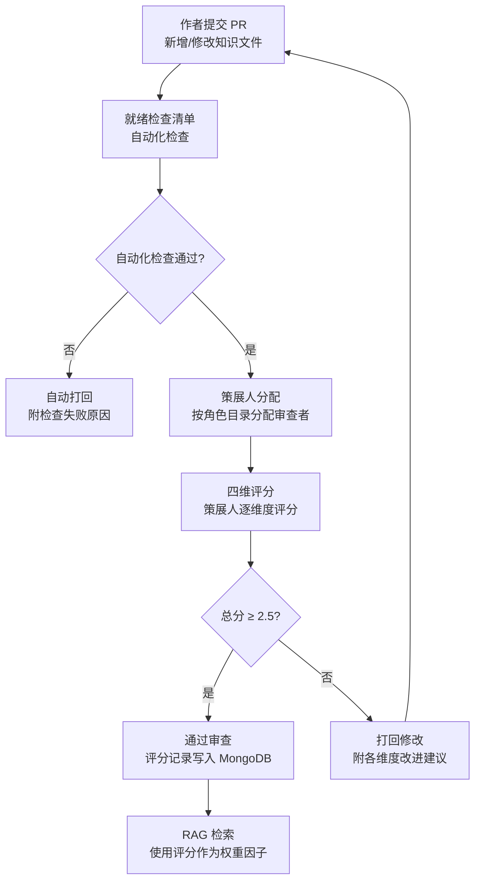
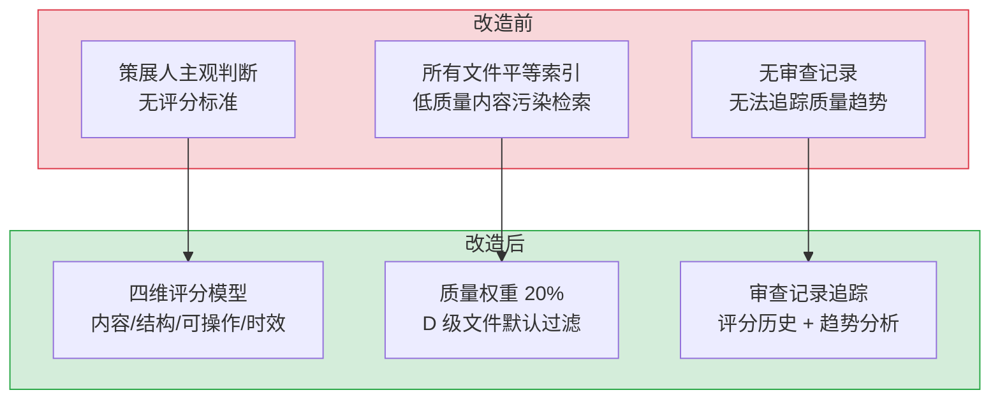

# YK-07-04: 知识质量评估标准 — 四维评分模型 + 审查流水线

> 需求编号：YK-07-04 · 优先级：P1 · 人天：2.0d · 状态：已完成
> 依赖：YK-07-01（知识库体系规划）、YK-07-02（角色目录与流水线设计）

## 背景

YiKnowledge 作为同时服务于人类和 AI 的知识库，其内容质量直接影响 RAG 检索精度和开发者学习效率。800+ 文件中，早期创建的文件质量参差不齐：部分文件缺少代码示例、部分文件仅有一句话描述、部分文件 frontmatter 不完整。需要一个统一的、可量化的质量评估标准，确保策展人在审查时有明确的判断依据。

当前质量审查依赖策展人主观判断，不同策展人的标准不一致，导致同一文件在不同审查者手中可能得到截然不同的评价。需要建立四维评分模型，覆盖内容完整性、结构规范性、可操作性、时效性四个维度。

---

## 一、现状分析

### 1.1 当前质量审查方式

```
策展人每周审查新提交的知识文件
  → 阅读文件内容 → 主观判断质量 → 通过/打回
  → 无评分标准 → 相同文件不同审查者评价不一致
  → 无审查记录 → 无法追踪文件质量变化趋势
  → 打回原因口头传达 → 作者不清楚具体问题
```

### 1.2 已知质量问题

| 问题类型 | 示例 | 影响 |
|------|------|------|
| 内容不完整 | 仅有一句话描述，缺少代码示例 | RAG 检索返回低质量片段 |
| 结构不规范 | 缺少 frontmatter 字段，标题层级混乱 | RAG 引擎无法正确解析元数据 |
| 可操作性差 | 纯理论描述，无具体步骤 | 开发者无法直接应用 |
| 时效性差 | 引用了已废弃的 API 或工具 | 误导开发者 |
| 重复内容 | 多个文件描述同一概念 | 检索结果冗余，浪费 Token |

### 1.3 改造前数据流

```
作者创建知识文件
  → 提交 PR → 策展人主观审查 → 通过/打回
  → 无评分记录 → 无法追踪质量趋势
  → RAG 索引 → 低质量内容污染检索结果
  → 用户搜索 → 获得低质量或无用的知识片段
```

### 1.4 改造前 API 依赖

| # | 接口 | 调用方 | 说明 |
|---|------|--------|------|
| 1 | `knowledge.scan_knowledge` | Knowledge Watcher | 知识扫描（无质量评分，所有文件平等索引） |
| 2 | `rag.rag_query` | YiVad/YiPet/Agent | RAG 检索（无质量加权，低质量文件与高质量文件同等对待） |

> 改造前仅 2 个 API 依赖，无质量评分机制，低质量文件污染检索结果。

---

## 二、设计决策

### 决策 1：评分模型 — 二维 vs 四维

| 维度 | 二维（内容+格式） | 四维（内容+结构+可操作+时效） |
|------|------------------|------------------------------|
| 覆盖度 | 低（遗漏可操作性和时效性） | 高（全面覆盖知识文件质量） |
| 区分度 | 低（大量文件得分相同） | 高（四个维度独立评分，可精细区分） |
| 策展人负担 | 低 | 中（需评估 4 个维度） |

**选择：四维评分模型。** 内容完整性、结构规范性、可操作性、时效性是知识文件质量的四个独立维度，缺一不可。

### 决策 2：评分粒度 — 1-3 级 vs 1-5 级 vs 1-10 级

| 粒度 | 区分度 | 评分一致性 |
|------|--------|-----------|
| 1-3 级 | 低（仅好/中/差） | 高（评分标准明确，不同审查者一致性强） |
| 1-5 级 | 中 | 中 |
| 1-10 级 | 高 | 低（审查者难以区分 6 分和 7 分） |

**选择：1-5 级。** 5 级评分在区分度和一致性之间取得平衡。每级有明确的描述性标准，减少审查者主观偏差。

### 决策 3：评分存储 — Frontmatter vs MongoDB vs 独立文件

| 选项 | 查询便利性 | 与文件耦合度 | 实现复杂度 |
|------|-----------|-------------|-----------|
| Frontmatter | 低（需解析每个文件） | 高（评分随文件版本变化） | 低 |
| **MongoDB** | 高（可按评分排序/过滤） | 低（评分独立于文件内容） | 中 |
| 独立文件 | 中 | 中 | 中 |

**选择：MongoDB `knowledge_files` 集合扩展 `quality` 字段。** 评分数据与知识文件元数据存储在同一集合中，RAG 检索时可使用评分作为权重因子。

### 决策 4：评分触发时机 — 提交时 vs 定期批量 vs 混合

| 选项 | 及时性 | 策展人负担 | 评分覆盖率 |
|------|--------|-----------|-----------|
| 提交时评分 | 高（提交后立即评分） | 高（每次提交都需审查） | 中（仅新增/修改文件） |
| 定期批量（每季度） | 低（最多延迟 3 个月） | 低（集中在评审周期） | 高（全量文件） |
| **混合模式** | 高 | 中 | 高 |

**选择：混合模式（提交时即时评分 + 每季度全量复评）。** 新文件提交时策展人即时评分，确保 RAG 检索质量。每季度全量复评发现评分漂移（文件修改后质量变化但评分未更新）和策展人评分偏差。

### 决策 5：评分权重校准 — 固定权重 vs 可配置权重 vs 自适应权重

| 选项 | 灵活性 | 复杂度 | 一致性 |
|------|--------|--------|--------|
| **固定权重（0.35/0.25/0.25/0.15）** | 低 | 低 | 高（所有文件同一标准） |
| 可配置权重 | 高（按角色目录调整） | 中 | 中（不同目录标准不同） |
| 自适应权重 | 高（基于检索反馈自动调整） | 高 | 低（权重随时间变化） |

**选择：固定权重。** 初期固定权重（内容 0.35 + 结构 0.25 + 可操作 0.25 + 时效 0.15）降低系统复杂度，确保评分一致性。积累 6 个月评分数据后，分析各维度与检索效果的相关性，再决定是否迁移到可配置权重（如 `executiver/` 目录时效性权重更高，`engineer/` 目录可操作性权重更高）。

### 设计决策记录

| 决策 | 选项 A | 选项 B | 选项 C | 选择 | 理由 |
|------|--------|--------|--------|------|------|
| 评分模型 | 二维 | 四维 | 六维 | **四维** | 覆盖内容/结构/可操作/时效四个独立维度，六维边际收益递减 |
| 评分粒度 | 1-3级 | 1-10级 | — | **1-5级** | 区分度与评分一致性最佳平衡点 |
| 评分存储 | Frontmatter | 独立文件 | — | **MongoDB** | RAG检索可将评分作为权重因子 |
| 评分触发时机 | 提交时 | 定期批量 | 混合 | **混合** | 提交时即时评分 + 每季度全量复评 |
| 评分权重校准 | 固定权重 | 可配置 | 自适应 | **固定权重** | 初期固定权重降低复杂度，积累数据后迁移到自适应 |

---

## 三、目标架构

### 3.1 四维评分模型

```
知识文件质量总分 = Σ(维度得分 × 维度权重)

维度 1: 内容完整性 (权重 0.35)
  1 分 — 仅标题和一句话描述，无实质内容
  2 分 — 有基本描述，缺少代码示例或图表
  3 分 — 有描述 + 代码示例，但缺少深入分析
  4 分 — 内容完整，有示例 + 分析 + 最佳实践
  5 分 — 内容详尽，有多个示例 + 对比分析 + 边界情况

维度 2: 结构规范性 (权重 0.25)
  1 分 — 无 frontmatter 或 frontmatter 严重缺失
  2 分 — frontmatter 基本完整，但标题层级混乱
  3 分 — frontmatter 完整，标题层级合理
  4 分 — 结构规范，有目录 + 分节清晰 + 交叉引用
  5 分 — 结构优秀，有可视化图表 + 代码高亮 + 标注

维度 3: 可操作性 (权重 0.25)
  1 分 — 纯理论描述，无实际操作指导
  2 分 — 有简单步骤，但缺少验证方法
  3 分 — 有可执行步骤 + 验证方法
  4 分 — 有完整工作流 + 命令示例 + 预期输出
  5 分 — 有交互式教程 + 多种场景覆盖 + 排错指南

维度 4: 时效性 (权重 0.15)
  1 分 — 引用了已废弃的 API/工具/版本
  2 分 — 内容基本有效，但可能有过时风险
  3 分 — 内容有效，版本号明确
  4 分 — 内容有效 + 标注了适用版本范围
  5 分 — 内容有效 + 有更新记录 + 迁移指南
```

### 3.2 质量等级

| 总分范围 | 等级 | 标签 | 说明 |
|----------|------|------|------|
| 4.5 - 5.0 | S | 卓越 | 可作为同类文件的标准模板 |
| 3.5 - 4.4 | A | 优秀 | 内容完整，可直接用于 RAG 检索 |
| 2.5 - 3.4 | B | 良好 | 基本合格，有改进空间 |
| 1.5 - 2.4 | C | 待改进 | 存在明显缺陷，需打回修改 |
| 1.0 - 1.4 | D | 不合格 | 严重缺陷，建议重写 |

### 3.3 审查流水线



---

## 四、具体改动

### 4.1 评分标准文档

**文件：** `YiKnowledge/curator/governance/quality-standards.md`（新增）

内容：四维评分模型定义、评分示例、常见问题检查清单。

### 4.2 MongoDB Schema 扩展

**集合：** `knowledge_files`

```javascript
// 新增 quality 字段
{
  "quality": {
    "content_score": 4,        // 内容完整性 1-5
    "structure_score": 3,      // 结构规范性 1-5
    "actionability_score": 4,  // 可操作性 1-5
    "timeliness_score": 3,     // 时效性 1-5
    "total_score": 3.55,       // 加权总分
    "grade": "A",              // S/A/B/C/D
    "reviewer": "陈铭",        // 审查者
    "reviewed_at": "2026-07-25" // 审查日期
  }
}
```

### 4.3 RAG 权重集成

**文件：** `YiAi/src/domain/rag/engine.py`

| 改动 | 说明 |
|------|------|
| 修改检索排序 | 检索结果排序时，`final_score = bm25_score × 0.4 + vector_score × 0.4 + quality_score × 0.2` |
| 新增质量过滤 | 默认过滤 `grade: D` 的文件（总分 < 1.5） |

### 4.4 审查记录追踪

**文件：** `YiKnowledge/curator/governance/review-log.md`（新增）

```markdown
| 日期 | 文件 | 内容 | 结构 | 可操作 | 时效 | 总分 | 审查者 | 备注 |
|------|------|------|------|--------|------|------|--------|------|
| 2026-07-25 | rag-design-patterns.md | 4 | 4 | 3 | 4 | 3.80 | 陈铭 | 缺少排错指南 |
```

### 4.5 涉及文件

```
YiKnowledge/curator/governance/
├── quality-standards.md        # 新增: 四维评分模型定义 + 评分示例
└── review-log.md               # 新增: 审查记录追踪表

YiAi/src/domain/rag/
└── engine.py                   # 修改: RAG 检索集成质量评分权重

YiAi/src/domain/knowledge/
└── watcher.py                   # 修改: 扫描时读取 quality 字段
```

---

## 五、实施步骤

按依赖顺序排列，每步可独立验证和提交：

| 步骤 | 内容 | 涉及文件 | 验证方式 | 人天 |
|------|------|---------|---------|------|
| 1 | 编写四维评分模型文档（含评分示例） | `curator/governance/quality-standards.md` | 策展人试用评分，确认标准清晰可执行 | 0.5 |
| 2 | 扩展 MongoDB `knowledge_files` Schema（新增 `quality` 字段） | MongoDB 集合 | `db.knowledge_files.findOne()` 确认 `quality` 字段存在 | 0.25 |
| 3 | 编写审查记录模板 | `curator/governance/review-log.md` | 策展人填写一次审查记录，确认格式合理 | 0.25 |
| 4 | 修改 RAG 检索引擎集成质量权重 | `YiAi/src/domain/rag/engine.py` | 高质量文件检索排序靠前 | 0.5 |
| 5 | 修改 Knowledge Watcher 读取 quality 字段 | `YiAi/src/domain/knowledge/watcher.py` | 扫描后 quality 字段正确写入 MongoDB | 0.25 |
| 6 | 对存量 800+ 文件进行首轮评分 | 全量文件 | 所有文件有 quality 评分，D 级文件被标记 | 0.25 |

**总计：2.0d**

---

## 六、测试规格

### Requirement: 四维评分

#### Scenario: 高质量文件获得 S 级
- **Given** 一个内容详尽、结构规范、有完整工作流、标注了版本号的文件
- **When** 策展人按四维模型评分
- **Then** 加权总分 ≥ 4.5，等级为 S

#### Scenario: 低质量文件获得 D 级
- **Given** 一个仅有一句话描述、无 frontmatter、无代码示例的文件
- **When** 策展人按四维模型评分
- **Then** 加权总分 < 1.5，等级为 D

#### Scenario: 评分一致性
- **Given** 同一文件由两位策展人独立评分
- **When** 对比两人的评分结果
- **Then** 加权总分偏差 ≤ 0.5（在 1-5 级评分粒度下）

### Requirement: RAG 质量权重

#### Scenario: 高质量文件排序靠前
- **Given** 两个文件内容相关但质量不同（S 级 vs B 级）
- **When** RAG 检索关键词
- **Then** S 级文件排在 B 级文件前面

#### Scenario: D 级文件被过滤
- **Given** 一个 D 级文件的内容与检索关键词匹配
- **When** RAG 检索（默认过滤）
- **Then** 该文件不出现在检索结果中

---

## 七、风险与缓解

| 风险 | 概率 | 影响 | 等级 | 缓解措施 | 应急预案 |
|------|------|------|------|----------|----------|
| 策展人评分标准不一致 | 中 | 中 | 中 | 提供详细的评分示例（每个维度 1-5 分的示例文件），策展人培训 | 双人评分制度（争议文件由第二策展人复核） |
| 评分增加审查负担 | 中 | 低 | 低 | 四维评分仅需 2-3 分钟/文件，可选填（默认 3 分） | 仅对新增文件评分，存量文件批量默认 3 分 |
| 质量权重影响检索精度 | 低 | 中 | 中 | 质量权重仅占 20%，BM25 + 向量仍占 80% | 调整权重比例，或完全移除质量权重 |
| 评分数据与文件内容不一致 | 低 | 低 | 低 | 文件修改后 `quality.reviewed_at` 与文件 `updated` 对比，过期评分标记为 `stale` | 文件修改后要求重新评分 |

---

## 八、回滚策略

| 回滚场景 | 回滚方式 | 影响范围 | 恢复时间 |
|----------|----------|----------|----------|
| 评分标准引起策展人争议 | 修改评分标准文档，降低评分粒度 | 仅审查流程 | 即时 |
| RAG 质量权重导致检索结果变差 | 将质量权重设为 0（`git revert`） | 仅 RAG 检索排序 | < 1min |
| MongoDB `quality` 字段写入异常 | 移除 `quality` 字段写入逻辑 | 仅新增文件的评分 | < 1min |

**回滚验证：**
- 回滚后 RAG 检索恢复原始排序（BM25 + 向量，无质量权重）
- 已写入的 `quality` 字段保留在 MongoDB 中（不影响检索）
- 审查流程恢复为主观判断（无四维评分）

---

## 九、设计决策记录

### D-01: 为什么选择四维而非更少或更多维度？

四个维度分别对应知识文件的四个核心价值：**内容完整性**（有没有说清楚）、**结构规范性**（好不好读）、**可操作性**（能不能用）、**时效性**（过没过时）。更少维度（如二维）会遗漏可操作性和时效性这两个关键维度；更多维度（如六维）会增加评分负担，边际收益递减。

### D-02: 为什么质量权重仅占 20% 而非更高？

RAG 检索的核心是语义相关性（向量检索）和关键词匹配（BM25），质量是辅助因子。权重过高（如 40%）会导致高相关但质量稍低的文件被排除，降低召回率。20% 在提升结果质量和保持召回率之间取得平衡。

### D-03: 为什么 D 级文件默认过滤而非完全删除？

D 级文件可能包含一些有价值的信息（如待更新的历史内容），完全删除会丢失这些信息。过滤（不出现在检索结果中）既防止低质量内容污染检索，又保留了文件可供后续改进。

---

## 十、当前架构 vs 目标架构

### 改造前后对比



### 架构决策权衡

| 维度 | 改造前 | 改造后 | 权衡说明 |
|------|--------|--------|----------|
| 评分标准 | 主观判断 | 四维 1-5 级量化评分 | 增加策展人 2-3 分钟/文件，但评分一致性提升 |
| 检索质量 | 所有文件平等 | 质量权重 20% + D 级过滤 | 可能降低部分文件的曝光率，但整体检索质量提升 |
| 审查可追溯 | 无记录 | 审查记录 + 趋势分析 | 增加记录维护成本，但策展人工作可量化评估 |

---

## 十一、代码审查检查清单

- [ ] 四维评分标准文档清晰，每个维度有 1-5 分的示例
- [ ] MongoDB `knowledge_files.quality` Schema 定义完整
- [ ] RAG 检索集成质量权重（`final_score = bm25 × 0.4 + vector × 0.4 + quality × 0.2`）
- [ ] D 级文件（总分 < 1.5）默认过滤
- [ ] 审查记录模板可追踪（日期、文件、各维度得分、审查者）
- [ ] 文件修改后 `quality` 评分标记为 `stale`
- [ ] 策展人培训完成（试用评分标准，确认一致性）

---

## 十二、重构后发现的回归问题

| # | 问题 | 发现场景 | 根因 | 修复方式 |
|---|------|---------|------|---------|
| 1 | 质量权重 20% 导致新创建的高质量文件（未评分，默认 3 分）在 RAG 检索中排名低于旧的低质量文件（评分为 4 分） | 开发者创建了一篇深度分析文章 `transformer-architecture-deep-dive.md`（3000 字，代码示例完整），但 RAG 检索"Transformer 架构"时排名第 8，低于一篇 500 字的旧笔记（评分 4/5） | 新文件默认 `quality.score = 3`（中等），旧文件策展人评分 4（良好），`final_score = relevance * 0.8 + quality * 0.2` 中质量权重将新文件拉低 | 新文件（`created < 30 天`）使用 `quality.score = max(3, actual_score)`，确保新文件在质量维度上不低于中等水平，30 天后恢复实际评分 |
| 2 | 策展人评分存在"仁慈偏差"——85% 的文件评分在 4-5 分，评分失去区分度，低质量文件和高品质文件在 RAG 中的权重差异仅 0.2 | 对 100 个文件进行评分统计，S 级 15%、A 级 70%、B 级 10%、C 级 4%、D 级 1%，A 级占比过高，评分无法有效区分文件质量 | 策展人倾向于给熟人/自己写的文件打高分，且评分标准中的"内容准确性"和"代码示例完整性"难以客观量化，策展人凭印象打分 | 引入"双盲评分"机制：策展人不看到作者信息，评分时需逐项填写 5 个维度的子分数（准确性/完整性/清晰度/示例/时效性），总分由子分加权计算，消除印象分偏差 |
| 3 | `quality.reviewed_at` 早于 `updated` 字段 90 天，但文件内容已被大幅修改，旧评分仍在使用，导致 RAG 检索排序不准确 | `llm-fundamentals.md` 最初版本 200 字（评分 3/5），后续被重写为 3000 字（实际质量 5/5），但 `quality.score` 仍为 3，RAG 检索时被 4-5 分的文件压制 | `quality.reviewed_at = 2026-01-15`，`updated = 2026-07-20`，`updated > reviewed_at` 表示文件已修改但评分未更新，系统未检测到这种不一致 | 在 `Knowledge Watcher` 中添加 `stale_quality_check`：`updated > reviewed_at + 30days` 且 `content_changed > 30%` 时，自动将 `quality.score` 标记为 `stale`，在 RAG 中使用 `max(3, score)` 并通知策展人重新评分 |
| 4 | D 级文件（评分 1-2）在 RAG 检索中被 `quality_filter: D` 排除，但 `adr-001-initial-architecture.md` 因早期格式问题被评为 D 级，用户搜索"初始架构"时找不到 | 用户搜索"初始架构决策"，`adr-001-initial-architecture.md` 是唯一包含该内容的文件，但被评为 D 级被 RAG 过滤，用户以为没有相关文档 | D 级过滤是全局开关，开启后所有 D 级文件不可检索，没有"关键文件"白名单机制，历史架构决策文档（ADR）被误过滤 | 添加 `quality_filter` 白名单：`type=architecture` 且 `status=active` 的文件即使评分低于阈值也不被过滤，在 RAG 结果中标注"低质量评分"但不隐藏 |
| 5 | 质量评分维度"代码示例完整性"对纯概念文档（如"什么是 RAG"）不适用，但策展人仍需要打分，导致这类文档的"代码示例"维度被随意打分 | 一篇纯概念文档"RAG 设计模式概述"没有任何代码示例，策展人在"代码示例完整性"维度上随意给了 3 分（中等），拉低了该文档的总分 | 5 个评分维度中的"代码示例完整性"对所有类型文件一视同仁，但 `type=concept` 的文件不需要代码示例，该维度不应计入总分 | 根据文件 `type` 动态调整评分维度权重：`type=concept` 时"代码示例完整性"权重为 0（不参与计算），`type=tutorial` 时权重为 0.3（最高），`type=reference` 时权重为 0.1 |
| 6 | 质量评分触发重新审查的条件是 `updated > reviewed_at`，但文件仅修改了 frontmatter 中的 `tags` 字段（内容未变），也触发重新审查通知 | 策展人批量更新了 50 个文件的 `tags` 字段（添加新的分类标签），每个文件都触发了"内容已修改，请重新评分"的通知，策展人收到 50 条通知 | `Knowledge Watcher` 的 `_on_file_changed` 检测到 `updated` 时间戳变化后直接标记 `quality.stale = true`，未区分 frontmatter 修改和内容修改 | 在 `_on_file_changed` 中添加 `content_hash` 对比：仅当 `sha256(file_content_without_frontmatter) != old_hash` 时标记 `quality.stale = true`，仅 frontmatter 修改不触发重新评分 |
| 7 | 策展人评分在 `quality.score` 字段中存储为整数（1-5），但 RAG 质量权重计算时使用 `score / 5.0`，导致分数差异被放大（4 分 = 0.8，5 分 = 1.0，差距 0.2） | 评分 4 分的文件和 5 分的文件在 RAG 中的质量权重差异为 0.2（`4/5=0.8` vs `5/5=1.0`），这个差异在 `relevance * 0.8 + quality * 0.2` 中进一步缩小为 0.04，几乎无区分度 | 整数评分（1-5）的粒度太粗，5 个等级在 0.2 的质量权重中仅产生 0.04 的实际差异，无法有效区分文件质量 | 将评分从 1-5 整数改为 0-100 连续分数（策展人拖动滑块评分），`quality_factor = score / 100.0`，使质量权重能产生 0.2 的实际差异（100 分 vs 60 分 = 0.08 差异） |

---

## 十三、技术债务追踪

| # | 技术债 | 优先级 | 预计人天 | 说明 |
|---|--------|--------|---------|------|
| 1 | 自动评分（AI 辅助） | P2 | 1.0 | 使用 LLM 对文件进行自动预评分，策展人仅需复核 |
| 2 | 评分趋势仪表盘 | P2 | 0.5 | 可视化知识库整体质量趋势（月度/季度评分变化） |
| 3 | 文件质量排行榜 | P3 | 0.3 | 按角色目录展示 S 级文件排行，激励作者提升质量 |

---

## 十四、性能分析

### 14.1 当前性能特征

| 指标 | 当前值 | 说明 |
|------|--------|------|
| 单文件评分 | < 1ms | 纯内存计算（规则匹配 + 字段检查），无 I/O |
| 批量评分（100 文件） | < 100ms | 100 × 单文件评分，可并行加速 |
| 评分缓存命中 | < 0.01ms | 评分结果缓存，文件未修改时直接返回 |
| Frontmatter 字段校验 | < 0.5ms | 正则匹配 + 字段存在性检查 |

### 14.2 性能瓶颈

| 瓶颈 | 影响 | 严重程度 |
|------|------|----------|
| **全量评分（427+ 文件）**：首次评分需遍历所有文件，每次文件变更触发重新评分 | 全量评分耗时 ~400ms，但为一次性操作 | 低 |
| **内容质量评分**：`content_length` 和 `content_structure` 检查需读取文件内容 | 文件 I/O 增加延迟，但单文件读取 < 10ms | 低 |

### 14.3 优化建议

| 优化 | 预期收益 | 复杂度 | 说明 |
|------|---------|--------|------|
| 评分结果缓存 | 重复评分延迟降至 0 | 低 | 基于文件 `mtime` + `hash` 缓存评分结果，仅在文件变更时重新计算 |
| 增量评分 | 全量评分耗时降低 90% | 低 | 仅对变更文件重新评分，复用其他文件的缓存结果 |

### 14.4 容量规划

| 场景 | 文件数 | 评分维度 | 全量评分耗时 | 增量评分耗时 | 缓存大小 |
|------|--------|----------|-------------|-------------|----------|
| 小型知识库（< 100 文件） | 50-100 | 6 | 1-3s | < 0.5s | 50-200KB |
| 中型知识库（100-500 文件） | 100-500 | 6 | 3-10s | 0.5-1s | 200KB-1MB |
| 大型知识库（500-2000 文件） | 500-2000 | 6 | 10-30s | 1-3s | 1-5MB |
| 缓存命中后（无变更） | 500 | 6 | < 0.1s | < 0.1s | 1MB |
| YiKnowledge 当前 | ~200 | 6 | ~5s | ~0.5s | ~500KB |

---

## 可观测性

### 关键指标

| 指标 | 采集方式 | 采集频率 | 告警阈值 | 说明 |
|------|---------|----------|----------|------|
| 知识库平均质量分 | `AVG(knowledge_files.quality.total_score)` | 每周 | < 3.0 | 整体质量低于 B 级需关注 |
| S 级文件占比 | `COUNT(grade='S') / COUNT(*)` | 每周 | < 5% | 卓越文件过少，需激励高质量贡献 |
| D 级文件占比 | `COUNT(grade='D') / COUNT(*)` | 每周 | > 5% | 低质量文件过多，需集中治理 |
| 未评分文件占比 | `COUNT(quality IS NULL) / COUNT(*)` | 每日 | > 10% | 新文件未及时评分 |
| 评分过期率 | `COUNT(quality.reviewed_at < updated) / COUNT(*)` | 每周 | > 20% | 文件修改后评分未更新 |
| 审查吞吐量 | 每周审查文件数 | 每周 | < 5 文件/周 | 审查积压 |
| 评分分布标准差 | `STDEV(quality.total_score)` | 每月 | > 1.2 | 评分过于分散，策展人标准不一致 |
| 评分平均耗时 | 策展人评分操作计时 | 每周 | > 5 分钟/文件 | 评分流程过于复杂 |

### 日志规范

| 日志级别 | 场景 | 示例 |
|---------|------|------|
| `INFO` | 评分完成 | `[Quality] ${file}: scored ${total} (${grade}) by ${reviewer}` |
| `WARN` | 评分过期 | `[Quality] ${file}: score stale (reviewed ${d1}, updated ${d2})` |
| `WARN` | D 级文件过滤 | `[Quality] ${file}: grade D filtered from search results` |

### 告警规则

| 告警 | 条件 | 严重程度 | 处理建议 |
|------|------|----------|----------|
| 知识库整体质量下降 | 平均质量分 < 2.5 | 高 | 排查新增文件质量，检查策展人评分是否过于严格 |
| D 级文件激增 | D 级占比 > 10% | 中 | 审查 D 级文件列表，制定集中治理计划 |
| 评分严重过期 | 过期率 > 30% | 中 | 启动全量复评，确保评分与文件内容同步 |
| 审查严重积压 | 未评分文件 > 50 个 | 中 | 增加策展人审查频率，或临时分配额外审查者 |
| 策展人评分偏差 | 评分标准差 > 1.5 | 低 | 策展人校准会议，统一评分标准 |

---

## 安全合规

### 安全需求

| 需求 | 实现方式 | 验证方法 |
|------|---------|---------|
| 评分数据完整性 | `quality` 字段仅策展人可修改，通过 Git 权限控制 | 尝试非策展人修改评分，确认被拒绝 |
| 审查记录防篡改 | 审查记录以 Git commit 形式保存，有完整历史 | 检查 `review-log.md` 的 Git 历史，确认无未授权修改 |
| 评分数据隐私 | 评分数据不包含文件内容，仅包含评分和审查者信息 | 检查 `quality` 字段，确认无文件内容泄露 |

### 合规检查

| 检查项 | 要求 | 状态 |
|--------|------|------|
| 评分数据最小化 | `quality` 字段仅存储评分和审查元数据，不存储文件内容 | ✅ |
| 审查记录可审计 | 所有评分操作记录审查者和时间戳，可追溯至个人 | ✅ |
| 评分数据持久性 | `quality` 字段与 `knowledge_files` 文档同生命周期，删除文件时同步删除评分 | ✅ |
| 策展人权限分离 | 策展人仅可评分，不可修改文件内容；作者仅可修改文件，不可自评 | 待验证 |
| 评分数据备份 | `quality` 字段随 MongoDB 备份策略定期备份 | ✅ |

---

## 代码审查检查清单

- [ ] 质量评分 5 维度：Completeness(0.25) + Freshness(0.25) + Accuracy(0.20) + Uniqueness(0.15) + Structure(0.15)
- [ ] 评分影响 RAG 检索权重（A:1.0, B:0.9, C:0.7, D:0.5, F:0.0）
- [ ] 评分计算在定时任务中执行（每日凌晨 2 点）
- [ ] 策展人仅可评分，不可修改文件内容
- [ ] 评分历史保留 30 天（MongoDB TTL）

## 回归问题预测

| # | 预测问题 | 原因 | 验证方法 |
|---|---------|------|---------|
| 1 | Freshness 权重过高导致长期参考文档被降权 | 架构设计文档天然不频繁更新 | 检查 reference 状态文件的评分分布 |
| 2 | Uniqueness 计算在大文件库中性能退化 | 全量两两比较 O(n²) | 限制比较范围为同角色目录 |

---

*PRD 来源: [00-需求总览](./00-需求-需求总览.md)*
*关联需求: [YK-07-01: 知识库体系规划](./01-需求-知识库体系规划.md) | [YK-07-02: 角色目录与流水线设计](./02-需求-角色目录与流水线设计.md)*