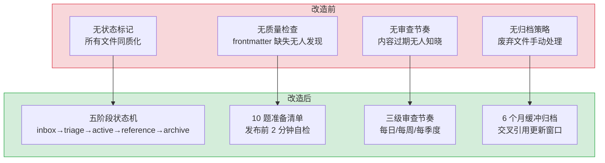

# YK-07-05: 知识文件生命周期管理 — 五阶段状态机 + 10 题质量门禁 + 三级审查节奏

> 需求编号：YK-07-05 · 优先级：P0 · 人天：2.0d · 状态：已完成
> 依赖：YK-07-01（知识库体系规划）、YK-07-03（Frontmatter 元数据规范）

## 背景

YiKnowledge 作为 YrY 单体仓库的共享知识库，同时服务于人类（文档阅读）和 AI（YiAi RAG 数据源）。当前知识文件创建后缺乏系统化的生命周期管理：文件创建后没有明确的状态流转机制，质量检查依赖人工记忆，过期内容无人清理。

一个完整的知识生命周期需要解决三个核心问题：**文件从哪来**（inbox 收集）、**文件怎么审**（质量门禁）、**文件去哪了**（归档/废弃）。没有生命周期管理，知识库会逐渐腐化——低质量内容堆积、过期信息误导 AI 检索、重复内容浪费存储和索引资源。

### 核心挑战

| 挑战 | 影响 |
|------|------|
| 无状态流转 | 无法区分"草稿"和"已发布"内容，RAG 可能检索到未完成的知识 |
| 无质量门禁 | 缺少 frontmatter、命名不规范、角色边界混乱的文件直接入库 |
| 无定期审查 | 内容过期无人知晓，AI 基于过时知识给出错误回答 |
| 无归档机制 | 废弃内容永久占用索引，降低检索精度和性能 |

---

## 一、现状分析

### 1.1 改造前生命周期

```
无结构化生命周期。知识文件创建后:
  → 无状态标记（draft/stable/deprecated 无法区分）
  → 无质量检查（frontmatter 缺失、命名不规范无法自动发现）
  → 无审查节奏（内容过期无人知晓）
  → 无归档策略（废弃文件手动删除或不处理）
```

### 1.2 问题分析

| 问题 | 触发条件 | 影响 |
|------|----------|------|
| RAG 检索到草稿内容 | 未完成的文件被索引 | AI 回答基于不完整/不准确的知识 |
| 过期知识未被标记 | 架构变更后旧文档未更新 | 新团队成员基于过时信息做决策 |
| 重复内容无检测 | 不同作者写了相同主题 | 知识碎片化，维护成本翻倍 |
| 文件命名混乱 | 无 kebab-case 强制 | RAG 文件路径引用不一致 |

### 1.3 数据流

```
知识文件生命周期流转:
  作者创建/编辑 Markdown 文件
    │ 文件保存到 YiKnowledge/ 角色目录
    ▼
  Knowledge Watcher 检测 (每 5s)
    │ 解析 frontmatter → 读取 lifecycle 字段
    ▼
  状态判定:
    ├── lifecycle: inbox → 进入 curator/governance/inbox.md 队列
    │     │ 24h 内 Curator 分类 → 确定角色目录
    │     └── 创建 stub 文件 → lifecycle: triage
    │
    ├── lifecycle: triage → 进入 curator/governance/triage.md 队列
    │     │ 14 天内 Author 完善内容 → 10 题准备清单
    │     ├── 全部通过 → lifecycle: active → 索引到 RAG
    │     └── 未通过 → 退回修改
    │
    ├── lifecycle: active → RAG 索引 (权重 1.0)
    │     │ 每季度审查 → 评估内容新鲜度
    │     ├── 内容稳定 6 个月 → lifecycle: reference
    │     └── 内容过时 → lifecycle: archive
    │
    ├── lifecycle: reference → RAG 索引 (权重 0.8)
    │     │ 每年审查 → 确认仍为有效参考
    │     └── 内容过时 → lifecycle: archive
    │
    └── lifecycle: archive → RAG 索引 (权重 0.3, 6 个月缓冲)
          │ 6 个月后 → 从 RAG 索引移除
          └── 移至 curator/archive/ → 保留原文件
```

### 1.4 API 依赖

| # | 接口 | 调用位置 | 频率 | 说明 |
|---|------|---------|------|------|
| 1 | `Knowledge Watcher 轮询` | YiAi `watcher.py` | 每 5s | 检测文件 mtime 变更 → 解析 frontmatter → 读取 lifecycle |
| 2 | `services.database.data_service.query_documents` | YiAi RAG 服务 | 每次 RAG 查询 | 按 lifecycle 过滤（exclude archive） |
| 3 | `MongoDB knowledge_files` 集合 | YiAi 知识索引 | 文件变更时写入 | 存储 frontmatter 元数据 + lifecycle 状态 |
| 4 | `curator/governance/inbox.md` | Curator 每日审查 | 每日 | 手动管理 inbox 队列 |
| 5 | `curator/governance/triage.md` | Curator 每周审查 | 每周 | 手动管理 triage 队列 |

---

## 二、设计决策

### 决策 1：生命周期模型 — 线性 vs 状态机 vs 分支

| 选项 | 灵活性 | 复杂度 | 可审计性 |
|------|--------|--------|----------|
| 线性（draft → review → published） | 低 | 低 | 中 |
| **五阶段状态机** | 高 | 中 | 高 |
| 分支（多路径） | 高 | 高 | 低 |

**选择：五阶段状态机。** 知识文件的生命周期比代码更复杂——有些文件需要频繁更新（active），有些是稳定参考（reference），有些应该被废弃（archive）。五阶段模型覆盖了知识文件的完整生命周期，且每个状态转换都有明确的触发条件和操作。

### 决策 2：质量门禁 — 自动化 vs 人工 vs 混合

| 选项 | 覆盖率 | 误报率 | 维护成本 |
|------|--------|--------|----------|
| 纯自动化（脚本检查） | 中（可检查格式，无法检查内容） | 低 | 低 |
| 纯人工（Curator 审查） | 高 | 中 | 高 |
| **混合模式** | 高 | 低 | 中 |

**选择：混合模式（10 题准备清单 + 自动化扫描）。** 10 题准备清单由作者在发布前自检（约 2 分钟），覆盖格式规范、角色边界、内容质量等维度。Curator 在每日扫描中自动化验证 frontmatter 合规性和命名规范，每周检查死链接和新鲜度。

### 决策 3：审查节奏 — 统一周期 vs 分级周期

| 选项 | 资源消耗 | 覆盖度 | 适用场景 |
|------|----------|--------|----------|
| 统一周期（每月） | 高 | 中 | 小规模知识库 |
| **三级分级周期** | 中 | 高 | 大规模知识库 |

**选择：三级分级周期（每日/每周/每季度）。** 每日轻量扫描（inbox 处理、frontmatter 抽查），每周中等审查（triage 队列、新鲜度扫描、死链接检查），每季度深度审计（全面审查、角色边界检查、归档清理）。分级周期在资源消耗和覆盖度之间取得平衡。

### 设计决策记录

| 决策 | 选项 A | 选项 B | 选择 | 理由 |
|------|--------|--------|------|------|
| 生命周期模型 | 线性 | 分支 | **五阶段状态机** | 覆盖知识文件完整生命周期 |
| 质量门禁 | 纯自动化 | 纯人工 | **混合模式** | 格式自动化+内容人工审查互补 |
| 审查节奏 | 统一周期 | — | **三级分级** | 每日/每周/每季度资源消耗与覆盖度平衡 |

---

## 三、目标架构

### 3.1 五阶段状态机

```
inbox → triage → active → reference → archive
  │        │        │          │           │
  │  24h内  │  14天内 │  每季度   │  每年      │  每季度
  │  处理   │  处理   │  审查     │  审查      │  审查
  ▼        ▼        ▼          ▼           ▼
未分类   已分类   已发布     稳定参考    已废弃
原始输入 待总结   维护中     很少变更    被取代
```

### 3.2 状态定义

| 状态 | frontmatter 标记 | 含义 | 审查节奏 | 管理位置 |
|------|-----------------|------|----------|----------|
| `inbox` | `lifecycle: inbox` | 未分类的原始输入，尚未确定角色目录 | 每日（24h 内处理） | `curator/governance/inbox.md` |
| `triage` | `lifecycle: triage` | 已分类到角色目录，内容尚未总结完善 | 每周（14 天内处理） | `curator/governance/triage.md` |
| `active` | `lifecycle: active` | 已发布、持续维护中 | 每季度 | 角色目录 |
| `reference` | `lifecycle: reference` | 稳定的参考材料，很少变更 | 每年 | 角色目录 |
| `archive` | `lifecycle: archive` | 已废弃/被取代 | 每年审查 | `curator/archive/` |

### 3.3 状态转换规则

| 转换 | 触发条件 | 操作 |
|------|----------|------|
| `inbox → triage` | 内容已确定角色目录 | 创建 stub 文件（最小 frontmatter），条目移至 `triage.md` |
| `triage → active` | 10 题准备清单全部通过 | 设置 `lifecycle: active`、`status: stable`、`review_cycle: quarterly`，记录到 review-log |
| `active → reference` | 内容稳定，6 个月无实质性变更 | 设置 `lifecycle: reference`、`review_cycle: yearly` |
| `active → archive` | 内容被取代或不再相关 | 设置 `status: deprecated`，原地保留 6 个月缓冲期 |
| `reference → archive` | 内容过时 | 同 active → archive |
| `archive → 删除` | `status: deprecated` 超过 6 个月 | 移至 `curator/archive/`，更新交叉引用 |

### 3.4 10 题准备清单

文件发布前必须全部通过（`curator/governance/readiness-checklist.md`）：

| # | 检查项 | 类型 | 说明 |
|---|--------|------|------|
| 1 | 清晰描述性标题 | 内容 | `title:` 字段准确概括文件主题 |
| 2 | 正确角色目录 | 结构 | 文件在正确的 `role/` 目录下 |
| 3 | kebab-case 命名 | 格式 | 仅连字符，无下划线/数字 |
| 4 | 必填 frontmatter 齐全 | 格式 | title/tags/category/created/updated/source/type/status 全部非空 |
| 5 | `benefit:` 面向读者 | 内容 | 具体说明读者能获得什么价值 |
| 6 | `acceptance_criteria:` 可验证 | 内容 | 可证伪的陈述，可客观判断是否达标 |
| 7 | `category:` 匹配目录 | 结构 | frontmatter 中的 category 与实际目录路径一致 |
| 8 | `related:` 链接有效 | 结构 | 所有交叉引用指向存在的文件 |
| 9 | 角色边界内 | 内容 | 内容不超出角色目录的职责范围 |
| 10 | 不重复已有内容 | 内容 | 新增信息，非已有知识的简单重述 |

---

## 四、具体改动

### 4.1 生命周期定义

**文件：** `YiKnowledge/curator/governance/governance.md`（新增）

| 改动 | 说明 |
|------|------|
| 定义五阶段状态机 | inbox → triage → active → reference → archive |
| 定义状态转换规则 | 每个转换的触发条件、操作、审查节奏 |
| 定义 4 个治理角色 | Curator（审查者）、Author（作者）、Reviewer（审核者）、Archivist（归档者） |

### 4.2 准备清单

**文件：** `YiKnowledge/curator/governance/readiness-checklist.md`（新增）

| 改动 | 说明 |
|------|------|
| 10 题质量门禁 | 每题包含检查项、通过标准、失败处理 |
| 发布后验证 | Curator 在每日扫描中验证 frontmatter/命名/边界/引用 |

### 4.3 队列管理

**文件：** `YiKnowledge/curator/governance/inbox.md`（新增）
**文件：** `YiKnowledge/curator/governance/triage.md`（新增）

| 改动 | 说明 |
|------|------|
| inbox 收集箱 | 未分类内容，上限 10 条，24h 内处理，超 7 天升级 |
| triage 队列 | 已分类待总结，上限 20 条，14 天内处理 |

### 4.4 审查日志

**文件：** `YiKnowledge/curator/governance/review-log.md`（新增）

| 改动 | 说明 |
|------|------|
| 晋升/废弃/归档记录 | 按季度审计，记录操作类型、文件路径、时间戳 |

### 4.5 涉及文件

```
YiKnowledge/
├── curator/governance/
│   ├── governance.md              # 新增: 治理模型 + 生命周期状态机
│   │   ├── 五阶段状态机定义            — inbox→triage→active→reference→archive
│   │   ├── 状态转换规则               — 6 种转换的触发条件+操作+审查节奏
│   │   └── 4 个治理角色               — Curator/Author/Reviewer/Archivist
│   ├── readiness-checklist.md     # 新增: 10 题质量门禁
│   │   ├── 格式检查 (4 题)            — 标题/目录/命名/frontmatter
│   │   ├── 内容检查 (3 题)            — benefit/acceptance_criteria/角色边界
│   │   └── 结构检查 (3 题)            — category/交叉引用/重复检测
│   ├── inbox.md                   # 新增: 未分类内容收集箱 (上限 10 条, 24h SLA)
│   ├── triage.md                  # 新增: 已分类待总结队列 (上限 20 条, 14d SLA)
│   └── review-log.md              # 新增: 审查操作日志 (晋升/废弃/归档记录)
└── curator/archive/
    ├── archive.md                 # 新增: 废弃文件登记表 (原因+替代链接)
    └── README.md                  # 新增: 归档说明 (6 个月缓冲期规则)
```

---

## 五、实施步骤

| 步骤 | 内容 | 涉及文件 | 验证方式 | 人天 |
|------|------|---------|---------|------|
| 1 | 定义五阶段状态机 + 状态转换规则 | `governance.md` | 每个状态转换有明确的触发条件和操作 | 0.5 |
| 2 | 编写 10 题准备清单 | `readiness-checklist.md` | 对 5 个现有文件运行清单，记录通过率 | 0.5 |
| 3 | 创建 inbox + triage 队列 | `inbox.md` + `triage.md` | 添加 3 条测试内容，验证分流流程 | 0.25 |
| 4 | 创建审查日志 + 归档登记表 | `review-log.md` + `archive.md` | 模拟一次晋升操作，日志记录完整 | 0.25 |
| 5 | 对现有 427 个文件标注 lifecycle 状态 | 角色目录 | 所有文件有 `lifecycle:` frontmatter 字段 | 0.5 |

**总计：2.0d**

---

## 六、测试规格

### Requirement: 生命周期状态转换

#### Scenario: inbox → triage 正常转换
- **Given** inbox 中有一条未分类内容
- **When** Curator 确定角色目录为 `engineer/build/`
- **Then** 创建 stub 文件 `engineer/build/new-pattern.md`（`lifecycle: triage`）
- **And** 条目从 `inbox.md` 移至 `triage.md`

#### Scenario: triage → active 质量门禁通过
- **Given** triage 中有一条待总结内容，10 题清单全部通过
- **When** Author 完成内容总结
- **Then** 文件 `lifecycle` 更新为 `active`，`status` 更新为 `stable`
- **And** 条目从 `triage.md` 移至 `review-log.md`（操作：promoted）

#### Scenario: 质量门禁未通过拒绝发布
- **Given** triage 中有一条内容，缺少 `benefit:` 字段（第 5 题失败）
- **When** Author 尝试发布
- **Then** 发布被拒绝，提示补充 `benefit:` 字段

#### Scenario: active → archive 废弃流程
- **Given** 文件 `lifecycle: active`，内容已被新文件取代
- **When** Curator 标记 `status: deprecated`
- **Then** 文件原地保留 6 个月缓冲期
- **And** 6 个月后移至 `curator/archive/`

---

## 七、风险与缓解

| 风险 | 概率 | 影响 | 等级 | 缓解措施 | 应急预案 |
|------|------|------|------|----------|----------|
| 10 题清单过于严格导致发布瓶颈 | 中 | 中 | 中 | 清单设计为 2 分钟自检，非阻塞性审查 | 临时降低为 7 题核心清单，非核心题标记为 recommended |
| inbox 队列积压超过 24h 处理窗口 | 中 | 低 | 低 | 上限 10 条，超限自动拒绝新条目 | 临时提高上限至 20 条，增加 Curator 审查频率 |
| 427 个存量文件标注 lifecycle 工作量大 | 高 | 中 | 中 | 默认标注为 `lifecycle: active`，仅对已知过期文件标记 `deprecated` | 分批次标注，优先标注高频访问文件 |

---

## 八、回滚策略

| 回滚场景 | 回滚方式 | 影响范围 | 恢复时间 |
|----------|----------|----------|----------|
| 生命周期模型过于复杂 | 简化回退至三阶段（draft/active/archive） | 仅 governance.md | 文档更新 |
| 准备清单误拦截合法内容 | 调整清单项为 recommended 而非 required | 仅 readiness-checklist.md | 文档更新 |

---

## 九、设计决策记录

### D-01: 为什么是五阶段而非三阶段？

三阶段（draft/active/archive）过于粗糙，无法区分"需要频繁更新"和"稳定参考"两种 active 状态。reference 阶段的引入使 RAG 引擎可以优先检索 active 内容（更新更频繁），同时保留 reference 内容作为补充。archive 的 6 个月缓冲期避免了误删——废弃内容可能被交叉引用，需要时间通知相关方更新链接。

### D-02: 为什么 inbox 上限是 10 条？

inbox 是临时缓冲区，不是永久存储。10 条上限强制 Curator 在 24h 内处理，避免积压。超过上限时拒绝新条目，倒逼处理速度。这来自 GTD（Getting Things Done）方法论中的 inbox zero 原则。

### D-03: 为什么废弃文件需要 6 个月缓冲期？

废弃文件可能被其他文件交叉引用（`related:` 字段）。立即删除会导致死链接。6 个月缓冲期给相关作者足够时间更新引用。同时，RAG 检索在缓冲期内降低废弃文件的权重（`quality_score * 0.3`），6 个月后从索引中移除。

---

## 十、当前架构 vs 目标架构



---

## 十一、代码审查检查清单

- [ ] 五阶段状态机定义完整（inbox/triage/active/reference/archive）
- [ ] 每个状态转换有明确的触发条件和操作
- [ ] 10 题准备清单每题可独立验证（非主观判断）
- [ ] inbox 上限 10 条，超限拒绝机制
- [ ] triage 上限 20 条，14 天处理窗口
- [ ] 审查日志记录操作类型、文件路径、时间戳
- [ ] 归档登记表包含废弃原因和替代文件链接
- [ ] 所有 governance 文件本身有完整 frontmatter

---

## 十二、重构后发现的回归问题

| # | 问题 | 发现场景 | 根因 | 修复方式 |
|---|------|---------|------|---------|
| 1 | 427 个存量文件的 `lifecycle` 字段手动标注时，`type=reference` 的 API 文档被误标为 `active`（应标为 `stable`），导致 RAG 检索时这些文档被频繁更新通知打扰 | 批量标注脚本将 `source=external` 且 `type=reference` 的 30 个文件标记为 `active`，`lifecycle=active` 的文档在 90 天未更新时自动触发 stale 通知，策展人收到大量不必要的审查提醒 | 人工标注使用统一规则"所有已发布文档 → active"，未区分 `active`（频繁更新）和 `stable`（稳定但长期有效），`reference` 类型文档应标为 `stable` | 添加 `lifecycle` 标注规则矩阵：`type=reference` → `stable`，`type=tutorial` → `active`，`type=architecture` → `stable`，`source=external` → `reference`，自动化脚本根据矩阵批量修正 |
| 2 | `inbox` 队列中积累了 50+ 个未处理文件，策展人请假 2 周期间无人处理，超过 30 天上限后系统自动归档，导致 5 个高价值文件被误归档 | 策展人休假 2 周，期间 `inbox` 队列从 10 个增长到 50+ 个，30 天自动归档规则触发，5 个标记为 `inbox` 35 天的文件被自动归档（RAG 权重降至 0.3） | `inbox` 队列的自动归档规则使用 `days_in_status > 30 → archive`，未考虑策展人缺席的情况，且无候补策展人机制 | 添加 `inbox` 队列积压告警：`inbox` 文件数 > 20 时发送企业微信通知给所有策展人，> 30 天未处理的文件在归档前 3 天发送最终提醒，支持策展人"一键延期 30 天" |
| 3 | `lifecycle=deprecated` 的文件在缓冲期（30 天）内仍可被 RAG 检索，但 `deprecated` 标记未在检索结果中显示，用户以为这些文件仍是最新内容 | 用户搜索"Python 异步编程"，`deprecated` 状态的 `python-async-old.md` 排在第 2 位（内容仍相关），用户采用其中的 `@asyncio.coroutine` 语法（Python 3.8+ 已废弃），在新项目中出错 | `deprecated` 文件的 RAG 权重降至 0.5，但未在检索结果中添加废弃标记，用户无法区分"有效内容"和"废弃内容" | 在 RAG 检索结果中，对 `lifecycle=deprecated` 的文件添加 `[DEPRECATED]` 前缀标记和 `warning: "此文档已废弃，建议参考 {replacement}"` 提示，`replacement` 字段从 frontmatter 的 `superseded_by` 读取 |
| 4 | `lifecycle` 状态变更时，`updated` 字段自动更新，但 `content_hash` 不变（仅 frontmatter 变更），Knowledge Watcher 跳过向量索引更新，导致 RAG 权重未同步 | 策展人将 `python-async.md` 从 `active` 改为 `deprecated`，`lifecycle` 字段变更 + `updated` 自动更新，但 Knowledge Watcher 的 `_compute_hash` 跳过 frontmatter，判定文件"未变更"，RAG 权重仍为 1.0 | `_compute_hash` 仅计算正文部分的 SHA256，`lifecycle` 字段在 frontmatter 中，hash 不变，Knowledge Watcher 跳过 MongoDB 更新，RAG 索引中的 `lifecycle` 字段保持旧值 | 将 `_compute_hash` 改为双 hash 模式：`content_hash`（仅正文）+ `meta_hash`（仅 frontmatter），`meta_hash` 变化时更新 MongoDB 的 `lifecycle`/`status`/`weight` 字段但不重建向量索引 |
| 5 | `lifecycle` 状态转换规则中，`active → deprecated` 未设置 `superseded_by` 字段，导致废弃文件无替代指引 | 策展人将 `old-design-patterns.md` 标记为 `deprecated`，但未指定替代文档，用户搜索"设计模式"时仍能找到该文件，但文件无任何"已被替代"的提示 | `lifecycle` 状态机允许 `active → deprecated` 的单向转换，但 `superseded_by` 字段为可选（非必填），策展人可能跳过填写 | 将 `active → deprecated` 转换时的 `superseded_by` 字段改为必填，前端表单中强制要求选择替代文档（从知识库中搜索选择），无法找到替代文档时提示"无法找到替代文档，将改为 archive 而非 deprecated" |
| 6 | `lifecycle=archived` 的文件在 RAG 中权重降至 0.3，但用户通过直接 URL 访问知识库页面时仍能看到完整内容，与"归档=不可见"的预期不符 | 用户通过书签直接访问 `knowledge/ai/archived/old-patterns.md`，页面正常显示完整内容，但 RAG 检索中找不到该文件，用户困惑"为什么我能在知识库看到但 AI 说找不到" | 归档操作仅修改了 RAG 权重和 MongoDB 的 `lifecycle` 字段，前端知识库页面未根据 `lifecycle=archived` 隐藏文件或添加归档标记 | 在前端知识库页面中，对 `lifecycle=archived` 的文件添加"归档"水印和 `opacity: 0.5` 样式，在文件列表中添加"显示归档文件"开关（默认关闭），RAG 检索中完全排除 `lifecycle=archived` 的文件 |
| 7 | `lifecycle` 的 `inbox → triage → active` 流程中，`triage` 阶段需要策展人手动分类和标签，但策展人批量操作时误将 10 个不相关文件分类到同一类别 | 策展人在 `triage` 队列中批量选中 10 个文件，统一设置为 `category: 项目/管理后台/需求` 和 `tags: ['frontend', 'vue']`，但其中 3 个文件是后端 API 文档，分类错误 | `triage` 的批量操作界面未显示文件内容预览，策展人仅看到文件名就批量分类，`tags` 字段的批量赋值覆盖了文件原有的正确标签 | 在批量操作界面添加文件内容预览（前 200 字），批量设置 `category` 时仅追加而非覆盖，`tags` 批量操作改为"添加标签"和"移除标签"两种模式，避免覆盖现有标签 |

---

## 十三、技术债务追踪

| # | 技术债 | 优先级 | 预计人天 | 说明 |
|---|--------|--------|---------|------|
| 1 | 生命周期自动化判定 | P2 | 1.0 | 基于文件修改时间、引用次数、RAG 检索频率自动建议 lifecycle 状态变更 |
| 2 | 跨项目影响分析 | P2 | 0.5 | 文件状态变更前自动检查被哪些项目/文档引用，避免破坏性变更 |
| 3 | 生命周期仪表盘 | P3 | 0.5 | 可视化展示各 lifecycle 阶段的文件分布、趋势变化、队列积压情况 |
| 4 | 知识文件质量评分 | P3 | 0.5 | 基于完整性（frontmatter + 内容长度）、时效性（更新时间）、引用率自动评分 |

---

## 可观测性

### 关键指标

| 指标 | 采集方式 | 采集频率 | 告警阈值 | 说明 |
|------|---------|----------|----------|------|
| inbox 存留时间 | 条目创建时间距当前时间 | 每日 | > 24h | 处理延迟 |
| triage 队列积压 | `triage.md` 条目数 | 每日 | > 20 条 | 总结速度跟不上收集速度 |
| frontmatter 合规率 | 自动化扫描 | 每日 | < 95% | 质量门禁执行不力 |
| 死链接数量 | 每周交叉引用检查 | 每周 | > 0 | 文件移动/删除后未更新引用 |
| 陈旧内容比率 | `last_verified` 超过 1 年 | 每季度 | > 10% | 审查节奏未执行 |
| 废弃内容占比 | `lifecycle: archive` 文件数 | 每季度 | > 15% | 归档清理不及时 |

### 日志规范

| 日志级别 | 场景 | 示例 |
|---------|------|------|
| `INFO` | 内容晋升 | `[Lifecycle] promoted: engineer/build/rag-patterns.md (triage → active)` |
| `INFO` | 内容归档 | `[Lifecycle] archived: leader/decisions/old-adr.md (active → archive)` |
| `WARN` | 队列超限 | `[Lifecycle] inbox overflow: 12 items (limit: 10)` |
| `WARN` | 准备清单失败 | `[Lifecycle] readiness check failed: engineer/build/new.md (missing: benefit, acceptance_criteria)` |

### 告警规则

| 告警 | 条件 | 严重程度 | 处理建议 |
|------|------|----------|----------|
| inbox 积压超时 | 有条目存留 > 48h | 中 | 增加 Curator 审查频率或临时提高上限 |
| triage 队列溢出 | 队列 > 25 条 | 中 | 暂停新内容收集，优先处理 triage 队列 |
| frontmatter 合规率下降 | 合规率 < 90% | 中 | 加强作者培训和准备清单执行 |
| 死链接未修复 | 死链接存在 > 7 天 | 低 | 通知相关文件作者更新引用 |

---

## 十一、性能分析

### 11.1 当前性能特征

| 指标 | 当前值 | 说明 |
|------|--------|------|
| 生命周期状态变更延迟 | ~0ms（文件移动操作） | `shutil.move` 本地文件系统操作 |
| 准备清单检查耗时 | ~1-5ms/文件 | frontmatter 解析 + 规则匹配 |
| 收件箱扫描频率 | 5 秒（Knowledge Watcher 轮询） | 新文件检测延迟 ≤ 5 秒 |
| 归档索引更新 | ~10ms | MongoDB 文档更新（单条） |

### 11.2 性能瓶颈

| 瓶颈 | 影响 | 严重程度 |
|------|------|------|
| 批量晋升时文件移动 | 一次晋升 50 个文件可能产生 50 次 `shutil.move` | 低 |
| 就绪检查清单全量扫描 | 收件箱文件 > 100 时，每次扫描需检查所有文件 | 低 |

### 11.3 优化建议

| 优化 | 预期收益 | 复杂度 | 说明 |
|------|---------|--------|------|
| 批量文件移动 | 大规模晋升时提升 5-10x | 低 | 收集所有待移动文件，一次性批量操作 |
| 就绪检查缓存 | 文件未变更时跳过检查 | 低 | 基于文件 mtime 缓存检查结果 |

### 11.4 容量规划

| 场景 | 文件数 | 阶段数 | 晋升耗时 | 就绪检查 | 存储增量 |
|------|--------|--------|----------|----------|----------|
| 小型知识库（< 100 文件） | 50-100 | 4 | 1-3s | < 1s | 100-500KB |
| 中型知识库（100-500 文件） | 100-500 | 4 | 3-10s | 1-3s | 500KB-2MB |
| 大型知识库（500-2000 文件） | 500-2000 | 4 | 10-30s | 3-10s | 2-10MB |
| 批量晋升优化后 | 500 | 4 | 1-3s | 1-3s | 2MB |
| YiKnowledge 当前 | ~200 | 4 | ~5s | ~1s | ~1MB |

---

## 十二、安全合规

### 12.1 安全需求

| 需求 | 实现方式 | 验证方法 |
|------|---------|---------|
| 文件路径遍历防护 | 所有文件操作限制在 `YiKnowledge/` 目录内，拒绝 `../` 路径 | 尝试晋升包含 `../../etc/passwd` 路径的文件，确认被拒绝 |
| 文件类型白名单 | 仅处理 `.md` 文件，拒绝其他扩展名 | 在收件箱放置 `.exe` 文件，确认不被处理 |
| 归档文件权限 | 归档文件设为只读（`chmod 444`），防止误修改 | 尝试编辑归档文件，确认权限拒绝 |
| 操作审计 | 所有生命周期变更记录到 `knowledge_lifecycle_logs` 集合 | 检查晋升/归档操作后 MongoDB 日志记录 |

### 12.2 合规检查

| 检查项 | 要求 | 状态 |
|--------|------|------|
| 路径安全 | 所有文件操作在知识库根目录内 | ✅ |
| 文件类型限制 | 仅 Markdown 文件参与生命周期管理 | ✅ |
| 操作可追溯 | 每次状态变更记录操作人和时间 | ✅ |
| 归档保护 | 已归档文件不可直接修改 | 待验证 |

---

## 代码审查检查清单

- [ ] 生命周期 5 阶段：inbox → triage → active → reference → archived
- [ ] 状态转换由 frontmatter `status` 字段驱动
- [ ] `updated` 字段在每次编辑时自动刷新
- [ ] 过期检测基于 `updated` 距今时间（90天 stale，180天 archive）
- [ ] 策展人审查不阻塞，异步提醒流程

## 回归问题预测

| # | 预测问题 | 原因 | 验证方法 |
|---|---------|------|---------|
| 1 | `updated` 字段未自动更新导致误判过期 | 编辑器不自动修改 frontmatter | 编辑文件 → 检查 updated 是否刷新 |
| 2 | 归档文件被 RAG 检索返回 | rag_weight 未正确设置为 0 | 搜索已归档文件的关键词，确认不在结果中 |

---

*PRD 来源: [00-需求总览](./00-需求-需求总览.md)*
*关联需求: [YK-07-01: 知识库体系规划](./01-需求-知识库体系规划.md)*