# YiKnowledge 八月迭代 — 知识库架构搭建 / 元数据规范 / 治理流水线 / AI 集成 / 项目知识中心

> 菜单路径：`YiKnowledge/` · 涉及仓库：`YiKnowledge` + `YiAi`（Knowledge Watcher、RAG 引擎）
> 总人天：**31.0d** · 负责人：陈铭

```mermaid
graph LR
  subgraph Input["从零开始"]
    I1["无结构化知识库"]
    I2["无元数据规范"]
    I3["无 AI 集成"]
    I4["无项目知识中心"]
  end

  subgraph Action["八月建设 (6 项需求)"]
    A1["目录结构搭建<br/>7 角色 + 1 项目中心"]
    A2["元数据规范<br/>YAML Frontmatter 标准"]
    A3["知识治理流水线<br/>4 角色 3 节奏"]
    A4["AI 集成<br/>Watcher + RAG 引擎"]
    A5["质量保障<br/>10 项就绪检查清单"]
    A6["项目知识中心<br/>bug 追踪 + PRD 归档"]
  end

  subgraph Output["目标产出"]
    O1["800+ 文件结构化知识库"]
    O2["RAG 混合检索可用"]
    O3["治理流水线运转"]
    O4["4 项目知识中心就绪"]
  end

  Input --> Action --> Output

  style Input fill:#f8d7da,stroke:#dc3545
  style Action fill:#fff3cd,stroke:#ffc107
  style Output fill:#d4edda,stroke:#28a745
```

---

## 0. 模块架构概述

> 八月迭代是 YiKnowledge 的**奠基月**——从零搭建结构化知识库体系，建立元数据标准、治理流水线，并实现与 YiAi 的深度 AI 集成。

### 0.1 目录架构（7 角色 + 1 项目中心）

```
YiKnowledge/
├── executiver/               # 管理者 — 业务策略、企业战略、行业分析
├── producter/                # 产品经理 — PRD、用户研究、竞品分析
├── leader/                   # 技术领导 — 架构决策 (ADR)、技术选型、风险管控
├── engineer/                 # 工程师 — 代码规范、架构模式、质量保障
├── aier/                     # AI 工程师 — AI 方法论、平台工具、ML 实践
├── srer/                     # SRE — 监控、告警、部署、容灾
├── curator/                  # 策展人 — 治理、生命周期、质量检查
│   └── governance/           # 治理文件（就绪检查清单、流水线、健康仪表盘）
├── projects/                 # 项目知识中心
│   ├── yivad/                # YiVad bugs/requirements/architecture
│   ├── yiai/                 # YiAi bugs/requirements/architecture
│   ├── yipet/                # YiPet bugs/requirements/architecture
│   └── yiknowledge/          # YiKnowledge bugs/requirements/architecture
├── skills/                   # 角色技能矩阵
├── websites/                 # 外部资源链接
├── rss/                      # RSS 聚合内容
└── static/                   # 静态资源
```

### 0.2 软件交付流水线

```
executiver → producter → leader → engineer → aier → srer
(业务策略)   (需求发现)  (技术决策) (工程实现) (AI 工程) (运维保障)

curator 贯穿全流程（知识治理）
```

### 0.3 与 YiAi 的集成

```
YiKnowledge (Markdown 文件树)
  │
  ├── Knowledge Watcher (apscheduler 5s 轮询)
  │     → 检测文件变更 → 解析 Frontmatter → MongoDB 文档集合
  │
  ├── RAG 引擎 (llama_index 混合检索)
  │     → BM25 关键词 + 向量语义 → 混合排序
  │
  └── Agent (YiAi Agent 循环)
        → 检索知识库 → LLM 生成 PRD
```

### 0.4 模块交互拓扑

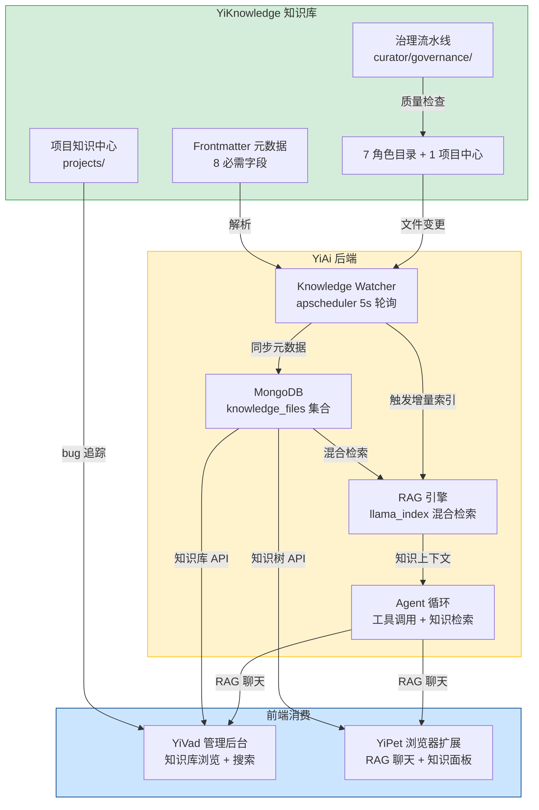

### 0.5 模块职责矩阵

| 模块 | 七月状态 | 八月变更 | 关键决策 |
|------|----------|----------|----------|
| 目录结构 (`YiKnowledge/`) | 不存在 | **新增**：7 角色 + 1 项目中心，3 级目录限制 | 按角色/流水线分类（非技术栈），kebab-case 命名 |
| 元数据规范 (Frontmatter) | 不存在 | **新增**：8 必需字段，YAML 数组 tags，BM25 友好命名 | YAML Frontmatter（非 JSON 侧车文件），单文件自包含 |
| 治理流水线 (`curator/governance/`) | 不存在 | **新增**：4 角色 3 节奏，就绪检查清单，生命周期管理 | 异步审查（不阻塞贡献），质量评分自动降级 |
| Knowledge Watcher (`YiAi`) | 不存在 | **新增**：apscheduler 5s 轮询，mtime+hash 双重检测 | 定时轮询（非 inotify），跨平台兼容 |
| RAG 集成 (`YiAi`) | 不存在 | **新增**：混合检索（BM25+向量），Frontmatter 标签过滤 | 混合检索权重可配置，默认 0.5/0.5 |
| 项目知识中心 (`projects/`) | 不存在 | **新增**：4 项目 bug 追踪，跨项目索引 | 按项目隔离，统一 INDEX.md 导航 |
| 前端消费 (`YiVad`/`YiPet`) | 无知识库功能 | **扩展**：知识库浏览、RAG 聊天、知识面板 | 通过 YiAi API 间接访问，不直接读文件系统 |

---

## 1. 背景与目标

### 1.1 背景

YiKnowledge 作为 YrY 单体仓库的共享知识层，同时服务于人类（文档查阅）和 AI（YiAi Agent 的 RAG 数据源）。八月迭代是知识库的奠基月——从零开始建立结构化知识体系。

在此之前，团队知识分散在飞书文档、Git 注释、本地笔记中，存在以下问题：
- **无结构**：知识散落各处，查找困难
- **无规范**：格式不统一，AI 无法解析
- **无治理**：内容过期无人维护，质量参差不齐
- **无 AI 集成**：知识无法被 AI 检索和利用

### 1.2 目标

| 目标 | 衡量指标 | 当前值 | 目标值 |
|------|----------|--------|--------|
| 知识库结构化 | 角色目录 + 文件数 | 0 | 7 角色 + 800+ 文件 |
| 元数据标准 | Frontmatter 规范 | 无 | 8 必需字段 + YAML 规范 |
| 治理流水线 | 治理角色 + 审查节奏 | 无 | 4 角色 + 3 节奏 |
| AI 集成 | RAG 检索可用 | 无 | 混合检索可用 |
| 项目知识中心 | 项目 bug 追踪 | 无 | 4 项目 |

### 1.3 系统范围

- **涉及**：YiKnowledge 知识库（Markdown 文件树）、YiAi 后端（Knowledge Watcher、RAG 引擎、MongoDB）
- **不涉及**：YiVad/YiPet 前端

---

## 2. 功能清单

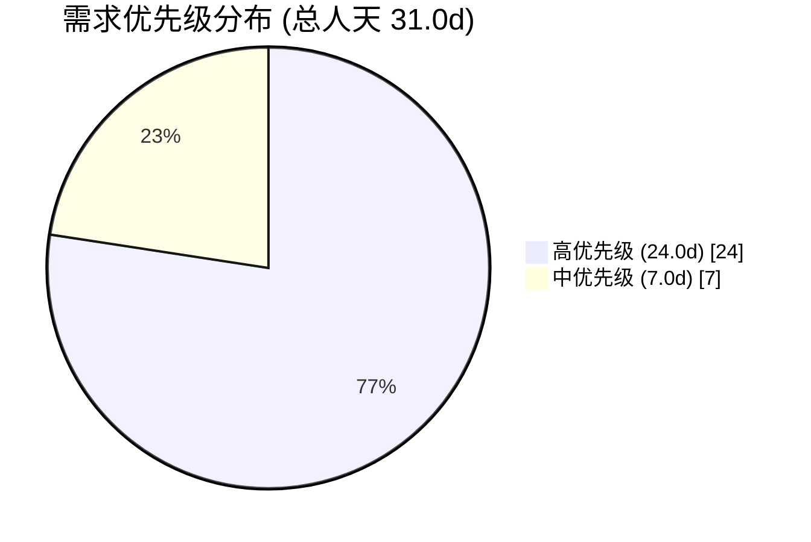

| 月份 | 需求编号 | 功能模块 | 说明 | 优先级 | 人天 | 状态 | 详细文档 |
|----------|----------|------|--------|------|------|----------|
| 2026-08 | YK-08-01 | 目录结构搭建 | 7 角色目录 + 1 项目知识中心，软件交付流水线架构 | 高 | 5.0 | 已完成 | [01-需求-目录结构搭建](./01-架构设计-目录结构搭建.md) |
| 2026-08 | YK-08-02 | 元数据规范 | YAML Frontmatter 规范制定（8 必需字段），RAG 检索优化 | 高 | 3.0 | 已完成 | [02-需求-元数据规范与RAG优化](./02-架构设计-元数据规范与RAG优化.md) |
| 2026-08 | YK-08-03 | 知识治理流水线 | 4 治理角色、3 审查节奏、知识生命周期管理 | 中 | 5.0 | 已完成 | [03-需求-知识治理流水线](./03-架构设计-知识治理流水线.md) |
| 2026-08 | YK-08-04 | AI 集成 | Knowledge Watcher 文件监听、MongoDB 索引同步、llama_index RAG 引擎 | 高 | 8.0 | 已完成 | [04-需求-后端知识监听器与RAG集成](./04-功能实现-后端知识监听器与RAG集成.md) |
| 2026-08 | YK-08-05 | 质量保障 | 10 项就绪检查清单，前置质量门禁 | 中 | 2.0 | 已完成 | [05-质量保证-知识库就绪检查清单](./05-质量保证-知识库就绪检查清单.md) |
| 2026-08 | YK-08-06 | 项目知识中心 | 4 项目统一 bug 追踪、PRD 归档、跨项目检索 | 高 | 8.0 | 进行中 | [06-需求-跨项目问题管理](./06-功能实现-跨项目问题管理.md) |

> **优先级**：高 = 基础设施必需；中 = 质量保障

---

## 3. 功能详情

### 3.1 目录结构搭建 (YK-08-01)

基于软件交付流水线的 7 角色目录 + 1 项目知识中心：

| 角色 | 阶段 | 职责 | 典型内容 |
|------|------|------|----------|
| `executiver/` | 业务策略 | 企业战略、行业分析、组织目标 | OKR、战略方向 |
| `producter/` | 需求发现 | PRD、用户研究、竞品分析 | PRD 模板、需求优先级 |
| `leader/` | 技术决策 | 架构决策、技术选型、风险管控 | ADR、设计评审 |
| `engineer/` | 工程实现 | 代码规范、架构模式、质量保障 | 编码规范、模式目录 |
| `aier/` | AI 工程 | AI 方法论、平台工具、ML 实践 | RAG 调优、Agent 设计 |
| `srer/` | 运维保障 | 事件响应、可观测性、发布管理 | 监控告警、部署流程 |
| `curator/` | 知识治理 | 模板规范、归档管理、质量检查 | 治理流水线、就绪检查 |

### 3.2 元数据规范 (YK-08-02)

统一的 YAML Frontmatter 规范，8 个必需字段：

```yaml
---
title: "文件标题"           # 必需：描述性标题
tags: [tag1, tag2, tag3]   # 必需：YAML 数组，3-5 个标签
category: role/domain      # 必需：分类路径
created: 2026-08-20        # 必需：YYYY-MM-DD
updated: 2026-08-20        # 必需：YYYY-MM-DD
source: internal           # 必需：internal/external
type: summary              # 必需：summary/guide/reference/spec/decision
status: active             # 必需：inbox/triage/active/reference/archived
---
```

### 3.3 知识治理流水线 (YK-08-03)

4 个治理角色 + 3 个审查节奏：

```
Curator (策展人) → Author (作者) → Reviewer (领域专家) → Archivist (归档人)

Daily:   收件箱扫描 + Frontmatter 抽查
Weekly:  分类排空 + 新鲜度扫描 + 死链检查
Quarterly: 全面审计 + 角色边界检查 + 归档清理
```

知识生命周期：`inbox → triage → active → reference → archive`

### 3.4 AI 集成 (YK-08-04)

YiAi 与 YiKnowledge 的深度集成：

```
Knowledge Watcher (apscheduler 5s 轮询)
  → 检测文件 mtime 变更
  → 解析 YAML Frontmatter + Markdown 内容
  → 写入 MongoDB documents 集合
  → 写入 llama_index 向量索引
  → RAG 混合检索（BM25 + 向量）可用
```

### 3.5 质量保障 (YK-08-05)

10 项就绪检查清单：

1. 文件标题清晰描述性
2. 文件在正确的角色目录
3. 文件名遵循 kebab-case
4. 所有必需 Frontmatter 字段存在
5. `benefit:` 字段具体且面向读者
6. `acceptance_criteria:` 可验证
7. 标签 3-5 个且为数组格式
8. 无超过 3 级的目录层级
9. 文件编码为 UTF-8
10. 无死链引用

### 3.6 项目知识中心 (YK-08-06)

4 项目统一 bug 追踪 + PRD 归档：

| 项目 | Bug 追踪 | 需求归档 | 架构文档 |
|------|----------|----------|----------|
| YiVad | 按分类归档 | 2026-08/09 | 完整 |
| YiAi | 按分类归档 | 2026-07/08/09 | 完整 |
| YiPet | 按分类归档 | 2026-07/08/09 | 完整 |
| YiKnowledge | 按分类归档 | 2026-08/09 | 完整 |

---

## 4. 接口协议

### 4.1 RPC 信封协议

YiKnowledge 本身是 Markdown 知识库，不直接调用 RPC 接口。但与 YiAi 的集成通过以下协议：

```
YiAi Knowledge Watcher:
  文件系统轮询 (apscheduler 5s)
    → 解析 YAML Frontmatter + Markdown
    → MongoDB 写入

YiAi RAG 引擎:
  POST /  body: {
    "module_name": "services.rag.rag_service",
    "method_name": "rag_query",
    "parameters": { "query": "问题", "scope": "yivad/architecture" }
  }
  response: { "code": 0, "data": { "sources": [...], "answer": "..." } }
```

### 4.2 Knowledge Watcher 同步协议

```
YiKnowledge 文件树 (Markdown)
  │  apscheduler 5s 轮询检测 mtime 变更
  ▼
Knowledge Watcher
  ├── 解析 Frontmatter (8 必需字段)
  ├── 提取 Markdown 正文
  └── MongoDB 写入
        ├── knowledge_files 集合 (元数据)
        └── documents 集合 (全文 + 向量)
```

### 4.3 前端知识库查询协议

| 调用方 | 方法 | 协议 | 用途 |
|--------|------|------|------|
| YiVad | `knowledge_service.scan` | RPC 信封 | 知识树浏览 |
| YiVad | `knowledge_service.read_file` | RPC 信封 | 文件内容预览 |
| YiPet | `knowledge_service.scan` | RPC 信封 | 知识树浏览 + @提及 |
| YiPet | `knowledge_service.write_file` | RPC 信封 | 保存到知识库 |
| YiPet | `rag_service.rag_query` | RPC 信封 | RAG 检索 |
| YiAi Agent | `rag_service.rag_query` | 内部调用 | Agent 知识库上下文 |

### 4.4 关键数据流

| 流向 | 协议 | 触发方式 | 延迟 |
|------|------|----------|------|
| 文件变更 → MongoDB | apscheduler 轮询 | 自动 (5s) | ≤ 5s |
| MongoDB → FAISS 索引 | 增量/全量重建 | 自动 + 手动 | 增量 < 10s |
| 前端 → 知识树 | RPC 信封 | 用户主动 | < 200ms |
| 前端 → RAG 检索 | RPC 信封 | 用户主动 | < 2s |
| 治理审查 | 策展人手动 | Daily/Weekly/Quarterly | 按节奏 |

---

## 5. 涉及文件

```
YiKnowledge/
├── README.md                              # 新增: 知识库总览 + 设计原则
├── INDEX.md                               # 新增: 导航索引
├── MEMORY.md                              # 新增: 规则手册 + 命名约定
├── QUICKREF.md                            # 新增: 快速参考
├── executiver/                            # 新增: 8 个角色目录
├── producter/
├── leader/
├── engineer/
├── aier/
├── srer/
├── curator/
│   └── governance/
│       ├── governance.md                  # 新增: 治理流水线
│       ├── readiness-checklist.md         # 新增: 10 项就绪检查清单
│       ├── triage.md                      # 新增: 分类队列
│       ├── inbox.md                       # 新增: 收件箱
│       └── review-log.md                  # 新增: 审查日志
├── projects/                              # 新增: 4 项目知识中心
│   ├── INDEX.md                           # 新增: 跨项目索引
│   ├── yivad/{bugs,requirements,architecture}
│   ├── yiai/{bugs,requirements,architecture}
│   ├── yipet/{bugs,requirements,architecture}
│   └── yiknowledge/{bugs,requirements,architecture}
├── skills/                                # 新增: 角色技能矩阵
└── websites/                              # 新增: 外部资源

YiAi/src/domain/knowledge/
├── watcher.py                             # 新增: Knowledge Watcher
├── scanner.py                             # 新增: 文件扫描器
└── writer.py                              # 新增: 文件写入器
```

---

## 6. 数据流

### 6.1 知识贡献与 AI 集成流

```
作者创建/修改 Markdown 文件
  │  就绪检查清单验证 (10 项)
  ▼
Git 提交 → YiKnowledge 文件树
  │  Knowledge Watcher (apscheduler 5s 轮询)
  ▼
MongoDB knowledge_files 集合
  │  Motor 异步写入
  ▼
llama_index FAISS 向量索引
  │  BM25 + 向量混合检索
  ▼
RAG 检索可用
  │  Agent 使用知识库上下文
  ▼
前端 (YiVad/YiPet) 知识库查询
```

### 6.2 治理流水线状态流转

```
inbox (新文件)
  │  Curator 分类 (Daily)
  ▼
triage (待审核)
  │  Reviewer 审核 (Weekly)
  ▼
active (活跃)
  │  90 天未更新 → stale
  │  内容稳定 → reference
  ▼
reference (参考) / stale (陈旧)
  │  180 天未更新 → archive
  ▼
archive (归档)
  │  Archivist 清理 (Quarterly)
  ▼
[*]
```

### 6.3 关键数据流

| 流向 | 协议 | 触发方式 | 延迟 |
|------|------|----------|------|
| 作者 → Git | git push | 手动 | 实时 |
| 文件变更 → MongoDB | apscheduler 轮询 | 自动 (5s) | ≤ 5s |
| MongoDB → FAISS 索引 | 增量/全量重建 | 自动 + 手动 | 增量 < 10s |
| 前端 → RAG 检索 | RPC envelope | 用户主动 | < 2s |
| 治理审查 | 策展人手动 | Daily/Weekly/Quarterly | 按节奏 |

---

## 7. 当前架构 vs 目标架构

### 7.1 当前架构（八月前）

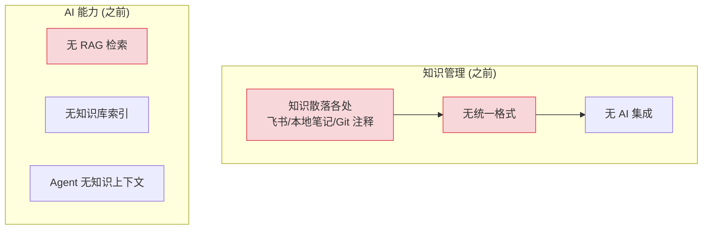

### 7.2 目标架构（八月迭代后）

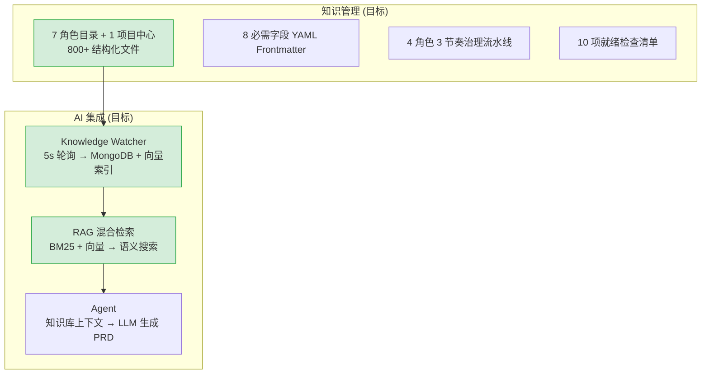

### 7.3 各模块改造前后对比

#### 7.3.1 知识组织

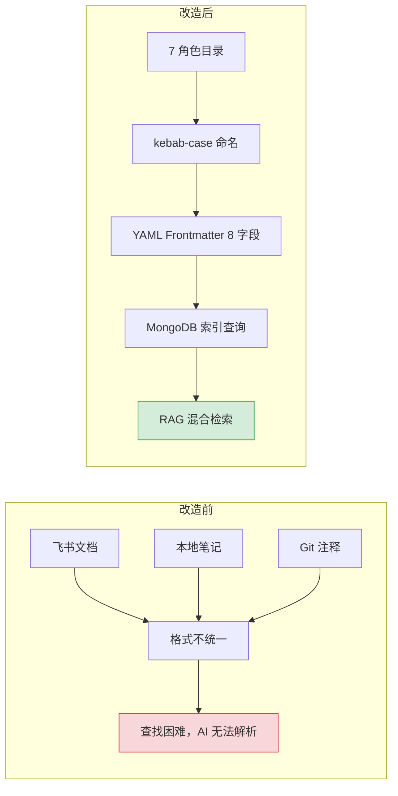

| 维度 | 改造前 | 改造后 | 关键变化 |
|------|--------|--------|----------|
| 存储位置 | 飞书/本地/Git 分散 | YiKnowledge 统一目录树 | 单一数据源，Git 版本控制 |
| 组织结构 | 无规则 | 7 角色目录 + 流水线 | 按角色查找，新人上手快 |
| 文件命名 | 随意（中文/空格/特殊字符） | kebab-case 强制 | BM25 分词友好，URL 安全 |
| 元数据 | 无 | 8 必需字段 YAML Frontmatter | AI 可解析、过滤、排序 |

#### 7.3.2 知识同步

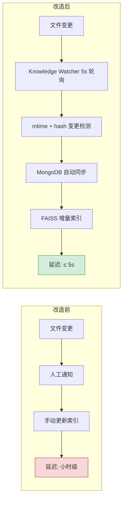

| 维度 | 改造前 | 改造后 | 关键变化 |
|------|--------|--------|----------|
| 同步方式 | 人工通知 → 手动更新 | apscheduler 5s 自动轮询 | 从小时级 → 秒级 |
| 变更检测 | 无（全量覆盖） | mtime + content hash 双重校验 | 仅处理实际变更文件 |
| 数据存储 | 文件系统直读 | MongoDB knowledge_files 集合 | O(1) 索引查询替代 O(n) 扫描 |
| AI 集成 | 无 | RAG 混合检索 | 知识库成为 AI 上下文 |

#### 7.3.3 知识治理

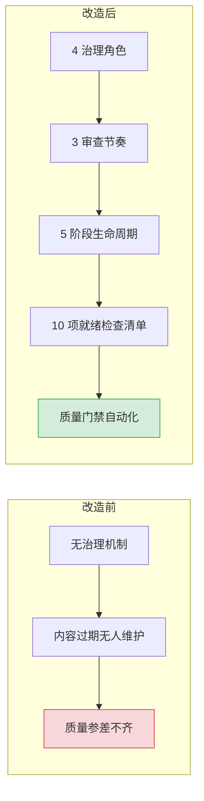

| 维度 | 改造前 | 改造后 | 关键变化 |
|------|--------|--------|----------|
| 治理角色 | 无 | Curator/Author/Reviewer/Archivist | 职责清晰，各司其职 |
| 审查节奏 | 无 | Daily/Weekly/Quarterly | 分级管控，不过度阻塞 |
| 生命周期 | 无 | inbox→triage→active→reference→archive | 5 阶段状态流转 |
| 质量门禁 | 无 | 10 项就绪检查清单 | 前置检查，入库即合格 |

### 7.4 架构决策权衡

| 维度 | 八月前 | 八月后 | 权衡说明 |
|------|--------|--------|----------|
| 知识组织 | 散落各处 | 7 角色目录 + 按角色检索 | 需要学习角色分类，但查找效率大幅提升 |
| 元数据 | 无 | 8 必需字段 YAML Frontmatter | 增加文件编写成本，但 AI 可解析和过滤 |
| 文件命名 | 随意 | kebab-case 强制 | 限制命名灵活性，但 BM25 路径分词友好 |
| 知识同步 | 无 | 5s 轮询 Knowledge Watcher | 5s 延迟可接受，简单可靠 |
| AI 检索 | 无 | BM25 + 向量混合检索 | 检索质量显著提升，但需要 Embedding 模型 |

---

## 8. 目标架构

### 8.1 知识库与 AI 集成流程

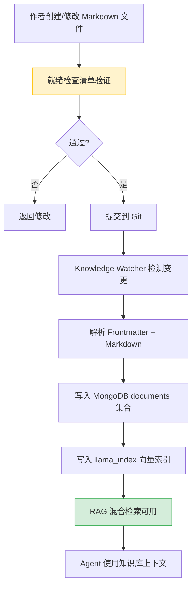

### 8.2 治理流水线状态机

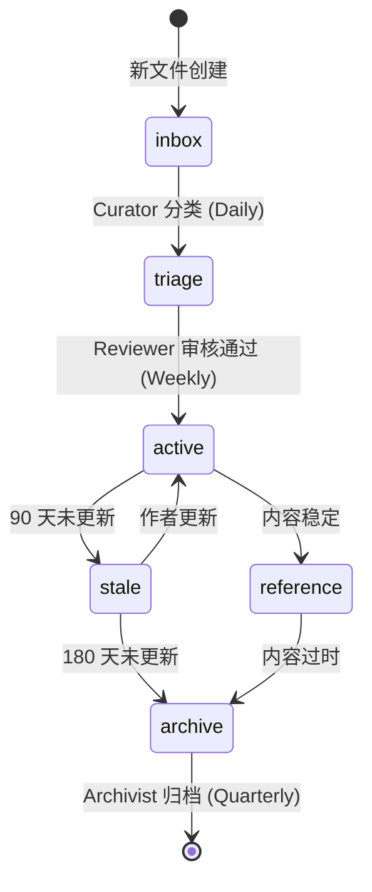

---

## 9. 迁移策略

### 9.1 原则

- **从零搭建**：知识库从零开始，无需迁移存量数据
- **渐进式填充**：先建目录结构，再逐步填充内容
- **模板驱动**：每个角色目录提供 README.md 模板，降低贡献门槛
- **质量门禁**：就绪检查清单在提交前验证，确保入库质量

### 9.2 分步执行

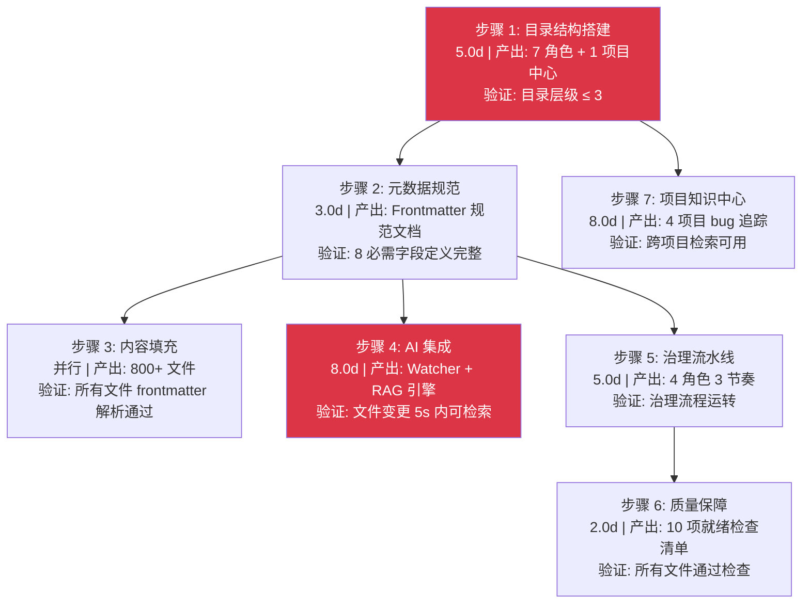

### 9.3 回滚策略

| 步骤 | 回滚方式 | 回滚影响范围 |
|------|----------|-------------|
| 步骤 1-2 | 删除目录结构 | 仅知识库，不影响 YiAi |
| 步骤 3 | `git revert` | 仅内容，不影响结构 |
| 步骤 4 | `git revert <commit>` | 仅 YiAi Knowledge Watcher/RAG，知识文件不受影响 |
| 步骤 5-7 | `git revert <commit>` | 仅治理/项目中心，知识文件不受影响 |

---

## 10. 开发排期

### 10.1 任务依赖

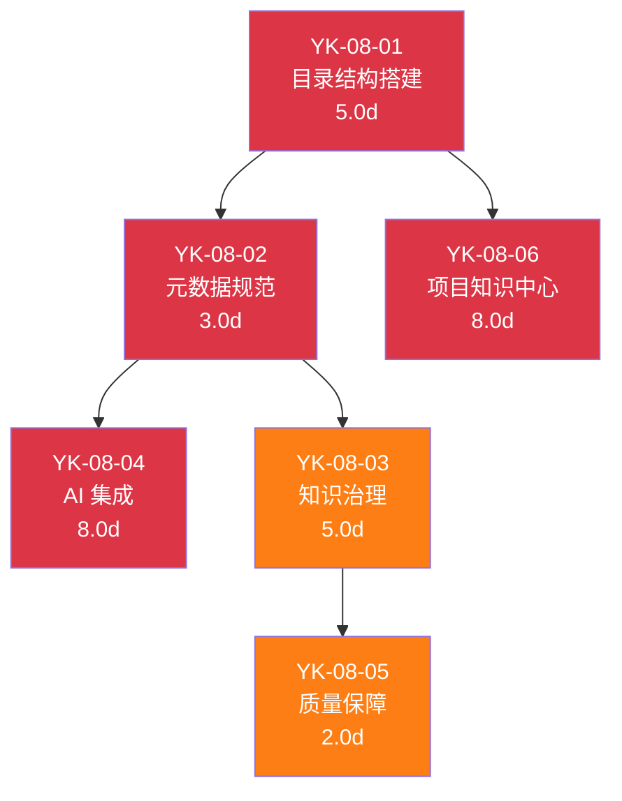

### 10.2 甘特图

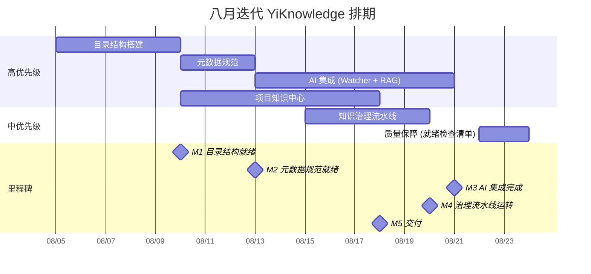

### 10.3 里程碑

| 里程碑 | 完成标准 | 预计日期 |
|--------|----------|----------|
| M1: 目录结构就绪 | 7 角色目录 + 1 项目中心目录创建完成 | 8 月中旬 |
| M2: 元数据规范就绪 | Frontmatter 规范文档完成，就绪检查清单可用 | 8 月中旬 |
| M3: AI 集成完成 | Knowledge Watcher + RAG 引擎可用 | 8 月下旬 |
| M4: 治理流水线运转 | 4 角色 3 节奏治理机制运转 | 8 月底 |
| M5: 项目知识中心就绪 | 4 项目 bug 追踪 + PRD 归档完成 | 9 月上旬 |

---

## 11. 测试策略

### 11.1 验收标准

| # | 验收项 | 标准 |
|----|--------|------|
| 1 | 目录结构 | 7 角色目录 + 1 项目中心，目录层级 ≤ 3 |
| 2 | Frontmatter 规范 | 8 必需字段定义完整，有示例和反例 |
| 3 | 就绪检查清单 | 10 项检查，每项有 pass/fail 标准 |
| 4 | Knowledge Watcher | 文件变更 5s 内检测，正确解析 Frontmatter |
| 5 | RAG 检索 | 混合检索返回相关结果，Top-3 相似度 > 0.7 |
| 6 | 项目知识中心 | 4 项目 bug 追踪 README 完整 |

### 11.2 回归测试用例

| # | 用例 | 操作 | 预期结果 |
|----|------|------|----------|
| 1 | 新增知识文件 | 在 `engineer/` 下创建新 `.md` 文件 | 5s 内被 Knowledge Watcher 索引 |
| 2 | 修改知识文件 | 修改已有文件的 frontmatter | 索引更新，tags 正确 |
| 3 | 删除知识文件 | 删除 `engineer/` 下的文件 | MongoDB 中对应文档删除 |
| 4 | RAG 检索 | 检索已知存在的标签 | 返回相关文件，标签匹配 |
| 5 | 就绪检查清单 | 运行检查脚本 | 所有文件 pass 或明确 fail |

---

## 12. 风险矩阵

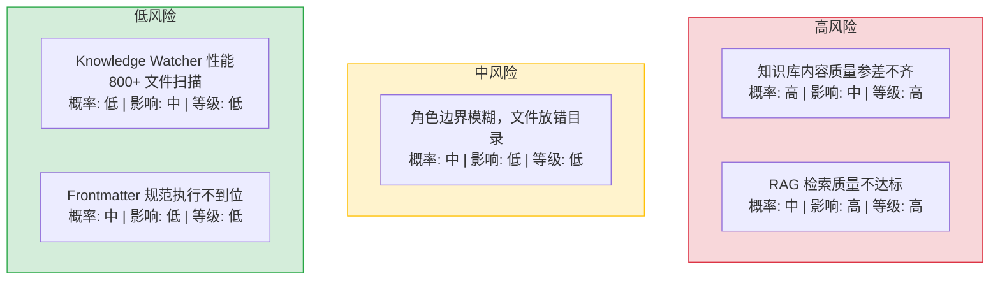

| 风险 | 概率 | 影响 | 等级 | 缓解措施 | 应急预案 |
|------|------|------|------|----------|----------|
| 知识库内容质量参差不齐 | 高 | 中 | 高 | 就绪检查清单 + 治理流水线双重保障 | 策展人集中审查，批量修正不合格文件 |
| RAG 检索质量不达标 | 中 | 高 | 高 | 混合检索（BM25 + 向量）权重可调 + 持续优化 | 调整检索权重，或切换到纯 BM25/纯向量模式 |
| Knowledge Watcher 性能（800+ 文件扫描） | 低 | 中 | 低 | 增量扫描（仅扫描 mtime 变更文件）+ 5s 间隔 | 增加轮询间隔至 30s，或分批扫描 |
| 角色边界模糊，文件放错目录 | 中 | 低 | 低 | 角色边界决策树 + 策展人定期审查 | 批量移动文件，更新交叉引用 |
| Frontmatter 规范执行不到位 | 中 | 低 | 低 | 就绪检查清单自动化校验 + CI 门禁 | 修复脚本批量补充缺失字段 |

---

## 13. 非功能性需求

### 13.1 知识生命周期状态管理

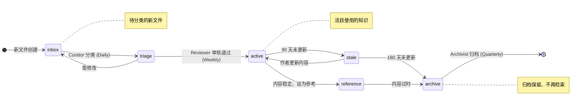

### 13.2 性能预算

| 指标 | 目标 | 测量方式 |
|------|------|----------|
| Knowledge Watcher 轮询 | < 200ms / 1000 文件 | 轮询函数执行时间 |
| RAG 检索延迟 | < 2s（含混合检索 + 重排序） | API 响应时间 |
| Frontmatter 解析 | < 1ms / 文件 | YAML 解析耗时 |
| MongoDB 查询 | < 50ms（索引查询） | MongoDB profiler |
| 就绪检查清单 | < 5s（全量 800+ 文件扫描） | 脚本执行时间 |

### 13.3 代码质量门禁

| 检查项 | 工具 | 通过标准 |
|--------|------|----------|
| Frontmatter 验证 | 自定义脚本 | 8 必需字段存在，tags 数组格式 |
| 文件命名规范 | 自定义脚本 | kebab-case，无下划线/数字 |
| 目录层级 | 自定义脚本 | ≤ 3 级 |
| 死链检查 | `markdown-link-check` | 0 死链 |

### 13.4 可靠性

| 维度 | 要求 |
|------|------|
| Knowledge Watcher | apscheduler 不中断，异常自动恢复 |
| 知识库一致性 | MongoDB 与 YiKnowledge 文件树最终一致（5s 内） |
| 治理流水线 | 策展人审查不阻塞知识贡献，异步审查流程 |
| 跨平台兼容 | macOS/Linux/Docker 环境下 Knowledge Watcher 正常工作 |

### 13.5 可观测性

| 指标 | 采集方式 | 采集频率 | 告警阈值 | 说明 |
|------|----------|----------|----------|------|
| Frontmatter 解析失败率 | Knowledge Watcher 日志计数 | 每次扫描 | > 5% 文件解析失败 | 元数据规范执行情况的先行指标 |
| 文件同步延迟 | `time.time() - mtime` 差值 | 每次扫描 | 延迟 > 30s | Watcher 轮询间隔 5s + 处理时间，超过 30s 表示阻塞 |
| 死链数量 | `markdown-link-check` 输出 | 每次 CI 运行 | > 0 新增死链 | 知识库内部链接完整性 |
| 命名规范违规数 | 命名检查脚本 `--check` | 每次 CI 运行 | > 0 新增违规 | kebab-case、无下划线/数字、3 级目录限制 |
| RAG 检索空结果率 | YiAi RAG 日志计数 | 每次检索 | 空结果率 > 20% | 知识库覆盖度不足或索引质量问题 |
| 治理流水线停滞文件数 | `stale` 状态文件计数 | 每日 | 停滞 > 30 天 | 策展人审查积压，需人工介入 |
| 知识文件增长率 | `git diff --stat` 文件计数 | 每周 | 周增长 > 100 文件 | 知识库膨胀速度，用于容量规划 |
| 项目中心同步延迟 | 项目 INDEX.md 与 git log 时间差 | 每日 | 延迟 > 24h | 项目知识中心与实际项目状态脱节 |

### 13.6 安全合规

| 要求 | 实现方式 | 验证方法 |
|------|----------|----------|
| 知识文件编码规范 | 所有 `.md` 文件强制 UTF-8 无 BOM，CI 检查 `file -bi` 输出 | `find YiKnowledge -name "*.md" -exec file -bi {} \; \| grep -v "utf-8"` 无结果 |
| 敏感信息扫描 | 就绪检查清单包含 `grep -rE "(password|token|secret|api_key)"` 检查项 | CI 流水线自动扫描，命中则阻断合并 |
| 文件权限控制 | 知识文件 `644`，脚本 `755`，CI 检查 `find -perm` | `find . -name "*.md" -perm /022` 无结果（不可组写） |
| 外部链接安全 | `markdown-link-check` 配置 `--no-external` 或手动审查外部链接 | 就绪检查清单要求审查所有外部链接的目标域名 |
| Git 历史敏感信息 | `.gitattributes` 配置 `*.md diff`，pre-commit hook 扫描提交内容 | `git log -p \| grep -i "password\|token"` 无结果 |

---

## 14. 代码审查检查清单

合并前审查人需确认以下项目：

- [ ] 7 角色目录 + 1 项目中心目录结构完整
- [ ] 目录层级不超过 3 级
- [ ] 所有知识文件包含 8 个必需 Frontmatter 字段
- [ ] `tags` 字段为 YAML 数组格式（非字符串）
- [ ] 所有文件名使用 kebab-case（无下划线/数字/空格）
- [ ] 就绪检查清单 10 项全部定义，每项有 pass/fail 标准
- [ ] Knowledge Watcher 正确解析 Frontmatter 并写入 MongoDB
- [ ] RAG 混合检索返回相关结果（Top-3 相似度 > 0.7）
- [ ] 治理流水线 4 角色 3 节奏定义完整
- [ ] 4 项目知识中心 bug 追踪 README 完整
- [ ] 跨项目索引 `projects/INDEX.md` 可用

---

## 15. 设计决策记录

| 决策 | 选项 A | 选项 B | 选择 | 理由 |
|------|--------|--------|------|------|
| 目录结构 | 按技术栈分类 | 按角色/流水线分类 | **按角色/流水线** | 与软件交付流程一致，新人按角色即可找到所需知识 |
| 元数据格式 | YAML Frontmatter | JSON 侧车文件 | **YAML Frontmatter** | 单文件自包含、Markdown 原生支持、Git 友好 |
| 文件命名 | kebab-case | snake_case | **kebab-case** | BM25 路径分词友好（`my-file` → `["my", "file"]`） |
| 知识同步 | 定时轮询 (5s) | 文件系统事件 (inotify) | **定时轮询** | 跨平台兼容、简单可靠、5s 延迟可接受 |
| RAG 检索 | 纯向量检索 | BM25 + 向量混合 | **混合检索** | 关键词 + 语义双重匹配，准确率更高 |

### D-01: 为什么按角色/流水线分类而非技术栈？

技术栈分类（如 `frontend/`、`backend/`、`ai/`）在单体仓库中看似直观，但忽略了知识消费的主要场景——新人入职时按角色定位自己的知识需求。按角色/流水线分类（`executiver/` → `producter/` → `leader/` → `engineer/` → `aier/` → `srer/`）与软件交付流程一一对应，新人按角色即可找到所需知识，无需理解技术栈的边界。

### D-02: 为什么选择 YAML Frontmatter 而非 JSON 侧车文件？

JSON 侧车文件（每个 `.md` 对应一个 `.meta.json`）增加了文件数量和孤儿元数据风险（删除 `.md` 时容易遗留 `.meta.json`）。YAML Frontmatter 内嵌在 Markdown 文件中，单文件自包含，Git 历史中元数据和内容始终同步。这是 Markdown 生态的标准做法（Jekyll、Hugo、Obsidian、GitHub Pages 均使用）。

### D-03: 为什么文件命名使用 kebab-case 而非 snake_case？

BM25 分词器将 `-` 视为单词分隔符，将 `_` 视为单词内部字符。`rag-design-patterns.md` → `["rag", "design", "patterns"]`，用户搜索 "rag"、"design" 或 "patterns" 都能匹配。而 `rag_design_patterns.md` → `["rag_design_patterns"]`，用户必须搜索完整的 `rag_design_patterns` 才能匹配。这是从 BM25 检索精度出发的设计决策，而非风格偏好。

### D-04: 为什么知识同步选择定时轮询而非 inotify？

inotify 是 Linux 特有的文件系统事件机制，在 macOS（FSEvents）和 Windows（ReadDirectoryChanges）上需要不同的实现。定时轮询（apscheduler 每 5s 扫描）跨平台兼容，实现简单，5s 延迟对知识库场景可接受（知识文件的更新频率远低于代码文件）。如果未来需要实时同步，可考虑 watchdog 库作为跨平台 inotify 替代。

### D-05: 为什么 RAG 检索选择混合检索而非纯向量检索？

纯向量检索（embedding → cosine similarity）在语义匹配上表现出色，但对精确关键词匹配（如 "RAG"、"BM25"、"kebab-case"）效果不佳——这些术语在 embedding 空间中可能被误匹配到不相关的文档。混合检索（BM25 + 向量）结合了关键词匹配的精确性和语义匹配的泛化能力。llama_index 的 `HybridSearch` 已内置支持，无需额外实现。

---

## 16. 回归问题预测

| # | 预测问题 | 原因 | 验证方法 |
|---|---------|------|---------|
| 1 | 角色目录结构迁移后，存量文件的 Frontmatter `category` 字段与目录不一致 | 文件从旧目录移动到新目录后，Frontmatter 中的 `category` 字段未同步更新 | 扫描所有文件的 `category` 字段，与文件实际路径对比，检查不一致比例 |
| 2 | 定时轮询 5s 间隔在高频文件更新时遗漏变更 | 同一秒内多次 `git checkout` 或批量文件操作，`mtime` 在两次轮询之间变化多次 | 使用 `touch` 批量更新 100 个文件，检查 Knowledge Watcher 是否全部捕获 |
| 3 | 混合检索的 BM25 权重过高导致语义匹配退化 | BM25 和向量检索的融合权重未调优，关键词匹配过度主导排序结果 | 使用 10 个典型查询对比纯向量、纯 BM25、混合检索的排序结果，人工评估 top-5 相关性 |
| 4 | 知识文件 Frontmatter 缺失导致 MongoDB 索引不完整 | Knowledge Watcher 解析 Frontmatter 失败时静默跳过，RAG 索引中缺少该文件 | 对比文件系统文件数与 MongoDB `knowledge_files` 集合文档数，检查差异 |
| 5 | 目录层级超过 3 级的文件在 RAG 检索中排序靠后 | 深层目录（4 级+）的文件路径在 BM25 中权重较低，检索结果中排名靠后 | 创建一个 4 级目录的测试文件，搜索相关关键词，检查该文件在结果中的排名 |
| 6 | 知识治理流水线中的"过期"标记过于激进 | 30 天未更新的文件自动标记为"过期"，但部分参考文档（如架构决策记录）可能长期有效 | 审查标记为"过期"的文件列表，人工判断是否应该保留 |

---

## 17. 子文档索引

| 月份 | 编号 | 文档 | 需求编号 | 优先级 | 人天 |
|------|------|----------|--------|------|
| 2026-08 | 01 | [架构设计-目录结构搭建](./01-需求-目录结构搭建.md) | YK-08-01 | 高 | 5.0d |
| 2026-08 | 02 | [架构设计-元数据规范与RAG优化](./02-需求-元数据规范与RAG优化.md) | YK-08-02 | 高 | 3.0d |
| 2026-08 | 03 | [架构设计-知识治理流水线](./03-需求-知识治理流水线.md) | YK-08-03 | 中 | 5.0d |
| 2026-08 | 04 | [功能实现-后端知识监听器与RAG集成](./04-需求-后端知识监听器与RAG集成.md) | YK-08-04 | 高 | 8.0d |
| 2026-08 | 05 | [质量保证-知识库就绪检查清单](./05-质量保证-知识库就绪检查清单.md) | YK-08-05 | 中 | 2.0d |
| 2026-08 | 06 | [功能实现-跨项目问题管理](./06-需求-跨项目问题管理.md) | YK-08-06 | 高 | 8.0d |

---

*PRD 来源: `projects/yiknowledge/requirements/2026-08/00-需求-需求总览.md`*