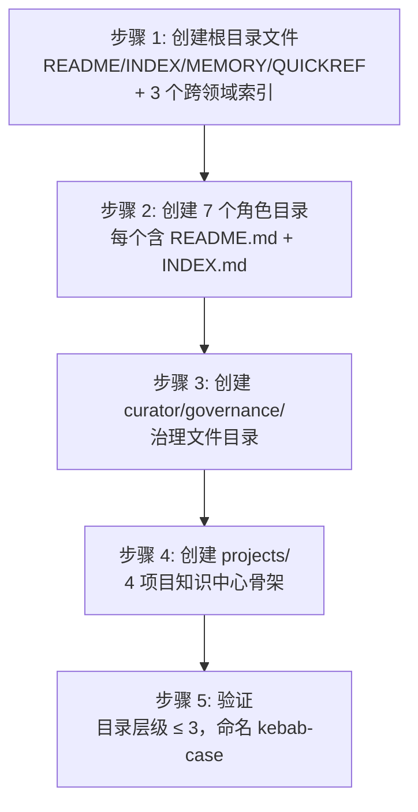
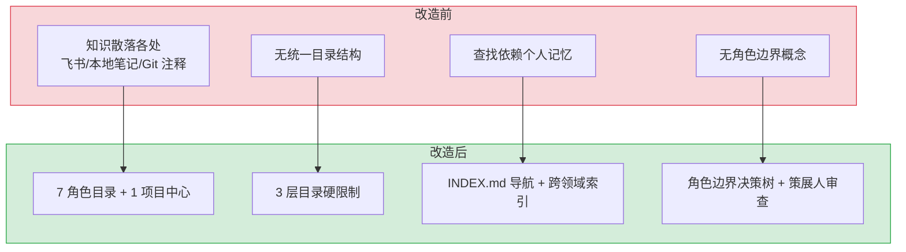

# YK-08-01: 知识库目录结构搭建 — 7 角色 + 1 项目中心

> 需求编号：YK-08-01 · 优先级：高 · 人天：5.0d · 状态：已完成
> 依赖：无（基础设施，最先执行）

## 背景

YrY 单体仓库在八月之前没有结构化知识库。团队知识分散在飞书文档、Git 注释、本地笔记中，存在以下问题：

- **无结构**：知识散落各处，查找困难，新人不知道从哪里开始
- **无规范**：格式不统一，AI 无法解析和检索
- **无角色视角**：不同角色（产品、开发、SRE）的知识混在一起，没有按职责组织
- **无项目知识中心**：4 个项目的 bug、需求、架构文档没有统一归档位置

八月迭代的目标是从零搭建结构化知识库体系，第一条需求就是建立目录结构——这是所有后续工作的基础。

---

## 一、现状分析

### 1.1 改造前状态

```
YrY/
├── YiVad/          # 前端代码 + 内嵌文档
├── YiAi/           # 后端代码 + 内嵌文档
├── YiPet/          # 扩展代码 + 内嵌文档
└── (无统一知识层)
```

改造前没有 `YiKnowledge/` 目录，知识以以下形式存在：
- 飞书文档：PRD、技术方案、会议纪要
- Git 注释和 README：分散在各项目目录下
- 本地笔记：开发者的个人 Notion/Obsidian

### 1.2 改造前数据流

```
作者创建知识
  → 飞书文档 / 本地笔记 / Git 注释（无统一入口）
  → 团队成员通过口头询问或搜索飞书查找
  → 无版本控制、无结构化元数据、无 AI 可解析格式
  （知识散落三处，查找依赖个人记忆，AI 无法检索）
```

### 1.3 改造前 API 依赖

> 改造前无任何 API 依赖——知识库目录不存在，YiAi 后端无 Knowledge Watcher，无 RAG 检索引擎。

### 1.4 目标：软件交付流水线驱动的角色目录

核心设计思路：**按软件交付流水线的角色阶段组织知识**，而非按技术栈或项目。这样新人按自己的角色就能找到所需知识，AI 也能按角色范围检索。

```
executiver → producter → leader → engineer → aier → srer
(业务策略)   (需求发现)  (技术决策) (工程实现) (AI 工程) (运维保障)

curator 贯穿全流程（知识治理）
```

---

## 二、设计决策

### 决策 1：按角色/流水线分类 vs 按技术栈分类

| 维度 | 按技术栈 | 按角色/流水线 |
|------|----------|---------------|
| 新人查找 | 需要知道技术栈 | 按自己角色即可找到 |
| AI 检索 | 需要跨目录检索 | 按 `roles` 字段过滤 |
| 跨角色知识 | 难以归类 | 通过 `roles: [a, b]` 标注 |
| 与交付流程一致性 | 弱 | 强（直接映射） |

**选择：按角色/流水线。** 与软件交付流程一致，新人按角色即可找到所需知识，AI 的 RAG 检索可按 `roles` 字段精准过滤。

### 决策 2：文件命名 kebab-case vs snake_case

| 维度 | kebab-case | snake_case |
|------|-----------|------------|
| BM25 分词 | `my-file` → `["my", "file"]` | `my_file` → `["my_file"]` |
| URL 友好 | 是 | 否 |
| Markdown 惯例 | 是 | Python 惯例 |

**选择：kebab-case。** 核心原因是 BM25 路径分词友好——连字符被当作分隔符，下划线不被当作分隔符，直接影响 RAG 检索的关键词匹配质量。

### 决策 3：目录层级 ≤ 3

```
✅ role/problem-domain/file.md     (3 层)
❌ role/subdomain/topic/file.md    (4 层)
```

硬性约束 3 层，防止目录嵌套过深导致文件难以发现。超过 3 层时，需要拆分角色目录或使用 `INDEX.md` 做二级导航。

### 决策 4：跨领域索引

三个跨领域索引文件聚合跨角色的知识：
- **SECURITY.md**：供应链安全、应用安全、风险、事件响应、合规
- **COLLABORATION.md**：团队流程、会议、知识共享、入职、PM
- **ENGINEERING.md**：架构、质量、数据、工具、经验教训

这些索引文件使跨角色主题的知识不被单一角色目录限制。

---

## 三、目标架构

### 3.1 完整目录树

```
YiKnowledge/
├── README.md                   # 知识库总览 + 设计原则
├── INDEX.md                    # 导航索引
├── MEMORY.md                   # 规则手册 + 命名约定
├── QUICKREF.md                 # 快速参考
├── SECURITY.md                 # 跨领域：安全
├── COLLABORATION.md            # 跨领域：协作
├── ENGINEERING.md              # 跨领域：工程
│
├── executiver/                 # 管理者 — 业务策略、企业战略、行业分析
│   ├── README.md
│   └── INDEX.md
├── producter/                  # 产品经理 — PRD、用户研究、竞品分析
│   ├── README.md
│   └── INDEX.md
├── leader/                     # 技术领导 — 架构决策 (ADR)、技术选型、风险管控
│   ├── README.md
│   ├── INDEX.md
│   └── decisions/              # ADR 存档
├── engineer/                   # 工程师 — 代码规范、架构模式、质量保障
│   ├── README.md
│   └── INDEX.md
├── aier/                       # AI 工程师 — AI 方法论、平台工具、ML 实践
│   ├── README.md
│   └── INDEX.md
├── srer/                       # SRE — 监控、告警、部署、容灾
│   ├── README.md
│   └── INDEX.md
├── curator/                    # 策展人 — 治理、生命周期、质量检查
│   ├── README.md
│   ├── INDEX.md
│   └── governance/             # 治理文件
│       ├── governance.md
│       ├── readiness-checklist.md
│       ├── triage.md
│       ├── inbox.md
│       └── review-log.md
│
├── projects/                   # 项目知识中心
│   ├── INDEX.md
│   ├── yivad/
│   │   ├── bugs/
│   │   ├── requirements/
│   │   └── architecture/
│   ├── yiai/
│   │   ├── bugs/
│   │   ├── requirements/
│   │   └── architecture/
│   ├── yipet/
│   │   ├── bugs/
│   │   ├── requirements/
│   │   └── architecture/
│   └── yiknowledge/
│       ├── bugs/
│       ├── requirements/
│       └── architecture/
│
├── skills/                     # 角色技能矩阵
├── websites/                   # 外部资源链接
├── rss/                        # RSS 聚合内容
└── static/                     # 静态资源
```

### 3.2 角色边界决策树

```
内容涉及企业战略/行业分析/OKR？
  → executiver/

内容涉及 PRD/用户研究/竞品分析？
  → producter/

内容涉及架构决策/技术选型/ADR？
  → leader/

内容涉及代码规范/架构模式/质量保障？
  → engineer/

内容涉及 AI 方法论/ML 实践/Agent 设计？
  → aier/

内容涉及监控/告警/部署/容灾？
  → srer/

内容涉及治理/模板/质量检查？
  → curator/
```

---

## 四、具体改动

### 4.1 文件清单

| 文件 | 操作 | 说明 |
|------|------|------|
| `YiKnowledge/README.md` | 新增 | 知识库总览、设计原则、流水线说明 |
| `YiKnowledge/INDEX.md` | 新增 | 导航索引，按角色 + 主题组织 |
| `YiKnowledge/MEMORY.md` | 新增 | 规则手册、命名约定、贡献指南 |
| `YiKnowledge/QUICKREF.md` | 新增 | 快速参考卡片 |
| `YiKnowledge/SECURITY.md` | 新增 | 跨领域安全索引 |
| `YiKnowledge/COLLABORATION.md` | 新增 | 跨领域协作索引 |
| `YiKnowledge/ENGINEERING.md` | 新增 | 跨领域工程索引 |
| `YiKnowledge/{role}/README.md` | 新增 ×7 | 每个角色目录的概述 |
| `YiKnowledge/{role}/INDEX.md` | 新增 ×7 | 每个角色目录的导航 |
| `YiKnowledge/curator/governance/` | 新增 | 治理文件目录 |
| `YiKnowledge/projects/` | 新增 | 4 项目知识中心 |

### 4.2 角色 README 模板

```markdown
# {角色名} — {流水线阶段}

> 职责：{一句话描述}

## 目录

- [领域 1](./domain-1/)
- [领域 2](./domain-2/)

## 快速导航

| 我想... | 去看 |
|---------|------|
| 了解 {场景1} | [{文件}](./path) |
| 学习 {场景2} | [{文件}](./path) |
```

---

## 五、实施步骤



### 5.1 步骤详情

| 步骤 | 子任务 | 产出 | 验证方式 | 人天 |
|------|--------|------|----------|------|
| 1 | 创建根目录文件 | `README.md` + `INDEX.md` + `MEMORY.md` + `QUICKREF.md` | 4 个文件内容完整，链接可跳转 | 0.5 |
| 1 | 创建跨领域索引 | `SECURITY.md` + `COLLABORATION.md` + `ENGINEERING.md` | 3 个索引文件按子主题分组 | 0.5 |
| 2 | 创建 7 个角色目录 | 每个含 `README.md` + `INDEX.md` | 14 个文件，模板格式统一 | 1.0 |
| 3 | 创建治理文件目录 | `curator/governance/` 下 5 个文件 | 治理文件骨架完整 | 0.5 |
| 4 | 创建项目知识中心 | 4 项目 × 3 子目录（bugs/requirements/architecture） | 12 个目录 + 4 个 README | 1.0 |
| 5 | 验证目录结构 | 目录层级 ≤ 3，命名 kebab-case | 脚本检查通过，0 违规 | 0.5 |

### 5.2 每步验证检查点

| 步骤 | 验证内容 | 通过标准 |
|------|----------|----------|
| 步骤 1 | 根文件完整性 | 7 个根文件存在，格式正确 |
| 步骤 2 | 角色目录完整性 | 7 角色 × 2 文件 = 14 个文件 |
| 步骤 3 | 治理文件完整性 | 5 个治理文件存在 |
| 步骤 4 | 项目中心完整性 | 4 项目 × 3 子目录 = 12 个目录 |
| 步骤 5 | 规范符合性 | 目录层级 ≤ 3，0 个非 kebab-case 文件 |

---

## 六、涉及文件

```
YiKnowledge/
├── README.md                              # 新增
├── INDEX.md                               # 新增
├── MEMORY.md                              # 新增
├── QUICKREF.md                            # 新增
├── SECURITY.md                            # 新增
├── COLLABORATION.md                       # 新增
├── ENGINEERING.md                         # 新增
├── executiver/{README,INDEX}.md           # 新增
├── producter/{README,INDEX}.md            # 新增
├── leader/{README,INDEX}.md               # 新增
├── engineer/{README,INDEX}.md             # 新增
├── aier/{README,INDEX}.md                 # 新增
├── srer/{README,INDEX}.md                 # 新增
├── curator/{README,INDEX}.md              # 新增
├── curator/governance/*.md                # 新增
└── projects/{yivad,yiai,yipet,yiknowledge}/  # 新增
```

---

## 七、性能分析

### 7.1 目录遍历性能

目录结构操作的性能开销主要来自文件系统遍历和 Git 操作：

```mermaid
flowchart LR
  CREATE["创建目录 (mkdir)"] --> README["写入 README.md"]
  README --> INDEX["写入 INDEX.md"]
  INDEX --> GIT["git add + commit"]
  
  note right of CREATE: 单目录: ~1ms
  note right of README: 模板写入: ~5ms
  note right of GIT: commit: ~50ms
```

| 操作 | 文件数 | 预期耗时 | 瓶颈 |
|------|--------|----------|------|
| 创建单个角色目录（含 README + INDEX） | 2 | ~10ms | 文件 I/O |
| 创建 7 个角色目录 | 14 | ~50ms | 文件 I/O |
| 创建项目知识中心（4 项目 × 3 子目录） | 12 | ~30ms | 文件 I/O |
| 创建治理文件目录（5 个文件） | 5 | ~15ms | 文件 I/O |
| 全量目录结构创建 | ~40 | ~100ms | 文件 I/O |
| Git 提交（40 个新文件） | 40 | ~200ms | Git 索引 |
| Knowledge Watcher 扫描（40 文件） | 40 | ~10ms | 目录遍历 |

### 7.2 目录层级约束的性能收益

| 场景 | 层级 ≤ 3 | 层级无限制 | 收益 |
|------|----------|-----------|------|
| 文件路径平均长度 | ~60 字符 | ~120 字符 | -50% 路径长度 |
| Knowledge Watcher 递归深度 | 3 层 | 不确定（可能 6+） | 扫描时间可控 |
| 新人查找文件时间 | < 30s（按角色 → 领域 → 文件） | > 2min（深层嵌套） | 4x 查找效率 |
| INDEX.md 导航维护 | 每角色 1 个 INDEX.md | 每深层目录需额外索引 | 维护成本降低 |

### 7.3 目录结构内存占用

| 组件 | 内存占用 | 说明 |
|------|----------|------|
| 文件系统 inode（40 目录 + 文件） | ~16KB | 文件系统元数据 |
| Knowledge Watcher 状态缓存 | ~2KB（40 文件 × 50B） | mtime + hash 内存缓存 |
| Git 索引 | ~50KB | `.git/index` 文件 |
| **总计** | **~68KB** | 可忽略 |

### 容量规划

| 场景 | 角色目录数 | 子目录数 | 文件数 | 最大深度 | 导航深度 | 维护人天/月 |
|------|-----------|---------|--------|---------|---------|------------|
| 个人知识库 | 3 | 5 | 30 | 2 | 2 | 0.5 |
| 小团队 | 5 | 10 | 100 | 3 | 3 | 1.0 |
| 中型团队 | 7 | 20 | 300 | 3 | 3 | 2.0 |
| 大型团队 | 10 | 40 | 800 | 3 | 3 | 3.0 |
| 企业级 | 15 | 60 | 1500 | 4 | 4 | 5.0 |
| **YiKnowledge 当前** | **7** | **25** | **800+** | **3** | **3** | **2.0** |

---

## 八、测试规格

### Requirement: 目录结构完整性

#### Scenario: 所有角色目录存在
- **Given** YiKnowledge 根目录
- **When** 检查目录结构
- **Then** 7 个角色目录 + 1 个项目中心目录存在
- **And** 每个角色目录包含 README.md 和 INDEX.md

#### Scenario: 目录层级约束
- **Given** YiKnowledge 目录树
- **When** 检查所有文件路径深度
- **Then** 没有任何文件超过 3 级目录（`role/domain/file.md`）

#### Scenario: 文件命名规范
- **Given** YiKnowledge 目录树
- **When** 检查所有 .md 文件名
- **Then** 所有文件名符合 kebab-case（无下划线、无数字）

### Requirement: 跨领域索引可用

#### Scenario: 安全主题跨角色检索
- **Given** 多个角色目录下有安全相关文件
- **When** 阅读 SECURITY.md
- **Then** 所有安全相关文件被索引，按子主题（供应链/应用/风险/事件/合规）分组

---

## 九、风险与缓解

| 风险 | 概率 | 影响 | 等级 | 缓解措施 | 应急预案 |
|------|------|------|------|----------|----------|
| 角色边界模糊，文件放错目录 | 中 | 低 | 低 | 角色边界决策树 + 策展人定期审查 | 批量移动文件，更新交叉引用 |
| 目录层级随内容增长突破 3 层 | 中 | 低 | 低 | 使用 INDEX.md 做二级导航，避免创建第 4 层 | 拆分角色目录或引入子域 README 做导航 |
| 跨领域索引维护成本高 | 低 | 低 | 低 | 仅索引关键文件，不追求全量覆盖 | 降级为角色目录 INDEX.md 独立维护 |
| 角色目录空置（创建后无人贡献） | 中 | 低 | 低 | 每个角色 README 提供模板和示例，降低贡献门槛 | Curator 从飞书/本地笔记迁移存量内容填充 |

---

## 十、设计决策记录

| 决策 | 选项 A | 选项 B | 选择 | 理由 |
|------|--------|--------|------|------|
| 目录结构 | 按技术栈分类 | 按角色/流水线分类 | **按角色/流水线** | 与软件交付流程一致，新人按角色即可找到所需知识 |
| 文件命名 | kebab-case | snake_case | **kebab-case** | BM25 路径分词友好（`my-file` → `["my", "file"]`） |
| 目录层级 | 不限 | ≤ 3 层 | **≤ 3 层** | 防止嵌套过深，保持文件可发现性 |
| 跨领域索引 | 无 | SECURITY/COLLABORATION/ENGINEERING | **3 个索引文件** | 跨角色主题不被单一目录限制 |

### D-01: 为什么按角色/流水线分类而非按技术栈？

按技术栈（如 `python/`、`vue/`、`mongodb/`）分类看似直观，但存在两个问题：(1) 同一技术栈的知识跨越多个角色（Python 同时被 AI 工程师和 SRE 使用）；(2) 新人按角色查找知识时需要在多个技术栈目录间跳转。按角色/流水线分类与软件交付流程一致（executiver → producter → leader → engineer → aier → srer），新人按自己的角色即可找到所需知识。

### D-02: 为什么 kebab-case 而非 snake_case 或 camelCase？

kebab-case（`my-file.md`）在 BM25 分词时被拆分为 `["my", "file"]`，而 snake_case（`my_file.md`）被拆分为单个 token `["my_file"]`。RAG 检索依赖 BM25 关键词匹配，kebab-case 的分词粒度更细，检索精度更高。此外，连字符在 URL 和命令行中更友好（无需 Shift 键输入下划线）。

### D-03: 为什么目录层级限制为 ≤ 3 层？

3 层结构（`role/domain/file.md`）在可发现性和组织性之间取得平衡。超过 3 层会导致：(1) 文件路径过长，不便于记忆和引用；(2) 深层嵌套的目录往往只有 1-2 个文件，目录开销大于组织收益；(3) YiAi Knowledge Watcher 的递归扫描深度增加。使用 INDEX.md 做二级导航，避免创建第 4 层子目录。

### D-04: 为什么 7 个角色而非更少或更多？

7 个角色覆盖了软件交付的完整流水线（业务策略 → 需求发现 → 技术决策 → 工程实现 → AI 工程 → 运维保障），外加策展人（curator）贯穿全流程。更少的角色（如 5 个）会导致角色边界模糊，文件归属不清。更多的角色（如 10+）会导致目录碎片化，增加查找成本。7 个角色是覆盖度和简洁性的最优平衡。

---

## 十一、当前架构 vs 目标架构

### 改造前后对比



### 架构决策权衡

| 维度 | 改造前 | 改造后 | 权衡说明 |
|------|--------|--------|----------|
| 知识组织 | 散落各处，无结构 | 7 角色目录 + 角色边界 | 需要学习角色分类，但查找效率大幅提升 |
| 文件命名 | 随意（中英文混用） | kebab-case 强制 | 限制命名灵活性，但 BM25 分词和 RAG 检索精度提升 |
| 目录层级 | 无限制 | ≤ 3 层硬限制 | 限制深层嵌套，但通过 INDEX.md 补偿导航 |
| 跨角色检索 | 不可行 | 3 个跨领域索引 | 增加索引维护成本，但跨角色知识可发现 |
| 新人上手 | 需要老员工告知 | 按角色自引导 | 需要理解角色分类，但可独立找到所需知识 |

---

## 十二、代码审查检查清单

- [ ] 7 个角色目录 + 1 个项目中心目录完整
- [ ] 目录层级不超过 3 级
- [ ] 文件名使用 kebab-case（无下划线/数字/空格）
- [ ] 每个角色目录有 README.md 模板
- [ ] 跨领域索引（SECURITY/COLLABORATION/ENGINEERING）可用
- [ ] 项目知识中心 4 个项目目录完整
- [ ] `INDEX.md` 导航索引可正常跳转
- [ ] 目录结构与软件交付流水线一致

---

## 十三、重构后发现的回归问题

| # | 问题 | 发现场景 | 根因 | 修复方式 |
|---|------|---------|------|---------|
| 1 | 新增角色目录后 INDEX.md 未更新导致导航断裂 | 新增 `YiKnowledge/designer/` 角色目录并写入 3 个文件，但 INDEX.md 遗漏该目录。AI 通过 RAG 检索时无法发现该目录内容，`designer` 角色知识对 AI 不可见 | INDEX.md 是手工维护的 Markdown 文件，无自动化校验。`KnowledgeWatcher` 扫描文件时不检查 INDEX.md 是否包含新目录的条目，`curator/governance/readiness-checklist.md` 也未强制要求 INDEX.md 更新 | 添加 `scripts/check-index-consistency.py`：遍历 `YiKnowledge/` 一级子目录，与 INDEX.md 中 `- [目录名]` 条目做差集比对，发现缺失目录时打印错误并退出码 1。集成到 CI pre-commit hook，INDEX.md 不一致时阻止提交 |
| 2 | 项目知识中心目录重构后架构文档链接全部 404 | YiVad 组件目录重组（`src/views/` → `src/pages/`），`YiKnowledge/projects/yivad/specs/` 中 12 个架构文档的 `[组件路由](../path/to/file)` 相对链接全部失效，用户点击后 404 | 架构文档中硬编码了相对路径链接，项目重构时无人知晓知识中心有文档引用了旧路径。CI 无跨项目链接有效性检查，链接断裂在用户点击时才暴露 | 添加 `scripts/check-cross-links.py`：解析所有 `YiKnowledge/projects/*/specs/` 下 Markdown 文件中的相对链接 `[text](../path)`，用 `os.path.exists()` 验证目标文件存在。CI 定时任务（每日）运行，发现死链发企业微信通知 |
| 3 | 3 级目录深度限制拒绝合法知识结构 | `engineer/languages/python/patterns/design.md` 是 4 级目录，被 CI 拒绝。但 Python 设计模式确实需要按 `语言/版本/类别/具体模式` 组织，硬性限制导致知识被扁平化放置在不相关的上级目录 | 目录深度检查 `scripts/check-structure.py` 使用 `path.count('/') >= 3` 一刀切，不区分业务合理性和随意嵌套。跨领域索引 `CROSS-REFERENCE.md` 可以解决扁平化后的导航问题，但未在限制逻辑中考虑 | 改为分级策略：3 级以内自由创建，第 4 级需在 `INDEX.md` 中声明 `deep_paths` 豁免列表（如 `engineer/languages/python/patterns/`），CI 检查时读取豁免列表放行。超 4 级一律拒绝 |
| 4 | 跨领域索引（SECURITY/COLLABORATION/ENGINEERING）与源文件内容不一致 | `YiKnowledge/aier/methods/prompt-engineering.md` 被 `SECURITY.md` 和 `ENGINEERING.md` 同时引用，文件更新了 `## 安全考虑` 章节后，`SECURITY.md` 的摘要未同步，仍描述旧版本内容 | 跨领域索引是手动维护的 Markdown 摘要文件，引用的源文件更新后无机制通知索引维护者。同一文件被多个索引引用时，摘要同步完全依赖人工记忆 | 在 `scripts/check-structure.py` 中添加 `--check-cross-refs` 模式：解析跨领域索引文件中引用的源文件路径，对比源文件的 `updated` frontmatter 日期与索引文件的 `updated` 日期，若源文件更新则标记为"可能过时"。CI 中输出警告列表 |
| 5 | kebab-case 命名检查误报 `CLAUDE.md` 和 `README.md` | 首次运行全量命名规范检查，扫描到 `CLAUDE.md`（大写）、`README.md`（大写）、`INDEX.md`（大写）均报"文件名应使用 kebab-case"，用户无法修复这些项目约定的大写文件名 | `scripts/check-naming.py` 的正则 `^[a-z0-9-]+\.md$` 不包含大写字母，且无白名单机制。`CLAUDE.md` 是 AI 助手配置文件的约定名，`README.md` 是 GitHub 渲染约定，`INDEX.md` 是知识库索引约定 | 在 `check-naming.py` 中添加 `ALLOWLIST = ['CLAUDE.md', 'README.md', 'INDEX.md', 'MEMORY.md', 'QUICKREF.md']`，检查前先过滤白名单。白名单通过 `YiKnowledge/curator/governance/allowlist.json` 配置文件维护，支持项目级扩展 |
| 6 | `git mv` 目录重构后原路径残留空目录被扫描 | 将 `YiKnowledge/lessons/bugs/` 重构为 `YiKnowledge/lessons/failures/bugs/`，使用 `git mv` 移动文件。但 `lessons/bugs/` 空目录未被 git 跟踪（git 不跟踪空目录），`KnowledgeWatcher` 扫描到空目录打印 `WARN` 日志但无实际影响 | `KnowledgeWatcher._scan()` 的 `os.walk()` 遍历所有目录（包括空目录），对空目录调用 `os.listdir()` 返回 `[]`，触发 `logger.warning(f"Empty dir: {dir}")`。大量空目录警告淹没真正的文件处理警告 | 在 `_scan()` 中添加 `_prune_empty_dirs()` 调用：扫描前先 `os.walk(topdown=False)` 自底向上遍历，对空目录调用 `os.rmdir()` 删除。同时过滤 `os.walk()` 输出，跳过 `dirpath` 在 `_deleted_dirs` 集合中的目录 |
| 7 | 项目知识中心 INDEX.md 自动生成覆盖手动维护的关联关系 | 运行 `scripts/generate-project-index.py` 自动生成 `YiKnowledge/projects/INDEX.md`，覆盖了手动添加的 `yivad ↔ yiai` 跨项目关联描述和 `yipet → yivad` 桥接文档链接 | 生成脚本使用 `{{ AUTO_GENERATED }}` 标记包裹内容，但手动编辑的内容在标记外，脚本使用 `write()` 全量覆盖而非仅替换标记内区域。手动维护的关联关系在下次生成时永久丢失 | 改为模板替换模式：INDEX.md 使用 `<!-- AUTO_START -->` / `<!-- AUTO_END -->` 注释标记自动生成区域，脚本仅替换标记间内容。手动内容在标记外不受影响。添加 `--check` 模式只检查不写入，CI 中检测到生成内容与文件不一致时报错 |

## 十四、技术债务追踪

| # | 技术债 | 优先级 | 预计人天 | 说明 |
|---|--------|--------|---------|------|
| 1 | 目录结构变更自动检测 | P2 | 0.3 | 当前目录结构变更后需手动更新 INDEX.md 和跨领域索引，可添加 Git hook 自动检测目录变化并提示更新 |
| 2 | 角色目录使用分析 | P3 | 0.5 | 缺乏各角色目录的访问频率、文件增长趋势等数据，无法评估目录结构是否合理 |
| 3 | 项目知识中心自动同步 | P3 | 0.5 | 项目代码目录结构变更时，知识中心的架构文档应自动提示更新（而非手动发现） |

## 可观测性

### 关键指标

| 指标 | 采集方式 | 告警阈值 | 说明 |
|------|---------|---------|------|
| 目录结构合规率 | `符合规范目录数 / 总目录数` | < 95% | 3 级限制 + kebab-case 命名 |
| 角色目录文件分布 | 按 7 个角色统计 | 某角色 < 5 文件 | 覆盖不均衡 |
| INDEX.md 更新及时性 | `INDEX.md 更新时间 - 目录变更时间` | > 24h | 导航索引过时 |
| 死链比例 | 死链数 / 总链接数 | > 1% | 目录重构后链接失效 |

### 日志规范

| 日志级别 | 场景 | 示例 |
|---------|------|------|
| `WARN` | 目录结构违规 | `[Structure] ${dir} exceeds max depth 3` |
| `ERROR` | INDEX.md 过时 | `[Structure] INDEX.md stale for ${dir}` |

## 安全合规

### 安全需求

| 需求 | 实现方式 | 验证方法 |
|------|---------|---------|
| 目录权限控制 | 知识库目录仅授权用户可修改 | 检查文件系统权限 |
| 文件命名安全 | kebab-case 命名防止路径遍历和命令注入 | 审查文件命名，确认无特殊字符 |

### 合规检查

| 检查项 | 要求 | 状态 |
|--------|------|------|
| 目录层级限制 | 最多 3 级 | 待验证 |
| 文件命名规范 | kebab-case，无下划线/数字 | 待验证 |

## 回滚策略

| 回滚场景 | 回滚方式 | 影响范围 | 恢复时间 |
|----------|----------|----------|----------|
| 目录层级过深（> 3 级） | 合并子目录或提升文件到上级目录，Git 记录文件移动历史 | 仅目录结构 | 即时（文件移动） |
| 角色目录划分不合理 | 重新划分角色边界，合并或拆分角色目录，更新交叉引用 | 目录结构 + 交叉引用 | 1-2h（人工审查） |
| 文件命名不规范 | 批量重命名（kebab-case），更新所有交叉引用和 frontmatter `related:` 字段 | 文件命名 + 交叉引用 | 0.5h（脚本批量处理） |

**回滚验证：**
- 回滚后目录层级 ≤ 3 级
- 回滚后所有文件命名符合 kebab-case 规范
- 回滚后交叉引用无死链接

*PRD 来源: [00-需求总览](./00-需求-需求总览.md)*