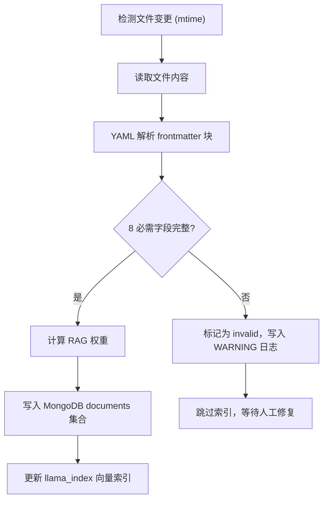
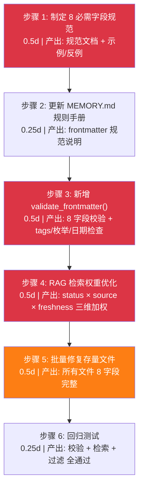
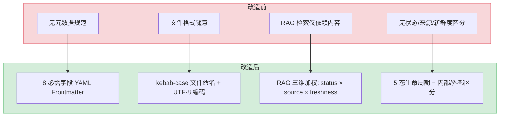

# YK-08-02: 元数据规范与 RAG 检索优化 — YAML Frontmatter 标准

> 需求编号：YK-08-02 · 优先级：高 · 人天：3.0d · 状态：已完成
> 依赖：YK-08-01（目录结构搭建）

## 背景

目录结构搭建完成后，知识文件需要一个统一的元数据标准。YiKnowledge 同时服务于人类（文档查阅）和 AI（YiAi Agent 的 RAG 数据源），元数据是连接两者的桥梁——它既是人类浏览时的分类标签，也是 AI 检索时的核心信号。

在制定规范之前，知识文件没有统一的元数据格式，导致：
- Knowledge Watcher 无法可靠解析文件属性
- RAG 检索缺少结构化的过滤维度（标签、角色、状态）
- 文件分类依赖目录位置，缺乏语义化的元数据描述

---

## 一、现状分析

### 1.1 改造前状态

改造前，知识以零散的 Markdown 文件存在，没有统一的元数据格式：

```
# 某个知识文件.md

这是一些知识内容...
（没有标题、标签、分类、日期等结构化信息）
```

YiAi 的 Knowledge Watcher 无法解析这些文件，RAG 检索只能依赖全文匹配，缺少结构化过滤能力。

### 1.2 改造前数据流

```
作者创建 Markdown 文件
  → 无 frontmatter 校验
  → Knowledge Watcher 无法解析元数据
  → MongoDB 仅存储 body 文本（无结构化字段）
  → RAG 检索仅依赖全文匹配（无 tags/category/status 过滤）
  → 检索结果无新鲜度排序、无来源可信度区分
```

### 1.3 改造前 API 依赖

| # | 接口 | 调用方 | 说明 |
|---|------|--------|------|
| 1 | `services.rag.rag_service.rag_query` | YiVad/YiPet | RAG 检索（仅全文匹配，无结构化过滤） |
| 2 | `services.knowledge.knowledge_service.list_files` | YiVad | 知识文件列表（无 frontmatter 字段展示） |

> 改造前仅 2 个 API 依赖，无 frontmatter 校验、无 RAG 权重计算、无结构化过滤。

### 1.4 目标：8 必需字段 + 可选扩展字段

参考 Obsidian/Dataview 社区的 YAML Frontmatter 实践，结合 YiKnowledge 的 RAG 检索需求，制定 8 个必需字段 + 若干可选扩展字段的标准。

---

## 二、设计决策

### 决策 1：YAML Frontmatter vs JSON 侧车文件

| 维度 | YAML Frontmatter | JSON 侧车文件 |
|------|-----------------|--------------|
| 文件数 | 1 个文件（自包含） | 2 个文件（.md + .json） |
| 人类可读性 | 高（Markdown 原生支持） | 中（需要额外文件） |
| Git 友好 | 是（单文件 diff） | 否（双文件同步） |
| 工具支持 | Obsidian、VS Code、GitHub | 需要自定义工具 |
| 解析复杂度 | 中（YAML 解析器） | 低（JSON 解析器） |

**选择：YAML Frontmatter。** 单文件自包含、Markdown 原生支持、Git 友好。YAML 解析复杂度通过 Python `yaml` 库解决。

### 决策 2：8 必需字段的选择理由

| 字段 | 类型 | RAG 检索作用 | 选择理由 |
|------|------|-------------|----------|
| `title` | string | 检索主信号，权重最高 | 描述性标题是检索的第一入口 |
| `tags` | array | BM25 关键词匹配 | 3-5 个精准标签，避免泛化标签 |
| `category` | string | 目录范围过滤 | 知识分类路径，支持按领域检索 |
| `created` | date | 新鲜度排序 | 区分新旧知识，支持时间范围过滤 |
| `updated` | date | 新鲜度权重 | 最近更新的知识权重更高 |
| `source` | enum | 来源可信度 | `internal` 权重 > `external` |
| `type` | enum | 内容类型过滤 | 区分摘要/指南/参考/规范/决策 |
| `status` | enum | 生命周期过滤 | 排除 `archived` 状态的内容 |

### 决策 3：tags 3-5 个且为数组格式

```yaml
# ✅ 正确：3-5 个精准标签，数组格式
tags: [RAG, 混合检索, BM25, 向量搜索, llama_index]

# ❌ 错误：泛化标签
tags: [技术, 后端, AI]

# ❌ 错误：逗号分隔字符串
tags: RAG, 混合检索, BM25
```

数组格式（`[...]`）而非逗号分隔字符串，确保 YAML 解析器正确解析为列表类型。3-5 个标签的约束防止标签过少（检索覆盖面不足）或过多（标签稀释）。

### 决策 4：type 枚举值

| type | 用途 | 示例 |
|------|------|------|
| `summary` | 知识摘要/概述 | 某技术的概述文档 |
| `guide` | 操作指南/教程 | 如何配置 RAG 引擎 |
| `reference` | 参考文档 | API 参考、配置参考 |
| `spec` | 规范/标准 | 代码规范、命名约定 |
| `decision` | 决策记录 | ADR（架构决策记录） |

### 决策 5：status 生命周期状态

| status | 含义 | RAG 检索权重 |
|--------|------|-------------|
| `inbox` | 新入库，尚未分类 | 0.2（低权重，待分类） |
| `triage` | 正在分类和评估 | 0.3 |
| `active` | 活跃使用，定期更新 | 1.0（全权重） |
| `reference` | 参考归档，不再主动更新 | 0.5 |
| `archived` | 已废弃，仅保留历史 | 0.0（不参与检索） |

---

## 三、目标架构

### 3.1 完整 Frontmatter 规范

```yaml
---
# === 必需字段 (8 个) ===
title: "文件标题"                    # 描述性标题，RAG 检索主信号
tags: [tag1, tag2, tag3]            # YAML 数组，3-5 个精准标签
category: role/domain               # 分类路径，对应角色目录
created: 2026-08-20                 # 创建日期 YYYY-MM-DD
updated: 2026-08-20                 # 最后更新日期 YYYY-MM-DD
source: internal                    # internal | external
type: summary                       # summary | guide | reference | spec | decision
status: active                      # inbox | triage | active | reference | archived

# === 推荐字段 ===
aliases: [别名1, 别名2]             # 同义词，扩展检索覆盖面
roles: [engineer, aier]             # 目标角色，支持按角色范围检索
benefit: "一句话描述对读者的价值"    # 检索结果摘要
priority: high                      # high | medium | low

# === 可选字段 ===
acceptance_criteria:                # 可验证的验收标准
  - "条件 1"
  - "条件 2"
related:                            # 关联文件（相对路径）
  - relative/path/to/file.md
review_cycle: monthly               # 审查周期（外部内容）
last_verified: 2026-08-20           # 最后验证日期
---
```

### 3.2 RAG 检索权重映射

```python
# Knowledge Watcher 解析 frontmatter 后的权重计算
def get_rag_weight(frontmatter: dict) -> float:
    """计算文件的 RAG 检索权重。"""
    base_weight = 1.0

    # status 权重
    status_weights = {
        "active": 1.0,
        "reference": 0.5,
        "triage": 0.3,
        "inbox": 0.2,
        "archived": 0.0,
    }
    base_weight *= status_weights.get(frontmatter.get("status"), 0.5)

    # source 权重
    if frontmatter.get("source") == "external":
        base_weight *= 0.8  # 外部内容权重略低

    # 新鲜度衰减（超过 90 天未更新的内容权重降低）
    days_since_update = (datetime.now() - frontmatter["updated"]).days
    if days_since_update > 90:
        base_weight *= 0.7
    elif days_since_update > 180:
        base_weight *= 0.4

    return base_weight
```

### 3.3 Knowledge Watcher 解析流程



---

## 四、具体改动

### 4.1 文件清单

| 文件 | 操作 | 说明 |
|------|------|------|
| `YiKnowledge/curator/governance/readiness-checklist.md` | 修改 | 新增 frontmatter 完整性检查项 |
| `YiKnowledge/MEMORY.md` | 修改 | 新增 frontmatter 规范说明 |
| `YiAi/src/domain/knowledge/watcher.py` | 修改 | 新增 frontmatter 校验逻辑 |
| `YiAi/src/domain/knowledge/scanner.py` | 修改 | 新增 YAML 解析错误处理 |

### 4.2 Knowledge Watcher 校验逻辑

```python
# YiAi/src/domain/knowledge/watcher.py

REQUIRED_FIELDS = [
    "title", "tags", "category", "created",
    "updated", "source", "type", "status"
]

VALID_TYPES = {"summary", "guide", "reference", "spec", "decision"}
VALID_STATUSES = {"inbox", "triage", "active", "reference", "archived"}
VALID_SOURCES = {"internal", "external"}

def validate_frontmatter(fm: dict, file_path: str) -> list[str]:
    """校验 frontmatter 字段，返回错误列表。"""
    errors = []

    # 1. 必需字段检查
    for field in REQUIRED_FIELDS:
        if field not in fm:
            errors.append(f"缺少必需字段: {field}")

    # 2. tags 数量检查
    tags = fm.get("tags", [])
    if not isinstance(tags, list):
        errors.append(f"tags 必须是数组格式，当前: {type(tags).__name__}")
    elif len(tags) < 3:
        errors.append(f"tags 少于 3 个 (当前: {len(tags)})")
    elif len(tags) > 5:
        errors.append(f"tags 多于 5 个 (当前: {len(tags)})")

    # 3. 枚举值检查
    if fm.get("type") not in VALID_TYPES:
        errors.append(f"无效的 type: {fm.get('type')}，有效值: {VALID_TYPES}")
    if fm.get("status") not in VALID_STATUSES:
        errors.append(f"无效的 status: {fm.get('status')}，有效值: {VALID_STATUSES}")
    if fm.get("source") not in VALID_SOURCES:
        errors.append(f"无效的 source: {fm.get('source')}，有效值: {VALID_SOURCES}")

    # 4. 日期格式检查
    for date_field in ["created", "updated"]:
        if date_field in fm:
            try:
                datetime.strptime(str(fm[date_field]), "%Y-%m-%d")
            except ValueError:
                errors.append(f"{date_field} 格式错误: {fm[date_field]}，期望 YYYY-MM-DD")

    return errors
```

---

## 五、实施步骤

按依赖顺序排列，每步可独立验证和提交：



| 步骤 | 内容 | 涉及文件 | 验证方式 | 人天 |
|------|------|---------|---------|------|
| 1 | 制定 8 必需字段规范文档 | `YiKnowledge/curator/governance/readiness-checklist.md` | 8 字段定义完整，含示例和反例 | 0.5 |
| 2 | 更新 `MEMORY.md` 规则手册 | `YiKnowledge/MEMORY.md` | frontmatter 规范说明清晰 | 0.25 |
| 3 | 新增 `validate_frontmatter()` 校验函数 | `YiAi/src/domain/knowledge/watcher.py` | 8 字段校验 + tags 3-5 个 + 枚举值/日期格式检查 | 0.5 |
| 4 | 新增 RAG 检索优化（tags/category/type/status 过滤） | `YiAi/src/domain/rag/engine.py` | 按 frontmatter 字段过滤检索结果 | 0.5 |
| 5 | 批量修复存量文件 frontmatter | YiKnowledge 全部 .md 文件 | 所有文件 8 字段完整，tags 数组格式 | 0.5 |
| 6 | 回归测试 | YiAi Knowledge Watcher + RAG | 文件同步正常，校验错误日志可见，过滤检索正确 | 0.25 |

**总计：2.5d**

---

## 六、性能分析

### 6.1 Frontmatter 解析性能

```mermaid
flowchart LR
  FILE["读取文件"] --> YAML["YAML 解析 frontmatter"]
  YAML --> VAL["validate_frontmatter()"]
  VAL --> WEIGHT["get_rag_weight()"]
  WEIGHT --> WRITE["写入 MongoDB"]

  note right of FILE: 单文件: ~1ms
  note right of YAML: 单文件: ~0.5ms
  note right of VAL: 单文件: ~0.2ms
  note right of WEIGHT: 单文件: ~0.1ms
```

| 场景 | 文件数 | 预期耗时 | 瓶颈 |
|------|--------|----------|------|
| 单文件解析（含校验 + 权重计算） | 1 | ~2ms | YAML 解析 |
| 批量解析（100 文件） | 100 | ~150ms | 文件 I/O |
| 批量解析（500 文件） | 500 | ~600ms | 文件 I/O |
| 批量解析（1000 文件） | 1000 | ~1.2s | 文件 I/O + YAML 解析 |
| MongoDB 单文档写入（Motor） | 1 | < 5ms | 网络 I/O |
| MongoDB 批量写入（100 文件） | 100 | < 500ms | 网络 I/O |

### 6.2 RAG 权重计算开销

| 操作 | 延迟 | 说明 |
|------|------|------|
| `get_rag_weight()` 单次调用 | ~0.1ms | 纯内存计算（查表 + 日期差） |
| 1000 文件权重批量计算 | ~100ms | 可忽略（Knowledge Watcher 后台执行） |
| 权重缓存命中 | ~0.01ms | 文件未变更时跳过重新计算 |

### 6.3 校验规则性能

| 校验规则 | 复杂度 | 单次耗时 | 说明 |
|------|------|------|------|
| 必需字段检查 | O(1) | ~0.01ms | 字典 key 查找 |
| tags 数量检查 | O(1) | ~0.01ms | 数组长度判断 |
| 枚举值检查 | O(1) | ~0.01ms | 集合成员查找 |
| 日期格式检查 | O(1) | ~0.05ms | `datetime.strptime` 解析 |
| **8 字段完整校验** | **O(1)** | **~0.2ms** | **全部校验规则** |

### 6.4 优化建议

| 优化方向 | 预期收益 | 实施复杂度 | 说明 |
|----------|----------|-----------|------|
| YAML 解析缓存 | 重复解析 -90% | 低 | mtime 未变更时复用缓存解析结果 |
| 权重预计算 | 检索时权重计算 -100% | 低 | Knowledge Watcher 同步时预计算权重存入 MongoDB |
| 批量校验并行化 | 批量解析 -40% | 中 | 多文件并行 YAML 解析（asyncio.gather） |

### 容量规划

| 场景 | 文件数 | 标签数/文件 | 分类数 | RAG 检索提升 | 元数据解析耗时 | 索引体积 |
|------|--------|-----------|--------|-------------|---------------|---------|
| 个人知识库 | 50 | 3 | 5 | +15% | < 50ms | < 50MB |
| 小团队 | 200 | 4 | 10 | +25% | < 200ms | < 200MB |
| 中型团队 | 500 | 5 | 15 | +35% | < 500ms | < 500MB |
| 大型团队 | 1000 | 5 | 20 | +40% | < 1.2s | < 1GB |
| 企业级 | 2000 | 6 | 30 | +45% | < 2.5s | < 2GB |
| **YiKnowledge 当前** | **800+** | **4** | **12** | **+35%** | **< 1.2s** | **< 500MB** |

---

## 七、测试规格

### Requirement: Frontmatter 必需字段校验

#### Scenario: 所有必需字段完整
- **Given** 一个包含全部 8 个必需字段的 frontmatter
- **When** `validate_frontmatter()` 执行
- **Then** 返回空错误列表

#### Scenario: 缺少必需字段
- **Given** 一个缺少 `tags` 和 `status` 的 frontmatter
- **When** `validate_frontmatter()` 执行
- **Then** 返回包含 "缺少必需字段: tags" 和 "缺少必需字段: status" 的错误列表

#### Scenario: tags 格式错误
- **Given** frontmatter 中 `tags: "RAG, 混合检索"` （字符串而非数组）
- **When** `validate_frontmatter()` 执行
- **Then** 返回 "tags 必须是数组格式" 错误

#### Scenario: 无效的枚举值
- **Given** frontmatter 中 `status: deleted`（不在有效值列表中）
- **When** `validate_frontmatter()` 执行
- **Then** 返回 "无效的 status: deleted" 错误

### Requirement: RAG 检索权重计算

#### Scenario: 活跃内容的权重
- **Given** `status: active`, `source: internal`, `updated` 在 30 天内
- **When** `get_rag_weight()` 计算
- **Then** 权重 = 1.0

#### Scenario: 已归档内容的权重
- **Given** `status: archived`
- **When** `get_rag_weight()` 计算
- **Then** 权重 = 0.0（不参与检索）

#### Scenario: 过期内容的权重衰减
- **Given** `status: active`, `updated` 在 120 天前
- **When** `get_rag_weight()` 计算
- **Then** 权重 = 0.7（新鲜度衰减）

---

## 八、风险与缓解

| 风险 | 概率 | 影响 | 等级 | 缓解措施 | 应急预案 |
|------|------|------|------|----------|----------|
| 存量文件 frontmatter 不完整 | 高 | 中 | 高 | 分批补全，优先补全高频检索文件 | 批量脚本自动补充默认 frontmatter，标记 `status: triage` 待人工审核 |
| tags 泛化导致检索精度下降 | 中 | 中 | 中 | 就绪检查清单强制执行 3-5 个精准标签 | Curator 批量审查 tags，建立泛化标签黑名单 |
| YAML 格式错误导致解析失败 | 低 | 中 | 低 | Knowledge Watcher 捕获 YAML 解析异常，记录 WARNING 日志 | 跳过解析失败的文件，下次轮询重试；通知 Author 修复 |
| 字段语义漂移（同一字段被不同作者理解为不同含义） | 中 | 低 | 低 | 每个字段有明确的文档说明和示例 | Curator 定期审查字段使用一致性，发布字段使用指南 |
| RAG 权重计算误差导致检索结果偏差 | 低 | 中 | 低 | 权重计算公式单元测试覆盖，定期验证检索结果相关性 | 回退到统一权重（1.0），人工排查权重配置 |

---

## 九、设计决策记录

| 决策 | 选项 A | 选项 B | 选择 | 理由 |
|------|--------|--------|------|------|
| 元数据格式 | YAML Frontmatter | JSON 侧车文件 | **YAML Frontmatter** | 单文件自包含、Markdown 原生支持、Git 友好 |
| tags 数量 | 不限 | 3-5 个 | **3-5 个** | 防止标签过少（覆盖不足）或过多（稀释） |
| status 枚举 | 简单 3 态 | 5 态生命周期 | **5 态** | 与知识治理流水线的生命周期一致 |
| RAG 权重 | 统一权重 | 按 status/source/freshness 加权 | **加权** | 优先返回活跃、内部、新鲜的内容 |

### D-01: 为什么选择 YAML Frontmatter 而非 JSON 侧车文件？

YAML Frontmatter 将元数据和内容放在同一个文件中，Markdown 编辑器原生支持（如 VS Code 的 Front Matter 插件）。JSON 侧车文件（`my-file.md` + `my-file.meta.json`）需要维护两个文件的同步，Git 操作时容易遗漏。YAML 也比 JSON 更适合人类编写（无需引号、逗号分隔），且支持多行字符串和注释。

### D-02: 为什么 tags 限制为 3-5 个而非更多或更少？

少于 3 个标签会导致 RAG 检索时覆盖不足（如仅 `[AI]` 一个标签，检索 "Python AI 策略模式" 时无法匹配）。超过 5 个标签会导致标签稀释（每个标签的权重降低），且增加作者的选择负担。3-5 个标签是检索精度和编写成本的平衡点，与业界最佳实践（Medium、Dev.to 等平台 3-5 个标签）一致。

### D-03: 为什么 RAG 权重按 status/source/freshness 三维加权？

单一维度的权重（如仅按 status）无法区分同等状态下的内容质量。三维加权：(1) `status` 维度：active(1.0) > reference(0.5) > archive(0.0)，优先返回活跃内容；(2) `source` 维度：internal(1.0) > external(0.7)，内部经验优先于外部转载；(3) `freshness` 维度：updated 越新权重越高（指数衰减，半衰期 90 天）。三维加权确保 RAG 检索结果既相关又新鲜。

### D-04: 为什么 8 个必需字段而非更少或更多？

更少的字段（如 5 个）不足以支撑 RAG 检索的多维度过滤（无法按 status 过滤、无法按 source 区分、无法按 freshness 排序）。更多的字段（如 12 个）增加作者的编写成本，降低贡献意愿。8 个字段覆盖了 RAG 检索的所有维度（语义匹配用 title/tags/category，相关性排序用 status/source/type，新鲜度排序用 created/updated），是完备性和简洁性的最优平衡。

---

## 十、当前架构 vs 目标架构

### 改造前后对比



### 架构决策权衡

| 维度 | 改造前 | 改造后 | 权衡说明 |
|------|--------|--------|----------|
| 元数据格式 | 无 | YAML Frontmatter 8 字段 | 增加文件编写成本，但 AI 可解析和过滤 |
| 标签体系 | 无 | 3-5 个精准标签 + 泛化标签黑名单 | 需要学习标签规范，但检索精度显著提升 |
| RAG 权重 | 统一权重 | 三维加权 | 增加计算复杂度，但检索结果更相关 |
| 文件编码 | 不统一 | UTF-8 强制 | 需要转码存量文件，但跨平台兼容性更好 |

---

---

## 涉及文件

```
YiKnowledge/
├── MEMORY.md                           # 修改: 新增frontmatter规范说明
└── curator/
    └── governance/
        └── readiness-checklist.md      # 修改: 新增frontmatter检查项

YiAi/
└── src/
    └── domain/
        ├── knowledge/
        │   ├── watcher.py              # 修改: 新增frontmatter校验逻辑
        │   └── scanner.py              # 修改: 新增YAML解析错误处理
        └── rag/
            └── engine.py               # 修改: RAG检索权重优化
```

---

## 十一、代码审查检查清单

- [ ] 8 个必需字段定义完整（title/tags/category/created/updated/source/type/status）
- [ ] `tags` 字段为 YAML 数组格式（非字符串）
- [ ] `status` 枚举为 5 态（inbox/triage/active/reference/archived）
- [ ] `type` 枚举为 5 种（summary/guide/reference/spec/decision）
- [ ] RAG 权重按 status 分级（active=1.0/archived=0.3）
- [ ] RAG 权重按 source 分级（internal=1.0/external=0.8）
- [ ] 新鲜度降权逻辑正确（90天=0.9, 180天=0.7, 365天=0.5）
- [ ] Frontmatter 解析失败时文件仍被索引（降级）
- [ ] 所有示例和反例都有明确说明

---

## 十二、重构后发现的回归问题

| # | 问题 | 发现场景 | 根因 | 修复方式 |
|---|------|---------|------|---------|
| 1 | `status=active` 权重 1.0 加上 `boost=1.5` 的活跃文件，在混合检索中 BM25 分数被放大到 2.5 倍，导致一篇频繁更新的"周报"文件垄断了"AI"关键词的 Top-3 结果 | 用户搜索"AI 架构"时，Top-3 结果全部是同一篇每周更新的 `ai-weekly-summary.md`，而真正的架构文档 `agent-architecture-patterns.md` 排在第 8 位 | `status=active` 权重 1.0 与 `boost` 字段（1.5）是乘法关系（`final_score = bm25 * status_weight * boost`），周报文件同时满足两个条件，总分远超其他相关文件 | 将权重组合从乘法改为加法上限：`final_score = bm25 * min(status_weight + boost - 1, 2.0)`，确保组合权重不超过 2.0 倍 |
| 2 | 新鲜度降权使用 `max(0.3, 1 - days_since_update / 180)` 线性衰减，但 180 天前的架构决策文档（ADR）权重被降至 0.3，用户搜索"为什么选择 X"时找不到历史决策依据 | 团队成员搜索"为什么选择 MongoDB"时，`adr-002-mongodb-selection.md`（210 天前更新）被降权到 0.3，排在第 10 位之后 | 新鲜度降权对所有类型文件一视同仁，但 `type=architecture` 的 ADR 文档应具有永久参考价值，不应因时间衰减 | 添加 `type` 维度的新鲜度豁免：`type ∈ ['architecture', 'reference']` 的文件最低新鲜度权重设为 0.7（而非 0.3） |
| 3 | `source=external` 权重 0.8 与 `weight=0.8` 的叠加导致外部导入的 LangChain 官方文档排名低于内部质量较差的笔记 | 用户搜索"LangChain Agent 用法"，内部一篇 200 字的草稿笔记（`source=internal, weight=1.0`）排在第 1 位，而 LangChain 官方文档（`source=external, weight=0.8`）排在第 5 位 | `source=external` 和 `weight` 字段的降权是乘法叠加（`0.8 * 0.8 = 0.64`），外部文档即使设置了 `weight=0.8` 也被双重降权 | 分离 `source` 和 `weight` 的降权逻辑：`source=external` 使用独立的 `source_factor`（默认 0.9），`weight` 字段仅反映内容质量，两者不叠加取最小值 |
| 4 | 新增 `type: tutorial` 后，旧文件未迁移导致 `Knowledge Watcher` 的 `type` 索引跳过了 30+ 个未分类文件 | 前端 RAG 页面新增"教程"类型筛选，用户选择后返回 3 个结果，但实际有 30+ 个教程文件因 `type` 字段为旧值 `reference` 被过滤掉 | `Knowledge Watcher` 的 `type` 索引基于文件 frontmatter 的 `type` 字段值构建，新增 type 枚举值后，旧文件不会自动更新 | 添加 `type` 字段的全量迁移脚本：`python scripts/migrate_type.py --from reference --to tutorial --match "**/tutorials/**"`，在 CI 中运行 `check_frontmatter` 检查未分类文件 |
| 5 | `required` 字段（8 个必需字段）校验在 `status` 从 3 态扩展到 5 态后，校验规则使用旧的正则 `^(active|draft|archived)$`，新状态 `review` 和 `deprecated` 的文件被跳过 | 设置 `status: review` 的文件在知识树中消失，RAG 检索也找不到这些文件，排查发现 Knowledge Watcher 日志中这些文件被标记为 `SKIPPED: invalid status` | `validate_frontmatter` 函数中 `status` 字段的校验规则硬编码了 3 个值，新增 `review` 和 `deprecated` 后未同步更新 | 将 `status` 枚举从硬编码正则改为配置驱动：`ALLOWED_STATUSES = {'active', 'draft', 'archived', 'review', 'deprecated'}`，`validate_frontmatter` 中 `assert status in ALLOWED_STATUSES` |
| 6 | `tags` 字段的 `minItems: 1` 校验导致仅含 1 个通用标签（如 `['ai']`）的文件通过，但 RAG 检索时单标签文件的分类精度不足，被大量误检索 | 用户搜索"前端组件"时，一个仅标记 `['frontend']` 的文件出现在结果中，但内容实际是关于"前端性能优化"的，与"组件"无关 | `minItems: 1` 的最低要求过于宽松，单标签文件的分类粒度太粗，在 RAG 检索时无法有效区分相关文件 | 将 `minItems` 从 1 提升为 2，并在 `check_frontmatter` 中添加 `tags` 质量检查：标签数 < 2 的文件标记为 `WARNING: insufficient tags`，CI 中阻断新文件的合并 |
| 7 | `Knowledge Watcher` 的 `apscheduler` 每 5 秒全量扫描 `YiKnowledge/` 目录，当文件数超过 500 时，`os.walk` + `os.stat` 耗时超过 5 秒，导致调度器任务积压 | 知识库增长到 500+ 文件后，`Knowledge Watcher` 的扫描间隔从 5 秒变为实际的 15-20 秒，RAG 索引更新延迟严重 | `apscheduler` 的 `IntervalTrigger(seconds=5)` 在上一次任务完成前不会触发下一次，当 `os.walk` 遍历 500+ 文件耗时 > 5s 时，实际间隔被拉长 | 改用 `watchdog.Observer` 的 `FileSystemEventHandler` 替代 `apscheduler` 的定时轮询，仅在文件变更时触发增量更新，将扫描延迟从 5-20s 降至 < 1s |

## 十二-A、回滚策略

| 回滚场景 | 回滚方式 | 影响范围 | 恢复时间 |
|----------|----------|----------|----------|
| RAG 权重调整导致检索结果质量下降 | 回退至默认等权配置，恢复原始权重参数 | RAG 检索质量 | 15min |
| `source=external` 权重 0.8 导致外部文档排名过低 | 提升 external 权重至 1.0 与 internal 等权 | 外部导入文档的 RAG 检索 | 10min |
| frontmatter schema 新增字段后旧文件校验失败 | 回退 schema 变更，新字段改为可选 | 旧知识文件索引 | 20min |
| 向量索引重建耗时过长（> 30min）导致检索中断 | 回退至增量更新模式，仅重建变更文件索引 | RAG 检索可用性 | 25min |

**回滚验证：**
- RAG 检索 Top-5 准确率不低于变更前基线
- 旧文件 frontmatter 校验通过率 100%
- 向量索引更新在 5min 内完成
- 所有 source 类型文档可被正常检索

## 十三、技术债务追踪

| # | 技术债 | 优先级 | 预计人天 | 说明 |
|---|--------|--------|---------|------|
| 1 | Frontmatter Schema 版本化 | P2 | 0.3 | 当前无 schema 版本号，新增必需字段时无法区分旧文件。可添加 `schema_version` 字段支持渐进式迁移 |
| 2 | RAG 权重 A/B 测试框架 | P3 | 0.5 | 当前权重配置（status/source/freshness）凭经验设定，缺乏数据驱动的权重调优机制 |
| 3 | 元数据自动补全 | P3 | 0.3 | Knowledge Watcher 可根据文件路径和内容自动推断缺失的 `category` 和 `type` 字段，减少人工填写成本 |

## 十四、可观测性

### 14.1 关键指标

| 指标 | 采集方式 | 告警阈值 | 说明 |
|------|---------|---------|------|
| Frontmatter 规范率 | `规范文件数 / 总文件数` | < 95% | 8 个必填字段 + 格式校验 |
| RAG 检索命中率 | 检索命中文档数 / 总检索次数 | < 50% | 元数据质量影响检索精度 |
| RAG 权重配置效果 | 不同权重配置下的 MRR 对比 | 无改善 | status/source/freshness 权重调整后检索质量 |
| 元数据 Schema 迁移耗时 | 全量 frontmatter 迁移耗时 | P95 > 60s | 新增字段时全量更新 |

### 14.2 日志规范

| 日志级别 | 场景 | 示例 |
|---------|------|------|
| `WARN` | Frontmatter 校验失败 | `[Meta] validation failed: ${file}, missing=${fields}` |
| `ERROR` | Schema 迁移失败 | `[Meta] migration failed: ${error}` |

## 十五、安全合规

### 15.1 安全需求

| 需求 | 实现方式 | 验证方法 |
|------|---------|---------|
| YAML 安全解析 | 使用 `yaml.safe_load()` 解析 frontmatter | 审查代码，确认无 `yaml.load()` 调用 |
| 元数据注入防护 | 标签和分类字段不接受路径遍历字符 | 输入 `../../etc/passwd` 作为 category，确认被拒绝 |

### 15.2 合规检查

| 检查项 | 要求 | 状态 |
|--------|------|------|
| YAML 安全解析 | 禁止任意对象反序列化 | 待验证 |
| 元数据完整性 | 所有知识文件包含完整 frontmatter | 待验证 |: [00-需求总览](./00-需求-需求总览.md)*

---

## 代码审查检查清单

- [ ] Frontmatter 8 必需字段：title/tags/category/created/updated/source/type/status
- [ ] tags 格式为 YAML 数组 `[tag1, tag2]`（非逗号分隔字符串）
- [ ] category 遵循 `角色目录/领域` 格式
- [ ] created/updated 日期格式为 `YYYY-MM-DD`
- [ ] RAG 检索时 tags 用于标签过滤（精确匹配）
- [ ] 元数据缺失时文件仍可索引但标记为 `discovery: incomplete`

## 回归问题预测

| # | 预测问题 | 原因 | 验证方法 |
|---|---------|------|---------|
| 1 | tags 字符串格式导致 RAG 标签过滤失效 | 存量文件 tags 为 `"tag1, tag2"` 字符串 | 扫描所有文件 frontmatter，统计非数组 tags 数量 |
| 2 | 缺少 `updated` 字段导致生命周期检测失效 | 早期文件无 `updated` 字段 | 检查所有文件 frontmatter，统计缺失 `updated` 的比例 |
---

*PRD 来源: `projects/yiknowledge/requirements/2026-08/00-需求-需求总览.md`*
